# FormalScience 模块关系图

> **项目**: FormalScience 8大模块关系可视化
> **版本**: 1.0.0
> **最后更新**: 2026-04-11
> **图表总数**: 6

---

## 1. 8大模块整体架构

### 1.1 模块层次架构图

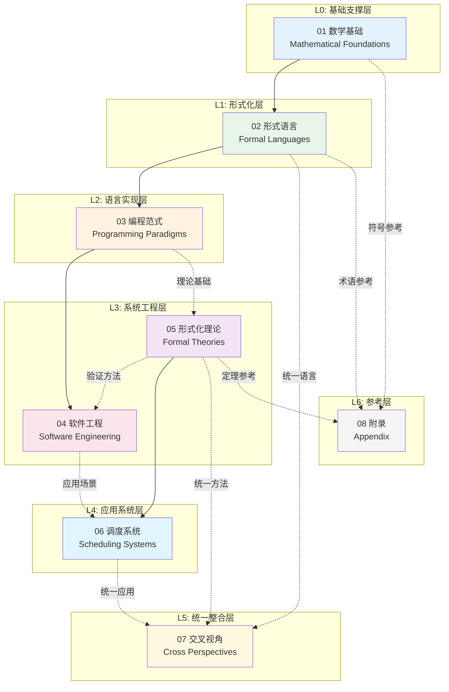

---

### 1.2 模块详细引用矩阵

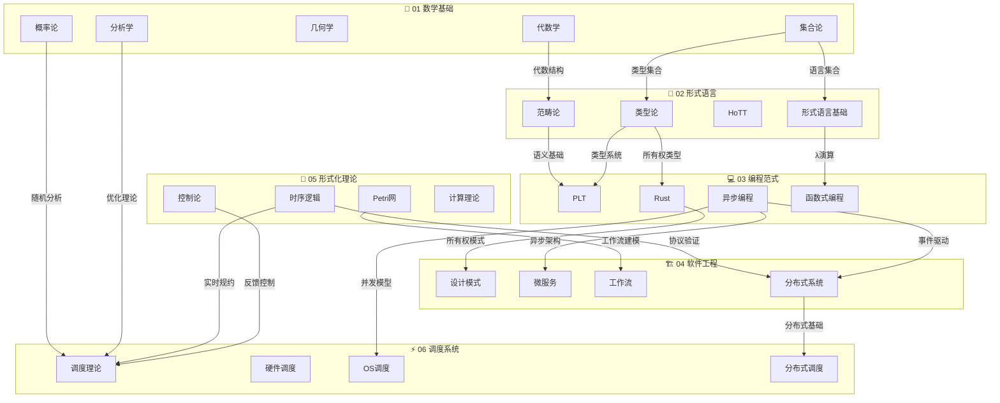

---

## 2. 模块间引用关系

### 2.1 引用强度热力图

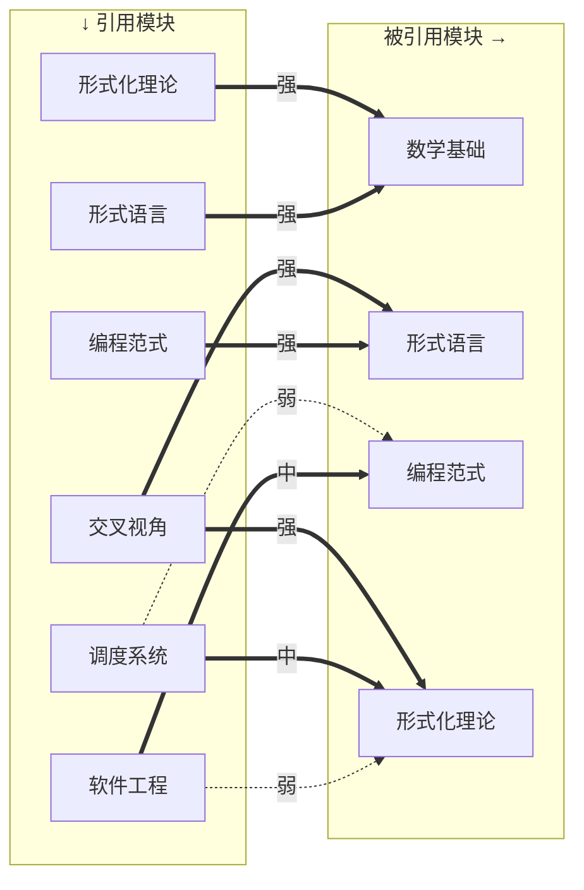

**引用强度说明:**

- **强引用**: 核心依赖，无此前置无法理解
- **中引用**: 重要参考，有替代路径
- **弱引用**: 辅助参考，非必需

---

### 2.2 模块耦合关系图

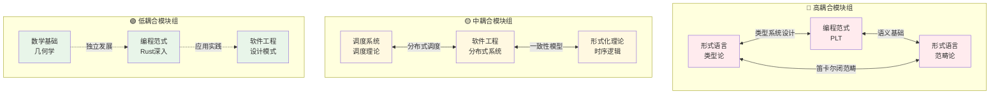

---

## 3. 数据流图

### 3.1 知识数据流全景

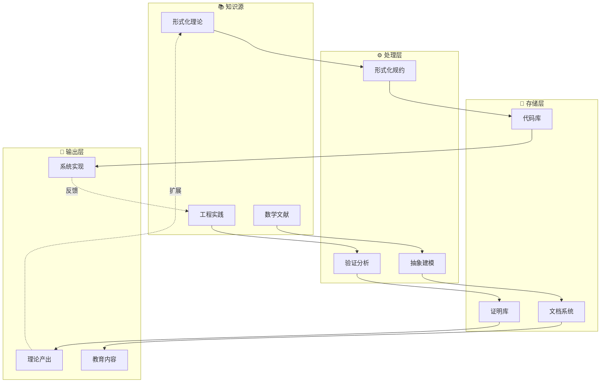

---

### 3.2 跨模块数据流

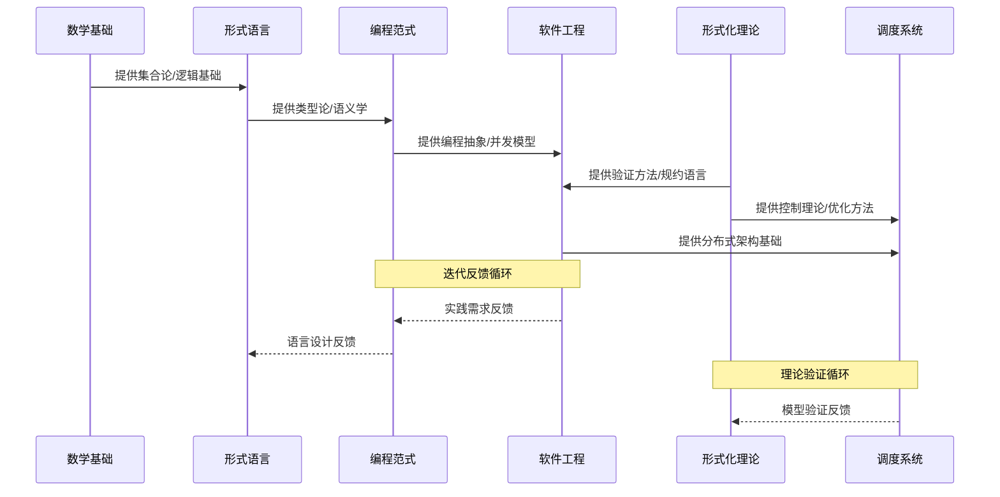

---

### 3.3 文档数据流向

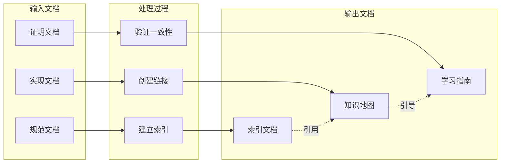

---

## 4. 概念映射图

### 4.1 数学-程序-系统映射

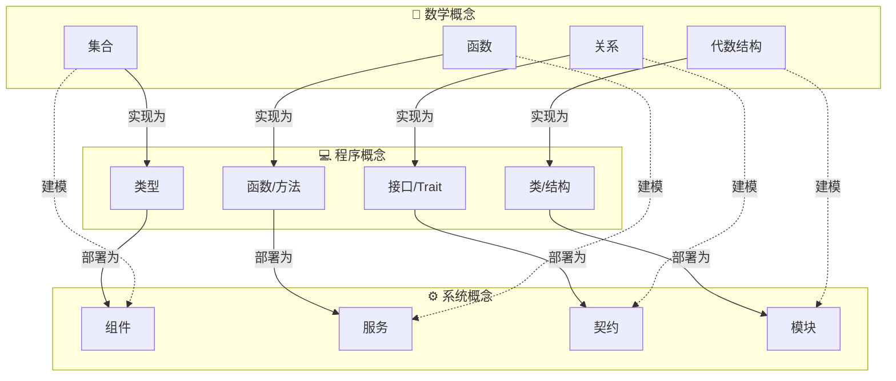

---

### 4.2 形式化层次映射

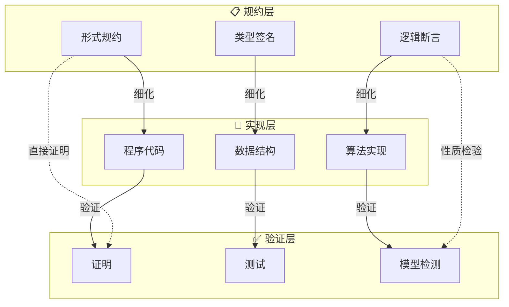

---

### 4.3 多视角概念对应

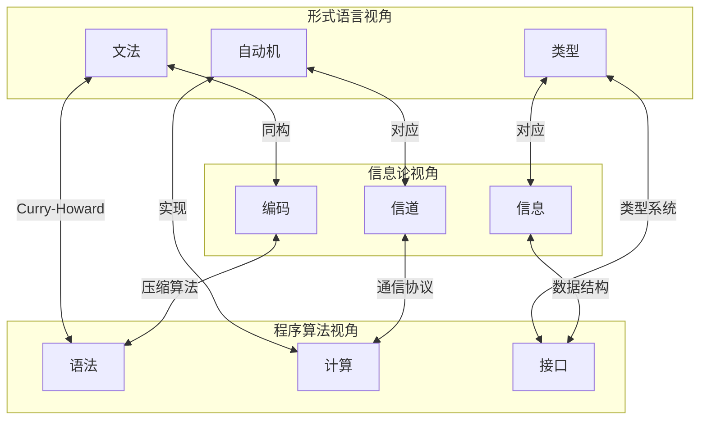

---

## 5. 模块接口与依赖

### 5.1 模块接口定义

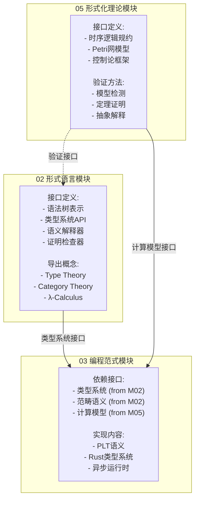

---

### 5.2 循环依赖分析

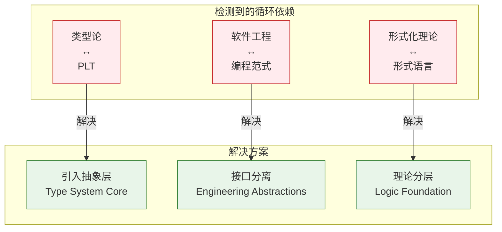

---

## 6. 模块演化关系

### 6.1 模块发展时间线

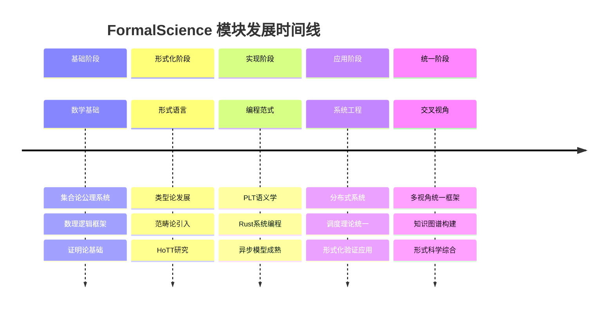

---

### 6.2 模块版本依赖

| 模块 | 当前版本 | 依赖模块 | 最小版本 |
|------|----------|----------|----------|
| 02 形式语言 | 1.0 | 01 数学基础 | 1.0 |
| 03 编程范式 | 1.0 | 02 形式语言 | 1.0 |
| 04 软件工程 | 1.0 | 03 编程范式 | 0.9 |
| 05 形式化理论 | 1.0 | 01 数学基础 | 0.9 |
| 06 调度系统 | 1.0 | 04 软件工程 | 0.8 |
| 06 调度系统 | 1.0 | 05 形式化理论 | 0.8 |
| 07 交叉视角 | 1.0 | 全部模块 | 1.0 |

---

## 交叉引用

### 相关文档

- [00_INDEX.md](../00_INDEX.md) - 模块文件索引
- [00_MAP.md](../00_MAP.md) - 知识地图
- [knowledge_graph.md](knowledge_graph.md) - 概念知识图谱
- [07_交叉视角/01_形式化方法统一](../07_交叉视角/01_形式化方法统一/) - 统一框架

### 模块详细文档

| 模块 | 索引 | README |
|------|------|--------|
| 01 数学基础 | [_index.md](../01_数学基础/_index.md) | - |
| 02 形式语言 | [_index.md](../02_形式语言/_index.md) | - |
| 03 编程范式 | [_index.md](../03_编程范式/_index.md) | [README.md](../03_编程范式/README.md) |
| 04 软件工程 | [_index.md](../04_软件工程/_index.md) | [README.md](../04_软件工程/README.md) |
| 05 形式化理论 | [_index.md](../05_形式化理论/_index.md) | - |
| 06 调度系统 | [_index.md](../06_调度系统/_index.md) | [README.md](../06_调度系统/README.md) |
| 07 交叉视角 | [_index.md](../07_交叉视角/_index.md) | - |
| 08 附录 | [_index.md](../08_附录/_index.md) | - |

---

**导航**: [⬆️ 返回顶部](#formalscience-模块关系图) | [📊 索引](README.md) | [🗺️ 知识图谱](knowledge_graph.md) | [📐 定理依赖](theorem_dependency.md) | [🎓 学习路径](learning_paths.md)
