# FormalScience 定理依赖图

> **项目**: FormalScience 重要定理依赖关系可视化
> **版本**: 1.0.0
> **最后更新**: 2026-04-11
> **图表总数**: 5

---

## 1. 核心定理依赖网络

### 1.1 形式科学核心定理依赖图

```mermaid
graph TB
    subgraph Foundation["🔵 基础公理层"]
        A1[ZFC公理系统]
        A2[Peano算术公理]
        A3[命题逻辑公理]
    end

    subgraph Basic["🟢 基础定理层"]
        B1[康托尔定理<br/>|ℝ| > |ℕ|]
        B2[哥德尔完备性定理]
        B3[紧致性定理]
    end

    subgraph Intermediate["🟡 中间定理层"]
        I1[哥德尔不完备定理]
        I2[Church-Rosser定理]
        I3[Knaster-Tarski<br/>不动点定理]
    end

    subgraph Advanced["🟠 高级定理层"]
        ADV1[Curry-Howard<br/>同构定理]
        ADV2[Yoneda引理]
        ADV3[Diaconescu定理]
    end

    subgraph Application["🔴 应用定理层"]
        APP1[类型安全定理]
        APP2[调度最优性<br/>EDF最优性]
        APP3[共识不可能性<br/>FLP结果]
    end

    %% 基础 → 基础定理
    A1 --> B1
    A2 --> B2
    A3 --> B3

    %% 基础定理 → 中间定理
    B2 --> I1
    A2 --> I1
    B3 --> I2
    B1 --> I3

    %% 中间定理 → 高级定理
    I1 --> ADV1
    I2 --> ADV1
    I3 --> ADV2
    A1 --> ADV3

    %% 高级定理 → 应用
    ADV1 --> APP1
    ADV2 --> APP2
    I1 --> APP3

    style Foundation fill:#e3f2fd
    style Basic fill:#e8f5e9
    style Intermediate fill:#fff3e0
    style Advanced fill:#fce4ec
    style Application fill:#ffebee
```

---

### 1.2 可计算性理论定理链

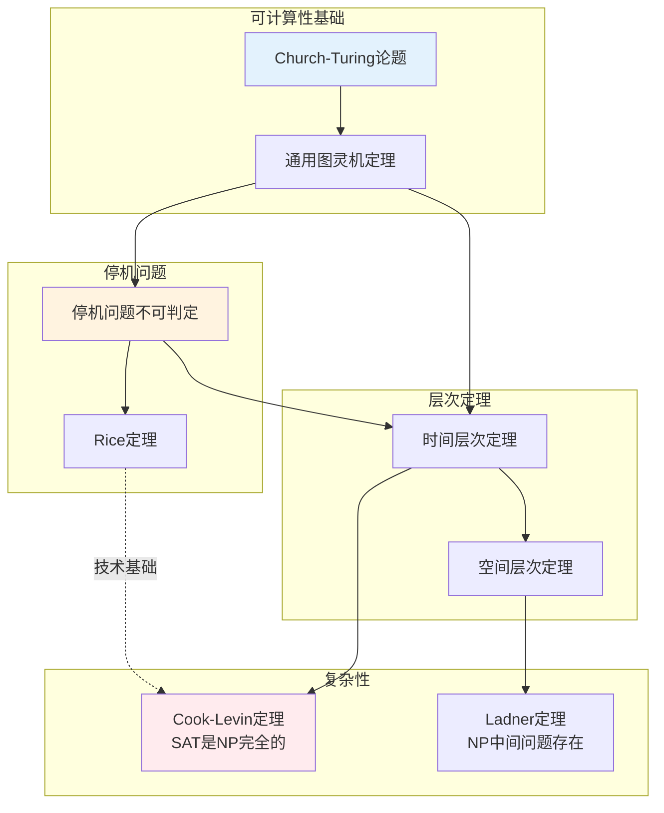

---

## 2. 证明链可视化

### 2.1 类型论核心证明链

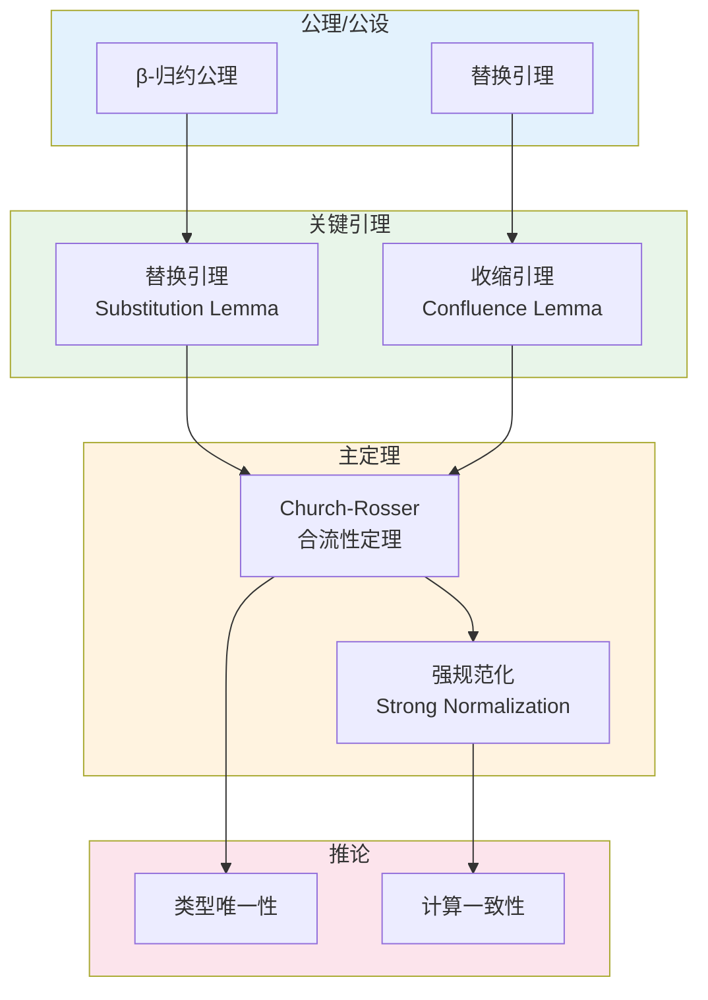

**证明链详解:**

| 步骤 | 定理/引理 | 作用 | 证明复杂度 |
|------|-----------|------|------------|
| 1 | β-归约公理 | 定义计算基础 | ★☆☆ |
| 2 | 替换引理 | 保持替换的正确性 | ★★☆ |
| 3 | 收缩引理 | 证明局部合流 | ★★★ |
| 4 | Church-Rosser | 全局合流性 | ★★★ |
| 5 | 强规范化 | 终止性保证 | ★★★★ |
| 6 | 类型唯一性 | 类型系统一致性 | ★★☆ |

---

### 2.2 调度理论证明链

```mermaid
flowchart LR
    subgraph Setup["问题设定"]
        S1[调度问题定义<br/>α|β|γ]
        S2[可行性条件]
    end

    subgraph Analysis["分析引理"]
        A1[关键 instant 引理]
        A2[最优性条件引理]
        A3[交换论证引理]
    end

    subgraph Theorem["主定理"]
        T1[EDF最优性定理]
        T2[RMS最优性定理]
    end

    subgraph Application["应用"]
        APP1[可调度性测试]
        APP2[利用率边界]
    end

    S1 --> S2
    S2 --> A1
    S2 --> A2
    A2 --> A3
    A1 --> T1
    A3 --> T1
    A2 --> T2
    T1 --> APP1
    T2 --> APP2

    style Setup fill:#e3f2fd
    style Analysis fill:#e8f5e9
    style Theorem fill:#fff3e0
    style Application fill:#c8e6c9
```

---

### 2.3 范畴论核心证明链

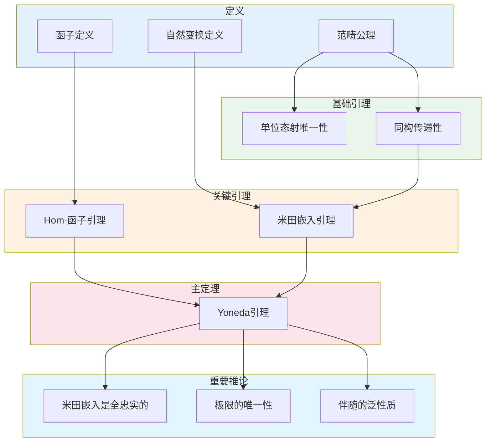

---

## 3. 关键引理标注

### 3.1 引理重要性分级

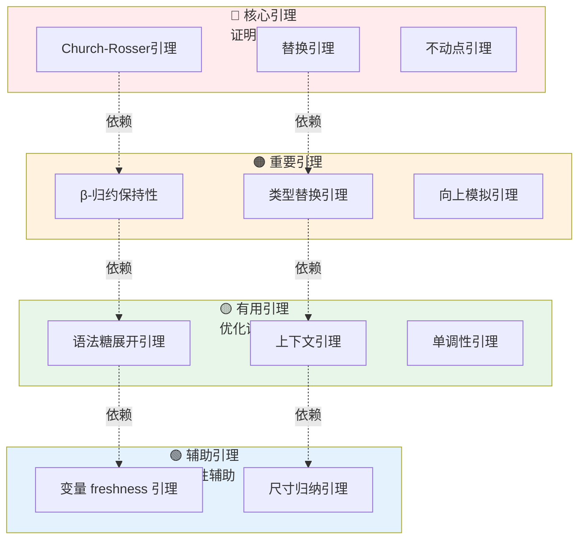

---

### 3.2 引理依赖网络（类型论示例）

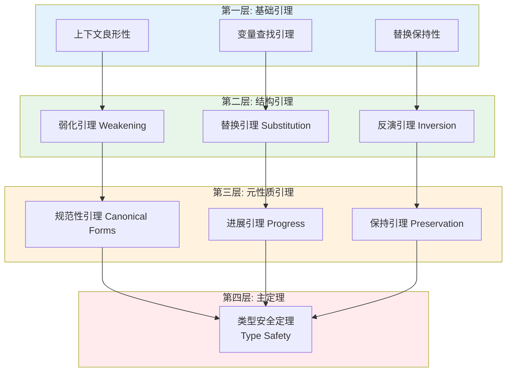

---

### 3.3 跨领域引理对应

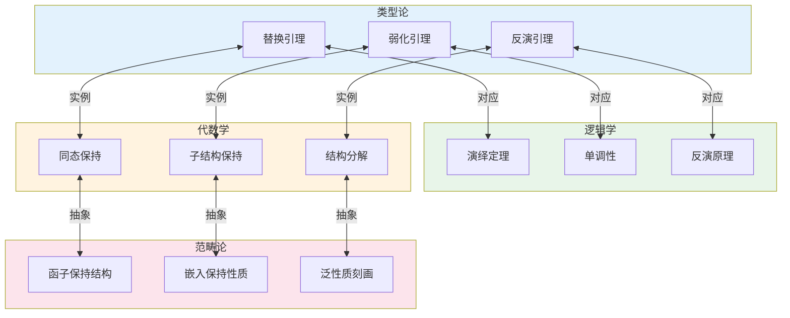

---

## 4. 定理分类层次

### 4.1 按领域分类的定理层次

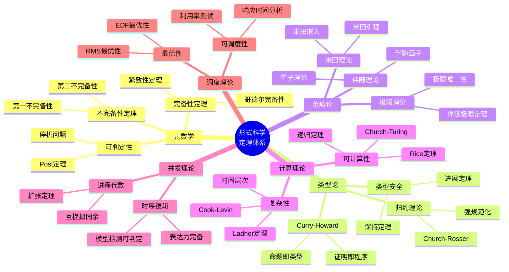

---

### 4.2 定理复杂度分层

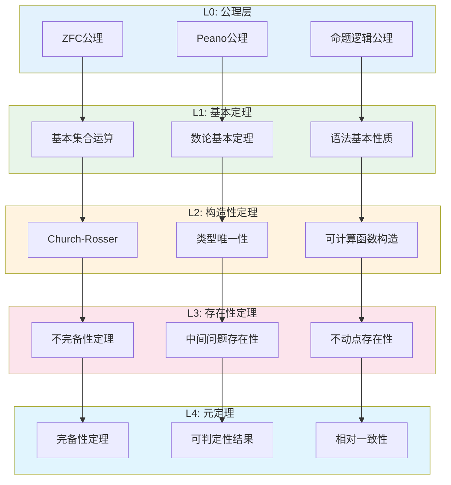

---

## 5. 证明复杂度分析

### 5.1 证明长度vs重要性

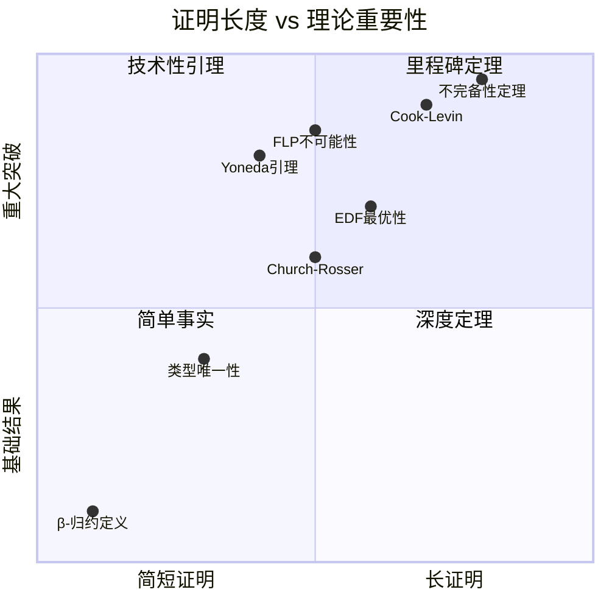

---

### 5.2 证明技术依赖

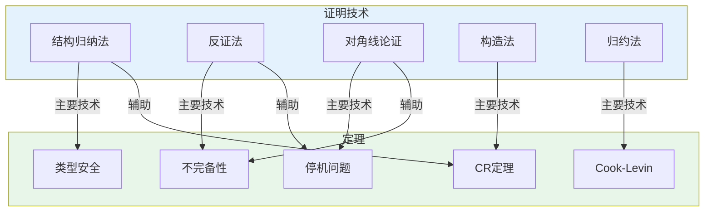

---

## 6. 定理索引与速查

### 6.1 核心定理速查表

| 定理名称 | 领域 | 前提条件 | 结论 | 证明复杂度 |
|----------|------|----------|------|------------|
| **Church-Rosser** | λ演算 | β-归约 | 合流性 | ★★★☆ |
| **Curry-Howard** | 类型论 | 直觉逻辑 | 命题≡类型 | ★★★☆ |
| **Yoneda** | 范畴论 | 局部小范畴 | Hom(A,-)嵌入 | ★★★★ |
| **不完备性** | 元数学 | ω-一致性 | 存在不可判定命题 | ★★★★★ |
| **Cook-Levin** | 复杂性 | 图灵机模型 | SAT是NP完全的 | ★★★★ |
| **EDF最优性** | 调度论 | 单处理器实时系统 | EDF是最优的 | ★★★☆ |
| **FLP不可能性** | 分布式 | 异步系统 | 确定性共识不可能 | ★★★★ |

### 6.2 证明关键路径

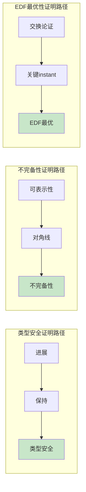

---

## 交叉引用

### 定理文档位置

| 定理 | 文档位置 | 相关引理 |
|------|----------|----------|
| Church-Rosser | [02_形式语言/01_形式语言基础/01.3_λ演算](../02_形式语言/01_形式语言基础/01.3_λ演算.md) | 替换引理、收缩引理 |
| Curry-Howard | [02_形式语言/02_类型论/02.4_类型论与逻辑](../02_形式语言/02_类型论/02.4_类型论与逻辑.md) | 命题嵌入、类型构造 |
| Yoneda引理 | [02_形式语言/04_范畴论/04.1_范畴基本概念](../02_形式语言/04_范畴论/04.1_范畴基本概念.md) | 米田嵌入引理 |
| EDF最优性 | [06_调度系统/01_调度理论基础](../06_调度系统/01_调度理论基础/) | 交换引理、关键instant |

### 相关文档

- [08_附录/03_索引/03.2_定理索引](../08_附录/03_索引/03.2_定理索引.md) - 完整定理清单
- [08_附录/02_符号表](../08_附录/02_符号表/) - 符号约定
- [knowledge_graph.md](knowledge_graph.md) - 概念知识图谱
- [module_relations.md](module_relations.md) - 模块关系

---

**导航**: [⬆️ 返回顶部](#formalscience-定理依赖图) | [📊 索引](README.md) | [🗺️ 知识图谱](knowledge_graph.md) | [🔧 模块关系](module_relations.md) | [🎓 学习路径](learning_paths.md)
