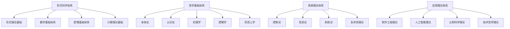
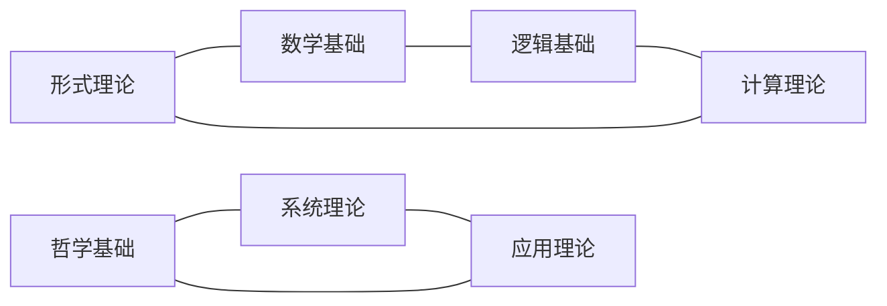
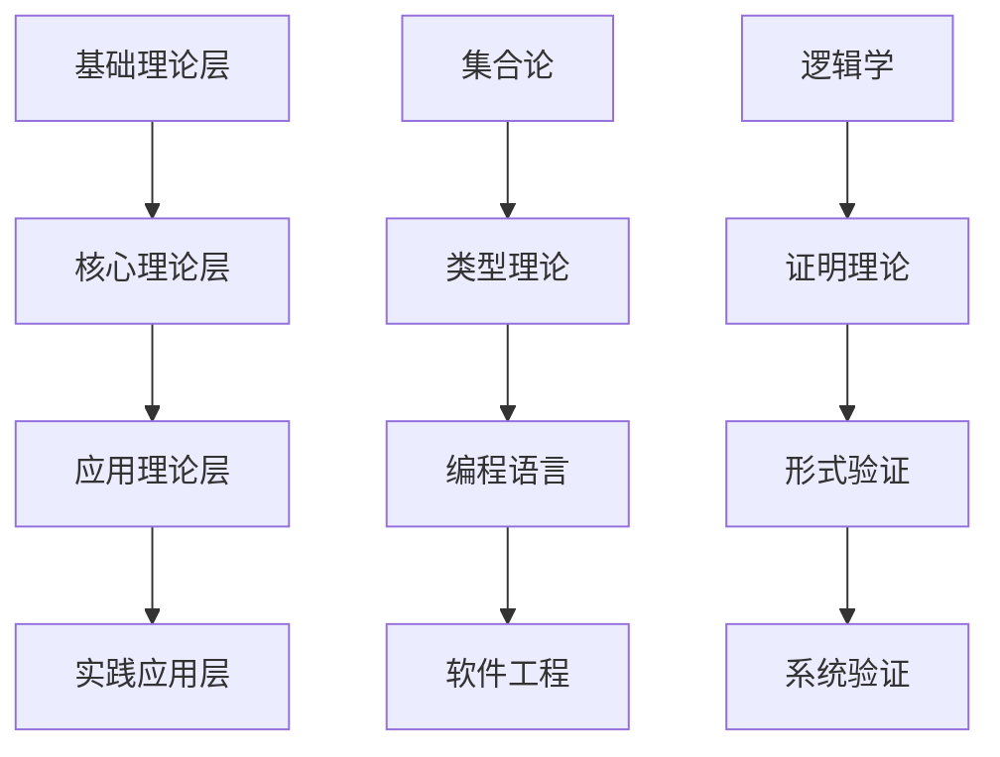

# 主题分类体系 - 哲科批判重构

## 概述

本文档建立了完整的主题分类体系，用于对 `/docs` 目录下的所有内容进行系统性的分类、梳理和重构。该体系基于哲学科学批判分析，确保内容的学术规范性、一致性和完整性。

## 1. 核心主题分类框架

### 1.1 一级主题分类



### 1.2 二级主题分类

#### 1.2.1 形式理论基础 (A1)

**A1.1 类型理论**

- 基础类型理论
- 线性类型理论
- 仿射类型理论
- 时态类型理论
- 依赖类型理论
- 量子类型理论

**A1.2 形式语言理论**

- 自动机理论
- 语法理论
- 语义理论
- 语用理论
- 计算语言学

**A1.3 形式系统理论**

- 公理化系统
- 证明系统
- 模型理论
- 递归理论

#### 1.2.2 数学基础体系 (A2)

**A2.1 基础数学**

- 集合论
- 数系理论
- 逻辑基础
- 关系理论

**A2.2 代数结构**

- 群论
- 环论
- 域论
- 线性代数
- 范畴论

**A2.3 几何结构**

- 欧氏几何
- 拓扑学
- 微分几何
- 代数几何

**A2.4 分析结构**

- 微积分
- 实分析
- 复分析
- 泛函分析

**A2.5 数论与概率**

- 初等数论
- 代数数论
- 概率论
- 统计学

#### 1.2.3 逻辑基础体系 (A3)

**A3.1 经典逻辑**

- 命题逻辑
- 谓词逻辑
- 模态逻辑
- 时态逻辑

**A3.2 非经典逻辑**

- 直觉主义逻辑
- 模糊逻辑
- 多值逻辑
- 非单调逻辑

**A3.3 哲学逻辑**

- 认识逻辑
- 道义逻辑
- 信念逻辑
- 意图逻辑

#### 1.2.4 计算理论基础 (A4)

**A4.1 可计算性理论**

- 图灵机理论
- 递归函数理论
- λ演算理论
- 计算复杂性理论

**A4.2 算法理论**

- 算法设计
- 算法分析
- 算法优化
- 分布式算法

### 1.3 哲学基础体系 (B)

#### 1.3.1 本体论 (B1)

- 数学本体论
- 现实本体论
- 信息本体论
- AI本体论

#### 1.3.2 认识论 (B2)

- 知识论
- 真理理论
- 知识来源
- 知识结构

#### 1.3.3 伦理学 (B3)

- 规范伦理学
- 元伦理学
- 应用伦理学
- 形式化伦理学

#### 1.3.4 逻辑学 (B4)

- 形式逻辑
- 哲学逻辑
- 非经典逻辑
- 逻辑哲学

#### 1.3.5 形而上学 (B5)

- 存在论
- 模态形而上学
- 时间与空间
- 因果性

### 1.4 系统理论体系 (C)

#### 1.4.1 控制论 (C1)

- 线性控制理论
- 非线性控制理论
- 最优控制理论
- 自适应控制理论

#### 1.4.2 信息论 (C2)

- 香农信息论
- 算法信息论
- 语义信息论
- 量子信息论

#### 1.4.3 系统论 (C3)

- 一般系统论
- 复杂系统理论
- 自组织理论
- 涌现理论

#### 1.4.4 复杂性理论 (C4)

- 计算复杂性
- 算法复杂性
- 系统复杂性
- 认知复杂性

### 1.5 应用理论体系 (D)

#### 1.5.1 软件工程理论 (D1)

- 编程语言理论
- 软件架构理论
- 软件验证理论
- 软件测试理论

#### 1.5.2 人工智能理论 (D2)

- 机器学习理论
- 知识表示理论
- 推理理论
- 认知架构理论

#### 1.5.3 认知科学理论 (D3)

- 认知心理学
- 认知神经科学
- 认知语言学
- 认知计算

#### 1.5.4 技术哲学理论 (D4)

- AI哲学
- 计算哲学
- 信息哲学
- 网络哲学

## 2. 主题关联关系

### 2.1 横向关联



### 2.2 纵向关联



## 3. 内容重构原则

### 3.1 分类原则

1. **主题相关性**: 按主题内容进行分类
2. **逻辑层次性**: 按理论层次进行组织
3. **历史发展性**: 考虑理论的历史发展脉络
4. **应用导向性**: 考虑实际应用需求

### 3.2 重构原则

1. **避免重复**: 消除重复和冗余内容
2. **保持一致性**: 确保术语、符号、格式一致
3. **增强关联性**: 建立清晰的内容关联
4. **提高可读性**: 改善文档结构和表达

### 3.3 质量保证

1. **形式化规范**: 使用严格的数学符号和格式
2. **证明完整性**: 提供完整的证明过程
3. **引用准确性**: 确保引用准确和完整
4. **结构清晰性**: 建立清晰的文档结构

## 4. 重构目录结构

### 4.1 一级目录

```
/docs/Refactor/
├── 01-形式理论基础体系/
├── 02-数学基础体系/
├── 03-逻辑基础体系/
├── 04-计算理论基础体系/
├── 05-哲学基础体系/
├── 06-系统理论体系/
├── 07-应用理论体系/
├── 08-跨学科整合理论/
└── 09-元理论与方法论/
```

### 4.2 二级目录示例

```
01-形式理论基础体系/
├── 01-类型理论/
├── 02-形式语言理论/
├── 03-形式系统理论/
└── 04-统一形式理论/

02-数学基础体系/
├── 01-基础数学/
├── 02-代数结构/
├── 03-几何结构/
├── 04-分析结构/
└── 05-数论与概率/
```

## 5. 内容映射关系

### 5.1 源文件到目标目录的映射

| 源目录 | 源文件类型 | 目标目录 | 重构策略 |
|--------|------------|----------|----------|
| `/docs/Theory/` | 类型理论文件 | `01-形式理论基础体系/01-类型理论/` | 按类型系统分类 |
| `/docs/Theory/` | 系统理论文件 | `06-系统理论体系/` | 按系统类型分类 |
| `/docs/Philosophy/` | 哲学内容文件 | `05-哲学基础体系/` | 按哲学分支分类 |
| `/docs/Mathematics/` | 数学内容文件 | `02-数学基础体系/` | 按数学分支分类 |
| `/docs/FormalLanguage/` | 形式语言文件 | `01-形式理论基础体系/02-形式语言理论/` | 按语言理论分类 |
| `/docs/FormalModel/` | 建模理论文件 | `07-应用理论体系/` | 按应用领域分类 |

### 5.2 内容整合策略

1. **重复内容合并**: 将重复内容合并为单一文档
2. **关联内容链接**: 建立内容间的交叉引用
3. **层次内容组织**: 按理论层次组织内容
4. **应用内容分离**: 将理论内容与应用内容分离

## 6. 实施计划

### 6.1 第一阶段：内容分析

- [x] 目录结构探索
- [x] 内容概览分析
- [ ] 深度内容分析
- [ ] 重复内容识别
- [ ] 关联关系分析

### 6.2 第二阶段：主题分类

- [ ] 建立分类体系
- [ ] 内容分类映射
- [ ] 目录结构设计
- [ ] 重构计划制定

### 6.3 第三阶段：内容重构

- [ ] 创建目标目录
- [ ] 内容迁移重构
- [ ] 格式规范化
- [ ] 关联关系建立

### 6.4 第四阶段：质量保证

- [ ] 一致性检查
- [ ] 完整性验证
- [ ] 可读性优化
- [ ] 最终审查

---

**创建时间**: 2024-12-19
**版本**: v1.0
**状态**: 进行中
