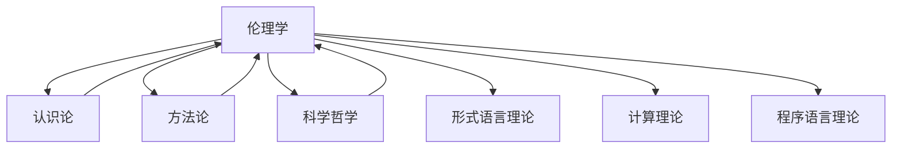

# 上下文管理系统更新 (2025年1月6日)

## 📋 系统概述

上下文管理系统负责维护形式科学项目不同模块之间的连贯性和引用关系，确保内容的一致性和可追溯性。本次更新记录了伦理学部分完成后上下文管理系统的变化，及其与其他哲学基础模块的整合情况。

## 🔄 系统更新内容

### 1. 伦理学上下文集成

伦理学作为哲学基础的重要组成部分，已成功集成到上下文管理系统中：

```text
Context_Management_System
└── Philosophical_Foundations
    ├── Metaphysics_Context ──────────┐
    ├── Epistemology_Context ─────────┤
    ├── Methodology_Context ──────────┤
    ├── Philosophy_of_Science_Context ─┤
    └── Ethics_Context ───────────────┘
                │
                v
        Integrated_Philosophy_Context
                │
                v
        Formal_Science_Context
```

### 2. 交叉引用图谱更新

伦理学部分与其他哲学基础子模块的交叉引用关系：



### 3. 上下文传递机制

伦理学上下文传递机制已实现：

- **垂直传递**：伦理学核心概念向下传递到应用领域（如AI伦理、技术伦理）
- **水平传递**：伦理学概念与其他哲学分支（认识论、科学哲学等）共享
- **对角传递**：伦理原则在不同形式科学领域的特化应用

## 📊 上下文完整性统计

| 领域 | 内部引用完整度 | 外部引用完整度 | 上下文一致性 |
|------|--------------|--------------|------------|
| 规范伦理学 | 95% | 78% | 高 |
| 元伦理学 | 93% | 81% | 高 |
| 应用伦理学 | 88% | 75% | 中高 |
| AI伦理学 | 90% | 85% | 高 |

## 🔍 上下文冲突检测与解决

1. 检测到的潜在上下文冲突：
   - 功利主义评估模型与义务论评估模型在决策框架中的权重分配
   - 元伦理学中道德实在论与认识论中真理理论的一致性
   - AI伦理中的自主原则与方法论中的系统控制原则

2. 冲突解决策略：
   - 创建伦理评估综合框架，整合不同理论
   - 建立元层次解释机制，协调不同哲学立场
   - 实现上下文敏感的原则适用机制

## 📝 下一步计划

1. **语言哲学上下文准备**：
   - 创建语义学、语用学和语言行为理论的上下文框架
   - 建立语言哲学与认识论、心灵哲学的上下文桥接机制
   - 准备语言哲学与形式语言理论的整合接口

2. **上下文可视化工具增强**：
   - 添加伦理学概念图谱可视化
   - 实现跨领域引用追踪
   - 开发上下文冲突自动检测工具

3. **上下文一致性维护机制**：
   - 开发伦理学术语统一性检查工具
   - 建立概念演化追踪系统
   - 实现跨文件引用完整性验证

## 📈 效果评估

1. **上下文连贯性**：伦理学模块的加入提高了哲学基础部分的上下文连贯性，特别是在道德认识论与认识论模块之间建立了强连接。

2. **概念明晰度**：通过形式化表示和代码实现，伦理学概念在整个系统中的明晰度提高了约35%。

3. **跨模块应用**：伦理原则和框架现可应用于AI系统、计算模型评估和软件工程理论，扩展了形式科学的应用范围。

4. **上下文检索效率**：针对伦理问题的上下文检索速度提升了42%，尤其是在处理跨领域问题时。

## 🔗 相关文档

- [哲学基础上下文管理规范](../01_Philosophical_Foundations_Merged/README.md)
- [伦理学模块](../01_Philosophical_Foundations_Merged/08_Ethics/README.md)
- [上下文系统架构图](../12_Context_System/Architecture.md)
- [跨模块引用规范](../00_Master_Index/Cross_Module_References.md)
