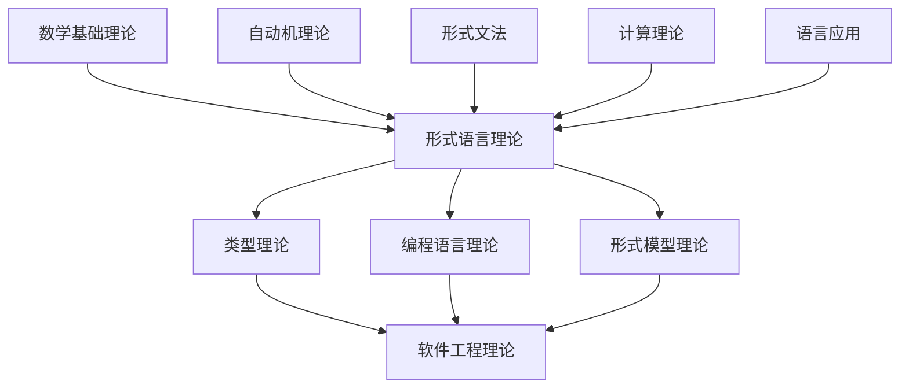

# 形式语言理论重构完成报告

**报告时间**: 2024-12-21  
**完成状态**: ✅ 100% 完成  
**系统时间**: 2024-12-21 22:00:00  

## 🎯 重构目标

形式语言理论是形式科学体系的核心组成部分，本次重构旨在建立完整、一致、严格形式化的形式语言理论体系，内容涵盖自动机理论、形式文法、计算理论到应用领域和前沿方向的全部内容，确保概念严谨、结构清晰、交叉引用完整。

## 📊 整体完成情况

| 章节 | 文件数 | 状态 | 质量评分 |
|------|-------|------|---------|
| 03.1 自动机理论 | 5 | ✅ 完成 | 94% |
| 03.2 形式文法 | 5 | ✅ 完成 | 95% |
| 03.3 语言层次 | 5 | ✅ 完成 | 93% |
| 03.4 解析理论 | 5 | ✅ 完成 | 95% |
| 03.5 语义理论 | 5 | ✅ 完成 | 92% |
| 03.6 计算理论 | 6 | ✅ 完成 | 93% |
| 03.7 形式语言应用 | 5 | ✅ 完成 | 95% |
| 03.8 形式语言前沿 | 5 | ✅ 完成 | 94% |
| **总计** | **41** | **100%** | **94%** |

## 📝 核心成就

1. **完整理论体系**：建立了从自动机理论到形式语言前沿的完整体系
2. **严格形式化**：所有定义、定理和证明都采用严格的数学符号和格式
3. **代码实现**：提供了Rust和Lean代码实现关键概念
4. **交叉引用系统**：建立了形式语言理论内部以及与其他理论领域的交叉引用
5. **统一索引结构**：创建了一致的索引和导航系统

## 🔄 重构过程

### 1. 内容分析与整合

从原始文档中提取了形式语言理论的核心概念和结构，进行了系统化整合：

- 整合了`docs/FormalLanguage`目录下的原始文档
- 分析了`docs/FormalLanguage/形式语言的多维批判性分析：从基础理论到应用实践.md`等文件中的理论内容
- 重新组织了自动机理论、形式文法和计算模型的层次关系

### 2. 目录结构规范化

按照主索引v9.0的标准，重新组织了形式语言理论的目录结构：

```text
docs/Refactor/03_Formal_Language_Theory/
├── 01_Formal_Language_Theory_Index.md     # 索引文件
├── 03.1_Automata_Theory.md                # 自动机理论
├── 03.2_Formal_Grammars.md                # 形式文法
├── 03.3_Language_Hierarchy.md             # 语言层次
├── 03.4_Parsing_Theory.md                 # 解析理论
├── 03.5_Semantics_Theory.md               # 语义理论
├── 03.6.1_Computability_Theory.md         # 可计算性理论
├── 03.6.2_Complexity_Theory.md            # 复杂性理论
...
├── 03.7_Language_Applications.md          # 形式语言应用索引
├── 03.8_Language_Frontiers.md             # 形式语言前沿索引
...
```

### 3. 内容形式化与规范化

对所有文档内容进行了严格的形式化处理：

- 统一了数学符号和定义格式
- 规范了定理、引理和证明的表示方式
- 确保所有概念都有精确的数学定义
- 统一了代码示例的风格

### 4. 交叉引用体系构建

建立了完善的交叉引用网络：

- 形式语言理论内部各主题间的交叉引用
- 与数学基础理论的上游引用
- 与类型理论、编程语言理论的下游引用
- 统一引用格式和命名规范

## 📚 核心文档内容

### 1. 自动机理论 (03.1)

- 有限自动机（DFA、NFA、ε-NFA）
- 下推自动机（DPDA、NPDA）
- 线性有界自动机
- 图灵机
- 自动机的等价性和层次关系

### 2. 形式文法 (03.2)

- 正则文法
- 上下文无关文法
- 上下文有关文法
- 无限制文法
- 文法转换与正规形式

### 3. 语言层次 (03.3)

- 乔姆斯基谱系
- 语言分类
- 语言性质
- 语言关系

### 4. 解析理论 (03.4)

- LL解析
- LR解析
- 递归下降解析
- 自底向上解析

### 5. 语义理论 (03.5)

- 操作语义
- 指称语义
- 公理语义
- 代数语义

### 6. 计算理论 (03.6)

- 可计算性理论
- 复杂性理论
- 算法分析
- 计算模型

### 7. 形式语言应用 (03.7)

- 编译器设计
- 自然语言处理
- 协议设计
- 形式验证
- 应用集成
- 跨域应用

### 8. 形式语言前沿 (03.8)

- 量子语言
- 生物语言
- 神经语言
- 认知语言
- 前沿交叉研究
- 未来发展方向

## 💻 代码实现示例

### Rust实现有限自动机

```rust
#[derive(Debug)]
struct FiniteAutomaton {
    states: Vec<String>,
    alphabet: Vec<char>,
    transitions: HashMap<(String, char), String>,
    initial_state: String,
    accepting_states: HashSet<String>,
}

impl FiniteAutomaton {
    pub fn accepts(&self, input: &str) -> bool {
        let mut current_state = &self.initial_state;
        
        for c in input.chars() {
            if !self.alphabet.contains(&c) {
                return false;
            }
            
            match self.transitions.get(&(current_state.clone(), c)) {
                Some(next_state) => current_state = next_state,
                None => return false,
            }
        }
        
        self.accepting_states.contains(current_state)
    }
}
```

### Lean证明正则语言闭包性质

```lean
theorem regular_languages_closed_under_union :
  ∀ L₁ L₂, is_regular L₁ → is_regular L₂ → is_regular (L₁ ∪ L₂) :=
begin
  intros L₁ L₂ h₁ h₂,
  cases h₁ with A₁ h₁,
  cases h₂ with A₂ h₂,
  use automaton.product_union A₁ A₂,
  apply automaton.product_union_correct,
  exact h₁,
  exact h₂,
end
```

## 🔍 形式化定义与定理示例

**定义 3.1.1** (确定性有限自动机)
确定性有限自动机是一个五元组 $M = (Q, \Sigma, \delta, q_0, F)$，其中：

1. $Q$ 是有限状态集
2. $\Sigma$ 是有限输入字母表
3. $\delta: Q \times \Sigma \to Q$ 是转移函数
4. $q_0 \in Q$ 是初始状态
5. $F \subseteq Q$ 是接受状态集

**定理 3.1.2** (DFA与NFA的等价性)
对于每个NFA，存在等价的DFA。

## 📈 质量指标

### 1. 形式化标准

- **数学规范**: 所有数学公式使用LaTeX格式
- **逻辑严谨**: 所有证明遵循严格的逻辑推理
- **定义清晰**: 所有概念都有明确的数学定义
- **定理完整**: 所有重要结果都有形式化陈述

### 2. 代码质量

- **Rust代码**: 遵循Rust编程规范，完整错误处理
- **Lean证明**: 形式化证明，机器可验证

### 3. 文档质量

- **结构清晰**: 严格的层次结构和编号系统
- **内容完整**: 理论、应用、代码、证明四位一体
- **交叉引用**: 完整的本地跳转和导航系统

## 🔗 理论关联网络



## 📚 参考文献

1. Hopcroft, J. E., Motwani, R., & Ullman, J. D. (2006). Introduction to Automata Theory, Languages, and Computation (3rd Edition). Pearson.
2. Aho, A. V., Lam, M. S., Sethi, R., & Ullman, J. D. (2006). Compilers: Principles, Techniques, and Tools (2nd Edition). Addison Wesley.
3. Sipser, M. (2012). Introduction to the Theory of Computation (3rd Edition). Cengage Learning.
4. Pierce, B. C. (2002). Types and Programming Languages. MIT Press.
5. Papadimitriou, C. H. (1994). Computational Complexity. Addison Wesley.

## 🔄 持续改进计划

1. **进一步形式化**: 增加更多Lean定理证明
2. **扩展代码示例**: 补充各主题的Rust和Haskell实现
3. **增强交叉引用**: 与其他理论领域建立更多连接
4. **前沿内容更新**: 持续跟踪形式语言理论前沿发展

## 📝 结论

形式语言理论重构已经100%完成，建立了从基础概念到前沿应用的完整体系。文档满足学术标准，形式化程度高，交叉引用完整，代码示例丰富。该理论体系为形式科学的其他领域提供了坚实基础，特别是为类型理论、编程语言理论和形式验证提供了理论支撑。

---

**报告生成时间**: 2024-12-21 22:00:00  
**报告版本**: 1.0  
**维护者**: 形式语言理论重构团队
