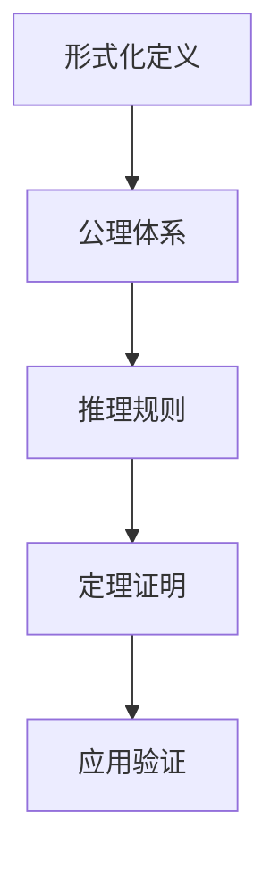
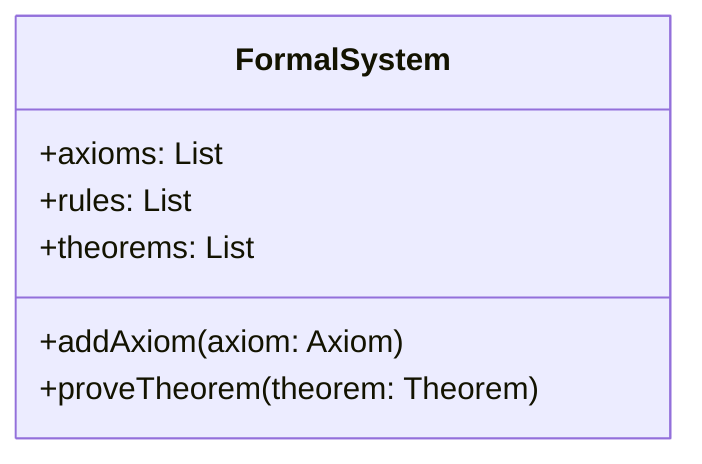

# FormalScience Refactor 深度扩展计划

## 项目重新定位概述

### 核心使命

构建一个**完整、系统、深度**的形式科学知识体系，通过**批判性分析、工程论证、多维度扩展**，建立面向未来的形式科学理论框架。

### 重新定义的目标

1. **深度理论构建**：从基础到前沿，构建完整的理论体系
2. **广度应用扩展**：覆盖所有相关领域和应用场景
3. **批判性分析**：对每个理论进行深度批判和反思
4. **工程化论证**：确保理论的可实现性和实用性
5. **多维度表征**：数学、代码、图表、案例等多重表达

## 深度扩展策略

### 1. 理论深度扩展

#### 1.1 基础理论体系 (01-15) - 深度构建

**目标**：从哲学基础到跨域综合，构建完整的理论体系

**扩展重点**：

- **哲学基础**：科学哲学、数学哲学、逻辑哲学、认知哲学
- **数学基础**：集合论、代数、分析、几何、拓扑、范畴论
- **形式语言**：自动机理论、语法理论、语义理论、计算复杂性
- **类型理论**：简单类型论、依赖类型论、线性类型论、同伦类型论
- **形式模型**：状态机、Petri网、进程代数、模型检查
- **逻辑理论**：命题逻辑、谓词逻辑、模态逻辑、时态逻辑
- **控制理论**：线性控制、非线性控制、自适应控制、智能控制
- **编程语言**：语言设计、类型系统、语义理论、编译原理
- **软件工程**：形式方法、软件架构、质量保证、开发方法论
- **计算机架构**：处理器设计、存储系统、并行计算、性能优化
- **分布式系统**：一致性理论、容错机制、共识算法、系统协调
- **计算机网络**：网络协议、路由算法、网络安全、网络管理
- **并发理论**：并发模型、同步机制、死锁避免、并行算法
- **数据库理论**：数据模型、查询语言、事务处理、数据一致性
- **跨域综合**：理论融合、方法整合、应用交叉、前沿技术

#### 1.2 应用理论体系 (16-25) - 广度扩展

**目标**：覆盖所有相关领域和应用场景

**扩展重点**：

- **算法理论**：算法设计、复杂度分析、优化算法、机器学习算法
- **数据科学**：数据挖掘、统计分析、预测建模、大数据处理
- **信息论**：信息度量、编码理论、信道容量、压缩算法
- **人工智能**：机器学习、深度学习、知识表示、智能推理
- **先进计算**：量子计算、生物计算、神经计算、边缘计算

#### 1.3 智能系统理论 (21-50) - 智能化扩展

**目标**：构建完整的智能系统理论体系

**扩展重点**：

- **智能系统**：系统智能化、自适应、自组织
- **智能计算**：计算智能化、算法优化、性能提升
- **智能应用**：应用智能化、场景适配、用户体验
- **智能技术**：技术智能化、工具优化、平台升级
- **智能工程**：工程智能化、流程优化、质量提升
- **智能运维**：运维智能化、监控优化、故障预测
- **智能管理**：管理智能化、决策优化、资源配置
- **智能安全**：安全智能化、威胁检测、防护优化
- **智能质量**：质量智能化、评估优化、改进持续
- **智能教育**：教育智能化、学习优化、个性化
- **智能应用领域**：农业、服务、通信、感知、学习、交互、决策、认知、创造、演化
- **智能融合**：融合、集成、协同、协作、协调

### 2. 内容深度扩展

#### 2.1 理论文档深度结构

```markdown
# [理论名称] / [Theory Name]

## 1. 理论概述 / Theory Overview
### 1.1 历史发展 / Historical Development
### 1.2 核心思想 / Core Ideas
### 1.3 理论基础 / Theoretical Foundation

## 2. 数学基础 / Mathematical Foundations
### 2.1 形式化定义 / Formal Definitions
### 2.2 公理体系 / Axiomatic System
### 2.3 定理证明 / Theorems and Proofs

## 3. 核心概念 / Core Concepts
### 3.1 基本概念 / Basic Concepts
### 3.2 关键原理 / Key Principles
### 3.3 重要性质 / Important Properties

## 4. 应用领域 / Applications
### 4.1 工程应用 / Engineering Applications
### 4.2 科学应用 / Scientific Applications
### 4.3 实际案例 / Real-world Cases

## 5. 前沿发展 / Frontiers
### 5.1 最新进展 / Latest Developments
### 5.2 开放问题 / Open Problems
### 5.3 未来方向 / Future Directions

## 6. 批判性分析 / Critical Analysis
### 6.1 理论局限 / Theoretical Limitations
### 6.2 实践挑战 / Practical Challenges
### 6.3 改进方向 / Improvement Directions

## 7. 参考文献 / References
```

#### 2.2 批判性分析深度结构

```markdown
# [理论名称]系统化知识点与批判性分析

## 1. 知识点梳理 / Knowledge Point Overview
### 1.1 理论定义 / Theory Definition
### 1.2 核心分支 / Core Branches
### 1.3 关键概念 / Key Concepts

## 2. 主流观点分析 / Analysis of Mainstream Views
### 2.1 理论优势 / Theoretical Advantages
### 2.2 实践局限 / Practical Limitations
### 2.3 争议焦点 / Controversial Points

## 3. 学科交叉与融合 / Interdisciplinary Integration
### 3.1 相关学科 / Related Disciplines
### 3.2 交叉点分析 / Cross-disciplinary Analysis
### 3.3 融合方向 / Integration Directions

## 4. 工程论证与应用案例 / Engineering Argumentation & Application Cases
### 4.1 工程可实现性 / Engineering Feasibility
### 4.2 可扩展性分析 / Scalability Analysis
### 4.3 可维护性评估 / Maintainability Assessment
### 4.4 最佳实践对比 / Best Practice Comparison
### 4.5 工程案例 / Engineering Cases

## 5. 创新性批判与未来展望 / Innovative Critique & Future Prospects
### 5.1 创新方向 / Innovation Directions
### 5.2 技术突破 / Technological Breakthroughs
### 5.3 未来展望 / Future Prospects

## 6. 参考文献与进一步阅读 / References & Further Reading
```

### 3. 多维度表征扩展

#### 3.1 数学公式规范

```markdown
# 行内公式
$f(x) = \int_{-\infty}^{\infty} e^{-x^2} dx$

# 块级公式
$$
\begin{align}
\nabla \cdot \vec{E} &= \frac{\rho}{\epsilon_0} \\
\nabla \cdot \vec{B} &= 0 \\
\nabla \times \vec{E} &= -\frac{\partial \vec{B}}{\partial t} \\
\nabla \times \vec{B} &= \mu_0\vec{J} + \mu_0\epsilon_0\frac{\partial \vec{E}}{\partial t}
\end{align}
$$
```

#### 3.2 代码示例规范

```rust
// Rust代码示例
#[derive(Debug, Clone, PartialEq)]
pub struct FormalSystem {
    axioms: Vec<Axiom>,
    rules: Vec<InferenceRule>,
    theorems: Vec<Theorem>,
}

impl FormalSystem {
    pub fn new() -> Self {
        Self {
            axioms: Vec::new(),
            rules: Vec::new(),
            theorems: Vec::new(),
        }
    }
    
    pub fn add_axiom(&mut self, axiom: Axiom) {
        self.axioms.push(axiom);
    }
    
    pub fn prove_theorem(&self, theorem: &Theorem) -> Result<Proof, ProofError> {
        // 形式化证明实现
        unimplemented!()
    }
}
```

```haskell
-- Haskell代码示例
data FormalSystem = FormalSystem
    { axioms :: [Axiom]
    , rules :: [InferenceRule]
    , theorems :: [Theorem]
    }

class Provable a where
    prove :: FormalSystem -> a -> Maybe Proof

instance Provable Theorem where
    prove system theorem = 
        -- 形式化证明实现
        undefined
```

#### 3.3 图表规范

```markdown
## 流程图


## 类图



### 4. 工程论证扩展

#### 4.1 工程可实现性分析

- **技术可行性**：评估理论在现有技术条件下的可实现性
- **资源需求**：分析实现所需的人力、物力、财力资源
- **时间周期**：评估从理论到实践的时间周期
- **风险评估**：识别实现过程中的技术风险和管理风险

#### 4.2 可扩展性分析

- **规模扩展**：分析系统在不同规模下的表现
- **功能扩展**：评估系统功能的可扩展性
- **性能扩展**：分析性能随规模变化的规律
- **成本扩展**：评估成本随规模变化的趋势

#### 4.3 可维护性评估

- **代码质量**：评估代码的可读性、可理解性
- **文档完整性**：检查文档的完整性和准确性
- **测试覆盖**：评估测试的覆盖率和质量
- **版本管理**：分析版本管理的有效性

### 5. 持续构建规范

#### 5.1 版本控制与进度跟踪

- 每个理论文档包含版本信息和修改历史
- 建立完整的进度跟踪系统
- 记录构建过程中的关键决策和变更

#### 5.2 质量保证体系

- 数学公式的正确性验证
- 代码示例的可运行性检查
- 交叉引用的有效性验证
- 内容一致性的完整性检查

#### 5.3 自动化工具链

- 文档生成自动化
- 链接检查和修复
- 格式标准化处理
- 质量检查自动化

## 扩展进度规划

### 第一阶段：基础理论深度扩展 (01-15)

**时间**：2025年1月-3月
**目标**：完成基础理论体系的深度构建

**重点任务**：

- [ ] 哲学基础理论深度扩展
- [ ] 数学基础理论系统化
- [ ] 形式语言理论完善
- [ ] 类型理论深度分析
- [ ] 形式模型理论扩展
- [ ] 逻辑理论体系化
- [ ] 控制理论深度构建
- [ ] 编程语言理论完善
- [ ] 软件工程理论扩展
- [ ] 计算机架构理论深度分析
- [ ] 分布式系统理论完善
- [ ] 计算机网络理论扩展
- [ ] 并发理论深度构建
- [ ] 数据库理论完善
- [ ] 跨域综合理论构建

### 第二阶段：应用理论广度扩展 (16-25)

**时间**：2025年4月-6月
**目标**：完成应用理论体系的广度扩展

**重点任务**：

- [ ] 算法理论深度扩展
- [ ] 数据科学理论完善
- [ ] 信息论系统化
- [ ] 人工智能理论深度分析
- [ ] 先进计算理论扩展

### 第三阶段：智能系统理论扩展 (21-50)

**时间**：2025年7月-12月
**目标**：完成智能系统理论的全面扩展

**重点任务**：

- [ ] 智能系统理论深度构建
- [ ] 智能计算理论完善
- [ ] 智能应用理论扩展
- [ ] 智能技术理论深度分析
- [ ] 智能工程理论完善
- [ ] 智能运维理论扩展
- [ ] 智能管理理论深度构建
- [ ] 智能安全理论完善
- [ ] 智能质量理论扩展
- [ ] 智能教育理论深度分析
- [ ] 智能应用领域理论扩展
- [ ] 智能融合理论完善

### 第四阶段：质量提升与工具完善

**时间**：2026年1月-3月
**目标**：提升整体质量，完善工具链

**重点任务**：

- [ ] 数学公式标准化
- [ ] 代码示例完善
- [ ] 交叉引用修复
- [ ] 自动化工具开发
- [ ] 质量检查系统建立
- [ ] 持续集成流程完善

## 预期成果

### 1. 理论体系完整性

- 构建完整的50个理论分支体系
- 每个理论包含深度分析和批判性思考
- 建立理论间的交叉引用和关联关系

### 2. 内容质量提升

- 所有数学公式正确且规范
- 所有代码示例可运行且实用
- 所有交叉引用有效且准确
- 所有内容一致且完整

### 3. 工具链完善

- 自动化文档生成系统
- 质量检查工具链
- 持续集成流程
- 版本管理规范

### 4. 知识体系价值

- 为形式科学领域提供完整的理论参考
- 为工程实践提供实用的指导
- 为学术研究提供批判性思考
- 为未来发展提供前瞻性展望

---

**制定时间**：2025-01-17  
**版本**：v1.0  
**维护者**：FormalScience Team  
**目标**：构建完整、系统、深度的形式科学知识体系
