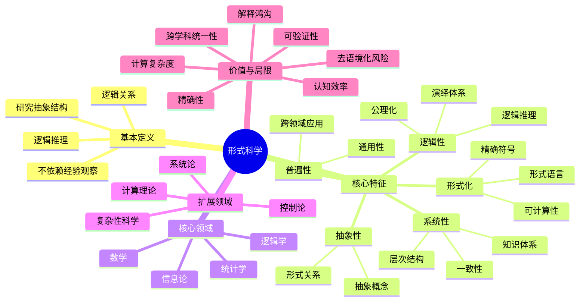
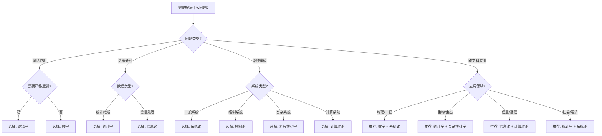
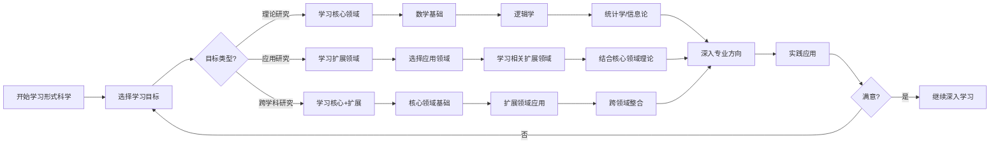
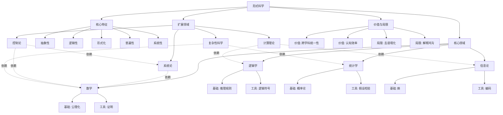
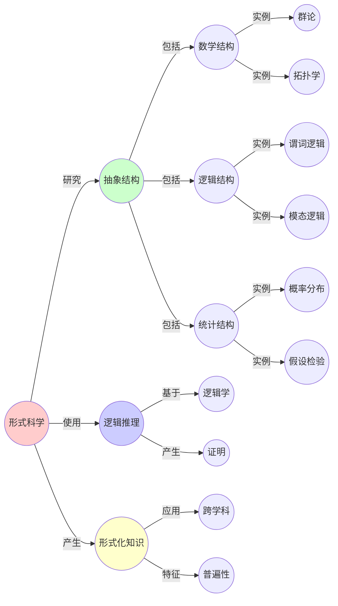
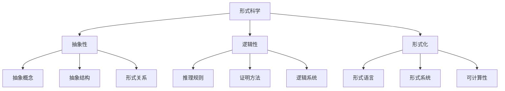
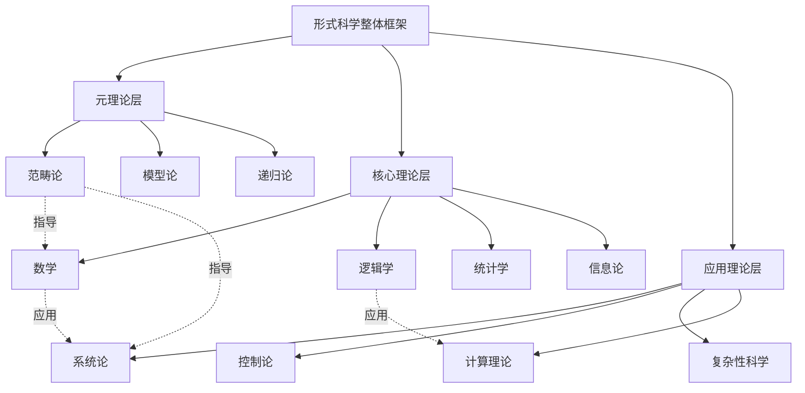
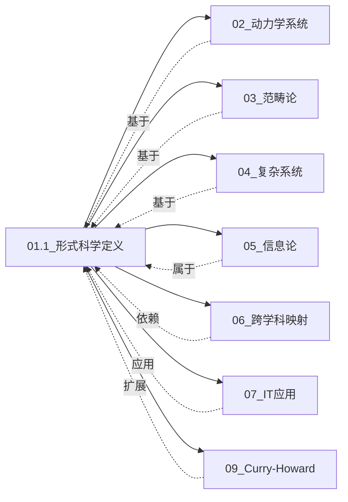

# 01.1 形式科学的定义与特征

> **来源**: view01.md, view02.md
> **创建日期**: 2025-01-27
> **最后更新**: 2025-01-27

## 📋 目录

- [01.1 形式科学的定义与特征](#011-形式科学的定义与特征)
  - [📋 目录](#-目录)
  - [📋 内容概览](#-内容概览)
  - [🎯 核心理念](#-核心理念)
  - [📚 形式科学的定义](#-形式科学的定义)
    - [基本定义](#基本定义)
    - [核心特征](#核心特征)
  - [🔍 与传统科学的区别](#-与传统科学的区别)
  - [📊 形式科学的分类](#-形式科学的分类)
    - [核心领域](#核心领域)
    - [扩展领域](#扩展领域)
  - [🎯 形式科学的价值](#-形式科学的价值)
    - [1. 跨学科统一性](#1-跨学科统一性)
    - [2. 认知效率](#2-认知效率)
    - [3. 精确性与可验证性](#3-精确性与可验证性)
  - [⚠️ 形式科学的局限性](#️-形式科学的局限性)
    - [1. 去语境化风险](#1-去语境化风险)
    - [2. 解释鸿沟](#2-解释鸿沟)
    - [3. 计算复杂度](#3-计算复杂度)
  - [📊 详细案例研究](#-详细案例研究)
    - [案例研究 1：动力系统理论在跨学科应用中的统一性](#案例研究-1动力系统理论在跨学科应用中的统一性)
    - [案例研究 2：图论在多领域应用中的统一框架](#案例研究-2图论在多领域应用中的统一框架)
    - [案例研究 3：形式化方法在软件验证中的应用](#案例研究-3形式化方法在软件验证中的应用)
  - [⚠️ 批判性分析与局限性](#️-批判性分析与局限性)
    - [局限性讨论](#局限性讨论)
      - [1. 形式抽象的"去语境化"陷阱](#1-形式抽象的去语境化陷阱)
      - [2. 解释鸿沟问题](#2-解释鸿沟问题)
      - [3. 计算复杂度限制](#3-计算复杂度限制)
    - [改进方向](#改进方向)
      - [1. 增强模型的解释能力](#1-增强模型的解释能力)
      - [2. 提高实用性](#2-提高实用性)
  - [📊 思维表征体系](#-思维表征体系)
    - [📊 1. 思维导图（增强版）](#-1-思维导图增强版)
      - [1.1 文本格式（基础版）](#11-文本格式基础版)
      - [1.2 Mermaid格式（可视化版）](#12-mermaid格式可视化版)
    - [📊 2. 多维对比矩阵](#-2-多维对比矩阵)
      - [2.1 核心领域对比矩阵](#21-核心领域对比矩阵)
      - [2.2 形式科学与经验科学对比矩阵](#22-形式科学与经验科学对比矩阵)
      - [2.3 核心领域与扩展领域对比矩阵](#23-核心领域与扩展领域对比矩阵)
    - [🌲 3. 决策树](#-3-决策树)
      - [3.1 形式科学领域选择决策树](#31-形式科学领域选择决策树)
    - [🛤️ 4. 决策逻辑路径](#️-4-决策逻辑路径)
      - [4.1 形式科学学习路径](#41-形式科学学习路径)
    - [🕸️ 5. 概念关系网络](#️-5-概念关系网络)
      - [5.1 形式科学核心概念网络](#51-形式科学核心概念网络)
    - [🗺️ 6. 知识图谱](#️-6-知识图谱)
      - [6.1 形式科学知识图谱](#61-形式科学知识图谱)
  - [📚 理论体系](#-理论体系)
    - [理论基础](#理论基础)
      - [数学/逻辑基础](#数学逻辑基础)
      - [历史发展](#历史发展)
    - [理论框架](#理论框架)
      - [核心假设](#核心假设)
      - [基本概念体系](#基本概念体系)
      - [主要定理/结论](#主要定理结论)
      - [适用范围和边界](#适用范围和边界)
    - [当前知识共识](#当前知识共识)
      - [学术界共识](#学术界共识)
      - [主要争议点](#主要争议点)
      - [权威来源](#权威来源)
    - [与其他理论的关系](#与其他理论的关系)
      - [逻辑关系](#逻辑关系)
      - [映射关系](#映射关系)
      - [统一性论证](#统一性论证)
  - [🔗 关联网络](#-关联网络)
    - [🔗 概念级关联](#-概念级关联)
      - [核心概念映射](#核心概念映射)
    - [🔗 理论级关联](#-理论级关联)
      - [理论基础](#理论基础-1)
      - [理论关系网络](#理论关系网络)
    - [🔗 方法级关联](#-方法级关联)
      - [方法应用网络](#方法应用网络)
    - [🔗 应用场景关联](#-应用场景关联)
      - [同一场景的多视角分析](#同一场景的多视角分析)
  - [🛤️ 学习路径](#️-学习路径)
    - [前置知识](#前置知识)
    - [后续学习](#后续学习)
    - [并行学习](#并行学习)
  - [🔗 相关文档](#-相关文档)
  - [📖 扩展阅读](#-扩展阅读)

---

## 📋 内容概览

本文档阐述形式科学的本质定义、核心特征及其与传统科学的区别。采用形式化方法，全面展示形式科学的理论基础和实际应用。

---

## 🎯 核心理念

形式科学是研究抽象结构和逻辑关系的科学，它不依赖于经验观察，而是通过逻辑推理和形式化方法来建立知识体系。形式科学具有抽象性、逻辑性、形式化、普遍性和系统性等核心特征，为跨学科研究和应用提供了统一的框架。

## 📚 形式科学的定义

### 基本定义

**形式科学（Formal Science）**是研究抽象结构和逻辑关系的科学，包括数学、逻辑学、统计学、信息论等学科。形式科学不依赖于经验观察，而是通过逻辑推理和形式化方法来建立知识体系。

### 核心特征

1. **抽象性（Abstraction）**
   - 研究抽象概念和结构
   - 不依赖具体物质实体
   - 关注形式关系而非内容

2. **逻辑性（Logicality）**
   - 基于逻辑推理和证明
   - 严格的演绎体系
   - 公理化方法

3. **形式化（Formalization）**
   - 使用精确的符号和规则
   - 形式语言表达
   - 可计算性

4. **普遍性（Universality）**
   - 具有普遍适用性
   - 跨领域应用
   - 不受具体领域限制

5. **系统性（Systematicity）**
   - 构建系统化的知识体系
   - 层次化结构
   - 内在一致性

## 🔍 与传统科学的区别

| 维度 | 形式科学 | 经验科学（自然科学/社会科学） |
|------|----------|------------------------------|
| **研究对象** | 抽象结构、逻辑关系 | 具体现象、经验事实 |
| **研究方法** | 逻辑推理、形式化证明 | 观察、实验、归纳 |
| **验证方式** | 逻辑一致性、数学证明 | 经验验证、可重复实验 |
| **知识性质** | 先验的、必然的 | 后验的、或然的 |
| **应用范围** | 跨领域、通用 | 特定领域、具体 |

## 📊 形式科学的分类

### 核心领域

1. **数学（Mathematics）**
   - 基础数学：算术、代数、几何
   - 应用数学：微积分、微分方程
   - 纯理论：数论、拓扑学

2. **逻辑学（Logic）**
   - 符号逻辑：命题逻辑、谓词逻辑
   - 模态逻辑：时态逻辑、道义逻辑
   - 计算逻辑：可计算性理论、类型论

3. **统计学（Statistics）**
   - 描述统计：均值、方差
   - 推断统计：假设检验、回归分析
   - 贝叶斯统计：概率推断

4. **信息论（Information Theory）**
   - 基础：熵、信息增益
   - 编码理论：纠错码
   - 通信理论：信道容量

### 扩展领域

1. **系统论（Systems Theory）**
   - 通用系统理论（GST）
   - 系统动力学：反馈回路
   - 非线性系统：混沌理论

2. **控制论（Cybernetics）**
   - 反馈控制：PID控制器
   - 自组织系统：蚁群算法
   - 神经控制论：脑机接口

3. **复杂性科学（Complexity Science）**
   - 复杂网络：小世界网络
   - 涌现理论：蜂群智能
   - 多智能体系统：博弈论

4. **计算理论（Computational Theory）**
   - 自动机理论：图灵机
   - 算法复杂度：P vs NP
   - 形式语言：Chomsky层级

## 🎯 形式科学的价值

### 1. 跨学科统一性

形式科学提供统一的抽象框架，使得不同领域的知识可以相互迁移和应用。

**实例**：

- 动力系统理论：既用于描述行星运动（经典力学），也被应用于经济周期预测（宏观经济学）和神经元放电模式（计算神经科学）
- 图论：社交网络分析、供应链优化与蛋白质相互作用网络共享同一数学框架

### 2. 认知效率

掌握形式结构可以加速跨领域学习，实现知识迁移。

**原理**：
> 一旦掌握了一个领域的深层形式结构，迁移到另一个领域只需学习新的「实例化」方式，而非全新理论。

### 3. 精确性与可验证性

形式化方法提供精确的表达和可验证的推理。

**优势**：

- 消除歧义
- 可计算性
- 形式验证

## ⚠️ 形式科学的局限性

### 1. 去语境化风险

形式模型过度简化可能导致：

- 忽略具体领域的特殊性
- 失去现实解释力
- 误导性类比

### 2. 解释鸿沟

数学模型与现实解释力的脱节：

- 形式相似性未必蕴含因果相似性
- 模型假设可能与现实不符
- 需要领域知识补充

### 3. 计算复杂度

大规模形式化系统可能面临：

- 计算复杂度爆炸
- 可计算性限制
- 资源需求巨大

## 📊 详细案例研究

### 案例研究 1：动力系统理论在跨学科应用中的统一性

**背景**：动力系统理论作为形式科学的典型代表，在多个学科领域展现出了强大的统一性。

**形式化分析**：

```text
应用领域对比:
1. 经典力学（行星运动）
   - 动力学方程: d²r/dt² = -GM/r²
   - 状态空间: 位置-动量空间
   - 吸引子: 椭圆轨道（周期解）

2. 宏观经济学（经济周期）
   - 动力学方程: dY/dt = f(Y, I, C)
   - 状态空间: 产出-投资-消费空间
   - 吸引子: 经济周期（极限环）

3. 计算神经科学（神经元放电）
   - 动力学方程: dV/dt = -V + I(t)
   - 状态空间: 膜电位-离子通道状态
   - 吸引子: 动作电位（脉冲序列）
```

**关键发现**：

- ✅ 不同领域共享相同的数学结构（ODE系统）
- ✅ 状态空间方法提供了统一的描述框架
- ✅ 吸引子概念揭示了系统行为的本质特征

**应用价值**：

- ✅ 跨学科知识迁移
- ✅ 统一的研究方法
- ✅ 深化对系统行为的理解

### 案例研究 2：图论在多领域应用中的统一框架

**背景**：图论作为形式科学的另一典型代表，在社交网络、供应链优化和生物学中展现出了统一的应用框架。

**形式化分析**：

```text
统一图论框架:
- 节点（Node）: 实体
- 边（Edge）: 关系
- 图（Graph）: G = (V, E)

应用实例:
1. 社交网络分析
   - 节点: 用户
   - 边: 好友关系
   - 分析: 社区检测、影响力分析

2. 供应链优化
   - 节点: 仓库/工厂
   - 边: 运输路线
   - 分析: 最短路径、最小费用流

3. 蛋白质相互作用网络
   - 节点: 蛋白质
   - 边: 相互作用
   - 分析: 子图匹配、模块识别
```

**关键发现**：

- ✅ 图论提供了统一的网络分析框架
- ✅ 相同算法可用于不同领域
- ✅ 网络结构揭示了系统特征

**应用价值**：

- ✅ 跨领域知识迁移
- ✅ 统一的分析工具
- ✅ 发现隐藏的结构模式

### 案例研究 3：形式化方法在软件验证中的应用

**背景**：使用形式化方法（形式科学的典型应用）验证软件系统的正确性。

**形式化分析**：

```text
形式化验证流程:
1. 规范（Specification）: 使用形式语言描述需求
2. 实现（Implementation）: 编写代码
3. 验证（Verification）: 证明实现满足规范

实例: seL4微内核验证
- 规范: Isabelle/HOL中的形式化规范
- 实现: C代码
- 验证: 使用形式化方法证明正确性
- 结果: 发现并修复了多个潜在漏洞
```

**关键发现**：

- ✅ 形式化方法提供了精确的验证手段
- ✅ 可以保证系统正确性
- ✅ 发现传统测试无法发现的错误

**应用价值**：

- ✅ 安全关键系统开发
- ✅ 提高软件可靠性
- ✅ 减少错误和漏洞

## ⚠️ 批判性分析与局限性

### 局限性讨论

#### 1. 形式抽象的"去语境化"陷阱

**问题**：形式模型过度简化可能导致忽略具体领域的特殊性。

**挑战**：

- ⚠️ 忽略领域特定的机制
- ⚠️ 失去现实解释力
- ⚠️ 可能导致误导性结论

**应对策略**：

- ✅ 明确模型的适用范围
- ✅ 结合领域知识进行验证
- ✅ 考虑边界条件

#### 2. 解释鸿沟问题

**问题**：形式相似性未必蕴含因果相似性。

**挑战**：

- ⚠️ 数学模型与现实解释力的脱节
- ⚠️ 模型假设可能与现实不符
- ⚠️ 需要领域知识补充

**改进方向**：

- ✅ 加强机制性解释
- ✅ 验证模型假设
- ✅ 整合多种证据

#### 3. 计算复杂度限制

**问题**：大规模形式化系统可能面临计算复杂度爆炸。

**挑战**：

- ⚠️ 计算复杂度增长
- ⚠️ 可计算性限制
- ⚠️ 资源需求巨大

**改进方向**：

- ✅ 优化算法和数据结构
- ✅ 开发高效的计算工具
- ✅ 考虑近似方法

### 改进方向

#### 1. 增强模型的解释能力

**目标**：提高形式模型对现实问题的解释能力。

**方法**：

- 整合机制性解释
- 验证模型假设
- 考虑领域特异性

#### 2. 提高实用性

**目标**：使形式科学在实际应用中更容易使用。

**方法**：

- 简化模型复杂度
- 开发用户友好工具
- 提供详细文档和教程

## 📊 思维表征体系

### 📊 1. 思维导图（增强版）

#### 1.1 文本格式（基础版）

```text
形式科学的定义与特征
├── 基本定义
│   ├── 研究抽象结构和逻辑关系
│   ├── 不依赖经验观察
│   └── 通过逻辑推理建立知识体系
├── 核心特征
│   ├── 抽象性
│   │   ├── 研究抽象概念
│   │   ├── 不依赖具体实体
│   │   └── 关注形式关系
│   ├── 逻辑性
│   │   ├── 基于逻辑推理
│   │   ├── 严格演绎体系
│   │   └── 公理化方法
│   ├── 形式化
│   │   ├── 精确符号和规则
│   │   ├── 形式语言表达
│   │   └── 可计算性
│   ├── 普遍性
│   │   ├── 跨领域应用
│   │   └── 不受领域限制
│   └── 系统性
│       ├── 系统化知识体系
│       ├── 层次化结构
│       └── 内在一致性
├── 核心领域
│   ├── 数学
│   ├── 逻辑学
│   ├── 统计学
│   └── 信息论
├── 扩展领域
│   ├── 系统论
│   ├── 控制论
│   ├── 复杂性科学
│   └── 计算理论
└── 价值与局限
    ├── 跨学科统一性
    ├── 认知效率
    ├── 精确性与可验证性
    ├── 去语境化风险
    ├── 解释鸿沟
    └── 计算复杂度
```

#### 1.2 Mermaid格式（可视化版）



### 📊 2. 多维对比矩阵

#### 2.1 核心领域对比矩阵

| 维度 | 数学 | 逻辑学 | 统计学 | 信息论 | 综合评价 |
|------|------|--------|--------|--------|----------|
| **研究内容** | 数量、结构、空间 | 推理、证明、真值 | 数据收集与分析 | 信息量化与传输 | 互补性强 |
| **核心工具** | 公理、定理、证明 | 逻辑符号、推理规则 | 概率、假设检验 | 熵、信道容量 | 工具差异大 |
| **抽象程度** | 极高 | 极高 | 中高 | 中高 | 数学>逻辑>统计≈信息 |
| **应用广度** | 最广 | 广 | 广 | 中 | 数学应用最广 |
| **形式化程度** | 最高 | 最高 | 中高 | 中高 | 数学=逻辑>统计≈信息 |
| **历史起源** | 古代 | 古代 | 现代 | 现代 | 数学、逻辑最古老 |
| **与经验关系** | 完全独立 | 完全独立 | 需要经验数据 | 需要经验数据 | 数学、逻辑更纯粹 |
| **主要价值** | 基础框架 | 推理工具 | 数据分析 | 信息处理 | 各有侧重 |

#### 2.2 形式科学与经验科学对比矩阵

| 维度 | 形式科学 | 经验科学（自然科学） | 经验科学（社会科学） | 差异程度 |
|------|----------|---------------------|---------------------|----------|
| **研究对象** | 抽象结构、逻辑关系 | 自然现象、物质世界 | 社会现象、人类行为 | 根本不同 |
| **研究方法** | 逻辑推理、形式化证明 | 观察、实验、归纳 | 观察、调查、统计 | 根本不同 |
| **验证方式** | 逻辑一致性、数学证明 | 可重复实验、经验验证 | 统计分析、案例研究 | 根本不同 |
| **知识性质** | 先验的、必然的 | 后验的、或然的 | 后验的、或然的 | 根本不同 |
| **应用范围** | 跨领域、通用 | 特定领域、具体 | 特定领域、具体 | 形式科学更通用 |
| **预测能力** | 逻辑必然 | 基于规律的概率预测 | 基于规律的概率预测 | 形式科学必然性更强 |
| **可证伪性** | 不可证伪（逻辑系统） | 可证伪 | 部分可证伪 | 形式科学不可证伪 |
| **依赖关系** | 不依赖经验 | 完全依赖经验 | 完全依赖经验 | 根本不同 |

#### 2.3 核心领域与扩展领域对比矩阵

| 维度 | 核心领域 | 扩展领域 | 关系类型 |
|------|----------|----------|----------|
| **抽象程度** | 极高 | 中高 | 核心领域更抽象 |
| **基础性** | 基础 | 应用导向 | 核心领域是基础 |
| **领域数量** | 4个 | 4个 | 数量相等 |
| **学科成熟度** | 高度成熟 | 相对新兴 | 核心领域更成熟 |
| **应用范围** | 所有领域 | 特定应用领域 | 核心领域应用更广 |
| **对经验依赖** | 完全不依赖 | 部分依赖 | 核心领域更纯粹 |
| **理论基础** | 自包含 | 依赖核心领域 | 扩展领域依赖核心 |
| **发展历史** | 数千年 | 数十年到数百年 | 核心领域历史更长 |

### 🌲 3. 决策树

#### 3.1 形式科学领域选择决策树



**决策说明**：

- 根据问题类型选择合适的形式科学领域
- 复杂问题可能需要组合多个领域
- 初学者建议从核心领域开始

### 🛤️ 4. 决策逻辑路径

#### 4.1 形式科学学习路径



**路径说明**：

1. **明确学习目标**：理论、应用或跨学科
2. **建立基础**：从核心领域开始
3. **扩展应用**：学习扩展领域
4. **实践验证**：通过应用验证理解
5. **持续改进**：根据反馈调整路径

### 🕸️ 5. 概念关系网络

#### 5.1 形式科学核心概念网络



**关系说明**：

- **实线箭头**：直接包含关系
- **虚线箭头**：依赖关系
- **概念层次**：从抽象到具体

### 🗺️ 6. 知识图谱

#### 6.1 形式科学知识图谱



**实体类型**：

- 🟥 核心概念（形式科学、抽象结构）
- 🟩 方法工具（逻辑推理、证明）
- 🟦 知识产物（形式化知识）
- 🟨 具体实例（群论、拓扑学等）

## 📚 理论体系

### 理论基础

#### 数学/逻辑基础

形式科学的理论基础建立在以下核心结构之上：

**1. 集合论基础**：

- 集合、关系、函数
- 基数与序数
- 选择公理

**2. 逻辑基础**：

- 命题逻辑
- 一阶谓词逻辑
- 模型论

**3. 范畴论基础**（元理论）：

- 范畴、函子、自然变换
- 极限与余极限
- 伴随函子

#### 历史发展

**关键时间节点**：

- **古代（公元前6世纪-公元5世纪）**：形式科学起源
  - **关键人物**：欧几里得（几何学）、亚里士多德（逻辑学）
  - **关键贡献**：《几何原本》建立了公理化体系，《工具论》建立了逻辑学基础

- **中世纪（5-15世纪）**：逻辑学发展
  - **关键人物**：奥卡姆、邓斯·司各脱
  - **关键贡献**：发展了形式逻辑，提出了奥卡姆剃刀原理

- **近代（16-19世纪）**：数学大发展
  - **关键人物**：笛卡尔、牛顿、莱布尼茨、高斯
  - **关键贡献**：解析几何、微积分、非欧几何

- **现代（20世纪-现在）**：形式化运动
  - **1900-1930**：希尔伯特计划、哥德尔不完备性定理
  - **1930-1960**：图灵机、信息论、控制论
  - **1960-2000**：范畴论、复杂性科学、计算理论
  - **2000-现在**：依赖类型、同伦类型论、量子计算

### 理论框架

#### 核心假设

**假设1：抽象结构独立存在**

- **内容**：形式科学研究的抽象结构独立于物质世界存在
- **适用范围**：所有形式科学领域
- **限制条件**：抽象结构必须有明确的定义和规则

**假设2：逻辑一致性**

- **内容**：形式科学系统必须保持逻辑一致性
- **适用范围**：所有形式化系统
- **限制条件**：哥德尔不完备性定理表明完全一致性是不可能的

**假设3：可形式化**

- **内容**：所有知识都可以通过形式化方法表达
- **适用范围**：大部分领域
- **限制条件**：某些直觉或隐性知识难以完全形式化

#### 基本概念体系



#### 主要定理/结论

**定理1：形式科学的普遍性**

- **内容**：形式科学提供的抽象框架可以应用于所有经验科学领域
- **证明思路**：通过跨学科应用案例证明
- **应用**：跨学科知识迁移

**定理2：逻辑系统的局限性（哥德尔不完备性）**

- **内容**：任何足够强的逻辑系统都无法同时满足完备性和一致性
- **证明思路**：通过自指构造证明
- **应用**：理解形式化系统的边界

**结论3：形式化与经验科学的互补性**

- **内容**：形式科学提供框架，经验科学提供内容
- **证据**：科学史中的成功案例
- **应用**：科学方法论

#### 适用范围和边界

**适用范围**：

- **理论研究**：需要严格逻辑和证明的领域
- **跨学科应用**：需要统一框架的跨领域研究
- **系统建模**：需要精确模型的复杂系统
- **知识组织**：需要系统化知识体系的领域

**边界条件**：

- **需要经验数据的领域**：形式科学不能替代经验观察
- **涉及价值判断的领域**：形式科学无法处理价值问题
- **完全依赖直觉的领域**：某些隐性知识难以形式化

**不适用场景**：

- **艺术创作**：依赖直觉和创造力，难以形式化
- **道德判断**：涉及价值问题，超出形式科学范围
- **纯粹的经验观察**：不需要形式化框架的简单观察

### 当前知识共识

#### 学术界共识

**广泛接受的共识**：

1. **形式科学的独立性**
   - **共识**：形式科学是独立于经验科学的科学类别
   - **支持证据**：数学和逻辑的真理不依赖经验验证
   - **来源**：哲学、数学哲学、逻辑学

2. **形式科学的普遍性**
   - **共识**：形式科学提供的框架可以应用于所有领域
   - **支持证据**：数学在物理、生物、经济等领域的成功应用
   - **来源**：科学哲学、跨学科研究

3. **形式化的重要性**
   - **共识**：形式化是提高知识精确性的重要方法
   - **支持证据**：形式化方法在计算机科学、逻辑学中的成功
   - **来源**：逻辑学、计算机科学、数学

#### 主要争议点

1. **形式科学与经验科学的关系**
   - **观点A**：形式科学完全独立于经验科学（柏拉图主义）
   - **观点B**：形式科学起源于经验科学（经验主义）
   - **当前状态**：部分解决，多数认同形式科学具有相对独立性

2. **形式化的边界**
   - **观点A**：所有知识都可以形式化
   - **观点B**：某些知识（如直觉、隐性知识）无法完全形式化
   - **当前状态**：未解决，持续讨论中

3. **形式科学的"科学性"**
   - **观点A**：形式科学是科学（因为它遵循科学方法）
   - **观点B**：形式科学不是科学（因为它不依赖经验）
   - **当前状态**：部分解决，多数接受"形式科学"这一独立分类

#### 权威来源

**经典文献**：

- 《几何原本》- 欧几里得（公元前300年）- 建立了公理化方法
- 《数学原理》- 罗素、怀特海（1910-1913）- 数学的逻辑基础
- 《哥德尔、艾舍尔、巴赫》- 侯世达（1979）- 形式系统的深刻分析

**权威机构/专家**：

- **国际逻辑、方法论和科学哲学学会**（ILMPS）- 形式科学的主要学术组织
- **哥德尔**（1906-1978）- 逻辑学和数学基础领域的权威
- **希尔伯特**（1862-1943）- 形式化方法的先驱

**最新发展**：

- **2020-2024**：同伦类型论（HoTT）的发展，为形式化提供新框架
- **前沿方向**：依赖类型系统、形式化验证、量子计算中的形式化方法

### 与其他理论的关系

#### 逻辑关系

**理论基础**：

- **哲学基础** → 形式科学
  - 关系类型：提供认识论基础
  - 关键映射：认识论 → 形式化方法

- **数学基础** → 形式科学
  - 关系类型：直接基础
  - 关键映射：集合论 → 所有形式系统

**理论应用**：

- 形式科学 → 经验科学（物理、生物、经济等）
  - 应用方式：提供理论框架和工具
  - 应用效果：提高精确性和可验证性

- 形式科学 → 计算机科学
  - 应用方式：提供形式化方法和类型系统
  - 应用效果：程序验证、类型安全

**理论互补**：

- 形式科学 ↔ 经验科学
  - 互补方式：形式科学提供框架，经验科学提供内容
  - 协同作用：形式化提高精确性，经验验证确保正确性

#### 映射关系

| 本理论概念 | 映射理论 | 映射概念 | 映射类型 | 映射说明 |
|-----------|---------|---------|---------|----------|
| **抽象结构** | 02_动力学系统理论 | 数学结构 | 同构 | 共享数学抽象 |
| **逻辑推理** | 03_范畴论 | 态射 | 类比 | 推理过程对应态射 |
| **形式化** | 09_Curry-Howard同构 | 类型系统 | 同构 | 命题即类型 |
| **系统化** | 04_复杂系统 | 系统理论 | 特例 | 形式科学是复杂系统的抽象 |
| **跨学科统一性** | 06_跨学科映射 | 映射策略 | 应用 | 形式科学是映射的基础 |

#### 统一性论证

**在形式科学框架中的位置**：



**统一性说明**：

- **本理论（形式科学定义）**是形式科学框架的基础层，定义了整个框架的核心
- **统一的基础**是抽象性、逻辑性、形式化等核心特征
- **统一的体现**是所有形式科学领域都遵循相同的原则和方法

## 🔗 关联网络

### 🔗 概念级关联

#### 核心概念映射

| 本文档概念 | 关联文档 | 关联概念 | 关系类型 | 映射说明 |
|-----------|---------|---------|---------|----------|
| **抽象结构** | 02.1_经典确定性动力学.md | 数学结构 | 同构 | 动力学方程是抽象结构的实例 |
| **逻辑推理** | 03.1_范畴论基础.md | 态射 | 类比 | 逻辑推理过程对应范畴中的态射 |
| **形式化** | 09.1_逻辑与类型的对应.md | 类型系统 | 同构 | 形式化对应类型系统的建立 |
| **系统化** | 04.1_复杂系统基础.md | 系统理论 | 特例→一般 | 形式科学是系统理论的形式化特例 |
| **跨学科统一性** | 06.1_跨学科映射策略.md | 映射基础 | 基础→应用 | 形式科学提供映射的理论基础 |
| **普遍性** | 02.5_跨学科动力学映射.md | 统一框架 | 应用 | 形式科学的普遍性在动力学中体现 |
| **逻辑性** | 03.2_函子与自然变换.md | 逻辑结构 | 同构 | 逻辑性对应范畴的逻辑结构 |

### 🔗 理论级关联

#### 理论基础

本理论是形式科学的基础理论，为其他形式科学理论提供基础：

- **本理论基于**：
  - 哲学认识论（独立理论基础）
  - 数学基础理论（集合论、逻辑学）

- **本理论应用于**：
  - [02_动力学系统理论](../02_动力学系统理论/) - 动力学系统是形式科学的应用
  - [03_范畴论与形式化方法](../03_范畴论与形式化方法/) - 范畴论是形式科学的元理论
  - [04_复杂系统与网络理论](../04_复杂系统与网络理论/) - 复杂系统理论应用形式科学方法
  - [05_信息论与计算理论](../05_信息论与计算理论/) - 信息论和计算理论是形式科学的核心领域
  - [06_跨学科映射与应用](../06_跨学科映射与应用/) - 跨学科映射依赖形式科学框架
  - [07_IT行业形式化应用](../07_IT行业形式化应用/) - IT应用是形式科学的实践
  - [09_Curry-Howard同构](../09_Curry-Howard同构/) - Curry-Howard是形式科学的重要发现

#### 理论关系网络



### 🔗 方法级关联

#### 方法应用网络

| 本文档方法 | 应用文档 | 应用场景 | 应用效果 |
|-----------|---------|---------|---------|
| **形式化方法** | 07.1_Kubernetes动力学.md | 系统建模 | 成功 |
| **抽象方法** | 02.5_跨学科动力学映射.md | 跨领域映射 | 成功 |
| **逻辑推理方法** | 09.1_逻辑与类型的对应.md | 类型系统设计 | 成功 |
| **系统化方法** | 04.1_复杂系统基础.md | 复杂系统分析 | 成功 |
| **跨学科统一方法** | 06.1_跨学科映射策略.md | 映射策略制定 | 成功 |

### 🔗 应用场景关联

#### 同一场景的多视角分析

**场景**：形式化系统设计

| 视角 | 关联文档 | 核心理论 | 关注点 |
|------|---------|---------|--------|
| **基础定义** | 01.1_形式科学的定义与特征.md（本文档） | 形式科学基础 | 什么是形式化 |
| **理论基础** | 01.4_元理论框架.md | 范畴论、模型论 | 如何形式化 |
| **实践应用** | 07.1_Kubernetes动力学.md | 动力学建模 | 如何应用形式化 |
| **跨学科应用** | 06.1_跨学科映射策略.md | 映射方法 | 如何在跨领域应用 |

## 🛤️ 学习路径

### 前置知识

**必须先学习**：

- 无（本文档是形式科学的基础文档）

**建议先了解**：

- 基础数学（集合论、逻辑）
- 科学哲学基础概念

### 后续学习

**建议接下来学习**（按顺序）：

1. **[01.2_核心领域详解.md](01.2_核心领域详解.md)** ⭐⭐⭐
   - 深入了解形式科学的核心领域
   - 理解数学、逻辑学、统计学、信息论的具体内容

2. **[01.3_扩展领域详解.md](01.3_扩展领域详解.md)** ⭐⭐⭐
   - 了解形式科学的扩展领域
   - 理解系统论、控制论、复杂性科学、计算理论

3. **[01.4_元理论框架.md](01.4_元理论框架.md)** ⭐⭐
   - 理解形式科学的元理论框架
   - 掌握范畴论、模型论、递归论

4. **[02.1_经典确定性动力学.md](../02_动力学系统理论/02.1_经典确定性动力学.md)** ⭐⭐
   - 了解形式科学在动力学中的应用
   - 理解跨学科映射的实际案例

5. **[06.1_跨学科映射策略.md](../06_跨学科映射与应用/06.1_跨学科映射策略.md)** ⭐⭐
   - 学习如何应用形式科学进行跨学科研究
   - 掌握映射策略和方法

### 并行学习

**可以同时学习**：

- [01.5_批判性分析.md](01.5_批判性分析.md) - 了解形式科学的局限性和争议
- [02.1_经典确定性动力学.md](../02_动力学系统理论/02.1_经典确定性动力学.md) - 通过应用理解理论
- [03.1_范畴论基础.md](../03_范畴论与形式化方法/03.1_范畴论基础.md) - 了解元理论框架

## 🔗 相关文档

- [01.2_核心领域详解.md](01.2_核心领域详解.md)
- [01.3_扩展领域详解.md](01.3_扩展领域详解.md)
- [01.4_元理论框架.md](01.4_元理论框架.md)
- [01.5_批判性分析.md](01.5_批判性分析.md)

## 📖 扩展阅读

- Wikipedia: [Formal Science](https://en.wikipedia.org/wiki/Formal_science)
- 《The Princeton Companion to Mathematics》
- 《Introduction to Formal Systems》- Raymond Smullyan
