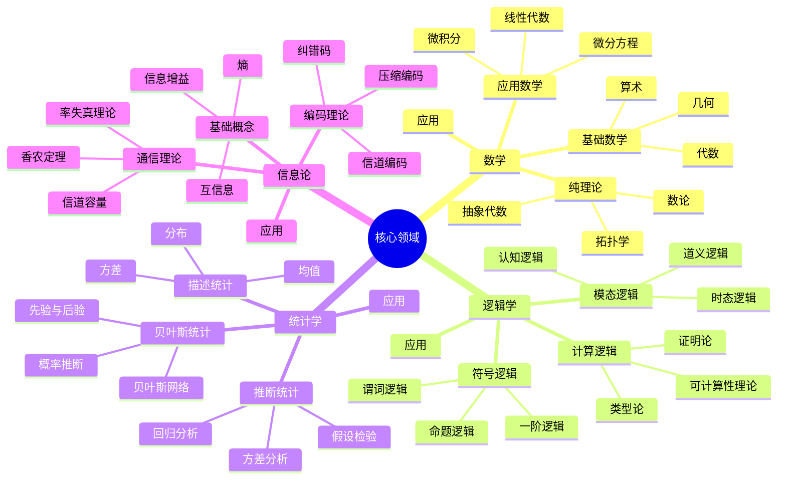
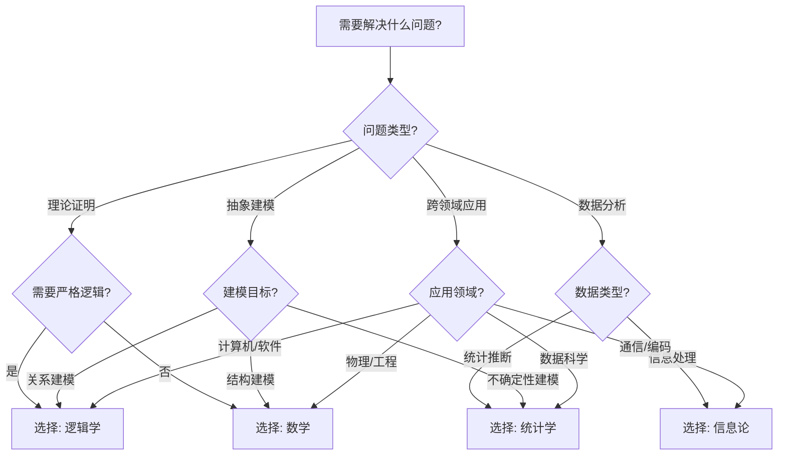
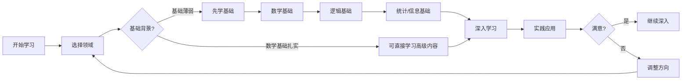
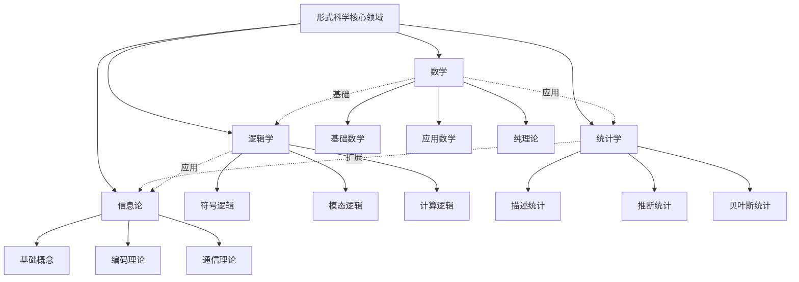
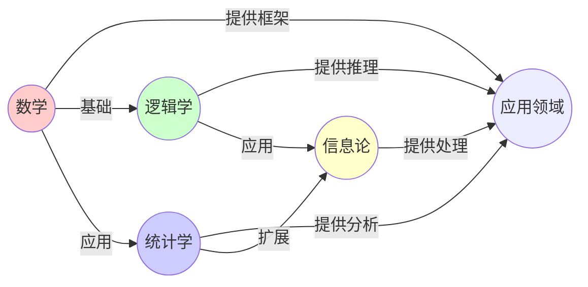
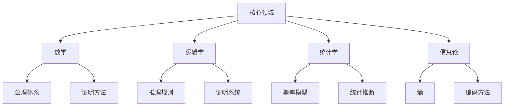

# 01.2 核心领域详解

> **来源**: view02.md
> **创建日期**: 2025-01-27
> **最后更新**: 2025-01-27

## 📋 目录

- [01.2 核心领域详解](#012-核心领域详解)
  - [📋 目录](#-目录)
  - [📋 内容概览](#-内容概览)
  - [🎯 核心理念](#-核心理念)
  - [📚 数学（Mathematics）](#-数学mathematics)
    - [基础数学](#基础数学)
    - [应用数学](#应用数学)
    - [纯理论](#纯理论)
    - [代表性理论](#代表性理论)
  - [🔍 逻辑学（Logic）](#-逻辑学logic)
    - [符号逻辑](#符号逻辑)
    - [模态逻辑](#模态逻辑)
    - [计算逻辑](#计算逻辑)
    - [代表性理论](#代表性理论-1)
  - [📊 统计学（Statistics）](#-统计学statistics)
    - [描述统计](#描述统计)
    - [推断统计](#推断统计)
    - [贝叶斯统计](#贝叶斯统计)
    - [代表性方法](#代表性方法)
  - [📡 信息论（Information Theory）](#-信息论information-theory)
    - [基础概念](#基础概念)
    - [编码理论](#编码理论)
    - [通信理论](#通信理论)
    - [代表性理论](#代表性理论-2)
  - [🔗 核心领域的联系](#-核心领域的联系)
    - [数学与逻辑学](#数学与逻辑学)
    - [统计学与信息论](#统计学与信息论)
    - [跨领域应用](#跨领域应用)
  - [📖 学习路径](#-学习路径)
    - [基础阶段](#基础阶段)
    - [进阶阶段](#进阶阶段)
  - [📊 详细案例研究](#-详细案例研究)
    - [案例研究 1：数学在密码学中的应用](#案例研究-1数学在密码学中的应用)
    - [案例研究 2：逻辑学在程序验证中的应用](#案例研究-2逻辑学在程序验证中的应用)
    - [案例研究 3：统计学在机器学习中的应用](#案例研究-3统计学在机器学习中的应用)
  - [⚠️ 批判性分析与局限性](#️-批判性分析与局限性)
    - [局限性讨论](#局限性讨论)
      - [1. 数学的抽象性与应用鸿沟](#1-数学的抽象性与应用鸿沟)
      - [2. 逻辑学的表达能力限制](#2-逻辑学的表达能力限制)
      - [3. 统计学的假设限制](#3-统计学的假设限制)
    - [改进方向](#改进方向)
      - [1. 增强跨领域整合](#1-增强跨领域整合)
      - [2. 提高实际应用能力](#2-提高实际应用能力)
  - [📊 思维表征体系](#-思维表征体系)
    - [📊 1. 思维导图（增强版）](#-1-思维导图增强版)
      - [1.1 文本格式（基础版）](#11-文本格式基础版)
      - [1.2 Mermaid格式（可视化版）](#12-mermaid格式可视化版)
    - [📊 2. 多维对比矩阵](#-2-多维对比矩阵)
      - [2.1 四个核心领域对比矩阵](#21-四个核心领域对比矩阵)
      - [2.2 数学分支对比矩阵](#22-数学分支对比矩阵)
      - [2.3 逻辑学分支对比矩阵](#23-逻辑学分支对比矩阵)
    - [🌲 3. 决策树](#-3-决策树)
      - [3.1 核心领域选择决策树](#31-核心领域选择决策树)
    - [🛤️ 4. 决策逻辑路径](#️-4-决策逻辑路径)
      - [4.1 核心领域学习路径](#41-核心领域学习路径)
    - [🕸️ 5. 概念关系网络](#️-5-概念关系网络)
      - [5.1 核心领域关系网络](#51-核心领域关系网络)
    - [🗺️ 6. 知识图谱](#️-6-知识图谱)
      - [6.1 核心领域知识图谱](#61-核心领域知识图谱)
  - [📚 理论体系](#-理论体系)
    - [理论基础](#理论基础)
      - [数学/逻辑基础](#数学逻辑基础)
      - [历史发展](#历史发展)
    - [理论框架](#理论框架)
      - [核心假设](#核心假设)
      - [基本概念体系](#基本概念体系)
      - [主要定理/结论](#主要定理结论)
      - [适用范围和边界](#适用范围和边界)
    - [当前知识共识](#当前知识共识)
      - [学术界共识](#学术界共识)
      - [主要争议点](#主要争议点)
      - [权威来源](#权威来源)
    - [与其他理论的关系](#与其他理论的关系)
      - [逻辑关系](#逻辑关系)
      - [映射关系](#映射关系)
  - [🔗 关联网络](#-关联网络)
    - [🔗 概念级关联](#-概念级关联)
      - [核心概念映射](#核心概念映射)
    - [🔗 理论级关联](#-理论级关联)
      - [理论基础](#理论基础-1)
    - [🔗 方法级关联](#-方法级关联)
      - [方法应用网络](#方法应用网络)
    - [🔗 应用场景关联](#-应用场景关联)
  - [🛤️ 学习路径](#️-学习路径)
    - [前置知识](#前置知识)
    - [后续学习](#后续学习)
    - [并行学习](#并行学习)
  - [🔗 相关文档](#-相关文档)
  - [📖 扩展阅读](#-扩展阅读)

---

## 📋 内容概览

本文档详细阐述形式科学的四个核心领域：数学、逻辑学、统计学、信息论。采用系统化方法，全面展示各核心领域的理论基础、应用价值和相互关系。

---

## 🎯 核心理念

形式科学的四个核心领域——数学、逻辑学、统计学和信息论——构成了形式科学的基础。它们各自提供独特的工具和方法，同时又相互联系、相互促进，共同构建了形式科学的完整体系。

## 📚 数学（Mathematics）

### 基础数学

- **算术**：数的运算
- **代数**：方程与结构
- **几何**：空间与形状

### 应用数学

- **微积分**：变化与极限
- **微分方程**：动态系统
- **线性代数**：向量与矩阵

### 纯理论

- **数论**：整数的性质
- **拓扑学**：空间的性质
- **抽象代数**：代数结构

### 代表性理论

- **哥德尔不完备定理**：形式系统的局限性
- **范畴论中的Yoneda引理**：范畴论的核心工具

## 🔍 逻辑学（Logic）

### 符号逻辑

- **命题逻辑**：命题的真假
- **谓词逻辑**：量词与谓词
- **一阶逻辑**：量化的逻辑

### 模态逻辑

- **时态逻辑**：时间与事件
- **道义逻辑**：义务与允许
- **认知逻辑**：知识与信念

### 计算逻辑

- **可计算性理论**：计算的边界
- **类型论**：类型与证明
- **证明论**：证明的结构

### 代表性理论

- **哥德尔完备性定理**：逻辑的完备性
- **Coq中的依赖类型系统**：形式化证明

## 📊 统计学（Statistics）

### 描述统计

- **均值**：集中趋势
- **方差**：离散程度
- **分布**：数据分布

### 推断统计

- **假设检验**：统计推断
- **回归分析**：关系建模
- **方差分析**：多组比较

### 贝叶斯统计

- **概率推断**：贝叶斯推理
- **先验与后验**：信念更新
- **贝叶斯网络**：概率图模型

### 代表性方法

- **马尔可夫链蒙特卡洛（MCMC）**：采样方法
- **变分推断**：近似推理

## 📡 信息论（Information Theory）

### 基础概念

- **熵**：信息的不确定性
- **信息增益**：信息量的增加
- **互信息**：信息共享

### 编码理论

- **纠错码**：错误纠正
- **压缩编码**：数据压缩
- **信道编码**：可靠传输

### 通信理论

- **信道容量**：最大传输速率
- **香农第二定理**：信道编码定理
- **率失真理论**：有损压缩

### 代表性理论

- **香农第二定理**：信道编码定理
- **率失真理论（Rate-Distortion Theory）**：有损压缩理论

## 🔗 核心领域的联系

### 数学与逻辑学

- 逻辑是数学的基础
- 数学是逻辑的应用
- 两者共同构成形式科学的核心

### 统计学与信息论

- 信息论是统计学的扩展
- 两者都研究不确定性
- 熵是两者的桥梁

### 跨领域应用

- **数学**：提供抽象框架
- **逻辑学**：提供推理方法
- **统计学**：提供数据分析
- **信息论**：提供信息处理

## 📖 学习路径

### 基础阶段

1. 数学基础（代数、几何、微积分）
2. 逻辑基础（命题逻辑、谓词逻辑）
3. 统计基础（描述统计、推断统计）
4. 信息论基础（熵、信道容量）

### 进阶阶段

1. 抽象数学（拓扑、代数）
2. 高级逻辑（模态逻辑、类型论）
3. 高级统计（贝叶斯统计、机器学习）
4. 高级信息论（编码理论、通信理论）

## 📊 详细案例研究

### 案例研究 1：数学在密码学中的应用

**背景**：现代密码学高度依赖数学理论，特别是数论和抽象代数。

**形式化分析**：

```text
RSA加密算法:
- 理论基础: 大整数分解困难性
- 数学工具: 欧拉定理、模运算
- 密钥生成: 基于质数的困难性

椭圆曲线密码学(ECC):
- 理论基础: 椭圆曲线离散对数问题
- 数学工具: 椭圆曲线群、有限域
- 优势: 更短的密钥长度，相同的安全性
```

**关键发现**：

- ✅ 数论和代数提供了密码学的基础
- ✅ 数学困难性问题保证了密码安全性
- ✅ 新的数学理论催生了新的加密方法

**应用价值**：

- ✅ 网络安全和数据保护
- ✅ 数字签名和身份认证
- ✅ 区块链和加密货币

### 案例研究 2：逻辑学在程序验证中的应用

**背景**：使用逻辑学方法（特别是形式逻辑）验证程序的正确性。

**形式化分析**：

```text
Hoare逻辑验证:
- 前置条件: P
- 程序代码: C
- 后置条件: Q
- 形式: {P} C {Q}

验证过程:
1. 将程序分解为基本语句
2. 对每个语句应用推理规则
3. 证明最终状态满足后置条件

实例: 数组排序验证
- 前置: 数组A长度为n
- 后置: A是排序的且是原数组的排列
- 方法: 使用循环不变式证明
```

**关键发现**：

- ✅ 逻辑学提供了程序验证的严格方法
- ✅ Hoare逻辑能够证明程序正确性
- ✅ 形式化方法提高了软件可靠性

**应用价值**：

- ✅ 安全关键系统开发
- ✅ 提高软件质量
- ✅ 减少程序错误

### 案例研究 3：统计学在机器学习中的应用

**背景**：机器学习算法大量使用统计学方法进行数据分析和预测。

**形式化分析**：

```text
监督学习框架:
- 训练数据: {(x₁,y₁), ..., (xₙ,yₙ)}
- 模型: f: X → Y
- 损失函数: L(f(x), y)
- 目标: min ΣL(f(xᵢ), yᵢ)

贝叶斯推理:
- 先验: P(θ)
- 似然: P(D|θ)
- 后验: P(θ|D) ∝ P(D|θ)P(θ)
- 预测: P(y|x, D) = ∫P(y|x,θ)P(θ|D)dθ
```

**关键发现**：

- ✅ 统计学提供了机器学习理论基础
- ✅ 贝叶斯方法实现了不确定性的量化
- ✅ 统计推断支持了模型选择和评估

**应用价值**：

- ✅ 数据分析和预测
- ✅ 人工智能系统
- ✅ 决策支持系统

## ⚠️ 批判性分析与局限性

### 局限性讨论

#### 1. 数学的抽象性与应用鸿沟

**问题**：高度抽象的数学理论可能难以直接应用于实际问题。

**挑战**：

- ⚠️ 理论到应用的转化困难
- ⚠️ 需要领域知识作为桥梁
- ⚠️ 抽象化可能丢失实际问题特征

**应对策略**：

- ✅ 开发应用导向的数学工具
- ✅ 加强理论与实践的连接
- ✅ 培养跨学科能力

#### 2. 逻辑学的表达能力限制

**问题**：形式逻辑可能无法表达所有需要的性质和约束。

**挑战**：

- ⚠️ 表达能力有限
- ⚠️ 复杂系统的逻辑描述困难
- ⚠️ 推理复杂度高

**改进方向**：

- ✅ 扩展逻辑系统（如模态逻辑、时序逻辑）
- ✅ 开发高效推理算法
- ✅ 结合其他形式化方法

#### 3. 统计学的假设限制

**问题**：统计方法依赖模型假设，可能不符合实际数据。

**挑战**：

- ⚠️ 假设可能不成立
- ⚠️ 数据分布未知
- ⚠️ 样本量不足

**改进方向**：

- ✅ 发展非参数方法
- ✅ 使用稳健统计方法
- ✅ 验证模型假设

### 改进方向

#### 1. 增强跨领域整合

**目标**：促进不同核心领域之间的整合和应用。

**方法**：

- 开发跨领域方法和工具
- 建立统一的数学框架
- 促进学科交叉研究

#### 2. 提高实际应用能力

**目标**：使形式科学工具更容易应用于实际问题。

**方法**：

- 开发用户友好的工具
- 提供详细的应用指南
- 建立应用案例库

## 📊 思维表征体系

### 📊 1. 思维导图（增强版）

#### 1.1 文本格式（基础版）

```text
核心领域详解
├── 数学（Mathematics）
│   ├── 基础数学
│   │   ├── 算术
│   │   ├── 代数
│   │   └── 几何
│   ├── 应用数学
│   │   ├── 微积分
│   │   ├── 微分方程
│   │   └── 线性代数
│   ├── 纯理论
│   │   ├── 数论
│   │   ├── 拓扑学
│   │   └── 抽象代数
│   └── 应用：密码学、机器学习
├── 逻辑学（Logic）
│   ├── 符号逻辑
│   │   ├── 命题逻辑
│   │   ├── 谓词逻辑
│   │   └── 一阶逻辑
│   ├── 模态逻辑
│   │   ├── 时态逻辑
│   │   ├── 道义逻辑
│   │   └── 认知逻辑
│   ├── 计算逻辑
│   │   ├── 可计算性理论
│   │   ├── 类型论
│   │   └── 证明论
│   └── 应用：程序验证、形式化方法
├── 统计学（Statistics）
│   ├── 描述统计
│   │   ├── 均值
│   │   ├── 方差
│   │   └── 分布
│   ├── 推断统计
│   │   ├── 假设检验
│   │   ├── 回归分析
│   │   └── 方差分析
│   ├── 贝叶斯统计
│   │   ├── 概率推断
│   │   ├── 先验与后验
│   │   └── 贝叶斯网络
│   └── 应用：机器学习、数据分析
└── 信息论（Information Theory）
    ├── 基础概念
    │   ├── 熵
    │   ├── 信息增益
    │   └── 互信息
    ├── 编码理论
    │   ├── 纠错码
    │   ├── 压缩编码
    │   └── 信道编码
    ├── 通信理论
    │   ├── 信道容量
    │   ├── 香农定理
    │   └── 率失真理论
    └── 应用：通信系统、数据压缩
```

#### 1.2 Mermaid格式（可视化版）



### 📊 2. 多维对比矩阵

#### 2.1 四个核心领域对比矩阵

| 维度 | 数学 | 逻辑学 | 统计学 | 信息论 | 综合评价 |
|------|------|--------|--------|--------|----------|
| **抽象程度** | 极高 | 极高 | 中高 | 中高 | 数学=逻辑>统计≈信息 |
| **理论基础** | 公理体系 | 逻辑规则 | 概率论 | 概率论+熵 | 各有基础 |
| **主要工具** | 证明、计算 | 推理、证明 | 统计推断 | 编码、传输 | 工具差异大 |
| **应用广度** | 最广 | 广 | 广 | 中 | 数学应用最广 |
| **形式化程度** | 最高 | 最高 | 中高 | 中高 | 数学=逻辑最高 |
| **对经验依赖** | 完全独立 | 完全独立 | 需要数据 | 需要数据 | 数学、逻辑更纯粹 |
| **历史起源** | 古代 | 古代 | 近代 | 现代 | 数学、逻辑最古老 |
| **与其他领域关系** | 提供框架 | 提供推理 | 提供分析 | 提供处理 | 各有侧重 |
| **典型应用** | 物理、工程 | 计算机、哲学 | 数据分析 | 通信、编码 | 应用不同 |
| **发展速度** | 稳定 | 稳定 | 快速 | 快速 | 统计、信息发展快 |

#### 2.2 数学分支对比矩阵

| 维度 | 基础数学 | 应用数学 | 纯理论 | 应用价值 |
|------|---------|---------|--------|----------|
| **抽象程度** | 低 | 中 | 高 | 纯理论最抽象 |
| **实用性** | 高 | 很高 | 低 | 应用数学最实用 |
| **理论基础** | 基础公理 | 基础+应用 | 抽象结构 | 各有侧重 |
| **学习难度** | 低 | 中 | 高 | 纯理论最难 |
| **应用广度** | 广 | 很广 | 窄 | 应用数学最广 |
| **典型工具** | 算术运算 | 微积分、ODE | 抽象代数 | 工具不同 |
| **发展历史** | 最古老 | 17-18世纪 | 19-20世纪 | 历史不同 |
| **与实际问题** | 直接相关 | 高度相关 | 间接相关 | 应用数学最直接 |

#### 2.3 逻辑学分支对比矩阵

| 维度 | 符号逻辑 | 模态逻辑 | 计算逻辑 | 应用领域 |
|------|---------|---------|---------|---------|
| **基础性** | 基础 | 扩展 | 应用 | 符号逻辑最基础 |
| **表达能力** | 基础表达 | 扩展表达 | 计算表达 | 模态逻辑最丰富 |
| **计算复杂度** | 中等 | 高 | 很高 | 计算逻辑最复杂 |
| **实用性** | 高 | 中 | 很高 | 计算逻辑最实用 |
| **典型应用** | 数学证明 | 哲学、AI | 程序验证 | 应用不同 |
| **发展时期** | 19-20世纪初 | 20世纪中期 | 20世纪后期 | 时期不同 |
| **形式化程度** | 最高 | 高 | 很高 | 符号逻辑最形式化 |

### 🌲 3. 决策树

#### 3.1 核心领域选择决策树



**决策说明**：

- 根据问题类型选择核心领域
- 复杂问题可能需要组合多个领域
- 初学者建议从基础领域开始

### 🛤️ 4. 决策逻辑路径

#### 4.1 核心领域学习路径



### 🕸️ 5. 概念关系网络

#### 5.1 核心领域关系网络



### 🗺️ 6. 知识图谱

#### 6.1 核心领域知识图谱



## 📚 理论体系

### 理论基础

#### 数学/逻辑基础

四个核心领域的理论基础：

**1. 数学基础**：

- 集合论：所有数学的基础
- 公理体系：数学的严格性保证
- 证明方法：数学推理的核心

**2. 逻辑学基础**：

- 命题逻辑：最基本的逻辑
- 谓词逻辑：量化的逻辑
- 证明论：推理的严格性

**3. 统计学基础**：

- 概率论：统计学的基础
- 随机变量：统计模型的核心
- 统计推断：从数据到结论

**4. 信息论基础**：

- 概率论：信息论的数学基础
- 熵：信息的基本度量
- 编码理论：信息的表示

#### 历史发展

**关键时间节点**：

- **古代（公元前6世纪-17世纪）**：数学和逻辑的起源和发展
  - 数学：欧几里得几何、阿拉伯代数、解析几何
  - 逻辑：亚里士多德逻辑、中世纪逻辑

- **17-18世纪**：数学和逻辑的现代化
  - 数学：微积分、概率论
  - 逻辑：符号逻辑的萌芽

- **19世纪**：统计学和信息论的萌芽
  - 统计学：高斯、拉普拉斯的贡献
  - 逻辑：布尔逻辑、弗雷格逻辑

- **20世纪**：四个领域的全面发展
  - 数学：抽象代数、拓扑学
  - 逻辑：一阶逻辑、模态逻辑
  - 统计学：现代统计理论
  - 信息论：香农信息论

- **21世纪**：应用和整合
  - 计算应用：所有领域的计算化
  - 跨领域整合：领域间深度整合

### 理论框架

#### 核心假设

**假设1：数学和逻辑的独立性**

- **内容**：数学和逻辑的真理独立于经验
- **适用范围**：所有数学和逻辑系统
- **限制条件**：需要明确的公理和规则

**假设2：统计推断的有效性**

- **内容**：基于概率论的统计推断是有效的
- **适用范围**：满足统计假设的情况
- **限制条件**：需要验证统计假设

**假设3：信息的可量化性**

- **内容**：信息可以用熵等量来度量
- **适用范围**：离散和连续信息
- **限制条件**：需要明确的信息源定义

#### 基本概念体系



#### 主要定理/结论

**定理1：数学和逻辑的相互依赖**

- **内容**：数学依赖逻辑，逻辑也依赖数学
- **证据**：数学证明使用逻辑，逻辑系统用数学描述
- **应用**：理解数学和逻辑的关系

**定理2：统计学与信息论的统一性**

- **内容**：信息论是统计学的扩展，熵是核心概念
- **证据**：信息论使用概率论，统计学也使用熵
- **应用**：跨领域知识迁移

**结论3：四个领域的互补性**

- **内容**：四个领域相互补充，共同构成形式科学基础
- **证据**：跨领域应用的成功案例
- **应用**：跨学科研究

#### 适用范围和边界

**适用范围**：

- **数学**：所有需要精确建模的领域
- **逻辑学**：所有需要严格推理的领域
- **统计学**：所有涉及数据分析的领域
- **信息论**：所有涉及信息处理的领域

**边界条件**：

- **数学**：需要明确的定义和假设
- **逻辑学**：需要明确的逻辑系统
- **统计学**：需要满足统计假设的数据
- **信息论**：需要明确的信息源模型

**不适用场景**：

- **价值判断**：所有领域都不处理价值问题
- **纯粹经验观察**：需要形式化才能应用
- **不可量化的现象**：难以应用形式化方法

### 当前知识共识

#### 学术界共识

**广泛接受的共识**：

1. **四个领域的基础地位**
   - **共识**：四个领域是形式科学的核心基础
   - **支持证据**：所有形式科学都依赖这些领域
   - **来源**：数学、逻辑、统计、信息论学术圈

2. **领域间的相互依赖**
   - **共识**：四个领域相互依赖、相互促进
   - **支持证据**：跨领域应用的成功
   - **来源**：跨学科研究

3. **应用的普遍性**
   - **共识**：四个领域的方法可以应用于所有领域
   - **支持证据**：各领域的成功应用案例
   - **来源**：应用数学、应用统计等

#### 主要争议点

1. **数学的现实性**
   - **观点A**：数学是客观存在的（柏拉图主义）
   - **观点B**：数学是人类构造的（形式主义）
   - **当前状态**：未解决，持续讨论

2. **统计推断的客观性**
   - **观点A**：统计推断是客观的
   - **观点B**：统计推断受主观影响
   - **当前状态**：部分解决，多数认为两者都有

#### 权威来源

**经典文献**：

- 《几何原本》- 欧几里得（数学）
- 《数学原理》- 罗素、怀特海（逻辑）
- 《统计推断理论》- Fisher（统计）
- 《通信的数学理论》- Shannon（信息论）

**权威机构/专家**：

- **国际数学联盟**（IMU）
- **国际逻辑学、方法论和科学哲学学会**（ILMPS）
- **国际统计学会**（ISI）
- **IEEE信息论学会**

**最新发展**：

- **2020-2024**：计算数学、计算逻辑、大数据统计、量子信息论
- **前沿方向**：AI应用、量子计算、数据科学

### 与其他理论的关系

#### 逻辑关系

**理论基础**：

- **哲学基础** → 四个核心领域
  - 关系类型：提供认识论基础
  - 关键映射：认识论 → 形式化方法

- **形式科学定义**（[01.1_形式科学的定义与特征.md](01.1_形式科学的定义与特征.md)） → 四个核心领域
  - 关系类型：定义关系
  - 关键映射：形式科学 → 核心领域

**理论应用**：

- 四个核心领域 → 扩展领域（[01.3_扩展领域详解.md](01.3_扩展领域详解.md)）
  - 应用方式：提供理论基础
  - 应用效果：支撑扩展领域发展

- 四个核心领域 → 元理论框架（[01.4_元理论框架.md](01.4_元理论框架.md)）
  - 应用方式：元理论基于核心领域
  - 应用效果：统一的形式科学框架

#### 映射关系

| 本理论概念 | 映射理论 | 映射概念 | 映射类型 | 映射说明 |
|-----------|---------|---------|---------|----------|
| **数学结构** | 03.1_范畴论基础.md | 范畴结构 | 实例 | 数学结构是范畴的实例 |
| **逻辑推理** | 09.1_逻辑与类型的对应.md | 类型系统 | 对应 | Curry-Howard对应 |
| **统计模型** | 02.2_随机动力学.md | 随机过程 | 应用 | 统计模型用于随机过程 |
| **信息熵** | 05.1_信息论基础.md | 信息度量 | 同构 | 本概念与05.1一致 |
| **公理体系** | 01.4_元理论框架.md | 元理论 | 基础 | 公理体系是元理论的基础 |

## 🔗 关联网络

### 🔗 概念级关联

#### 核心概念映射

| 本文档概念 | 关联文档 | 关联概念 | 关系类型 | 映射说明 |
|-----------|---------|---------|---------|----------|
| **数学结构** | 03.1_范畴论基础.md | 范畴 | 实例 | 数学结构对应范畴中的对象 |
| **逻辑推理** | 03.2_函子与自然变换.md | 态射 | 类比 | 推理过程对应态射 |
| **统计推断** | 02.2_随机动力学.md | 随机过程 | 应用 | 统计推断用于随机过程 |
| **信息熵** | 05.1_信息论基础.md | 信息度量 | 同构 | 本概念与05.1完全一致 |
| **概率论** | 02.2_随机动力学.md | 概率分布 | 基础 | 概率论是随机动力学的基础 |
| **公理体系** | 01.4_元理论框架.md | 元理论 | 基础 | 公理体系是元理论的基础 |
| **证明方法** | 09.1_逻辑与类型的对应.md | 类型证明 | 对应 | Curry-Howard对应 |

### 🔗 理论级关联

#### 理论基础

- **本理论基于**：
  - [01.1_形式科学的定义与特征.md](01.1_形式科学的定义与特征.md) ⭐⭐⭐ - 本理论是01.1的详解

- **本理论应用于**：
  - [01.3_扩展领域详解.md](01.3_扩展领域详解.md) ⭐⭐⭐ - 扩展领域依赖核心领域
  - [01.4_元理论框架.md](01.4_元理论框架.md) ⭐⭐⭐ - 元理论基于核心领域
  - [03_范畴论与形式化方法](../03_范畴论与形式化方法/) ⭐⭐ - 范畴论是数学的应用
  - [05_信息论与计算理论](../05_信息论与计算理论/) ⭐⭐ - 信息论是核心领域的扩展
  - [09_Curry-Howard同构](../09_Curry-Howard同构/) ⭐⭐ - 逻辑与类型的对应

### 🔗 方法级关联

#### 方法应用网络

| 本文档方法 | 应用文档 | 应用场景 | 应用效果 |
|-----------|---------|---------|---------|
| **数学建模** | 02.1_经典确定性动力学.md | 动力学建模 | 成功 |
| **逻辑推理** | 09.1_逻辑与类型的对应.md | 类型系统 | 成功 |
| **统计推断** | 02.2_随机动力学.md | 随机过程分析 | 成功 |
| **信息编码** | 05.1_信息论基础.md | 信息传输 | 成功 |

### 🔗 应用场景关联

**场景**：数据分析

| 视角 | 关联文档 | 核心理论 | 关注点 |
|------|---------|---------|--------|
| **数学建模** | 02.1_经典确定性动力学.md | 数学模型 | 建立模型 |
| **统计推断** | 本文档 | 统计学 | 数据分析 |
| **信息处理** | 05.1_信息论基础.md | 信息论 | 信息编码 |

## 🛤️ 学习路径

### 前置知识

**必须先学习**：

- [01.1_形式科学的定义与特征.md](01.1_形式科学的定义与特征.md) ⭐⭐⭐ - 形式科学基础

**建议先了解**：

- 基础数学（高中水平）
- 基础逻辑（基本推理）

### 后续学习

**建议接下来学习**（按顺序）：

1. [01.3_扩展领域详解.md](01.3_扩展领域详解.md) ⭐⭐⭐ - 了解扩展领域
2. [01.4_元理论框架.md](01.4_元理论框架.md) ⭐⭐ - 理解元理论
3. 根据兴趣选择特定领域深入学习

### 并行学习

**可以同时学习**：

- [03_范畴论与形式化方法](../03_范畴论与形式化方法/) - 数学的应用
- [05_信息论与计算理论](../05_信息论与计算理论/) - 信息论的扩展

## 🔗 相关文档

- [01.1_形式科学的定义与特征.md](01.1_形式科学的定义与特征.md)
- [01.3_扩展领域详解.md](01.3_扩展领域详解.md)
- [01.4_元理论框架.md](01.4_元理论框架.md)

## 📖 扩展阅读

- 《The Princeton Companion to Mathematics》
- Wikipedia: [Mathematics](https://en.wikipedia.org/wiki/Mathematics)
- Wikipedia: [Logic](https://en.wikipedia.org/wiki/Logic)
- Wikipedia: [Statistics](https://en.wikipedia.org/wiki/Statistics)
- Wikipedia: [Information Theory](https://en.wikipedia.org/wiki/Information_theory)
