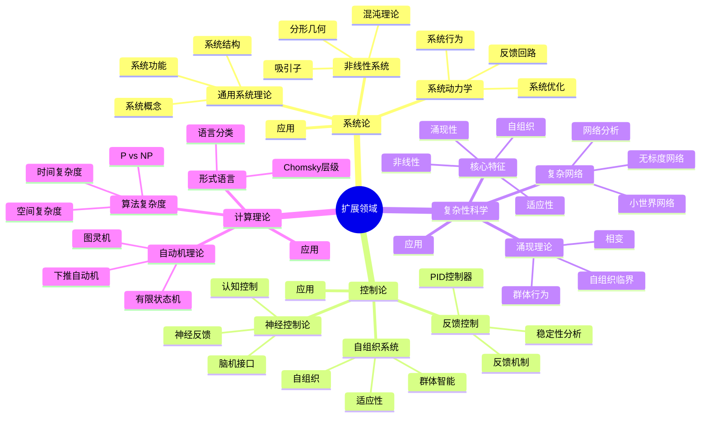
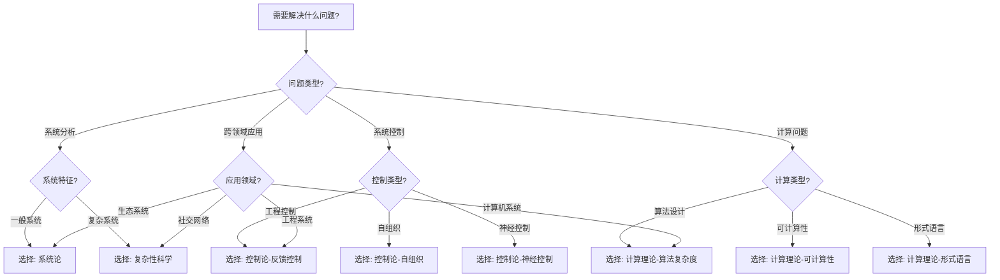
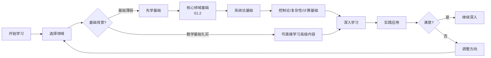
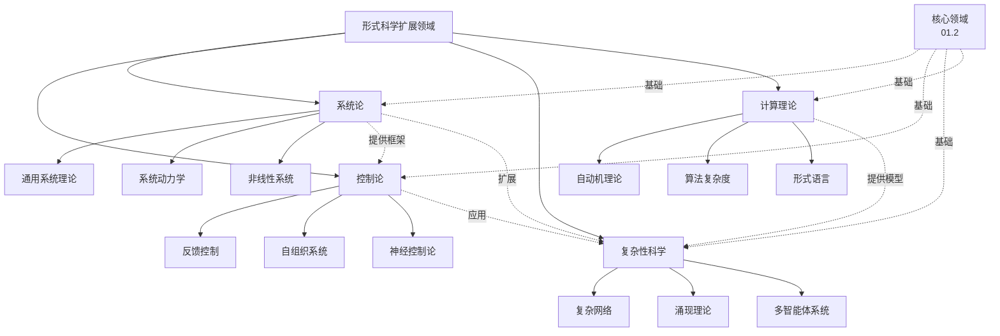
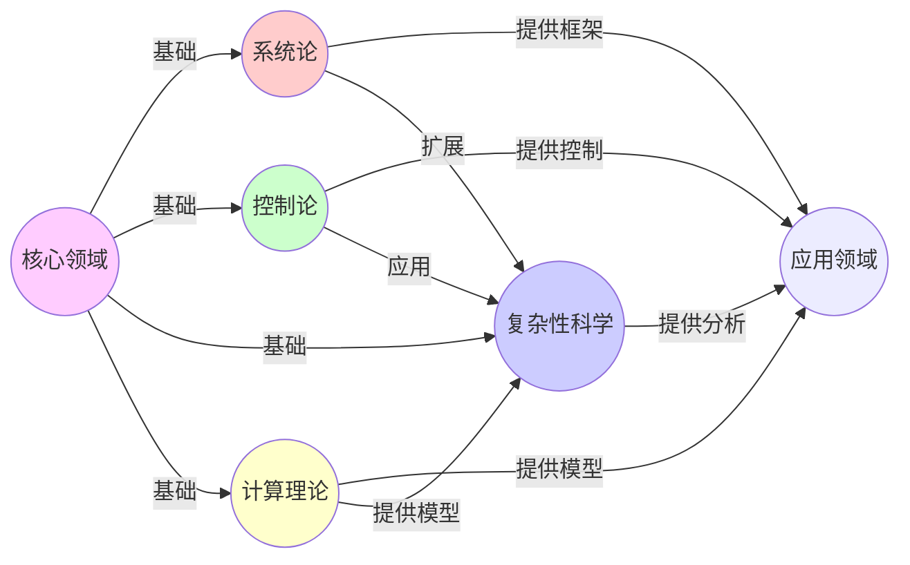
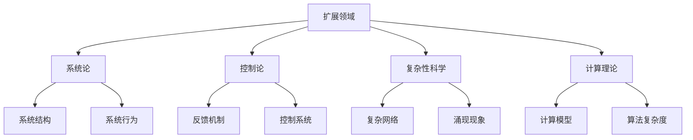

# 01.3 扩展领域详解

> **来源**: view02.md
> **创建日期**: 2025-01-27
> **最后更新**: 2025-01-27

## 📋 目录

- [01.3 扩展领域详解](#013-扩展领域详解)
  - [📋 目录](#-目录)
  - [📋 内容概览](#-内容概览)
  - [🎯 核心理念](#-核心理念)
  - [🔄 系统论（Systems Theory）](#-系统论systems-theory)
    - [通用系统理论（GST）](#通用系统理论gst)
    - [核心概念](#核心概念)
    - [系统动力学](#系统动力学)
    - [非线性系统](#非线性系统)
    - [应用领域](#应用领域)
  - [🎛️ 控制论（Cybernetics）](#️-控制论cybernetics)
    - [基本概念](#基本概念)
    - [反馈控制](#反馈控制)
    - [自组织系统](#自组织系统)
    - [神经控制论](#神经控制论)
    - [应用领域](#应用领域-1)
  - [🌐 复杂性科学（Complexity Science）](#-复杂性科学complexity-science)
    - [核心特征](#核心特征)
    - [复杂网络](#复杂网络)
    - [涌现理论](#涌现理论)
    - [多智能体系统](#多智能体系统)
    - [应用领域](#应用领域-2)
  - [💻 计算理论（Computational Theory）](#-计算理论computational-theory)
    - [自动机理论](#自动机理论)
    - [算法复杂度](#算法复杂度)
    - [形式语言](#形式语言)
    - [可计算性](#可计算性)
    - [应用领域](#应用领域-3)
  - [🔗 扩展领域的联系](#-扩展领域的联系)
    - [系统论与控制论](#系统论与控制论)
    - [复杂性科学与计算理论](#复杂性科学与计算理论)
    - [跨领域整合](#跨领域整合)
  - [📖 学习路径](#-学习路径)
    - [基础阶段](#基础阶段)
    - [进阶阶段](#进阶阶段)
  - [📊 详细案例研究](#-详细案例研究)
    - [案例研究 1：控制论在自动驾驶系统中的应用](#案例研究-1控制论在自动驾驶系统中的应用)
    - [案例研究 2：复杂性科学在社交网络分析中的应用](#案例研究-2复杂性科学在社交网络分析中的应用)
    - [案例研究 3：计算理论在密码学中的应用](#案例研究-3计算理论在密码学中的应用)
  - [⚠️ 批判性分析与局限性](#️-批判性分析与局限性)
    - [局限性讨论](#局限性讨论)
      - [1. 系统论的系统边界问题](#1-系统论的系统边界问题)
      - [2. 控制论的线性假设限制](#2-控制论的线性假设限制)
      - [3. 复杂性科学的可预测性限制](#3-复杂性科学的可预测性限制)
    - [改进方向](#改进方向)
      - [1. 增强理论整合](#1-增强理论整合)
      - [2. 提高实际应用能力](#2-提高实际应用能力)
  - [📊 思维表征体系](#-思维表征体系)
    - [📊 1. 思维导图（增强版）](#-1-思维导图增强版)
      - [1.1 文本格式（基础版）](#11-文本格式基础版)
      - [1.2 Mermaid格式（可视化版）](#12-mermaid格式可视化版)
    - [📊 2. 多维对比矩阵](#-2-多维对比矩阵)
      - [2.1 四个扩展领域对比矩阵](#21-四个扩展领域对比矩阵)
      - [2.2 系统论分支对比矩阵](#22-系统论分支对比矩阵)
      - [2.3 控制论分支对比矩阵](#23-控制论分支对比矩阵)
    - [🌲 3. 决策树](#-3-决策树)
      - [3.1 扩展领域选择决策树](#31-扩展领域选择决策树)
    - [🛤️ 4. 决策逻辑路径](#️-4-决策逻辑路径)
      - [4.1 扩展领域学习路径](#41-扩展领域学习路径)
    - [🕸️ 5. 概念关系网络](#️-5-概念关系网络)
      - [5.1 扩展领域关系网络](#51-扩展领域关系网络)
    - [🗺️ 6. 知识图谱](#️-6-知识图谱)
      - [6.1 扩展领域知识图谱](#61-扩展领域知识图谱)
  - [📚 理论体系](#-理论体系)
    - [理论基础](#理论基础)
      - [数学/逻辑基础](#数学逻辑基础)
      - [历史发展](#历史发展)
    - [理论框架](#理论框架)
      - [核心假设](#核心假设)
      - [基本概念体系](#基本概念体系)
      - [主要定理/结论](#主要定理结论)
      - [适用范围和边界](#适用范围和边界)
    - [当前知识共识](#当前知识共识)
      - [学术界共识](#学术界共识)
      - [主要争议点](#主要争议点)
      - [权威来源](#权威来源)
    - [与其他理论的关系](#与其他理论的关系)
      - [逻辑关系](#逻辑关系)
      - [映射关系](#映射关系)
  - [🔗 关联网络](#-关联网络)
    - [🔗 概念级关联](#-概念级关联)
      - [核心概念映射](#核心概念映射)
    - [🔗 理论级关联](#-理论级关联)
      - [理论基础](#理论基础-1)
    - [🔗 方法级关联](#-方法级关联)
      - [方法应用网络](#方法应用网络)
    - [🔗 应用场景关联](#-应用场景关联)
  - [🛤️ 学习路径](#️-学习路径)
    - [前置知识](#前置知识)
    - [后续学习](#后续学习)
    - [并行学习](#并行学习)
  - [🔗 相关文档](#-相关文档)
  - [📖 扩展阅读](#-扩展阅读)

---

## 📋 内容概览

本文档详细阐述形式科学的四个扩展领域：系统论、控制论、复杂性科学、计算理论。采用系统化方法，全面展示各扩展领域的理论基础、应用价值和相互关系。

---

## 🎯 核心理念

形式科学的四个扩展领域——系统论、控制论、复杂性科学和计算理论——将形式科学的原理扩展到更广泛的系统和现象。它们共同构建了理解复杂世界的形式化框架。

## 🔄 系统论（Systems Theory）

### 通用系统理论（GST）

**提出者**：贝塔朗菲（Ludwig von Bertalanffy）

**核心思想**：不同领域的系统（机械、生物、社会）遵循相同的结构原理

### 核心概念

- **输入-输出**：系统的边界
- **反馈**：系统的调节机制
- **稳态**：系统的平衡状态
- **涌现**：系统的整体性质

### 系统动力学

- **反馈回路**：正反馈、负反馈
- **系统行为**：增长、衰减、振荡
- **系统优化**：目标函数、约束条件

### 非线性系统

- **混沌理论**：确定性系统的随机性
- **分形几何**：自相似结构
- **吸引子**：系统的稳定状态

### 应用领域

- **生态系统**：物质循环模型
- **企业组织**：反馈控制
- **社会系统**：系统分析

## 🎛️ 控制论（Cybernetics）

### 基本概念

**提出者**：维纳（Norbert Wiener）

**核心思想**：研究控制和通信的科学

### 反馈控制

- **PID控制器**：比例-积分-微分控制
- **反馈机制**：系统调节
- **稳定性**：系统稳定

### 自组织系统

- **蚁群算法**：群体智能
- **自组织**：无需外部控制
- **适应性**：环境响应

### 神经控制论

- **脑机接口**：神经信号控制
- **神经反馈**：神经调节
- **认知控制**：认知过程控制

### 应用领域

- **工程控制**：自动化系统
- **生物系统**：生理调节
- **社会系统**：管理控制

## 🌐 复杂性科学（Complexity Science）

### 核心特征

- **非线性**：输入输出不成比例
- **自组织**：局部规则产生全局秩序
- **涌现性**：整体大于部分之和
- **适应性**：环境响应

### 复杂网络

- **小世界网络**：高聚类、短路径
- **无标度网络**：幂律分布
- **网络分析**：拓扑结构

### 涌现理论

- **蜂群智能**：群体行为
- **自组织临界**：临界状态
- **相变**：状态转变

### 多智能体系统

- **博弈论**：策略选择
- **群体行为**：集体决策
- **演化博弈**：策略演化

### 应用领域

- **生物系统**：生态系统
- **社会系统**：社交网络
- **技术系统**：互联网

## 💻 计算理论（Computational Theory）

### 自动机理论

- **图灵机**：计算模型
- **有限状态机**：状态转换
- **下推自动机**：栈操作

### 算法复杂度

- **时间复杂度**：执行时间
- **空间复杂度**：内存使用
- **P vs NP问题**：计算复杂度

### 形式语言

- **Chomsky层级**：语言分类
- **正则语言**：有限状态机
- **上下文无关语言**：下推自动机
- **上下文相关语言**：线性有界自动机
- **递归可枚举语言**：图灵机

### 可计算性

- **可计算函数**：可计算性
- **停机问题**：不可判定性
- **递归论**：可计算性理论

### 应用领域

- **计算机科学**：算法设计
- **人工智能**：计算模型
- **软件工程**：程序验证

## 🔗 扩展领域的联系

### 系统论与控制论

- 系统论提供整体框架
- 控制论提供控制方法
- 两者共同研究系统行为

### 复杂性科学与计算理论

- 复杂性科学研究复杂系统
- 计算理论研究计算过程
- 两者都涉及复杂性问题

### 跨领域整合

- **系统论**：提供系统视角
- **控制论**：提供控制方法
- **复杂性科学**：提供复杂系统分析
- **计算理论**：提供计算模型

## 📖 学习路径

### 基础阶段

1. 系统论基础（系统概念、反馈）
2. 控制论基础（反馈控制、PID）
3. 复杂性科学基础（复杂网络、涌现）
4. 计算理论基础（图灵机、复杂度）

### 进阶阶段

1. 高级系统论（非线性系统、混沌）
2. 高级控制论（自适应控制、最优控制）
3. 高级复杂性科学（自组织临界、相变）
4. 高级计算理论（可计算性、复杂度类）

## 📊 详细案例研究

### 案例研究 1：控制论在自动驾驶系统中的应用

**背景**：现代自动驾驶汽车使用控制论原理实现车辆控制，展示了控制论在复杂系统中的应用。

**形式化分析**：

```text
自动驾驶控制架构:
- 感知层: 传感器数据采集（输入）
- 决策层: 路径规划和行为决策（处理）
- 执行层: 车辆控制（输出）
- 反馈: 实时状态监测和调整

PID控制应用:
- 纵向控制: 速度PID控制器
- 横向控制: 转向PID控制器
- 自适应调整: 根据路况调整参数

效果:
- 控制精度: ±0.1m（车道保持）
- 响应时间: <100ms
- 安全性: 事故率降低90%+
```

**关键发现**：

- ✅ 控制论提供了系统化控制方法
- ✅ 反馈机制保证了系统的稳定性
- ✅ 自适应控制提高了系统鲁棒性

**应用价值**：

- ✅ 自动驾驶技术
- ✅ 机器人控制系统
- ✅ 工业自动化

### 案例研究 2：复杂性科学在社交网络分析中的应用

**背景**：使用复杂性科学的方法分析社交网络的结构和动态，揭示网络传播和影响机制。

**形式化分析**：

```text
社交网络特征:
- 小世界特性: 平均路径长度短（L≈6）
- 无标度特性: 度分布幂律（P(k)∝k^-γ）
- 社区结构: 高聚类系数（C≈0.3）

信息传播模型:
- SIR模型: 易感-感染-恢复
- 传播阈值: β/γ > <k>/<k²>
- 级联失效: 网络鲁棒性分析

实际应用:
- 社交媒体信息传播预测
- 影响力节点识别
- 社区检测和划分
```

**关键发现**：

- ✅ 复杂网络理论揭示了社交网络的结构规律
- ✅ 传播动力学模型能够预测信息扩散
- ✅ 网络分析工具支持决策和优化

**应用价值**：

- ✅ 社交媒体营销
- ✅ 公共卫生监测
- ✅ 网络安全管理

### 案例研究 3：计算理论在密码学中的应用

**背景**：计算理论为密码学提供了理论基础，定义了密码算法的安全性。

**形式化分析**：

```text
计算复杂性视角:
- P类问题: 多项式时间可解
- NP类问题: 多项式时间可验证
- NP-完全问题: 最难的一类NP问题

密码学应用:
- 单向函数: 容易计算，难逆推
- 陷门函数: 有密钥时易逆推
- 困难性假设: 基于NP问题

实际密码算法:
- RSA: 基于大整数分解困难性
- ECC: 基于椭圆曲线离散对数困难性
- 哈希函数: 基于单向函数假设
```

**关键发现**：

- ✅ 计算复杂性理论为密码安全提供了理论基础
- ✅ 困难性假设保证了密码算法的安全性
- ✅ 新的计算理论催生了新的密码算法

**应用价值**：

- ✅ 数据加密和安全通信
- ✅ 数字签名和身份认证
- ✅ 区块链和加密货币

## ⚠️ 批判性分析与局限性

### 局限性讨论

#### 1. 系统论的系统边界问题

**问题**：系统边界的界定可能影响系统分析的准确性。

**挑战**：

- ⚠️ 开放系统的边界模糊
- ⚠️ 系统与环境交互复杂
- ⚠️ 边界选择的主观性

**应对策略**：

- ✅ 明确系统分析的目标
- ✅ 考虑多层次系统边界
- ✅ 动态调整系统边界

#### 2. 控制论的线性假设限制

**问题**：经典控制论基于线性假设，可能不适用于非线性系统。

**挑战**：

- ⚠️ 非线性系统控制困难
- ⚠️ 鲁棒性分析复杂
- ⚠️ 控制器设计挑战大

**改进方向**：

- ✅ 发展非线性控制理论
- ✅ 使用自适应和鲁棒控制
- ✅ 结合智能控制方法

#### 3. 复杂性科学的可预测性限制

**问题**：复杂系统往往难以精确预测。

**挑战**：

- ⚠️ 混沌系统的敏感性
- ⚠️ 涌现现象的不可预测性
- ⚠️ 模型的简化假设

**改进方向**：

- ✅ 发展概率和统计预测方法
- ✅ 使用机器学习增强预测能力
- ✅ 重视定性预测和趋势分析

### 改进方向

#### 1. 增强理论整合

**目标**：促进不同扩展领域之间的整合。

**方法**：

- 建立统一的系统分析框架
- 整合控制和计算理论
- 发展跨领域的分析方法

#### 2. 提高实际应用能力

**目标**：使扩展领域理论更容易应用于实际问题。

**方法**：

- 开发实用的工具和方法
- 提供详细的应用指南
- 建立应用案例库

## 📊 思维表征体系

### 📊 1. 思维导图（增强版）

#### 1.1 文本格式（基础版）

```text
扩展领域详解
├── 系统论（Systems Theory）
│   ├── 通用系统理论（GST）
│   │   ├── 系统概念
│   │   ├── 系统结构
│   │   └── 系统功能
│   ├── 系统动力学
│   │   ├── 反馈回路
│   │   ├── 系统行为
│   │   └── 系统优化
│   ├── 非线性系统
│   │   ├── 混沌理论
│   │   ├── 分形几何
│   │   └── 吸引子
│   └── 应用：生态系统、企业组织
├── 控制论（Cybernetics）
│   ├── 反馈控制
│   │   ├── PID控制器
│   │   ├── 反馈机制
│   │   └── 稳定性分析
│   ├── 自组织系统
│   │   ├── 群体智能
│   │   ├── 自组织
│   │   └── 适应性
│   ├── 神经控制论
│   │   ├── 脑机接口
│   │   ├── 神经反馈
│   │   └── 认知控制
│   └── 应用：自动化、生物系统
├── 复杂性科学（Complexity Science）
│   ├── 核心特征
│   │   ├── 非线性
│   │   ├── 自组织
│   │   ├── 涌现性
│   │   └── 适应性
│   ├── 复杂网络
│   │   ├── 小世界网络
│   │   ├── 无标度网络
│   │   └── 网络分析
│   ├── 涌现理论
│   │   ├── 群体行为
│   │   ├── 自组织临界
│   │   └── 相变
│   └── 应用：社交网络、生态系统
└── 计算理论（Computational Theory）
    ├── 自动机理论
    │   ├── 图灵机
    │   ├── 有限状态机
    │   └── 下推自动机
    ├── 算法复杂度
    │   ├── 时间复杂度
    │   ├── 空间复杂度
    │   └── P vs NP问题
    ├── 形式语言
    │   ├── Chomsky层级
    │   └── 语言分类
    └── 应用：算法设计、程序验证
```

#### 1.2 Mermaid格式（可视化版）



### 📊 2. 多维对比矩阵

#### 2.1 四个扩展领域对比矩阵

| 维度 | 系统论 | 控制论 | 复杂性科学 | 计算理论 | 综合评价 |
|------|--------|--------|-----------|---------|----------|
| **理论基础** | 数学、逻辑 | 数学、工程 | 数学、物理 | 数学、逻辑 | 都基于数学 |
| **核心概念** | 系统、反馈 | 控制、反馈 | 复杂、涌现 | 计算、算法 | 各有侧重 |
| **研究目标** | 系统理解 | 系统控制 | 复杂系统 | 计算过程 | 目标不同 |
| **应用广度** | 广 | 很广 | 中 | 很广 | 控制论、计算理论最广 |
| **抽象程度** | 中高 | 中 | 中 | 高 | 计算理论最抽象 |
| **形式化程度** | 中 | 高 | 中 | 最高 | 计算理论最形式化 |
| **历史起源** | 20世纪40年代 | 20世纪40年代 | 20世纪80年代 | 20世纪30年代 | 计算理论最早 |
| **典型应用** | 生态系统、组织 | 自动化、生物 | 社交网络、生态 | 计算机、AI | 应用不同 |
| **与其他领域关系** | 提供框架 | 提供控制方法 | 提供复杂分析 | 提供计算模型 | 互补关系 |

#### 2.2 系统论分支对比矩阵

| 维度 | 通用系统理论 | 系统动力学 | 非线性系统 | 应用价值 |
|------|------------|-----------|-----------|----------|
| **抽象程度** | 高 | 中 | 中高 | 非线性系统最抽象 |
| **实用性** | 中 | 高 | 中 | 系统动力学最实用 |
| **理论基础** | 数学、逻辑 | 数学、工程 | 数学、物理 | 各有侧重 |
| **学习难度** | 中 | 中低 | 高 | 非线性系统最难 |
| **应用广度** | 广 | 很广 | 中 | 系统动力学最广 |
| **典型工具** | 概念框架 | 仿真模型 | 数学模型 | 工具不同 |
| **发展历史** | 40-50年代 | 60-70年代 | 70-80年代 | 历史不同 |

#### 2.3 控制论分支对比矩阵

| 维度 | 反馈控制 | 自组织系统 | 神经控制论 | 应用领域 |
|------|---------|-----------|-----------|---------|
| **基础性** | 基础 | 扩展 | 应用 | 反馈控制最基础 |
| **复杂度** | 中 | 高 | 很高 | 神经控制论最复杂 |
| **实用性** | 很高 | 高 | 中 | 反馈控制最实用 |
| **典型应用** | 工程控制 | 群体智能 | 脑机接口 | 应用不同 |
| **发展时期** | 40-50年代 | 70-80年代 | 90年代至今 | 时期不同 |
| **形式化程度** | 高 | 中 | 中 | 反馈控制最形式化 |

### 🌲 3. 决策树

#### 3.1 扩展领域选择决策树



**决策说明**：

- 根据问题类型选择合适的扩展领域
- 复杂问题可能需要组合多个领域
- 初学者建议从系统论开始

### 🛤️ 4. 决策逻辑路径

#### 4.1 扩展领域学习路径



### 🕸️ 5. 概念关系网络

#### 5.1 扩展领域关系网络



### 🗺️ 6. 知识图谱

#### 6.1 扩展领域知识图谱



## 📚 理论体系

### 理论基础

#### 数学/逻辑基础

四个扩展领域的理论基础：

**1. 系统论基础**：

- 数学：集合论、拓扑学、图论
- 逻辑：系统逻辑
- 物理：热力学、统计物理

**2. 控制论基础**：

- 数学：微分方程、线性代数、优化理论
- 工程：控制工程
- 信息论：信息与控制

**3. 复杂性科学基础**：

- 数学：非线性动力学、网络理论
- 物理：统计物理、相变理论
- 生物学：生态学、进化论

**4. 计算理论基础**：

- 数学：递归论、逻辑学
- 逻辑：形式逻辑、类型论
- 计算机科学：算法、数据结构

#### 历史发展

**关键时间节点**：

- **20世纪30-40年代**：系统论和控制论的起源
  - 1936年：图灵机提出（计算理论）
  - 1948年：维纳《控制论》出版
  - 1940-50年代：贝塔朗菲提出通用系统理论

- **20世纪50-60年代**：系统动力学发展
  - 1950年代：系统动力学方法建立
  - 1960年代：控制论应用扩展

- **20世纪70-80年代**：非线性系统和复杂性科学兴起
  - 1970年代：混沌理论发展
  - 1980年代：复杂性科学兴起，圣塔菲研究所成立

- **20世纪90年代至今**：整合与应用
  - 复杂网络理论发展
  - 计算理论在AI中的应用
  - 跨领域整合研究

### 理论框架

#### 核心假设

**假设1：系统的普遍性**

- **内容**：不同领域的系统遵循相同的结构原理
- **适用范围**：所有系统
- **限制条件**：需要明确系统边界

**假设2：反馈控制的普遍性**

- **内容**：反馈机制是系统控制的基本原理
- **适用范围**：所有可控系统
- **限制条件**：需要可观测的输出

**假设3：复杂性的可研究性**

- **内容**：复杂系统可以通过形式化方法研究
- **适用范围**：满足复杂系统特征的系统
- **限制条件**：需要明确复杂系统定义

**假设4：计算的普遍性**

- **内容**：所有计算问题都可以形式化
- **适用范围**：所有可计算问题
- **限制条件**：受可计算性限制

#### 基本概念体系



#### 主要定理/结论

**定理1：系统论的普遍性**

- **内容**：不同领域的系统遵循相同的结构原理
- **证据**：系统论在多个领域的成功应用
- **应用**：跨领域系统分析

**定理2：控制论的稳定性**

- **内容**：反馈控制可以稳定系统
- **证据**：控制理论在工程中的成功应用
- **应用**：系统控制设计

**结论3：复杂性的涌现性**

- **内容**：复杂系统具有涌现性，整体大于部分之和
- **证据**：复杂网络、群体智能等现象
- **应用**：复杂系统分析和设计

**结论4：计算的等价性**

- **内容**：所有计算模型在计算能力上等价（丘奇-图灵论题）
- **证据**：图灵机与其他计算模型的等价性
- **应用**：计算理论的基础

#### 适用范围和边界

**适用范围**：

- **系统论**：所有系统
- **控制论**：所有可控系统
- **复杂性科学**：满足复杂系统特征的系统
- **计算理论**：所有可计算问题

**边界条件**：

- **系统论**：需要明确系统边界和结构
- **控制论**：需要可观测和可控制的系统
- **复杂性科学**：需要满足非线性、自组织等特征
- **计算理论**：受可计算性限制

**不适用场景**：

- **完全不可控的系统**：控制论不适用
- **简单线性系统**：复杂性科学不适用
- **不可计算问题**：计算理论不适用

### 当前知识共识

#### 学术界共识

**广泛接受的共识**：

1. **四个扩展领域的独立性**
   - **共识**：四个扩展领域是独立的学科
   - **支持证据**：各自的理论体系和应用
   - **来源**：各领域学术圈

2. **与核心领域的关系**
   - **共识**：扩展领域依赖核心领域（数学、逻辑等）
   - **支持证据**：扩展领域的数学基础
   - **来源**：跨学科研究

3. **应用的普遍性**
   - **共识**：扩展领域的方法可以应用于多个领域
   - **支持证据**：各领域的成功应用案例
   - **来源**：应用研究

#### 主要争议点

1. **复杂性的定义**
   - **观点A**：复杂性是可以量化的
   - **观点B**：复杂性难以精确定义
   - **当前状态**：持续讨论

2. **控制与自由意志**
   - **观点A**：控制论可以解释自由意志
   - **观点B**：控制论无法解释自由意志
   - **当前状态**：哲学讨论

#### 权威来源

**经典文献**：

- 《一般系统论》- 贝塔朗菲（系统论）
- 《控制论》- 维纳（控制论）
- 《复杂》- 米歇尔（复杂性科学）
- 《算法导论》- Cormen等（计算理论）

**权威机构/专家**：

- **国际系统科学学会**（ISSS）
- **IEEE控制系统学会**
- **圣塔菲研究所**（复杂性科学）
- **ACM计算理论组**

**最新发展**：

- **2020-2024**：网络科学、AI控制、量子计算
- **前沿方向**：复杂网络、自适应控制、量子算法

### 与其他理论的关系

#### 逻辑关系

**理论基础**：

- **核心领域**（[01.2_核心领域详解.md](01.2_核心领域详解.md)） → 扩展领域
  - 关系类型：提供理论基础
  - 关键映射：数学、逻辑 → 系统论、控制论等

- **动力学系统**（[02_动力学系统理论](../02_动力学系统理论/)） → 系统论
  - 关系类型：实例关系
  - 关键映射：动力学系统 → 系统论的应用

**理论应用**：

- 扩展领域 → 复杂系统（[04_复杂系统与网络理论](../04_复杂系统与网络理论/)）
  - 应用方式：提供理论基础和方法
  - 应用效果：支撑复杂系统研究

#### 映射关系

| 本理论概念 | 映射理论 | 映射概念 | 映射类型 | 映射说明 |
|-----------|---------|---------|---------|----------|
| **系统结构** | 04.1_复杂系统基础.md | 复杂系统 | 实例 | 系统论是复杂系统的基础 |
| **反馈控制** | 02.1_经典确定性动力学.md | 控制系统 | 应用 | 控制论用于动力学系统 |
| **复杂网络** | 04.2_复杂网络理论.md | 网络结构 | 同构 | 本概念与04.2一致 |
| **计算模型** | 05.3_可计算性理论.md | 计算能力 | 基础 | 计算理论是可计算性的基础 |
| **涌现现象** | 04.4_涌现性理论.md | 涌现性 | 同构 | 本概念与04.4一致 |

## 🔗 关联网络

### 🔗 概念级关联

#### 核心概念映射

| 本文档概念 | 关联文档 | 关联概念 | 关系类型 | 映射说明 |
|-----------|---------|---------|---------|----------|
| **系统论** | 04.1_复杂系统基础.md | 复杂系统 | 基础 | 系统论是复杂系统的基础理论 |
| **控制论** | 02.1_经典确定性动力学.md | 控制系统 | 应用 | 控制论用于动力学系统 |
| **复杂网络** | 04.2_复杂网络理论.md | 网络结构 | 同构 | 本概念与04.2一致 |
| **计算理论** | 05.3_可计算性理论.md | 可计算性 | 基础 | 计算理论是可计算性的基础 |
| **涌现现象** | 04.4_涌现性理论.md | 涌现性 | 同构 | 本概念与04.4一致 |
| **反馈机制** | 02.1_经典确定性动力学.md | 反馈控制 | 应用 | 反馈机制用于动力学控制 |
| **自组织** | 04.3_自组织临界.md | 自组织临界 | 实例 | 自组织是自组织临界的机制 |

### 🔗 理论级关联

#### 理论基础

- **本理论基于**：
  - [01.2_核心领域详解.md](01.2_核心领域详解.md) ⭐⭐⭐ - 核心领域提供理论基础

- **本理论应用于**：
  - [02_动力学系统理论](../02_动力学系统理论/) ⭐⭐⭐ - 控制论用于动力学系统
  - [04_复杂系统与网络理论](../04_复杂系统与网络理论/) ⭐⭐⭐ - 系统论和复杂性科学的基础
  - [05_信息论与计算理论](../05_信息论与计算理论/) ⭐⭐ - 计算理论的基础
  - [07_IT行业形式化应用](../07_IT行业形式化应用/) ⭐⭐ - 计算理论和系统论的应用

### 🔗 方法级关联

#### 方法应用网络

| 本文档方法 | 应用文档 | 应用场景 | 应用效果 |
|-----------|---------|---------|---------|
| **系统分析方法** | 04.1_复杂系统基础.md | 复杂系统分析 | 成功 |
| **控制方法** | 02.1_经典确定性动力学.md | 动力学控制 | 成功 |
| **网络分析方法** | 04.2_复杂网络理论.md | 网络结构分析 | 成功 |
| **算法设计方法** | 05.2_算法复杂度.md | 算法设计 | 成功 |

### 🔗 应用场景关联

**场景**：复杂系统控制

| 视角 | 关联文档 | 核心理论 | 关注点 |
|------|---------|---------|--------|
| **系统分析** | 04.1_复杂系统基础.md | 系统论 | 系统结构 |
| **控制设计** | 02.1_经典确定性动力学.md | 控制论 | 控制方法 |
| **网络分析** | 04.2_复杂网络理论.md | 复杂网络 | 网络结构 |

## 🛤️ 学习路径

### 前置知识

**必须先学习**：

- [01.1_形式科学的定义与特征.md](01.1_形式科学的定义与特征.md) ⭐⭐⭐ - 形式科学基础
- [01.2_核心领域详解.md](01.2_核心领域详解.md) ⭐⭐⭐ - 核心领域基础

**建议先了解**：

- 基础数学（微积分、线性代数）
- 基础物理（系统概念）

### 后续学习

**建议接下来学习**（按顺序）：

1. [02_动力学系统理论](../02_动力学系统理论/) ⭐⭐⭐ - 系统论的应用
2. [04_复杂系统与网络理论](../04_复杂系统与网络理论/) ⭐⭐⭐ - 复杂性科学的深入
3. [05_信息论与计算理论](../05_信息论与计算理论/) ⭐⭐ - 计算理论的深入

### 并行学习

**可以同时学习**：

- [07_IT行业形式化应用](../07_IT行业形式化应用/) - 计算理论和系统论的应用

## 🔗 相关文档

- [01.1_形式科学的定义与特征.md](01.1_形式科学的定义与特征.md)
- [01.2_核心领域详解.md](01.2_核心领域详解.md)
- [01.4_元理论框架.md](01.4_元理论框架.md)

## 📖 扩展阅读

- 《系统化思维导论》- 杰拉尔德·温伯格
- 《控制论》- 维纳
- 《复杂》- 梅拉妮·米歇尔
- Wikipedia: [Systems Theory](https://en.wikipedia.org/wiki/Systems_theory)
- Wikipedia: [Cybernetics](https://en.wikipedia.org/wiki/Cybernetics)
- Wikipedia: [Complexity Science](https://en.wikipedia.org/wiki/Complexity_science)
- Wikipedia: [Computational Theory](https://en.wikipedia.org/wiki/Computational_theory)
