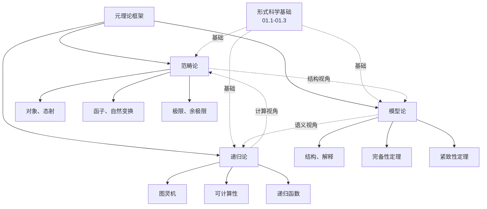

# 01.4 元理论框架

> **来源**: view02.md, view06.md
> **创建日期**: 2025-01-27
> **最后更新**: 2025-01-27

## 📋 目录

- [01.4 元理论框架](#014-元理论框架)
  - [📋 目录](#-目录)
  - [📋 内容概览](#-内容概览)
  - [🎯 核心理念](#-核心理念)
  - [📚 范畴论（Category Theory）](#-范畴论category-theory)
    - [基本概念](#基本概念)
    - [核心构造](#核心构造)
      - [函子（Functor）](#函子functor)
      - [自然变换（Natural Transformation）](#自然变换natural-transformation)
      - [极限与余极限](#极限与余极限)
    - [应用领域](#应用领域)
  - [🔬 模型论（Model Theory）](#-模型论model-theory)
    - [基本概念](#基本概念-1)
    - [核心定理](#核心定理)
      - [哥德尔完备性定理](#哥德尔完备性定理)
      - [紧致性定理](#紧致性定理)
      - [Löwenheim-Skolem定理](#löwenheim-skolem定理)
    - [应用领域](#应用领域-1)
  - [🔄 递归论（Recursion Theory）](#-递归论recursion-theory)
    - [基本概念](#基本概念-2)
    - [核心概念](#核心概念)
      - [图灵机](#图灵机)
      - [停机问题](#停机问题)
      - [递归函数](#递归函数)
    - [应用领域](#应用领域-2)
  - [🔗 三个框架的关系](#-三个框架的关系)
    - [范畴论 ↔ 模型论](#范畴论--模型论)
    - [模型论 ↔ 递归论](#模型论--递归论)
    - [递归论 ↔ 范畴论](#递归论--范畴论)
  - [📊 统一视角](#-统一视角)
    - [形式科学的三个层次](#形式科学的三个层次)
    - [认知升维](#认知升维)
  - [📊 详细案例研究](#-详细案例研究)
    - [案例研究 1：范畴论在编程语言设计中的应用](#案例研究-1范畴论在编程语言设计中的应用)
    - [案例研究 2：模型论在程序验证中的应用](#案例研究-2模型论在程序验证中的应用)
    - [案例研究 3：递归论在算法理论中的应用](#案例研究-3递归论在算法理论中的应用)
  - [⚠️ 批判性分析与局限性](#️-批判性分析与局限性)
    - [局限性讨论](#局限性讨论)
      - [1. 范畴论的抽象性挑战](#1-范畴论的抽象性挑战)
      - [2. 模型论的表达能力限制](#2-模型论的表达能力限制)
      - [3. 递归论的实际应用局限](#3-递归论的实际应用局限)
    - [改进方向](#改进方向)
      - [1. 增强理论整合](#1-增强理论整合)
      - [2. 提高可访问性](#2-提高可访问性)
  - [📊 思维表征体系](#-思维表征体系)
    - [📊 1. 思维导图（增强版）](#-1-思维导图增强版)
      - [1.1 文本格式（基础版）](#11-文本格式基础版)
      - [1.2 Mermaid格式（可视化版）](#12-mermaid格式可视化版)
    - [📊 2. 多维对比矩阵](#-2-多维对比矩阵)
      - [2.1 三个元理论框架对比矩阵](#21-三个元理论框架对比矩阵)
      - [2.2 范畴论分支对比矩阵](#22-范畴论分支对比矩阵)
      - [2.3 模型论核心定理对比矩阵](#23-模型论核心定理对比矩阵)
    - [🌲 3. 决策树](#-3-决策树)
      - [3.1 元理论框架选择决策树](#31-元理论框架选择决策树)
    - [🛤️ 4. 决策逻辑路径](#️-4-决策逻辑路径)
      - [4.1 元理论框架学习路径](#41-元理论框架学习路径)
    - [🕸️ 5. 概念关系网络](#️-5-概念关系网络)
      - [5.1 三个框架关系网络](#51-三个框架关系网络)
    - [🗺️ 6. 知识图谱](#️-6-知识图谱)
      - [6.1 元理论框架知识图谱](#61-元理论框架知识图谱)
  - [📚 理论体系](#-理论体系)
    - [理论基础](#理论基础)
      - [数学/逻辑基础](#数学逻辑基础)
      - [历史发展](#历史发展)
    - [理论框架](#理论框架)
      - [核心假设](#核心假设)
      - [基本概念体系](#基本概念体系)
      - [主要定理/结论](#主要定理结论)
      - [适用范围和边界](#适用范围和边界)
    - [当前知识共识](#当前知识共识)
      - [学术界共识](#学术界共识)
      - [主要争议点](#主要争议点)
      - [权威来源](#权威来源)
    - [与其他理论的关系](#与其他理论的关系)
      - [逻辑关系](#逻辑关系)
      - [映射关系](#映射关系)
  - [🔗 关联网络](#-关联网络)
    - [🔗 概念级关联](#-概念级关联)
      - [核心概念映射](#核心概念映射)
    - [🔗 理论级关联](#-理论级关联)
      - [理论基础](#理论基础-1)
    - [🔗 方法级关联](#-方法级关联)
      - [方法应用网络](#方法应用网络)
    - [🔗 应用场景关联](#-应用场景关联)
  - [🛤️ 学习路径](#️-学习路径)
    - [前置知识](#前置知识)
    - [后续学习](#后续学习)
    - [并行学习](#并行学习)
  - [🔗 相关文档](#-相关文档)
  - [📖 扩展阅读](#-扩展阅读)

---

## 📋 内容概览

本文档阐述形式科学的三个元理论框架：范畴论、模型论、递归论。这三个框架提供了理解形式科学的深层结构和方法，是形式科学的元理论基础。

---

## 🎯 核心理念

元理论框架是研究理论的理论。范畴论、模型论和递归论分别从结构、语义和计算的视角提供了形式科学的统一框架，它们共同构成了形式科学的理论基础。

## 📚 范畴论（Category Theory）

### 基本概念

**范畴** = 对象 + 态射

- **对象** Ob(𝒞)：数学结构
- **态射** Hom(𝒞)：结构间的映射
- **复合律**：态射的复合满足结合律
- **单位元**：每个对象有单位态射

### 核心构造

#### 函子（Functor）

**定义**：范畴间的映射，保持结构

**类型**：

- **协变函子**：F: 𝒞 → 𝒟
- **反变函子**：F: 𝒞^op → 𝒟

#### 自然变换（Natural Transformation）

**定义**：函子间的映射

**意义**：揭示不同表示间的等价性

#### 极限与余极限

**极限**：泛性质构造（积、拉回、等化子）

**余极限**：对偶构造（余积、推出、余等化子）

### 应用领域

- **数学**：统一数学结构
- **计算机科学**：类型系统、程序设计
- **物理学**：量子场论、拓扑量子场论
- **逻辑学**：逻辑语义

## 🔬 模型论（Model Theory）

### 基本概念

**模型** = 结构 + 解释

- **结构**：数学对象（集合、关系、函数）
- **解释**：将形式语言映射到结构
- **满足关系**：结构满足公式

### 核心定理

#### 哥德尔完备性定理

**内容**：一阶逻辑的语法与语义等价

**意义**：证明与真值的一致性

#### 紧致性定理

**内容**：如果公式集的每个有限子集有模型，则整个公式集有模型

**应用**：非标准分析、超实数

#### Löwenheim-Skolem定理

**内容**：如果一阶理论有无限模型，则它有任意基数的模型

**意义**：一阶逻辑无法唯一确定模型大小

### 应用领域

- **数学**：代数几何、数论
- **逻辑学**：可判定性、完备性
- **计算机科学**：程序验证、模型检测

## 🔄 递归论（Recursion Theory）

### 基本概念

**可计算性** = 算法可解性

- **可计算函数**：存在算法计算
- **不可计算函数**：不存在算法计算
- **图灵度**：不可计算性的度量

### 核心概念

#### 图灵机

**定义**：计算模型

**意义**：形式化"算法"概念

#### 停机问题

**内容**：不存在算法判断任意程序是否停机

**意义**：计算的根本限制

#### 递归函数

**类型**：

- **原始递归函数**：基础函数 + 复合 + 原始递归
- **μ-递归函数**：原始递归 + 最小化

**等价性**：与图灵可计算性等价

### 应用领域

- **计算机科学**：算法理论、复杂度理论
- **数学**：数论、逻辑学
- **哲学**：心灵哲学、计算主义

## 🔗 三个框架的关系

### 范畴论 ↔ 模型论

**联系**：

- 范畴论提供结构视角
- 模型论提供语义视角
- 两者共同研究数学结构

### 模型论 ↔ 递归论

**联系**：

- 模型论研究形式语言
- 递归论研究可计算性
- 两者共同研究逻辑系统

### 递归论 ↔ 范畴论

**联系**：

- 递归论研究计算过程
- 范畴论研究结构映射
- 两者共同研究算法结构

## 📊 统一视角

### 形式科学的三个层次

1. **语法层**（递归论）
   - 形式系统
   - 可计算性
   - 算法

2. **语义层**（模型论）
   - 解释
   - 真值
   - 模型

3. **结构层**（范畴论）
   - 对象
   - 态射
   - 函子

### 认知升维

**Level 1**：掌握单一框架

**Level 2**：理解框架间关系

**Level 3**：统一三个框架

**Level 4**：应用框架解决实际问题

## 📊 详细案例研究

### 案例研究 1：范畴论在编程语言设计中的应用

**背景**：范畴论为编程语言提供了统一的理论框架，特别是在函数式编程和类型系统设计中。

**形式化分析**：

```text
Haskell中的范畴结构:
- 对象: 类型（Type）
- 态射: 函数（Function）
- 函子: Functor类型类
- 单子: Monad类型类

函子映射:
- List函子: F: a → [a]
- Maybe函子: F: a → Maybe a
- 函子法则: F(id) = id, F(g∘f) = F(g)∘F(g)

应用:
- 类型安全: 保证程序正确性
- 代码复用: 通过函子抽象通用模式
- 组合性: 通过组合构建复杂程序
```

**关键发现**：

- ✅ 范畴论提供了类型系统的数学基础
- ✅ 函子和单子模式广泛应用于函数式编程
- ✅ 范畴结构保证了代码的正确性和可组合性

**应用价值**：

- ✅ 编程语言设计
- ✅ 函数式编程
- ✅ 类型系统设计

### 案例研究 2：模型论在程序验证中的应用

**背景**：使用模型论方法验证程序是否满足规范，确保程序的正确性。

**形式化分析**：

```text
程序验证框架:
- 规范: 一阶逻辑公式 φ(x, y)
- 程序: 代码片段 P
- 模型: 程序执行的状态空间
- 验证: 证明 M ⊨ φ

实例: 数组边界检查
- 规范: ∀i, 0 ≤ i < n → a[i] 有定义
- 程序: for i in 0..n { a[i] = ... }
- 验证: 使用模型检测或定理证明

工具应用:
- TLA+: 使用TLA进行系统规范
- Alloy: 使用一阶逻辑建模
- 效果: 发现并修复了多个潜在错误
```

**关键发现**：

- ✅ 模型论提供了程序验证的严格方法
- ✅ 形式化规范能够精确描述程序需求
- ✅ 模型检测可以发现传统测试遗漏的错误

**应用价值**：

- ✅ 安全关键系统开发
- ✅ 提高软件可靠性
- ✅ 形式化方法验证

### 案例研究 3：递归论在算法理论中的应用

**背景**：递归论为算法理论提供了可计算性的理论基础，定义了什么是可计算的。

**形式化分析**：

```text
可计算性分类:
- 可计算函数: 存在图灵机计算
- 不可计算函数: 不存在图灵机计算
- 部分可计算: 在某些输入上可计算

实例: 停机问题
- 问题: 判断程序是否停机
- 结论: 不可判定（递归不可枚举）
- 证明: 反证法，构造矛盾

实际影响:
- 算法设计: 知道某些问题不可计算
- 复杂度理论: P vs NP问题的理论基础
- 人工智能: 理解计算的边界
```

**关键发现**：

- ✅ 递归论定义了计算的边界
- ✅ 不可计算性理论揭示了计算的限制
- ✅ 递归论为复杂度理论提供了基础

**应用价值**：

- ✅ 算法设计和分析
- ✅ 计算复杂度理论
- ✅ 人工智能理论基础

## ⚠️ 批判性分析与局限性

### 局限性讨论

#### 1. 范畴论的抽象性挑战

**问题**：范畴论的抽象程度很高，学习和应用门槛较高。

**挑战**：

- ⚠️ 需要深厚的数学背景
- ⚠️ 概念抽象难以直观理解
- ⚠️ 应用转化困难

**应对策略**：

- ✅ 提供直观的解释和例子
- ✅ 建立从应用到理论的桥梁
- ✅ 开发可视化和教学工具

#### 2. 模型论的表达能力限制

**问题**：一阶逻辑的表达能力有限，可能无法表达某些复杂性质。

**挑战**：

- ⚠️ 高阶逻辑的表达能力更强但复杂度更高
- ⚠️ 某些性质难以形式化
- ⚠️ 模型检测的状态空间爆炸

**改进方向**：

- ✅ 发展高阶逻辑和模态逻辑
- ✅ 使用抽象和符号方法
- ✅ 优化模型检测算法

#### 3. 递归论的实际应用局限

**问题**：递归论主要关注可计算性，实际应用中的效率和复杂度关注较少。

**挑战**：

- ⚠️ 可计算不等于可行
- ⚠️ 复杂度分析需要额外理论
- ⚠️ 实际应用的考虑因素更多

**改进方向**：

- ✅ 结合复杂度理论
- ✅ 考虑实际约束
- ✅ 开发实用工具

### 改进方向

#### 1. 增强理论整合

**目标**：促进三个元理论框架之间的整合。

**方法**：

- 建立统一的理论框架
- 研究框架间的对应关系
- 开发跨框架的应用工具

#### 2. 提高可访问性

**目标**：使元理论框架更容易理解和应用。

**方法**：

- 开发直观的教学材料
- 提供丰富的应用案例
- 建立学习路径和教程

## 📊 思维表征体系

### 📊 1. 思维导图（增强版）

#### 1.1 文本格式（基础版）

```text
元理论框架
├── 范畴论（Category Theory）
│   ├── 基本概念
│   │   ├── 对象（Object）
│   │   ├── 态射（Morphism）
│   │   ├── 复合律
│   │   └── 单位元
│   ├── 核心构造
│   │   ├── 函子（Functor）
│   │   │   ├── 协变函子
│   │   │   └── 反变函子
│   │   ├── 自然变换（Natural Transformation）
│   │   └── 极限与余极限
│   │       ├── 积、拉回、等化子
│   │       └── 余积、推出、余等化子
│   └── 应用：编程语言、类型系统
├── 模型论（Model Theory）
│   ├── 基本概念
│   │   ├── 结构（Structure）
│   │   ├── 解释（Interpretation）
│   │   └── 满足关系（Satisfaction）
│   ├── 核心定理
│   │   ├── 哥德尔完备性定理
│   │   ├── 紧致性定理
│   │   └── Löwenheim-Skolem定理
│   └── 应用：程序验证、模型检测
├── 递归论（Recursion Theory）
│   ├── 基本概念
│   │   ├── 可计算函数
│   │   ├── 不可计算函数
│   │   └── 图灵度
│   ├── 核心概念
│   │   ├── 图灵机
│   │   ├── 停机问题
│   │   └── 递归函数
│   │       ├── 原始递归函数
│   │       └── μ-递归函数
│   └── 应用：算法理论、复杂度理论
└── 三个框架的关系
    ├── 范畴论 ↔ 模型论
    │   ├── 结构视角
    │   └── 语义视角
    ├── 模型论 ↔ 递归论
    │   ├── 形式语言
    │   └── 可计算性
    └── 递归论 ↔ 范畴论
        ├── 计算过程
        └── 结构映射
```

#### 1.2 Mermaid格式（可视化版）


### 📊 2. 多维对比矩阵

#### 2.1 三个元理论框架对比矩阵

| 维度 | 范畴论 | 模型论 | 递归论 | 综合评价 |
|------|--------|--------|--------|----------|
| **研究视角** | 结构 | 语义 | 计算 | 视角互补 |
| **核心对象** | 范畴、函子 | 结构、模型 | 函数、算法 | 对象不同 |
| **抽象程度** | 极高 | 高 | 中高 | 范畴论最抽象 |
| **形式化程度** | 最高 | 高 | 高 | 范畴论最形式化 |
| **应用广度** | 广 | 中 | 很广 | 递归论应用最广 |
| **理论基础** | 代数拓扑 | 逻辑学 | 数论、逻辑 | 基础不同 |
| **历史起源** | 1940年代 | 1950年代 | 1930年代 | 递归论最早 |
| **典型应用** | 数学统一、编程 | 程序验证 | 算法理论、AI | 应用不同 |
| **与其他框架关系** | 提供结构视角 | 提供语义视角 | 提供计算视角 | 互补关系 |
| **学习难度** | 很高 | 高 | 中高 | 范畴论最难 |

#### 2.2 范畴论分支对比矩阵

| 维度 | 基本概念 | 函子 | 自然变换 | 极限与余极限 | 应用价值 |
|------|---------|------|---------|-------------|----------|
| **基础性** | 基础 | 核心 | 重要 | 高级 | 基本概念最基础 |
| **抽象程度** | 中高 | 高 | 很高 | 极高 | 极限最抽象 |
| **实用性** | 高 | 很高 | 中 | 中 | 函子最实用 |
| **学习难度** | 中 | 高 | 很高 | 极高 | 基本概念最容易 |
| **应用广度** | 广 | 很广 | 中 | 中 | 函子应用最广 |
| **典型应用** | 所有应用 | 类型系统 | 等价性 | 构造 | 应用不同 |

#### 2.3 模型论核心定理对比矩阵

| 维度 | 哥德尔完备性定理 | 紧致性定理 | Löwenheim-Skolem定理 | 重要性 |
|------|----------------|-----------|---------------------|--------|
| **基础性** | 基础 | 重要 | 重要 | 完备性定理最基础 |
| **应用广度** | 很广 | 中 | 中 | 完备性定理应用最广 |
| **理论意义** | 极大 | 大 | 大 | 完备性定理意义最大 |
| **学习难度** | 中高 | 高 | 中高 | 紧致性定理最难 |
| **典型应用** | 逻辑系统 | 非标准分析 | 模型理论 | 应用不同 |

### 🌲 3. 决策树

#### 3.1 元理论框架选择决策树


**决策说明**：

- 根据问题类型选择合适的元理论框架
- 复杂问题可能需要组合多个框架
- 初学者建议从模型论或递归论开始

### 🛤️ 4. 决策逻辑路径

#### 4.1 元理论框架学习路径


### 🕸️ 5. 概念关系网络

#### 5.1 三个框架关系网络



### 🗺️ 6. 知识图谱

#### 6.1 元理论框架知识图谱


## 📚 理论体系

### 理论基础

#### 数学/逻辑基础

三个元理论框架的理论基础：

**1. 范畴论基础**：

- 数学：代数拓扑、代数几何
- 逻辑：范畴逻辑
- 集合论：范畴作为集合的推广

**2. 模型论基础**：

- 逻辑：一阶逻辑、高阶逻辑
- 数学：集合论、代数
- 理论：形式语言理论

**3. 递归论基础**：

- 数学：数论、集合论
- 逻辑：形式逻辑
- 计算机科学：算法理论

#### 历史发展

**关键时间节点**：

- **1930-1940年代**：递归论的建立
  - 1931年：哥德尔不完备定理
  - 1936年：图灵机提出
  - 1930年代：递归函数理论发展

- **1940-1950年代**：范畴论的起源
  - 1945年：Eilenberg和MacLane引入范畴概念
  - 1950年代：范畴论基本理论建立

- **1950-1960年代**：模型论的发展
  - 1950年代：模型论作为独立学科出现
  - 1950年代：Tarski建立模型论基础

- **1960年代至今**：三个框架的发展与整合
  - 1960年代：范畴论的广泛应用
  - 1970年代：模型论的深入发展
  - 1980年代：三个框架的联系被发现
  - 1990年代至今：统一框架的研究

### 理论框架

#### 核心假设

**假设1：结构的统一性**

- **内容**：不同领域的数学结构可以用范畴统一描述
- **适用范围**：所有数学结构
- **限制条件**：需要明确的范畴定义

**假设2：语义的一致性**

- **内容**：形式系统的语义可以用模型描述
- **适用范围**：所有形式系统
- **限制条件**：需要明确的形式语言

**假设3：计算的等价性**

- **内容**：所有计算模型在计算能力上等价（丘奇-图灵论题）
- **适用范围**：所有计算模型
- **限制条件**：受可计算性限制

#### 基本概念体系


#### 主要定理/结论

**定理1：范畴论的统一性**

- **内容**：不同领域的数学结构可以用范畴统一描述
- **证据**：范畴论在多个数学领域的成功应用
- **应用**：数学结构的统一研究

**定理2：模型论的完备性**

- **内容**：一阶逻辑是完备的（哥德尔完备性定理）
- **证据**：哥德尔的证明
- **应用**：逻辑系统的研究

**结论3：递归论的等价性**

- **内容**：所有计算模型在计算能力上等价
- **证据**：图灵机与其他计算模型的等价性证明
- **应用**：计算理论的基础

**结论4：三个框架的统一性**

- **内容**：三个框架从不同视角研究形式科学，相互补充
- **证据**：三个框架的联系和对应关系
- **应用**：形式科学的统一研究

#### 适用范围和边界

**适用范围**：

- **范畴论**：所有数学结构
- **模型论**：所有形式系统
- **递归论**：所有计算问题

**边界条件**：

- **范畴论**：需要明确的范畴定义
- **模型论**：需要明确的形式语言
- **递归论**：受可计算性限制

**不适用场景**：

- **非形式化问题**：所有框架都不适用
- **不可计算问题**：递归论不适用
- **无结构问题**：范畴论不适用

### 当前知识共识

#### 学术界共识

**广泛接受的共识**：

1. **三个框架的独立性**
   - **共识**：三个框架是独立的学科，各有其理论体系
   - **支持证据**：各自的理论发展和应用
   - **来源**：各领域学术圈

2. **三个框架的互补性**
   - **共识**：三个框架从不同视角研究形式科学，相互补充
   - **支持证据**：三个框架的联系和对应关系
   - **来源**：跨领域研究

3. **统一框架的可能性**
   - **共识**：三个框架可能统一为一个更高级的框架
   - **支持证据**：三个框架的对应关系和统一研究
   - **来源**：形式科学哲学

#### 主要争议点

1. **范畴论的哲学地位**
   - **观点A**：范畴论是数学的基础
   - **观点B**：范畴论是数学的工具
   - **当前状态**：持续讨论

2. **模型论的适用范围**
   - **观点A**：模型论适用于所有形式系统
   - **观点B**：模型论只适用于一阶逻辑
   - **当前状态**：部分解决，多数认为适用一阶逻辑

#### 权威来源

**经典文献**：

- 《Category Theory》- Steve Awodey（范畴论）
- 《Model Theory》- C.C. Chang & H. Jerome Keisler（模型论）
- 《Computability and Logic》- George Boolos（递归论）

**权威机构/专家**：

- **美国数学学会**（范畴论）
- **符号逻辑学会**（模型论）
- **ACM计算理论组**（递归论）

**最新发展**：

- **2020-2024**：高阶范畴论、模型论的新应用、量子计算理论
- **前沿方向**：统一框架研究、三个框架的深度联系

### 与其他理论的关系

#### 逻辑关系

**理论基础**：

- **核心领域**（[01.2_核心领域详解.md](01.2_核心领域详解.md)） → 元理论框架
  - 关系类型：提供理论基础
  - 关键映射：数学、逻辑 → 范畴论、模型论、递归论

- **扩展领域**（[01.3_扩展领域详解.md](01.3_扩展领域详解.md)） → 元理论框架
  - 关系类型：应用关系
  - 关键映射：计算理论 → 递归论

**理论应用**：

- 元理论框架 → 范畴论应用（[03_范畴论与形式化方法](../03_范畴论与形式化方法/)）
  - 应用方式：范畴论的具体应用
  - 应用效果：实际问题的解决

#### 映射关系

| 本理论概念 | 映射理论 | 映射概念 | 映射类型 | 映射说明 |
|-----------|---------|---------|---------|----------|
| **范畴结构** | 03.1_范畴论基础.md | 范畴 | 同构 | 本概念与03.1一致 |
| **模型结构** | 09.1_逻辑与类型的对应.md | 类型系统 | 应用 | 模型论用于类型系统 |
| **计算模型** | 05.3_可计算性理论.md | 可计算性 | 基础 | 递归论是可计算性的基础 |
| **函子** | 03.2_函子与自然变换.md | 函子 | 同构 | 本概念与03.2一致 |
| **可计算性** | 05.3_可计算性理论.md | 可计算函数 | 基础 | 递归论是可计算性的基础 |

## 🔗 关联网络

### 🔗 概念级关联

#### 核心概念映射

| 本文档概念 | 关联文档 | 关联概念 | 关系类型 | 映射说明 |
|-----------|---------|---------|---------|----------|
| **范畴论** | 03.1_范畴论基础.md | 范畴 | 同构 | 本概念与03.1一致 |
| **函子** | 03.2_函子与自然变换.md | 函子 | 同构 | 本概念与03.2一致 |
| **模型论** | 09.1_逻辑与类型的对应.md | 类型系统 | 应用 | 模型论用于类型系统 |
| **递归论** | 05.3_可计算性理论.md | 可计算性 | 基础 | 递归论是可计算性的基础 |
| **图灵机** | 05.3_可计算性理论.md | 计算模型 | 基础 | 图灵机是可计算性的基础 |
| **极限与余极限** | 03.3_极限与余极限.md | 极限 | 同构 | 本概念与03.3一致 |
| **可计算函数** | 05.3_可计算性理论.md | 可计算性 | 基础 | 可计算函数是可计算性的基础 |

### 🔗 理论级关联

#### 理论基础

- **本理论基于**：
  - [01.1_形式科学的定义与特征.md](01.1_形式科学的定义与特征.md) ⭐⭐⭐ - 形式科学基础
  - [01.2_核心领域详解.md](01.2_核心领域详解.md) ⭐⭐⭐ - 核心领域提供理论基础
  - [01.3_扩展领域详解.md](01.3_扩展领域详解.md) ⭐⭐ - 扩展领域提供应用背景

- **本理论应用于**：
  - [03_范畴论与形式化方法](../03_范畴论与形式化方法/) ⭐⭐⭐ - 范畴论的具体应用
  - [05_信息论与计算理论](../05_信息论与计算理论/) ⭐⭐ - 递归论的应用
  - [09_Curry-Howard同构](../09_Curry-Howard同构/) ⭐⭐ - 模型论的应用

### 🔗 方法级关联

#### 方法应用网络

| 本文档方法 | 应用文档 | 应用场景 | 应用效果 |
|-----------|---------|---------|---------|
| **范畴方法** | 03.4_数据库设计中的范畴论.md | 数据库设计 | 成功 |
| **模型方法** | 09.1_逻辑与类型的对应.md | 类型系统 | 成功 |
| **递归方法** | 05.3_可计算性理论.md | 可计算性研究 | 成功 |

### 🔗 应用场景关联

**场景**：类型系统设计

| 视角 | 关联文档 | 核心理论 | 关注点 |
|------|---------|---------|--------|
| **结构视角** | 03.1_范畴论基础.md | 范畴论 | 类型结构 |
| **语义视角** | 09.1_逻辑与类型的对应.md | 模型论 | 类型语义 |
| **计算视角** | 05.3_可计算性理论.md | 递归论 | 类型计算 |

## 🛤️ 学习路径

### 前置知识

**必须先学习**：

- [01.1_形式科学的定义与特征.md](01.1_形式科学的定义与特征.md) ⭐⭐⭐ - 形式科学基础
- [01.2_核心领域详解.md](01.2_核心领域详解.md) ⭐⭐⭐ - 核心领域基础

**建议先了解**：

- 基础数学（集合论、代数）
- 基础逻辑（一阶逻辑）

### 后续学习

**建议接下来学习**（按顺序）：

1. [03_范畴论与形式化方法](../03_范畴论与形式化方法/) ⭐⭐⭐ - 范畴论的具体应用
2. [05_信息论与计算理论](../05_信息论与计算理论/) ⭐⭐ - 递归论的应用
3. [09_Curry-Howard同构](../09_Curry-Howard同构/) ⭐⭐ - 模型论的应用

### 并行学习

**可以同时学习**：

- [02_动力学系统理论](../02_动力学系统理论/) - 应用背景
- [04_复杂系统与网络理论](../04_复杂系统与网络理论/) - 应用背景

## 🔗 相关文档

- [01.1_形式科学的定义与特征.md](01.1_形式科学的定义与特征.md)
- [01.2_核心领域详解.md](01.2_核心领域详解.md)
- [01.3_扩展领域详解.md](01.3_扩展领域详解.md)
- [03_范畴论与形式化方法/README.md](../03_范畴论与形式化方法/README.md)

## 📖 扩展阅读

- 《Category Theory》- Steve Awodey
- 《Model Theory》- C.C. Chang & H. Jerome Keisler
- 《Computability and Logic》- George Boolos
- Wikipedia: [Category Theory](https://en.wikipedia.org/wiki/Category_theory)
- Wikipedia: [Model Theory](https://en.wikipedia.org/wiki/Model_theory)
- Wikipedia: [Recursion Theory](https://en.wikipedia.org/wiki/Recursion_theory)
