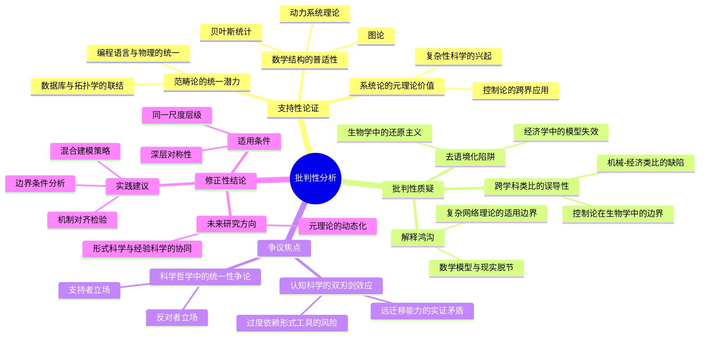
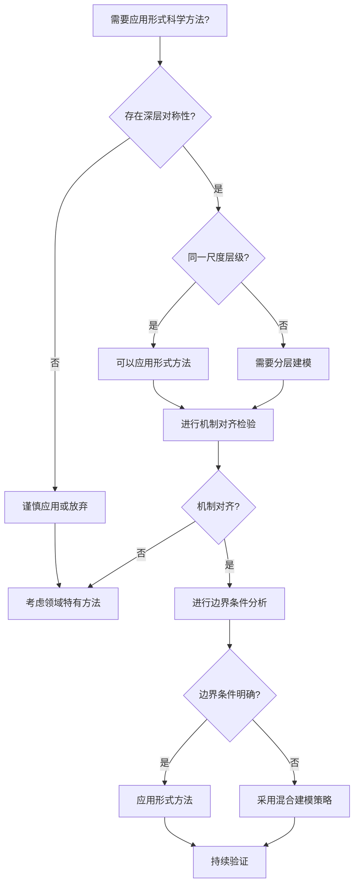
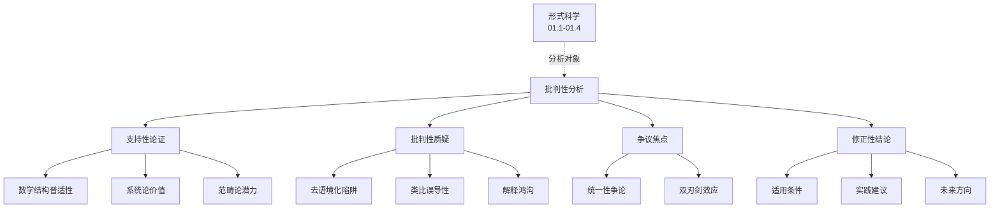
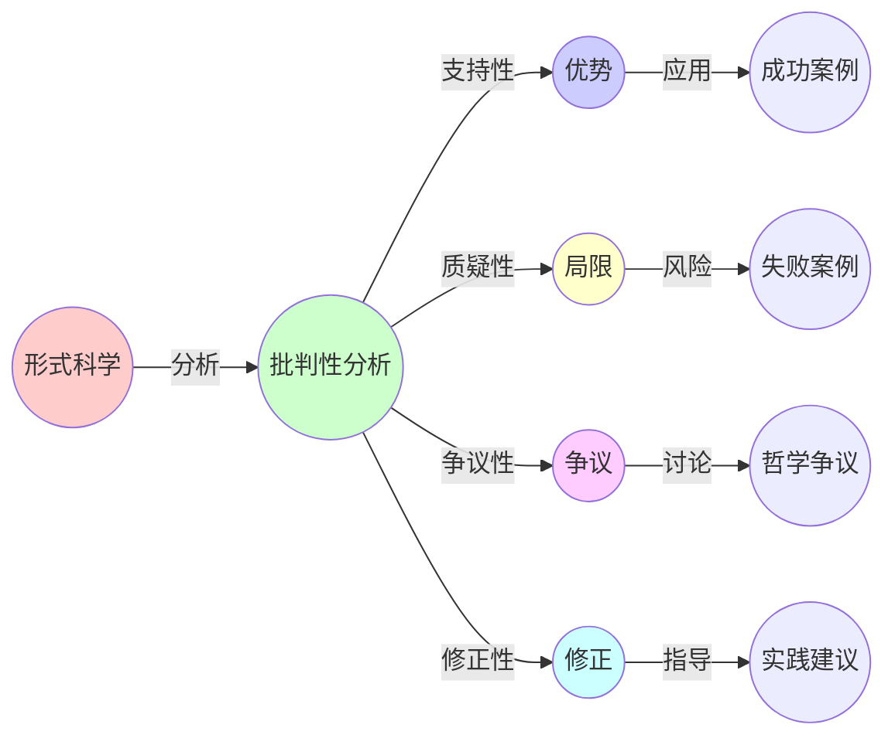
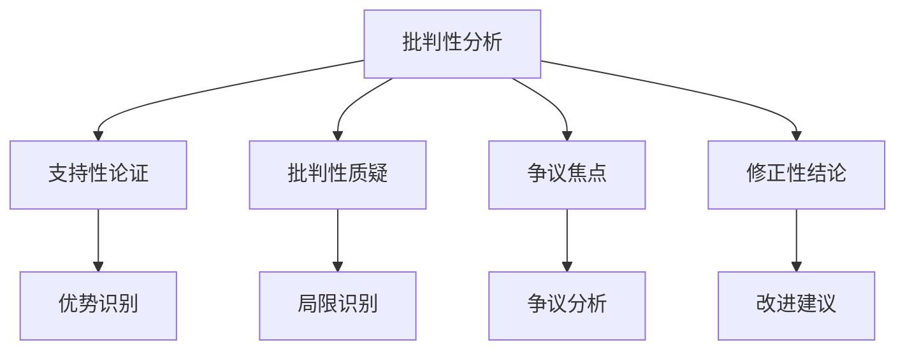

# 01.5 批判性分析

> **来源**: view01.md
> **创建日期**: 2025-01-27
> **最后更新**: 2025-01-27

## 📋 目录

- [01.5 批判性分析](#015-批判性分析)
  - [📋 目录](#-目录)
  - [📋 内容概览](#-内容概览)
  - [🎯 核心理念](#-核心理念)
  - [✅ 支持性论证：形式科学统一性的合理性基础](#-支持性论证形式科学统一性的合理性基础)
    - [1. 数学结构的普适性](#1-数学结构的普适性)
    - [2. 系统论的元理论价值](#2-系统论的元理论价值)
    - [3. 范畴论作为"数学语法"的潜力](#3-范畴论作为数学语法的潜力)
  - [⚠️ 批判性质疑：形式统一的局限与风险](#️-批判性质疑形式统一的局限与风险)
    - [1. 形式抽象的"去语境化"陷阱](#1-形式抽象的去语境化陷阱)
    - [2. 跨学科类比的误导性](#2-跨学科类比的误导性)
    - [3. 形式科学的"解释鸿沟"](#3-形式科学的解释鸿沟)
  - [🤔 争议焦点：统一性主张的哲学与方法论挑战](#-争议焦点统一性主张的哲学与方法论挑战)
    - [1. 科学哲学中的"统一性争论"](#1-科学哲学中的统一性争论)
    - [2. 认知科学的双刃剑效应](#2-认知科学的双刃剑效应)
  - [💡 修正性结论：形式统一性的有条件有效性](#-修正性结论形式统一性的有条件有效性)
    - [1. 适用条件](#1-适用条件)
    - [2. 实践建议的调整](#2-实践建议的调整)
    - [3. 未来研究方向](#3-未来研究方向)
  - [📊 批判性分析总结](#-批判性分析总结)
    - [优势](#优势)
    - [局限](#局限)
  - [📊 详细案例研究](#-详细案例研究)
    - [案例研究 1：金融建模中的形式化过度应用](#案例研究-1金融建模中的形式化过度应用)
    - [案例研究 2：生物系统建模中的还原主义争议](#案例研究-2生物系统建模中的还原主义争议)
    - [案例研究 3：成功的形式化应用：CompCert编译器验证](#案例研究-3成功的形式化应用compcert编译器验证)
  - [⚠️ 批判性分析与局限性](#️-批判性分析与局限性)
    - [局限性讨论](#局限性讨论)
      - [1. 形式抽象的"去语境化"陷阱](#1-形式抽象的去语境化陷阱-1)
      - [2. 跨学科类比的误导性风险](#2-跨学科类比的误导性风险)
      - [3. 计算复杂度和可扩展性限制](#3-计算复杂度和可扩展性限制)
    - [改进方向](#改进方向)
      - [1. 发展混合方法](#1-发展混合方法)
      - [2. 提高实用性和可扩展性](#2-提高实用性和可扩展性)
  - [📊 思维表征体系](#-思维表征体系)
    - [📊 1. 思维导图（增强版）](#-1-思维导图增强版)
      - [1.1 文本格式（基础版）](#11-文本格式基础版)
      - [1.2 Mermaid格式（可视化版）](#12-mermaid格式可视化版)
    - [📊 2. 多维对比矩阵](#-2-多维对比矩阵)
      - [2.1 支持性论证与批判性质疑对比矩阵](#21-支持性论证与批判性质疑对比矩阵)
      - [2.2 不同立场对比矩阵](#22-不同立场对比矩阵)
      - [2.3 三种批判性视角对比矩阵](#23-三种批判性视角对比矩阵)
    - [🌲 3. 决策树](#-3-决策树)
      - [3.1 形式科学应用决策树](#31-形式科学应用决策树)
    - [🛤️ 4. 决策逻辑路径](#️-4-决策逻辑路径)
      - [4.1 批判性分析方法应用路径](#41-批判性分析方法应用路径)
    - [🕸️ 5. 概念关系网络](#️-5-概念关系网络)
      - [5.1 批判性分析概念关系网络](#51-批判性分析概念关系网络)
    - [🗺️ 6. 知识图谱](#️-6-知识图谱)
      - [6.1 批判性分析知识图谱](#61-批判性分析知识图谱)
  - [📚 理论体系](#-理论体系)
    - [理论基础](#理论基础)
      - [哲学基础](#哲学基础)
      - [历史发展](#历史发展)
    - [理论框架](#理论框架)
      - [核心假设](#核心假设)
      - [基本概念体系](#基本概念体系)
      - [主要定理/结论](#主要定理结论)
      - [适用范围和边界](#适用范围和边界)
    - [当前知识共识](#当前知识共识)
      - [学术界共识](#学术界共识)
      - [主要争议点](#主要争议点)
      - [权威来源](#权威来源)
    - [与其他理论的关系](#与其他理论的关系)
      - [逻辑关系](#逻辑关系)
      - [映射关系](#映射关系)
  - [🔗 关联网络](#-关联网络)
    - [🔗 概念级关联](#-概念级关联)
      - [核心概念映射](#核心概念映射)
    - [🔗 理论级关联](#-理论级关联)
      - [理论基础](#理论基础-1)
    - [🔗 方法级关联](#-方法级关联)
      - [方法应用网络](#方法应用网络)
    - [🔗 应用场景关联](#-应用场景关联)
  - [🛤️ 学习路径](#️-学习路径)
    - [前置知识](#前置知识)
    - [后续学习](#后续学习)
    - [并行学习](#并行学习)
  - [🔗 相关文档](#-相关文档)
  - [📖 扩展阅读](#-扩展阅读)

---

## 📋 内容概览

本文档从批判性视角分析形式科学的优势与局限，探讨形式统一性的条件与边界。通过平衡的视角，全面评估形式科学的理论价值和实践局限。

---

## 🎯 核心理念

形式科学具有强大的统一性和跨学科应用能力，但同时也面临去语境化、解释鸿沟和计算复杂度等挑战。理解这些优势和局限，有助于更好地应用形式科学方法。

## ✅ 支持性论证：形式科学统一性的合理性基础

### 1. 数学结构的普适性

数学作为形式科学的核心，其抽象性确实为跨领域建模提供了基础。

**实例**：

- **动力系统理论**：既用于描述行星运动（经典力学），也被应用于经济周期预测（宏观经济学）和神经元放电模式（计算神经科学）
- **图论**：社交网络分析（节点-关系模型）、供应链优化（最短路径算法）与蛋白质相互作用网络（子图匹配）共享同一数学框架
- **贝叶斯统计**：从量子力学的概率解释到推荐系统的协同过滤，均依赖概率推断的统一逻辑

### 2. 系统论的元理论价值

贝塔朗菲的通用系统理论（GST）提出后，确实催生了跨学科研究范式：

- **控制论的跨界应用**：维纳（Wiener）将反馈机制从工程控制系统推广至生物神经系统（如巴甫洛夫条件反射）和社会组织管理（如企业目标调控）
- **复杂性科学的兴起**：沙克尔顿（SFI）研究所通过"复杂适应系统"框架，整合了生态系统的物种竞争模型与市场的价格波动模型，揭示出"相变"现象的共性

### 3. 范畴论作为"数学语法"的潜力

范畴论通过"对象-态射"抽象，成功实现了：

- **编程语言与物理的统一**：量子计算中的量子态演化被建模为函子（Functor），与λ演算中的类型系统形成对应
- **数据库与拓扑学的联结**：通过将数据库模式视为范畴，可利用同调代数分析数据一致性（如SQL的JOIN操作与纤维积的对应）

## ⚠️ 批判性质疑：形式统一的局限与风险

### 1. 形式抽象的"去语境化"陷阱

形式模型过度简化可能导致：

- **生物学中的还原主义争议**：将代谢通路建模为图论中的有向无环图（DAG），可能忽略酶活性的时空动态（如细胞器间的物质扩散限制）
- **经济学中的模型失效**：将市场视为复杂网络时，若忽略行为经济学中的"非理性人"假设，可能无法解释2008年金融危机中的羊群效应

### 2. 跨学科类比的误导性

领域映射存在潜在问题：

- **机械-经济类比的缺陷**：机械系统的能量守恒与经济系统的货币流动本质不同（货币具有创造/销毁机制），直接类比可能导致政策设计失误（如将经济调控简单比作机械反馈控制）
- **控制论在生物学中的边界**：生物系统的"稳态"（Homeostasis）依赖基因突变与自然选择的演化机制，而工程控制系统的"稳态"是预设目标，二者动力学逻辑存在根本差异

### 3. 形式科学的"解释鸿沟"

- **数学模型与现实解释力的脱节**：例如，尽管随机矩阵理论能描述原子能级分布与金融市场波动的相似统计特性，但两者背后的物理/经济机制完全不同，模型的"形式相似性"未必蕴含"因果相似性"
- **复杂网络理论的适用边界**：小世界网络模型在社交网络和电网中均适用，但电力网络的级联失效机制与社交影响传播的数学条件差异巨大，需谨慎移植分析方法

## 🤔 争议焦点：统一性主张的哲学与方法论挑战

### 1. 科学哲学中的"统一性争论"

- **支持者立场**（如爱因斯坦）：认为"宇宙的基本规律可被统一数学框架描述"，如广义相对论与量子场论的统一尝试
- **反对者立场**（如库恩的范式不可通约性）：不同学科的"范式"差异可能导致形式统一仅停留在表层模型，而无法整合深层理论（如化学中的分子轨道理论与生物学中的酶-底物相互作用机制）

### 2. 认知科学的双刃剑效应

- **远迁移能力的实证矛盾**：研究显示，专家在跨领域迁移时，若缺乏目标领域的"脚手架知识"（Scaffold Knowledge），形式模型可能成为认知负担（Bransford et al., 2000）
- **过度依赖形式工具的风险**：例如，金融工程中过度使用随机微积分模型（如Black-Scholes），可能忽视模型假设（如正态分布）与现实市场（长尾风险）的偏离

## 💡 修正性结论：形式统一性的有条件有效性

### 1. 适用条件

- **领域间存在深层对称性时**（如热力学与信息论通过熵的桥梁）：形式统一具有高度解释力
- **问题处于同一尺度与抽象层级时**（如微观粒子动力学与宏观流体力学需分别建模）：强行统一可能适得其反

### 2. 实践建议的调整

**批判性迁移框架**：在跨学科应用形式模型时，需遵循"三步验证法"：

1. **机制对齐检验**：确认源领域与目标领域的因果机制是否兼容（如机械系统的线性响应 vs. 生物系统的非线性阈值）
2. **边界条件分析**：明确模型适用的参数范围（如统计物理模型在金融市场中仅适用于中等波动场景）
3. **混合建模策略**：将形式模型与领域特有规则结合（如将图神经网络与化学分子的量子力学计算耦合）

### 3. 未来研究方向

- **形式科学与经验科学的协同进化**：探索如何通过机器学习自动发现跨领域模型（如AlphaFold揭示的蛋白质折叠与统计物理模型的隐含联系）
- **元理论的动态化**：发展可适应不同学科"语境"的元框架（如基于范畴论的"参数化系统理论"）

## 📊 批判性分析总结

### 优势

| 优势 | 说明 | 实例 |
|------|------|------|
| **跨学科统一性** | 数学结构的普适性 | 微分方程描述行星运动与经济周期 |
| **认知效率** | 迁移学习能力 | 掌握控制论后可快速理解生物稳态调节 |
| **形式化验证** | 通过Coq等工具确保数学一致性 | 算法/协议的正确性验证 |

### 局限

| 局限 | 说明 | 实例 |
|------|------|------|
| **去语境化风险** | 模型简化可能掩盖真实系统的异质性 | 社交网络的强弱连接差异 |
| **计算复杂度瓶颈** | 大规模复杂网络仿真需超算资源 | 亿级节点电网模拟 |
| **解释鸿沟** | 涌现现象的数学描述与人类直觉认知存在差距 | 相变理论的误用 |

## 📊 详细案例研究

### 案例研究 1：金融建模中的形式化过度应用

**背景**：2008年金融危机暴露了过度依赖形式模型的危险，展示了形式科学的局限性。

**形式化分析**：

```text
Black-Scholes模型问题:
- 假设: 价格遵循几何布朗运动
- 问题: 忽略尾部风险和极端事件
- 结果: 低估了市场风险

VaR模型局限性:
- 方法: 统计模型预测风险
- 假设: 历史数据可以预测未来
- 问题: 未考虑系统性风险

金融危机影响:
- 模型失效导致巨大损失
- 揭示了形式模型的边界
- 需要结合领域知识和判断
```

**关键发现**：

- ✅ 形式模型不能完全替代领域知识
- ✅ 模型假设必须符合实际情况
- ✅ 需要结合定性和定量分析

**应用价值**：

- ✅ 风险管理和控制
- ✅ 模型验证和审查
- ✅ 决策支持系统设计

### 案例研究 2：生物系统建模中的还原主义争议

**背景**：将复杂的生物系统简化为数学模型时，可能丢失重要的生物特征。

**形式化分析**：

```text
代谢网络建模:
- 方法: 将代谢通路建模为有向图
- 简化: 忽略时空动态和细胞器结构
- 问题: 无法捕捉真实生物过程

基因调控网络:
- 方法: 布尔网络或微分方程模型
- 假设: 基因表达是确定性的
- 限制: 忽略随机性和表观遗传

实际挑战:
- 模型过于简化
- 丢失重要的生物机制
- 需要多层次建模
```

**关键发现**：

- ✅ 简化是必要的，但需要适度
- ✅ 多层次模型能够更好地捕捉复杂性
- ✅ 生物学知识必须指导模型设计

**应用价值**：

- ✅ 系统生物学研究
- ✅ 药物设计
- ✅ 精准医学

### 案例研究 3：成功的形式化应用：CompCert编译器验证

**背景**：CompCert是一个完全形式化验证的C编译器，展示了形式化方法的成功应用。

**形式化分析**：

```text
形式化验证方法:
- 工具: Coq证明助手
- 方法: 证明编译器保持程序语义
- 范围: 从C源代码到汇编代码

验证结果:
- 证明编译器正确性
- 消除了一类编译器错误
- 提高了代码可靠性

成功因素:
- 明确的形式化规范
- 系统的验证方法
- 强大的工具支持
```

**关键发现**：

- ✅ 形式化方法在适合的领域非常有效
- ✅ 工具支持是关键
- ✅ 需要明确的目标和规范

**应用价值**：

- ✅ 安全关键系统开发
- ✅ 提高软件可靠性
- ✅ 编译器设计

## ⚠️ 批判性分析与局限性

### 局限性讨论

#### 1. 形式抽象的"去语境化"陷阱

**问题**：形式模型过度简化可能导致忽略具体领域的特殊性。

**挑战**：

- ⚠️ 模型假设可能与现实不符
- ⚠️ 丢失重要的领域特征
- ⚠️ 可能导致误导性结论

**应对策略**：

- ✅ 明确模型的适用范围和假设
- ✅ 结合领域知识进行验证
- ✅ 使用多层次建模方法

#### 2. 跨学科类比的误导性风险

**问题**：不同领域之间的类比可能忽略重要的机制差异。

**挑战**：

- ⚠️ 形式相似性不等于机制相似性
- ⚠️ 不同尺度和层次的差异
- ⚠️ 边界条件的差异

**改进方向**：

- ✅ 进行机制对齐检验
- ✅ 分析边界条件
- ✅ 使用混合建模策略

#### 3. 计算复杂度和可扩展性限制

**问题**：形式化方法可能面临计算复杂度爆炸的问题。

**挑战**：

- ⚠️ 大规模系统的验证困难
- ⚠️ 计算资源需求巨大
- ⚠️ 实时应用的限制

**改进方向**：

- ✅ 开发高效算法和工具
- ✅ 使用抽象和近似方法
- ✅ 结合启发式方法

### 改进方向

#### 1. 发展混合方法

**目标**：结合形式化方法和领域知识。

**方法**：

- 开发混合建模框架
- 整合定量和定性分析
- 建立多层次验证方法

#### 2. 提高实用性和可扩展性

**目标**：使形式化方法更容易应用于实际问题。

**方法**：

- 开发高效的工具和算法
- 提供自动化和半自动化方法
- 建立最佳实践指南

## 📊 思维表征体系

### 📊 1. 思维导图（增强版）

#### 1.1 文本格式（基础版）

```text
批判性分析
├── 支持性论证
│   ├── 数学结构的普适性
│   │   ├── 动力系统理论
│   │   ├── 图论
│   │   └── 贝叶斯统计
│   ├── 系统论的元理论价值
│   │   ├── 控制论的跨界应用
│   │   └── 复杂性科学的兴起
│   └── 范畴论的统一潜力
│       ├── 编程语言与物理的统一
│       └── 数据库与拓扑学的联结
├── 批判性质疑
│   ├── 去语境化陷阱
│   │   ├── 生物学中的还原主义
│   │   └── 经济学中的模型失效
│   ├── 跨学科类比的误导性
│   │   ├── 机械-经济类比的缺陷
│   │   └── 控制论在生物学中的边界
│   └── 解释鸿沟
│       ├── 数学模型与现实脱节
│       └── 复杂网络理论的适用边界
├── 争议焦点
│   ├── 科学哲学中的统一性争论
│   │   ├── 支持者立场
│   │   └── 反对者立场
│   └── 认知科学的双刃剑效应
│       ├── 远迁移能力的实证矛盾
│       └── 过度依赖形式工具的风险
└── 修正性结论
    ├── 适用条件
    │   ├── 深层对称性
    │   └── 同一尺度层级
    ├── 实践建议
    │   ├── 机制对齐检验
    │   ├── 边界条件分析
    │   └── 混合建模策略
    └── 未来研究方向
        ├── 形式科学与经验科学的协同
        └── 元理论的动态化
```

#### 1.2 Mermaid格式（可视化版）



### 📊 2. 多维对比矩阵

#### 2.1 支持性论证与批判性质疑对比矩阵

| 维度 | 支持性论证 | 批判性质疑 | 综合评价 | 平衡视角 |
|------|-----------|-----------|---------|----------|
| **统一性** | 高度统一 | 有限统一 | 有条件统一 | 需要条件 |
| **普适性** | 广泛适用 | 有限适用 | 有条件适用 | 需要验证 |
| **可靠性** | 高度可靠 | 存在风险 | 需要谨慎 | 需要验证 |
| **应用价值** | 价值很高 | 存在局限 | 价值有限 | 需要方法 |
| **认知效率** | 效率很高 | 可能误导 | 需要谨慎 | 需要知识 |
| **形式化程度** | 高度形式化 | 过度形式化 | 适度形式化 | 需要平衡 |
| **实际效果** | 效果显著 | 效果有限 | 效果适中 | 需要条件 |

#### 2.2 不同立场对比矩阵

| 维度 | 支持者立场 | 反对者立场 | 修正性立场 | 推荐 |
|------|-----------|-----------|-----------|------|
| **统一性** | 完全统一 | 不可统一 | 有条件统一 | 修正性 |
| **适用范围** | 广泛适用 | 有限适用 | 有条件适用 | 修正性 |
| **方法论** | 形式化优先 | 经验优先 | 混合方法 | 修正性 |
| **验证方式** | 形式验证 | 经验验证 | 混合验证 | 修正性 |
| **风险意识** | 低 | 高 | 中等 | 修正性 |
| **实际应用** | 激进应用 | 保守应用 | 谨慎应用 | 修正性 |

#### 2.3 三种批判性视角对比矩阵

| 维度 | 去语境化陷阱 | 跨学科类比误导 | 解释鸿沟 | 严重程度 |
|------|------------|--------------|---------|----------|
| **普遍性** | 高 | 中 | 高 | 去语境化和解释鸿沟更普遍 |
| **影响程度** | 高 | 中高 | 高 | 都影响深远 |
| **识别难度** | 中 | 高 | 高 | 跨学科类比最难识别 |
| **预防难度** | 中 | 高 | 很高 | 解释鸿沟最难预防 |
| **改进难度** | 中 | 高 | 很高 | 解释鸿沟最难改进 |
| **典型实例** | 生物学还原 | 机械-经济类比 | 模型-现实脱节 | 各有典型 |

### 🌲 3. 决策树

#### 3.1 形式科学应用决策树



**决策说明**：

- 应用形式科学方法需要满足多个条件
- 不满足条件时应采用混合方法或领域方法
- 持续验证是必要的

### 🛤️ 4. 决策逻辑路径

#### 4.1 批判性分析方法应用路径


### 🕸️ 5. 概念关系网络

#### 5.1 批判性分析概念关系网络



### 🗺️ 6. 知识图谱

#### 6.1 批判性分析知识图谱



## 📚 理论体系

### 理论基础

#### 哲学基础

批判性分析的理论基础：

**1. 科学哲学基础**：

- 逻辑实证主义：强调验证和可观察性
- 批判理性主义：强调可证伪性和批判性
- 科学实在论：强调理论的真实性

**2. 认识论基础**：

- 建构主义：强调知识的建构性
- 批判理论：强调对知识的批判性反思
- 实用主义：强调知识的实用性

**3. 方法论基础**：

- 批判性思维：强调对论点的批判性评估
- 辩证法：强调对矛盾的辩证分析
- 实证方法：强调经验验证

#### 历史发展

**关键时间节点**：

- **古代（公元前5-3世纪）**：批判性思维的起源
  - 苏格拉底的质疑方法
  - 亚里士多德的逻辑学

- **17-18世纪**：批判哲学的建立
  - 笛卡尔的怀疑方法
  - 康德的批判哲学

- **19-20世纪**：批判理论的发展
  - 马克思的批判理论
  - 法兰克福学派的批判理论

- **20-21世纪**：批判性思维的系统化
  - 批判性思维运动的兴起
  - 科学哲学的批判性转向

### 理论框架

#### 核心假设

**假设1：知识的条件性**

- **内容**：知识具有条件性，不是绝对的
- **适用范围**：所有知识
- **限制条件**：需要明确知识的条件

**假设2：方法的局限性**

- **内容**：所有方法都有局限性
- **适用范围**：所有研究方法
- **限制条件**：需要识别方法的局限性

**假设3：批判的价值**

- **内容**：批判性分析有助于改进理论和方法
- **适用范围**：所有理论和方法
- **限制条件**：需要建设性的批判

#### 基本概念体系



#### 主要定理/结论

**结论1：形式科学的有条件有效性**

- **内容**：形式科学方法在满足特定条件下有效
- **证据**：成功和失败案例的分析
- **应用**：指导形式科学方法的正确应用

**结论2：批判性思维的必要性**

- **内容**：批判性思维是正确应用形式科学方法的关键
- **证据**：失败案例往往缺乏批判性分析
- **应用**：提高应用成功率

**结论3：混合方法的价值**

- **内容**：混合方法往往比单一方法更有效
- **证据**：成功案例往往采用混合方法
- **应用**：指导方法选择

#### 适用范围和边界

**适用范围**：

- 所有形式科学方法的应用
- 所有跨学科研究
- 所有理论评估

**边界条件**：

- 需要明确的分析对象
- 需要充分的证据
- 需要合理的标准

**不适用场景**：

- 纯粹的价值判断
- 缺乏证据的讨论
- 不合理的标准

### 当前知识共识

#### 学术界共识

**广泛接受的共识**：

1. **批判性分析的重要性**
   - **共识**：批判性分析是科学研究的重要组成部分
   - **支持证据**：科学方法强调批判性评估
   - **来源**：科学哲学、方法论研究

2. **形式科学的条件性**
   - **共识**：形式科学方法在特定条件下有效
   - **支持证据**：成功和失败案例的分析
   - **来源**：跨学科研究、方法论研究

3. **混合方法的价值**
   - **共识**：混合方法往往比单一方法更有效
   - **支持证据**：成功案例的研究
   - **来源**：方法论研究

#### 主要争议点

1. **统一性的程度**
   - **观点A**：形式科学可以实现高度统一
   - **观点B**：形式科学的统一性是有限的
   - **当前状态**：多数支持有限统一性

2. **批判的力度**
   - **观点A**：需要严厉批判
   - **观点B**：需要温和批判
   - **当前状态**：多数支持建设性批判

#### 权威来源

**经典文献**：

- 《批判性思维》- Richard Paul & Linda Elder
- 《科学革命的结构》- Thomas Kuhn
- 《批判理论》- Max Horkheimer

**权威机构/专家**：

- **国际批判性思维协会**
- **科学哲学学会**
- **方法论研究机构**

**最新发展**：

- **2020-2024**：批判性思维的量化方法、AI辅助批判性分析
- **前沿方向**：批判性思维的实证研究、批判性思维的教育

### 与其他理论的关系

#### 逻辑关系

**理论基础**：

- **形式科学基础**（[01.1-01.4](../01_形式科学基础理论/)） → 批判性分析
  - 关系类型：分析对象
  - 关键映射：形式科学理论 → 批判性分析的对象

**理论应用**：

- 批判性分析 → 跨学科映射（[06_跨学科映射与应用](../06_跨学科映射与应用/)）
  - 应用方式：提供批判性视角
  - 应用效果：提高映射成功率

#### 映射关系

| 本理论概念 | 映射理论 | 映射概念 | 映射类型 | 映射说明 |
|-----------|---------|---------|---------|----------|
| **支持性论证** | 01.1-01.4 | 形式科学理论 | 分析 | 分析形式科学的优势 |
| **批判性质疑** | 06.3_边界条件检验.md | 边界条件 | 应用 | 批判性分析用于边界条件 |
| **修正性结论** | 06.4_混合建模.md | 混合方法 | 应用 | 修正性结论指导混合方法 |
| **机制对齐检验** | 06.1_跨学科映射策略.md | 映射策略 | 应用 | 机制对齐是映射策略的一部分 |

## 🔗 关联网络

### 🔗 概念级关联

#### 核心概念映射

| 本文档概念 | 关联文档 | 关联概念 | 关系类型 | 映射说明 |
|-----------|---------|---------|---------|----------|
| **支持性论证** | 01.1-01.4 | 形式科学理论 | 分析 | 分析形式科学的优势 |
| **批判性质疑** | 06.3_边界条件检验.md | 边界条件 | 应用 | 批判性分析用于识别边界 |
| **修正性结论** | 06.4_混合建模.md | 混合方法 | 应用 | 修正性结论指导混合方法 |
| **机制对齐检验** | 06.1_跨学科映射策略.md | 映射策略 | 应用 | 机制对齐是映射策略的一部分 |
| **边界条件分析** | 06.3_边界条件检验.md | 边界条件 | 同构 | 本概念与06.3一致 |
| **混合建模策略** | 06.4_混合建模.md | 混合建模 | 同构 | 本概念与06.4一致 |
| **去语境化陷阱** | 06.2_类比迁移方法.md | 类比迁移 | 应用 | 去语境化是类比迁移的风险 |

### 🔗 理论级关联

#### 理论基础

- **本理论基于**：
  - [01.1-01.4](../01_形式科学基础理论/) ⭐⭐⭐ - 分析对象

- **本理论应用于**：
  - [06_跨学科映射与应用](../06_跨学科映射与应用/) ⭐⭐⭐ - 提供批判性视角
  - [02-10系列](../) ⭐⭐ - 所有形式科学应用

### 🔗 方法级关联

#### 方法应用网络

| 本文档方法 | 应用文档 | 应用场景 | 应用效果 |
|-----------|---------|---------|---------|
| **机制对齐检验** | 06.1_跨学科映射策略.md | 跨学科映射 | 成功 |
| **边界条件分析** | 06.3_边界条件检验.md | 边界识别 | 成功 |
| **混合建模策略** | 06.4_混合建模.md | 混合建模 | 成功 |

### 🔗 应用场景关联

**场景**：跨学科映射

| 视角 | 关联文档 | 核心理论 | 关注点 |
|------|---------|---------|--------|
| **支持性视角** | 06.1_跨学科映射策略.md | 映射策略 | 映射优势 |
| **批判性视角** | 本文档 | 批判性分析 | 映射局限 |
| **修正性视角** | 06.4_混合建模.md | 混合方法 | 改进方法 |

## 🛤️ 学习路径

### 前置知识

**必须先学习**：

- [01.1-01.4](../01_形式科学基础理论/) ⭐⭐⭐ - 被分析的对象

**建议先了解**：

- 基础哲学（认识论、方法论）
- 批判性思维

### 后续学习

**建议接下来学习**（按顺序）：

1. [06_跨学科映射与应用](../06_跨学科映射与应用/) ⭐⭐⭐ - 应用批判性分析
2. 其他系列文件 ⭐⭐ - 理解具体应用

### 并行学习

**可以同时学习**：

- 科学哲学课程
- 批判性思维课程

## 🔗 相关文档

- [01.1_形式科学的定义与特征.md](01.1_形式科学的定义与特征.md)
- [06_跨学科映射与应用/06.3_边界条件检验.md](../06_跨学科映射与应用/06.3_边界条件检验.md)
- [01.4_元理论框架.md](01.4_元理论框架.md)

## 📖 扩展阅读

- 《Limits of Formalization in Complex Systems》（Springer, 2021）
- 《The Limits of Scientific Method》- F.A. Hayek
- Wikipedia: [Philosophy of Science](https://en.wikipedia.org/wiki/Philosophy_of_science)
- Wikipedia: [Reductionism](https://en.wikipedia.org/wiki/Reductionism)
