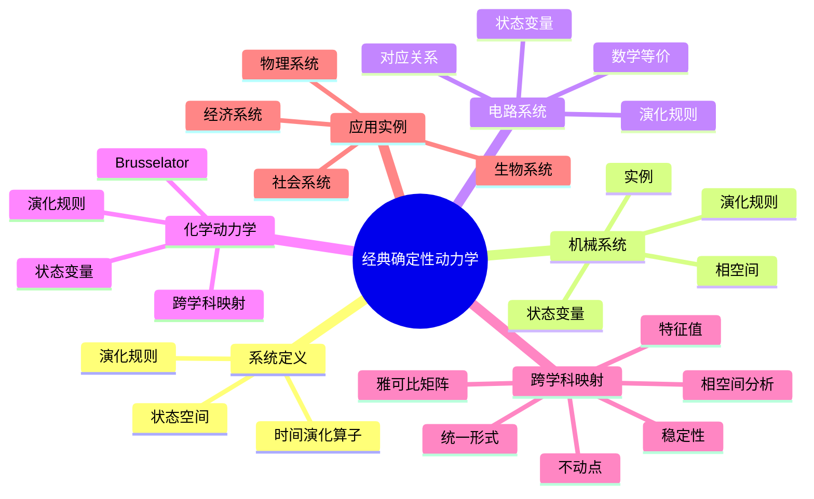
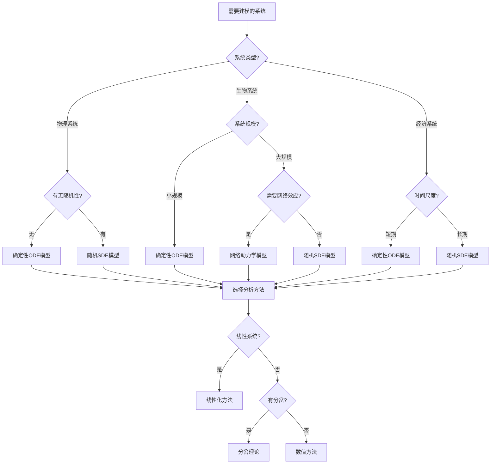
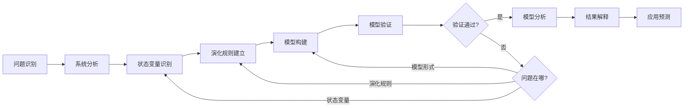
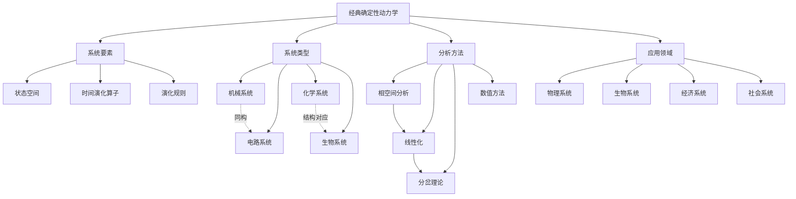
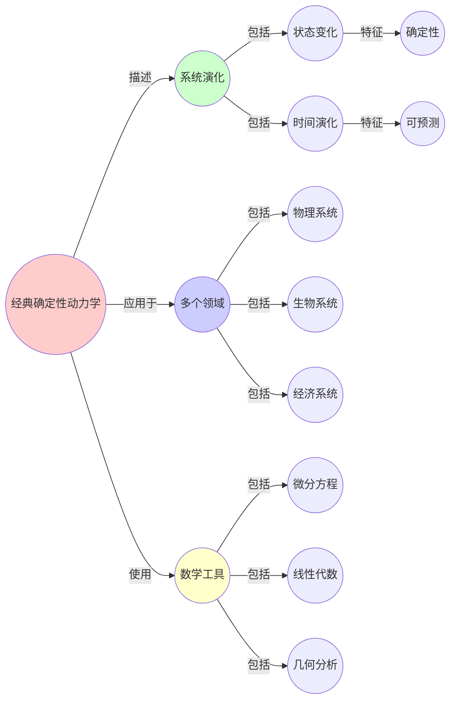
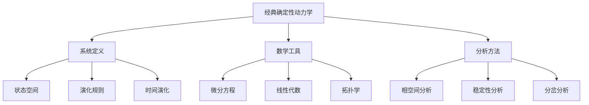
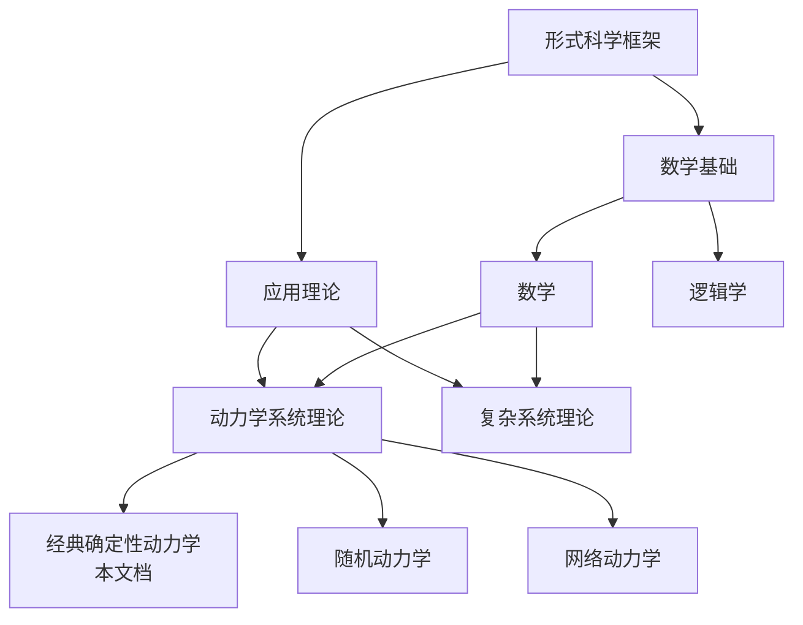
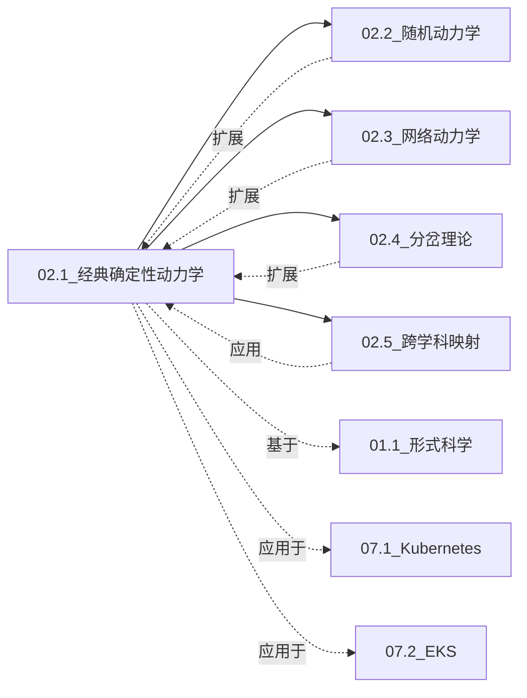

# 02.1 经典确定性动力学

> **来源**: view07.md
> **创建日期**: 2025-01-27
> **最后更新**: 2025-01-27

## 📋 目录

- [02.1 经典确定性动力学](#021-经典确定性动力学)
  - [📋 目录](#-目录)
  - [📋 内容概览](#-内容概览)
  - [🎯 核心理念](#-核心理念)
  - [📚 动力学系统的定义](#-动力学系统的定义)
    - [基本要素](#基本要素)
  - [🔧 机械系统（原型）](#-机械系统原型)
    - [状态变量](#状态变量)
    - [演化规则](#演化规则)
    - [状态空间](#状态空间)
    - [具体实例](#具体实例)
      - [单摆](#单摆)
      - [弹簧振子](#弹簧振子)
  - [⚡ 电路系统（完全同构）](#-电路系统完全同构)
    - [状态变量](#状态变量-1)
    - [演化规则](#演化规则-1)
    - [对应关系](#对应关系)
    - [关键洞察](#关键洞察)
  - [🧪 化学动力学（浓度空间）](#-化学动力学浓度空间)
    - [状态变量](#状态变量-2)
    - [演化规则](#演化规则-2)
    - [实例：Brusselator反应（化学振荡）](#实例brusselator反应化学振荡)
  - [📊 跨学科映射](#-跨学科映射)
    - [统一数学形式](#统一数学形式)
    - [相空间分析](#相空间分析)
  - [🎯 应用实例](#-应用实例)
    - [物理系统](#物理系统)
    - [生物系统](#生物系统)
    - [经济系统](#经济系统)
    - [社会系统](#社会系统)
  - [📊 详细案例研究](#-详细案例研究)
    - [案例研究 1：机械-电路系统的完全同构](#案例研究-1机械-电路系统的完全同构)
    - [案例研究 2：化学振荡反应与生物系统的映射](#案例研究-2化学振荡反应与生物系统的映射)
    - [案例研究 3：经济周期模型的动力学分析](#案例研究-3经济周期模型的动力学分析)
  - [⚠️ 批判性分析与局限性](#️-批判性分析与局限性)
    - [局限性讨论](#局限性讨论)
      - [1. 确定性假设的局限性](#1-确定性假设的局限性)
      - [2. 线性化假设的限制](#2-线性化假设的限制)
      - [3. 参数估计的困难](#3-参数估计的困难)
    - [改进方向](#改进方向)
      - [1. 扩展到随机动力学](#1-扩展到随机动力学)
      - [2. 增强非线性分析能力](#2-增强非线性分析能力)
  - [📊 思维表征体系](#-思维表征体系)
    - [📊 1. 思维导图（增强版）](#-1-思维导图增强版)
      - [1.1 文本格式（基础版）](#11-文本格式基础版)
      - [1.2 Mermaid格式（可视化版）](#12-mermaid格式可视化版)
    - [📊 2. 多维对比矩阵](#-2-多维对比矩阵)
      - [2.1 不同动力学系统对比矩阵](#21-不同动力学系统对比矩阵)
      - [2.2 动力学分析方法对比矩阵](#22-动力学分析方法对比矩阵)
      - [2.3 确定性动力学与随机动力学对比矩阵](#23-确定性动力学与随机动力学对比矩阵)
    - [🌲 3. 决策树](#-3-决策树)
      - [3.1 动力学模型选择决策树](#31-动力学模型选择决策树)
    - [🛤️ 4. 决策逻辑路径](#️-4-决策逻辑路径)
      - [4.1 动力学系统建模路径](#41-动力学系统建模路径)
    - [🕸️ 5. 概念关系网络](#️-5-概念关系网络)
      - [5.1 动力学核心概念网络](#51-动力学核心概念网络)
    - [🗺️ 6. 知识图谱](#️-6-知识图谱)
      - [6.1 动力学系统知识图谱](#61-动力学系统知识图谱)
  - [📚 理论体系](#-理论体系)
    - [理论基础](#理论基础)
      - [数学/逻辑基础](#数学逻辑基础)
      - [历史发展](#历史发展)
    - [理论框架](#理论框架)
      - [核心假设](#核心假设)
      - [基本概念体系](#基本概念体系)
      - [主要定理/结论](#主要定理结论)
      - [适用范围和边界](#适用范围和边界)
    - [当前知识共识](#当前知识共识)
      - [学术界共识](#学术界共识)
      - [主要争议点](#主要争议点)
      - [权威来源](#权威来源)
    - [与其他理论的关系](#与其他理论的关系)
      - [逻辑关系](#逻辑关系)
      - [映射关系](#映射关系)
      - [统一性论证](#统一性论证)
  - [🔗 关联网络](#-关联网络)
    - [🔗 概念级关联](#-概念级关联)
      - [核心概念映射](#核心概念映射)
    - [🔗 理论级关联](#-理论级关联)
      - [理论基础](#理论基础-1)
      - [理论关系网络](#理论关系网络)
    - [🔗 方法级关联](#-方法级关联)
      - [方法应用网络](#方法应用网络)
    - [🔗 应用场景关联](#-应用场景关联)
      - [同一场景的多视角分析](#同一场景的多视角分析)
  - [🛤️ 学习路径](#️-学习路径)
    - [前置知识](#前置知识)
    - [后续学习](#后续学习)
    - [并行学习](#并行学习)
  - [🔗 相关文档](#-相关文档)
  - [📖 扩展阅读](#-扩展阅读)

---

## 📋 内容概览

本文档阐述经典确定性动力学系统的基本概念、数学框架及其跨学科应用。采用统一的形式化方法，全面展示动力学系统在不同领域的应用和映射。

---

## 🎯 核心理念

经典确定性动力学系统描述系统状态如何随时间确定性演化。通过统一的数学框架（微分方程），我们可以理解不同领域系统的共同规律，实现跨学科的知识迁移和应用。

## 📚 动力学系统的定义

### 基本要素

一个动力学系统由三个要素构成：

1. **状态空间** X：所有可能状态的集合（位置、浓度、价格、观点）
2. **时间演化算子** φ(t)：描述状态如何随时间变化
3. **演化规则**：通常是微分/差分方程、迭代映射或随机过程

**核心思想**：**当前状态 + 演化规则 = 未来状态**（确定性）或**概率分布**（随机性）

## 🔧 机械系统（原型）

### 状态变量

- **位置** q(t)
- **动量** p(t)

### 演化规则

牛顿第二定律 F=ma → 二阶ODE

### 状态空间

相空间 (q,p)

### 具体实例

#### 单摆

```latex
\theta'' + \frac{g}{L}\sin\theta = 0
```

#### 弹簧振子

```latex
x'' + \omega^2 x = 0
```

## ⚡ 电路系统（完全同构）

### 状态变量

- **电容电压** Vc(t)
- **电感电流** IL(t)

### 演化规则

基尔霍夫定律 → 与机械系统**数学等价**

### 对应关系

| 机械系统 | 电路系统 | 数学对应 |
|----------|----------|----------|
| 质量 m | 电感 L | 惯性元件 |
| 阻尼 c | 电阻 R | 耗散元件 |
| 弹簧 k | 电容倒数 1/C | 恢复元件 |
| 力 F | 电压源 V | 驱动源 |

### 关键洞察

RLC电路方程 `Lq'' + Rq' + (1/C)q = V(t)` 与质量-弹簧-阻尼系统**方程形式完全相同**

## 🧪 化学动力学（浓度空间）

### 状态变量

各化学物质浓度 [A](t), [B](t)

### 演化规则

质量作用定律 → 同样形式的ODE系统

### 实例：Brusselator反应（化学振荡）

```latex
\frac{d[X]}{dt} = A + X^2Y - (B+1)X
\frac{d[Y]}{dt} = BX - X^2Y
```

这与生物捕食者-猎物模型、经济学竞争模型**方程结构完全一致**，只是变量意义不同。

## 📊 跨学科映射

### 统一数学形式

所有确定性动力学系统都可以表示为：

```latex
\frac{dx}{dt} = f(x, t)
```

其中：

- **x** 是状态向量
- **f** 是演化函数
- **t** 是时间

### 相空间分析

无论系统来自哪个领域，分析步骤完全相同：

1. 找**不动点**（f(x*)=0）
2. 计算**雅可比矩阵** J = ∂f/∂x|_{x*}
3. 特征值决定**局部稳定性**
4. **流形理论**决定全局行为

## 🎯 应用实例

### 物理系统

- 行星运动
- 机械振动
- 电路振荡

### 生物系统

- 种群动力学
- 代谢通路
- 神经放电

### 经济系统

- 市场波动
- 经济增长
- 价格动态

### 社会系统

- 人口增长
- 信息传播
- 观点演化

## 📊 详细案例研究

### 案例研究 1：机械-电路系统的完全同构

**背景**：机械系统和电路系统在数学上完全同构，展示动力学系统的统一性。

**形式化分析**：

```text
对应关系:
机械系统（质量-弹簧-阻尼器）:
  mx'' + cx' + kx = F(t)

电路系统（RLC电路）:
  Lq'' + Rq' + (1/C)q = V(t)

完全对应:
  m ↔ L (质量 ↔ 电感)
  c ↔ R (阻尼 ↔ 电阻)
  k ↔ 1/C (弹簧常数 ↔ 电容倒数)
  F ↔ V (力 ↔ 电压)
  x ↔ q (位移 ↔ 电荷)

关键洞察:
- 相同的数学结构
- 相同的分析方法
- 相同的稳定性条件
```

**关键发现**：

- ✅ 不同物理系统共享相同的数学结构
- ✅ 分析方法可以跨领域应用
- ✅ 动力学系统理论提供了统一框架

**应用价值**：

- ✅ 跨学科知识迁移
- ✅ 统一的分析方法
- ✅ 设计优化和控制

### 案例研究 2：化学振荡反应与生物系统的映射

**背景**：Brusselator化学反应模型与捕食者-猎物模型具有相同的数学结构。

**形式化分析**：

```text
Brusselator反应:
  d[X]/dt = A + X²Y - (B+1)X
  d[Y]/dt = BX - X²Y

Lotka-Volterra模型（捕食者-猎物）:
  dH/dt = rH - aHP
  dP/dt = baHP - mP

结构对应:
  X ↔ H (反应中间体 ↔ 猎物)
  Y ↔ P (催化剂 ↔ 捕食者)
  A ↔ r (输入速率 ↔ 猎物增长率)
  B ↔ ba (反应速率 ↔ 捕食效率)

行为对应:
- 振荡行为
- 极限环
- 周期解
```

**关键发现**：

- ✅ 化学反应和生物系统共享动力学结构
- ✅ 振荡行为是普遍的动力学现象
- ✅ 不同领域可以相互启发

**应用价值**：

- ✅ 理解生物节律
- ✅ 设计化学振荡器
- ✅ 生态系统管理

### 案例研究 3：经济周期模型的动力学分析

**背景**：使用动力学系统理论分析经济周期，揭示经济的周期性行为。

**形式化分析**：

```text
Kaldor商业周期模型:
  dY/dt = α[I(Y,K) - S(Y)]
  dK/dt = I(Y,K) - δK

其中:
- Y: 国民收入
- K: 资本存量
- I: 投资函数
- S: 储蓄函数

动力学分析:
- 不动点: (Y*, K*) 满足 I = S, I = δK
- 雅可比矩阵: J = ∂(dY/dt, dK/dt)/∂(Y,K)
- 稳定性: 取决于特征值

分岔分析:
- Hopf分岔: 产生周期解
- 经济周期: 对应极限环
```

**关键发现**：

- ✅ 动力学方法能够解释经济周期性
- ✅ 经济系统可以建模为动力学系统
- ✅ 分岔理论揭示了经济行为的突变

**应用价值**：

- ✅ 经济预测和政策分析
- ✅ 理解经济波动机制
- ✅ 设计稳定政策

## ⚠️ 批判性分析与局限性

### 局限性讨论

#### 1. 确定性假设的局限性

**问题**：实际系统往往包含随机性和不确定性。

**挑战**：

- ⚠️ 忽略随机扰动
- ⚠️ 无法处理不确定性
- ⚠️ 预测精度受限

**应对策略**：

- ✅ 引入随机项
- ✅ 使用概率分布
- ✅ 考虑鲁棒性分析

#### 2. 线性化假设的限制

**问题**：非线性系统的线性化可能丢失重要的非线性特征。

**挑战**：

- ⚠️ 局部近似可能不适用
- ⚠️ 忽略全局行为
- ⚠️ 分岔和混沌行为丢失

**改进方向**：

- ✅ 使用非线性分析方法
- ✅ 考虑全局动力学
- ✅ 开发数值方法

#### 3. 参数估计的困难

**问题**：动力学系统的参数往往难以准确估计。

**挑战**：

- ⚠️ 数据不足
- ⚠️ 噪声干扰
- ⚠️ 参数不确定性

**改进方向**：

- ✅ 使用贝叶斯方法
- ✅ 参数敏感性分析
- ✅ 鲁棒性设计

### 改进方向

#### 1. 扩展到随机动力学

**目标**：将确定性动力学扩展到随机动力学。

**方法**：

- 引入随机过程
- 使用主方程
- 考虑噪声影响

#### 2. 增强非线性分析能力

**目标**：更好地处理非线性系统。

**方法**：

- 发展分岔理论
- 使用混沌理论
- 开发数值工具

## 📊 思维表征体系

### 📊 1. 思维导图（增强版）

#### 1.1 文本格式（基础版）

```text
经典确定性动力学
├── 动力学系统定义
│   ├── 状态空间
│   ├── 时间演化算子
│   └── 演化规则
├── 机械系统（原型）
│   ├── 状态变量：位置、动量
│   ├── 演化规则：牛顿第二定律
│   ├── 相空间分析
│   └── 实例：单摆、弹簧振子
├── 电路系统（完全同构）
│   ├── 状态变量：电压、电流
│   ├── 演化规则：基尔霍夫定律
│   ├── 对应关系：m↔L, c↔R, k↔1/C
│   └── 关键洞察：数学等价
├── 化学动力学
│   ├── 状态变量：浓度
│   ├── 演化规则：质量作用定律
│   ├── 实例：Brusselator反应
│   └── 跨学科映射：生物系统
├── 跨学科映射
│   ├── 统一数学形式：dx/dt = f(x,t)
│   ├── 相空间分析
│   │   ├── 不动点
│   │   ├── 雅可比矩阵
│   │   ├── 特征值
│   │   └── 稳定性分析
│   └── 流形理论
└── 应用实例
    ├── 物理系统
    ├── 生物系统
    ├── 经济系统
    └── 社会系统
```

#### 1.2 Mermaid格式（可视化版）



### 📊 2. 多维对比矩阵

#### 2.1 不同动力学系统对比矩阵

| 维度 | 机械系统 | 电路系统 | 化学动力学 | 生物系统 | 经济系统 | 综合评价 |
|------|----------|----------|-----------|----------|----------|----------|
| **状态变量** | 位置q、动量p | 电压V、电流I | 浓度[A]、[B] | 种群数N | 价格P、产量Y | 结构相似 |
| **演化规则** | F=ma | KVL/KCL | 质量作用定律 | Lotka-Volterra | 供需方程 | 数学等价 |
| **数学形式** | ODE | ODE | ODE | ODE | ODE | 统一形式 |
| **相空间** | (q,p) | (V,I) | ([A],[B]) | (N₁,N₂) | (P,Y) | 维度不同 |
| **对应关系** | 原型 | m↔L完全对应 | 结构对应 | 结构对应 | 结构对应 | 机械-电路最精确 |
| **物理意义** | 力学定律 | 电磁定律 | 化学反应 | 生态关系 | 市场机制 | 领域差异大 |
| **分析方法** | 相同 | 相同 | 相同 | 相同 | 相同 | 完全统一 |
| **稳定性条件** | 特征值 | 特征值 | 特征值 | 特征值 | 特征值 | 分析方法统一 |

#### 2.2 动力学分析方法对比矩阵

| 维度 | 相空间分析 | 线性化方法 | 分岔理论 | 数值方法 | 适用场景 |
|------|-----------|-----------|---------|---------|---------|
| **复杂度** | 中 | 低 | 高 | 中 | - |
| **精度** | 高 | 中（局部） | 高 | 高 | - |
| **适用范围** | 所有系统 | 局部稳定 | 临界点附近 | 所有系统 | - |
| **计算成本** | 低 | 低 | 中 | 高 | - |
| **主要工具** | 几何分析 | 雅可比矩阵 | 分岔图 | 数值积分 | - |
| **优点** | 直观、全局 | 简单、快速 | 揭示突变 | 精确、通用 | - |
| **缺点** | 高维困难 | 只适用局部 | 计算复杂 | 计算成本高 | - |

#### 2.3 确定性动力学与随机动力学对比矩阵

| 维度 | 确定性动力学 | 随机动力学 | 关系类型 |
|------|------------|-----------|---------|
| **演化规则** | dx/dt = f(x,t) | dx/dt = f(x,t) + σ(x,t)ξ(t) | 扩展 |
| **预测能力** | 完全确定 | 概率分布 | 确定性是特例 |
| **状态描述** | 精确值 | 概率分布 | 随机包含确定 |
| **噪声影响** | 忽略 | 显式建模 | 随机更真实 |
| **分析方法** | ODE理论 | SDE理论 | 方法相似 |
| **适用系统** | 理想系统 | 实际系统 | 实际系统更复杂 |
| **计算复杂度** | 低 | 中高 | 随机更复杂 |

### 🌲 3. 决策树

#### 3.1 动力学模型选择决策树



**决策说明**：

- 根据系统类型选择模型框架
- 根据系统特征选择分析方法
- 复杂系统可能需要组合方法

### 🛤️ 4. 决策逻辑路径

#### 4.1 动力学系统建模路径



**路径说明**：

1. **问题识别**：明确建模目标
2. **系统分析**：理解系统机制
3. **状态变量识别**：确定关键变量
4. **演化规则建立**：建立动力学方程
5. **模型验证**：验证模型正确性
6. **模型分析**：使用分析方法
7. **结果解释**：解释分析结果

### 🕸️ 5. 概念关系网络

#### 5.1 动力学核心概念网络



### 🗺️ 6. 知识图谱

#### 6.1 动力学系统知识图谱



## 📚 理论体系

### 理论基础

#### 数学/逻辑基础

经典确定性动力学系统的理论基础建立在以下数学结构之上：

**1. 微分方程理论**：

- 常微分方程（ODE）的基本理论
- 解的存在性和唯一性定理
- 解的连续依赖性

**2. 线性代数**：

- 矩阵理论
- 特征值和特征向量
- 雅可比矩阵

**3. 拓扑学和流形理论**：

- 相空间拓扑
- 流形结构
- 不变流形

**4. 稳定性理论**：

- Lyapunov稳定性
- 结构稳定性
- 分岔理论

#### 历史发展

**关键时间节点**：

- **17世纪**：经典力学建立
  - **关键人物**：牛顿（1643-1727）
  - **关键贡献**：《自然哲学的数学原理》（1687），建立经典力学和微积分基础

- **18-19世纪**：分析力学发展
  - **关键人物**：拉格朗日、哈密顿
  - **关键贡献**：拉格朗日力学、哈密顿力学，相空间概念

- **19世纪末-20世纪初**：动力系统理论建立
  - **关键人物**：Poincaré、Lyapunov
  - **关键贡献**：相空间分析、稳定性理论、混沌理论萌芽

- **20世纪中期**：现代动力系统理论
  - **关键人物**：Smale、Arnold
  - **关键贡献**：结构稳定性、分岔理论、KAM理论

- **20世纪后期-现在**：应用拓展
  - **关键发展**：跨学科应用、计算动力学、数据驱动方法

### 理论框架

#### 核心假设

**假设1：确定性演化**

- **内容**：系统状态由初始条件和演化规则完全确定
- **适用范围**：理想化的物理、化学、生物系统
- **限制条件**：忽略随机扰动和噪声

**假设2：状态空间描述**

- **内容**：系统状态可以用有限维状态空间描述
- **适用范围**：大多数物理和工程系统
- **限制条件**：无限维系统需要泛函分析

**假设3：光滑演化函数**

- **内容**：演化函数f(x,t)足够光滑（可微）
- **适用范围**：大多数物理系统
- **限制条件**：不连续系统需要特殊处理

#### 基本概念体系



#### 主要定理/结论

**定理1：解的存在性和唯一性（Picard-Lindelöf定理）**

- **内容**：满足Lipschitz条件的ODE在局部有唯一解
- **证明思路**：构造迭代序列证明收敛
- **应用**：保证动力学系统模型的有效性

**定理2：相空间中的流（Flow）**

- **内容**：动力学系统在相空间中生成一个流（单参数群）
- **证明思路**：利用ODE解的性质
- **应用**：相空间几何分析的基础

**定理3：线性化稳定性（Lyapunov第一方法）**

- **内容**：线性化系统在不动点的稳定性决定原系统的局部稳定性
- **证明思路**：利用线性化和误差估计
- **应用**：判断系统局部稳定性的主要方法

#### 适用范围和边界

**适用范围**：

- **物理系统**：经典力学、电路系统、热力学
- **化学系统**：化学反应动力学
- **生物系统**：种群动力学、生化反应
- **经济系统**：宏观经济模型、市场动态

**边界条件**：

- **小噪声假设**：系统噪声足够小，可忽略
- **低维假设**：状态空间维度不太高（通常<10）
- **光滑假设**：演化函数足够光滑

**不适用场景**：

- **量子系统**：需要量子力学描述
- **强随机系统**：随机性主导的系统
- **高维复杂系统**：状态空间维度极高（>1000）
- **不连续系统**：演化规则不连续的系统

### 当前知识共识

#### 学术界共识

**广泛接受的共识**：

1. **统一数学框架**
   - **共识**：所有确定性动力学系统可以用统一的ODE框架描述
   - **支持证据**：跨学科成功应用案例
   - **来源**：数学、物理学、应用数学

2. **相空间分析的有效性**
   - **共识**：相空间方法是分析动力学系统的主要工具
   - **支持证据**：大量理论和应用成果
   - **来源**：动力系统理论、应用数学

3. **跨学科应用的统一性**
   - **共识**：不同领域的动力学系统共享相同的数学结构
   - **支持证据**：机械-电路同构等成功案例
   - **来源**：跨学科研究、系统科学

#### 主要争议点

1. **确定性与随机性**
   - **观点A**：真实系统本质上是确定性的，随机性来自测量误差
   - **观点B**：真实系统本质上是随机的，确定性是理想化
   - **当前状态**：部分解决，多数认为需要随机扩展

2. **高维系统的可分析性**
   - **观点A**：高维系统无法分析，只能数值模拟
   - **观点B**：降维和约化方法可以分析高维系统
   - **当前状态**：持续研究，降维方法不断发展

#### 权威来源

**经典文献**：

- 《数学原理》- 牛顿（1687）- 经典力学和微积分基础
- 《微分方程定性理论》- Poincaré（1881-1886）- 相空间分析
- 《Nonlinear Dynamics and Chaos》- Strogatz（1994）- 现代动力系统导论

**权威机构/专家**：

- **国际动力系统学会**（ISDS）- 动力系统理论的主要学术组织
- **Poincaré**（1854-1912）- 动力系统理论创始人
- **Arnold**（1937-2010）- 现代动力系统理论的重要贡献者

**最新发展**：

- **2020-2024**：数据驱动动力学建模（机器学习方法）
- **前沿方向**：随机动力学、网络动力学、数据同化

### 与其他理论的关系

#### 逻辑关系

**理论基础**：

- **数学基础**（微积分、线性代数、拓扑学） → 经典确定性动力学
  - 关系类型：直接基础
  - 关键映射：ODE理论 → 动力学系统

- **物理基础**（经典力学） → 经典确定性动力学
  - 关系类型：起源和应用
  - 关键映射：牛顿定律 → ODE系统

**理论应用**：

- 经典确定性动力学 → 随机动力学（[02.2_随机动力学.md](02.2_随机动力学.md)）
  - 应用方式：添加随机项扩展
  - 应用效果：更真实地描述实际系统

- 经典确定性动力学 → 网络动力学（[02.3_网络动力学.md](02.3_网络动力学.md)）
  - 应用方式：扩展到网络结构
  - 应用效果：描述多体系统

- 经典确定性动力学 → IT系统（[07.1_Kubernetes动力学.md](../07_IT行业形式化应用/07.1_Kubernetes动力学.md)）
  - 应用方式：系统建模和分析
  - 应用效果：优化系统性能

**理论扩展**：

- 经典确定性动力学 → 分岔理论（[02.4_分岔理论与相变.md](02.4_分岔理论与相变.md)）
  - 扩展方式：研究参数变化对系统行为的影响
  - 扩展效果：理解系统突变

#### 映射关系

| 本理论概念 | 映射理论 | 映射概念 | 映射类型 | 映射说明 |
|-----------|---------|---------|---------|----------|
| **状态空间** | 03.1_范畴论基础.md | 对象空间 | 类比 | 状态对应对象 |
| **演化规则** | 03.2_函子与自然变换.md | 态射 | 类比 | 演化对应态射 |
| **ODE系统** | 04.1_复杂系统基础.md | 系统演化 | 特例 | ODE是复杂系统的特例 |
| **相空间** | 01.1_形式科学的定义与特征.md | 抽象结构 | 实例 | 相空间是抽象结构的实例 |
| **跨学科映射** | 06.1_跨学科映射策略.md | 映射案例 | 应用 | 动力学是映射的应用 |

#### 统一性论证

**在形式科学框架中的位置**：



**统一性说明**：

- **本理论（经典确定性动力学）**是动力学系统理论的基础层
- **统一的基础**是ODE数学框架
- **统一的体现**是所有确定性系统都遵循相同的数学规律

## 🔗 关联网络

### 🔗 概念级关联

#### 核心概念映射

| 本文档概念 | 关联文档 | 关联概念 | 关系类型 | 映射说明 |
|-----------|---------|---------|---------|----------|
| **状态空间** | 03.1_范畴论基础.md | 对象空间 | 类比 | 状态对应范畴中的对象 |
| **演化规则** | 03.2_函子与自然变换.md | 态射 | 类比 | 演化对应范畴中的态射 |
| **ODE系统** | 04.1_复杂系统基础.md | 系统演化 | 特例→一般 | ODE是复杂系统演化的特殊形式 |
| **相空间分析** | 01.1_形式科学的定义与特征.md | 抽象结构分析 | 应用 | 相空间分析是形式科学方法的应用 |
| **跨学科映射** | 06.1_跨学科映射策略.md | 映射策略 | 应用案例 | 动力学映射是跨学科映射的典型案例 |
| **稳定性分析** | 02.4_分岔理论与相变.md | 稳定性分岔 | 扩展 | 稳定性分析是分岔理论的基础 |
| **机械-电路同构** | 06.2_类比迁移方法.md | 类比映射 | 应用案例 | 同构关系是类比迁移的典型例子 |

### 🔗 理论级关联

#### 理论基础

本理论是动力学系统理论的基础理论：

- **本理论基于**：
  - [01.1_形式科学的定义与特征.md](../01_形式科学基础理论/01.1_形式科学的定义与特征.md) - 形式科学提供理论框架
  - 数学基础（微积分、线性代数、拓扑学）

- **本理论应用于**：
  - [02.2_随机动力学.md](02.2_随机动力学.md) ⭐⭐⭐ - 随机动力学是确定性动力学的扩展
  - [02.3_网络动力学.md](02.3_网络动力学.md) ⭐⭐⭐ - 网络动力学是确定性动力学的网络扩展
  - [02.4_分岔理论与相变.md](02.4_分岔理论与相变.md) ⭐⭐ - 分岔理论研究参数变化对系统的影响
  - [02.5_跨学科动力学映射.md](02.5_跨学科动力学映射.md) ⭐⭐ - 跨学科映射应用确定性动力学
  - [07.1_Kubernetes动力学.md](../07_IT行业形式化应用/07.1_Kubernetes动力学.md) ⭐⭐ - IT系统建模应用动力学方法
  - [07.2_EKS系统分析.md](../07_IT行业形式化应用/07.2_EKS系统分析.md) ⭐ - 云原生系统分析

#### 理论关系网络



### 🔗 方法级关联

#### 方法应用网络

| 本文档方法 | 应用文档 | 应用场景 | 应用效果 |
|-----------|---------|---------|---------|
| **ODE建模** | 07.1_Kubernetes动力学.md | Pod调度建模 | 成功 |
| **相空间分析** | 02.3_网络动力学.md | 网络系统分析 | 成功 |
| **稳定性分析** | 02.4_分岔理论与相变.md | 分岔点分析 | 成功 |
| **跨学科映射** | 06.1_跨学科映射策略.md | 映射方法应用 | 成功 |
| **线性化方法** | 07.2_EKS系统分析.md | 系统线性化 | 成功 |

### 🔗 应用场景关联

#### 同一场景的多视角分析

**场景**：系统演化建模

| 视角 | 关联文档 | 核心理论 | 关注点 |
|------|---------|---------|--------|
| **确定性演化** | 02.1_经典确定性动力学.md（本文档） | ODE系统 | 确定性演化 |
| **随机演化** | 02.2_随机动力学.md | SDE系统 | 随机性影响 |
| **网络演化** | 02.3_网络动力学.md | 网络ODE | 网络结构影响 |
| **参数演化** | 02.4_分岔理论与相变.md | 分岔理论 | 参数变化影响 |
| **跨学科应用** | 06.1_跨学科映射策略.md | 映射方法 | 跨领域应用 |

## 🛤️ 学习路径

### 前置知识

**必须先学习**：

- [01.1_形式科学的定义与特征.md](../01_形式科学基础理论/01.1_形式科学的定义与特征.md) ⭐⭐⭐ - 形式科学基础
- 基础微积分（导数、积分）
- 基础线性代数（矩阵、特征值）

**建议先了解**：

- 基础物理（经典力学）
- 基础数学分析

### 后续学习

**建议接下来学习**（按顺序）：

1. **[02.2_随机动力学.md](02.2_随机动力学.md)** ⭐⭐⭐
   - 学习随机动力学，理解噪声和随机性的影响
   - 扩展确定性动力学的应用范围

2. **[02.3_网络动力学.md](02.3_网络动力学.md)** ⭐⭐⭐
   - 学习网络动力学，理解多体系统的演化
   - 扩展到复杂网络系统

3. **[02.4_分岔理论与相变.md](02.4_分岔理论与相变.md)** ⭐⭐
   - 学习分岔理论，理解系统的突变行为
   - 深入理解系统稳定性

4. **[02.5_跨学科动力学映射.md](02.5_跨学科动力学映射.md)** ⭐⭐
   - 学习跨学科映射方法
   - 理解动力学在跨领域中的应用

5. **[06.1_跨学科映射策略.md](../06_跨学科映射与应用/06.1_跨学科映射策略.md)** ⭐⭐
   - 学习跨学科映射的通用策略
   - 掌握映射方法

### 并行学习

**可以同时学习**：

- [07.1_Kubernetes动力学.md](../07_IT行业形式化应用/07.1_Kubernetes动力学.md) - 通过IT应用理解理论
- [04.1_复杂系统基础.md](../04_复杂系统与网络理论/04.1_复杂系统基础.md) - 了解复杂系统理论
- [03.1_范畴论基础.md](../03_范畴论与形式化方法/03.1_范畴论基础.md) - 了解范畴论视角

## 🔗 相关文档

- [02.2_随机动力学.md](02.2_随机动力学.md)
- [02.3_网络动力学.md](02.3_网络动力学.md)
- [02.4_分岔理论与相变.md](02.4_分岔理论与相变.md)
- [02.5_跨学科动力学映射.md](02.5_跨学科动力学映射.md)

## 📖 扩展阅读

- 《Nonlinear Dynamics and Chaos》- Steven Strogatz
- Wikipedia: [Dynamical System](https://en.wikipedia.org/wiki/Dynamical_system)
- Wikipedia: [Ordinary Differential Equation](https://en.wikipedia.org/wiki/Ordinary_differential_equation)
