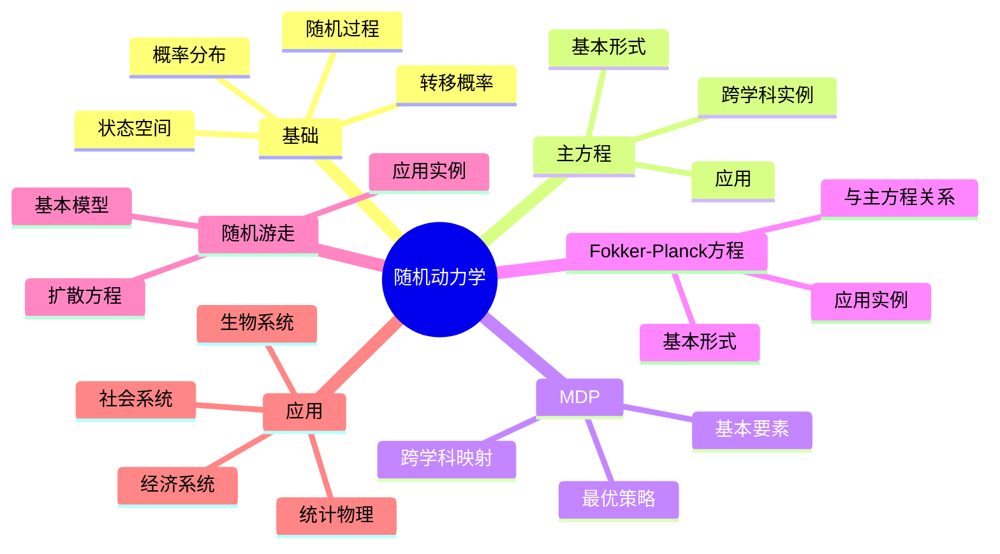
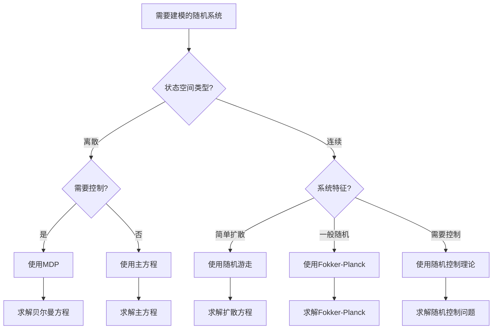
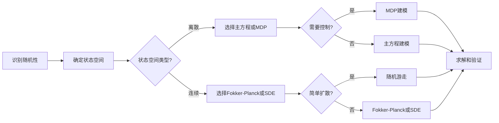
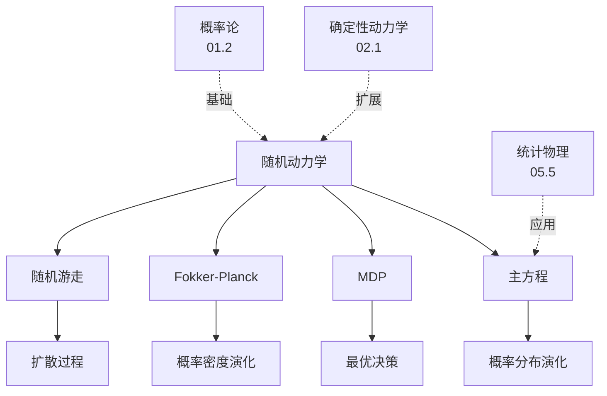
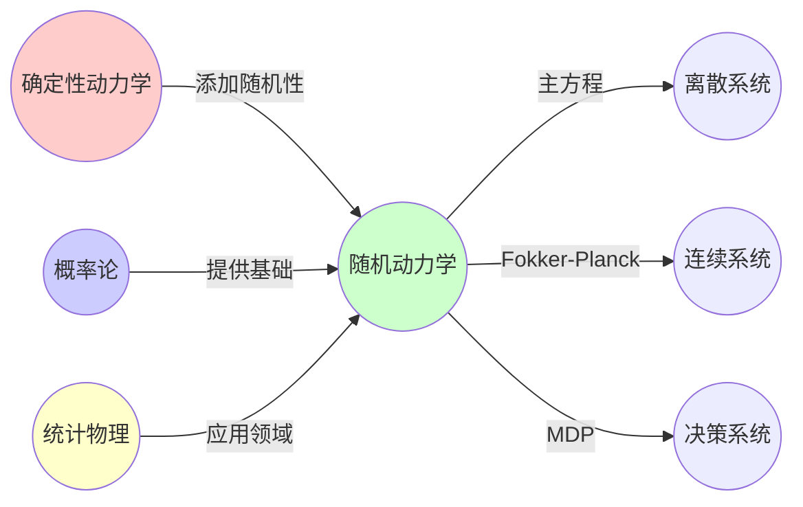
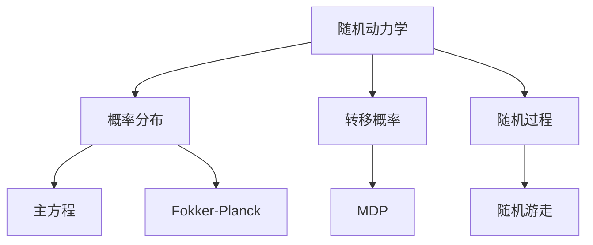

# 02.2 随机动力学

> **来源**: view07.md
> **创建日期**: 2025-01-27
> **最后更新**: 2025-01-27

## 📋 目录

- [02.2 随机动力学](#022-随机动力学)
  - [📋 目录](#-目录)
  - [📋 内容概览](#-内容概览)
  - [🎯 核心理念](#-核心理念)
  - [📚 随机动力学基础](#-随机动力学基础)
    - [基本概念](#基本概念)
    - [核心要素](#核心要素)
  - [🔬 主方程（Master Equation）](#-主方程master-equation)
    - [基本形式](#基本形式)
    - [跨学科实例](#跨学科实例)
  - [🎲 马尔可夫决策过程（MDP）](#-马尔可夫决策过程mdp)
    - [基本要素](#基本要素)
    - [跨学科映射](#跨学科映射)
    - [最优策略](#最优策略)
  - [📊 Fokker-Planck方程](#-fokker-planck方程)
    - [基本形式](#基本形式-1)
    - [与主方程的关系](#与主方程的关系)
    - [应用实例](#应用实例)
  - [🔄 随机游走](#-随机游走)
    - [基本模型](#基本模型)
    - [扩散方程](#扩散方程)
    - [应用实例](#应用实例-1)
  - [🎯 随机动力学应用](#-随机动力学应用)
    - [1. 统计物理](#1-统计物理)
    - [2. 生物系统](#2-生物系统)
    - [3. 社会系统](#3-社会系统)
    - [4. 经济系统](#4-经济系统)
  - [📊 详细案例研究](#-详细案例研究)
    - [案例研究 1：主方程在生物进化中的应用](#案例研究-1主方程在生物进化中的应用)
    - [案例研究 2：MDP在强化学习中的应用](#案例研究-2mdp在强化学习中的应用)
    - [案例研究 3：Fokker-Planck方程在金融建模中的应用](#案例研究-3fokker-planck方程在金融建模中的应用)
  - [⚠️ 批判性分析与局限性](#️-批判性分析与局限性)
    - [局限性讨论](#局限性讨论)
      - [1. 马尔可夫假设的局限性](#1-马尔可夫假设的局限性)
      - [2. 转移概率估计的困难](#2-转移概率估计的困难)
      - [3. 计算复杂度问题](#3-计算复杂度问题)
    - [改进方向](#改进方向)
      - [1. 发展非马尔可夫理论](#1-发展非马尔可夫理论)
      - [2. 提高计算效率](#2-提高计算效率)
  - [📊 思维表征体系](#-思维表征体系)
    - [📊 1. 思维导图（增强版）](#-1-思维导图增强版)
      - [1.1 文本格式（基础版）](#11-文本格式基础版)
      - [1.2 Mermaid格式（可视化版）](#12-mermaid格式可视化版)
    - [📊 2. 多维对比矩阵](#-2-多维对比矩阵)
      - [2.1 确定性动力学与随机动力学对比矩阵](#21-确定性动力学与随机动力学对比矩阵)
      - [2.2 主方程与Fokker-Planck方程对比矩阵](#22-主方程与fokker-planck方程对比矩阵)
      - [2.3 随机动力学方法对比矩阵](#23-随机动力学方法对比矩阵)
    - [🌲 3. 决策树](#-3-决策树)
      - [3.1 随机动力学方法选择决策树](#31-随机动力学方法选择决策树)
    - [🛤️ 4. 决策逻辑路径](#️-4-决策逻辑路径)
      - [4.1 随机动力学建模路径](#41-随机动力学建模路径)
    - [🕸️ 5. 概念关系网络](#️-5-概念关系网络)
      - [5.1 随机动力学概念关系网络](#51-随机动力学概念关系网络)
    - [🗺️ 6. 知识图谱](#️-6-知识图谱)
      - [6.1 随机动力学知识图谱](#61-随机动力学知识图谱)
  - [📚 理论体系](#-理论体系)
    - [理论基础](#理论基础)
      - [数学/概率基础](#数学概率基础)
      - [历史发展](#历史发展)
    - [理论框架](#理论框架)
      - [核心假设](#核心假设)
      - [基本概念体系](#基本概念体系)
      - [主要定理/结论](#主要定理结论)
      - [适用范围和边界](#适用范围和边界)
    - [当前知识共识](#当前知识共识)
      - [学术界共识](#学术界共识)
      - [主要争议点](#主要争议点)
      - [权威来源](#权威来源)
    - [与其他理论的关系](#与其他理论的关系)
      - [逻辑关系](#逻辑关系)
      - [映射关系](#映射关系)
  - [🔗 关联网络](#-关联网络)
    - [🔗 概念级关联](#-概念级关联)
      - [核心概念映射](#核心概念映射)
    - [🔗 理论级关联](#-理论级关联)
      - [理论基础](#理论基础-1)
    - [🔗 方法级关联](#-方法级关联)
      - [方法应用网络](#方法应用网络)
    - [🔗 应用场景关联](#-应用场景关联)
  - [🛤️ 学习路径](#️-学习路径)
    - [前置知识](#前置知识)
    - [后续学习](#后续学习)
    - [并行学习](#并行学习)
  - [🔗 相关文档](#-相关文档)
  - [📖 扩展阅读](#-扩展阅读)

---

## 📋 内容概览

本文档阐述随机动力学系统的基本概念、数学框架及其应用。采用概率论和随机过程方法，全面展示随机动力学在不同领域的应用。

---

## 🎯 核心理念

随机动力学系统描述概率分布随时间的演化，而非确定性的状态演化。通过引入随机性，我们可以更准确地描述实际系统的行为，处理不确定性和噪声。

## 📚 随机动力学基础

### 基本概念

随机动力学系统描述**概率分布**随时间的演化，而非确定性的状态演化。

### 核心要素

1. **状态空间**：所有可能状态的集合
2. **概率分布** P(x,t)：状态的概率
3. **转移概率**：状态间的转移
4. **随机过程**：随机演化

## 🔬 主方程（Master Equation）

### 基本形式

描述**概率分布** P(x,t) 的确定性演化：

```latex
\frac{dP}{dt} = \sum_{x'} [W_{x \leftarrow x'} P(x') - W_{x' \leftarrow x} P(x)]
```

其中：

- **W_{x←x'}**：从状态x'转移到状态x的转移率
- **P(x')**：状态x'的概率

### 跨学科实例

| 领域 | 概率分布 | 转移矩阵W | 守恒量 | 耗散量 |
|------|----------|-----------|--------|--------|
| 统计物理 | 微观态分布 | 碰撞转移 | 能量 | 熵产生 |
| 生物进化 | 基因型频率 | 突变+选择 | 适合度 | 遗传多样性 |
| 机器学习 | 参数后验 | 贝叶斯更新 | 证据 | KL散度 |
| 社会网络 | 观点分布 | 影响力传播 | 总信念质量 | 信息无序 |

## 🎲 马尔可夫决策过程（MDP）

### 基本要素

- **状态**：s ∈ S（环境状态）
- **动作**：a ∈ A（决策）
- **转移**：P(s'|s,a)（动力学核心）
- **奖励**：R(s,a)（目标函数）

### 跨学科映射

| 领域 | 状态 | 动作 | 动力学含义 |
|------|------|------|------------|
| 机器人 | 位姿 | 电机指令 | 运动学+不确定性 |
| 医疗 | 病情阶段 | 治疗方案 | 疗效转移概率 |
| 推荐系统 | 用户兴趣向量 | 推荐内容 | 兴趣漂移 |
| 博弈论 | 游戏局面 | 策略选择 | 对手响应分布 |

### 最优策略

**贝尔曼方程**：

```latex
V^*(s) = \max_a \sum_{s'} P(s'|s,a)[R(s,a) + \gamma V^*(s')]
```

其中：

- *_V_(s)**：最优价值函数
- **γ**：折扣因子

## 📊 Fokker-Planck方程

### 基本形式

描述概率密度函数 p(x,t) 的演化：

```latex
\frac{\partial p}{\partial t} = -\frac{\partial}{\partial x}[A(x)p] + \frac{1}{2}\frac{\partial^2}{\partial x^2}[B(x)p]
```

其中：

- **A(x)**：漂移项（确定性部分）
- **B(x)**：扩散项（随机部分）

### 与主方程的关系

Fokker-Planck方程是主方程在连续状态空间的近似。

### 应用实例

- **布朗运动**：粒子扩散
- **金融模型**：资产价格演化
- **生物系统**：基因频率演化

## 🔄 随机游走

### 基本模型

**简单随机游走**：

```latex
x_{n+1} = x_n + \xi_n
```

其中 ξ_n 是随机步长。

### 扩散方程

在连续极限下，随机游走变为扩散方程：

```latex
\frac{\partial p}{\partial t} = D \frac{\partial^2 p}{\partial x^2}
```

其中 D 是扩散系数。

### 应用实例

- **分子扩散**：物质传输
- **信息传播**：社交网络
- **价格波动**：金融市场

## 🎯 随机动力学应用

### 1. 统计物理

- **相变**：临界现象
- **涨落**：热涨落
- **耗散**：能量耗散

### 2. 生物系统

- **基因表达**：随机性
- **种群动态**：随机波动
- **进化**：随机突变

### 3. 社会系统

- **观点演化**：随机影响
- **信息传播**：随机传播
- **决策**：随机选择

### 4. 经济系统

- **价格波动**：随机游走
- **市场动态**：随机冲击
- **投资决策**：随机收益

## 📊 详细案例研究

### 案例研究 1：主方程在生物进化中的应用

**背景**：使用主方程描述基因型频率的演化，展示随机动力学在进化生物学中的应用。

**形式化分析**：

```text
进化主方程:
- 状态: 基因型频率 P(g,t)
- 转移率: W_{g←g'} = 突变率 + 选择系数
- 演化: dP/dt = Σ[W_{g←g'}P(g') - W_{g'←g}P(g)]

实例: 二倍体群体
- 基因型: AA, Aa, aa
- 突变: A↔a (速率μ)
- 选择: 适合度差异
- 结果: 预测等位基因频率演化

应用效果:
- 预测进化轨迹
- 理解遗传漂变
- 设计进化实验
```

**关键发现**：

- ✅ 主方程能够描述进化的随机过程
- ✅ 遗传漂变和选择可以统一建模
- ✅ 随机性在进化中起重要作用

**应用价值**：

- ✅ 进化生物学研究
- ✅ 种群遗传学
- ✅ 进化实验设计

### 案例研究 2：MDP在强化学习中的应用

**背景**：强化学习使用MDP框架，展示随机动力学在人工智能中的应用。

**形式化分析**：

```text
强化学习MDP:
- 状态: 环境状态 s
- 动作: 智能体动作 a
- 转移: P(s'|s,a) (环境动力学)
- 奖励: R(s,a) (目标函数)

Q学习算法:
- Q值更新: Q(s,a) ← Q(s,a) + α[r + γmax Q(s',a') - Q(s,a)]
- 策略: ε-贪婪策略
- 收敛: 在MDP假设下收敛到最优

实际应用:
- 游戏AI (AlphaGo, DQN)
- 机器人控制
- 推荐系统
- 效果: 超越人类水平
```

**关键发现**：

- ✅ MDP提供了强化学习的理论基础
- ✅ 随机性在探索-利用权衡中起关键作用
- ✅ 贝尔曼方程保证了最优性

**应用价值**：

- ✅ 人工智能系统
- ✅ 自动控制系统
- ✅ 决策支持系统

### 案例研究 3：Fokker-Planck方程在金融建模中的应用

**背景**：使用Fokker-Planck方程描述资产价格的演化，展示随机动力学在金融中的应用。

**形式化分析**：

```text
Black-Scholes模型:
- 状态: 资产价格 S(t)
- 动力学: dS = μS dt + σS dW
- Fokker-Planck: ∂p/∂t = -∂/∂S[μSp] + (1/2)∂²/∂S²[σ²S²p]

期权定价:
- 风险中性测度: μ = r (无风险利率)
- 期权价格: C = e^{-rT}E[max(S_T - K, 0)]
- 解析解: Black-Scholes公式

实际应用:
- 期权定价
- 风险管理
- 投资组合优化
- 局限性: 假设对数正态分布
```

**关键发现**：

- ✅ Fokker-Planck方程能够描述价格演化
- ✅ 随机性在金融建模中至关重要
- ✅ 模型假设影响结果准确性

**应用价值**：

- ✅ 金融衍生品定价
- ✅ 风险管理
- ✅ 投资决策

## ⚠️ 批判性分析与局限性

### 局限性讨论

#### 1. 马尔可夫假设的局限性

**问题**：许多实际系统不满足马尔可夫性质（无记忆性）。

**挑战**：

- ⚠️ 历史依赖影响未来
- ⚠️ 长期记忆效应
- ⚠️ 非马尔可夫过程

**应对策略**：

- ✅ 扩展状态空间
- ✅ 使用非马尔可夫模型
- ✅ 考虑记忆效应

#### 2. 转移概率估计的困难

**问题**：转移概率往往难以准确估计。

**挑战**：

- ⚠️ 数据不足
- ⚠️ 非平稳性
- ⚠️ 高维状态空间

**改进方向**：

- ✅ 使用贝叶斯方法
- ✅ 开发估计算法
- ✅ 考虑不确定性

#### 3. 计算复杂度问题

**问题**：大规模随机动力学系统的计算复杂度高。

**挑战**：

- ⚠️ 状态空间爆炸
- ⚠️ 数值求解困难
- ⚠️ 实时应用限制

**改进方向**：

- ✅ 使用近似方法
- ✅ 开发高效算法
- ✅ 利用并行计算

### 改进方向

#### 1. 发展非马尔可夫理论

**目标**：处理具有记忆效应的系统。

**方法**：

- 扩展状态空间
- 使用分数阶微分方程
- 开发记忆模型

#### 2. 提高计算效率

**目标**：使随机动力学方法更实用。

**方法**：

- 开发高效数值方法
- 使用蒙特卡洛方法
- 利用机器学习加速

## 📊 思维表征体系

### 📊 1. 思维导图（增强版）

#### 1.1 文本格式（基础版）

```text
随机动力学
├── 随机动力学基础
│   ├── 状态空间
│   ├── 概率分布
│   ├── 转移概率
│   └── 随机过程
├── 主方程（Master Equation）
│   ├── 基本形式
│   ├── 跨学科实例
│   │   ├── 统计物理
│   │   ├── 生物进化
│   │   ├── 机器学习
│   │   └── 社会网络
│   └── 应用：进化、统计物理
├── 马尔可夫决策过程（MDP）
│   ├── 基本要素
│   │   ├── 状态
│   │   ├── 动作
│   │   ├── 转移概率
│   │   └── 奖励
│   ├── 贝尔曼方程
│   └── 应用：强化学习、机器人
├── Fokker-Planck方程
│   ├── 基本形式
│   ├── 漂移项和扩散项
│   └── 应用：布朗运动、金融
├── 随机游走
│   ├── 基本模型
│   ├── 扩散方程
│   └── 应用：分子扩散、信息传播
└── 应用领域
    ├── 统计物理
    ├── 生物系统
    ├── 社会系统
    └── 经济系统
```

#### 1.2 Mermaid格式（可视化版）



### 📊 2. 多维对比矩阵

#### 2.1 确定性动力学与随机动力学对比矩阵

| 维度 | 确定性动力学 | 随机动力学 | 综合评价 | 选择建议 |
|------|------------|-----------|---------|----------|
| **演化规则** | dx/dt = f(x,t) | dx/dt = f(x,t) + σξ | 随机扩展确定性 | 根据系统特征 |
| **预测能力** | 完全确定 | 概率分布 | 随机更真实 | 不确定性大时用随机 |
| **状态描述** | 精确值x(t) | 概率分布P(x,t) | 随机包含更多信息 | 需要概率时用随机 |
| **噪声影响** | 忽略 | 显式建模 | 随机更准确 | 噪声明显时用随机 |
| **分析方法** | ODE理论 | SDE、主方程 | 方法不同 | 选择相应方法 |
| **计算复杂度** | 低 | 中高 | 随机更复杂 | 计算资源有限时用确定 |
| **适用系统** | 理想系统 | 实际系统 | 实际系统更复杂 | 根据系统类型选择 |

#### 2.2 主方程与Fokker-Planck方程对比矩阵

| 维度 | 主方程 | Fokker-Planck方程 | 应用场景 | 选择建议 |
|------|--------|------------------|---------|----------|
| **状态空间** | 离散 | 连续 | 状态空间类型 | 离散用主方程，连续用FP |
| **形式** | dP/dt = ΣW·P | ∂p/∂t = -∂(Ap)/∂x + (1/2)∂²(Bp)/∂x² | 方程形式 | 根据状态空间选择 |
| **计算复杂度** | 中等 | 中等 | 复杂度相似 | 根据问题选择 |
| **近似关系** | 精确 | 主方程的连续近似 | 主方程更精确 | 离散系统用主方程 |
| **典型应用** | 化学反应、基因频率 | 布朗运动、金融模型 | 应用不同 | 根据具体问题 |

#### 2.3 随机动力学方法对比矩阵

| 维度 | 主方程 | MDP | Fokker-Planck | 随机游走 | 推荐场景 |
|------|--------|-----|---------------|----------|----------|
| **适用系统** | 离散状态 | 决策系统 | 连续状态 | 简单扩散 | 根据系统类型 |
| **控制性** | 无控制 | 有控制 | 无控制 | 无控制 | 需要控制用MDP |
| **复杂性** | 中 | 高 | 中 | 低 | 简单用随机游走 |
| **应用广度** | 广 | 很广 | 广 | 中 | MDP应用最广 |
| **理论基础** | 统计物理 | 决策理论 | 统计物理 | 随机过程 | 理论基础不同 |

### 🌲 3. 决策树

#### 3.1 随机动力学方法选择决策树



### 🛤️ 4. 决策逻辑路径

#### 4.1 随机动力学建模路径



### 🕸️ 5. 概念关系网络

#### 5.1 随机动力学概念关系网络



### 🗺️ 6. 知识图谱

#### 6.1 随机动力学知识图谱



## 📚 理论体系

### 理论基础

#### 数学/概率基础

随机动力学的理论基础：

**1. 概率论基础**：

- 概率空间、随机变量
- 随机过程、马尔可夫过程
- 条件概率、转移概率

**2. 随机分析基础**：

- 随机微分方程（SDE）
- 伊藤积分、斯特拉托诺维奇积分
- 布朗运动、维纳过程

**3. 统计物理基础**：

- 主方程
- Fokker-Planck方程
- 涨落-耗散定理

#### 历史发展

**关键时间节点**：

- **1905年**：爱因斯坦的布朗运动理论
  - 首次将随机性引入物理系统
  - 建立扩散方程

- **1931年**：Kolmogorov的随机过程理论
  - 建立随机过程的数学基础
  - Kolmogorov方程

- **1940-1950年代**：主方程的发展
  - 统计物理中的主方程
  - 化学反应动力学

- **1950年代**：随机微分方程理论
  - Itô微积分
  - Fokker-Planck方程的系统化

- **1957年**：贝尔曼的动态规划
  - MDP理论基础
  - 最优控制理论

- **1960年代至今**：应用扩展
  - 生物系统、经济系统
  - 机器学习、强化学习

### 理论框架

#### 核心假设

**假设1：马尔可夫性质**

- **内容**：未来状态只依赖于当前状态，不依赖历史
- **适用范围**：满足马尔可夫性质的系统
- **限制条件**：需要验证马尔可夫性质

**假设2：转移概率的稳定性**

- **内容**：转移概率不随时间变化（或变化缓慢）
- **适用范围**：平稳随机过程
- **限制条件**：非平稳系统需要扩展

**假设3：随机性的可建模性**

- **内容**：系统的随机性可以用概率分布描述
- **适用范围**：具有统计规律的系统
- **限制条件**：完全混沌系统可能不适用

#### 基本概念体系



#### 主要定理/结论

**定理1：主方程的守恒性**

- **内容**：主方程保证概率守恒
- **证据**：ΣdP_i/dt = 0
- **应用**：验证模型正确性

**定理2：Fokker-Planck方程的等价性**

- **内容**：Fokker-Planck方程等价于主方程的连续近似
- **证据**：从主方程到Fokker-Planck的推导
- **应用**：连续系统的随机动力学

**结论3：MDP的最优性**

- **内容**：贝尔曼方程给出MDP的最优策略
- **证据**：动态规划理论
- **应用**：最优决策和控制

#### 适用范围和边界

**适用范围**：

- 具有随机性的动力学系统
- 满足马尔可夫性质的系统
- 具有统计规律的系统

**边界条件**：

- 需要满足马尔可夫性质
- 需要已知或可估计转移概率
- 需要明确的状态空间

**不适用场景**：

- 完全确定性系统（用确定性动力学）
- 非马尔可夫系统（需要扩展）
- 无统计规律的系统

### 当前知识共识

#### 学术界共识

**广泛接受的共识**：

1. **随机性的重要性**
   - **共识**：随机性在实际系统中普遍存在
   - **支持证据**：大量成功应用案例
   - **来源**：统计物理、系统生物学、金融工程

2. **主方程和Fokker-Planck方程的等价性**
   - **共识**：Fokker-Planck是主方程的连续近似
   - **支持证据**：数学推导和数值验证
   - **来源**：统计物理、随机过程理论

3. **MDP的适用性**
   - **共识**：MDP是决策问题的有效框架
   - **支持证据**：强化学习的成功
   - **来源**：控制理论、机器学习

#### 主要争议点

1. **马尔可夫假设的有效性**
   - **观点A**：大多数系统近似满足马尔可夫性质
   - **观点B**：许多系统具有长期记忆，不满足马尔可夫性质
   - **当前状态**：多数认为近似有效，但需要注意验证

2. **连续vs离散模型的优劣**
   - **观点A**：连续模型更精确
   - **观点B**：离散模型更灵活
   - **当前状态**：根据具体问题选择

#### 权威来源

**经典文献**：

- 《Stochastic Processes》- Emanuel Parzen
- 《An Introduction to Stochastic Modeling》- Mark Pinsky & Samuel Karlin
- 《Reinforcement Learning》- Sutton & Barto（MDP）

**权威机构/专家**：

- **概率论学会**
- **控制理论学会**
- **机器学习社区**

**最新发展**：

- **2020-2024**：深度强化学习、非马尔可夫模型、量子随机过程
- **前沿方向**：大语言模型中的随机过程、非平稳随机过程

### 与其他理论的关系

#### 逻辑关系

**理论基础**：

- **确定性动力学**（[02.1_经典确定性动力学.md](02.1_经典确定性动力学.md)） → 随机动力学
  - 关系类型：扩展关系
  - 关键映射：确定性ODE → 随机SDE

- **概率论**（[01.2_核心领域详解.md](../01_形式科学基础理论/01.2_核心领域详解.md)） → 随机动力学
  - 关系类型：提供基础
  - 关键映射：概率分布 → 随机过程

**理论应用**：

- 随机动力学 → 网络动力学（[02.3_网络动力学.md](02.3_网络动力学.md)）
  - 应用方式：网络上的随机过程
  - 应用效果：描述网络系统的随机演化

#### 映射关系

| 本理论概念 | 映射理论 | 映射概念 | 映射类型 | 映射说明 |
|-----------|---------|---------|---------|----------|
| **主方程** | 02.1_经典确定性动力学.md | ODE | 扩展 | 主方程是概率分布的ODE |
| **Fokker-Planck方程** | 02.1_经典确定性动力学.md | 扩散方程 | 扩展 | FP是概率扩散方程 |
| **MDP** | 02.5_跨学科动力学映射.md | 动力学映射 | 应用 | MDP用于跨学科映射 |
| **随机游走** | 02.3_网络动力学.md | 网络扩散 | 应用 | 随机游走用于网络扩散 |
| **概率分布** | 01.2_核心领域详解.md | 统计学 | 基础 | 概率论基础 |

## 🔗 关联网络

### 🔗 概念级关联

#### 核心概念映射

| 本文档概念 | 关联文档 | 关联概念 | 关系类型 | 映射说明 |
|-----------|---------|---------|---------|----------|
| **主方程** | 02.1_经典确定性动力学.md | ODE | 扩展 | 主方程是概率分布的ODE |
| **Fokker-Planck方程** | 02.1_经典确定性动力学.md | 扩散方程 | 扩展 | FP是概率扩散方程 |
| **MDP** | 02.5_跨学科动力学映射.md | 动力学映射 | 应用 | MDP用于跨学科映射 |
| **随机游走** | 02.3_网络动力学.md | 网络扩散 | 应用 | 随机游走用于网络扩散 |
| **概率分布演化** | 01.2_核心领域详解.md | 统计学 | 基础 | 概率论提供基础 |
| **马尔可夫过程** | 02.6_高级抽象.md | 随机过程 | 基础 | 马尔可夫是随机过程的基础 |
| **最优策略** | 08.4_决策动力学.md | 决策理论 | 应用 | MDP用于决策 |

### 🔗 理论级关联

#### 理论基础

- **本理论基于**：
  - [02.1_经典确定性动力学.md](02.1_经典确定性动力学.md) ⭐⭐⭐ - 确定性动力学的扩展
  - [01.2_核心领域详解.md](../01_形式科学基础理论/01.2_核心领域详解.md) ⭐⭐ - 概率论基础

- **本理论应用于**：
  - [02.3_网络动力学.md](02.3_网络动力学.md) ⭐⭐⭐ - 网络上的随机过程
  - [02.5_跨学科动力学映射.md](02.5_跨学科动力学映射.md) ⭐⭐ - MDP的应用
  - [08.4_决策动力学.md](../08_数学直觉与认知科学/08.4_决策动力学.md) ⭐⭐ - 决策理论

### 🔗 方法级关联

#### 方法应用网络

| 本文档方法 | 应用文档 | 应用场景 | 应用效果 |
|-----------|---------|---------|---------|
| **主方程方法** | 02.3_网络动力学.md | 网络随机过程 | 成功 |
| **MDP方法** | 08.4_决策动力学.md | 决策建模 | 成功 |
| **Fokker-Planck方法** | 02.1_经典确定性动力学.md | 连续随机过程 | 成功 |

### 🔗 应用场景关联

**场景**：随机网络系统建模

| 视角 | 关联文档 | 核心理论 | 关注点 |
|------|---------|---------|--------|
| **随机性建模** | 本文档 | 随机动力学 | 随机过程 |
| **网络结构** | 02.3_网络动力学.md | 网络动力学 | 网络拓扑 |
| **概率演化** | 01.2_核心领域详解.md | 概率论 | 概率分布 |

## 🛤️ 学习路径

### 前置知识

**必须先学习**：

- [02.1_经典确定性动力学.md](02.1_经典确定性动力学.md) ⭐⭐⭐ - 确定性动力学基础
- [01.2_核心领域详解.md](../01_形式科学基础理论/01.2_核心领域详解.md) ⭐⭐ - 概率论基础

**建议先了解**：

- 基础概率论（随机变量、概率分布）
- 基础微积分（微分方程）

### 后续学习

**建议接下来学习**（按顺序）：

1. [02.3_网络动力学.md](02.3_网络动力学.md) ⭐⭐⭐ - 网络上的随机过程
2. [02.5_跨学科动力学映射.md](02.5_跨学科动力学映射.md) ⭐⭐ - MDP的应用
3. [02.6_高级抽象.md](02.6_高级抽象.md) ⭐⭐ - 高级随机动力学

### 并行学习

**可以同时学习**：

- [08.4_决策动力学.md](../08_数学直觉与认知科学/08.4_决策动力学.md) - MDP的应用
- [05.5_计算与物理.md](../05_信息论与计算理论/05.5_计算与物理.md) - 统计物理

## 🔗 相关文档

- [02.1_经典确定性动力学.md](02.1_经典确定性动力学.md)
- [02.3_网络动力学.md](02.3_网络动力学.md)
- [02.4_分岔理论与相变.md](02.4_分岔理论与相变.md)
- [02.5_跨学科动力学映射.md](02.5_跨学科动力学映射.md)

## 📖 扩展阅读

- 《Stochastic Processes》- Sheldon Ross
- Wikipedia: [Stochastic Process](https://en.wikipedia.org/wiki/Stochastic_process)
- Wikipedia: [Master Equation](https://en.wikipedia.org/wiki/Master_equation)
- Wikipedia: [Fokker-Planck Equation](https://en.wikipedia.org/wiki/Fokker%E2%80%93Planck_equation)
