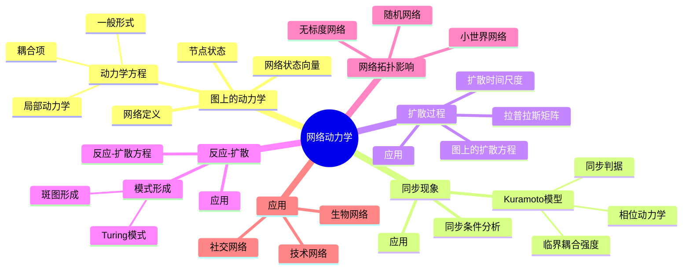
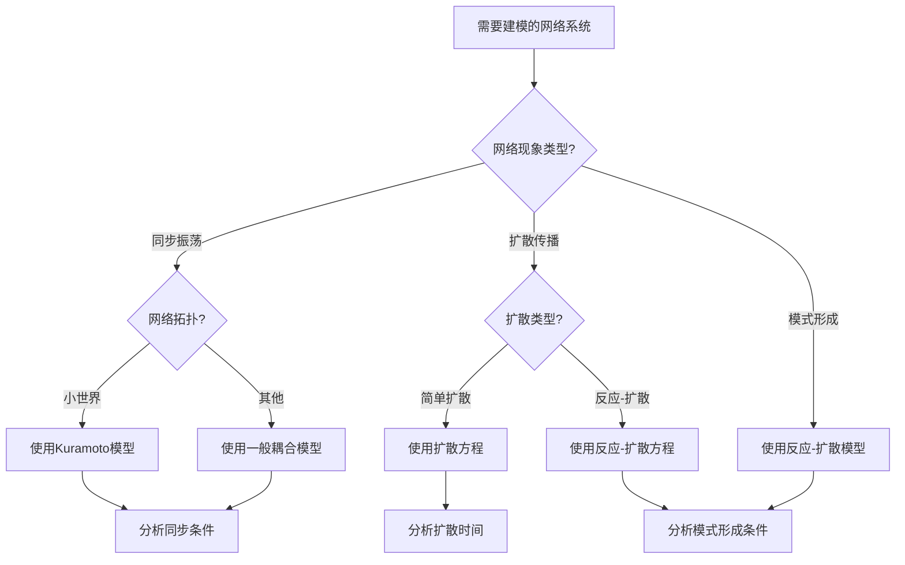
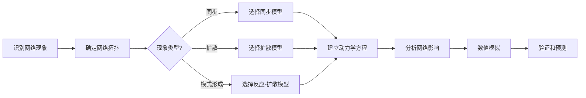
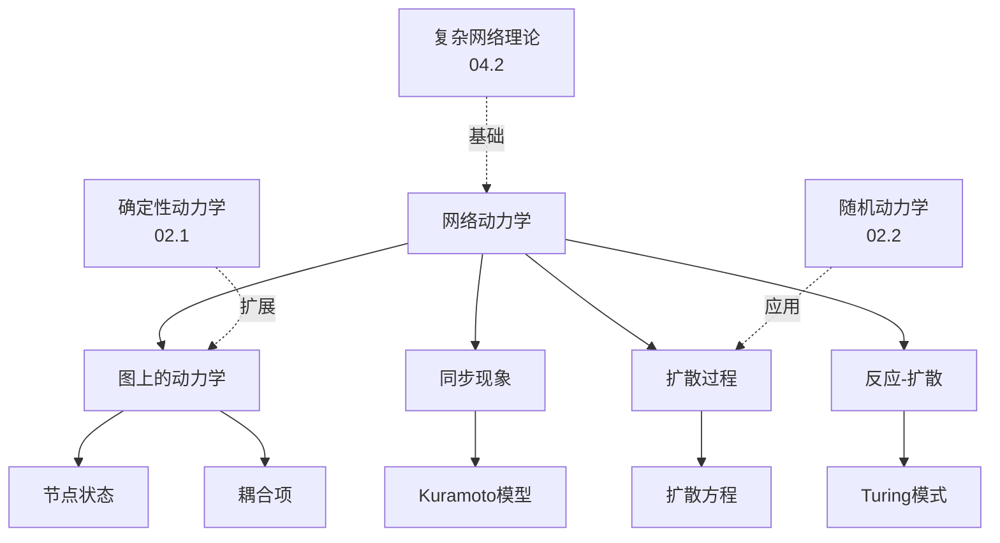
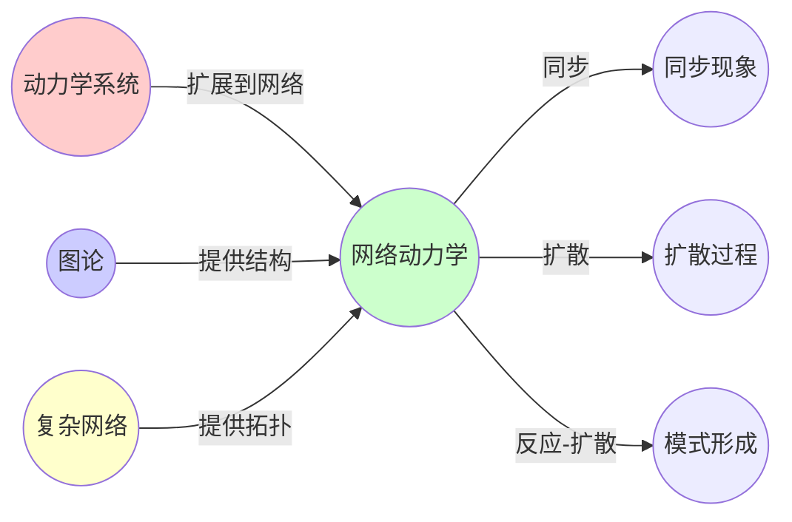
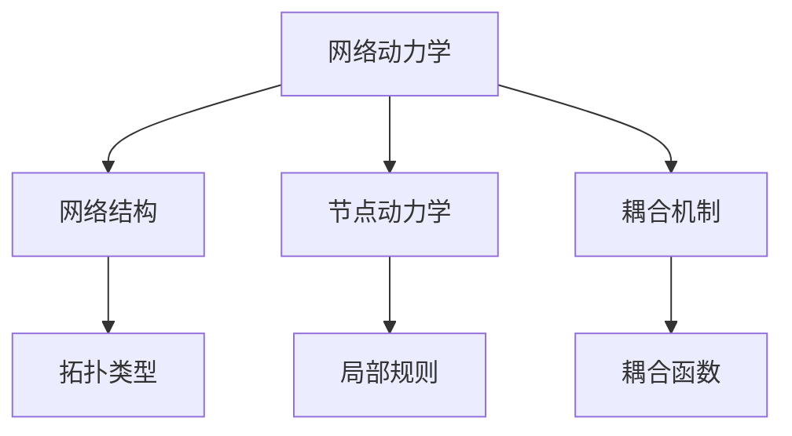

# 02.3 网络动力学

> **来源**: view07.md
> **创建日期**: 2025-01-27
> **最后更新**: 2025-01-27

## 📋 目录

- [02.3 网络动力学](#023-网络动力学)
  - [📋 目录](#-目录)
  - [📋 内容概览](#-内容概览)
  - [🎯 核心理念](#-核心理念)
  - [🌐 图上的动力学](#-图上的动力学)
    - [基本概念](#基本概念)
    - [状态变量](#状态变量)
    - [动力学方程](#动力学方程)
  - [🔄 同步现象](#-同步现象)
    - [Kuramoto模型](#kuramoto模型)
    - [同步条件](#同步条件)
    - [应用实例](#应用实例)
  - [📊 扩散过程](#-扩散过程)
    - [图上的扩散方程](#图上的扩散方程)
    - [扩散时间尺度](#扩散时间尺度)
  - [🎯 网络上的反应-扩散](#-网络上的反应-扩散)
    - [反应-扩散方程](#反应-扩散方程)
    - [模式形成](#模式形成)
  - [🔗 网络拓扑的影响](#-网络拓扑的影响)
    - [小世界网络](#小世界网络)
    - [无标度网络](#无标度网络)
    - [随机网络](#随机网络)
  - [📈 网络动力学应用](#-网络动力学应用)
    - [1. 社交网络](#1-社交网络)
    - [2. 生物网络](#2-生物网络)
    - [3. 技术网络](#3-技术网络)
  - [📊 详细案例研究](#-详细案例研究)
    - [案例研究 1：Kuramoto模型在电网同步中的应用](#案例研究-1kuramoto模型在电网同步中的应用)
    - [案例研究 2：扩散过程在社交网络信息传播中的应用](#案例研究-2扩散过程在社交网络信息传播中的应用)
    - [案例研究 3：反应-扩散在生物形态形成中的应用](#案例研究-3反应-扩散在生物形态形成中的应用)
  - [⚠️ 批判性分析与局限性](#️-批判性分析与局限性)
    - [局限性讨论](#局限性讨论)
      - [1. 网络结构简化的局限性](#1-网络结构简化的局限性)
      - [2. 同步稳定性的理论预测与实际差距](#2-同步稳定性的理论预测与实际差距)
      - [3. 大规模网络的计算复杂度](#3-大规模网络的计算复杂度)
    - [改进方向](#改进方向)
      - [1. 扩展到动态网络](#1-扩展到动态网络)
      - [2. 提高模型精度](#2-提高模型精度)
  - [📊 思维表征体系](#-思维表征体系)
    - [📊 1. 思维导图（增强版）](#-1-思维导图增强版)
      - [1.1 文本格式（基础版）](#11-文本格式基础版)
      - [1.2 Mermaid格式（可视化版）](#12-mermaid格式可视化版)
    - [📊 2. 多维对比矩阵](#-2-多维对比矩阵)
      - [2.1 网络拓扑类型对比矩阵](#21-网络拓扑类型对比矩阵)
      - [2.2 网络动力学现象对比矩阵](#22-网络动力学现象对比矩阵)
      - [2.3 网络动力学模型对比矩阵](#23-网络动力学模型对比矩阵)
    - [🌲 3. 决策树](#-3-决策树)
      - [3.1 网络动力学方法选择决策树](#31-网络动力学方法选择决策树)
    - [🛤️ 4. 决策逻辑路径](#️-4-决策逻辑路径)
      - [4.1 网络动力学建模路径](#41-网络动力学建模路径)
    - [🕸️ 5. 概念关系网络](#️-5-概念关系网络)
      - [5.1 网络动力学概念关系网络](#51-网络动力学概念关系网络)
    - [🗺️ 6. 知识图谱](#️-6-知识图谱)
      - [6.1 网络动力学知识图谱](#61-网络动力学知识图谱)
  - [📚 理论体系](#-理论体系)
    - [理论基础](#理论基础)
      - [数学/图论基础](#数学图论基础)
      - [历史发展](#历史发展)
    - [理论框架](#理论框架)
      - [核心假设](#核心假设)
      - [基本概念体系](#基本概念体系)
      - [主要定理/结论](#主要定理结论)
      - [适用范围和边界](#适用范围和边界)
    - [当前知识共识](#当前知识共识)
      - [学术界共识](#学术界共识)
      - [主要争议点](#主要争议点)
      - [权威来源](#权威来源)
    - [与其他理论的关系](#与其他理论的关系)
      - [逻辑关系](#逻辑关系)
      - [映射关系](#映射关系)
  - [🔗 关联网络](#-关联网络)
    - [🔗 概念级关联](#-概念级关联)
      - [核心概念映射](#核心概念映射)
    - [🔗 理论级关联](#-理论级关联)
      - [理论基础](#理论基础-1)
    - [🔗 方法级关联](#-方法级关联)
      - [方法应用网络](#方法应用网络)
    - [🔗 应用场景关联](#-应用场景关联)
  - [🛤️ 学习路径](#️-学习路径)
    - [前置知识](#前置知识)
    - [后续学习](#后续学习)
    - [并行学习](#并行学习)
  - [🔗 相关文档](#-相关文档)
  - [📖 扩展阅读](#-扩展阅读)

---

## 📋 内容概览

本文档阐述网络上的动力学系统，包括图上的微分方程、同步现象等。采用图论和动力学系统方法，全面展示网络动力学在不同领域的应用。

---

## 🎯 核心理念

网络动力学研究节点状态如何通过网络连接进行相互作用和演化。网络拓扑结构（如小世界、无标度）对动力学行为有重要影响，相同的动力学规则在不同网络上可能产生不同的集体行为。

## 🌐 图上的动力学

### 基本概念

**网络** = 图 G = (V, E)

- **节点** V：系统单元
- **边** E：相互作用

### 状态变量

**节点状态**：xᵢ(t) ∈ ℝⁿ (节点i在时间t的状态)

**网络状态**：x(t) = [x₁(t), x₂(t), ..., xₙ(t)]ᵀ

### 动力学方程

**一般形式**：

```latex
\frac{dx_i}{dt} = f(x_i) + \sum_j A_{ij} \cdot g(x_i, x_j)
```

- **f(xᵢ)**：节点i的局部动力学
- **Aᵢⱼ**：邻接矩阵（Aᵢⱼ = 1 如果节点i和j相连）
- **g(xᵢ, xⱼ)**：耦合函数

## 🔄 同步现象

### Kuramoto模型

**状态**：相位 θᵢ(t) ∈ [0, 2π)

**动力学**：

```latex
\frac{d\theta_i}{dt} = \omega_i + \frac{K}{N} \sum_j \sin(\theta_j - \theta_i)
```

- **ωᵢ**：节点i的自然频率
- **K**：耦合强度
- **N**：节点数

### 同步条件

**临界耦合强度**：

```latex
K_c = 2|\omega_{\max} - \omega_{\min}|
```

**同步判据**：

- K < K_c：不同步
- K > K_c：同步

### 应用实例

| 领域 | 同步对象 | 耦合机制 |
|------|----------|----------|
| **生物** | 萤火虫闪烁 | 光信号 |
| **物理** | 激光器阵列 | 光耦合 |
| **社会** | 人群节奏 | 视觉/听觉 |
| **技术** | 电网频率 | 电力传输 |

## 📊 扩散过程

### 图上的扩散方程

**状态**：浓度 uᵢ(t)

**动力学**：

```latex
\frac{du_i}{dt} = D \sum_j L_{ij} u_j
```

- **D**：扩散系数
- **Lᵢⱼ**：拉普拉斯矩阵元素

**拉普拉斯矩阵**：

```latex
L = D - A
```

- **D**：度矩阵（对角矩阵）
- **A**：邻接矩阵

### 扩散时间尺度

**特征时间**：

```latex
\tau = \frac{1}{D \cdot \lambda_2}
```

- **λ₂**：拉普拉斯矩阵的第二小特征值（代数连通性）

**应用**：

- **信息传播**：信息在网络中的扩散
- **疾病传播**：疾病在网络中的传播
- **意见传播**：观点在网络中的传播

## 🎯 网络上的反应-扩散

### 反应-扩散方程

**状态**：uᵢ(t)（如种群密度）

**动力学**：

```latex
\frac{du_i}{dt} = f(u_i) + D \sum_j L_{ij} u_j
```

- **f(uᵢ)**：反应项（局部动力学）
- **D Σⱼ Lᵢⱼ uⱼ**：扩散项（网络耦合）

### 模式形成

**条件**：当反应项有非线性项时，可能形成空间模式

**实例**：

- **Turing模式**：生物形态形成
- **斑图形成**：化学反应
- **种群分布**：生态学

## 🔗 网络拓扑的影响

### 小世界网络

**特征**：

- **高聚类系数**：局部连接密集
- **短平均路径长度**：全局连接稀疏但高效

**动力学影响**：

- **快速同步**：短路径促进同步
- **快速扩散**：信息快速传播

### 无标度网络

**特征**：

- **度分布幂律**：P(k) ∝ k^(-γ)
- **Hub节点**：少数节点连接极多

**动力学影响**：

- **同步稳定性**：Hub节点促进同步
- **扩散效率**：Hub节点加速扩散
- **鲁棒性**：Hub节点故障影响大

### 随机网络

**特征**：

- **度分布泊松**：P(k) ≈ e^(-λ) λ^k / k!
- **连接随机**：无偏好

**动力学影响**：

- **均匀扩散**：扩散相对均匀
- **同步阈值**：中等同步阈值

## 📈 网络动力学应用

### 1. 社交网络

**应用**：

- **信息传播**：谣言、新闻传播
- **意见形成**：观点演化
- **行为传播**：行为模仿

**模型**：

- **SIR模型**：信息传播
- **Voter模型**：意见形成
- **阈值模型**：行为传播

### 2. 生物网络

**应用**：

- **基因调控网络**：基因表达调控
- **蛋白质相互作用网络**：信号转导
- **神经网络**：神经信号传递

**模型**：

- **布尔网络**：基因调控
- **微分方程网络**：信号转导
- **脉冲耦合网络**：神经网络

### 3. 技术网络

**应用**：

- **电网**：电力传输
- **互联网**：信息传输
- **交通网络**：交通流

**模型**：

- **电力流模型**：电网
- **路由模型**：互联网
- **交通流模型**：交通网络

## 📊 详细案例研究

### 案例研究 1：Kuramoto模型在电网同步中的应用

**背景**：电网中的发电机需要同步，使用Kuramoto模型研究同步现象。

**形式化分析**：

```text
电网同步模型:
- 节点: 发电机
- 状态: 相位 θ_i(t)
- 动力学: dθ_i/dt = ω_i + (K/N)Σsin(θ_j - θ_i)
- 自然频率: ω_i (发电机的固有频率)
- 耦合强度: K (电网连接强度)

同步分析:
- 临界耦合: K_c = 2|ω_max - ω_min|
- 同步状态: 所有相位差恒定
- 失同步: 频率失配导致故障

实际应用:
- 预测同步稳定性
- 设计电网连接
- 预防大规模停电
- 效果: 提高电网可靠性
```

**关键发现**：

- ✅ Kuramoto模型能够预测电网同步行为
- ✅ 临界耦合强度是关键参数
- ✅ 网络拓扑影响同步稳定性

**应用价值**：

- ✅ 电网设计和运行
- ✅ 预防大规模停电
- ✅ 提高电力系统稳定性

### 案例研究 2：扩散过程在社交网络信息传播中的应用

**背景**：使用网络扩散模型研究信息在社交网络中的传播。

**形式化分析**：

```text
信息传播扩散模型:
- 状态: 信息浓度 u_i(t)
- 动力学: du_i/dt = DΣL_ij u_j - δu_i
- 扩散系数: D (传播速率)
- 衰减率: δ (遗忘率)
- 拉普拉斯矩阵: L (网络结构)

传播特征:
- 扩散时间: τ = 1/(D·λ_2)
- 代数连通性: λ_2 (第二小特征值)
- 传播速度: 取决于网络结构

实际应用:
- 预测信息传播范围
- 识别关键节点
- 设计传播策略
- 效果: 提高信息传播效率
```

**关键发现**：

- ✅ 网络结构决定信息传播速度
- ✅ 代数连通性反映了网络传播能力
- ✅ 关键节点对传播有重要影响

**应用价值**：

- ✅ 社交媒体营销
- ✅ 公共卫生信息传播
- ✅ 网络安全管理

### 案例研究 3：反应-扩散在生物形态形成中的应用

**背景**：使用反应-扩散模型解释生物体的模式形成。

**形式化分析**：

```text
Turing模式形成:
- 状态: 化学物质浓度 u(x,t), v(x,t)
- 反应项: f(u,v), g(u,v)
- 扩散项: D_u∇²u, D_v∇²v
- 条件: 反应项非线性 + 扩散系数差异

模式形成条件:
- 扩散不稳定性: D_v >> D_u
- 反应项: 激活剂-抑制剂机制
- 结果: 空间模式（条纹、斑点）

生物实例:
- 斑马条纹
- 海葵触手分布
- 指纹形成
```

**关键发现**：

- ✅ 反应-扩散能够解释生物模式
- ✅ 扩散不稳定性是关键机制
- ✅ 简单的局部规则产生复杂全局模式

**应用价值**：

- ✅ 理解生物发育
- ✅ 设计人工模式
- ✅ 生物医学应用

## ⚠️ 批判性分析与局限性

### 局限性讨论

#### 1. 网络结构简化的局限性

**问题**：实际网络往往比模型假设更复杂。

**挑战**：

- ⚠️ 动态网络（边随时间变化）
- ⚠️ 加权网络（边有强度差异）
- ⚠️ 多层网络（多种连接类型）

**应对策略**：

- ✅ 考虑时间依赖的网络
- ✅ 使用加权网络模型
- ✅ 开发多层网络理论

#### 2. 同步稳定性的理论预测与实际差距

**问题**：理论预测的同步条件可能与实际有差距。

**挑战**：

- ⚠️ 非线性效应
- ⚠️ 噪声影响
- ⚠️ 延迟效应

**改进方向**：

- ✅ 考虑非线性耦合
- ✅ 引入噪声模型
- ✅ 分析延迟影响

#### 3. 大规模网络的计算复杂度

**问题**：大规模网络的计算和仿真非常困难。

**挑战**：

- ⚠️ 状态空间维数高
- ⚠️ 数值求解困难
- ⚠️ 实时应用限制

**改进方向**：

- ✅ 使用降维方法
- ✅ 开发近似算法
- ✅ 利用网络稀疏性

### 改进方向

#### 1. 扩展到动态网络

**目标**：处理网络结构随时间变化的情况。

**方法**：

- 开发时变网络模型
- 研究自适应网络
- 分析网络演化

#### 2. 提高模型精度

**目标**：使模型更准确地描述实际系统。

**方法**：

- 考虑非线性效应
- 引入噪声和延迟
- 验证模型预测

## 📊 思维表征体系

### 📊 1. 思维导图（增强版）

#### 1.1 文本格式（基础版）

```text
网络动力学
├── 图上的动力学
│   ├── 网络定义: G = (V, E)
│   ├── 节点状态: x_i(t)
│   ├── 动力学方程
│   │   ├── 局部动力学: f(x_i)
│   │   ├── 耦合项: ΣA_ij·g(x_i, x_j)
│   │   └── 一般形式
│   └── 网络状态向量
├── 同步现象
│   ├── Kuramoto模型
│   │   ├── 相位动力学
│   │   ├── 临界耦合强度
│   │   └── 同步判据
│   ├── 同步条件分析
│   └── 应用: 电网、生物节律
├── 扩散过程
│   ├── 图上的扩散方程
│   ├── 拉普拉斯矩阵
│   ├── 扩散时间尺度
│   └── 应用: 信息传播、疾病传播
├── 网络上的反应-扩散
│   ├── 反应-扩散方程
│   ├── 模式形成
│   │   ├── Turing模式
│   │   ├── 斑图形成
│   │   └── 条件分析
│   └── 应用: 生物形态、化学反应
├── 网络拓扑的影响
│   ├── 小世界网络
│   │   ├── 特征: 高聚类、短路径
│   │   └── 动力学影响
│   ├── 无标度网络
│   │   ├── 特征: 幂律分布、Hub节点
│   │   └── 动力学影响
│   └── 随机网络
│       ├── 特征: 泊松分布
│       └── 动力学影响
└── 应用领域
    ├── 社交网络
    ├── 生物网络
    └── 技术网络
```

#### 1.2 Mermaid格式（可视化版）



### 📊 2. 多维对比矩阵

#### 2.1 网络拓扑类型对比矩阵

| 维度 | 小世界网络 | 无标度网络 | 随机网络 | 综合评价 | 推荐场景 |
|------|-----------|-----------|---------|----------|----------|
| **聚类系数** | 高 | 中 | 低 | 小世界最高 | 需要强社区用小世界 |
| **平均路径长度** | 短 | 短 | 中等 | 小世界和无标度都短 | 需要快速传播用这两种 |
| **度分布** | 指数 | 幂律 | 泊松 | 无标度最特殊 | 需要关键节点用无标度 |
| **同步性** | 高 | 中高 | 中 | 小世界同步性最好 | 需要同步用小世界 |
| **鲁棒性** | 中 | 低 | 高 | 随机网络最鲁棒 | 需要鲁棒性用随机 |
| **典型应用** | 社交网络 | 互联网、生物网络 | 理论模型 | 应用不同 | 根据应用选择 |

#### 2.2 网络动力学现象对比矩阵

| 维度 | 同步 | 扩散 | 反应-扩散 | 应用领域 | 选择建议 |
|------|------|------|-----------|---------|----------|
| **动力学类型** | 耦合振荡 | 随机游走 | 非线性反应+扩散 | 类型不同 | 根据现象选择 |
| **数学工具** | 耦合ODE | 扩散方程 | 反应-扩散PDE | 工具不同 | 选择相应工具 |
| **网络影响** | 强 | 中 | 强 | 都有影响 | 都需要考虑拓扑 |
| **典型应用** | 电网同步 | 信息传播 | 生物形态 | 应用不同 | 根据具体问题 |
| **计算复杂度** | 中 | 低 | 高 | 反应-扩散最复杂 | 根据资源选择 |

#### 2.3 网络动力学模型对比矩阵

| 维度 | Kuramoto模型 | 扩散模型 | 反应-扩散模型 | 适用系统 | 推荐 |
|------|-------------|---------|--------------|---------|------|
| **适用现象** | 同步振荡 | 扩散传播 | 模式形成 | 现象不同 | 根据现象选择 |
| **非线性性** | 中 | 低 | 高 | 反应-扩散最非线性 | 需要非线性用反应-扩散 |
| **分析难度** | 中 | 低 | 高 | 扩散最容易 | 需要简单用扩散 |
| **预测能力** | 中 | 高 | 中 | 扩散预测最准确 | 需要预测用扩散 |
| **应用广度** | 中 | 高 | 中 | 扩散应用最广 | 扩散模型最通用 |

### 🌲 3. 决策树

#### 3.1 网络动力学方法选择决策树



### 🛤️ 4. 决策逻辑路径

#### 4.1 网络动力学建模路径



### 🕸️ 5. 概念关系网络

#### 5.1 网络动力学概念关系网络



### 🗺️ 6. 知识图谱

#### 6.1 网络动力学知识图谱



## 📚 理论体系

### 理论基础

#### 数学/图论基础

网络动力学的理论基础：

**1. 图论基础**：

- 图的基本概念（节点、边）
- 图的矩阵表示（邻接矩阵、拉普拉斯矩阵）
- 图的特征（度、路径、聚类系数）

**2. 动力学系统基础**：

- ODE理论
- 耦合振荡器
- 稳定性理论

**3. 线性代数基础**：

- 矩阵特征值
- 谱理论
- 矩阵分解

#### 历史发展

**关键时间节点**：

- **1736年**：欧拉的图论起源（哥尼斯堡七桥问题）

- **1960年代**：小世界现象的发现
  - Milgram的小世界实验
  - 六度分隔理论

- **1998-1999年**：复杂网络理论兴起
  - Watts-Strogatz小世界网络模型
  - Barabási-Albert无标度网络模型

- **1970年代**：Kuramoto模型的提出
  - 同步现象的数学模型
  - 相位动力学

- **1950年代**：反应-扩散理论的建立
  - Turing的形态发生理论
  - 模式形成机制

- **2000年代至今**：网络动力学应用扩展
  - 社交网络分析
  - 生物网络研究
  - 技术网络优化

### 理论框架

#### 核心假设

**假设1：网络的静态性**

- **内容**：网络结构在动力学演化过程中保持不变
- **适用范围**：静态网络系统
- **限制条件**：动态网络需要扩展

**假设2：局部相互作用**

- **内容**：节点只与直接邻居相互作用
- **适用范围**：大多数网络系统
- **限制条件**：长程相互作用需要扩展

**假设3：耦合的对称性**

- **内容**：节点间的耦合是对称的
- **适用范围**：无向网络
- **限制条件**：有向网络需要扩展

#### 基本概念体系



#### 主要定理/结论

**定理1：同步的稳定性条件**

- **内容**：网络同步的稳定性取决于拉普拉斯矩阵的特征值
- **证据**：稳定性理论分析
- **应用**：预测同步行为

**结论2：扩散时间尺度**

- **内容**：扩散时间与拉普拉斯矩阵的第二小特征值成反比
- **证据**：扩散方程求解
- **应用**：估计扩散速度

**结论3：模式形成的条件**

- **内容**：反应-扩散系统中的模式形成需要特定的参数条件（Turing条件）
- **证据**：线性稳定性分析
- **应用**：预测模式形成

#### 适用范围和边界

**适用范围**：

- 具有网络结构的动力学系统
- 节点间存在相互作用的系统
- 网络拓扑对动力学有影响的系统

**边界条件**：

- 需要明确的网络结构
- 需要已知节点动力学规则
- 需要明确的耦合机制

**不适用场景**：

- 无网络结构的系统（用一般动力学）
- 网络结构不重要（用均值场理论）
- 完全随机系统（用随机动力学）

### 当前知识共识

#### 学术界共识

**广泛接受的共识**：

1. **网络拓扑的重要性**
   - **共识**：网络拓扑对动力学行为有决定性影响
   - **支持证据**：大量理论和实验结果
   - **来源**：复杂网络理论、网络科学

2. **同步现象的普遍性**
   - **共识**：同步是网络动力学中的普遍现象
   - **支持证据**：多个领域的观测
   - **来源**：非线性动力学、网络科学

3. **扩散过程的可预测性**
   - **共识**：扩散过程可以用扩散方程准确描述
   - **支持证据**：理论和实验验证
   - **来源**：图论、统计物理

#### 主要争议点

1. **小世界vs无标度的适用性**
   - **观点A**：大多数实际网络是小世界或无标度的
   - **观点B**：许多网络具有更复杂的结构
   - **当前状态**：多数认为需要具体分析

2. **同步的机制**
   - **观点A**：同步主要由耦合强度决定
   - **观点B**：同步受网络拓扑和节点动力学共同影响
   - **当前状态**：多数支持共同影响观点

#### 权威来源

**经典文献**：

- 《Networks: An Introduction》- Mark Newman
- 《Synchronization》- Arkady Pikovsky
- 《Pattern Formation and Dynamics in Nonequilibrium Systems》- M. Cross & H. Greenside

**权威机构/专家**：

- **复杂网络研究组**（Barabási等）
- **网络科学学会**
- **非线性动力学学会**

**最新发展**：

- **2020-2024**：多层网络动力学、时变网络、网络控制理论
- **前沿方向**：自适应网络、网络上的机器学习

### 与其他理论的关系

#### 逻辑关系

**理论基础**：

- **确定性动力学**（[02.1_经典确定性动力学.md](02.1_经典确定性动力学.md)） → 网络动力学
  - 关系类型：扩展到网络
  - 关键映射：ODE → 网络ODE

- **复杂网络理论**（[04.2_复杂网络理论.md](../04_复杂系统与网络理论/04.2_复杂网络理论.md)） → 网络动力学
  - 关系类型：提供网络结构基础
  - 关键映射：网络拓扑 → 动力学网络

**理论应用**：

- 网络动力学 → 复杂系统（[04_复杂系统与网络理论](../04_复杂系统与网络理论/)）
  - 应用方式：描述复杂系统的网络动力学
  - 应用效果：理解复杂系统行为

#### 映射关系

| 本理论概念 | 映射理论 | 映射概念 | 映射类型 | 映射说明 |
|-----------|---------|---------|---------|----------|
| **网络ODE** | 02.1_经典确定性动力学.md | ODE | 扩展 | 网络ODE是ODE的网络版本 |
| **网络拓扑** | 04.2_复杂网络理论.md | 复杂网络 | 基础 | 网络拓扑来自复杂网络理论 |
| **同步现象** | 02.1_经典确定性动力学.md | 耦合振荡器 | 扩展 | 同步是网络上的耦合振荡 |
| **扩散过程** | 02.2_随机动力学.md | 随机游走 | 应用 | 扩散是网络上的随机游走 |
| **拉普拉斯矩阵** | 04.2_复杂网络理论.md | 图矩阵 | 基础 | 拉普拉斯矩阵是图论概念 |

## 🔗 关联网络

### 🔗 概念级关联

#### 核心概念映射

| 本文档概念 | 关联文档 | 关联概念 | 关系类型 | 映射说明 |
|-----------|---------|---------|---------|----------|
| **网络ODE** | 02.1_经典确定性动力学.md | ODE | 扩展 | 网络ODE是ODE的网络版本 |
| **同步现象** | 02.1_经典确定性动力学.md | 耦合振荡器 | 扩展 | 同步是网络上的耦合振荡 |
| **扩散过程** | 02.2_随机动力学.md | 随机游走 | 应用 | 扩散是网络上的随机游走 |
| **网络拓扑** | 04.2_复杂网络理论.md | 复杂网络 | 基础 | 网络拓扑来自复杂网络理论 |
| **Kuramoto模型** | 02.1_经典确定性动力学.md | 相位动力学 | 应用 | Kuramoto是相位动力学的网络版本 |
| **反应-扩散** | 02.1_经典确定性动力学.md | 偏微分方程 | 应用 | 反应-扩散是PDE的网络版本 |
| **拉普拉斯矩阵** | 04.2_复杂网络理论.md | 图矩阵 | 基础 | 拉普拉斯矩阵是图论概念 |

### 🔗 理论级关联

#### 理论基础

- **本理论基于**：
  - [02.1_经典确定性动力学.md](02.1_经典确定性动力学.md) ⭐⭐⭐ - 动力学基础
  - [04.2_复杂网络理论.md](../04_复杂系统与网络理论/04.2_复杂网络理论.md) ⭐⭐⭐ - 网络结构基础
  - [02.2_随机动力学.md](02.2_随机动力学.md) ⭐⭐ - 扩散过程基础

- **本理论应用于**：
  - [04_复杂系统与网络理论](../04_复杂系统与网络理论/) ⭐⭐⭐ - 网络系统的动力学
  - [02.5_跨学科动力学映射.md](02.5_跨学科动力学映射.md) ⭐⭐ - 跨学科应用
  - [07_IT行业形式化应用](../07_IT行业形式化应用/) ⭐⭐ - 技术网络应用

### 🔗 方法级关联

#### 方法应用网络

| 本文档方法 | 应用文档 | 应用场景 | 应用效果 |
|-----------|---------|---------|---------|
| **同步分析** | 02.5_跨学科动力学映射.md | 系统同步 | 成功 |
| **扩散建模** | 04.2_复杂网络理论.md | 网络传播 | 成功 |
| **反应-扩散建模** | 04.1_复杂系统基础.md | 模式形成 | 成功 |

### 🔗 应用场景关联

**场景**：社交网络信息传播

| 视角 | 关联文档 | 核心理论 | 关注点 |
|------|---------|---------|--------|
| **网络结构** | 04.2_复杂网络理论.md | 复杂网络 | 网络拓扑 |
| **扩散过程** | 本文档 | 网络动力学 | 信息扩散 |
| **随机性** | 02.2_随机动力学.md | 随机动力学 | 随机传播 |

## 🛤️ 学习路径

### 前置知识

**必须先学习**：

- [02.1_经典确定性动力学.md](02.1_经典确定性动力学.md) ⭐⭐⭐ - 动力学基础
- [04.2_复杂网络理论.md](../04_复杂系统与网络理论/04.2_复杂网络理论.md) ⭐⭐⭐ - 网络结构基础

**建议先了解**：

- 基础图论（节点、边、路径）
- 基础线性代数（矩阵、特征值）

### 后续学习

**建议接下来学习**（按顺序）：

1. [02.5_跨学科动力学映射.md](02.5_跨学科动力学映射.md) ⭐⭐⭐ - 网络动力学的跨学科应用
2. [04_复杂系统与网络理论](../04_复杂系统与网络理论/) ⭐⭐ - 网络系统的扩展
3. [07_IT行业形式化应用](../07_IT行业形式化应用/) ⭐⭐ - 技术网络应用

### 并行学习

**可以同时学习**：

- [02.2_随机动力学.md](02.2_随机动力学.md) - 扩散过程的随机版本
- [04.1_复杂系统基础.md](../04_复杂系统与网络理论/04.1_复杂系统基础.md) - 复杂系统背景

## 🔗 相关文档

- [02.1_经典确定性动力学.md](02.1_经典确定性动力学.md)
- [02.2_随机动力学.md](02.2_随机动力学.md)
- [02.4_分岔理论与相变.md](02.4_分岔理论与相变.md)
- [04_复杂系统与网络理论/04.2_复杂网络理论.md](../04_复杂系统与网络理论/04.2_复杂网络理论.md)

## 📖 扩展阅读

- 《Networks: An Introduction》- Mark Newman
- Wikipedia: [Network Science](https://en.wikipedia.org/wiki/Network_science)
- Wikipedia: [Kuramoto Model](https://en.wikipedia.org/wiki/Kuramoto_model)
