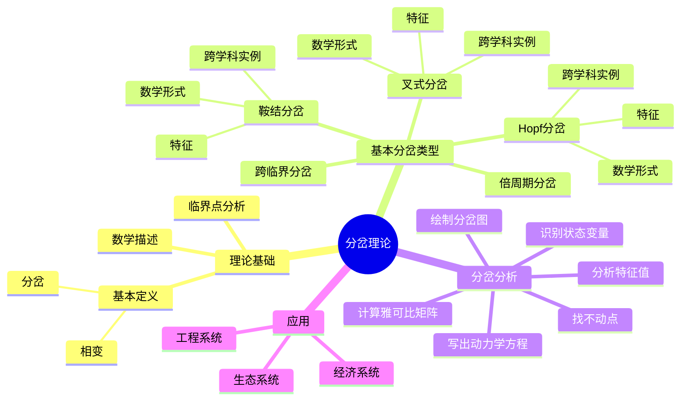
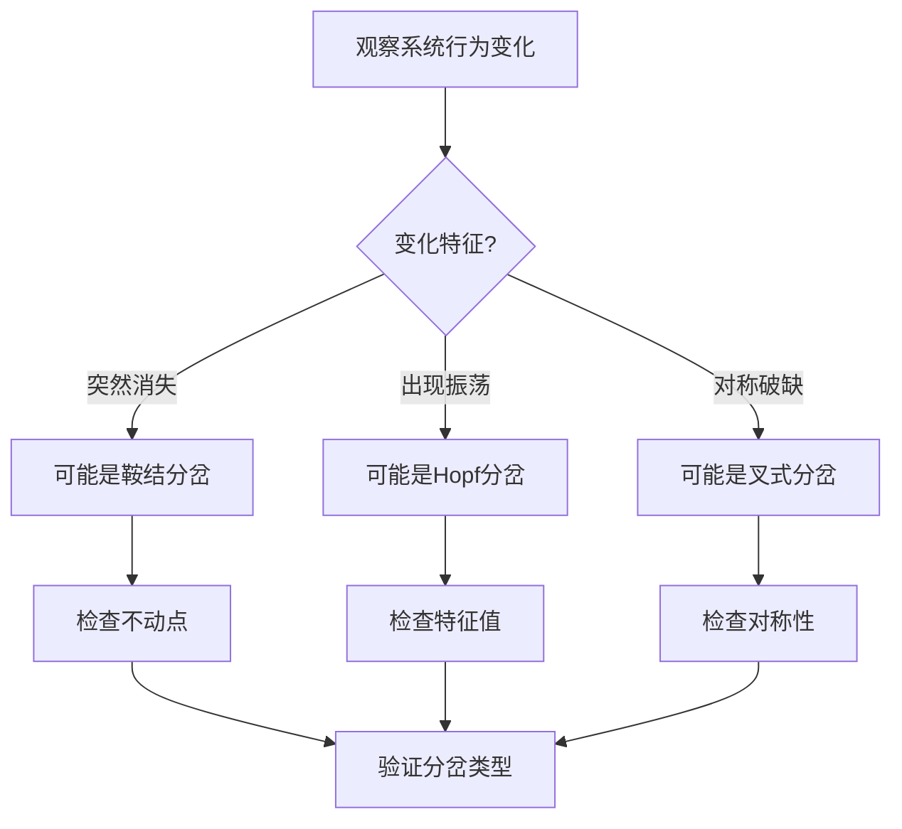
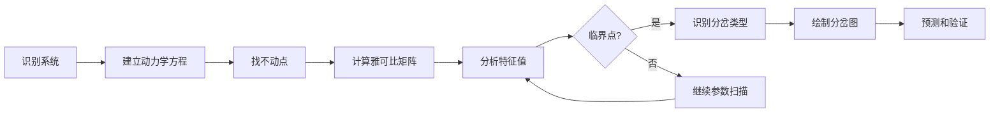
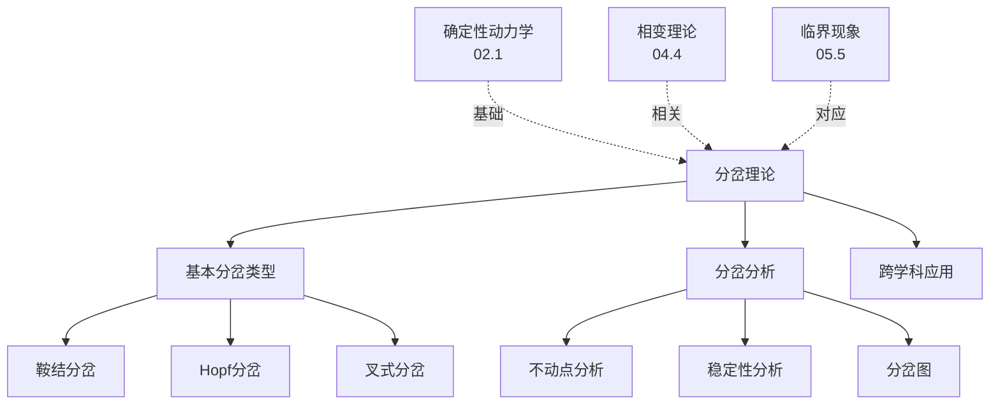
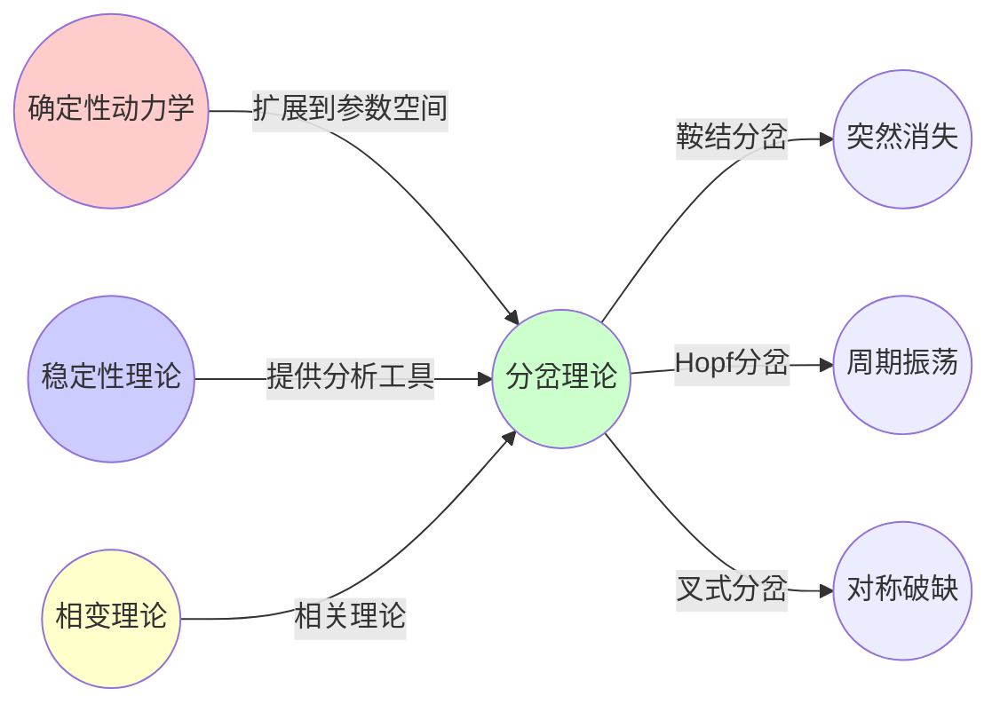
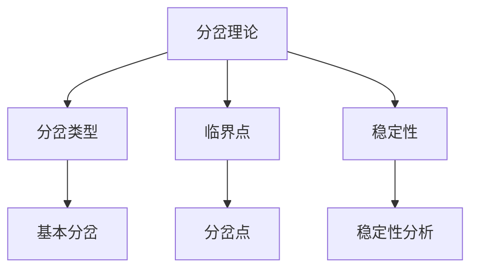

# 02.4 分岔理论与相变

> **来源**: view07.md
> **创建日期**: 2025-01-27
> **最后更新**: 2025-01-27

## 📋 目录

- [02.4 分岔理论与相变](#024-分岔理论与相变)
  - [📋 目录](#-目录)
  - [📋 内容概览](#-内容概览)
  - [🎯 核心理念](#-核心理念)
  - [📚 分岔理论基础](#-分岔理论基础)
    - [基本定义](#基本定义)
    - [分岔的数学描述](#分岔的数学描述)
  - [🔀 基本分岔类型](#-基本分岔类型)
    - [1. 鞍结分岔（Saddle-Node Bifurcation）](#1-鞍结分岔saddle-node-bifurcation)
    - [2. Hopf分岔（Hopf Bifurcation）](#2-hopf分岔hopf-bifurcation)
    - [3. 叉式分岔（Pitchfork Bifurcation）](#3-叉式分岔pitchfork-bifurcation)
  - [📊 跨学科分岔现象库](#-跨学科分岔现象库)
    - [完整映射表](#完整映射表)
  - [🎯 分岔分析步骤](#-分岔分析步骤)
    - [1. 识别状态变量](#1-识别状态变量)
    - [2. 写出动力学方程](#2-写出动力学方程)
    - [3. 找不动点](#3-找不动点)
    - [4. 计算雅可比矩阵](#4-计算雅可比矩阵)
    - [5. 分析特征值](#5-分析特征值)
    - [6. 绘制分岔图](#6-绘制分岔图)
  - [🔬 实际应用案例](#-实际应用案例)
    - [案例1：生态系统中的物种灭绝](#案例1生态系统中的物种灭绝)
    - [案例2：经济系统中的市场崩盘](#案例2经济系统中的市场崩盘)
    - [案例3：工程系统中的结构失稳](#案例3工程系统中的结构失稳)
  - [📊 详细案例研究](#-详细案例研究)
    - [案例研究 1：Hopf分岔在激光器中的应用](#案例研究-1hopf分岔在激光器中的应用)
    - [案例研究 2：鞍结分岔在生态系统物种灭绝中的应用](#案例研究-2鞍结分岔在生态系统物种灭绝中的应用)
    - [案例研究 3：叉式分岔在结构失稳中的应用](#案例研究-3叉式分岔在结构失稳中的应用)
  - [⚠️ 批判性分析与局限性](#️-批判性分析与局限性)
    - [局限性讨论](#局限性讨论)
      - [1. 分岔理论的局部分析限制](#1-分岔理论的局部分析限制)
      - [2. 参数识别的困难](#2-参数识别的困难)
      - [3. 实际系统的复杂性](#3-实际系统的复杂性)
    - [改进方向](#改进方向)
      - [1. 发展全局分岔理论](#1-发展全局分岔理论)
      - [2. 提高实际应用能力](#2-提高实际应用能力)
  - [📊 思维表征体系](#-思维表征体系)
    - [📊 1. 思维导图（增强版）](#-1-思维导图增强版)
      - [1.1 文本格式（基础版）](#11-文本格式基础版)
      - [1.2 Mermaid格式（可视化版）](#12-mermaid格式可视化版)
    - [📊 2. 多维对比矩阵](#-2-多维对比矩阵)
      - [2.1 三种基本分岔类型对比矩阵](#21-三种基本分岔类型对比矩阵)
      - [2.2 分岔与相变对比矩阵](#22-分岔与相变对比矩阵)
      - [2.3 跨学科分岔现象对比矩阵](#23-跨学科分岔现象对比矩阵)
    - [🌲 3. 决策树](#-3-决策树)
      - [3.1 分岔类型识别决策树](#31-分岔类型识别决策树)
    - [🛤️ 4. 决策逻辑路径](#️-4-决策逻辑路径)
      - [4.1 分岔分析路径](#41-分岔分析路径)
    - [🕸️ 5. 概念关系网络](#️-5-概念关系网络)
      - [5.1 分岔理论概念关系网络](#51-分岔理论概念关系网络)
    - [🗺️ 6. 知识图谱](#️-6-知识图谱)
      - [6.1 分岔理论知识图谱](#61-分岔理论知识图谱)
  - [📚 理论体系](#-理论体系)
    - [理论基础](#理论基础)
      - [数学/动力学基础](#数学动力学基础)
      - [历史发展](#历史发展)
    - [理论框架](#理论框架)
      - [核心假设](#核心假设)
      - [基本概念体系](#基本概念体系)
      - [主要定理/结论](#主要定理结论)
      - [适用范围和边界](#适用范围和边界)
    - [当前知识共识](#当前知识共识)
      - [学术界共识](#学术界共识)
      - [主要争议点](#主要争议点)
      - [权威来源](#权威来源)
    - [与其他理论的关系](#与其他理论的关系)
      - [逻辑关系](#逻辑关系)
      - [映射关系](#映射关系)
  - [🔗 关联网络](#-关联网络)
    - [🔗 概念级关联](#-概念级关联)
      - [核心概念映射](#核心概念映射)
    - [🔗 理论级关联](#-理论级关联)
      - [理论基础](#理论基础-1)
    - [🔗 方法级关联](#-方法级关联)
      - [方法应用网络](#方法应用网络)
    - [🔗 应用场景关联](#-应用场景关联)
  - [🛤️ 学习路径](#️-学习路径)
    - [前置知识](#前置知识)
    - [后续学习](#后续学习)
    - [并行学习](#并行学习)
  - [🔗 相关文档](#-相关文档)
  - [📖 扩展阅读](#-扩展阅读)

---

## 📋 内容概览

本文档阐述分岔理论的基本概念、类型及其在跨学科中的应用。分岔理论揭示系统参数变化时定性行为的改变，是理解相变和临界现象的重要工具。

---

## 🎯 核心理念

分岔是系统参数跨越临界值时导致定性行为改变的现象。通过分岔理论，我们可以预测系统的临界点，理解系统的稳定性转变，并设计控制系统。

## 📚 分岔理论基础

### 基本定义

**分岔（Bifurcation）**：当系统参数μ变化时，导致系统定性行为改变的现象。

**相变（Phase Transition）**：系统从一个稳定状态（相）转变到另一个稳定状态的过程。

### 分岔的数学描述

考虑动力学系统：

```latex
\frac{dx}{dt} = f(x, \mu)
```

当参数μ跨越临界值μ_c时，系统行为发生定性改变。

## 🔀 基本分岔类型

### 1. 鞍结分岔（Saddle-Node Bifurcation）

**特征**：两个不动点（一个稳定，一个不稳定）碰撞并消失。

**数学形式**：

```latex
\frac{dx}{dt} = \mu - x^2
```

**跨学科实例**：

| 领域 | 现象 | 参数μ | 临界点 |
|------|------|-------|--------|
| 物理 | 相变 | 温度 | 临界温度 |
| 生态 | 物种灭绝 | 环境压力 | 灭绝阈值 |
| 社会 | 舆论突变 | 社会压力 | 临界压力 |
| 工程 | 结构失稳 | 负载 | 临界负载 |

### 2. Hopf分岔（Hopf Bifurcation）

**特征**：不动点失稳，产生极限环（周期振荡）。

**数学形式**：

```latex
\frac{dx}{dt} = \mu x - y - x(x^2 + y^2)
\frac{dy}{dt} = x + \mu y - y(x^2 + y^2)
```

**跨学科实例**：

| 领域 | 现象 | 参数μ | 临界点 |
|------|------|-------|--------|
| 物理 | 激光阈值 | 泵浦功率 | 阈值功率 |
| 生态 | 捕食周期出现 | 捕食率 | 临界捕食率 |
| 社会 | 经济周期 | 投资率 | 临界投资率 |
| 工程 | 颤振 | 速度 | 临界速度 |

### 3. 叉式分岔（Pitchfork Bifurcation）

**特征**：对称性破缺，一个不动点分裂为三个。

**数学形式**：

```latex
\frac{dx}{dt} = \mu x - x^3
```

**跨学科实例**：

| 领域 | 现象 | 参数μ | 临界点 |
|------|------|-------|--------|
| 物理 | 对称破缺 | 温度 | 临界温度 |
| 生态 | 利他行为演化 | 选择压力 | 临界压力 |
| 社会 | 革命爆发 | 社会矛盾 | 临界矛盾 |
| 工程 | 屈曲 | 负载 | 临界负载 |

## 📊 跨学科分岔现象库

### 完整映射表

| 分岔类型 | 物理学 | 生态学 | 社会学 | 工程学 | 经济学 |
|----------|--------|--------|--------|--------|--------|
| **鞍结分岔** | 相变 | 物种灭绝阈值 | 舆论突变 | 结构失稳 | 市场崩盘 |
| **Hopf分岔** | 激光阈值 | 捕食周期出现 | 经济周期 | 颤振 | 商业周期 |
| **叉式分岔** | 对称破缺 | 利他行为演化 | 革命爆发 | 屈曲 | 市场分化 |
| **跨临界分岔** | 相变 | 竞争共存 | 社会转型 | 失稳 | 经济转型 |
| **倍周期分岔** | 混沌 | 种群波动 | 社会动荡 | 振动失稳 | 市场波动 |

## 🎯 分岔分析步骤

### 1. 识别状态变量

找出系统的关键状态变量 x。

### 2. 写出动力学方程

建立 dx/dt = f(x, μ) 形式的方程。

### 3. 找不动点

求解 f(x*, μ) = 0。

### 4. 计算雅可比矩阵

```latex
J = \left.\frac{\partial f}{\partial x}\right|_{x^*}
```

### 5. 分析特征值

- **Re(λ) < 0**：稳定不动点
- **Re(λ) > 0**：不稳定不动点
- **Re(λ) = 0**：临界点（分岔点）

### 6. 绘制分岔图

以参数μ为横轴，状态变量x为纵轴，绘制分岔图。

## 🔬 实际应用案例

### 案例1：生态系统中的物种灭绝

**系统**：捕食者-猎物模型

**动力学**：

```latex
\frac{dN}{dt} = rN\left(1 - \frac{N}{K}\right) - aNP
\frac{dP}{dt} = baNP - mP
```

**分岔参数**：环境容量 K

**分岔点**：K_c = m/(ba)

**行为**：

- K > K_c：系统有稳定平衡点（共存）
- K < K_c：捕食者灭绝（鞍结分岔）

### 案例2：经济系统中的市场崩盘

**系统**：市场动力学模型

**动力学**：

```latex
\frac{dP}{dt} = \alpha(D - S) - \beta P
\frac{dD}{dt} = \gamma(P - P_0) - \delta D
```

**分岔参数**：市场信心 α

**分岔点**：α_c = δ/γ

**行为**：

- α > α_c：市场稳定
- α < α_c：市场崩盘（鞍结分岔）

### 案例3：工程系统中的结构失稳

**系统**：梁的屈曲

**动力学**：

```latex
\frac{d^2\theta}{dt^2} + \left(\frac{P}{P_c} - 1\right)\theta + \theta^3 = 0
```

**分岔参数**：负载 P

**分岔点**：P_c（临界负载）

**行为**：

- P < P_c：稳定平衡（直梁）
- P > P_c：失稳（叉式分岔，梁弯曲）

## 📊 详细案例研究

### 案例研究 1：Hopf分岔在激光器中的应用

**背景**：激光器在泵浦功率达到阈值时从自发辐射跃迁到受激辐射，展示Hopf分岔。

**形式化分析**：

```text
激光动力学模型:
- 状态: 光子数 n, 反转粒子数 N
- 参数: 泵浦功率 P
- 动力学:
  dn/dt = GNn - κn
  dN/dt = P - N/τ - GNn
- 临界点: P_c = κ/G

分岔分析:
- P < P_c: 稳定不动点（无激光）
- P > P_c: 失稳，产生极限环（激光振荡）
- 分岔类型: 超临界Hopf分岔

实际应用:
- 激光器设计
- 预测激光阈值
- 优化激光性能
```

**关键发现**：

- ✅ Hopf分岔解释了激光器的阈值行为
- ✅ 分岔理论能够预测临界参数
- ✅ 非线性动力学对激光器至关重要

**应用价值**：

- ✅ 激光器设计
- ✅ 光通信系统
- ✅ 激光加工

### 案例研究 2：鞍结分岔在生态系统物种灭绝中的应用

**背景**：当环境压力超过阈值时，物种可能突然灭绝，展示鞍结分岔。

**形式化分析**：

```text
物种灭绝模型:
- 状态: 种群数量 N
- 参数: 环境容量 K
- 动力学: dN/dt = rN(1 - N/K) - aNP
- 临界点: K_c = m/(ba)

分岔分析:
- K > K_c: 稳定平衡（共存）
- K < K_c: 鞍结分岔（物种灭绝）
- 行为: 突然消失（不可逆）

实际应用:
- 物种保护
- 生态系统管理
- 预测灭绝风险
```

**关键发现**：

- ✅ 鞍结分岔解释了突然灭绝现象
- ✅ 临界点附近系统敏感性高
- ✅ 灭绝可能是不可逆的

**应用价值**：

- ✅ 生物多样性保护
- ✅ 生态系统管理
- ✅ 环境政策制定

### 案例研究 3：叉式分岔在结构失稳中的应用

**背景**：梁在负载超过临界值时发生屈曲，展示叉式分岔。

**形式化分析**：

```text
梁的屈曲模型:
- 状态: 偏转角 θ
- 参数: 负载 P
- 动力学: d²θ/dt² + (P/P_c - 1)θ + θ³ = 0
- 临界点: P_c (临界负载)

分岔分析:
- P < P_c: 稳定不动点（直梁）
- P > P_c: 叉式分岔（对称破缺）
- 行为: 梁弯曲（两个对称的弯曲状态）

实际应用:
- 结构设计
- 预测失稳负载
- 安全评估
```

**关键发现**：

- ✅ 叉式分岔解释了结构失稳
- ✅ 对称性破缺是失稳的机制
- ✅ 分岔理论为结构设计提供指导

**应用价值**：

- ✅ 结构工程
- ✅ 建筑安全
- ✅ 机械设计

## ⚠️ 批判性分析与局限性

### 局限性讨论

#### 1. 分岔理论的局部分析限制

**问题**：分岔理论主要关注临界点附近的行为，可能忽略全局行为。

**挑战**：

- ⚠️ 全局分岔难以分析
- ⚠️ 远临界点的行为未知
- ⚠️ 多分岔点相互作用

**应对策略**：

- ✅ 结合数值方法
- ✅ 使用全局分析工具
- ✅ 考虑分岔序列

#### 2. 参数识别的困难

**问题**：实际系统中的关键参数往往难以准确识别。

**挑战**：

- ⚠️ 参数不明确
- ⚠️ 多参数耦合
- ⚠️ 参数时变

**改进方向**：

- ✅ 参数敏感性分析
- ✅ 使用实验数据估计
- ✅ 考虑参数不确定性

#### 3. 实际系统的复杂性

**问题**：实际系统往往比理论模型更复杂。

**挑战**：

- ⚠️ 高阶非线性
- ⚠️ 时滞效应
- ⚠️ 随机扰动

**改进方向**：

- ✅ 考虑更多因素
- ✅ 使用更复杂模型
- ✅ 结合实验验证

### 改进方向

#### 1. 发展全局分岔理论

**目标**：理解系统的全局行为。

**方法**：

- 研究全局分岔
- 开发数值工具
- 分析分岔序列

#### 2. 提高实际应用能力

**目标**：使分岔理论更容易应用于实际问题。

**方法**：

- 开发实用工具
- 提供应用指南
- 建立案例库

## 📊 思维表征体系

### 📊 1. 思维导图（增强版）

#### 1.1 文本格式（基础版）

```text
分岔理论与相变
├── 分岔理论基础
│   ├── 基本定义
│   │   ├── 分岔
│   │   └── 相变
│   ├── 数学描述
│   │   └── dx/dt = f(x, μ)
│   └── 临界点分析
├── 基本分岔类型
│   ├── 鞍结分岔
│   │   ├── 特征: 两个不动点碰撞消失
│   │   ├── 数学形式
│   │   └── 跨学科实例
│   ├── Hopf分岔
│   │   ├── 特征: 产生极限环
│   │   ├── 数学形式
│   │   └── 跨学科实例
│   ├── 叉式分岔
│   │   ├── 特征: 对称性破缺
│   │   ├── 数学形式
│   │   └── 跨学科实例
│   ├── 跨临界分岔
│   └── 倍周期分岔
├── 分岔分析步骤
│   ├── 识别状态变量
│   ├── 写出动力学方程
│   ├── 找不动点
│   ├── 计算雅可比矩阵
│   ├── 分析特征值
│   └── 绘制分岔图
└── 应用案例
    ├── 生态系统物种灭绝
    ├── 经济系统市场崩盘
    └── 工程系统结构失稳
```

#### 1.2 Mermaid格式（可视化版）



### 📊 2. 多维对比矩阵

#### 2.1 三种基本分岔类型对比矩阵

| 维度 | 鞍结分岔 | Hopf分岔 | 叉式分岔 | 综合评价 | 推荐场景 |
|------|---------|---------|---------|----------|----------|
| **特征** | 两个不动点碰撞消失 | 产生极限环 | 对称性破缺 | 特征不同 | 根据现象选择 |
| **数学形式** | dx/dt = μ - x² | 复数特征值 | dx/dt = μx - x³ | 形式不同 | 根据方程选择 |
| **稳定性** | 消失前稳定 | 稳定→周期振荡 | 稳定→多个分支 | 行为不同 | 根据稳定性需求 |
| **可逆性** | 不可逆 | 可逆 | 可逆 | 鞍结不可逆 | 需要可逆时用Hopf或叉式 |
| **典型应用** | 物种灭绝、崩盘 | 激光、振荡器 | 屈曲、对称破缺 | 应用不同 | 根据具体问题 |
| **分析难度** | 低 | 中 | 中 | 鞍结最简单 | 简单问题用鞍结 |
| **预测能力** | 高 | 中 | 高 | 都能预测临界点 | 都有预测能力 |

#### 2.2 分岔与相变对比矩阵

| 维度 | 分岔 | 相变 | 关系类型 | 说明 |
|------|------|------|---------|------|
| **定义** | 参数变化导致定性行为改变 | 系统从一个相到另一个相 | 相似 | 分岔是相变的动力学描述 |
| **数学工具** | 分岔理论 | 统计物理、相变理论 | 不同 | 工具不同但相关 |
| **应用领域** | 动力学系统 | 统计物理系统 | 不同 | 应用领域不同 |
| **临界点** | 分岔点 | 临界温度等 | 对应 | 都涉及临界点 |
| **预测能力** | 高 | 高 | 相似 | 都能预测临界点 |

#### 2.3 跨学科分岔现象对比矩阵

| 维度 | 物理学 | 生态学 | 社会学 | 工程学 | 经济学 | 跨学科性 |
|------|--------|--------|--------|--------|--------|----------|
| **鞍结分岔** | 相变 | 物种灭绝 | 舆论突变 | 结构失稳 | 市场崩盘 | 高 |
| **Hopf分岔** | 激光阈值 | 捕食周期 | 经济周期 | 颤振 | 商业周期 | 高 |
| **叉式分岔** | 对称破缺 | 利他演化 | 革命爆发 | 屈曲 | 市场分化 | 高 |
| **应用广度** | 广 | 广 | 中 | 广 | 广 | 都很广泛 |

### 🌲 3. 决策树

#### 3.1 分岔类型识别决策树



### 🛤️ 4. 决策逻辑路径

#### 4.1 分岔分析路径



### 🕸️ 5. 概念关系网络

#### 5.1 分岔理论概念关系网络



### 🗺️ 6. 知识图谱

#### 6.1 分岔理论知识图谱



## 📚 理论体系

### 理论基础

#### 数学/动力学基础

分岔理论的理论基础：

**1. 动力学系统基础**：

- ODE理论
- 不动点理论
- 稳定性理论

**2. 线性代数基础**：

- 雅可比矩阵
- 特征值分析
- 矩阵对角化

**3. 拓扑学基础**：

- 拓扑等价性
- 结构稳定性
- 相空间分析

#### 历史发展

**关键时间节点**：

- **1885年**：Poincaré的开创性工作
  - 非线性动力学理论
  - 相空间方法

- **1930年代**：Andronov的稳定性理论
  - 结构稳定性概念
  - 分岔的数学理论

- **1960-1970年代**：分岔理论的系统化
  - Ruelle-Takens的混沌理论
  - Thom的突变理论

- **1970-1980年代**：分岔理论的应用扩展
  - 应用数学中的分岔分析
  - 工程中的应用

- **1980年代至今**：计算分岔理论
  - 数值分岔分析
  - 软件工具开发

### 理论框架

#### 核心假设

**假设1：参数的连续性**

- **内容**：系统参数连续变化
- **适用范围**：参数连续的系统
- **限制条件**：离散参数需要扩展

**假设2：局部分岔**

- **内容**：分岔发生在不动点附近
- **适用范围**：局部分岔
- **限制条件**：全局分岔需要扩展

**假设3：光滑性**

- **内容**：动力学函数是光滑的
- **适用范围**：光滑系统
- **限制条件**：非光滑系统需要扩展

#### 基本概念体系



#### 主要定理/结论

**定理1：中心流形定理**

- **内容**：在分岔点附近，系统行为由中心流形决定
- **证据**：微分拓扑理论
- **应用**：简化分岔分析

**定理2：分岔的规范形**

- **内容**：每种分岔类型都有标准数学形式
- **证据**：规范形理论
- **应用**：识别分岔类型

**结论3：分岔的普遍性**

- **内容**：分岔现象在多个领域普遍存在
- **证据**：跨学科应用案例
- **应用**：跨学科研究

#### 适用范围和边界

**适用范围**：

- 具有参数依赖的动力学系统
- 存在不动点的系统
- 参数变化导致定性行为改变的系统

**边界条件**：

- 需要明确的参数
- 需要已知动力学方程
- 需要光滑的系统

**不适用场景**：

- 无参数依赖的系统
- 完全随机系统
- 非光滑系统（需要扩展）

### 当前知识共识

#### 学术界共识

**广泛接受的共识**：

1. **分岔的普遍性**
   - **共识**：分岔现象在多个领域普遍存在
   - **支持证据**：大量跨学科应用案例
   - **来源**：非线性动力学、应用数学

2. **分岔类型的分类**
   - **共识**：基本分岔类型已经明确分类
   - **支持证据**：规范形理论
   - **来源**：分岔理论、微分拓扑

3. **分岔分析的实用性**
   - **共识**：分岔分析能够预测临界点
   - **支持证据**：成功应用案例
   - **来源**：工程应用、系统生物学

#### 主要争议点

1. **全局分岔的重要性**
   - **观点A**：全局分岔同样重要
   - **观点B**：局部分岔已经足够
   - **当前状态**：多数认为两者都重要

2. **分岔与相变的关系**
   - **观点A**：分岔是相变的动力学描述
   - **观点B**：分岔和相变是不同的概念
   - **当前状态**：多数认为密切相关

#### 权威来源

**经典文献**：

- 《Nonlinear Dynamics and Chaos》- Steven Strogatz
- 《Elements of Applied Bifurcation Theory》- Yuri Kuznetsov
- 《Catastrophe Theory》- René Thom

**权威机构/专家**：

- **非线性动力学学会**
- **应用数学学会**
- **SIAM非线性动力学组**

**最新发展**：

- **2020-2024**：计算分岔理论、高维分岔、网络上的分岔
- **前沿方向**：分岔控制、分岔延迟、分岔预测

### 与其他理论的关系

#### 逻辑关系

**理论基础**：

- **确定性动力学**（[02.1_经典确定性动力学.md](02.1_经典确定性动力学.md)） → 分岔理论
  - 关系类型：扩展到参数空间
  - 关键映射：ODE → 参数化ODE

**理论应用**：

- 分岔理论 → 相变理论（[04.4_涌现性理论.md](../04_复杂系统与网络理论/04.4_涌现性理论.md)）
  - 应用方式：分岔描述相变
  - 应用效果：理解相变机制

#### 映射关系

| 本理论概念 | 映射理论 | 映射概念 | 映射类型 | 映射说明 |
|-----------|---------|---------|---------|----------|
| **分岔点** | 02.1_经典确定性动力学.md | 临界点 | 扩展 | 分岔点是参数空间的临界点 |
| **相变** | 04.4_涌现性理论.md | 涌现现象 | 对应 | 分岔是相变的动力学描述 |
| **稳定性分析** | 02.1_经典确定性动力学.md | 稳定性理论 | 应用 | 分岔理论使用稳定性分析 |
| **临界点** | 04.3_自组织临界.md | 临界状态 | 对应 | 分岔点是临界状态 |

## 🔗 关联网络

### 🔗 概念级关联

#### 核心概念映射

| 本文档概念 | 关联文档 | 关联概念 | 关系类型 | 映射说明 |
|-----------|---------|---------|---------|----------|
| **分岔点** | 02.1_经典确定性动力学.md | 临界点 | 扩展 | 分岔点是参数空间的临界点 |
| **相变** | 04.4_涌现性理论.md | 涌现现象 | 对应 | 分岔是相变的动力学描述 |
| **稳定性分析** | 02.1_经典确定性动力学.md | 稳定性理论 | 应用 | 分岔理论使用稳定性分析 |
| **临界点** | 04.3_自组织临界.md | 临界状态 | 对应 | 分岔点是临界状态 |
| **Hopf分岔** | 02.1_经典确定性动力学.md | 极限环 | 对应 | Hopf分岔产生极限环 |
| **鞍结分岔** | 02.1_经典确定性动力学.md | 不动点消失 | 对应 | 鞍结分岔是不动点的消失 |
| **叉式分岔** | 04.4_涌现性理论.md | 对称破缺 | 对应 | 叉式分岔是对称性破缺 |

### 🔗 理论级关联

#### 理论基础

- **本理论基于**：
  - [02.1_经典确定性动力学.md](02.1_经典确定性动力学.md) ⭐⭐⭐ - 动力学基础

- **本理论应用于**：
  - [04.4_涌现性理论.md](../04_复杂系统与网络理论/04.4_涌现性理论.md) ⭐⭐⭐ - 相变理论
  - [04.3_自组织临界.md](../04_复杂系统与网络理论/04.3_自组织临界.md) ⭐⭐ - 临界现象
  - [02.5_跨学科动力学映射.md](02.5_跨学科动力学映射.md) ⭐⭐ - 跨学科应用

### 🔗 方法级关联

#### 方法应用网络

| 本文档方法 | 应用文档 | 应用场景 | 应用效果 |
|-----------|---------|---------|---------|
| **分岔分析** | 04.4_涌现性理论.md | 相变分析 | 成功 |
| **临界点预测** | 04.3_自组织临界.md | 临界状态识别 | 成功 |
| **稳定性分析** | 02.1_经典确定性动力学.md | 系统稳定性 | 成功 |

### 🔗 应用场景关联

**场景**：系统相变分析

| 视角 | 关联文档 | 核心理论 | 关注点 |
|------|---------|---------|--------|
| **动力学** | 本文档 | 分岔理论 | 分岔点 |
| **统计物理** | 04.4_涌现性理论.md | 相变理论 | 相变机制 |
| **临界现象** | 04.3_自组织临界.md | 自组织临界 | 临界状态 |

## 🛤️ 学习路径

### 前置知识

**必须先学习**：

- [02.1_经典确定性动力学.md](02.1_经典确定性动力学.md) ⭐⭐⭐ - 动力学基础

**建议先了解**：

- 基础线性代数（矩阵、特征值）
- 基础微积分（微分方程）

### 后续学习

**建议接下来学习**（按顺序）：

1. [02.5_跨学科动力学映射.md](02.5_跨学科动力学映射.md) ⭐⭐⭐ - 分岔的跨学科应用
2. [04.4_涌现性理论.md](../04_复杂系统与网络理论/04.4_涌现性理论.md) ⭐⭐ - 相变理论
3. [04.3_自组织临界.md](../04_复杂系统与网络理论/04.3_自组织临界.md) ⭐⭐ - 临界现象

### 并行学习

**可以同时学习**：

- [02.6_高级抽象.md](02.6_高级抽象.md) - 高级动力学方法
- [05.5_计算与物理.md](../05_信息论与计算理论/05.5_计算与物理.md) - 相变物理

## 🔗 相关文档

- [02.1_经典确定性动力学.md](02.1_经典确定性动力学.md)
- [02.2_随机动力学.md](02.2_随机动力学.md)
- [02.3_网络动力学.md](02.3_网络动力学.md)
- [02.5_跨学科动力学映射.md](02.5_跨学科动力学映射.md)

## 📖 扩展阅读

- 《Nonlinear Dynamics and Chaos》- Steven Strogatz
- Wikipedia: [Bifurcation Theory](https://en.wikipedia.org/wiki/Bifurcation_theory)
- Wikipedia: [Phase Transition](https://en.wikipedia.org/wiki/Phase_transition)
