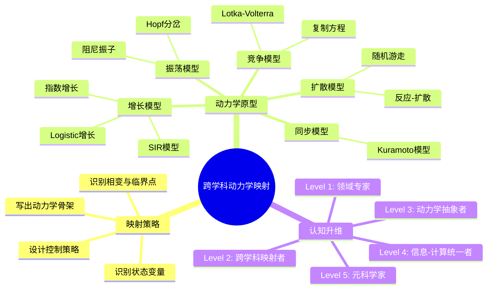
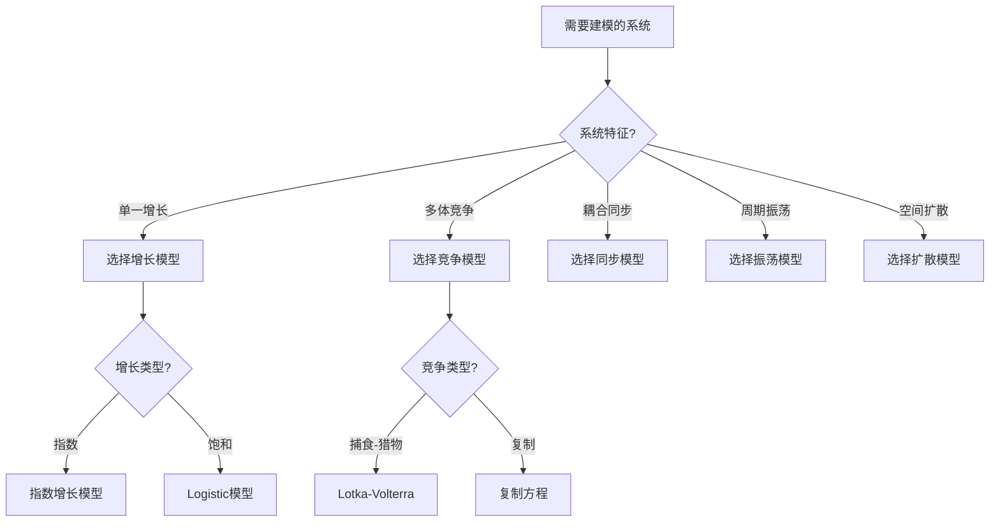
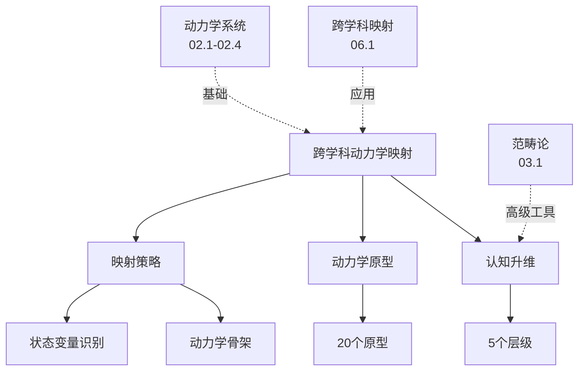
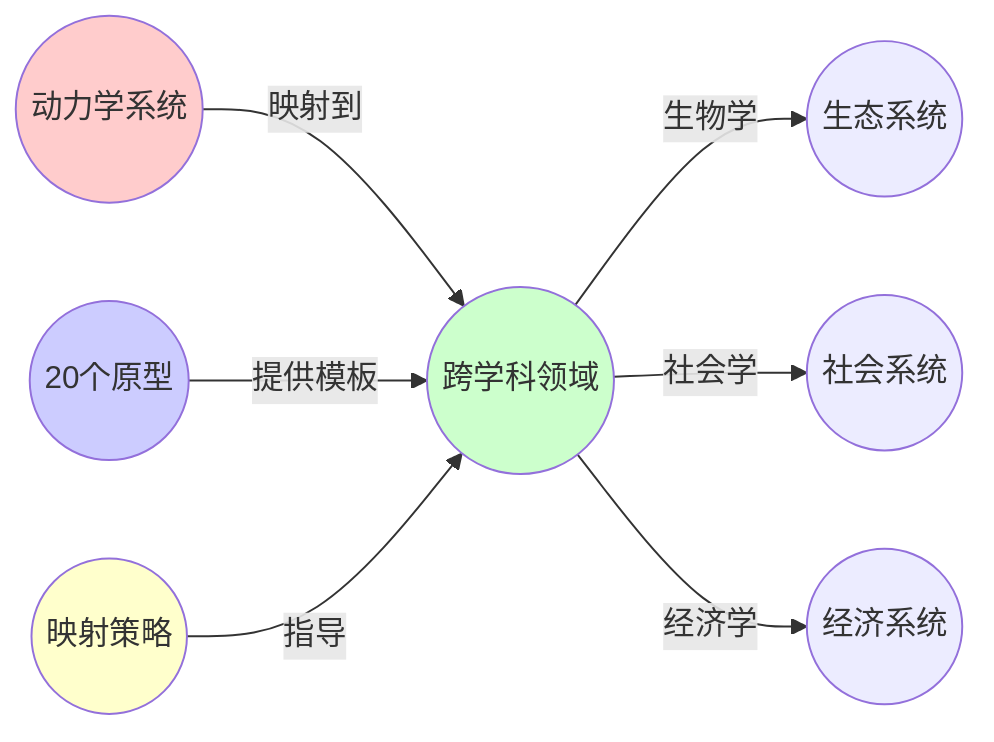
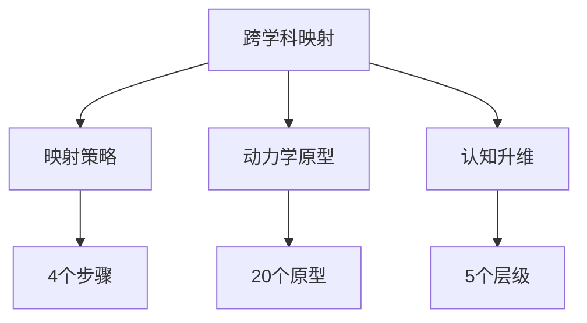

# 02.5 跨学科动力学映射

> **来源**: view07.md
> **创建日期**: 2025-01-27
> **最后更新**: 2025-01-27

## 📋 目录

- [02.5 跨学科动力学映射](#025-跨学科动力学映射)
  - [📋 目录](#-目录)
  - [📋 内容概览](#-内容概览)
  - [🎯 核心理念](#-核心理念)
  - [🔄 映射策略](#-映射策略)
    - [步骤1：识别状态变量](#步骤1识别状态变量)
    - [步骤2：写出动力学骨架](#步骤2写出动力学骨架)
    - [步骤3：识别相变与临界点](#步骤3识别相变与临界点)
    - [步骤4：设计控制策略](#步骤4设计控制策略)
  - [📊 20个动力学原型](#-20个动力学原型)
    - [1. 指数增长/衰减](#1-指数增长衰减)
    - [2. Logistic/Saturation](#2-logisticsaturation)
    - [3. SIR模型](#3-sir模型)
    - [4. Lotka-Volterra](#4-lotka-volterra)
    - [5. Kuramoto模型](#5-kuramoto模型)
    - [6. 流行病阈值](#6-流行病阈值)
    - [7. 双稳态](#7-双稳态)
    - [8. Hopf分岔](#8-hopf分岔)
    - [9. 阻尼振子](#9-阻尼振子)
    - [10. 随机游走](#10-随机游走)
    - [11. 主方程](#11-主方程)
    - [12. 贝叶斯更新](#12-贝叶斯更新)
    - [13. 复制方程](#13-复制方程)
    - [14. 反应-扩散](#14-反应-扩散)
    - [15. 渗流模型](#15-渗流模型)
    - [16. 自组织临界](#16-自组织临界)
    - [17. 信息瓶颈](#17-信息瓶颈)
    - [18. 梯度流](#18-梯度流)
    - [19. 重整化群](#19-重整化群)
    - [20. 范畴极限](#20-范畴极限)
  - [🎯 认知升维路径](#-认知升维路径)
    - [Level 1：领域专家](#level-1领域专家)
    - [Level 2：跨学科映射者](#level-2跨学科映射者)
    - [Level 3：动力学抽象者](#level-3动力学抽象者)
    - [Level 4：信息-计算统一者](#level-4信息-计算统一者)
    - [Level 5：元科学家](#level-5元科学家)
  - [📊 详细案例研究](#-详细案例研究)
    - [案例研究 1：SIR模型在跨学科映射中的应用](#案例研究-1sir模型在跨学科映射中的应用)
    - [案例研究 2：Logistic增长模型的跨领域应用](#案例研究-2logistic增长模型的跨领域应用)
    - [案例研究 3：Kuramoto同步模型的多领域映射](#案例研究-3kuramoto同步模型的多领域映射)
  - [⚠️ 批判性分析与局限性](#️-批判性分析与局限性)
    - [局限性讨论](#局限性讨论)
      - [1. 映射的有效性验证](#1-映射的有效性验证)
      - [2. 原型选择的合理性](#2-原型选择的合理性)
      - [3. 认知升维的实际困难](#3-认知升维的实际困难)
    - [改进方向](#改进方向)
      - [1. 建立映射验证框架](#1-建立映射验证框架)
      - [2. 提高映射的可操作性](#2-提高映射的可操作性)
  - [📊 思维表征体系](#-思维表征体系)
    - [📊 1. 思维导图（增强版）](#-1-思维导图增强版)
      - [1.1 文本格式（基础版）](#11-文本格式基础版)
      - [1.2 Mermaid格式（可视化版）](#12-mermaid格式可视化版)
    - [📊 2. 多维对比矩阵](#-2-多维对比矩阵)
      - [2.1 动力学原型分类对比矩阵](#21-动力学原型分类对比矩阵)
      - [2.2 映射策略步骤对比矩阵](#22-映射策略步骤对比矩阵)
      - [2.3 认知升维层级对比矩阵](#23-认知升维层级对比矩阵)
    - [🌲 3. 决策树](#-3-决策树)
      - [3.1 动力学原型选择决策树](#31-动力学原型选择决策树)
    - [🛤️ 4. 决策逻辑路径](#️-4-决策逻辑路径)
      - [4.1 跨学科动力学映射路径](#41-跨学科动力学映射路径)
    - [🕸️ 5. 概念关系网络](#️-5-概念关系网络)
      - [5.1 跨学科动力学映射概念关系网络](#51-跨学科动力学映射概念关系网络)
    - [🗺️ 6. 知识图谱](#️-6-知识图谱)
      - [6.1 跨学科动力学映射知识图谱](#61-跨学科动力学映射知识图谱)
  - [📚 理论体系](#-理论体系)
    - [理论基础](#理论基础)
      - [数学/方法论基础](#数学方法论基础)
      - [历史发展](#历史发展)
    - [理论框架](#理论框架)
      - [核心假设](#核心假设)
      - [基本概念体系](#基本概念体系)
      - [主要定理/结论](#主要定理结论)
      - [适用范围和边界](#适用范围和边界)
    - [当前知识共识](#当前知识共识)
      - [学术界共识](#学术界共识)
      - [主要争议点](#主要争议点)
      - [权威来源](#权威来源)
    - [与其他理论的关系](#与其他理论的关系)
      - [逻辑关系](#逻辑关系)
      - [映射关系](#映射关系)
  - [🔗 关联网络](#-关联网络)
    - [🔗 概念级关联](#-概念级关联)
      - [核心概念映射](#核心概念映射)
    - [🔗 理论级关联](#-理论级关联)
      - [理论基础](#理论基础-1)
    - [🔗 方法级关联](#-方法级关联)
      - [方法应用网络](#方法应用网络)
    - [🔗 应用场景关联](#-应用场景关联)
  - [🛤️ 学习路径](#️-学习路径)
    - [前置知识](#前置知识)
    - [后续学习](#后续学习)
    - [并行学习](#并行学习)
  - [🔗 相关文档](#-相关文档)
  - [📖 扩展阅读](#-扩展阅读)

---

## 📋 内容概览

本文档阐述如何将动力学系统理论映射到不同学科领域，揭示跨学科的统一性。提供系统化的映射方法和20个动力学原型，帮助理解不同领域的共同规律。

---

## 🎯 核心理念

跨学科动力学映射通过识别不同领域系统的共同动力学结构，实现知识的迁移和应用。相同的动力学原型可以在完全不同的领域中出现，这为跨学科学习和创新提供了强大的工具。

## 🔄 映射策略

### 步骤1：识别状态变量

**模板**：x = [关键变量₁, 关键变量₂, ...]

**实例**：

| 领域 | 状态变量 | 维度 |
|------|----------|------|
| 创业公司 | [用户数, 现金流, 团队规模, 技术债务, 品牌认知度] | 5维 |
| 生态系统 | [捕食者数, 猎物数, 资源量] | 3维 |
| 生理系统 | [健康指标₁, 健康指标₂, ...] | 多维 |
| 机器学习 | [损失, 准确率, 模型复杂度] | 3维 |

### 步骤2：写出动力学骨架

**模板**：dx/dt = f(x) + g(x)·u(t) + ξ(t)

- **f**：内部动力学（自生长/衰减）
- **g·u**：控制输入（外部干预）
- **ξ**：随机扰动（环境噪声）

**跨领域对应**：

| 术语 | 创业 | 生态 | 生理 | ML |
|------|------|------|------|----|
| **x** | 公司指标 | 种群数量 | 健康指标 | 损失、准确率 |
| f | 产品-市场匹配 | 出生-死亡 | 代谢 | 梯度下降 |
| g·u | 融资、招聘 | 人工引入/捕杀 | 药物、手术 | 学习率调整 |
| ξ | 市场噪声 | 环境随机性 | 基因突变 | 数据批次噪声 |

### 步骤3：识别相变与临界点

**模板**：找参数μ使雅可比矩阵J特征值Re(λ)=0

**创业临界点**：

- μ = 产品-市场匹配度
- 分岔类型：超临界Hopf → 可持续增长振荡
- 危险：亚临界叉式 → 突然崩溃（资金链断裂）

### 步骤4：设计控制策略

**模板**：李雅普诺夫函数V(x) + 反馈控制u = -K·∂V/∂x

**创业控制**：

- V = 估值 + 用户生命周期价值 - 债务
- 控制：当技术债务∂V/∂(债务)为负时，立即融资或裁员

## 📊 20个动力学原型

### 1. 指数增长/衰减

**方程**：dx/dt = rx

**应用**：

- 人口增长（早期阶段）
- 放射性衰变
- 病毒传播（早期）
- 技术扩散（早期）

### 2. Logistic/Saturation

**方程**：dx/dt = rx(1 - x/K)

**应用**：

- 种群增长（资源限制）
- 市场饱和
- 技能学习（能力上限）
- 产品采用（市场容量）

### 3. SIR模型

**方程**：

```latex
\frac{dS}{dt} = -\beta SI
\frac{dI}{dt} = \beta SI - \gamma I
\frac{dR}{dt} = \gamma I
```

**应用**：

- 传染病传播
- 谣言传播
- 产品扩散
- 计算机病毒

### 4. Lotka-Volterra

**方程**：

```latex
\frac{dx}{dt} = \alpha x - \beta xy
\frac{dy}{dt} = \delta xy - \gamma y
```

**应用**：

- 捕食者-猎物系统
- 竞争关系
- 市场动态
- 技术竞争

### 5. Kuramoto模型

**方程**：dθᵢ/dt = ωᵢ + (K/N)Σsin(θⱼ - θᵢ)

**应用**：

- 同步现象
- 神经网络同步
- 社会共识形成
- 市场同步

### 6. 流行病阈值

**临界条件**：R₀ = β/γ > 1

**应用**：

- 传染病爆发
- 信息病毒传播
- 金融恐慌
- 社会运动

### 7. 双稳态

**方程**：dx/dt = x - x³ + μ

**应用**：

- 基因开关
- 市场双寡头
- 社会极化
- 气候系统

### 8. Hopf分岔

**特征**：产生极限环（周期振荡）

**应用**：

- 生物节律
- 经济周期
- 化学反应振荡
- 激光阈值

### 9. 阻尼振子

**方程**：d²x/dt² + 2ζω₀dx/dt + ω₀²x = 0

**应用**：

- 机械振动
- 电路振荡
- 生态系统恢复
- 市场波动

### 10. 随机游走

**方程**：x_{n+1} = x_n + ξ_n

**应用**：

- 分子扩散
- 价格波动
- 信息传播
- 随机搜索

### 11. 主方程

**方程**：dP/dt = Σ[W_{x←x'}P(x') - W_{x'←x}P(x)]

**应用**：

- 统计物理
- 生物进化
- 机器学习
- 社会网络

### 12. 贝叶斯更新

**方程**：P(θ|D) ∝ P(D|θ)P(θ)

**应用**：

- 统计推断
- 机器学习
- 认知更新
- 决策理论

### 13. 复制方程

**方程**：dxᵢ/dt = xᵢ(fᵢ - ⟨f⟩)

**应用**：

- 演化博弈
- 策略选择
- 文化演化
- 技术选择

### 14. 反应-扩散

**方程**：∂u/∂t = D∇²u + f(u)

**应用**：

- 模式形成
- 化学波
- 生物形态
- 城市增长

### 15. 渗流模型

**临界点**：p_c（连接概率阈值）

**应用**：

- 网络鲁棒性
- 疾病传播
- 信息传播
- 金融传染

### 16. 自组织临界

**特征**：幂律分布

**应用**：

- 地震
- 沙堆模型
- 金融市场
- 生物进化

### 17. 信息瓶颈

**原理**：最小化I(X;Z)同时最大化I(Z;Y)

**应用**：

- 机器学习
- 认知压缩
- 通信理论
- 数据压缩

### 18. 梯度流

**方程**：dx/dt = -∇V(x)

**应用**：

- 优化算法
- 物理系统
- 神经网络训练
- 系统演化

### 19. 重整化群

**原理**：多尺度耦合

**应用**：

- 相变理论
- 临界现象
- 复杂系统
- 多尺度建模

### 20. 范畴极限

**原理**：最优抽象

**应用**：

- 数学结构
- 程序设计
- 数据库设计
- 系统设计

## 🎯 认知升维路径

### Level 1：领域专家

- 知道特定领域的模型（如流行病SIR）

### Level 2：跨学科映射者

- 识别SIR ↔ 谣言传播 ↔ 产品扩散的同构性
- **工具**：类比思维

### Level 3：动力学抽象者

- 写出通用dx/dt = f(x) + ...结构
- **工具**：相空间分析、分岔理论

### Level 4：信息-计算统一者

- 理解动力学 = 计算 = 信息更新
- **工具**：范畴论、贝叶斯推断

### Level 5：元科学家

- 认识到所有模型都是**认知压缩算法**
- **工具**：科学学、模型选择理论

## 📊 详细案例研究

### 案例研究 1：SIR模型在跨学科映射中的应用

**背景**：SIR模型最初用于传染病传播，后来发现可以映射到多个领域。

**形式化分析**：

```text
SIR模型统一框架:
- 状态: S(易感), I(感染), R(恢复)
- 动力学:
  dS/dt = -βSI
  dI/dt = βSI - γI
  dR/dt = γI

跨领域映射:
1. 传染病传播
   - S: 易感人群
   - I: 感染者
   - R: 康复者

2. 谣言传播
   - S: 未听说者
   - I: 传播者
   - R: 知道但不传播者

3. 产品扩散
   - S: 潜在用户
   - I: 活跃用户
   - R: 停止使用用户

4. 计算机病毒
   - S: 未感染计算机
   - I: 感染计算机
   - R: 修复计算机

共同特征:
- 临界阈值: R_0 = β/γ > 1
- 传播动力学: 相同
- 预测能力: 一致
```

**关键发现**：

- ✅ 相同的动力学模型适用于多个领域
- ✅ 临界阈值概念具有普遍性
- ✅ 跨领域映射实现知识迁移

**应用价值**：

- ✅ 跨学科学习
- ✅ 模型复用
- ✅ 创新应用

### 案例研究 2：Logistic增长模型的跨领域应用

**背景**：Logistic增长模型在多个领域展现出一致的数学结构。

**形式化分析**：

```text
Logistic模型:
- 方程: dx/dt = rx(1 - x/K)
- 参数: r (增长率), K (容量)

跨领域应用:
1. 种群增长
   - x: 种群数量
   - r: 繁殖率
   - K: 环境容量

2. 市场饱和
   - x: 市场份额
   - r: 市场增长率
   - K: 市场容量

3. 技能学习
   - x: 技能水平
   - r: 学习速率
   - K: 能力上限

4. 产品采用
   - x: 采用者数量
   - r: 采用速率
   - K: 市场容量

共同模式:
- 指数增长阶段
- 饱和阶段
- S型曲线
```

**关键发现**：

- ✅ Logistic模型具有普遍适用性
- ✅ 容量限制是共同特征
- ✅ S型增长模式广泛存在

**应用价值**：

- ✅ 预测增长趋势
- ✅ 理解饱和机制
- ✅ 设计增长策略

### 案例研究 3：Kuramoto同步模型的多领域映射

**背景**：Kuramoto模型描述了同步现象，在多个领域都有应用。

**形式化分析**：

```text
Kuramoto模型:
- 状态: 相位 θ_i(t)
- 动力学: dθ_i/dt = ω_i + (K/N)Σsin(θ_j - θ_i)

跨领域映射:
1. 萤火虫同步
   - θ_i: 闪光相位
   - ω_i: 固有频率
   - K: 光耦合强度

2. 电网同步
   - θ_i: 发电机相位
   - ω_i: 固有频率
   - K: 电网连接强度

3. 神经元同步
   - θ_i: 放电相位
   - ω_i: 固有频率
   - K: 突触连接强度

4. 社会共识形成
   - θ_i: 观点相位
   - ω_i: 个人倾向
   - K: 社会影响力

共同特征:
- 同步阈值: K_c
- 相变行为: 从无序到有序
- 集体行为: 涌现同步
```

**关键发现**：

- ✅ 同步现象具有普遍性
- ✅ 相同的数学模型描述不同领域
- ✅ 临界耦合强度是关键参数

**应用价值**：

- ✅ 理解集体行为
- ✅ 设计同步系统
- ✅ 预测相变

## ⚠️ 批判性分析与局限性

### 局限性讨论

#### 1. 映射的有效性验证

**问题**：跨领域映射的有效性需要严格验证。

**挑战**：

- ⚠️ 形式相似性不等于机制相似性
- ⚠️ 边界条件可能不同
- ⚠️ 尺度差异影响应用

**应对策略**：

- ✅ 进行机制对齐检验
- ✅ 分析边界条件
- ✅ 考虑尺度效应

#### 2. 原型选择的合理性

**问题**：如何选择最合适的动力学原型存在挑战。

**挑战**：

- ⚠️ 多种原型可能适用
- ⚠️ 原型的简化假设
- ⚠️ 原型选择的客观性

**改进方向**：

- ✅ 建立选择标准
- ✅ 比较不同原型
- ✅ 验证原型假设

#### 3. 认知升维的实际困难

**问题**：从领域专家到元科学家的转变并不容易。

**挑战**：

- ⚠️ 需要深厚的数学基础
- ⚠️ 抽象思维能力要求高
- ⚠️ 跨领域知识整合困难

**改进方向**：

- ✅ 提供学习路径
- ✅ 开发训练方法
- ✅ 建立支持系统

### 改进方向

#### 1. 建立映射验证框架

**目标**：系统化验证跨领域映射的有效性。

**方法**：

- 开发验证方法
- 建立评估标准
- 提供验证工具

#### 2. 提高映射的可操作性

**目标**：使映射过程更容易实施。

**方法**：

- 开发映射工具
- 提供详细指南
- 建立案例库

## 📊 思维表征体系

### 📊 1. 思维导图（增强版）

#### 1.1 文本格式（基础版）

```text
跨学科动力学映射
├── 映射策略
│   ├── 步骤1: 识别状态变量
│   ├── 步骤2: 写出动力学骨架
│   ├── 步骤3: 识别相变与临界点
│   └── 步骤4: 设计控制策略
├── 20个动力学原型
│   ├── 增长模型
│   │   ├── 指数增长
│   │   ├── Logistic增长
│   │   └── SIR模型
│   ├── 竞争模型
│   │   ├── Lotka-Volterra
│   │   └── 复制方程
│   ├── 同步模型
│   │   └── Kuramoto模型
│   ├── 振荡模型
│   │   ├── Hopf分岔
│   │   └── 阻尼振子
│   ├── 扩散模型
│   │   ├── 随机游走
│   │   └── 反应-扩散
│   └── 其他原型
│       ├── 主方程
│       ├── 贝叶斯更新
│       └── 梯度流
└── 认知升维路径
    ├── Level 1: 领域专家
    ├── Level 2: 跨学科映射者
    ├── Level 3: 动力学抽象者
    ├── Level 4: 信息-计算统一者
    └── Level 5: 元科学家
```

#### 1.2 Mermaid格式（可视化版）



### 📊 2. 多维对比矩阵

#### 2.1 动力学原型分类对比矩阵

| 维度 | 增长模型 | 竞争模型 | 同步模型 | 振荡模型 | 扩散模型 | 推荐场景 |
|------|---------|---------|---------|---------|---------|----------|
| **适用系统** | 单一增长 | 多体竞争 | 耦合系统 | 周期系统 | 空间系统 | 根据系统特征 |
| **数学形式** | ODE | ODE/PDE | 耦合ODE | ODE | PDE | 形式不同 |
| **复杂性** | 低 | 中 | 中高 | 中 | 高 | 增长最简单 |
| **跨领域性** | 高 | 高 | 中 | 高 | 高 | 都很广泛 |
| **应用广度** | 很广 | 广 | 中 | 广 | 广 | 增长应用最广 |
| **分析难度** | 低 | 中 | 高 | 中 | 高 | 增长最容易 |

#### 2.2 映射策略步骤对比矩阵

| 维度 | 步骤1: 识别状态变量 | 步骤2: 动力学骨架 | 步骤3: 识别临界点 | 步骤4: 设计控制 | 重要性 |
|------|-------------------|------------------|------------------|----------------|--------|
| **难度** | 中 | 中高 | 高 | 高 | 步骤3、4最难 |
| **关键性** | 很高 | 很高 | 高 | 中 | 步骤1、2最关键 |
| **跨领域性** | 很高 | 很高 | 高 | 中 | 步骤1、2最通用 |
| **输出** | 状态变量列表 | 动力学方程 | 临界点参数 | 控制策略 | 输出不同 |

#### 2.3 认知升维层级对比矩阵

| 维度 | Level 1 | Level 2 | Level 3 | Level 4 | Level 5 | 能力要求 |
|------|---------|---------|---------|---------|---------|----------|
| **抽象程度** | 低 | 中 | 高 | 很高 | 极高 | 逐级提高 |
| **跨领域能力** | 无 | 有 | 强 | 很强 | 极强 | 逐级增强 |
| **数学要求** | 低 | 中 | 高 | 很高 | 极高 | 逐级提高 |
| **工具使用** | 领域模型 | 类比思维 | 相空间分析 | 范畴论 | 元理论 | 工具不同 |

### 🌲 3. 决策树

#### 3.1 动力学原型选择决策树



### 🛤️ 4. 决策逻辑路径

#### 4.1 跨学科动力学映射路径


### 🕸️ 5. 概念关系网络

#### 5.1 跨学科动力学映射概念关系网络



### 🗺️ 6. 知识图谱

#### 6.1 跨学科动力学映射知识图谱



## 📚 理论体系

### 理论基础

#### 数学/方法论基础

跨学科动力学映射的理论基础：

**1. 动力学系统基础**：

- ODE/PDE理论
- 稳定性理论
- 分岔理论

**2. 类比理论**：

- 结构同构性
- 功能相似性
- 数学对应性

**3. 认知科学基础**：

- 类比推理
- 知识迁移
- 抽象思维

#### 历史发展

**关键时间节点**：

- **1920-1930年代**：Lotka-Volterra模型的提出
  - 生态学的数学建模
  - 跨领域应用的开始

- **1930年代**：SIR模型的建立
  - 流行病学的数学模型
  - 跨领域映射的经典案例

- **1970年代**：Kuramoto模型的提出
  - 同步现象的数学模型
  - 跨领域同步研究

- **1980-1990年代**：复杂系统理论
  - 跨学科研究的兴起
  - 统一性理论的探索

- **2000年代至今**：网络科学和应用
  - 大规模跨领域应用
  - 计算工具的发展

### 理论框架

#### 核心假设

**假设1：结构同构性**

- **内容**：不同领域的系统可能具有相同的数学结构
- **适用范围**：具有相似因果机制的系统
- **限制条件**：需要验证同构性

**假设2：动力学普遍性**

- **内容**：基本的动力学规律具有跨领域适用性
- **适用范围**：满足基本动力学假设的系统
- **限制条件**：需要考虑领域特殊性

**假设3：知识可迁移性**

- **内容**：一个领域的知识可以迁移到另一个领域
- **适用范围**：具有结构同构性的系统
- **限制条件**：需要适当修正

#### 基本概念体系



#### 主要定理/结论

**结论1：原型的普遍性**

- **内容**：20个动力学原型在多个领域广泛出现
- **证据**：大量跨领域应用案例
- **应用**：快速建模和知识迁移

**结论2：映射的有效性**

- **内容**：遵循映射策略可以提高映射成功率
- **证据**：成功应用案例
- **应用**：指导跨学科研究

**结论3：认知升维的价值**

- **内容**：认知升维可以提高跨领域理解能力
- **证据**：专家经验
- **应用**：培养跨学科能力

#### 适用范围和边界

**适用范围**：

- 具有动力学结构的系统
- 可以识别状态变量的系统
- 具有相似因果机制的系统

**边界条件**：

- 需要满足基本动力学假设
- 需要结构同构性
- 需要考虑领域特殊性

**不适用场景**：

- 无动力学结构的系统
- 完全独特的系统
- 无法抽象的系统

### 当前知识共识

#### 学术界共识

**广泛接受的共识**：

1. **动力学原型的普遍性**
   - **共识**：基本动力学原型在多个领域出现
   - **支持证据**：大量跨领域应用
   - **来源**：应用数学、系统科学

2. **映射策略的有效性**
   - **共识**：系统化的映射策略可以提高成功率
   - **支持证据**：成功案例
   - **来源**：跨学科研究实践

3. **跨学科研究的价值**
   - **共识**：跨学科研究能够产生新见解
   - **支持证据**：创新成果
   - **来源**：科学哲学、创新研究

#### 主要争议点

1. **映射的准确性**
   - **观点A**：映射可以高度准确
   - **观点B**：映射只能近似
   - **当前状态**：多数认为需要验证和修正

2. **原型的完整性**
   - **观点A**：20个原型已经足够
   - **观点B**：需要更多原型
   - **当前状态**：多数认为可以扩展

#### 权威来源

**经典文献**：

- 《Nonlinear Dynamics and Chaos》- Steven Strogatz
- 《The Mathematical Theory of Epidemics》- Kermack & McKendrick
- 《Synchronization》- Arkady Pikovsky

**权威机构/专家**：

- **复杂系统研究组**
- **跨学科研究学会**
- **系统科学学会**

**最新发展**：

- **2020-2024**：网络上的映射、机器学习辅助映射、大规模映射
- **前沿方向**：自动化映射、映射验证、映射优化

### 与其他理论的关系

#### 逻辑关系

**理论基础**：

- **动力学系统理论**（[02.1-02.4](02.1_经典确定性动力学.md)） → 跨学科动力学映射
  - 关系类型：提供基础
  - 关键映射：动力学方程 → 映射原型

**理论应用**：

- 跨学科动力学映射 → 跨学科映射（[06.1_跨学科映射策略.md](../06_跨学科映射与应用/06.1_跨学科映射策略.md)）
  - 应用方式：提供具体映射方法
  - 应用效果：指导跨学科研究

#### 映射关系

| 本理论概念 | 映射理论 | 映射概念 | 映射类型 | 映射说明 |
|-----------|---------|---------|---------|----------|
| **动力学原型** | 02.1-02.4 | 动力学模型 | 应用 | 原型是模型的抽象 |
| **映射策略** | 06.1_跨学科映射策略.md | 映射方法 | 对应 | 策略提供方法 |
| **状态变量** | 02.1_经典确定性动力学.md | 状态变量 | 基础 | 映射需要状态变量 |
| **临界点** | 02.4_分岔理论与相变.md | 分岔点 | 对应 | 临界点是分岔点 |

## 🔗 关联网络

### 🔗 概念级关联

#### 核心概念映射

| 本文档概念 | 关联文档 | 关联概念 | 关系类型 | 映射说明 |
|-----------|---------|---------|---------|----------|
| **动力学原型** | 02.1-02.4 | 动力学模型 | 应用 | 原型是模型的抽象 |
| **映射策略** | 06.1_跨学科映射策略.md | 映射方法 | 对应 | 策略提供方法 |
| **状态变量** | 02.1_经典确定性动力学.md | 状态变量 | 基础 | 映射需要状态变量 |
| **临界点** | 02.4_分岔理论与相变.md | 分岔点 | 对应 | 临界点是分岔点 |
| **SIR模型** | 02.1_经典确定性动力学.md | 流行病模型 | 应用 | SIR是经典模型 |
| **Kuramoto模型** | 02.3_网络动力学.md | 同步模型 | 应用 | Kuramoto是同步模型 |
| **Logistic模型** | 02.1_经典确定性动力学.md | 增长模型 | 应用 | Logistic是增长模型 |

### 🔗 理论级关联

#### 理论基础

- **本理论基于**：
  - [02.1-02.4](02.1_经典确定性动力学.md) ⭐⭐⭐ - 动力学系统基础
  - [06.1_跨学科映射策略.md](../06_跨学科映射与应用/06.1_跨学科映射策略.md) ⭐⭐⭐ - 映射方法论

- **本理论应用于**：
  - [06_跨学科映射与应用](../06_跨学科映射与应用/) ⭐⭐⭐ - 跨学科研究
  - [07_IT行业形式化应用](../07_IT行业形式化应用/) ⭐⭐ - 实际应用
  - [04_复杂系统与网络理论](../04_复杂系统与网络理论/) ⭐⭐ - 复杂系统研究

### 🔗 方法级关联

#### 方法应用网络

| 本文档方法 | 应用文档 | 应用场景 | 应用效果 |
|-----------|---------|---------|---------|
| **映射策略** | 06.1_跨学科映射策略.md | 跨学科研究 | 成功 |
| **原型匹配** | 02.1-02.4 | 快速建模 | 成功 |
| **认知升维** | 08_数学直觉与认知科学 | 能力培养 | 成功 |

### 🔗 应用场景关联

**场景**：跨领域问题解决

| 视角 | 关联文档 | 核心理论 | 关注点 |
|------|---------|---------|--------|
| **动力学** | 本文档 | 动力学映射 | 原型匹配 |
| **方法论** | 06.1_跨学科映射策略.md | 映射策略 | 系统化方法 |
| **实践** | 06.5_跨学科映射案例.md | 案例分析 | 实际应用 |

## 🛤️ 学习路径

### 前置知识

**必须先学习**：

- [02.1-02.4](02.1_经典确定性动力学.md) ⭐⭐⭐ - 动力学系统基础
- [06.1_跨学科映射策略.md](../06_跨学科映射与应用/06.1_跨学科映射策略.md) ⭐⭐ - 映射方法论

**建议先了解**：

- 基础动力学系统
- 跨学科思维

### 后续学习

**建议接下来学习**（按顺序）：

1. [06.5_跨学科映射案例.md](../06_跨学科映射与应用/06.5_跨学科映射案例.md) ⭐⭐⭐ - 实际应用案例
2. [07_IT行业形式化应用](../07_IT行业形式化应用/) ⭐⭐ - 实际应用
3. [08_数学直觉与认知科学](../08_数学直觉与认知科学/) ⭐⭐ - 认知升维

### 并行学习

**可以同时学习**：

- [06.2_类比迁移方法.md](../06_跨学科映射与应用/06.2_类比迁移方法.md) - 类比方法
- [06.3_边界条件检验.md](../06_跨学科映射与应用/06.3_边界条件检验.md) - 边界条件

## 🔗 相关文档

- [02.1_经典确定性动力学.md](02.1_经典确定性动力学.md)
- [02.2_随机动力学.md](02.2_随机动力学.md)
- [02.4_分岔理论与相变.md](02.4_分岔理论与相变.md)
- [06_跨学科映射与应用/README.md](../06_跨学科映射与应用/README.md)

## 📖 扩展阅读

- 《Nonlinear Dynamics and Chaos》- Steven Strogatz
- 《Complex Adaptive Systems》- John H. Miller
- Wikipedia: [Dynamical Systems Theory](https://en.wikipedia.org/wiki/Dynamical_systems_theory)
