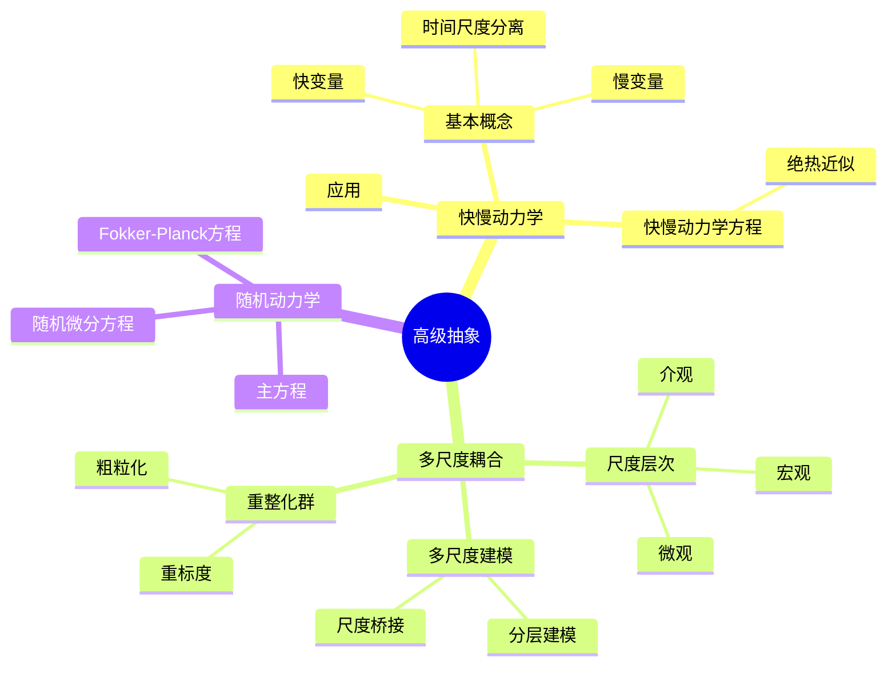
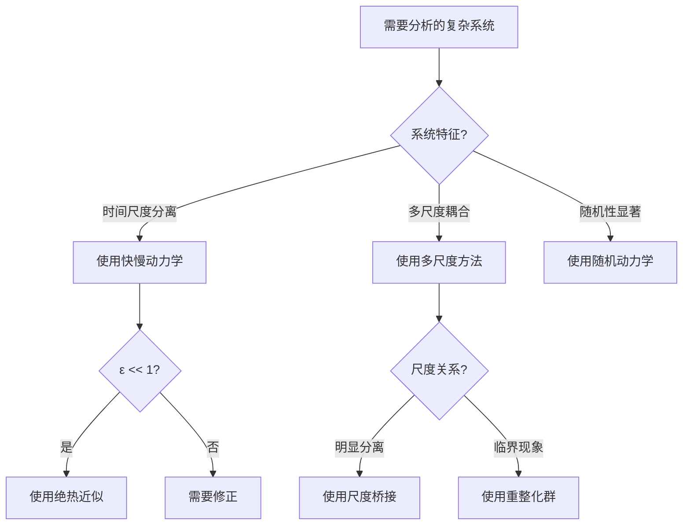
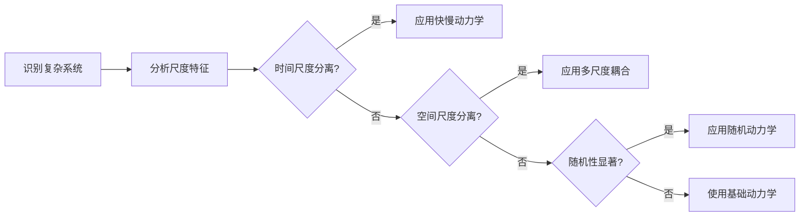
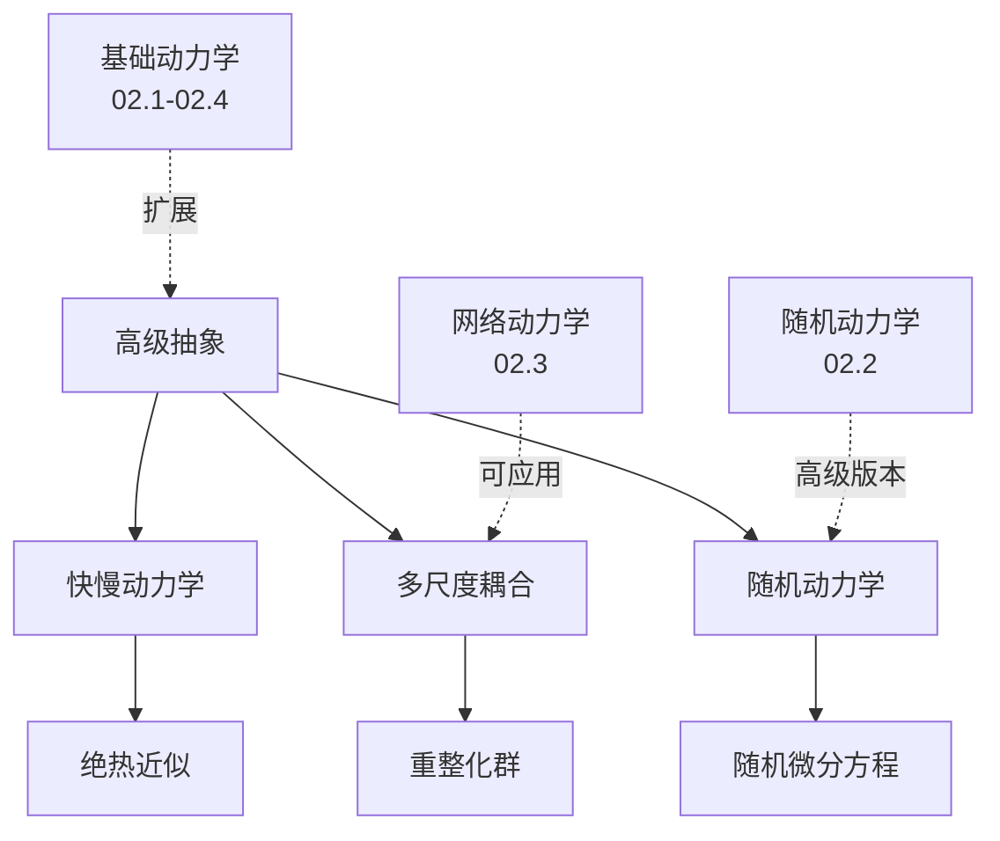
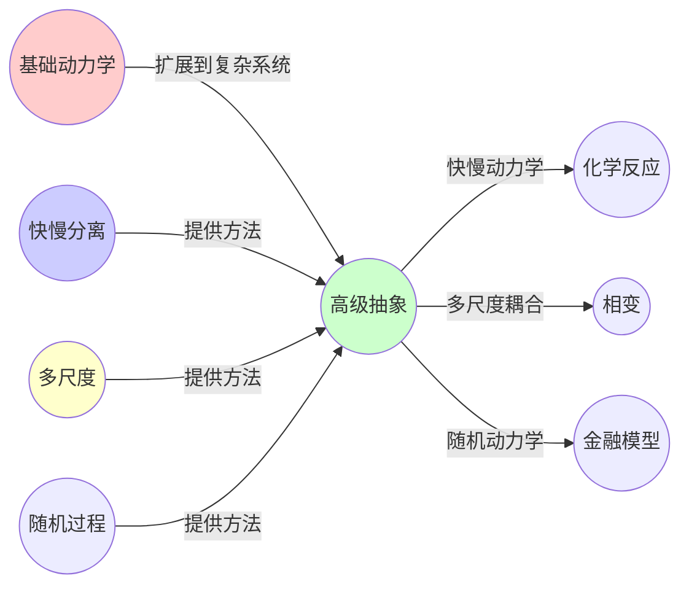
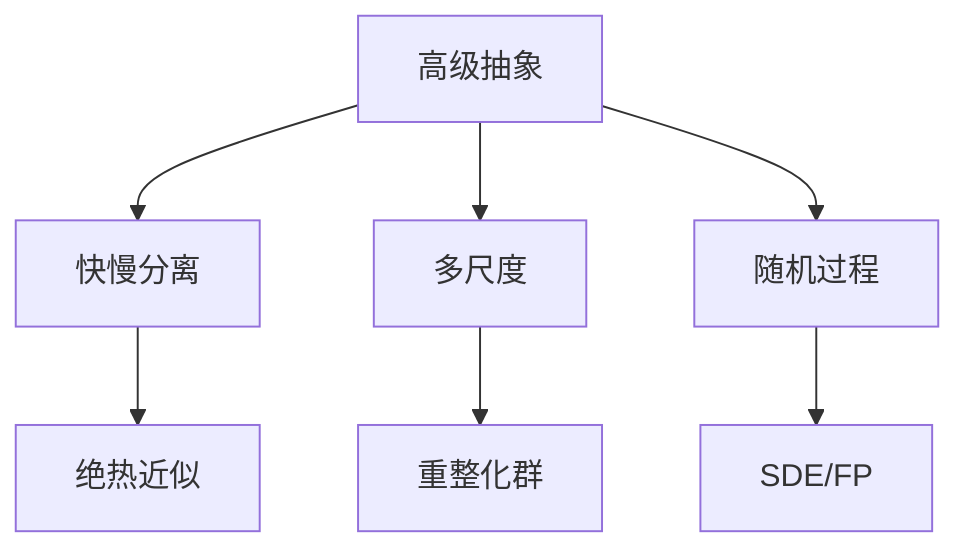

# 02.6 高级抽象

> **来源**: view07.md
> **创建日期**: 2025-01-27
> **最后更新**: 2025-01-27

## 📋 目录

- [02.6 高级抽象](#026-高级抽象)
  - [📋 目录](#-目录)
  - [📋 内容概览](#-内容概览)
  - [🎯 核心理念](#-核心理念)
  - [⚡ 快慢动力学](#-快慢动力学)
    - [基本概念](#基本概念)
    - [快慢动力学方程](#快慢动力学方程)
    - [绝热近似](#绝热近似)
  - [🔄 多尺度耦合](#-多尺度耦合)
    - [尺度层次](#尺度层次)
    - [多尺度建模](#多尺度建模)
    - [重整化群](#重整化群)
  - [📊 随机动力学的高级抽象](#-随机动力学的高级抽象)
    - [随机微分方程](#随机微分方程)
    - [Fokker-Planck方程](#fokker-planck方程)
    - [主方程](#主方程)
  - [🎯 应用实例](#-应用实例)
    - [实例1：化学反应](#实例1化学反应)
    - [实例2：生态系统](#实例2生态系统)
    - [实例3：经济系统](#实例3经济系统)
  - [📊 详细案例研究](#-详细案例研究)
    - [案例研究 1：快慢分离在酶反应动力学中的应用](#案例研究-1快慢分离在酶反应动力学中的应用)
    - [案例研究 2：重整化群在多尺度建模中的应用](#案例研究-2重整化群在多尺度建模中的应用)
    - [案例研究 3：随机微分方程在金融建模中的应用](#案例研究-3随机微分方程在金融建模中的应用)
  - [⚠️ 批判性分析与局限性](#️-批判性分析与局限性)
    - [局限性讨论](#局限性讨论)
      - [1. 快慢分离假设的局限性](#1-快慢分离假设的局限性)
      - [2. 多尺度建模的计算复杂度](#2-多尺度建模的计算复杂度)
      - [3. 随机动力学的假设限制](#3-随机动力学的假设限制)
    - [改进方向](#改进方向)
      - [1. 发展自适应尺度方法](#1-发展自适应尺度方法)
      - [2. 提高多尺度建模能力](#2-提高多尺度建模能力)
  - [📊 思维导图](#-思维导图)
    - [1.2 Mermaid格式（可视化版）](#12-mermaid格式可视化版)
    - [📊 2. 多维对比矩阵](#-2-多维对比矩阵)
      - [2.1 快慢动力学与多尺度耦合对比矩阵](#21-快慢动力学与多尺度耦合对比矩阵)
      - [2.2 随机动力学高级抽象对比矩阵](#22-随机动力学高级抽象对比矩阵)
      - [2.3 高级抽象方法对比矩阵](#23-高级抽象方法对比矩阵)
    - [🌲 3. 决策树](#-3-决策树)
      - [3.1 高级抽象方法选择决策树](#31-高级抽象方法选择决策树)
    - [🛤️ 4. 决策逻辑路径](#️-4-决策逻辑路径)
      - [4.1 高级抽象分析路径](#41-高级抽象分析路径)
    - [🕸️ 5. 概念关系网络](#️-5-概念关系网络)
      - [5.1 高级抽象概念关系网络](#51-高级抽象概念关系网络)
    - [🗺️ 6. 知识图谱](#️-6-知识图谱)
      - [6.1 高级抽象知识图谱](#61-高级抽象知识图谱)
  - [📚 理论体系](#-理论体系)
    - [理论基础](#理论基础)
      - [数学/物理基础](#数学物理基础)
      - [历史发展](#历史发展)
    - [理论框架](#理论框架)
      - [核心假设](#核心假设)
      - [基本概念体系](#基本概念体系)
      - [主要定理/结论](#主要定理结论)
      - [适用范围和边界](#适用范围和边界)
    - [当前知识共识](#当前知识共识)
      - [学术界共识](#学术界共识)
      - [主要争议点](#主要争议点)
      - [权威来源](#权威来源)
    - [与其他理论的关系](#与其他理论的关系)
      - [逻辑关系](#逻辑关系)
      - [映射关系](#映射关系)
  - [🔗 关联网络](#-关联网络)
    - [🔗 概念级关联](#-概念级关联)
      - [核心概念映射](#核心概念映射)
    - [🔗 理论级关联](#-理论级关联)
      - [理论基础](#理论基础-1)
    - [🔗 方法级关联](#-方法级关联)
      - [方法应用网络](#方法应用网络)
    - [🔗 应用场景关联](#-应用场景关联)
  - [🛤️ 学习路径](#️-学习路径)
    - [前置知识](#前置知识)
    - [后续学习](#后续学习)
    - [并行学习](#并行学习)
  - [🔗 相关文档](#-相关文档)
  - [📖 扩展阅读](#-扩展阅读)

---

## 📋 内容概览

本文档阐述动力学系统的高级抽象，包括快慢动力学、多尺度耦合等。这些高级抽象为理解复杂系统的多层次行为提供了强有力的工具。

---

## 🎯 核心理念

复杂系统往往包含多个时间尺度和空间尺度。通过快慢分离、多尺度耦合和随机动力学的高级抽象，我们可以系统地分析这些复杂系统的行为，从微观到宏观建立统一的描述框架。

## ⚡ 快慢动力学

### 基本概念

**快慢分离**：系统包含快变量和慢变量

**时间尺度分离**：快变量和慢变量的时间尺度差异很大

### 快慢动力学方程

**快变量**：x_fast(t)

**慢变量**：x_slow(t)

**动力学**：

```latex
\frac{dx_{fast}}{dt} = f_{fast}(x_{fast}, x_{slow}) \quad (\text{快时间尺度})
\frac{dx_{slow}}{dt} = \varepsilon \cdot f_{slow}(x_{fast}, x_{slow}) \quad (\text{慢时间尺度}, \varepsilon \ll 1)
```

### 绝热近似

**原理**：当ε→0，快变量瞬间达到平衡

**方法**：设dx_fast/dt = 0，求解x_fast = g(x_slow)

**应用**：

- **化学反应**：快速反应达到平衡
- **生态系统**：快速物种达到平衡
- **经济系统**：快速市场达到平衡

## 🔄 多尺度耦合

### 尺度层次

**微观尺度**：个体行为

**介观尺度**：群体行为

**宏观尺度**：系统行为

### 多尺度建模

**方法**：

1. **分层建模**：不同尺度分别建模
2. **尺度桥接**：建立尺度间的连接
3. **尺度平均**：从微观到宏观的平均

### 重整化群

**原理**：通过尺度变换研究系统性质

**方法**：

1. **粗粒化**：将细尺度粗粒化
2. **重标度**：重新标度参数
3. **固定点**：寻找固定点

**应用**：

- **相变理论**：临界现象
- **复杂系统**：多尺度系统
- **统计物理**：临界指数

## 📊 随机动力学的高级抽象

### 随机微分方程

**形式**：

```latex
dx = f(x,t)dt + g(x,t)dW
```

- **f(x,t)**：漂移项
- **g(x,t)**：扩散项
- **dW**：维纳过程

### Fokker-Planck方程

**形式**：

```latex
\frac{\partial p}{\partial t} = -\frac{\partial}{\partial x}[A(x)p] + \frac{1}{2}\frac{\partial^2}{\partial x^2}[B(x)p]
```

- **A(x)**：漂移系数
- **B(x)**：扩散系数
- **p(x,t)**：概率密度

### 主方程

**形式**：

```latex
\frac{dP_i}{dt} = \sum_j [W_{ij}P_j - W_{ji}P_i]
```

- **W_{ij}**：转移率
- **P_i**：状态i的概率

## 🎯 应用实例

### 实例1：化学反应

**快慢分离**：

- **快**：中间产物
- **慢**：反应物和产物

**方法**：准稳态近似

### 实例2：生态系统

**多尺度**：

- **微观**：个体行为
- **介观**：种群动态
- **宏观**：生态系统

**方法**：多尺度建模

### 实例3：经济系统

**快慢动力学**：

- **快**：市场价格
- **慢**：经济结构

**方法**：市场均衡假设

## 📊 详细案例研究

### 案例研究 1：快慢分离在酶反应动力学中的应用

**背景**：酶催化反应中存在快慢时间尺度的分离，使用绝热近似可以简化模型。

**形式化分析**：

```text
Michaelis-Menten反应:
- 快变量: 酶-底物复合物 [ES]
- 慢变量: 底物浓度 [S]
- 动力学:
  d[ES]/dt = k₁[E][S] - k₋₁[ES] - k₂[ES] (快)
  d[S]/dt = -k₁[E][S] + k₋₁[ES] (慢)

绝热近似:
- 假设: d[ES]/dt ≈ 0
- 结果: [ES] = [E][S]/(K_m + [S])
- 速率: v = V_max[S]/(K_m + [S])

应用效果:
- 简化复杂反应网络
- 预测反应速率
- 优化酶反应条件
```

**关键发现**：

- ✅ 快慢分离简化了复杂系统分析
- ✅ 绝热近似提供了有效近似
- ✅ 时间尺度分离在生物系统中普遍存在

**应用价值**：

- ✅ 酶工程
- ✅ 药物设计
- ✅ 代谢工程

### 案例研究 2：重整化群在多尺度建模中的应用

**背景**：使用重整化群方法研究相变和临界现象，展示多尺度耦合的应用。

**形式化分析**：

```text
重整化群变换:
- 粗粒化: 将细尺度变量平均
- 重标度: 重新标度长度和时间
- 固定点: 找到不变点

Ising模型示例:
- 微观: 自旋配置 σ_i
- 宏观: 磁化强度 M
- 临界点: T_c (临界温度)

临界指数:
- β: 磁化指数
- γ: 磁化率指数
- ν: 关联长度指数

应用效果:
- 预测临界行为
- 理解相变机制
- 统一不同尺度描述
```

**关键发现**：

- ✅ 重整化群连接了不同尺度
- ✅ 临界指数具有普适性
- ✅ 多尺度方法揭示深层规律

**应用价值**：

- ✅ 统计物理
- ✅ 临界现象研究
- ✅ 复杂系统建模

### 案例研究 3：随机微分方程在金融建模中的应用

**背景**：使用随机微分方程描述资产价格的演化，展示随机动力学高级抽象的应用。

**形式化分析**：

```text
Black-Scholes模型:
- 状态: 资产价格 S(t)
- 随机微分方程: dS = μS dt + σS dW
- 漂移项: μS (预期收益)
- 扩散项: σS (波动率)

Fokker-Planck方程:
- 概率密度: p(S,t)
- 演化: ∂p/∂t = -∂/∂S[μSp] + (1/2)∂²/∂S²[σ²S²p]

期权定价:
- 风险中性测度
- 解析解: Black-Scholes公式
- 数值方法: Monte Carlo模拟

应用效果:
- 衍生品定价
- 风险管理
- 投资组合优化
```

**关键发现**：

- ✅ 随机微分方程能够描述价格演化
- ✅ Fokker-Planck方程提供概率描述
- ✅ 随机性在金融建模中至关重要

**应用价值**：

- ✅ 金融衍生品定价
- ✅ 风险管理
- ✅ 量化投资

## ⚠️ 批判性分析与局限性

### 局限性讨论

#### 1. 快慢分离假设的局限性

**问题**：实际系统中快慢分离可能不明显。

**挑战**：

- ⚠️ 时间尺度差异不够大
- ⚠️ 快慢变量耦合强
- ⚠️ 分离失效的情况

**应对策略**：

- ✅ 验证分离条件
- ✅ 考虑耦合效应
- ✅ 使用更精确方法

#### 2. 多尺度建模的计算复杂度

**问题**：多尺度建模往往计算量巨大。

**挑战**：

- ⚠️ 跨尺度计算困难
- ⚠️ 尺度耦合复杂
- ⚠️ 实时应用限制

**改进方向**：

- ✅ 开发高效算法
- ✅ 使用并行计算
- ✅ 优化数值方法

#### 3. 随机动力学的假设限制

**问题**：随机动力学模型基于特定假设。

**挑战**：

- ⚠️ 高斯噪声假设
- ⚠️ 马尔可夫假设
- ⚠️ 线性假设

**改进方向**：

- ✅ 考虑非高斯噪声
- ✅ 扩展非马尔可夫模型
- ✅ 处理非线性系统

### 改进方向

#### 1. 发展自适应尺度方法

**目标**：自动识别和利用尺度分离。

**方法**：

- 开发自适应算法
- 动态调整尺度
- 优化计算效率

#### 2. 提高多尺度建模能力

**目标**：更好地处理跨尺度问题。

**方法**：

- 开发桥接方法
- 统一多尺度框架
- 验证模型一致性

## 📊 思维导图

```text
高级抽象
├── 快慢动力学
│   ├── 基本概念
│   │   ├── 快变量
│   │   ├── 慢变量
│   │   └── 时间尺度分离
│   ├── 快慢动力学方程
│   │   └── ε << 1 条件
│   ├── 绝热近似
│   │   ├── 原理
│   │   ├── 方法
│   │   └── 应用
│   └── 应用: 化学反应、生态系统
├── 多尺度耦合
│   ├── 尺度层次
│   │   ├── 微观尺度
│   │   ├── 介观尺度
│   │   └── 宏观尺度
│   ├── 多尺度建模
│   │   ├── 分层建模
│   │   ├── 尺度桥接
│   │   └── 尺度平均
│   ├── 重整化群
│   │   ├── 粗粒化
│   │   ├── 重标度
│   │   └── 固定点
│   └── 应用: 相变、复杂系统
└── 随机动力学的高级抽象
    ├── 随机微分方程
    │   ├── 漂移项
    │   ├── 扩散项
    │   └── 维纳过程
    ├── Fokker-Planck方程
    │   ├── 漂移系数
    │   ├── 扩散系数
    │   └── 概率密度
    ├── 主方程
    │   ├── 转移率
    │   └── 状态概率
    └── 应用: 金融、物理、生物
```

### 1.2 Mermaid格式（可视化版）



### 📊 2. 多维对比矩阵

#### 2.1 快慢动力学与多尺度耦合对比矩阵

| 维度 | 快慢动力学 | 多尺度耦合 | 关系类型 | 说明 |
|------|-----------|-----------|---------|------|
| **关注点** | 时间尺度分离 | 空间/时间尺度 | 相关 | 都关注尺度差异 |
| **方法** | 绝热近似 | 尺度桥接 | 不同 | 方法不同 |
| **应用** | 化学反应、生态系统 | 相变、复杂系统 | 不同 | 应用领域不同 |
| **简化方式** | 快变量平衡 | 粗粒化 | 相似 | 都进行简化 |
| **适用条件** | ε << 1 | 尺度分离明显 | 相似 | 都需要尺度分离 |

#### 2.2 随机动力学高级抽象对比矩阵

| 维度 | 随机微分方程 | Fokker-Planck方程 | 主方程 | 推荐场景 |
|------|------------|------------------|--------|----------|
| **状态空间** | 连续 | 连续 | 离散 | 根据状态空间选择 |
| **描述方式** | 随机过程 | 概率密度 | 概率分布 | 描述方式不同 |
| **计算复杂度** | 中 | 高 | 中 | Fokker-Planck最复杂 |
| **应用广度** | 广 | 广 | 广 | 都很广泛 |
| **理论深度** | 中 | 高 | 中 | Fokker-Planck最深 |

#### 2.3 高级抽象方法对比矩阵

| 维度 | 快慢分离 | 多尺度耦合 | 随机动力学 | 选择建议 |
|------|---------|-----------|-----------|----------|
| **适用系统** | 时间尺度分离 | 多尺度系统 | 随机系统 | 根据系统特征 |
| **简化程度** | 高 | 中 | 低 | 快慢分离最简化 |
| **应用广度** | 中 | 高 | 高 | 多尺度和随机应用更广 |
| **理论深度** | 中 | 高 | 高 | 多尺度和随机更深 |
| **计算复杂度** | 低 | 高 | 中 | 快慢分离最简单 |

### 🌲 3. 决策树

#### 3.1 高级抽象方法选择决策树



### 🛤️ 4. 决策逻辑路径

#### 4.1 高级抽象分析路径



### 🕸️ 5. 概念关系网络

#### 5.1 高级抽象概念关系网络



### 🗺️ 6. 知识图谱

#### 6.1 高级抽象知识图谱



## 📚 理论体系

### 理论基础

#### 数学/物理基础

高级抽象的理论基础：

**1. 扰动理论**：

- 奇异扰动
- 多尺度展开
- 绝热近似理论

**2. 统计物理基础**：

- 重整化群理论
- 临界现象
- 相变理论

**3. 随机过程基础**：

- Itô微积分
- Fokker-Planck方程
- 随机动力系统

#### 历史发展

**关键时间节点**：

- **1930年代**：绝热近似理论
  - 量子力学中的绝热定理
  - 化学反应动力学

- **1970年代**：重整化群理论
  - Wilson的重整化群
  - 临界现象理论

- **1950-1960年代**：随机微分方程
  - Itô微积分
  - Fokker-Planck方程

- **1980-1990年代**：多尺度方法
  - 多尺度建模
  - 尺度桥接方法

- **2000年代至今**：应用扩展
  - 复杂系统建模
  - 计算方法发展

### 理论框架

#### 核心假设

**假设1：尺度分离**

- **内容**：系统存在明显的尺度分离
- **适用范围**：尺度分离明显的系统
- **限制条件**：尺度耦合强时需修正

**假设2：快变量平衡**

- **内容**：快变量快速达到平衡
- **适用范围**：ε << 1的系统
- **限制条件**：ε较大时需要修正

**假设3：随机性的可建模性**

- **内容**：随机性可以用随机过程描述
- **适用范围**：具有统计规律的系统
- **限制条件**：完全混沌系统可能不适用

#### 基本概念体系



#### 主要定理/结论

**定理1：绝热定理**

- **内容**：当ε→0时，快变量达到平衡
- **证据**：奇异扰动理论
- **应用**：简化动力学系统

**定理2：重整化群的不动点**

- **内容**：重整化群有固定点
- **证据**：重整化群理论
- **应用**：临界现象分析

**结论3：随机过程的等价性**

- **内容**：SDE和Fokker-Planck方程等价
- **证据**：随机分析理论
- **应用**：选择合适描述方式

#### 适用范围和边界

**适用范围**：

- 具有尺度分离的复杂系统
- 快慢动力学系统
- 多尺度耦合系统
- 随机动力学系统

**边界条件**：

- 需要明显的尺度分离
- 需要ε << 1（快慢分离）
- 需要统计规律（随机系统）

**不适用场景**：

- 无尺度分离的系统
- ε较大的系统
- 无统计规律的系统

### 当前知识共识

#### 学术界共识

**广泛接受的共识**：

1. **尺度分离的重要性**
   - **共识**：尺度分离是复杂系统的普遍特征
   - **支持证据**：大量应用案例
   - **来源**：复杂系统理论、统计物理

2. **绝热近似的有效性**
   - **共识**：绝热近似在ε << 1时有效
   - **支持证据**：理论和实验验证
   - **来源**：扰动理论、化学反应动力学

3. **重整化群的威力**
   - **共识**：重整化群是分析临界现象的有力工具
   - **支持证据**：成功解释相变
   - **来源**：统计物理、相变理论

#### 主要争议点

1. **尺度分离的程度**
   - **观点A**：大多数系统有明显尺度分离
   - **观点B**：许多系统尺度耦合强
   - **当前状态**：多数认为需要具体分析

2. **随机性的来源**
   - **观点A**：随机性来自外部噪声
   - **观点B**：随机性可能来自内在混沌
   - **当前状态**：多数认为两者都可能

#### 权威来源

**经典文献**：

- 《Methods of Mathematical Physics》- Courant & Hilbert
- 《Renormalization Group Methods》- Nigel Goldenfeld
- 《Stochastic Differential Equations》- Bernt Øksendal

**权威机构/专家**：

- **统计物理学会**
- **应用数学学会**
- **复杂系统研究组**

**最新发展**：

- **2020-2024**：自适应多尺度方法、机器学习辅助、大规模计算
- **前沿方向**：量子多尺度方法、生物多尺度建模

### 与其他理论的关系

#### 逻辑关系

**理论基础**：

- **基础动力学**（[02.1-02.4](02.1_经典确定性动力学.md)） → 高级抽象
  - 关系类型：扩展和抽象
  - 关键映射：基础模型 → 高级抽象

**理论应用**：

- 高级抽象 → 复杂系统（[04_复杂系统与网络理论](../04_复杂系统与网络理论/)）
  - 应用方式：分析复杂系统的多尺度行为
  - 应用效果：理解复杂系统

#### 映射关系

| 本理论概念 | 映射理论 | 映射概念 | 映射类型 | 映射说明 |
|-----------|---------|---------|---------|----------|
| **快慢动力学** | 02.1_经典确定性动力学.md | 动力学系统 | 扩展 | 快慢动力学是动力学系统的扩展 |
| **多尺度耦合** | 02.3_网络动力学.md | 网络系统 | 应用 | 网络系统是多尺度系统 |
| **随机动力学** | 02.2_随机动力学.md | 随机过程 | 对应 | 随机动力学的高级版本 |
| **重整化群** | 04.3_自组织临界.md | 临界现象 | 应用 | 重整化群用于分析临界现象 |

## 🔗 关联网络

### 🔗 概念级关联

#### 核心概念映射

| 本文档概念 | 关联文档 | 关联概念 | 关系类型 | 映射说明 |
|-----------|---------|---------|---------|----------|
| **快慢动力学** | 02.1_经典确定性动力学.md | 动力学系统 | 扩展 | 快慢动力学是动力学系统的扩展 |
| **多尺度耦合** | 02.3_网络动力学.md | 网络系统 | 应用 | 网络系统是多尺度系统 |
| **随机动力学** | 02.2_随机动力学.md | 随机过程 | 对应 | 随机动力学的高级版本 |
| **重整化群** | 04.3_自组织临界.md | 临界现象 | 应用 | 重整化群用于分析临界现象 |
| **绝热近似** | 02.1_经典确定性动力学.md | 平衡态 | 对应 | 绝热近似假设快变量达到平衡 |
| **尺度桥接** | 04.2_复杂网络理论.md | 网络分析 | 应用 | 网络分析涉及多尺度 |
| **Fokker-Planck** | 02.2_随机动力学.md | 概率演化 | 对应 | Fokker-Planck描述概率演化 |

### 🔗 理论级关联

#### 理论基础

- **本理论基于**：
  - [02.1-02.4](02.1_经典确定性动力学.md) ⭐⭐⭐ - 动力学系统基础
  - [02.2_随机动力学.md](02.2_随机动力学.md) ⭐⭐⭐ - 随机过程基础

- **本理论应用于**：
  - [04_复杂系统与网络理论](../04_复杂系统与网络理论/) ⭐⭐⭐ - 复杂系统分析
  - [04.3_自组织临界.md](../04_复杂系统与网络理论/04.3_自组织临界.md) ⭐⭐ - 临界现象
  - [05.5_计算与物理.md](../05_信息论与计算理论/05.5_计算与物理.md) ⭐⭐ - 统计物理

### 🔗 方法级关联

#### 方法应用网络

| 本文档方法 | 应用文档 | 应用场景 | 应用效果 |
|-----------|---------|---------|---------|
| **快慢分离** | 02.1_经典确定性动力学.md | 简化系统 | 成功 |
| **多尺度方法** | 04_复杂系统与网络理论 | 复杂系统分析 | 成功 |
| **重整化群** | 04.3_自组织临界.md | 临界现象 | 成功 |

### 🔗 应用场景关联

**场景**：复杂系统多尺度分析

| 视角 | 关联文档 | 核心理论 | 关注点 |
|------|---------|---------|--------|
| **时间尺度** | 本文档 | 快慢动力学 | 时间分离 |
| **空间尺度** | 本文档 | 多尺度耦合 | 尺度桥接 |
| **随机性** | 本文档 | 随机动力学 | 随机过程 |

## 🛤️ 学习路径

### 前置知识

**必须先学习**：

- [02.1-02.4](02.1_经典确定性动力学.md) ⭐⭐⭐ - 动力学系统基础
- [02.2_随机动力学.md](02.2_随机动力学.md) ⭐⭐⭐ - 随机过程基础

**建议先了解**：

- 基础微积分
- 基础概率论
- 基础统计物理

### 后续学习

**建议接下来学习**（按顺序）：

1. [04_复杂系统与网络理论](../04_复杂系统与网络理论/) ⭐⭐⭐ - 复杂系统应用
2. [04.3_自组织临界.md](../04_复杂系统与网络理论/04.3_自组织临界.md) ⭐⭐ - 临界现象
3. [05.5_计算与物理.md](../05_信息论与计算理论/05.5_计算与物理.md) ⭐⭐ - 统计物理

### 并行学习

**可以同时学习**：

- [02.5_跨学科动力学映射.md](02.5_跨学科动力学映射.md) - 跨学科应用
- [04.1_复杂系统基础.md](../04_复杂系统与网络理论/04.1_复杂系统基础.md) - 复杂系统背景

## 🔗 相关文档

- [02.1_经典确定性动力学.md](02.1_经典确定性动力学.md)
- [02.2_随机动力学.md](02.2_随机动力学.md)
- [02.3_网络动力学.md](02.3_网络动力学.md)
- [02.4_分岔理论与相变.md](02.4_分岔理论与相变.md)
- [02.5_跨学科动力学映射.md](02.5_跨学科动力学映射.md)

## 📖 扩展阅读

- 《Multiple Time Scale Dynamics》- Christian Kuehn
- Wikipedia: [Multiple Time Scale](https://en.wikipedia.org/wiki/Multiple_time_scale)
- Wikipedia: [Renormalization Group](https://en.wikipedia.org/wiki/Renormalization_group)
- Wikipedia: [Stochastic Differential Equation](https://en.wikipedia.org/wiki/Stochastic_differential_equation)
