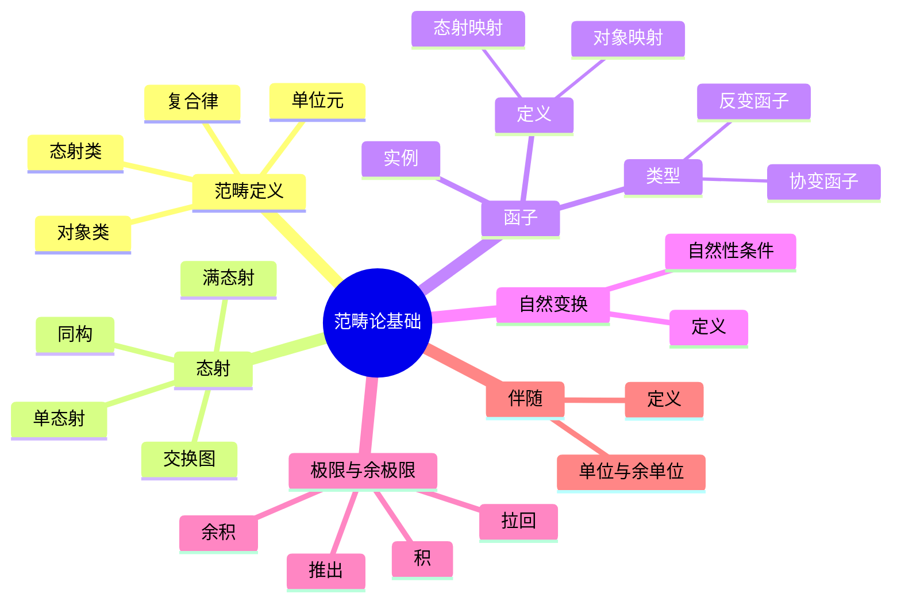
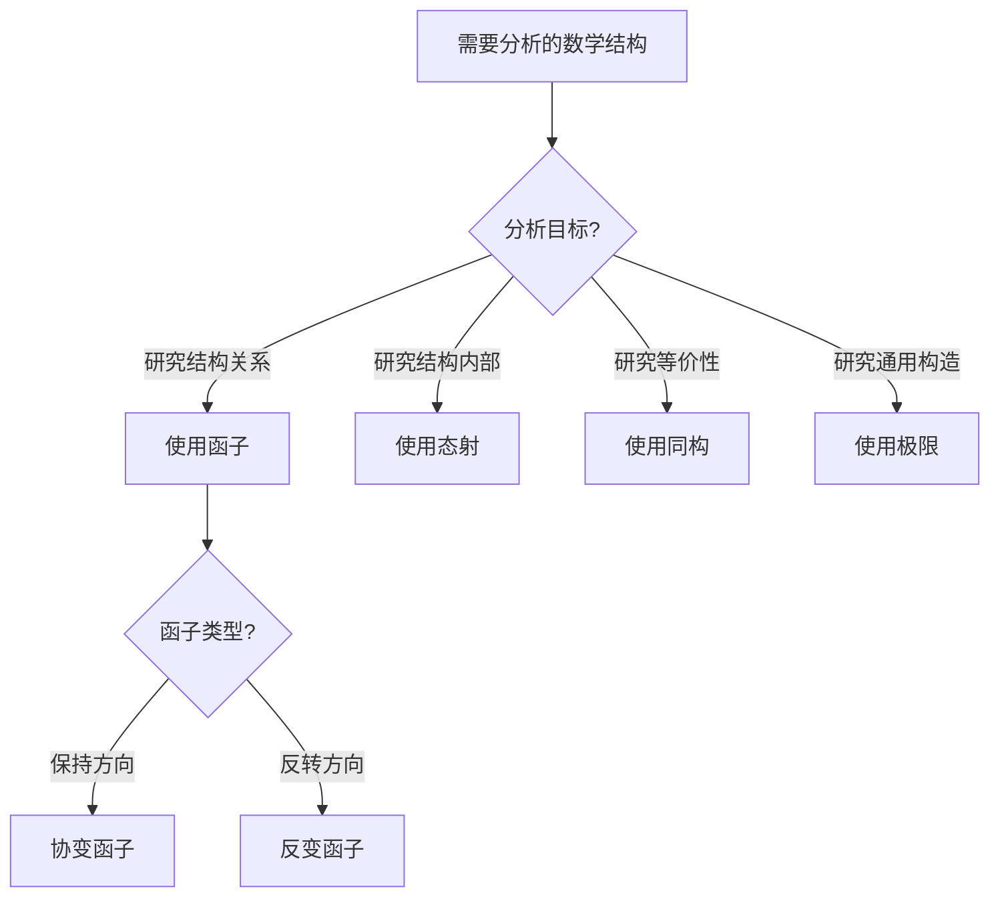
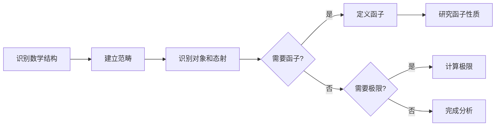
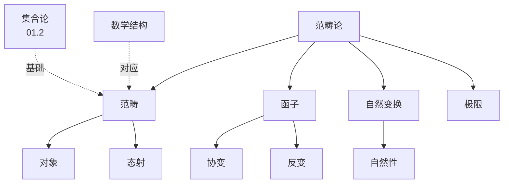
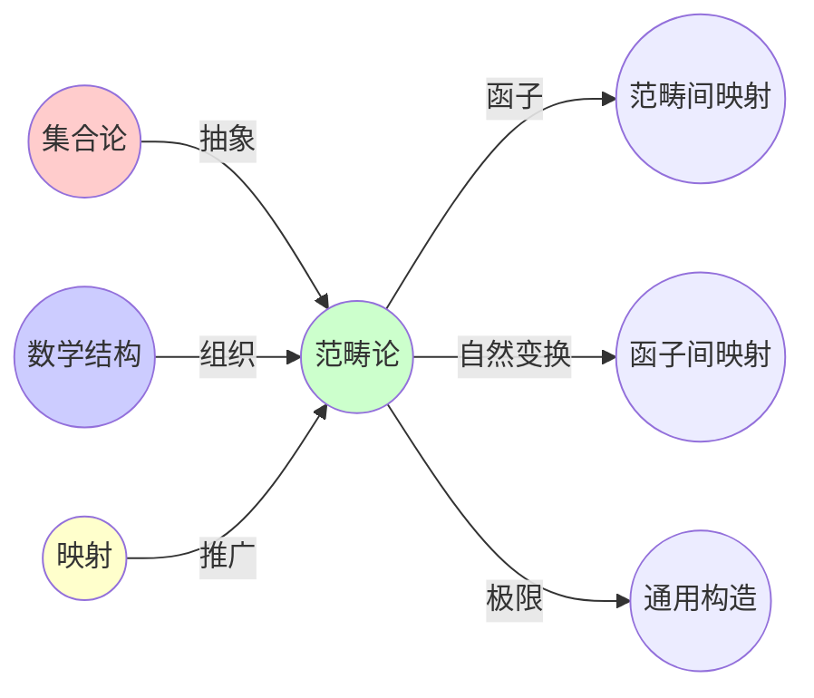
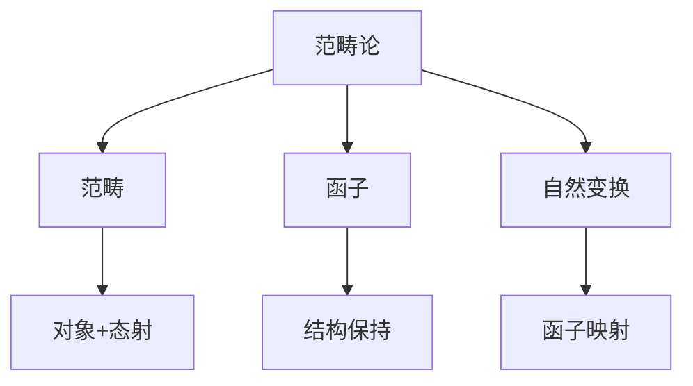

# 03.1 范畴论基础

> **来源**: view08.md
> **创建日期**: 2025-01-27
> **最后更新**: 2025-01-27

## 📋 目录

- [03.1 范畴论基础](#031-范畴论基础)
  - [📋 目录](#-目录)
  - [📋 内容概览](#-内容概览)
  - [🎯 核心理念](#-核心理念)
  - [📚 范畴的定义](#-范畴的定义)
    - [基本要素](#基本要素)
    - [公理](#公理)
    - [记号](#记号)
  - [🔗 态射（Morphism）](#-态射morphism)
    - [类型](#类型)
      - [单态射（Monomorphism）](#单态射monomorphism)
      - [满态射（Epimorphism）](#满态射epimorphism)
      - [同构（Isomorphism）](#同构isomorphism)
    - [交换图](#交换图)
  - [🔄 函子（Functor）](#-函子functor)
    - [定义](#定义)
    - [类型](#类型-1)
      - [协变函子](#协变函子)
      - [反变函子](#反变函子)
    - [实例](#实例)
      - [遗忘函子](#遗忘函子)
      - [自由函子](#自由函子)
  - [🔀 自然变换（Natural Transformation）](#-自然变换natural-transformation)
    - [定义](#定义-1)
    - [自然性条件](#自然性条件)
    - [实例](#实例-1)
      - [行列式自然变换](#行列式自然变换)
  - [📊 极限与余极限](#-极限与余极限)
    - [积（Product）](#积product)
    - [余积（Coproduct）](#余积coproduct)
    - [拉回（Pullback）](#拉回pullback)
    - [推出（Pushout）](#推出pushout)
  - [🎯 伴随（Adjunction）](#-伴随adjunction)
    - [定义](#定义-2)
    - [单位与余单位](#单位与余单位)
    - [三角恒等式](#三角恒等式)
    - [实例](#实例-2)
      - [自由-遗忘伴随](#自由-遗忘伴随)
  - [📊 详细案例研究](#-详细案例研究)
    - [案例研究 1：范畴论在编程语言类型系统中的应用](#案例研究-1范畴论在编程语言类型系统中的应用)
    - [案例研究 2：伴随在数据库查询优化中的应用](#案例研究-2伴随在数据库查询优化中的应用)
    - [案例研究 3：极限和余极限在图论中的应用](#案例研究-3极限和余极限在图论中的应用)
  - [⚠️ 批判性分析与局限性](#️-批判性分析与局限性)
    - [局限性讨论](#局限性讨论)
      - [1. 抽象层次的挑战](#1-抽象层次的挑战)
      - [2. 计算复杂性问题](#2-计算复杂性问题)
      - [3. 范畴选择的多样性](#3-范畴选择的多样性)
    - [改进方向](#改进方向)
      - [1. 提高可计算性](#1-提高可计算性)
      - [2. 增强实际应用](#2-增强实际应用)
  - [📊 思维表征体系](#-思维表征体系)
    - [📊 1. 思维导图（增强版）](#-1-思维导图增强版)
      - [1.1 文本格式（基础版）](#11-文本格式基础版)
      - [1.2 Mermaid格式（可视化版）](#12-mermaid格式可视化版)
    - [📊 2. 多维对比矩阵](#-2-多维对比矩阵)
      - [2.1 范畴论核心概念对比矩阵](#21-范畴论核心概念对比矩阵)
      - [2.2 态射类型对比矩阵](#22-态射类型对比矩阵)
      - [2.3 范畴论与集合论对比矩阵](#23-范畴论与集合论对比矩阵)
    - [🌲 3. 决策树](#-3-决策树)
      - [3.1 范畴论概念选择决策树](#31-范畴论概念选择决策树)
    - [🛤️ 4. 决策逻辑路径](#️-4-决策逻辑路径)
      - [4.1 范畴论分析路径](#41-范畴论分析路径)
    - [🕸️ 5. 概念关系网络](#️-5-概念关系网络)
      - [5.1 范畴论概念关系网络](#51-范畴论概念关系网络)
    - [🗺️ 6. 知识图谱](#️-6-知识图谱)
      - [6.1 范畴论知识图谱](#61-范畴论知识图谱)
  - [📚 理论体系](#-理论体系)
    - [理论基础](#理论基础)
      - [数学基础](#数学基础)
      - [历史发展](#历史发展)
    - [理论框架](#理论框架)
      - [核心假设](#核心假设)
      - [基本概念体系](#基本概念体系)
      - [主要定理/结论](#主要定理结论)
      - [适用范围和边界](#适用范围和边界)
    - [当前知识共识](#当前知识共识)
      - [学术界共识](#学术界共识)
      - [主要争议点](#主要争议点)
      - [权威来源](#权威来源)
    - [与其他理论的关系](#与其他理论的关系)
      - [逻辑关系](#逻辑关系)
      - [映射关系](#映射关系)
  - [🔗 关联网络](#-关联网络)
    - [🔗 概念级关联](#-概念级关联)
      - [核心概念映射](#核心概念映射)
    - [🔗 理论级关联](#-理论级关联)
      - [理论基础](#理论基础-1)
    - [🔗 方法级关联](#-方法级关联)
      - [方法应用网络](#方法应用网络)
    - [🔗 应用场景关联](#-应用场景关联)
  - [🛤️ 学习路径](#️-学习路径)
    - [前置知识](#前置知识)
    - [后续学习](#后续学习)
    - [并行学习](#并行学习)
  - [🔗 相关文档](#-相关文档)
  - [📖 扩展阅读](#-扩展阅读)

---

## 📋 内容概览

本文档阐述范畴论的基础概念，包括对象、态射、函子等核心概念。范畴论提供了研究数学结构之间关系的统一框架，是现代数学和理论计算机科学的重要基础。

---

## 🎯 核心理念

范畴论通过抽象的方式研究数学结构之间的关系。核心思想是关注对象之间的映射（态射）及其组合规律，而非对象的内在结构。这种抽象使得不同领域的数学结构可以统一描述和比较。

## 📚 范畴的定义

### 基本要素

**范畴** 𝒞 由以下要素组成：

1. **对象类** Ob(𝒞)：数学结构
2. **态射类** Hom(𝒞)：对象间的映射
3. **复合律**：态射的复合满足结合律
4. **单位元**：每个对象有单位态射

### 公理

1. **结合律**：(h ∘ g) ∘ f = h ∘ (g ∘ f)
2. **单位律**：id_B ∘ f = f = f ∘ id_A

### 记号

- **对象**：A, B, C ∈ Ob(𝒞)
- **态射**：f: A → B ∈ Hom(A, B)
- **复合**：g ∘ f: A → C
- **单位态射**：id_A: A → A

## 🔗 态射（Morphism）

### 类型

#### 单态射（Monomorphism）

**定义**：f: A → B 是单态射，如果对任意 g, h: X → A，f ∘ g = f ∘ h 蕴含 g = h

**直观**：左可消去

#### 满态射（Epimorphism）

**定义**：f: A → B 是满态射，如果对任意 g, h: B → X，g ∘ f = h ∘ f 蕴含 g = h

**直观**：右可消去

#### 同构（Isomorphism）

**定义**：f: A → B 是同构，如果存在 g: B → A 使得 g ∘ f = id_A 且 f ∘ g = id_B

**记号**：A ≅ B

### 交换图

**定义**：表示态射复合关系的图

**示例**：

```text
A --f--> B
|        |
g        h
|        |
v        v
C --k--> D
```

**交换**：h ∘ f = k ∘ g

## 🔄 函子（Functor）

### 定义

**函子** F: 𝒞 → 𝒟 是范畴间的映射，满足：

1. **对象映射**：F: Ob(𝒞) → Ob(𝒟)
2. **态射映射**：F: Hom(A, B) → Hom(F(A), F(B))
3. **保持复合**：F(g ∘ f) = F(g) ∘ F(f)
4. **保持单位**：F(id_A) = id_{F(A)}

### 类型

#### 协变函子

**定义**：保持方向（A → B 映射到 F(A) → F(B)）

#### 反变函子

**定义**：反转方向（A → B 映射到 F(B) → F(A)）

**记号**：F: 𝒞^op → 𝒟

### 实例

#### 遗忘函子

**定义**：U: Grp → Set，将群映射到其底层集合

**性质**：遗忘群结构，保留集合

#### 自由函子

**定义**：F: Set → Grp，将集合映射到自由群

**性质**：从集合构造群

## 🔀 自然变换（Natural Transformation）

### 定义

**自然变换** η: F → G 是函子间的映射，满足：

对任意态射 f: A → B，以下图交换：

```text
F(A) --η_A--> G(A)
|              |
F(f)           G(f)
|              |
v              v
F(B) --η_B--> G(B)
```

### 自然性条件

**交换性**：G(f) ∘ η_A = η_B ∘ F(f)

### 实例

#### 行列式自然变换

**函子**：GL_n: Ring → Grp（一般线性群）

**自然变换**：det: GL_n → (-)*（乘法群）

## 📊 极限与余极限

### 积（Product）

**定义**：对象A和B的积 A × B 满足泛性质

**泛性质**：对任意对象C和态射 f: C → A, g: C → B，存在唯一态射 ⟨f, g⟩: C → A × B

**交换图**：

```text
      C
      |
      | ⟨f, g⟩
      v
A <---π₁--- A × B ---π₂---> B
```

### 余积（Coproduct）

**定义**：对象A和B的余积 A + B 满足对偶泛性质

**泛性质**：对任意对象C和态射 f: A → C, g: B → C，存在唯一态射 [f, g]: A + B → C

**交换图**：

```text
A ---i₁---> A + B <---i₂--- B
           ↑
           | [f, g]
           |
           C
```

### 拉回（Pullback）

**定义**：给定态射 f: A → C, g: B → C，拉回 A ×_C B 满足泛性质

**应用**：数据库JOIN操作

### 推出（Pushout）

**定义**：给定态射 f: C → A, g: C → B，推出 A +_C B 满足对偶泛性质

**应用**：拓扑空间的粘合

## 🎯 伴随（Adjunction）

### 定义

**伴随对** (F, G): F ⊣ G 满足：

Hom_𝒟(F(A), B) ≅ Hom_𝒞(A, G(B))

### 单位与余单位

**单位**：η: Id_𝒞 → G ∘ F

**余单位**：ε: F ∘ G → Id_𝒟

### 三角恒等式

1. **单位-余单位**：(εF) ∘ (Fη) = id_F
2. **余单位-单位**：(Gε) ∘ (ηG) = id_G

### 实例

#### 自由-遗忘伴随

**函子**：F: Set → Grp（自由群函子）⊣ U: Grp → Set（遗忘函子）

**伴随**：Hom_Grp(F(S), G) ≅ Hom_Set(S, U(G))

## 📊 详细案例研究

### 案例研究 1：范畴论在编程语言类型系统中的应用

**背景**：Haskell等函数式编程语言使用范畴论概念来构建类型系统。

**形式化分析**：

```text
类型范畴:
- 对象: 类型 (如 Int, String, Bool)
- 态射: 函数 (如 f: Int → String)
- 复合: 函数组合 (g ∘ f)
- 单位: 恒等函数

函子:
- Maybe函子: Maybe<T> 将类型T映射到可空类型
- List函子: List<T> 将类型T映射到列表类型
- 保持复合: Maybe(g ∘ f) = Maybe(g) ∘ Maybe(f)

应用效果:
- 类型安全
- 代码复用
- 抽象层次提升
```

**关键发现**：

- ✅ 范畴论为类型系统提供理论基础
- ✅ 函子实现了类型构造的统一抽象
- ✅ 泛型编程基于范畴论概念

**应用价值**：

- ✅ 函数式编程语言设计
- ✅ 类型系统理论
- ✅ 程序验证

### 案例研究 2：伴随在数据库查询优化中的应用

**背景**：使用范畴论中的伴随关系优化数据库查询。

**形式化分析**：

```text
数据库范畴:
- 对象: 数据库模式
- 态射: 查询映射

伴随对:
- F: 自由查询构造（从模式到查询）
- G: 查询执行（从查询到结果）
- 伴随: Hom(F(Schema), Query) ≅ Hom(Schema, G(Query))

优化原理:
- 左伴随F: 构造最优查询
- 右伴随G: 高效执行查询
- 伴随性质: 保证查询等价变换

应用效果:
- 查询优化
- 自动生成查询
- 性能提升
```

**关键发现**：

- ✅ 伴随关系连接了查询构造和执行
- ✅ 泛性质保证了优化的正确性
- ✅ 范畴论提供了统一的查询理论

**应用价值**：

- ✅ 数据库查询优化
- ✅ 查询语言设计
- ✅ 数据管理系统

### 案例研究 3：极限和余极限在图论中的应用

**背景**：使用范畴论中的极限和余极限研究图的构造。

**形式化分析**：

```text
图范畴:
- 对象: 图
- 态射: 图同态

积（Product）:
- 两个图的积: G × H
- 泛性质: 图的笛卡尔积
- 应用: 图的组合构造

余积（Coproduct）:
- 两个图的余积: G + H
- 泛性质: 图的不交并
- 应用: 图的合并

拉回（Pullback）:
- 图的拉回: 子图构造
- 应用: 图的交集运算

实际应用:
- 网络拓扑分析
- 图算法设计
- 组合图论
```

**关键发现**：

- ✅ 极限提供了图的构造方法
- ✅ 泛性质保证了构造的唯一性
- ✅ 范畴论统一了图的运算

**应用价值**：

- ✅ 图论研究
- ✅ 网络分析
- ✅ 组合优化

## ⚠️ 批判性分析与局限性

### 局限性讨论

#### 1. 抽象层次的挑战

**问题**：范畴论的高度抽象使其难以直观理解。

**挑战**：

- ⚠️ 概念抽象程度高
- ⚠️ 需要深厚的数学背景
- ⚠️ 实际应用转化困难

**应对策略**：

- ✅ 提供具体实例
- ✅ 建立直观理解
- ✅ 开发应用工具

#### 2. 计算复杂性问题

**问题**：某些范畴论构造的计算复杂度较高。

**挑战**：

- ⚠️ 极限构造可能指数复杂
- ⚠️ 范畴等价判断困难
- ⚠️ 实际计算效率限制

**改进方向**：

- ✅ 开发近似算法
- ✅ 利用特殊性质
- ✅ 优化构造方法

#### 3. 范畴选择的多样性

**问题**：同一个问题可能有多种范畴化的方式。

**挑战**：

- ⚠️ 范畴选择的主观性
- ⚠️ 不同范畴化的等价性
- ⚠️ 最优选择的困难

**改进方向**：

- ✅ 建立选择标准
- ✅ 研究范畴等价
- ✅ 开发统一框架

### 改进方向

#### 1. 提高可计算性

**目标**：使范畴论构造更易计算。

**方法**：

- 开发计算工具
- 设计高效算法
- 利用计算机辅助

#### 2. 增强实际应用

**目标**：促进范畴论在实际问题中的应用。

**方法**：

- 提供应用案例
- 开发实用工具
- 建立应用框架

## 📊 思维表征体系

### 📊 1. 思维导图（增强版）

#### 1.1 文本格式（基础版）

```text
范畴论基础
├── 范畴的定义
│   ├── 对象类 Ob(𝒞)
│   ├── 态射类 Hom(𝒞)
│   ├── 复合律
│   └── 单位元
│       ├── 结合律
│       └── 单位律
├── 态射（Morphism）
│   ├── 单态射（Monomorphism）
│   ├── 满态射（Epimorphism）
│   ├── 同构（Isomorphism）
│   └── 交换图
├── 函子（Functor）
│   ├── 定义
│   │   ├── 对象映射
│   │   ├── 态射映射
│   │   ├── 保持复合
│   │   └── 保持单位
│   ├── 类型
│   │   ├── 协变函子
│   │   └── 反变函子
│   └── 实例
│       ├── 遗忘函子
│       └── 自由函子
├── 自然变换
│   ├── 定义
│   ├── 自然性条件
│   └── 实例（行列式）
├── 极限与余极限
│   ├── 积（Product）
│   ├── 余积（Coproduct）
│   ├── 拉回（Pullback）
│   └── 推出（Pushout）
└── 伴随（Adjunction）
    ├── 定义
    ├── 单位与余单位
    ├── 三角恒等式
    └── 实例（自由-遗忘伴随）
```

#### 1.2 Mermaid格式（可视化版）



### 📊 2. 多维对比矩阵

#### 2.1 范畴论核心概念对比矩阵

| 维度 | 对象 | 态射 | 函子 | 自然变换 | 重要性 |
|------|------|------|------|---------|--------|
| **抽象层次** | 基础 | 基础 | 中等 | 高 | 逐级提高 |
| **作用范围** | 单一范畴 | 单一范畴 | 范畴间 | 函子间 | 范围扩大 |
| **保持性质** | 保持结构 | 可复合 | 结构 | 自然性 | 保持性增强 |
| **应用广度** | 所有领域 | 所有领域 | 很广 | 广 | 都很广泛 |
| **理解难度** | 低 | 低 | 中 | 高 | 难度递增 |

#### 2.2 态射类型对比矩阵

| 维度 | 单态射 | 满态射 | 同构 | 应用场景 | 推荐 |
|------|--------|--------|------|---------|------|
| **定义** | 左可消去 | 右可消去 | 双向可逆 | 定义不同 | 根据需求 |
| **等价性** | 单射（Set） | 满射（Set） | 双射（Set） | Set中对应 | 集合论类比 |
| **组合性质** | 复合仍单态 | 复合仍满态 | 复合仍同构 | 性质保持 | 都很重要 |
| **应用** | 嵌入 | 覆盖 | 等价 | 应用不同 | 根据结构 |

#### 2.3 范畴论与集合论对比矩阵

| 维度 | 集合论 | 范畴论 | 关系类型 | 说明 |
|------|--------|--------|---------|------|
| **关注点** | 元素 | 对象和态射 | 不同 | 关注点不同 |
| **映射** | 函数 | 态射 | 扩展 | 态射更抽象 |
| **结构** | 集合结构 | 范畴结构 | 抽象 | 范畴更抽象 |
| **应用** | 经典数学 | 现代数学+计算机 | 扩展 | 范畴应用更广 |
| **抽象度** | 中 | 高 | 更高 | 范畴更抽象 |

### 🌲 3. 决策树

#### 3.1 范畴论概念选择决策树



### 🛤️ 4. 决策逻辑路径

#### 4.1 范畴论分析路径



### 🕸️ 5. 概念关系网络

#### 5.1 范畴论概念关系网络



### 🗺️ 6. 知识图谱

#### 6.1 范畴论知识图谱



## 📚 理论体系

### 理论基础

#### 数学基础

范畴论的理论基础：

**1. 集合论基础**：

- 集合和函数
- 关系理论
- 结构理论

**2. 抽象代数基础**：

- 群、环、域
- 同态
- 同构

**3. 拓扑学基础**：

- 拓扑空间
- 连续映射
- 同伦理论

#### 历史发展

**关键时间节点**：

- **1940年代**：范畴论的创立
  - Eilenberg和MacLane的奠基工作
  - 同调代数的抽象化

- **1950-1960年代**：核心概念的发展
  - 函子和自然变换的系统化
  - Yoneda引理

- **1970年代**：极限和伴随理论
  - 极限的范畴化
  - 伴随理论

- **1980-1990年代**：计算机科学应用
  - 类型论与范畴论
  - 语义学

- **2000年代至今**：应用扩展
  - 量子计算
  - 机器学习
  - 数据库理论

### 理论框架

#### 核心假设

**假设1：结构的重要性**

- **内容**：数学结构比具体对象更重要
- **适用范围**：抽象数学结构
- **限制条件**：需要抽象能力

**假设2：态射的优先性**

- **内容**：态射比对象更重要
- **适用范围**：结构关系
- **限制条件**：需要理解关系

**假设3：通用性的追求**

- **内容**：追求通用构造（极限）
- **适用范围**：统一描述
- **限制条件**：可能过于抽象

#### 基本概念体系



#### 主要定理/结论

**定理1：Yoneda引理**

- **内容**：对象由其态射决定
- **证据**：范畴论证明
- **应用**：表示理论

**定理2：极限的存在性**

- **内容**：在特定条件下极限存在
- **证据**：范畴论构造
- **应用**：通用构造

**结论3：伴随的普遍性**

- **内容**：伴随关系在数学中普遍存在
- **证据**：大量实例
- **应用**：统一理解

#### 适用范围和边界

**适用范围**：

- 抽象数学结构
- 具有态射的系统
- 需要统一描述的结构

**边界条件**：

- 需要明确的对象和态射
- 需要满足范畴公理
- 需要抽象思维能力

**不适用场景**：

- 具体计算
- 数值分析
- 需要细节的场景

### 当前知识共识

#### 学术界共识

**广泛接受的共识**：

1. **范畴论的重要性**
   - **共识**：范畴论是现代数学的重要语言
   - **支持证据**：广泛的应用
   - **来源**：数学、计算机科学

2. **抽象性的价值**
   - **共识**：抽象能够揭示深层统一性
   - **支持证据**：跨领域应用
   - **来源**：数学哲学

3. **应用的广泛性**
   - **共识**：范畴论在多个领域有应用
   - **支持证据**：成功案例
   - **来源**：应用研究

#### 主要争议点

1. **抽象程度的平衡**
   - **观点A**：越抽象越好
   - **观点B**：需要保持可理解性
   - **当前状态**：多数认为需要平衡

2. **计算性**
   - **观点A**：范畴论应该可计算
   - **观点B**：范畴论主要是概念性的
   - **当前状态**：多数支持发展计算性

#### 权威来源

**经典文献**：

- 《Category Theory》- Steve Awodey
- 《Basic Category Theory》- Tom Leinster
- 《Categories for the Working Mathematician》- Saunders Mac Lane

**权威机构/专家**：

- **范畴论研究组**
- **理论计算机科学学会**
- **数学结构研究组**

**最新发展**：

- **2020-2024**：同伦类型论、范畴化机器学习、量子范畴
- **前沿方向**：高阶范畴、无穷范畴、计算范畴论

### 与其他理论的关系

#### 逻辑关系

**理论基础**：

- **集合论**（[01.2_核心领域详解.md](../01_形式科学基础理论/01.2_核心领域详解.md)） → 范畴论
  - 关系类型：抽象基础
  - 关键映射：集合 → 对象，函数 → 态射

**理论应用**：

- 范畴论 → 类型论（[09_Curry-Howard同构](../09_Curry-Howard同构/)）
  - 应用方式：类型系统的范畴语义
  - 应用效果：统一理解类型

#### 映射关系

| 本理论概念 | 映射理论 | 映射概念 | 映射类型 | 映射说明 |
|-----------|---------|---------|---------|----------|
| **对象** | 01.2_核心领域详解.md | 集合 | 抽象 | 对象是集合的抽象 |
| **态射** | 01.2_核心领域详解.md | 函数 | 抽象 | 态射是函数的抽象 |
| **函子** | 02.5_跨学科动力学映射.md | 映射 | 对应 | 函子是结构映射 |
| **极限** | 02.1_经典确定性动力学.md | 不动点 | 对应 | 极限是通用构造 |

## 🔗 关联网络

### 🔗 概念级关联

#### 核心概念映射

| 本文档概念 | 关联文档 | 关联概念 | 关系类型 | 映射说明 |
|-----------|---------|---------|---------|----------|
| **对象** | 01.2_核心领域详解.md | 集合 | 抽象 | 对象是集合的抽象 |
| **态射** | 01.2_核心领域详解.md | 函数 | 抽象 | 态射是函数的抽象 |
| **函子** | 02.5_跨学科动力学映射.md | 映射 | 对应 | 函子是结构映射 |
| **极限** | 02.1_经典确定性动力学.md | 不动点 | 对应 | 极限是通用构造 |
| **伴随** | 03.2_函子与自然变换.md | 函子关系 | 基础 | 伴随是函子关系 |
| **同构** | 01.4_元理论框架.md | 等价性 | 对应 | 同构是范畴等价 |
| **自然变换** | 03.2_函子与自然变换.md | 函子映射 | 基础 | 自然变换是核心概念 |

### 🔗 理论级关联

#### 理论基础

- **本理论基于**：
  - [01.2_核心领域详解.md](../01_形式科学基础理论/01.2_核心领域详解.md) ⭐⭐⭐ - 集合论基础

- **本理论应用于**：
  - [03.2-03.6](03.2_函子与自然变换.md) ⭐⭐⭐ - 范畴论的扩展
  - [09_Curry-Howard同构](../09_Curry-Howard同构/) ⭐⭐⭐ - 类型论应用
  - [03.4_数据库设计中的范畴论.md](03.4_数据库设计中的范畴论.md) ⭐⭐ - 数据库应用

### 🔗 方法级关联

#### 方法应用网络

| 本文档方法 | 应用文档 | 应用场景 | 应用效果 |
|-----------|---------|---------|---------|
| **范畴方法** | 03.2-03.6 | 范畴论扩展 | 成功 |
| **函子方法** | 03.2_函子与自然变换.md | 结构映射 | 成功 |
| **极限方法** | 03.3_极限与余极限.md | 通用构造 | 成功 |

### 🔗 应用场景关联

**场景**：类型系统设计

| 视角 | 关联文档 | 核心理论 | 关注点 |
|------|---------|---------|--------|
| **范畴结构** | 本文档 | 范畴论 | 对象和态射 |
| **类型映射** | 03.5_编程语言语义的范畴化.md | 范畴语义 | 类型函子 |
| **等价性** | 09_Curry-Howard同构 | 逻辑对应 | 类型-逻辑对应 |

## 🛤️ 学习路径

### 前置知识

**必须先学习**：

- [01.2_核心领域详解.md](../01_形式科学基础理论/01.2_核心领域详解.md) ⭐⭐⭐ - 集合论基础

**建议先了解**：

- 基础抽象代数（群、环、域）
- 基础拓扑学（拓扑空间、连续映射）

### 后续学习

**建议接下来学习**（按顺序）：

1. [03.2_函子与自然变换.md](03.2_函子与自然变换.md) ⭐⭐⭐ - 函子和自然变换
2. [03.3_极限与余极限.md](03.3_极限与余极限.md) ⭐⭐ - 极限理论
3. [03.4-03.6](03.4_数据库设计中的范畴论.md) ⭐⭐ - 应用

### 并行学习

**可以同时学习**：

- [09_Curry-Howard同构](../09_Curry-Howard同构/) - 类型论应用
- [01.4_元理论框架.md](../01_形式科学基础理论/01.4_元理论框架.md) - 元理论

## 🔗 相关文档

- [03.2_函子与自然变换.md](03.2_函子与自然变换.md)
- [03.3_极限与余极限.md](03.3_极限与余极限.md)
- [03.4_数据库设计中的范畴论.md](03.4_数据库设计中的范畴论.md)
- [03.5_编程语言语义的范畴化.md](03.5_编程语言语义的范畴化.md)

## 📖 扩展阅读

- 《Category Theory》- Steve Awodey
- 《Basic Category Theory》- Tom Leinster
- Wikipedia: [Category Theory](https://en.wikipedia.org/wiki/Category_theory)
- Wikipedia: [Functor](https://en.wikipedia.org/wiki/Functor)
- Wikipedia: [Natural Transformation](https://en.wikipedia.org/wiki/Natural_transformation)
