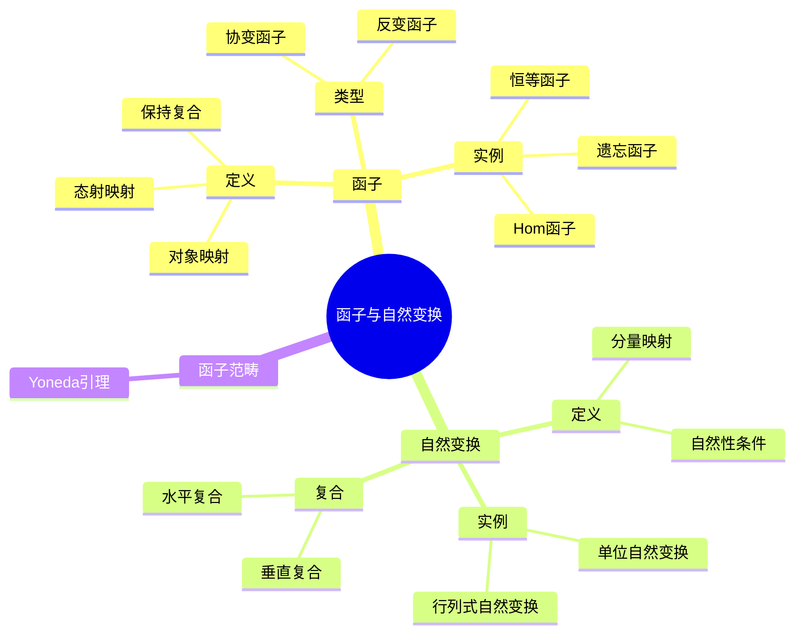
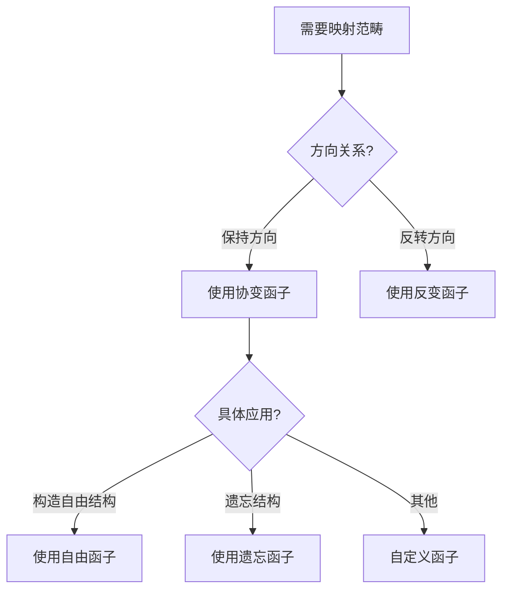
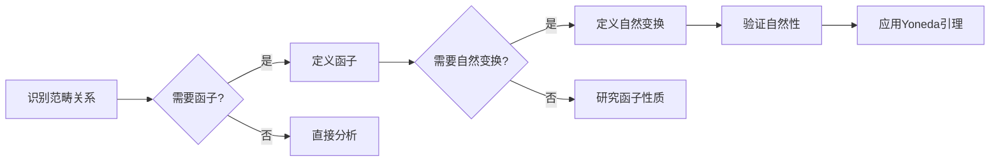
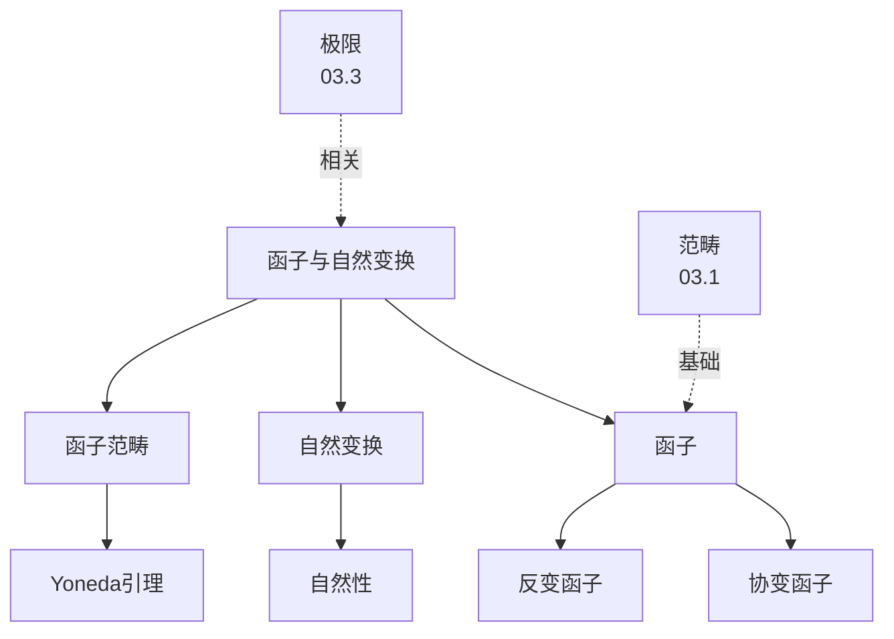
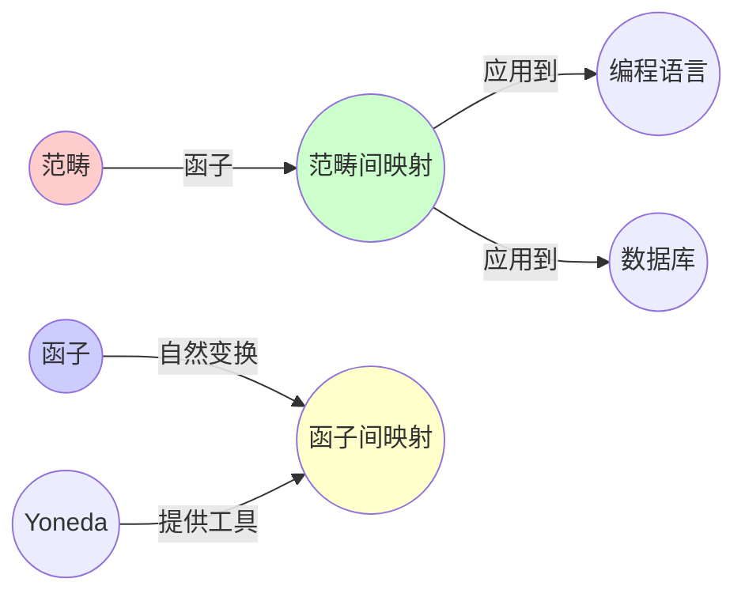
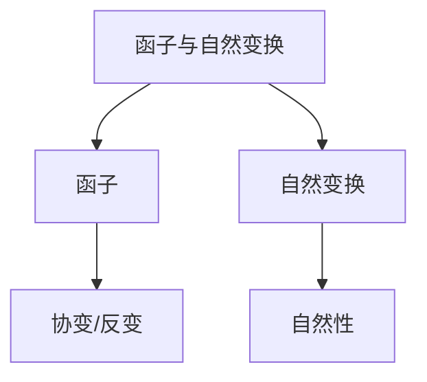

# 03.2 函子与自然变换

> **来源**: view08.md
> **创建日期**: 2025-01-27
> **最后更新**: 2025-01-27

## 📋 目录

- [03.2 函子与自然变换](#032-函子与自然变换)
  - [📋 目录](#-目录)
  - [📋 内容概览](#-内容概览)
  - [🎯 核心理念](#-核心理念)
  - [🔄 函子（Functor）](#-函子functor)
    - [定义回顾](#定义回顾)
    - [函子的类型](#函子的类型)
      - [协变函子](#协变函子)
      - [反变函子](#反变函子)
    - [函子的实例](#函子的实例)
      - [1. 恒等函子](#1-恒等函子)
      - [2. 遗忘函子](#2-遗忘函子)
      - [3. 自由函子](#3-自由函子)
      - [4. 幂集函子](#4-幂集函子)
      - [5. Hom函子](#5-hom函子)
  - [🔀 自然变换（Natural Transformation）](#-自然变换natural-transformation)
    - [定义](#定义)
    - [自然性条件](#自然性条件)
    - [自然变换的实例](#自然变换的实例)
      - [1. 单位自然变换](#1-单位自然变换)
      - [2. 行列式自然变换](#2-行列式自然变换)
      - [3. 双线性映射自然变换](#3-双线性映射自然变换)
  - [📊 函子范畴](#-函子范畴)
    - [定义](#定义-1)
    - [复合](#复合)
    - [单位](#单位)
  - [🎯 自然同构](#-自然同构)
    - [定义](#定义-2)
    - [性质](#性质)
    - [实例](#实例)
      - [Yoneda引理](#yoneda引理)
  - [📊 详细案例研究](#-详细案例研究)
    - [案例研究 1：函子在编程语言泛型中的应用](#案例研究-1函子在编程语言泛型中的应用)
    - [案例研究 2：自然变换在数据库查询优化中的应用](#案例研究-2自然变换在数据库查询优化中的应用)
    - [案例研究 3：Yoneda引理在函数式编程中的应用](#案例研究-3yoneda引理在函数式编程中的应用)
  - [⚠️ 批判性分析与局限性](#️-批判性分析与局限性)
    - [局限性讨论](#局限性讨论)
      - [1. 抽象层次的挑战](#1-抽象层次的挑战)
      - [2. 计算复杂性问题](#2-计算复杂性问题)
      - [3. 范畴选择的多样性](#3-范畴选择的多样性)
    - [改进方向](#改进方向)
      - [1. 提高可计算性](#1-提高可计算性)
      - [2. 增强实际应用](#2-增强实际应用)
  - [📊 思维表征体系](#-思维表征体系)
    - [📊 1. 思维导图（增强版）](#-1-思维导图增强版)
      - [1.1 文本格式（基础版）](#11-文本格式基础版)
      - [1.2 Mermaid格式（可视化版）](#12-mermaid格式可视化版)
    - [📊 2. 多维对比矩阵](#-2-多维对比矩阵)
      - [2.1 函子类型对比矩阵](#21-函子类型对比矩阵)
      - [2.2 自然变换与函子对比矩阵](#22-自然变换与函子对比矩阵)
      - [2.3 Yoneda引理的应用对比矩阵](#23-yoneda引理的应用对比矩阵)
    - [🌲 3. 决策树](#-3-决策树)
      - [3.1 函子选择决策树](#31-函子选择决策树)
    - [🛤️ 4. 决策逻辑路径](#️-4-决策逻辑路径)
      - [4.1 函子和自然变换分析路径](#41-函子和自然变换分析路径)
    - [🕸️ 5. 概念关系网络](#️-5-概念关系网络)
      - [5.1 函子与自然变换概念关系网络](#51-函子与自然变换概念关系网络)
    - [🗺️ 6. 知识图谱](#️-6-知识图谱)
      - [6.1 函子与自然变换知识图谱](#61-函子与自然变换知识图谱)
  - [📚 理论体系](#-理论体系)
    - [理论基础](#理论基础)
      - [数学基础](#数学基础)
      - [历史发展](#历史发展)
    - [理论框架](#理论框架)
      - [核心假设](#核心假设)
      - [基本概念体系](#基本概念体系)
      - [主要定理/结论](#主要定理结论)
      - [适用范围和边界](#适用范围和边界)
    - [当前知识共识](#当前知识共识)
      - [学术界共识](#学术界共识)
      - [主要争议点](#主要争议点)
      - [权威来源](#权威来源)
    - [与其他理论的关系](#与其他理论的关系)
      - [逻辑关系](#逻辑关系)
      - [映射关系](#映射关系)
  - [🔗 关联网络](#-关联网络)
    - [🔗 概念级关联](#-概念级关联)
      - [核心概念映射](#核心概念映射)
    - [🔗 理论级关联](#-理论级关联)
      - [理论基础](#理论基础-1)
    - [🔗 方法级关联](#-方法级关联)
      - [方法应用网络](#方法应用网络)
    - [🔗 应用场景关联](#-应用场景关联)
  - [🛤️ 学习路径](#️-学习路径)
    - [前置知识](#前置知识)
    - [后续学习](#后续学习)
    - [并行学习](#并行学习)
  - [🔗 相关文档](#-相关文档)
  - [📖 扩展阅读](#-扩展阅读)

---

## 📋 内容概览

本文档详细阐述函子和自然变换的概念、性质及其应用。函子是范畴间的结构保持映射，自然变换是函子间的映射，它们是范畴论中连接不同数学结构的核心工具。

---

## 🎯 核心理念

函子和自然变换提供了在不同数学结构之间建立对应关系的统一框架。函子保持范畴的结构（复合、单位），自然变换保持函子之间的对应关系。这种抽象使得我们可以在不同领域之间建立类比和统一理解。

## 🔄 函子（Functor）

### 定义回顾

**函子** F: 𝒞 → 𝒟 是范畴间的映射，满足：

1. **对象映射**：F: Ob(𝒞) → Ob(𝒟)
2. **态射映射**：F: Hom(A, B) → Hom(F(A), F(B))
3. **保持复合**：F(g ∘ f) = F(g) ∘ F(f)
4. **保持单位**：F(id_A) = id_{F(A)}

### 函子的类型

#### 协变函子

**定义**：保持方向

**记号**：F: 𝒞 → 𝒟

**性质**：F(f: A → B) = F(f): F(A) → F(B)

#### 反变函子

**定义**：反转方向

**记号**：F: 𝒞^op → 𝒟

**性质**：F(f: A → B) = F(f): F(B) → F(A)

### 函子的实例

#### 1. 恒等函子

**定义**：Id_𝒞: 𝒞 → 𝒞

**映射**：

- 对象：A ↦ A
- 态射：f ↦ f

#### 2. 遗忘函子

**定义**：U: Grp → Set

**映射**：

- 对象：群 G ↦ 集合 G
- 态射：群同态 f ↦ 函数 f

**性质**：遗忘群结构，保留集合

#### 3. 自由函子

**定义**：F: Set → Grp

**映射**：

- 对象：集合 S ↦ 自由群 F(S)
- 态射：函数 f ↦ 群同态 F(f)

**性质**：从集合构造群

#### 4. 幂集函子

**定义**：P: Set → Set

**映射**：

- 对象：集合 X ↦ 幂集 P(X)
- 态射：函数 f: X → Y ↦ 函数 P(f): P(X) → P(Y)，其中 P(f)(A) = f(A)

#### 5. Hom函子

**协变Hom函子**：Hom(A, -): 𝒞 → Set

**映射**：

- 对象：B ↦ Hom(A, B)
- 态射：f: B → C ↦ Hom(A, f): Hom(A, B) → Hom(A, C)

**反变Hom函子**：Hom(-, A): 𝒞^op → Set

**映射**：

- 对象：B ↦ Hom(B, A)
- 态射：f: B → C ↦ Hom(f, A): Hom(C, A) → Hom(B, A)

## 🔀 自然变换（Natural Transformation）

### 定义

**自然变换** η: F → G 是函子间的映射，满足：

对任意态射 f: A → B，以下图交换：

```text
F(A) --η_A--> G(A)
|              |
F(f)           G(f)
|              |
v              v
F(B) --η_B--> G(B)
```

### 自然性条件

**交换性**：G(f) ∘ η_A = η_B ∘ F(f)

### 自然变换的实例

#### 1. 单位自然变换

**定义**：η: Id → F ∘ G

**分量**：η_A: A → F(G(A))

**性质**：恒等自然变换

#### 2. 行列式自然变换

**函子**：GL_n: Ring → Grp（一般线性群）

**自然变换**：det: GL_n → (-)*（乘法群）

**分量**：det_R: GL_n(R) → R*

**自然性**：对任意环同态 f: R → S，det_S ∘ GL_n(f) = f* ∘ det_R

#### 3. 双线性映射自然变换

**函子**：Hom(-, A) × Hom(-, B): Set^op × Set^op → Set

**自然变换**：⊗: Hom(-, A) × Hom(-, B) → Hom(-, A ⊗ B)

**分量**：⊗_X: Hom(X, A) × Hom(X, B) → Hom(X, A ⊗ B)

## 📊 函子范畴

### 定义

**函子范畴** Fun(𝒞, 𝒟)：

- **对象**：函子 F: 𝒞 → 𝒟
- **态射**：自然变换 η: F → G

### 复合

**自然变换的复合**：

给定自然变换 η: F → G 和 ζ: G → H，复合 ζ ∘ η: F → H 的分量为：

```text
(ζ ∘ η)_A = ζ_A ∘ η_A
```

### 单位

**单位自然变换**：id_F: F → F

**分量**：(id_F)_A = id_{F(A)}

## 🎯 自然同构

### 定义

**自然同构**：自然变换 η: F → G 是自然同构，如果每个分量 η_A 都是同构。

**记号**：F ≅ G

### 性质

**等价性**：F ≅ G 当且仅当存在自然同构 η: F → G

### 实例

#### Yoneda引理

**内容**：对任意函子 F: 𝒞 → Set 和对象 A ∈ Ob(𝒞)，

```text
Hom(Hom(A, -), F) ≅ F(A)
```

**意义**：对象由其在所有态射中的表现决定

## 📊 详细案例研究

### 案例研究 1：函子在编程语言泛型中的应用

**背景**：函数式编程语言使用函子概念实现泛型编程。

**形式化分析**：

```text
类型系统函子:
- Functor类型类:
  class Functor f where
    fmap :: (a -> b) -> f a -> f b
- 函子定律:
  1. fmap id = id
  2. fmap (g . f) = fmap g . fmap f

实例:
- Maybe函子: Maybe<T> -> Maybe<U>
- List函子: List<T> -> List<U>
- 函数函子: (->) r

应用效果:
- 类型安全
- 代码复用
- 抽象层次提升
```

**关键发现**：

- ✅ 函子定律保证了类型安全
- ✅ 统一的抽象提高了代码复用性
- ✅ 范畴论为类型系统提供理论基础

**应用价值**：

- ✅ 函数式编程
- ✅ 类型系统设计
- ✅ 泛型编程

### 案例研究 2：自然变换在数据库查询优化中的应用

**背景**：使用自然变换优化数据库查询的执行计划。

**形式化分析**：

```text
查询优化:
- 函子: F(Query) = 执行计划
- 自然变换: η: Query → OptimizedQuery
- 自然性: 优化保持查询语义

优化转换:
- 谓词下推: Filter(Project(...)) → Project(Filter(...))
- 连接重排序: (A JOIN B) JOIN C → A JOIN (B JOIN C)
- 自然性保证: 优化后结果等价

应用效果:
- 查询性能提升
- 资源利用优化
- 系统效率提高
```

**关键发现**：

- ✅ 自然变换保证了优化正确性
- ✅ 函子结构实现了查询抽象
- ✅ 范畴论提供了优化理论基础

**应用价值**：

- ✅ 数据库优化
- ✅ 查询引擎设计
- ✅ 性能优化

### 案例研究 3：Yoneda引理在函数式编程中的应用

**背景**：Yoneda引理为函数式编程提供了深刻的洞察。

**形式化分析**：

```text
Yoneda引理:
- 内容: Hom(Hom(A, -), F) ≅ F(A)
- 意义: 对象由其行为完全决定
- 编程: fmap :: (a -> b) -> f a -> f b

CPS转换:
- 自然变换: 值 ↔ 连续传递风格
- Yoneda: ∀r. (a -> r) -> r ≅ a
- 应用: 控制流转换、优化

应用效果:
- 程序转换
- 优化技术
- 理论理解
```

**关键发现**：

- ✅ Yoneda引理揭示了深层结构
- ✅ 自然变换连接了不同表示
- ✅ 范畴论提供了程序转换理论

**应用价值**：

- ✅ 编译器优化
- ✅ 程序转换
- ✅ 函数式编程

## ⚠️ 批判性分析与局限性

### 局限性讨论

#### 1. 抽象层次的挑战

**问题**：函子和自然变换的高度抽象可能使应用变得困难。

**挑战**：

- ⚠️ 概念抽象程度高
- ⚠️ 需要深厚的数学背景
- ⚠️ 实际应用转化困难

**应对策略**：

- ✅ 提供具体实例
- ✅ 建立应用框架
- ✅ 开发实用工具

#### 2. 计算复杂性问题

**问题**：某些函子构造的计算复杂度较高。

**挑战**：

- ⚠️ 函子复合可能复杂
- ⚠️ 自然变换计算困难
- ⚠️ 实际应用效率限制

**改进方向**：

- ✅ 优化算法
- ✅ 利用特殊性质
- ✅ 开发高效实现

#### 3. 范畴选择的多样性

**问题**：同一个问题可能有多种范畴化的方式。

**挑战**：

- ⚠️ 范畴选择的主观性
- ⚠️ 不同范畴化的等价性
- ⚠️ 最优选择的困难

**改进方向**：

- ✅ 建立选择标准
- ✅ 研究范畴等价
- ✅ 提供指导原则

### 改进方向

#### 1. 提高可计算性

**目标**：使函子和自然变换更易计算。

**方法**：

- 开发计算工具
- 设计高效算法
- 利用计算机辅助

#### 2. 增强实际应用

**目标**：促进函子和自然变换在实际问题中的应用。

**方法**：

- 提供应用案例
- 开发实用工具
- 建立应用框架

## 📊 思维表征体系

### 📊 1. 思维导图（增强版）

#### 1.1 文本格式（基础版）

```text
函子与自然变换
├── 函子（Functor）
│   ├── 定义
│   │   ├── 对象映射
│   │   ├── 态射映射
│   │   ├── 保持复合
│   │   └── 保持单位
│   ├── 类型
│   │   ├── 协变函子
│   │   └── 反变函子
│   └── 实例
│       ├── 恒等函子
│       ├── 遗忘函子
│       ├── 自由函子
│       ├── 幂集函子
│       └── Hom函子
├── 自然变换
│   ├── 定义
│   │   ├── 分量映射
│   │   └── 自然性条件
│   ├── 实例
│   │   ├── 单位自然变换
│   │   ├── 行列式自然变换
│   │   └── 双线性映射自然变换
│   └── 复合
│       ├── 垂直复合
│       └── 水平复合
├── 函子范畴
│   ├── 对象: 函子
│   ├── 态射: 自然变换
│   └── 结构
├── 自然同构
│   ├── 定义
│   ├── 性质
│   └── Yoneda引理
└── 应用
    ├── 编程语言
    ├── 数据库
    └── 函数式编程
```

#### 1.2 Mermaid格式（可视化版）



### 📊 2. 多维对比矩阵

#### 2.1 函子类型对比矩阵

| 维度 | 协变函子 | 反变函子 | 关系类型 | 说明 |
|------|---------|---------|---------|------|
| **方向** | 保持方向 | 反转方向 | 相反 | 方向不同 |
| **映射** | A→B 映射到 F(A)→F(B) | A→B 映射到 F(B)→F(A) | 相反 | 映射方向不同 |
| **应用** | 更常见 | 较常见 | 不同 | 协变更常见 |
| **实例** | 自由函子、遗忘函子 | Hom(-,A) | 不同 | 实例不同 |
| **性质** | 保持复合 | 保持复合（反向） | 都保持 | 都满足函子律 |

#### 2.2 自然变换与函子对比矩阵

| 维度 | 函子 | 自然变换 | 关系类型 | 说明 |
|------|------|---------|---------|------|
| **定义域** | 范畴 | 函子 | 不同 | 定义域不同 |
| **作用** | 范畴间映射 | 函子间映射 | 层次不同 | 层次不同 |
| **保持性质** | 结构 | 自然性 | 不同 | 保持性不同 |
| **应用** | 结构映射 | 函子等价 | 不同 | 应用不同 |
| **重要性** | 核心概念 | 核心概念 | 同等 | 都很重要 |

#### 2.3 Yoneda引理的应用对比矩阵

| 维度 | 原始形式 | 嵌入形式 | 应用场景 | 推荐 |
|------|---------|---------|---------|------|
| **形式** | Hom(Hom(A,-),F) ≅ F(A) | Y: C → [C^op, Set] | 形式不同 | 根据需求选择 |
| **应用** | 表示理论 | 嵌入理论 | 应用不同 | 各有优势 |
| **计算性** | 概念性 | 可计算 | 不同 | 嵌入更可计算 |
| **理解难度** | 高 | 中 | 不同 | 嵌入更易理解 |

### 🌲 3. 决策树

#### 3.1 函子选择决策树



### 🛤️ 4. 决策逻辑路径

#### 4.1 函子和自然变换分析路径



### 🕸️ 5. 概念关系网络

#### 5.1 函子与自然变换概念关系网络



### 🗺️ 6. 知识图谱

#### 6.1 函子与自然变换知识图谱



## 📚 理论体系

### 理论基础

#### 数学基础

函子和自然变换的理论基础：

**1. 范畴论基础**：

- 范畴的定义
- 对象和态射
- 范畴公理

**2. 函子理论**：

- 函子的定义
- 函子律
- 函子的性质

**3. 自然变换理论**：

- 自然变换的定义
- 自然性条件
- Yoneda引理

#### 历史发展

**关键时间节点**：

- **1940年代**：函子概念的提出
  - Eilenberg和MacLane的奠基工作
  - 同调代数中的函子

- **1940-1950年代**：自然变换的引入
  - 自然变换的系统化
  - 自然性的概念

- **1950-1960年代**：Yoneda引理
  - Yoneda的贡献
  - 表示理论

- **1970年代至今**：应用扩展
  - 计算机科学应用
  - 类型论应用
  - 数据库应用

### 理论框架

#### 核心假设

**假设1：结构保持性**

- **内容**：函子保持范畴结构
- **适用范围**：结构保持的映射
- **限制条件**：需要验证函子律

**假设2：自然性**

- **内容**：自然变换满足自然性条件
- **适用范围**：函子间的映射
- **限制条件**：需要验证自然性

**假设3：Yoneda原理**

- **内容**：对象由其态射决定
- **适用范围**：可表示函子
- **限制条件**：需要可表示性

#### 基本概念体系



#### 主要定理/结论

**定理1：函子律**

- **内容**：函子保持复合和单位
- **证据**：函子定义
- **应用**：验证函子

**定理2：Yoneda引理**

- **内容**：Hom(Hom(A,-),F) ≅ F(A)
- **证据**：范畴论证明
- **应用**：表示理论

**结论3：自然变换的复合**

- **内容**：自然变换可以复合
- **证据**：复合的定义
- **应用**：函子范畴

#### 适用范围和边界

**适用范围**：

- 范畴间的结构映射
- 函子间的对应关系
- 需要保持结构的场景

**边界条件**：

- 需要明确的范畴结构
- 需要满足函子律或自然性
- 需要抽象思维能力

**不适用场景**：

- 无结构保持要求的映射
- 具体计算
- 需要细节的场景

### 当前知识共识

#### 学术界共识

**广泛接受的共识**：

1. **函子的重要性**
   - **共识**：函子是范畴论的核心工具
   - **支持证据**：广泛的应用
   - **来源**：数学、计算机科学

2. **自然变换的价值**
   - **共识**：自然变换连接不同函子
   - **支持证据**：大量实例
   - **来源**：范畴论、类型论

3. **Yoneda引理的威力**
   - **共识**：Yoneda引理是强大工具
   - **支持证据**：成功应用
   - **来源**：表示理论

#### 主要争议点

1. **计算性**
   - **观点A**：函子和自然变换应该可计算
   - **观点B**：主要是概念性的
   - **当前状态**：多数支持发展计算性

2. **应用范围**
   - **观点A**：应该更广泛地应用
   - **观点B**：应该保持抽象性
   - **当前状态**：多数支持应用

#### 权威来源

**经典文献**：

- 《Category Theory》- Steve Awodey
- 《Basic Category Theory》- Tom Leinster
- 《Categories for the Working Mathematician》- Saunders Mac Lane

**权威机构/专家**：

- **范畴论研究组**
- **理论计算机科学学会**
- **类型论研究组**

**最新发展**：

- **2020-2024**：计算范畴论、机器学习中的函子、数据库应用
- **前沿方向**：高阶函子、无穷范畴中的函子

### 与其他理论的关系

#### 逻辑关系

**理论基础**：

- **范畴论基础**（[03.1_范畴论基础.md](03.1_范畴论基础.md)） → 函子与自然变换
  - 关系类型：直接扩展
  - 关键映射：范畴 → 函子 → 自然变换

**理论应用**：

- 函子与自然变换 → 应用（[03.4-03.6](03.4_数据库设计中的范畴论.md)）
  - 应用方式：数据库、编程语言、量子计算
  - 应用效果：统一理解和设计

#### 映射关系

| 本理论概念 | 映射理论 | 映射概念 | 映射类型 | 映射说明 |
|-----------|---------|---------|---------|----------|
| **函子** | 03.1_范畴论基础.md | 范畴映射 | 扩展 | 函子是范畴的映射 |
| **自然变换** | 03.1_范畴论基础.md | 态射 | 扩展 | 自然变换是函子的态射 |
| **Yoneda引理** | 03.1_范畴论基础.md | 表示 | 对应 | Yoneda是表示理论 |
| **函子范畴** | 03.3_极限与余极限.md | 范畴构造 | 应用 | 函子范畴是范畴构造 |

## 🔗 关联网络

### 🔗 概念级关联

#### 核心概念映射

| 本文档概念 | 关联文档 | 关联概念 | 关系类型 | 映射说明 |
|-----------|---------|---------|---------|----------|
| **函子** | 03.1_范畴论基础.md | 范畴映射 | 扩展 | 函子是范畴的映射 |
| **自然变换** | 03.1_范畴论基础.md | 态射 | 扩展 | 自然变换是函子的态射 |
| **Yoneda引理** | 03.1_范畴论基础.md | 表示 | 对应 | Yoneda是表示理论 |
| **函子范畴** | 03.3_极限与余极限.md | 范畴构造 | 应用 | 函子范畴是范畴构造 |
| **协变函子** | 03.4_数据库设计中的范畴论.md | 数据库映射 | 应用 | 用于数据库设计 |
| **自然变换** | 03.5_编程语言语义的范畴化.md | 程序转换 | 应用 | 用于程序语义 |

### 🔗 理论级关联

#### 理论基础

- **本理论基于**：
  - [03.1_范畴论基础.md](03.1_范畴论基础.md) ⭐⭐⭐ - 范畴论基础

- **本理论应用于**：
  - [03.3_极限与余极限.md](03.3_极限与余极限.md) ⭐⭐⭐ - 极限理论
  - [03.4_数据库设计中的范畴论.md](03.4_数据库设计中的范畴论.md) ⭐⭐ - 数据库应用
  - [03.5_编程语言语义的范畴化.md](03.5_编程语言语义的范畴化.md) ⭐⭐ - 编程语言应用

### 🔗 方法级关联

#### 方法应用网络

| 本文档方法 | 应用文档 | 应用场景 | 应用效果 |
|-----------|---------|---------|---------|
| **函子方法** | 03.4_数据库设计中的范畴论.md | 数据库映射 | 成功 |
| **自然变换方法** | 03.5_编程语言语义的范畴化.md | 程序转换 | 成功 |
| **Yoneda引理** | 03.1_范畴论基础.md | 表示理论 | 成功 |

### 🔗 应用场景关联

**场景**：类型系统设计

| 视角 | 关联文档 | 核心理论 | 关注点 |
|------|---------|---------|--------|
| **函子结构** | 本文档 | 函子 | 类型构造子 |
| **自然变换** | 本文档 | 自然变换 | 类型转换 |
| **语义** | 03.5_编程语言语义的范畴化.md | 范畴语义 | 语义解释 |

## 🛤️ 学习路径

### 前置知识

**必须先学习**：

- [03.1_范畴论基础.md](03.1_范畴论基础.md) ⭐⭐⭐ - 范畴论基础

**建议先了解**：

- 基础范畴论
- 函数式编程（有助于理解）

### 后续学习

**建议接下来学习**（按顺序）：

1. [03.3_极限与余极限.md](03.3_极限与余极限.md) ⭐⭐⭐ - 极限理论
2. [03.4_数据库设计中的范畴论.md](03.4_数据库设计中的范畴论.md) ⭐⭐ - 数据库应用
3. [03.5_编程语言语义的范畴化.md](03.5_编程语言语义的范畴化.md) ⭐⭐ - 编程语言应用

### 并行学习

**可以同时学习**：

- [09_Curry-Howard同构](../09_Curry-Howard同构/) - 类型论应用
- [03.6_量子计算中的范畴论.md](03.6_量子计算中的范畴论.md) - 量子计算应用

## 🔗 相关文档

- [03.1_范畴论基础.md](03.1_范畴论基础.md)
- [03.3_极限与余极限.md](03.3_极限与余极限.md)
- [03.4_数据库设计中的范畴论.md](03.4_数据库设计中的范畴论.md)
- [03.5_编程语言语义的范畴化.md](03.5_编程语言语义的范畴化.md)

## 📖 扩展阅读

- 《Category Theory》- Steve Awodey
- 《Basic Category Theory》- Tom Leinster
- Wikipedia: [Functor](https://en.wikipedia.org/wiki/Functor)
- Wikipedia: [Natural Transformation](https://en.wikipedia.org/wiki/Natural_transformation)
- Wikipedia: [Yoneda Lemma](https://en.wikipedia.org/wiki/Yoneda_lemma)
