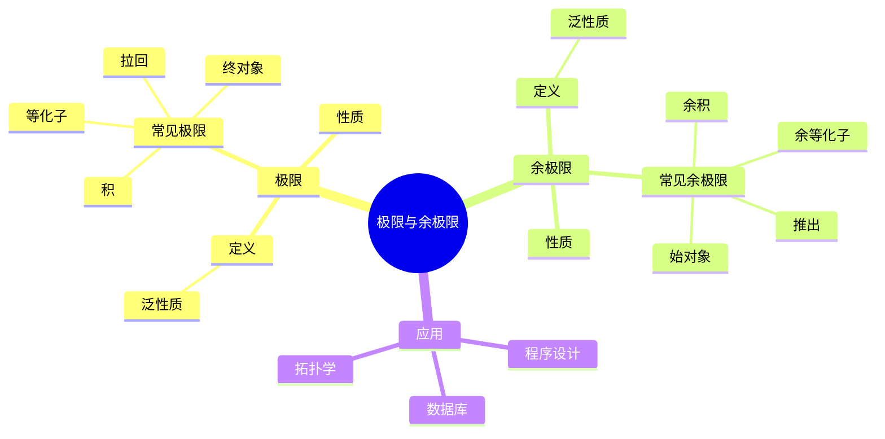
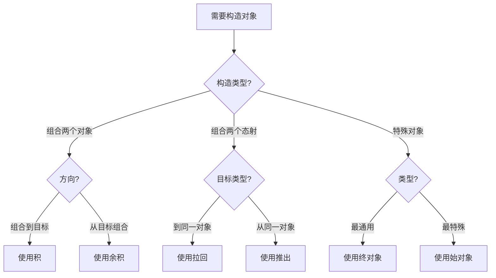
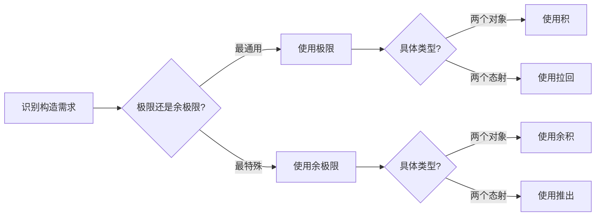
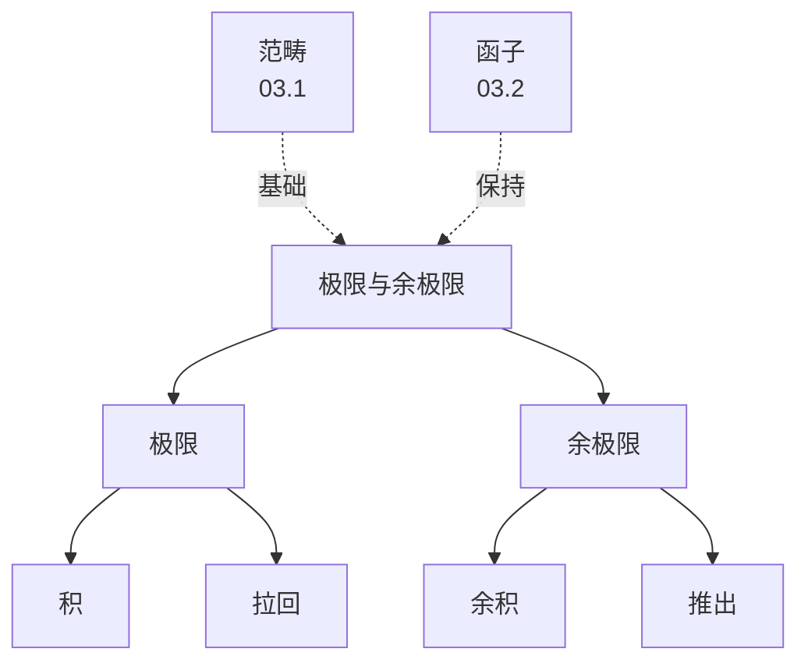
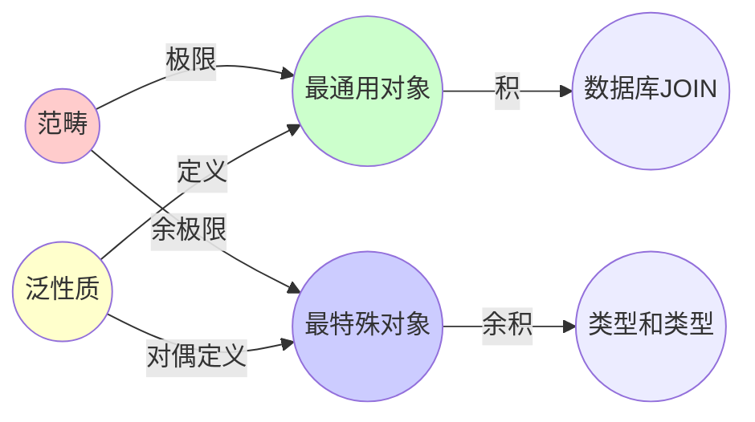
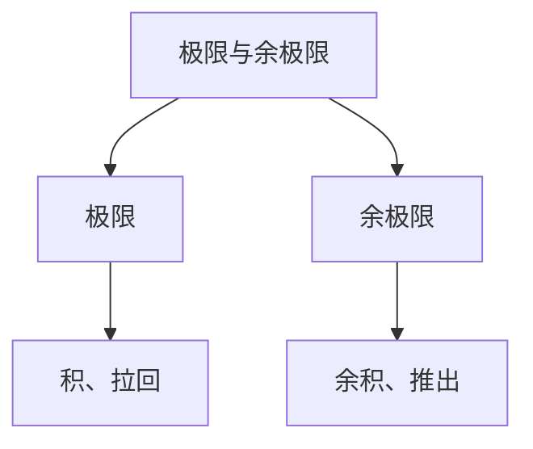

# 03.3 极限与余极限

> **来源**: view08.md
> **创建日期**: 2025-01-27
> **最后更新**: 2025-01-27

## 📋 目录

- [03.3 极限与余极限](#033-极限与余极限)
  - [📋 目录](#-目录)
  - [📋 内容概览](#-内容概览)
  - [🎯 核心理念](#-核心理念)
  - [📊 极限（Limit）](#-极限limit)
    - [定义](#定义)
    - [泛性质](#泛性质)
    - [常见极限](#常见极限)
      - [1. 积（Product）](#1-积product)
      - [2. 等化子（Equalizer）](#2-等化子equalizer)
      - [3. 拉回（Pullback）](#3-拉回pullback)
      - [4. 终对象（Terminal Object）](#4-终对象terminal-object)
  - [🔄 余极限（Colimit）](#-余极限colimit)
    - [定义](#定义-1)
    - [泛性质](#泛性质-1)
    - [常见余极限](#常见余极限)
      - [1. 余积（Coproduct）](#1-余积coproduct)
      - [2. 余等化子（Coequalizer）](#2-余等化子coequalizer)
      - [3. 推出（Pushout）](#3-推出pushout)
      - [4. 始对象（Initial Object）](#4-始对象initial-object)
  - [🎯 极限与余极限的性质](#-极限与余极限的性质)
    - [存在性](#存在性)
    - [保持性](#保持性)
    - [交换性](#交换性)
  - [📈 应用实例](#-应用实例)
    - [数据库设计](#数据库设计)
    - [程序设计](#程序设计)
    - [拓扑学](#拓扑学)
  - [📊 详细案例研究](#-详细案例研究)
    - [案例研究 1：拉回在数据库JOIN操作中的应用](#案例研究-1拉回在数据库join操作中的应用)
    - [案例研究 2：积和余积在函数式编程中的应用](#案例研究-2积和余积在函数式编程中的应用)
    - [案例研究 3：推出在拓扑空间粘合中的应用](#案例研究-3推出在拓扑空间粘合中的应用)
  - [⚠️ 批判性分析与局限性](#️-批判性分析与局限性)
    - [局限性讨论](#局限性讨论)
      - [1. 极限存在性的限制](#1-极限存在性的限制)
      - [2. 计算复杂性问题](#2-计算复杂性问题)
      - [3. 直观理解的困难](#3-直观理解的困难)
    - [改进方向](#改进方向)
      - [1. 提高可计算性](#1-提高可计算性)
      - [2. 增强实际应用](#2-增强实际应用)
  - [📊 思维表征体系](#-思维表征体系)
    - [📊 1. 思维导图（增强版）](#-1-思维导图增强版)
      - [1.1 文本格式（基础版）](#11-文本格式基础版)
      - [1.2 Mermaid格式（可视化版）](#12-mermaid格式可视化版)
    - [📊 2. 多维对比矩阵](#-2-多维对比矩阵)
      - [2.1 极限与余极限对比矩阵](#21-极限与余极限对比矩阵)
      - [2.2 常见极限类型对比矩阵](#22-常见极限类型对比矩阵)
      - [2.3 常见余极限类型对比矩阵](#23-常见余极限类型对比矩阵)
    - [🌲 3. 决策树](#-3-决策树)
      - [3.1 极限类型选择决策树](#31-极限类型选择决策树)
    - [🛤️ 4. 决策逻辑路径](#️-4-决策逻辑路径)
      - [4.1 极限与余极限分析路径](#41-极限与余极限分析路径)
    - [🕸️ 5. 概念关系网络](#️-5-概念关系网络)
      - [5.1 极限与余极限概念关系网络](#51-极限与余极限概念关系网络)
    - [🗺️ 6. 知识图谱](#️-6-知识图谱)
      - [6.1 极限与余极限知识图谱](#61-极限与余极限知识图谱)
  - [📚 理论体系](#-理论体系)
    - [理论基础](#理论基础)
      - [数学基础](#数学基础)
      - [历史发展](#历史发展)
    - [理论框架](#理论框架)
      - [核心假设](#核心假设)
      - [基本概念体系](#基本概念体系)
      - [主要定理/结论](#主要定理结论)
      - [适用范围和边界](#适用范围和边界)
    - [当前知识共识](#当前知识共识)
      - [学术界共识](#学术界共识)
      - [主要争议点](#主要争议点)
      - [权威来源](#权威来源)
    - [与其他理论的关系](#与其他理论的关系)
      - [逻辑关系](#逻辑关系)
      - [映射关系](#映射关系)
  - [🔗 关联网络](#-关联网络)
    - [🔗 概念级关联](#-概念级关联)
      - [核心概念映射](#核心概念映射)
    - [🔗 理论级关联](#-理论级关联)
      - [理论基础](#理论基础-1)
    - [🔗 方法级关联](#-方法级关联)
      - [方法应用网络](#方法应用网络)
    - [🔗 应用场景关联](#-应用场景关联)
  - [🛤️ 学习路径](#️-学习路径)
    - [前置知识](#前置知识)
    - [后续学习](#后续学习)
    - [并行学习](#并行学习)
  - [🔗 相关文档](#-相关文档)
  - [📖 扩展阅读](#-扩展阅读)

---

## 📋 内容概览

本文档详细阐述范畴论中的极限与余极限概念，包括积、余积、拉回、推出等。极限和余极限通过泛性质定义了"最通用"和"最特殊"的对象，是连接不同数学结构的重要工具。

---

## 🎯 核心理念

极限和余极限是范畴论中通过泛性质定义的核心构造。极限是"最通用"的对象，能够统一表示所有满足某种条件的对象。余极限是极限的对偶，是"最特殊"的对象。这种对偶性揭示了数学结构的深层对称性。

## 📊 极限（Limit）

### 定义

**极限**是范畴论中通过泛性质定义的构造，是"最通用"的对象。

### 泛性质

给定函子 F: J → 𝒞（J是索引范畴），F的**极限** lim F 满足：

对任意对象X和自然变换 x: ΔX → F（其中ΔX是常函子），存在唯一态射 u: X → lim F 使得下图交换。

### 常见极限

#### 1. 积（Product）

**定义**：对象A和B的积 A × B

**泛性质**：对任意对象C和态射 f: C → A, g: C → B，存在唯一态射 ⟨f, g⟩: C → A × B

**交换图**：

```text
      C
      |
      | ⟨f, g⟩
      v
A <---π₁--- A × B ---π₂---> B
```

**实例**：

- **Set**：笛卡尔积
- **Grp**：直积
- **Top**：积拓扑

#### 2. 等化子（Equalizer）

**定义**：给定态射 f, g: A → B，等化子 eq(f, g) 是使 f ∘ e = g ∘ e 的"最大"对象

**泛性质**：对任意对象X和态射 h: X → A 使得 f ∘ h = g ∘ h，存在唯一态射 u: X → eq(f, g)

**实例**：

- **Set**：{x ∈ A | f(x) = g(x)}
- **Grp**：核（Kernel）

#### 3. 拉回（Pullback）

**定义**：给定态射 f: A → C, g: B → C，拉回 A ×_C B 是使 f ∘ p₁ = g ∘ p₂ 的"最大"对象

**交换图**：

```text
A ×_C B --p₂--> B
  |              |
 p₁              g
  |              |
  v              v
  A ----f------> C
```

**实例**：

- **Set**：{(a, b) ∈ A × B | f(a) = g(b)}
- **数据库**：JOIN操作

#### 4. 终对象（Terminal Object）

**定义**：对任意对象A，存在唯一态射 !: A → 1

**实例**：

- **Set**：单元素集合 {*}
- **Grp**：平凡群 {e}
- **Top**：单点空间

## 🔄 余极限（Colimit）

### 定义

**余极限**是极限的对偶概念，是"最特殊"的对象。

### 泛性质

给定函子 F: J → 𝒞，F的**余极限** colim F 满足对偶泛性质。

### 常见余极限

#### 1. 余积（Coproduct）

**定义**：对象A和B的余积 A + B

**泛性质**：对任意对象C和态射 f: A → C, g: B → C，存在唯一态射 [f, g]: A + B → C

**交换图**：

```text
A ---i₁---> A + B <---i₂--- B
           ↑
           | [f, g]
           |
           C
```

**实例**：

- **Set**：不交并
- **Grp**：自由积
- **Top**：不交并拓扑

#### 2. 余等化子（Coequalizer）

**定义**：给定态射 f, g: A → B，余等化子 coeq(f, g) 是使 c ∘ f = c ∘ g 的"最小"对象

**实例**：

- **Set**：B的等价类（由 f(a) ~ g(a) 生成）
- **Grp**：商群（Cokernel）

#### 3. 推出（Pushout）

**定义**：给定态射 f: C → A, g: C → B，推出 A +_C B 是使 p₁ ∘ f = p₂ ∘ g 的"最小"对象

**交换图**：

```text
  C ----f------> A
  |              |
  g              p₁
  |              |
  v              v
  B --p₂--> A +_C B
```

**实例**：

- **Set**：不交并的商（由 f(c) ~ g(c) 生成）
- **Top**：空间的粘合

#### 4. 始对象（Initial Object）

**定义**：对任意对象A，存在唯一态射 !: 0 → A

**实例**：

- **Set**：空集 ∅
- **Grp**：平凡群 {e}
- **Top**：空空间

## 🎯 极限与余极限的性质

### 存在性

**定理**：如果范畴𝒞有所有小极限（余极限），则𝒞是**完备的**（**余完备的**）。

### 保持性

**定理**：如果函子 F: 𝒞 → 𝒟 有右伴随，则F保持所有极限。

**对偶**：如果函子 F: 𝒞 → 𝒟 有左伴随，则F保持所有余极限。

### 交换性

**定理**：极限与极限交换，余极限与余极限交换。

## 📈 应用实例

### 数据库设计

**拉回 = JOIN**：

- 表A和表B通过外键关联
- JOIN操作 = 拉回构造
- 保证数据一致性

### 程序设计

**积 = 元组类型**：

- (A, B) = A × B
- 投影 = π₁, π₂

**余积 = 和类型**：

- Either A B = A + B
- 注入 = i₁, i₂

### 拓扑学

**积 = 积拓扑**：

- X × Y 的拓扑 = 积拓扑

**余积 = 不交并拓扑**：

- X + Y 的拓扑 = 不交并拓扑

## 📊 详细案例研究

### 案例研究 1：拉回在数据库JOIN操作中的应用

**背景**：数据库中的JOIN操作本质上是范畴论中的拉回构造。

**形式化分析**：

```text
数据库JOIN:
- 表A: 用户表 (id, name)
- 表B: 订单表 (id, user_id, amount)
- 拉回: A ×_C B = JOIN(A, B, A.id = B.user_id)

泛性质:
- 投影: π₁: JOIN → A, π₂: JOIN → B
- 条件: f ∘ π₁ = g ∘ π₂ (外键约束)
- 唯一性: 保证JOIN结果的一致性

应用效果:
- 保证数据一致性
- 优化查询性能
- 简化数据操作
```

**关键发现**：

- ✅ 拉回构造保证了JOIN的正确性
- ✅ 泛性质保证了唯一性
- ✅ 范畴论为数据库提供了理论基础

**应用价值**：

- ✅ 数据库设计
- ✅ 查询优化
- ✅ 数据一致性保证

### 案例研究 2：积和余积在函数式编程中的应用

**背景**：函数式编程中的元组类型和和类型对应范畴论中的积和余积。

**形式化分析**：

```text
积 (Product):
- 元组类型: (A, B) = A × B
- 投影: fst: (A, B) → A, snd: (A, B) → B
- 构造: pair: A → B → (A, B)

余积 (Coproduct):
- 和类型: Either A B = A + B
- 注入: Left: A → Either A B, Right: B → Either A B
- 析构: either: (A → C) → (B → C) → Either A B → C

泛性质:
- 积: 唯一分解元组
- 余积: 唯一处理Either

应用效果:
- 类型安全
- 代码复用
- 抽象层次提升
```

**关键发现**：

- ✅ 积和余积提供了类型构造的统一框架
- ✅ 泛性质保证了类型的正确性
- ✅ 范畴论为类型系统提供了理论基础

**应用价值**：

- ✅ 函数式编程
- ✅ 类型系统设计
- ✅ 程序验证

### 案例研究 3：推出在拓扑空间粘合中的应用

**背景**：拓扑学中通过推出构造实现空间的粘合。

**形式化分析**：

```text
拓扑空间粘合:
- 空间A, B, C
- 映射: f: C → A, g: C → B
- 推出: A +_C B (粘合空间)

泛性质:
- 投影: p₁: A → A +_C B, p₂: B → A +_C B
- 条件: p₁ ∘ f = p₂ ∘ g (粘合条件)
- 唯一性: 保证粘合的唯一性

应用:
- 流形的构造
- 同伦论
- 代数拓扑
```

**关键发现**：

- ✅ 推出构造提供了空间粘合的统一方法
- ✅ 泛性质保证了粘合的规范性
- ✅ 范畴论为拓扑学提供了抽象框架

**应用价值**：

- ✅ 代数拓扑
- ✅ 几何学
- ✅ 同伦论

## ⚠️ 批判性分析与局限性

### 局限性讨论

#### 1. 极限存在性的限制

**问题**：并非所有范畴都有所有极限。

**挑战**：

- ⚠️ 某些范畴不完备
- ⚠️ 极限构造可能复杂
- ⚠️ 实际计算困难

**应对策略**：

- ✅ 研究完备性条件
- ✅ 使用近似方法
- ✅ 限制到有良好性质的范畴

#### 2. 计算复杂性问题

**问题**：极限和余极限的计算可能非常复杂。

**挑战**：

- ⚠️ 高维极限计算困难
- ⚠️ 大型图表难以处理
- ⚠️ 实际应用效率限制

**改进方向**：

- ✅ 开发高效算法
- ✅ 利用特殊性质
- ✅ 使用近似方法

#### 3. 直观理解的困难

**问题**：泛性质的概念对初学者可能难以理解。

**挑战**：

- ⚠️ 抽象程度高
- ⚠️ 需要数学背景
- ⚠️ 实际应用转化困难

**改进方向**：

- ✅ 提供具体实例
- ✅ 建立直观理解
- ✅ 开发教学工具

### 改进方向

#### 1. 提高可计算性

**目标**：使极限和余极限更易计算。

**方法**：

- 开发计算工具
- 设计高效算法
- 利用计算机辅助

#### 2. 增强实际应用

**目标**：促进极限和余极限在实际问题中的应用。

**方法**：

- 提供应用案例
- 开发实用工具
- 建立应用框架

## 📊 思维表征体系

### 📊 1. 思维导图（增强版）

#### 1.1 文本格式（基础版）

```text
极限与余极限
├── 极限（Limit）
│   ├── 定义
│   │   └── 泛性质
│   ├── 常见极限
│   │   ├── 积（Product）
│   │   │   ├── 定义
│   │   │   ├── 泛性质
│   │   │   └── 实例
│   │   ├── 等化子（Equalizer）
│   │   │   ├── 定义
│   │   │   ├── 泛性质
│   │   │   └── 实例
│   │   ├── 拉回（Pullback）
│   │   │   ├── 定义
│   │   │   ├── 泛性质
│   │   │   └── 实例
│   │   └── 终对象（Terminal Object）
│   │       ├── 定义
│   │       └── 实例
│   └── 性质
│       ├── 存在性
│       ├── 保持性
│       └── 交换性
├── 余极限（Colimit）
│   ├── 定义
│   │   └── 泛性质（对偶）
│   ├── 常见余极限
│   │   ├── 余积（Coproduct）
│   │   │   ├── 定义
│   │   │   ├── 泛性质
│   │   │   └── 实例
│   │   ├── 余等化子（Coequalizer）
│   │   │   ├── 定义
│   │   │   └── 实例
│   │   ├── 推出（Pushout）
│   │   │   ├── 定义
│   │   │   ├── 泛性质
│   │   │   └── 实例
│   │   └── 始对象（Initial Object）
│   │       ├── 定义
│   │       └── 实例
│   └── 性质
│       ├── 存在性
│       ├── 保持性
│       └── 交换性
└── 应用
    ├── 数据库设计（拉回=JOIN）
    ├── 程序设计（积=元组，余积=和类型）
    └── 拓扑学（积=积拓扑，余积=不交并拓扑）
```

#### 1.2 Mermaid格式（可视化版）



### 📊 2. 多维对比矩阵

#### 2.1 极限与余极限对比矩阵

| 维度 | 极限 | 余极限 | 关系类型 | 说明 |
|------|------|--------|---------|------|
| **性质** | 最通用 | 最特殊 | 对偶 | 对偶关系 |
| **方向** | 反向 | 正向 | 相反 | 方向相反 |
| **泛性质** | 存在唯一映射到 | 存在唯一映射自 | 对偶 | 对偶泛性质 |
| **典型实例** | 积、拉回 | 余积、推出 | 对偶 | 对偶实例 |
| **应用** | 数据库JOIN | 空间粘合 | 不同 | 应用不同 |
| **计算复杂度** | 中 | 中 | 相似 | 复杂度相似 |

#### 2.2 常见极限类型对比矩阵

| 维度 | 积 | 等化子 | 拉回 | 终对象 | 应用场景 |
|------|----|--------|------|--------|----------|
| **定义域** | 两个对象 | 两个态射 | 两个态射到同一对象 | 空 | 不同 |
| **复杂度** | 低 | 中 | 中 | 低 | 积和终对象最简单 |
| **应用广度** | 很广 | 中 | 很广 | 广 | 积和拉回应用最广 |
| **直观性** | 高 | 中 | 中 | 高 | 积和终对象最直观 |
| **计算性** | 高 | 中 | 中 | 高 | 积和终对象最可计算 |

#### 2.3 常见余极限类型对比矩阵

| 维度 | 余积 | 余等化子 | 推出 | 始对象 | 应用场景 |
|------|------|---------|------|--------|----------|
| **定义域** | 两个对象 | 两个态射 | 两个态射从同一对象 | 空 | 不同 |
| **复杂度** | 低 | 中 | 中 | 低 | 余积和始对象最简单 |
| **应用广度** | 很广 | 中 | 广 | 广 | 余积应用最广 |
| **直观性** | 高 | 中 | 中 | 高 | 余积和始对象最直观 |
| **计算性** | 高 | 中 | 中 | 高 | 余积和始对象最可计算 |

### 🌲 3. 决策树

#### 3.1 极限类型选择决策树



### 🛤️ 4. 决策逻辑路径

#### 4.1 极限与余极限分析路径



### 🕸️ 5. 概念关系网络

#### 5.1 极限与余极限概念关系网络



### 🗺️ 6. 知识图谱

#### 6.1 极限与余极限知识图谱



## 📚 理论体系

### 理论基础

#### 数学基础

极限与余极限的理论基础：

**1. 范畴论基础**：

- 范畴的定义
- 函子理论
- 泛性质理论

**2. 对偶性理论**：

- 范畴的对偶
- 极限与余极限的对偶
- 对偶原理

**3. 表示理论**：

- Yoneda引理
- 可表示函子
- 极限的存在性

#### 历史发展

**关键时间节点**：

- **1950-1960年代**：极限理论的系统化
  - 极限的范畴化定义
  - 泛性质的概念

- **1960-1970年代**：对偶性理论
  - 余极限的概念
  - 对偶原理

- **1970-1980年代**：完备性理论
  - 完备范畴
  - 极限的存在性定理

- **1980-1990年代**：计算机科学应用
  - 类型论中的极限
  - 数据库中的拉回

- **2000年代至今**：应用扩展
  - 机器学习中的极限
  - 分布式系统中的极限

### 理论框架

#### 核心假设

**假设1：泛性质的存在性**

- **内容**：极限通过泛性质唯一确定
- **适用范围**：满足泛性质的对象
- **限制条件**：需要验证泛性质

**假设2：对偶性**

- **内容**：极限与余极限对偶
- **适用范围**：所有极限构造
- **限制条件**：需要理解对偶

**假设3：完备性**

- **内容**：某些范畴有所有极限
- **适用范围**：完备范畴
- **限制条件**：不是所有范畴都完备

#### 基本概念体系



#### 主要定理/结论

**定理1：极限的唯一性**

- **内容**：泛性质唯一确定极限
- **证据**：泛性质的定义
- **应用**：验证极限

**定理2：函子保持极限**

- **内容**：有右伴随的函子保持极限
- **证据**：伴随理论
- **应用**：计算极限

**结论3：对偶性原理**

- **内容**：极限的对偶是余极限
- **证据**：对偶理论
- **应用**：通过对偶理解

#### 适用范围和边界

**适用范围**：

- 完备或余完备的范畴
- 需要通用构造的场景
- 数据库、类型系统

**边界条件**：

- 需要明确的范畴结构
- 需要满足泛性质
- 需要抽象思维能力

**不适用场景**：

- 无泛性质的对象
- 具体计算（需转换为具体构造）
- 需要细节的场景

### 当前知识共识

#### 学术界共识

**广泛接受的共识**：

1. **极限的重要性**
   - **共识**：极限是范畴论的核心构造
   - **支持证据**：广泛的应用
   - **来源**：数学、计算机科学

2. **对偶性的价值**
   - **共识**：对偶性揭示了深层对称性
   - **支持证据**：大量对偶实例
   - **来源**：范畴论、数学

3. **应用的有效性**
   - **共识**：极限在数据库和类型系统中有效
   - **支持证据**：成功应用案例
   - **来源**：应用研究

#### 主要争议点

1. **计算性**
   - **观点A**：极限应该可计算
   - **观点B**：主要是概念性的
   - **当前状态**：多数支持发展计算性

2. **完备性的重要性**
   - **观点A**：完备性非常重要
   - **观点B**：不需要所有极限
   - **当前状态**：多数认为根据应用需求

#### 权威来源

**经典文献**：

- 《Category Theory》- Steve Awodey
- 《Basic Category Theory》- Tom Leinster
- 《Categories for the Working Mathematician》- Saunders Mac Lane

**权威机构/专家**：

- **范畴论研究组**
- **理论计算机科学学会**
- **类型论研究组**

**最新发展**：

- **2020-2024**：计算极限、机器学习中的极限、分布式系统中的极限
- **前沿方向**：高阶极限、无穷极限

### 与其他理论的关系

#### 逻辑关系

**理论基础**：

- **范畴论基础**（[03.1_范畴论基础.md](03.1_范畴论基础.md)） → 极限与余极限
  - 关系类型：直接扩展
  - 关键映射：范畴 → 极限

**理论应用**：

- 极限与余极限 → 应用（[03.4_数据库设计中的范畴论.md](03.4_数据库设计中的范畴论.md)）
  - 应用方式：数据库JOIN、类型系统
  - 应用效果：统一理解和设计

#### 映射关系

| 本理论概念 | 映射理论 | 映射概念 | 映射类型 | 映射说明 |
|-----------|---------|---------|---------|----------|
| **积** | 03.1_范畴论基础.md | 积 | 对应 | 极限的实例 |
| **拉回** | 03.4_数据库设计中的范畴论.md | JOIN | 应用 | 拉回用于JOIN |
| **余积** | 03.1_范畴论基础.md | 余积 | 对应 | 余极限的实例 |
| **泛性质** | 03.1_范畴论基础.md | 定义方式 | 基础 | 泛性质定义极限 |

## 🔗 关联网络

### 🔗 概念级关联

#### 核心概念映射

| 本文档概念 | 关联文档 | 关联概念 | 关系类型 | 映射说明 |
|-----------|---------|---------|---------|----------|
| **积** | 03.1_范畴论基础.md | 积 | 对应 | 极限的实例 |
| **拉回** | 03.4_数据库设计中的范畴论.md | JOIN | 应用 | 拉回用于JOIN |
| **余积** | 03.1_范畴论基础.md | 余积 | 对应 | 余极限的实例 |
| **推出** | 03.5_编程语言语义的范畴化.md | 空间粘合 | 应用 | 推出用于粘合 |
| **泛性质** | 03.1_范畴论基础.md | 定义方式 | 基础 | 泛性质定义极限 |
| **对偶性** | 03.1_范畴论基础.md | 对偶 | 基础 | 对偶原理 |
| **完备性** | 03.1_范畴论基础.md | 范畴性质 | 基础 | 完备性定义 |

### 🔗 理论级关联

#### 理论基础

- **本理论基于**：
  - [03.1_范畴论基础.md](03.1_范畴论基础.md) ⭐⭐⭐ - 范畴论基础
  - [03.2_函子与自然变换.md](03.2_函子与自然变换.md) ⭐⭐ - 函子理论

- **本理论应用于**：
  - [03.4_数据库设计中的范畴论.md](03.4_数据库设计中的范畴论.md) ⭐⭐⭐ - 数据库应用
  - [03.5_编程语言语义的范畴化.md](03.5_编程语言语义的范畴化.md) ⭐⭐ - 编程语言应用
  - [09_Curry-Howard同构](../09_Curry-Howard同构/) ⭐⭐ - 类型论应用

### 🔗 方法级关联

#### 方法应用网络

| 本文档方法 | 应用文档 | 应用场景 | 应用效果 |
|-----------|---------|---------|---------|
| **拉回** | 03.4_数据库设计中的范畴论.md | 数据库JOIN | 成功 |
| **积** | 03.5_编程语言语义的范畴化.md | 类型积 | 成功 |
| **余积** | 03.5_编程语言语义的范畴化.md | 和类型 | 成功 |

### 🔗 应用场景关联

**场景**：数据库查询设计

| 视角 | 关联文档 | 核心理论 | 关注点 |
|------|---------|---------|--------|
| **数据表关系** | 03.4_数据库设计中的范畴论.md | 范畴结构 | 表结构 |
| **JOIN操作** | 本文档 | 拉回 | JOIN实现 |
| **查询优化** | 03.4_数据库设计中的范畴论.md | 极限保持 | 优化策略 |

## 🛤️ 学习路径

### 前置知识

**必须先学习**：

- [03.1_范畴论基础.md](03.1_范畴论基础.md) ⭐⭐⭐ - 范畴论基础
- [03.2_函子与自然变换.md](03.2_函子与自然变换.md) ⭐⭐ - 函子理论

**建议先了解**：

- 基础范畴论
- 泛性质的概念

### 后续学习

**建议接下来学习**（按顺序）：

1. [03.4_数据库设计中的范畴论.md](03.4_数据库设计中的范畴论.md) ⭐⭐⭐ - 数据库应用
2. [03.5_编程语言语义的范畴化.md](03.5_编程语言语义的范畴化.md) ⭐⭐ - 编程语言应用
3. [09_Curry-Howard同构](../09_Curry-Howard同构/) ⭐⭐ - 类型论应用

### 并行学习

**可以同时学习**：

- [03.6_量子计算中的范畴论.md](03.6_量子计算中的范畴论.md) - 量子计算应用
- [09_Curry-Howard同构](../09_Curry-Howard同构/) - 类型论应用

## 🔗 相关文档

- [03.1_范畴论基础.md](03.1_范畴论基础.md)
- [03.2_函子与自然变换.md](03.2_函子与自然变换.md)
- [03.4_数据库设计中的范畴论.md](03.4_数据库设计中的范畴论.md)
- [03.5_编程语言语义的范畴化.md](03.5_编程语言语义的范畴化.md)

## 📖 扩展阅读

- 《Category Theory》- Steve Awodey
- 《Basic Category Theory》- Tom Leinster
- Wikipedia: [Limit (Category Theory)](https://en.wikipedia.org/wiki/Limit_(category_theory))
- Wikipedia: [Colimit](https://en.wikipedia.org/wiki/Colimit)
- Wikipedia: [Pullback (Category Theory)](https://en.wikipedia.org/wiki/Pullback_(category_theory))
