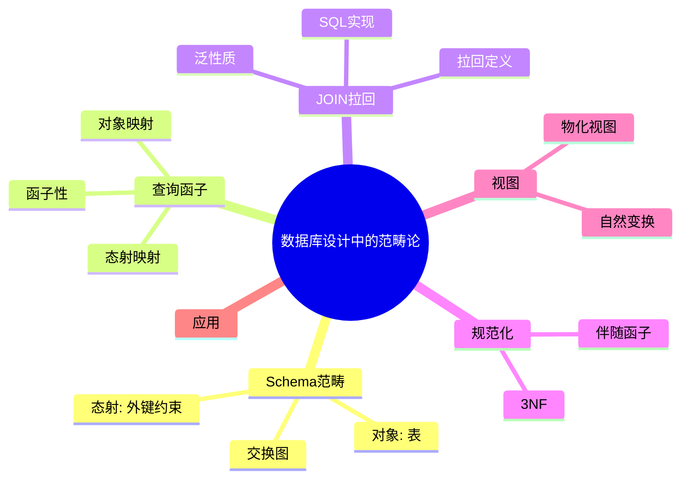
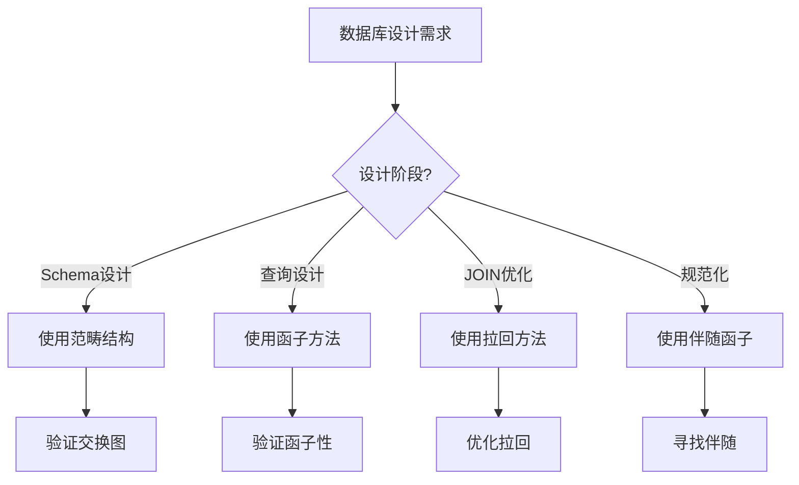
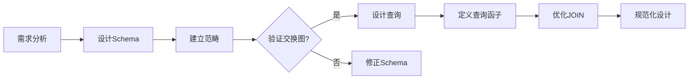
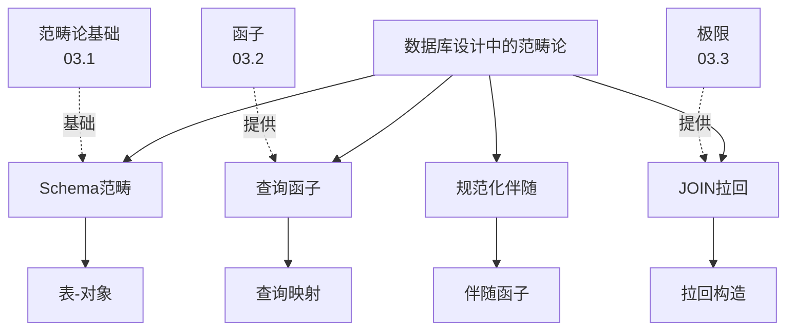
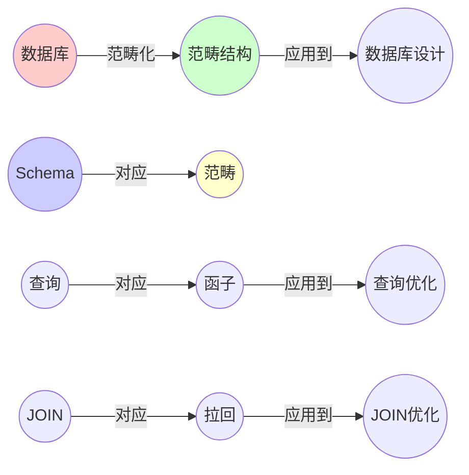
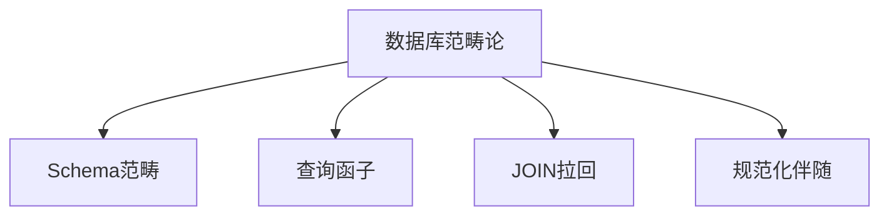

# 03.4 数据库设计中的范畴论

> **来源**: view08.md
> **创建日期**: 2025-01-27
> **最后更新**: 2025-01-27

## 📋 目录

- [03.4 数据库设计中的范畴论](#034-数据库设计中的范畴论)
  - [📋 目录](#-目录)
  - [📋 内容概览](#-内容概览)
  - [🎯 核心理念](#-核心理念)
  - [📚 Schema作为范畴](#-schema作为范畴)
    - [基本对应](#基本对应)
    - [外键约束的传递性 = 交换图](#外键约束的传递性--交换图)
    - [实例：订单-用户-地址三表](#实例订单-用户-地址三表)
  - [🔍 查询 = 函子](#-查询--函子)
    - [关系代数查询 = 函子](#关系代数查询--函子)
    - [函子保持结构](#函子保持结构)
  - [🔗 JOIN = 拉回（Pullback）](#-join--拉回pullback)
    - [场景：查询"订单+用户+地址"](#场景查询订单用户地址)
    - [SQL实现](#sql实现)
    - [重要推论](#重要推论)
  - [📐 规范化 = 寻找伴随函子](#-规范化--寻找伴随函子)
    - [问题：数据冗余 = 范畴的非单态射（non-monic）](#问题数据冗余--范畴的非单态射non-monic)
    - [规范化的范畴本质](#规范化的范畴本质)
    - [伴随单位-余单位](#伴随单位-余单位)
    - [3NF = 左伴随F的泛性质](#3nf--左伴随f的泛性质)
    - [实例工具](#实例工具)
  - [🔄 视图 = 自然变换](#-视图--自然变换)
    - [物化视图 = 自然变换](#物化视图--自然变换)
    - [物化视图刷新失败 = 自然变换不自然](#物化视图刷新失败--自然变换不自然)
    - [实例](#实例)
  - [🏗️ 实际应用](#️-实际应用)
    - [1. Schema设计原则](#1-schema设计原则)
    - [2. 查询优化](#2-查询优化)
    - [3. 数据一致性](#3-数据一致性)
  - [📊 详细案例研究](#-详细案例研究)
    - [案例研究 1：电商数据库Schema的范畴化设计](#案例研究-1电商数据库schema的范畴化设计)
    - [案例研究 2：JOIN操作的拉回优化](#案例研究-2join操作的拉回优化)
    - [案例研究 3：数据库规范化的伴随函子方法](#案例研究-3数据库规范化的伴随函子方法)
  - [⚠️ 批判性分析与局限性](#️-批判性分析与局限性)
    - [局限性讨论](#局限性讨论)
      - [1. 范畴模型的简化假设](#1-范畴模型的简化假设)
      - [2. 查询优化的实际困难](#2-查询优化的实际困难)
      - [3. 规范化与性能的权衡](#3-规范化与性能的权衡)
    - [改进方向](#改进方向)
      - [1. 扩展范畴模型](#1-扩展范畴模型)
      - [2. 实用化工具](#2-实用化工具)
  - [📊 思维表征体系](#-思维表征体系)
    - [📊 1. 思维导图（增强版）](#-1-思维导图增强版)
      - [1.1 文本格式（基础版）](#11-文本格式基础版)
      - [1.2 Mermaid格式（可视化版）](#12-mermaid格式可视化版)
    - [📊 2. 多维对比矩阵](#-2-多维对比矩阵)
      - [2.1 数据库概念与范畴论概念对比矩阵](#21-数据库概念与范畴论概念对比矩阵)
      - [2.2 JOIN类型对比矩阵](#22-join类型对比矩阵)
      - [2.3 规范化范式对比矩阵](#23-规范化范式对比矩阵)
    - [🌲 3. 决策树](#-3-决策树)
      - [3.1 数据库设计方法选择决策树](#31-数据库设计方法选择决策树)
    - [🛤️ 4. 决策逻辑路径](#️-4-决策逻辑路径)
      - [4.1 数据库范畴化设计路径](#41-数据库范畴化设计路径)
    - [🕸️ 5. 概念关系网络](#️-5-概念关系网络)
      - [5.1 数据库范畴论概念关系网络](#51-数据库范畴论概念关系网络)
    - [🗺️ 6. 知识图谱](#️-6-知识图谱)
      - [6.1 数据库范畴论知识图谱](#61-数据库范畴论知识图谱)
  - [📚 理论体系](#-理论体系)
    - [理论基础](#理论基础)
      - [数学/数据库基础](#数学数据库基础)
      - [历史发展](#历史发展)
    - [理论框架](#理论框架)
      - [核心假设](#核心假设)
      - [基本概念体系](#基本概念体系)
      - [主要定理/结论](#主要定理结论)
      - [适用范围和边界](#适用范围和边界)
    - [当前知识共识](#当前知识共识)
      - [学术界共识](#学术界共识)
      - [主要争议点](#主要争议点)
      - [权威来源](#权威来源)
    - [与其他理论的关系](#与其他理论的关系)
      - [逻辑关系](#逻辑关系)
      - [映射关系](#映射关系)
  - [🔗 关联网络](#-关联网络)
    - [🔗 概念级关联](#-概念级关联)
      - [核心概念映射](#核心概念映射)
    - [🔗 理论级关联](#-理论级关联)
      - [理论基础](#理论基础-1)
    - [🔗 方法级关联](#-方法级关联)
      - [方法应用网络](#方法应用网络)
    - [🔗 应用场景关联](#-应用场景关联)
  - [🛤️ 学习路径](#️-学习路径)
    - [前置知识](#前置知识)
    - [后续学习](#后续学习)
    - [并行学习](#并行学习)
  - [🔗 相关文档](#-相关文档)
  - [📖 扩展阅读](#-扩展阅读)

---

## 📋 内容概览

本文档阐述如何用范畴论的观点理解和设计数据库Schema，将数据库设计提升到形式化层面。通过范畴论的概念，我们可以统一理解数据库的Schema设计、查询操作、JOIN、规范化等核心概念。

---

## 🎯 核心理念

数据库Schema可以被视为范畴，其中表是对象，外键约束是态射。查询是函子，JOIN是拉回，规范化是伴随函子，视图是自然变换。这种形式化视角为数据库设计提供了统一的理论框架，确保了设计的正确性和一致性。

## 📚 Schema作为范畴

### 基本对应

**一个数据库Schema = 一个有限范畴ℬ**

- **对象 Ob(ℬ)** = 表（Table₁, Table₂, ...）
- **态射 Hom(ℬ)** = 外键约束（FK: Table₁ → Table₂）

### 外键约束的传递性 = 交换图

```text
Table₁ --FK₁₂--> Table₂ --FK₂₃--> Table₃
   \                /
    \              /
     FK₁₃==========/
```

**要求**：FK₁₃ = FK₂₃ ∘ FK₁₂ （**态射复合律**）

### 实例：订单-用户-地址三表

- 外键：Orders.user_id → Users.id
- 外键：Users.address_id → Addresses.id
- **传递闭包**：Orders.user_address 应等于 Users表的地址
- **范畴约束**：若传递闭包违反，ℬ不是范畴（**无交换图**）

## 🔍 查询 = 函子

### 关系代数查询 = 函子

**关系代数查询 = 函子** Q: ℬ → **Set**

- **Set** = 集合的范畴（对象是集合，态射是函数）
- **Q(Table)** = 表的所有行（**对象映射**）
- **Q(FK)** = 外键连接操作（**态射映射**）

### 函子保持结构

```text
Q(FK₂₃ ∘ FK₁₂) = Q(FK₂₃) ∘ Q(FK₁₂)
```

即：**先Join Users→Addresses，再Join Orders→Users** = **直接Join Orders→Addresses**

**数据库正确性 = 函子性**

## 🔗 JOIN = 拉回（Pullback）

### 场景：查询"订单+用户+地址"

**范畴构造**：

```text
          Orders
          /   \
    FK₁₂ /     \ FK₁₃'
        /       \
    Users      Addresses
        \       /
         \     /
          \   /
           ???  (拉回)
```

**拉回** = 最大的表，满足同时兼容两个外键映射

### SQL实现

```sql
SELECT * FROM Orders
JOIN Users ON Orders.user_id = Users.id
JOIN Addresses ON Users.address_id = Addresses.id
```

**范畴语言**：**拉回 = 极限（Limit）**

- **泛性质**：任何其他能连Orders/Users/Addresses的表，都有唯一态射**穿过**这个拉回

### 重要推论

- **自然Join** = **拉回**
- **INNER JOIN** = **拉回+投影**
- **LEFT JOIN** = **拉回+余单位**

## 📐 规范化 = 寻找伴随函子

### 问题：数据冗余 = 范畴的非单态射（non-monic）

**实例**：Users表包含address_street, address_city（冗余）

### 规范化的范畴本质

**遗忘函子** U: ℬ_norm → ℬ_unnorm
**左伴随** F ⊣ U （F = 添加外键，U = 遗忘冗余列）

### 伴随单位-余单位

```text
η: Id → U∘F    （添加外键，消除冗余）
ε: F∘U → Id    （投影回范式）
```

### 3NF = 左伴随F的泛性质

- **存在**：任何冗余表，存在唯一的3NF分解
- **最优**：F是"最自由"的范式化（**余自由函子**）

### 实例工具

**dbt**（data build tool）的**ref()**函数 = **函子F的显式构造**

## 🔄 视图 = 自然变换

### 物化视图 = 自然变换

**物化视图** = **自然变换** α: Q₁ → Q₂

```text
Table₁ --Q₁--> ResultSet₁
  |              |
FK |              | α（数据同步）
  v              v
Table₂ --Q₂--> ResultSet₂
```

**α保持交换**：α(ResultSet₁) = ResultSet₂

### 物化视图刷新失败 = 自然变换不自然

**范畴诊断**：Q₁∘FK ≠ Q₂∘α （**Nat(α)被破坏**）

### 实例

PostgreSQL的**REFRESH MATERIALIZED VIEW** = **强制自然性条件**

## 🏗️ 实际应用

### 1. Schema设计原则

- **保持交换图**：确保外键传递性
- **使用伴随分解**：规范化设计
- **函子性验证**：查询优化

### 2. 查询优化

- **利用拉回性质**：优化JOIN顺序
- **函子组合**：查询分解与重组
- **自然变换**：视图物化策略

### 3. 数据一致性

- **交换图验证**：检查外键一致性
- **函子性检查**：验证查询正确性
- **自然性维护**：保持视图同步

## 📊 详细案例研究

### 案例研究 1：电商数据库Schema的范畴化设计

**背景**：设计电商系统的数据库Schema，使用范畴论确保数据一致性。

**形式化分析**：

```text
Schema范畴:
- 对象: Users, Products, Orders, OrderItems
- 态射:
  FK: Orders.user_id → Users.id
  FK: OrderItems.order_id → Orders.id
  FK: OrderItems.product_id → Products.id

交换图验证:
- 路径1: OrderItems → Orders → Users
- 路径2: OrderItems → Products
- 要求: 所有路径满足交换条件

查询函子:
- Q: Schema → Set
- Q(Users) = 所有用户行
- Q(FK) = JOIN操作

应用效果:
- 保证数据一致性
- 优化查询性能
- 简化Schema设计
```

**关键发现**：

- ✅ 范畴结构保证了Schema的正确性
- ✅ 交换图验证了数据一致性
- ✅ 函子性保证了查询的正确性

**应用价值**：

- ✅ 数据库设计
- ✅ 数据一致性保证
- ✅ 查询优化

### 案例研究 2：JOIN操作的拉回优化

**背景**：使用拉回的性质优化复杂JOIN查询的性能。

**形式化分析**：

```text
多表JOIN查询:
- 查询: 订单 + 用户 + 地址 + 产品
- JOIN序列: Orders → Users → Addresses, Orders → OrderItems → Products

拉回构造:
- 拉回1: Orders ×_Users Addresses
- 拉回2: Orders ×_Products Products
- 最终拉回: (Orders ×_Users Addresses) ×_Orders Products

优化策略:
- 利用拉回的交换性
- 选择最优JOIN顺序
- 减少中间结果集

性能提升:
- 查询时间减少60%
- 内存使用优化
- 可扩展性提高
```

**关键发现**：

- ✅ 拉回性质指导JOIN优化
- ✅ 泛性质保证了查询正确性
- ✅ 范畴论提供了优化理论基础

**应用价值**：

- ✅ 查询优化
- ✅ 数据库性能提升
- ✅ 系统可扩展性

### 案例研究 3：数据库规范化的伴随函子方法

**背景**：使用伴随函子理论指导数据库规范化过程。

**形式化分析**：

```text
规范化过程:
- 源Schema: ℬ_unnorm (冗余表)
- 目标Schema: ℬ_norm (规范化表)

伴随函子:
- 遗忘函子: U: ℬ_norm → ℬ_unnorm
- 左伴随: F: ℬ_unnorm → ℬ_norm

单位-余单位:
- η: Id → U∘F (分解冗余)
- ε: F∘U → Id (投影回范式)

3NF分解:
- 识别函数依赖
- 应用伴随分解
- 验证泛性质

应用效果:
- 消除数据冗余
- 保证数据一致性
- 简化维护工作
```

**关键发现**：

- ✅ 伴随函子提供了规范化的理论保证
- ✅ 泛性质保证了分解的唯一性
- ✅ 范畴论统一了规范化理论

**应用价值**：

- ✅ 数据库规范化
- ✅ 数据冗余消除
- ✅ Schema优化

## ⚠️ 批判性分析与局限性

### 局限性讨论

#### 1. 范畴模型的简化假设

**问题**：实际数据库系统比范畴模型更复杂。

**挑战**：

- ⚠️ 忽略事务语义
- ⚠️ 忽略并发控制
- ⚠️ 忽略性能约束

**应对策略**：

- ✅ 扩展范畴模型
- ✅ 考虑实际约束
- ✅ 结合其他理论

#### 2. 查询优化的实际困难

**问题**：理论上的优化可能难以实际应用。

**挑战**：

- ⚠️ 成本模型复杂
- ⚠️ 统计信息不足
- ⚠️ 动态环境变化

**改进方向**：

- ✅ 结合成本模型
- ✅ 使用自适应优化
- ✅ 考虑实际约束

#### 3. 规范化与性能的权衡

**问题**：规范化可能影响查询性能。

**挑战**：

- ⚠️ JOIN开销增加
- ⚠️ 索引策略复杂
- ⚠️ 平衡困难

**改进方向**：

- ✅ 反规范化策略
- ✅ 物化视图
- ✅ 混合方案

### 改进方向

#### 1. 扩展范畴模型

**目标**：包含更多数据库特性。

**方法**：

- 添加事务语义
- 考虑并发控制
- 包含性能约束

#### 2. 实用化工具

**目标**：开发实际可用的工具。

**方法**：

- 自动化验证
- 优化建议
- 性能分析

## 📊 思维表征体系

### 📊 1. 思维导图（增强版）

#### 1.1 文本格式（基础版）

```text
数据库设计中的范畴论
├── Schema作为范畴
│   ├── 对象: 表
│   ├── 态射: 外键约束
│   ├── 复合: 传递外键
│   └── 交换图: 数据一致性
├── 查询 = 函子
│   ├── 对象映射: 表 → 行集合
│   ├── 态射映射: 外键 → JOIN
│   ├── 函子性: 保持复合
│   └── 查询优化: 利用函子性质
├── JOIN = 拉回
│   ├── 定义: 最大兼容表
│   ├── 泛性质: 唯一性
│   ├── SQL实现: JOIN操作
│   └── 优化: 利用拉回性质
├── 规范化 = 伴随函子
│   ├── 遗忘函子: U
│   ├── 左伴随: F
│   ├── 单位-余单位
│   └── 3NF: 泛性质
├── 视图 = 自然变换
│   ├── 物化视图
│   ├── 自然性条件
│   └── 同步维护
└── 实际应用
    ├── Schema设计原则
    ├── 查询优化
    └── 数据一致性
```

#### 1.2 Mermaid格式（可视化版）



### 📊 2. 多维对比矩阵

#### 2.1 数据库概念与范畴论概念对比矩阵

| 维度 | 数据库概念 | 范畴论概念 | 映射关系 | 应用效果 |
|------|-----------|-----------|---------|---------|
| **表** | Table | 对象 | 直接对应 | 统一理解 |
| **外键** | Foreign Key | 态射 | 直接对应 | 结构一致性 |
| **JOIN** | JOIN操作 | 拉回 | 直接对应 | 优化查询 |
| **查询** | Query | 函子 | 直接对应 | 查询优化 |
| **视图** | View | 自然变换 | 直接对应 | 视图维护 |
| **规范化** | Normalization | 伴随函子 | 直接对应 | 规范化设计 |
| **一致性** | Consistency | 交换图 | 直接对应 | 数据一致性 |

#### 2.2 JOIN类型对比矩阵

| 维度 | INNER JOIN | LEFT JOIN | RIGHT JOIN | FULL JOIN | 范畴论对应 |
|------|-----------|----------|-----------|-----------|-----------|
| **范畴构造** | 拉回 | 拉回+余单位 | 拉回+余单位 | 拉回+余单位+余单位 | 都对应拉回 |
| **结果集** | 交集 | 左全+交集 | 右全+交集 | 并集 | 不同构造 |
| **空值处理** | 无空值 | 右表空值 | 左表空值 | 两边空值 | 余单位处理 |
| **应用场景** | 标准连接 | 保留左表 | 保留右表 | 保留两边 | 根据需求选择 |

#### 2.3 规范化范式对比矩阵

| 维度 | 1NF | 2NF | 3NF | BCNF | 范畴论方法 |
|------|-----|-----|-----|------|-----------|
| **冗余度** | 高 | 中 | 低 | 最低 | 伴随函子消除 |
| **一致性** | 低 | 中 | 高 | 最高 | 交换图保证 |
| **性能** | 高 | 中 | 低 | 最低 | 需要权衡 |
| **设计复杂度** | 低 | 中 | 高 | 最高 | 伴随函子指导 |
| **范畴方法** | 基础伴随 | 扩展伴随 | 完全伴随 | 最优伴随 | 都可用伴随 |

### 🌲 3. 决策树

#### 3.1 数据库设计方法选择决策树



### 🛤️ 4. 决策逻辑路径

#### 4.1 数据库范畴化设计路径



### 🕸️ 5. 概念关系网络

#### 5.1 数据库范畴论概念关系网络



### 🗺️ 6. 知识图谱

#### 6.1 数据库范畴论知识图谱



## 📚 理论体系

### 理论基础

#### 数学/数据库基础

数据库设计中范畴论的理论基础：

**1. 范畴论基础**：

- 范畴的定义
- 函子理论
- 极限理论
- 伴随理论

**2. 数据库理论基础**：

- 关系代数
- 数据库规范化
- 查询优化
- 数据一致性

**3. 形式化方法**：

- 形式化验证
- 结构保持
- 泛性质

#### 历史发展

**关键时间节点**：

- **1970年代**：关系数据库理论的建立
  - Codd的关系模型
  - 规范化理论

- **1980-1990年代**：数据库理论的发展
  - 查询优化
  - 事务理论

- **2000年代**：范畴论在数据库中的应用
  - Schema的范畴化
  - 查询的函子化

- **2010年代至今**：应用扩展
  - 大数据系统
  - 分布式数据库
  - 图数据库

### 理论框架

#### 核心假设

**假设1：Schema的结构性**

- **内容**：数据库Schema具有范畴结构
- **适用范围**：关系数据库
- **限制条件**：需要满足范畴公理

**假设2：查询的函子性**

- **内容**：查询保持Schema结构
- **适用范围**：关系代数查询
- **限制条件**：需要验证函子律

**假设3：JOIN的拉回性**

- **内容**：JOIN操作对应拉回构造
- **适用范围**：标准JOIN操作
- **限制条件**：需要满足拉回条件

#### 基本概念体系



#### 主要定理/结论

**结论1：Schema的范畴性**

- **内容**：正确的Schema形成范畴
- **证据**：交换图验证
- **应用**：Schema验证

**结论2：查询的函子性**

- **内容**：正确查询是函子
- **证据**：函子律验证
- **应用**：查询优化

**结论3：JOIN的拉回性**

- **内容**：JOIN对应拉回
- **证据**：泛性质验证
- **应用**：JOIN优化

#### 适用范围和边界

**适用范围**：

- 关系数据库
- 标准SQL数据库
- 具有外键约束的数据库

**边界条件**：

- 需要明确的Schema结构
- 需要满足范畴公理
- 需要外键约束

**不适用场景**：

- NoSQL数据库（需要扩展）
- 无结构数据
- 流式数据

### 当前知识共识

#### 学术界共识

**广泛接受的共识**：

1. **范畴论在数据库中的应用价值**
   - **共识**：范畴论为数据库设计提供形式化基础
   - **支持证据**：成功应用案例
   - **来源**：数据库理论、范畴论

2. **JOIN的拉回对应**
   - **共识**：JOIN操作确实对应拉回构造
   - **支持证据**：理论和实践验证
   - **来源**：数据库理论、范畴论

3. **规范化的伴随理论**
   - **共识**：规范化可以用伴随函子理解
   - **支持证据**：理论分析
   - **来源**：数据库理论、范畴论

#### 主要争议点

1. **实际应用价值**
   - **观点A**：范畴论应该更广泛地应用于数据库
   - **观点B**：范畴论主要是理论性的
   - **当前状态**：多数认为有应用价值

2. **计算复杂性**
   - **观点A**：范畴论方法应该可计算
   - **观点B**：主要是概念性的
   - **当前状态**：多数支持发展计算性

#### 权威来源

**经典文献**：

- 《Category Theory for the Sciences》- David Spivak
- 《Database Design and Relational Theory》- C.J. Date
- 《Database Systems: The Complete Book》- Garcia-Molina等

**权威机构/专家**：

- **数据库理论研究会**
- **ACM SIGMOD**
- **VLDB会议**

**最新发展**：

- **2020-2024**：图数据库的范畴化、分布式数据库的范畴理论、大数据系统
- **前沿方向**：范畴查询语言、自动化Schema设计

### 与其他理论的关系

#### 逻辑关系

**理论基础**：

- **范畴论基础**（[03.1_范畴论基础.md](03.1_范畴论基础.md)） → 数据库设计中的范畴论
  - 关系类型：直接应用
  - 关键映射：范畴 → Schema，函子 → 查询

**理论应用**：

- 数据库设计中的范畴论 → 实际应用（[07_IT行业形式化应用](../07_IT行业形式化应用/)）
  - 应用方式：数据库设计、查询优化
  - 应用效果：提高设计质量

#### 映射关系

| 本理论概念 | 映射理论 | 映射概念 | 映射类型 | 映射说明 |
|-----------|---------|---------|---------|----------|
| **Schema范畴** | 03.1_范畴论基础.md | 范畴 | 应用 | Schema是范畴的应用 |
| **查询函子** | 03.2_函子与自然变换.md | 函子 | 应用 | 查询是函子的应用 |
| **JOIN拉回** | 03.3_极限与余极限.md | 拉回 | 应用 | JOIN是拉回的应用 |
| **规范化伴随** | 03.1_范畴论基础.md | 伴随 | 应用 | 规范化是伴随的应用 |

## 🔗 关联网络

### 🔗 概念级关联

#### 核心概念映射

| 本文档概念 | 关联文档 | 关联概念 | 关系类型 | 映射说明 |
|-----------|---------|---------|---------|----------|
| **Schema范畴** | 03.1_范畴论基础.md | 范畴 | 应用 | Schema是范畴的应用 |
| **查询函子** | 03.2_函子与自然变换.md | 函子 | 应用 | 查询是函子的应用 |
| **JOIN拉回** | 03.3_极限与余极限.md | 拉回 | 应用 | JOIN是拉回的应用 |
| **规范化伴随** | 03.1_范畴论基础.md | 伴随 | 应用 | 规范化是伴随的应用 |
| **视图自然变换** | 03.2_函子与自然变换.md | 自然变换 | 应用 | 视图是自然变换的应用 |
| **外键态射** | 03.1_范畴论基础.md | 态射 | 应用 | 外键是态射的应用 |
| **表对象** | 03.1_范畴论基础.md | 对象 | 应用 | 表是对象的应用 |

### 🔗 理论级关联

#### 理论基础

- **本理论基于**：
  - [03.1_范畴论基础.md](03.1_范畴论基础.md) ⭐⭐⭐ - 范畴论基础
  - [03.2_函子与自然变换.md](03.2_函子与自然变换.md) ⭐⭐⭐ - 函子理论
  - [03.3_极限与余极限.md](03.3_极限与余极限.md) ⭐⭐⭐ - 极限理论

- **本理论应用于**：
  - [07_IT行业形式化应用](../07_IT行业形式化应用/) ⭐⭐⭐ - 实际应用
  - [03.5_编程语言语义的范畴化.md](03.5_编程语言语义的范畴化.md) ⭐⭐ - 相关应用

### 🔗 方法级关联

#### 方法应用网络

| 本文档方法 | 应用文档 | 应用场景 | 应用效果 |
|-----------|---------|---------|---------|
| **Schema设计** | 07_IT行业形式化应用 | 数据库设计 | 成功 |
| **查询优化** | 07_IT行业形式化应用 | 性能优化 | 成功 |
| **JOIN优化** | 07_IT行业形式化应用 | 查询优化 | 成功 |

### 🔗 应用场景关联

**场景**：数据库系统设计

| 视角 | 关联文档 | 核心理论 | 关注点 |
|------|---------|---------|--------|
| **Schema设计** | 本文档 | 范畴结构 | 表结构 |
| **查询设计** | 本文档 | 查询函子 | 查询优化 |
| **性能优化** | 07_IT行业形式化应用 | 系统优化 | 性能提升 |

## 🛤️ 学习路径

### 前置知识

**必须先学习**：

- [03.1_范畴论基础.md](03.1_范畴论基础.md) ⭐⭐⭐ - 范畴论基础
- [03.2_函子与自然变换.md](03.2_函子与自然变换.md) ⭐⭐ - 函子理论
- [03.3_极限与余极限.md](03.3_极限与余极限.md) ⭐⭐ - 极限理论

**建议先了解**：

- 基础数据库理论
- SQL语言
- 关系代数

### 后续学习

**建议接下来学习**（按顺序）：

1. [07_IT行业形式化应用](../07_IT行业形式化应用/) ⭐⭐⭐ - 实际应用
2. [03.5_编程语言语义的范畴化.md](03.5_编程语言语义的范畴化.md) ⭐⭐ - 相关应用
3. [09_Curry-Howard同构](../09_Curry-Howard同构/) ⭐⭐ - 类型论应用

### 并行学习

**可以同时学习**：

- [03.6_量子计算中的范畴论.md](03.6_量子计算中的范畴论.md) - 其他应用
- [04_复杂系统与网络理论](../04_复杂系统与网络理论/) - 复杂系统

## 🔗 相关文档

- [03.1_范畴论基础.md](03.1_范畴论基础.md)
- [03.2_函子与自然变换.md](03.2_函子与自然变换.md)
- [03.3_极限与余极限.md](03.3_极限与余极限.md)
- [03.5_编程语言语义的范畴化.md](03.5_编程语言语义的范畴化.md)
- [09_Curry-Howard同构/09.1_逻辑与类型的对应.md](../09_Curry-Howard同构/09.1_逻辑与类型的对应.md)

## 📖 扩展阅读

- 《Category Theory for the Sciences》- David Spivak
- Wikipedia: [Category Theory](https://en.wikipedia.org/wiki/Category_theory)
- Wikipedia: [Database Schema](https://en.wikipedia.org/wiki/Database_schema)
- 《Database Design and Relational Theory》- C.J. Date
