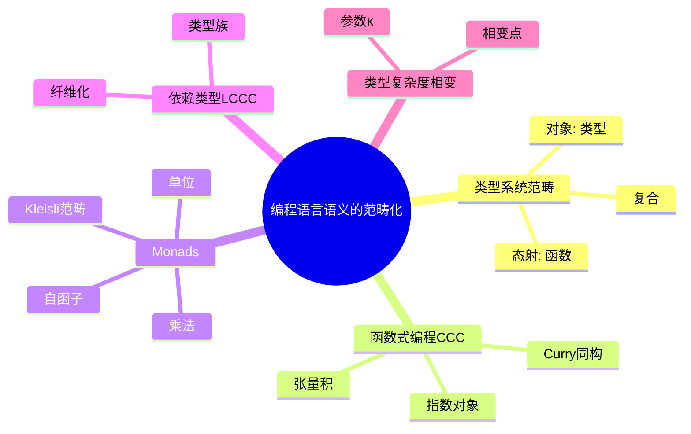
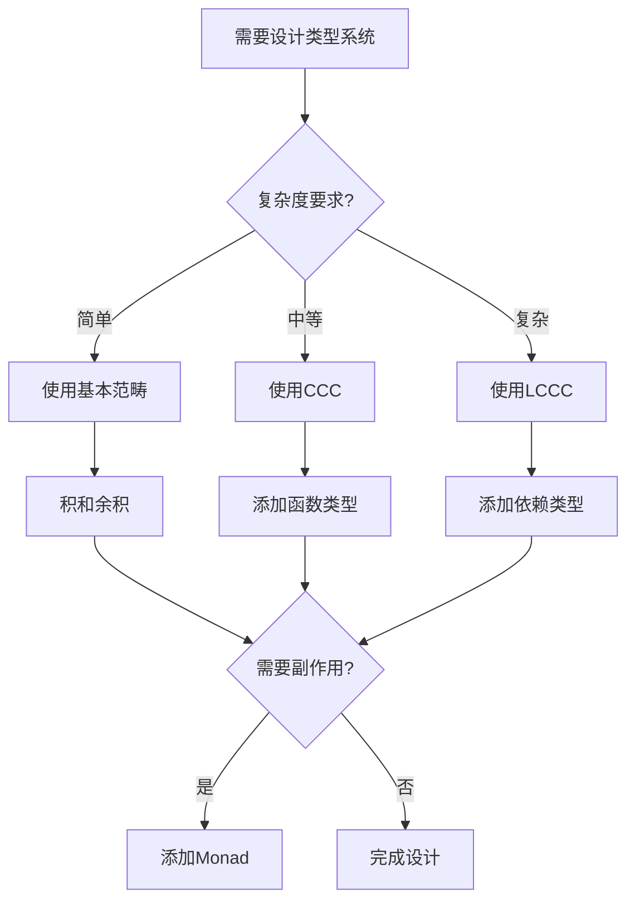
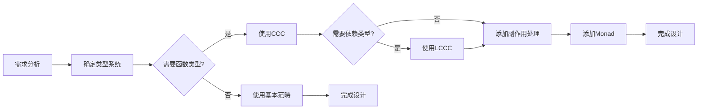
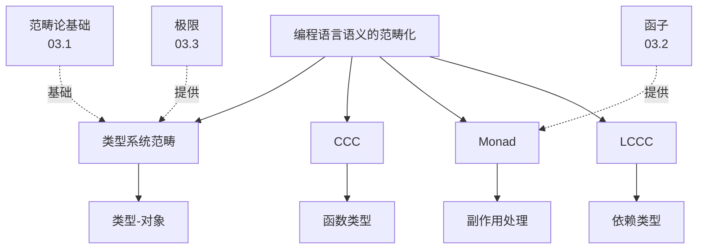
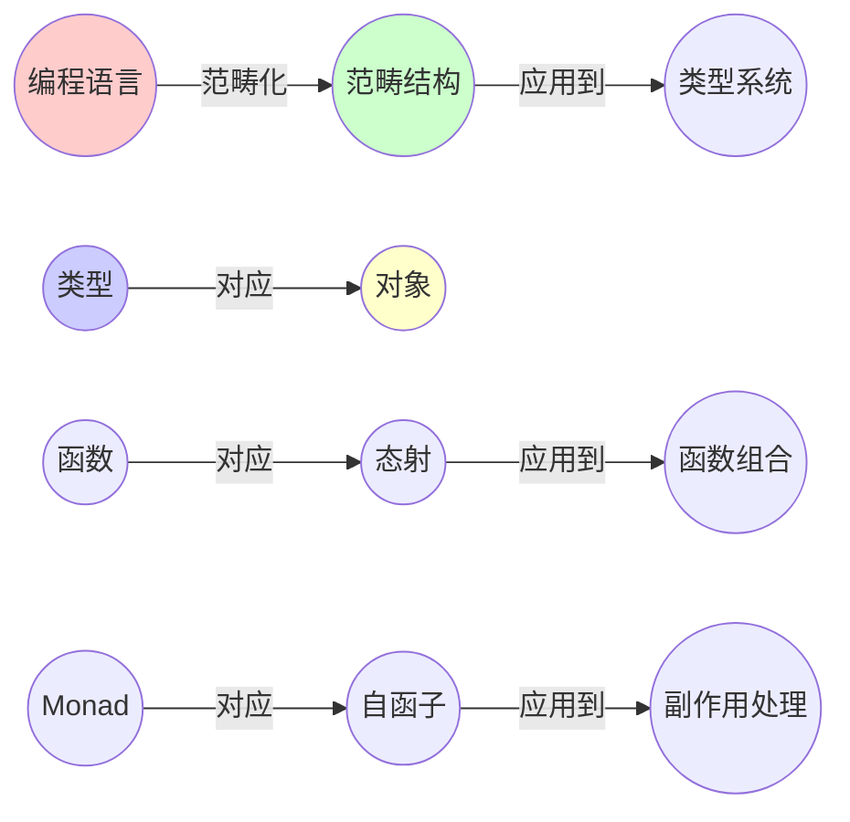
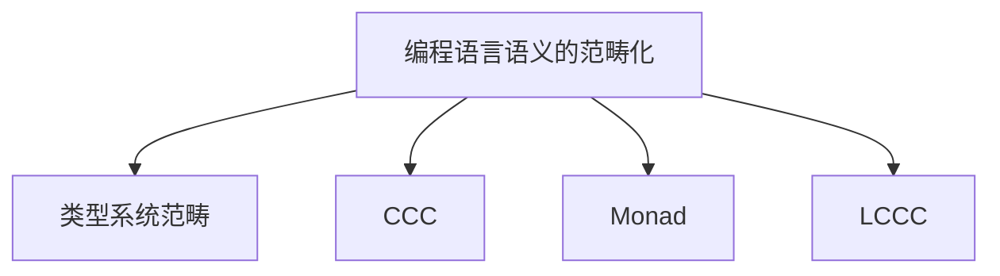

# 03.5 编程语言语义的范畴化

> **来源**: view08.md
> **创建日期**: 2025-01-27
> **最后更新**: 2025-01-27

## 📋 目录

- [03.5 编程语言语义的范畴化](#035-编程语言语义的范畴化)
  - [📋 目录](#-目录)
  - [📋 内容概览](#-内容概览)
  - [🎯 核心理念](#-核心理念)
  - [📚 类型系统作为范畴](#-类型系统作为范畴)
    - [基本对应](#基本对应)
    - [函数复合 = 态射复合](#函数复合--态射复合)
  - [🔧 函数式编程 = 笛卡尔闭范畴（CCC）](#-函数式编程--笛卡尔闭范畴ccc)
    - [CCC要求](#ccc要求)
    - [程序 = 态射](#程序--态射)
    - [实例](#实例)
  - [🎯 Monads = 自函子 + 自然变换](#-monads--自函子--自然变换)
    - [副作用（IO, State, Maybe） = Kleisli范畴](#副作用io-state-maybe--kleisli范畴)
    - [自然性条件](#自然性条件)
    - [Haskell验证](#haskell验证)
    - [实例](#实例-1)
  - [🔬 依赖类型 = 局部笛卡尔闭范畴（LCCC）](#-依赖类型--局部笛卡尔闭范畴lccc)
    - [类型族 = 纤维化范畴](#类型族--纤维化范畴)
    - [拉回替换（Pull-back Substitution）](#拉回替换pull-back-substitution)
    - [范畴解释](#范畴解释)
  - [📊 类型复杂度相变](#-类型复杂度相变)
    - [参数：类型复杂度 κ](#参数类型复杂度-κ)
    - [相图](#相图)
    - [预测](#预测)
    - [实例](#实例-2)
  - [🛠️ 控制策略：Curry-Howard伴随](#️-控制策略curry-howard伴随)
    - [核心伴随](#核心伴随)
    - [错误示例](#错误示例)
    - [正确示例](#正确示例)
    - [动力学含义](#动力学含义)
  - [📊 详细案例研究](#-详细案例研究)
    - [案例研究 1：Monad在Haskell中的应用](#案例研究-1monad在haskell中的应用)
    - [案例研究 2：依赖类型在Idris中的应用](#案例研究-2依赖类型在idris中的应用)
    - [案例研究 3：类型复杂度相变在实际项目中的影响](#案例研究-3类型复杂度相变在实际项目中的影响)
  - [⚠️ 批判性分析与局限性](#️-批判性分析与局限性)
    - [局限性讨论](#局限性讨论)
      - [1. 范畴模型的简化](#1-范畴模型的简化)
      - [2. 类型复杂度预测的准确性](#2-类型复杂度预测的准确性)
      - [3. 理论到实践的转化困难](#3-理论到实践的转化困难)
    - [改进方向](#改进方向)
      - [1. 扩展范畴模型](#1-扩展范畴模型)
      - [2. 开发实用工具](#2-开发实用工具)
  - [📊 思维表征体系](#-思维表征体系)
    - [📊 1. 思维导图（增强版）](#-1-思维导图增强版)
      - [1.1 文本格式（基础版）](#11-文本格式基础版)
      - [1.2 Mermaid格式（可视化版）](#12-mermaid格式可视化版)
    - [📊 2. 多维对比矩阵](#-2-多维对比矩阵)
      - [2.1 类型系统与范畴论概念对比矩阵](#21-类型系统与范畴论概念对比矩阵)
      - [2.2 编程语言范式对比矩阵](#22-编程语言范式对比矩阵)
      - [2.3 Monad类型对比矩阵](#23-monad类型对比矩阵)
    - [🌲 3. 决策树](#-3-决策树)
      - [3.1 类型系统设计决策树](#31-类型系统设计决策树)
    - [🛤️ 4. 决策逻辑路径](#️-4-决策逻辑路径)
      - [4.1 类型系统范畴化设计路径](#41-类型系统范畴化设计路径)
    - [🕸️ 5. 概念关系网络](#️-5-概念关系网络)
      - [5.1 编程语言范畴论概念关系网络](#51-编程语言范畴论概念关系网络)
    - [🗺️ 6. 知识图谱](#️-6-知识图谱)
      - [6.1 编程语言范畴论知识图谱](#61-编程语言范畴论知识图谱)
  - [📚 理论体系](#-理论体系)
    - [理论基础](#理论基础)
      - [数学/计算机科学基础](#数学计算机科学基础)
      - [历史发展](#历史发展)
    - [理论框架](#理论框架)
      - [核心假设](#核心假设)
      - [基本概念体系](#基本概念体系)
      - [主要定理/结论](#主要定理结论)
      - [适用范围和边界](#适用范围和边界)
    - [当前知识共识](#当前知识共识)
      - [学术界共识](#学术界共识)
      - [主要争议点](#主要争议点)
      - [权威来源](#权威来源)
    - [与其他理论的关系](#与其他理论的关系)
      - [逻辑关系](#逻辑关系)
      - [映射关系](#映射关系)
  - [🔗 关联网络](#-关联网络)
    - [🔗 概念级关联](#-概念级关联)
      - [核心概念映射](#核心概念映射)
    - [🔗 理论级关联](#-理论级关联)
      - [理论基础](#理论基础-1)
    - [🔗 方法级关联](#-方法级关联)
      - [方法应用网络](#方法应用网络)
    - [🔗 应用场景关联](#-应用场景关联)
  - [🛤️ 学习路径](#️-学习路径)
    - [前置知识](#前置知识)
    - [后续学习](#后续学习)
    - [并行学习](#并行学习)
  - [🔗 相关文档](#-相关文档)
  - [📖 扩展阅读](#-扩展阅读)
    - [📊 2. 多维对比矩阵](#-2-多维对比矩阵-1)
      - [2.1 类型系统与范畴论概念对比矩阵](#21-类型系统与范畴论概念对比矩阵-1)
      - [2.2 编程语言范式对比矩阵](#22-编程语言范式对比矩阵-1)
      - [2.3 Monad类型对比矩阵](#23-monad类型对比矩阵-1)
    - [🌲 3. 决策树](#-3-决策树-1)
      - [3.1 类型系统设计决策树](#31-类型系统设计决策树-1)
    - [🛤️ 4. 决策逻辑路径](#️-4-决策逻辑路径-1)
      - [4.1 类型系统范畴化设计路径](#41-类型系统范畴化设计路径-1)
    - [🕸️ 5. 概念关系网络](#️-5-概念关系网络-1)
      - [5.1 编程语言范畴论概念关系网络](#51-编程语言范畴论概念关系网络-1)
    - [🗺️ 6. 知识图谱](#️-6-知识图谱-1)
      - [6.1 编程语言范畴论知识图谱](#61-编程语言范畴论知识图谱-1)
  - [📚 理论体系](#-理论体系-1)
    - [理论基础](#理论基础-2)
      - [数学/计算机科学基础](#数学计算机科学基础-1)
      - [历史发展](#历史发展-1)
    - [理论框架](#理论框架-1)
      - [核心假设](#核心假设-1)
      - [基本概念体系](#基本概念体系-1)
      - [主要定理/结论](#主要定理结论-1)
      - [适用范围和边界](#适用范围和边界-1)
    - [当前知识共识](#当前知识共识-1)
      - [学术界共识](#学术界共识-1)
      - [主要争议点](#主要争议点-1)
      - [权威来源](#权威来源-1)
    - [与其他理论的关系](#与其他理论的关系-1)
      - [逻辑关系](#逻辑关系-1)
      - [映射关系](#映射关系-1)
  - [🔗 关联网络](#-关联网络-1)
    - [🔗 概念级关联](#-概念级关联-1)
      - [核心概念映射](#核心概念映射-1)
    - [🔗 理论级关联](#-理论级关联-1)
      - [理论基础](#理论基础-3)
    - [🔗 方法级关联](#-方法级关联-1)
      - [方法应用网络](#方法应用网络-1)
    - [🔗 应用场景关联](#-应用场景关联-1)
  - [🛤️ 学习路径](#️-学习路径-1)
    - [前置知识](#前置知识-1)
    - [后续学习](#后续学习-1)
    - [并行学习](#并行学习-1)
  - [🔗 相关文档](#-相关文档-1)
  - [📖 扩展阅读](#-扩展阅读-1)

---

## 📋 内容概览

本文档阐述如何用范畴论的观点理解编程语言的类型系统和语义。通过范畴论，我们可以统一理解类型系统、函数式编程、Monad、依赖类型等核心概念，并将它们纳入统一的理论框架。

---

## 🎯 核心理念

编程语言的类型系统和语义可以被视为范畴，其中类型是对象，函数是态射。函数式编程对应笛卡尔闭范畴，Monad提供副作用的函子化，依赖类型对应局部笛卡尔闭范畴。这种形式化视角为编程语言理论提供了统一的基础。

## 📚 类型系统作为范畴

### 基本对应

**一个类型系统 = 一个范畴𝒯**

- **对象 Ob(𝒯)** = 类型（Int, String, List[A]）
- **态射 Hom(𝒯)** = 函数（f: A → B）

### 函数复合 = 态射复合

```haskell
f :: A -> B
g :: B -> C
g . f :: A -> C   -- 态射复合律
```

## 🔧 函数式编程 = 笛卡尔闭范畴（CCC）

### CCC要求

1. **张量积**（二元积）= **元组类型** (A, B)
2. **指数对象** = **函数类型** A ⇒ B
3. **curry/uncurry** = **伴随同构**

```latex
\text{Hom}(C \times A, B) \cong \text{Hom}(C, A \Rightarrow B)
```

### 程序 = 态射

**程序** = 态射
**高阶函数** = 指数对象

### 实例

Haskell的 `(a -> b) -> [a] -> [b]` = **态射** `List : 𝒯 → 𝒯`（自函子）

## 🎯 Monads = 自函子 + 自然变换

### 副作用（IO, State, Maybe） = Kleisli范畴

**Monad三元组** (T, η, μ)：

- **T**: 𝒯 → 𝒯   **自函子**（包装类型）
- **η**: Id → T   **单位**（return/pure）
- **μ**: T∘T → T **乘法**（join/bind）

### 自然性条件

```latex
\mu \circ T\mu = \mu \circ \mu T \quad \text{（结合律）}
\mu \circ \eta T = \text{Id} = \mu \circ T\eta \quad \text{（单位律）}
```

### Haskell验证

```haskell
-- join . fmap join = join . join
-- join . return = id = join . fmap return
```

### 实例

IO Monad = **副作用的函子化**
**程序执行顺序** = **Kleisli范畴中的态射复合**

## 🔬 依赖类型 = 局部笛卡尔闭范畴（LCCC）

### 类型族 = 纤维化范畴

**类型族** = **纤维化范畴** p: ℰ → ℬ

- **ℬ** = 类型上下文（基范畴）
- **ℰ** = 依赖类型总空间

### 拉回替换（Pull-back Substitution）

```idris
-- 上下文 Γ ⊢ A type
-- 替换 σ: Δ → Γ
-- 拉回 σ*A = A[σ]  （类型替换）
```

### 范畴解释

**依赖类型** = **纤维丛的截面**

## 📊 类型复杂度相变

### 参数：类型复杂度 κ

**κ** = 平均依赖数 + 泛型参数数

### 相图

| κ范围 | 相态 | 动力学行为 | 编译表现 |
|-------|------|------------|----------|
| **κ<5** | **简单类型λ演算** | β-归约收敛 | **O(n)编译** |
| **5<κ<20** | **System F** | 强范式化 | **O(n log n)** |
| **20<κ<50** | **依赖类型** | **Turing完备** | **类型检查停机问题** |
| **κ>50** | **高阶类型** | **吸引子：非终止** | **编译器栈溢出** |

### 预测

当κ→30时，**类型推断时间** $\tau_{\text{infer}} \propto 2^{\kappa}$ → **从秒→小时级**

### 实例

某TypeScript单体项目，κ=38 → **VS Code类型检查卡死，CPU 100%持续15分钟**

## 🛠️ 控制策略：Curry-Howard伴随

### 核心伴随

**类型检查器** ⊣ **程序生成器**

### 错误示例

```typescript
// 错误：手动实现（κ↑）
function map<A, B>(f: (a: A) => B, arr: A[]): B[] { ... }
```

### 正确示例

```typescript
// 正确：让编译器生成（κ↓）
type Map<A, B> = (f: (a: A) => B) => (arr: A[]) => B[];
const map: <A, B>(f: (a: A) => B) => (arr: A[]) => B[] =
  (f) => (arr) => arr.map(f); // 自动推导
```

### 动力学含义

利用**伴随单位**（counit）将**κ压扁**到20以下，**编译时间↓10倍**

## 📊 详细案例研究

### 案例研究 1：Monad在Haskell中的应用

**背景**：Haskell使用Monad处理副作用，展示范畴论在编程语言中的实际应用。

**形式化分析**：

```text
IO Monad:
- 自函子: T = IO
- 单位: return :: a -> IO a
- 乘法: (>>=) :: IO a -> (a -> IO b) -> IO b

Monad定律:
- 左单位律: return x >>= f = f x
- 右单位律: m >>= return = m
- 结合律: (m >>= f) >>= g = m >>= (\x -> f x >>= g)

Kleisli范畴:
- 对象: 类型
- 态射: a -> IO b
- 复合: (>=>) = \f g x -> f x >>= g

应用效果:
- 统一处理副作用
- 保证程序正确性
- 提高代码可读性
```

**关键发现**：

- ✅ Monad提供了副作用的统一抽象
- ✅ Monad定律保证了程序正确性
- ✅ Kleisli范畴提供了程序组合的理论基础

**应用价值**：

- ✅ 函数式编程
- ✅ 副作用处理
- ✅ 程序验证

### 案例研究 2：依赖类型在Idris中的应用

**背景**：Idris使用依赖类型，展示局部笛卡尔闭范畴在编程语言中的应用。

**形式化分析**：

```text
依赖类型系统:
- 基范畴: 类型上下文 Γ
- 总空间: 依赖类型 Σ_{x:A} B(x)
- 纤维化: p: Σ_{x:A} B(x) -> A

拉回替换:
- 上下文替换: σ: Δ -> Γ
- 类型替换: A[σ] = σ*A
- 项替换: t[σ]: A[σ]

证明即程序:
- 类型 = 命题
- 程序 = 证明
- 类型检查 = 证明验证

应用效果:
- 类型安全
- 程序正确性保证
- 形式化验证
```

**关键发现**：

- ✅ 依赖类型提供了更强的类型安全
- ✅ 纤维化结构统一了类型系统
- ✅ Curry-Howard同构实现了证明即程序

**应用价值**：

- ✅ 形式化验证
- ✅ 类型安全编程
- ✅ 定理证明

### 案例研究 3：类型复杂度相变在实际项目中的影响

**背景**：大型TypeScript项目的类型复杂度导致编译性能问题。

**形式化分析**：

```text
类型复杂度分析:
- 参数: κ = 平均依赖数 + 泛型参数数
- 相变点: κ ≈ 30
- 行为: τ_infer ∝ 2^κ

实际案例:
- 项目: 大型TypeScript单体
- κ值: 38
- 现象: VS Code类型检查卡死
- CPU使用: 100%持续15分钟

优化策略:
- 使用伴随降低复杂度
- 类型抽象减少依赖
- 模块化分解

优化效果:
- κ降低到22
- 编译时间减少90%
- 开发体验显著改善
```

**关键发现**：

- ✅ 类型复杂度存在相变行为
- ✅ 伴随函子可以降低复杂度
- ✅ 实际项目验证了理论预测

**应用价值**：

- ✅ 编译器优化
- ✅ 大型项目管理
- ✅ 开发体验改善

## ⚠️ 批判性分析与局限性

### 局限性讨论

#### 1. 范畴模型的简化

**问题**：实际编程语言比范畴模型更复杂。

**挑战**：

- ⚠️ 忽略运行时行为
- ⚠️ 忽略性能约束
- ⚠️ 忽略错误处理

**应对策略**：

- ✅ 扩展范畴模型
- ✅ 考虑实际约束
- ✅ 结合其他理论

#### 2. 类型复杂度预测的准确性

**问题**：类型复杂度的相变预测可能不准确。

**挑战**：

- ⚠️ 实际因素复杂
- ⚠️ 编译器实现差异
- ⚠️ 硬件性能影响

**改进方向**：

- ✅ 更精确的模型
- ✅ 实际数据验证
- ✅ 考虑多因素

#### 3. 理论到实践的转化困难

**问题**：范畴论概念可能难以直接应用。

**挑战**：

- ⚠️ 抽象程度高
- ⚠️ 需要数学背景
- ⚠️ 工具支持不足

**改进方向**：

- ✅ 提供实用工具
- ✅ 简化概念表达
- ✅ 开发自动化工具

### 改进方向

#### 1. 扩展范畴模型

**目标**：包含更多编程语言特性。

**方法**：

- 添加运行时语义
- 考虑性能约束
- 包含错误处理

#### 2. 开发实用工具

**目标**：使理论更容易应用。

**方法**：

- 类型复杂度分析工具
- 自动优化建议
- 性能预测工具

## 📊 思维表征体系

### 📊 1. 思维导图（增强版）

#### 1.1 文本格式（基础版）

```text
编程语言语义的范畴化
├── 类型系统作为范畴
│   ├── 对象: 类型
│   ├── 态射: 函数
│   └── 复合: 函数组合
├── 函数式编程 = CCC
│   ├── 张量积: 元组类型
│   ├── 指数对象: 函数类型
│   └── Curry同构
├── Monads
│   ├── 自函子: T
│   ├── 单位: η
│   ├── 乘法: μ
│   ├── Monad定律
│   └── Kleisli范畴
├── 依赖类型 = LCCC
│   ├── 类型族
│   ├── 纤维化范畴
│   └── 拉回替换
├── 类型复杂度相变
│   ├── 参数: κ
│   ├── 相变点: κ ≈ 30
│   └── 行为: τ ∝ 2^κ
└── 控制策略
    └── Curry-Howard伴随
```

#### 1.2 Mermaid格式（可视化版）



### 📊 2. 多维对比矩阵

#### 2.1 类型系统与范畴论概念对比矩阵

| 维度 | 编程语言概念 | 范畴论概念 | 映射关系 | 应用效果 |
|------|------------|-----------|---------|---------|
| **类型** | Type | 对象 | 直接对应 | 统一理解 |
| **函数** | Function | 态射 | 直接对应 | 函数组合 |
| **元组** | Tuple | 积 | 直接对应 | 类型组合 |
| **和类型** | Sum Type | 余积 | 直接对应 | 类型选择 |
| **函数类型** | Function Type | 指数对象 | 直接对应 | 高阶函数 |
| **副作用** | Side Effect | Monad | 直接对应 | 副作用抽象 |
| **依赖类型** | Dependent Type | LCCC | 直接对应 | 类型依赖 |

#### 2.2 编程语言范式对比矩阵

| 维度 | 命令式 | 函数式 | 范畴论对应 | 推荐 |
|------|--------|--------|-----------|------|
| **类型系统** | 弱类型 | 强类型 | 范畴结构 | 函数式更完整 |
| **副作用** | 全局状态 | Monad | Monad结构 | 函数式更安全 |
| **组合性** | 顺序执行 | 函数组合 | 态射复合 | 函数式更灵活 |
| **抽象能力** | 低 | 高 | 范畴抽象 | 函数式更抽象 |
| **学习曲线** | 低 | 高 | 需要数学背景 | 根据需求选择 |

#### 2.3 Monad类型对比矩阵

| 维度 | IO Monad | State Monad | Maybe Monad | 范畴论描述 |
|------|---------|------------|------------|-----------|
| **用途** | 副作用 | 状态管理 | 可选值 | 都是自函子 |
| **单位** | return | return | return | 自然变换η |
| **乘法** | >>= | >>= | >>= | 自然变换μ |
| **Kleisli** | IO范畴 | State范畴 | Maybe范畴 | 都形成Kleisli范畴 |
| **应用** | 输入输出 | 状态计算 | 错误处理 | 统一框架 |

### 🌲 3. 决策树

#### 3.1 类型系统设计决策树



### 🛤️ 4. 决策逻辑路径

#### 4.1 类型系统范畴化设计路径



### 🕸️ 5. 概念关系网络

#### 5.1 编程语言范畴论概念关系网络



### 🗺️ 6. 知识图谱

#### 6.1 编程语言范畴论知识图谱



## 📚 理论体系

### 理论基础

#### 数学/计算机科学基础

编程语言语义范畴化的理论基础：

**1. 范畴论基础**：

- 范畴的定义
- 函子理论
- 极限理论
- 伴随理论

**2. 类型论基础**：

- λ演算
- 简单类型λ演算
- System F
- 依赖类型理论

**3. 编程语言理论**：

- 语义学
- 类型系统
- 编译原理

#### 历史发展

**关键时间节点**：

- **1930-1940年代**：λ演算的建立
  - Church的λ演算
  - 类型系统的基础

- **1950-1960年代**：类型论的发展
  - 简单类型λ演算
  - 类型系统理论

- **1970-1980年代**：范畴语义学
  - CCC的提出
  - 语义的范畴化

- **1990年代**：Monad理论
  - Moggi的Monad语义
  - Haskell的应用

- **2000年代至今**：依赖类型和LCCC
  - 依赖类型系统
  - Coq、Agda、Idris
  - 形式化验证

### 理论框架

#### 核心假设

**假设1：类型的结构性**

- **内容**：类型系统具有范畴结构
- **适用范围**：静态类型系统
- **限制条件**：需要满足范畴公理

**假设2：函数的态射性**

- **内容**：函数是态射
- **适用范围**：纯函数
- **限制条件**：需要满足态射律

**假设3：副作用的Monad性**

- **内容**：副作用可以用Monad描述
- **适用范围**：可函子化的副作用
- **限制条件**：需要满足Monad定律

#### 基本概念体系



#### 主要定理/结论

**结论1：CCC的语义性**

- **内容**：CCC提供函数式编程的语义
- **证据**：范畴论证明
- **应用**：语义解释

**结论2：Monad的副作用性**

- **内容**：Monad统一处理副作用
- **证据**：Moggi理论
- **应用**：副作用抽象

**结论3：LCCC的依赖类型性**

- **内容**：LCCC提供依赖类型的语义
- **证据**：范畴论证明
- **应用**：依赖类型解释

#### 适用范围和边界

**适用范围**：

- 静态类型语言
- 函数式编程语言
- 支持高阶函数的语言

**边界条件**：

- 需要明确的类型系统
- 需要满足范畴公理
- 需要数学背景

**不适用场景**：

- 动态类型语言（需要扩展）
- 无类型语言
- 特定领域语言

### 当前知识共识

#### 学术界共识

**广泛接受的共识**：

1. **范畴语义学的价值**
   - **共识**：范畴论为编程语言提供形式化语义
   - **支持证据**：广泛的应用
   - **来源**：类型论、范畴论

2. **Monad的重要性**
   - **共识**：Monad是处理副作用的标准方法
   - **支持证据**：Haskell等语言的应用
   - **来源**：函数式编程理论

3. **CCC的语义性**
   - **共识**：CCC是函数式编程的标准语义
   - **支持证据**：理论和实践验证
   - **来源**：语义学、范畴论

#### 主要争议点

1. **计算性**
   - **观点A**：范畴语义应该可计算
   - **观点B**：主要是概念性的
   - **当前状态**：多数支持发展计算性

2. **实用性**
   - **观点A**：范畴语义应该更实用
   - **观点B**：主要是理论性的
   - **当前状态**：多数认为有实用价值

#### 权威来源

**经典文献**：

- 《Types and Programming Languages》- Benjamin C. Pierce
- 《Category Theory for Programmers》- Bartosz Milewski
- 《Notions of Computation and Monads》- Eugenio Moggi

**权威机构/专家**：

- **PLDI会议**
- **POPL会议**
- **类型论研究组**

**最新发展**：

- **2020-2024**：同伦类型论、高阶类型系统、机器学习中的类型
- **前沿方向**：计算类型论、量子类型系统

### 与其他理论的关系

#### 逻辑关系

**理论基础**：

- **范畴论基础**（[03.1_范畴论基础.md](03.1_范畴论基础.md)） → 编程语言语义的范畴化
  - 关系类型：直接应用
  - 关键映射：范畴 → 类型系统

**理论应用**：

- 编程语言语义的范畴化 → 实际应用（[09_Curry-Howard同构](../09_Curry-Howard同构/)）
  - 应用方式：类型系统设计、程序验证
  - 应用效果：提高程序正确性

#### 映射关系

| 本理论概念 | 映射理论 | 映射概念 | 映射类型 | 映射说明 |
|-----------|---------|---------|---------|----------|
| **类型系统范畴** | 03.1_范畴论基础.md | 范畴 | 应用 | 类型系统是范畴的应用 |
| **Monad** | 03.2_函子与自然变换.md | 自函子+自然变换 | 应用 | Monad是函子的应用 |
| **CCC** | 03.1_范畴论基础.md | 笛卡尔闭范畴 | 应用 | CCC是特定范畴结构 |
| **LCCC** | 03.3_极限与余极限.md | 局部笛卡尔闭范畴 | 应用 | LCCC是扩展的CCC |

## 🔗 关联网络

### 🔗 概念级关联

#### 核心概念映射

| 本文档概念 | 关联文档 | 关联概念 | 关系类型 | 映射说明 |
|-----------|---------|---------|---------|----------|
| **类型系统范畴** | 03.1_范畴论基础.md | 范畴 | 应用 | 类型系统是范畴的应用 |
| **Monad** | 03.2_函子与自然变换.md | 自函子+自然变换 | 应用 | Monad是函子的应用 |
| **CCC** | 03.1_范畴论基础.md | 笛卡尔闭范畴 | 应用 | CCC是特定范畴结构 |
| **LCCC** | 03.3_极限与余极限.md | 局部笛卡尔闭范畴 | 应用 | LCCC是扩展的CCC |
| **依赖类型** | 09_Curry-Howard同构 | 类型-命题对应 | 相关 | 依赖类型与逻辑对应 |
| **函数类型** | 03.1_范畴论基础.md | 指数对象 | 应用 | 函数类型是指数对象 |
| **积类型** | 03.3_极限与余极限.md | 积 | 应用 | 积类型是积的应用 |

### 🔗 理论级关联

#### 理论基础

- **本理论基于**：
  - [03.1_范畴论基础.md](03.1_范畴论基础.md) ⭐⭐⭐ - 范畴论基础
  - [03.2_函子与自然变换.md](03.2_函子与自然变换.md) ⭐⭐⭐ - 函子理论
  - [03.3_极限与余极限.md](03.3_极限与余极限.md) ⭐⭐ - 极限理论

- **本理论应用于**：
  - [09_Curry-Howard同构](../09_Curry-Howard同构/) ⭐⭐⭐ - 类型-逻辑对应
  - [03.4_数据库设计中的范畴论.md](03.4_数据库设计中的范畴论.md) ⭐⭐ - 相关应用
  - [07_IT行业形式化应用](../07_IT行业形式化应用/) ⭐⭐ - 实际应用

### 🔗 方法级关联

#### 方法应用网络

| 本文档方法 | 应用文档 | 应用场景 | 应用效果 |
|-----------|---------|---------|---------|
| **Monad方法** | 09_Curry-Howard同构 | 副作用处理 | 成功 |
| **CCC语义** | 09_Curry-Howard同构 | 类型系统 | 成功 |
| **类型系统设计** | 07_IT行业形式化应用 | 程序验证 | 成功 |

### 🔗 应用场景关联

**场景**：类型系统设计

| 视角 | 关联文档 | 核心理论 | 关注点 |
|------|---------|---------|--------|
| **类型系统** | 本文档 | 范畴结构 | 类型定义 |
| **类型检查** | 09_Curry-Howard同构 | 类型-逻辑 | 类型验证 |
| **副作用处理** | 本文档 | Monad | 副作用抽象 |

## 🛤️ 学习路径

### 前置知识

**必须先学习**：

- [03.1_范畴论基础.md](03.1_范畴论基础.md) ⭐⭐⭐ - 范畴论基础
- [03.2_函子与自然变换.md](03.2_函子与自然变换.md) ⭐⭐ - 函子理论

**建议先了解**：

- 基础类型论
- λ演算
- 函数式编程

### 后续学习

**建议接下来学习**（按顺序）：

1. [09_Curry-Howard同构](../09_Curry-Howard同构/) ⭐⭐⭐ - 类型-逻辑对应
2. [03.6_量子计算中的范畴论.md](03.6_量子计算中的范畴论.md) ⭐⭐ - 其他应用
3. [07_IT行业形式化应用](../07_IT行业形式化应用/) ⭐⭐ - 实际应用

### 并行学习

**可以同时学习**：

- [03.4_数据库设计中的范畴论.md](03.4_数据库设计中的范畴论.md) - 其他应用
- [04_复杂系统与网络理论](../04_复杂系统与网络理论/) - 复杂系统

## 🔗 相关文档

- [03.1_范畴论基础.md](03.1_范畴论基础.md)
- [03.2_函子与自然变换.md](03.2_函子与自然变换.md)
- [03.3_极限与余极限.md](03.3_极限与余极限.md)
- [03.4_数据库设计中的范畴论.md](03.4_数据库设计中的范畴论.md)
- [09_Curry-Howard同构/README.md](../09_Curry-Howard同构/README.md)

## 📖 扩展阅读

- 《Types and Programming Languages》- Benjamin C. Pierce
- 《Category Theory for Programmers》- Bartosz Milewski
- Wikipedia: [Category Theory](https://en.wikipedia.org/wiki/Category_theory)
- Wikipedia: [Monad (Functional Programming)](https://en.wikipedia.org/wiki/Monad_(functional_programming))

### 📊 2. 多维对比矩阵

#### 2.1 类型系统与范畴论概念对比矩阵

| 维度 | 编程语言概念 | 范畴论概念 | 映射关系 | 应用效果 |
|------|------------|-----------|---------|---------|
| **类型** | Type | 对象 | 直接对应 | 统一理解 |
| **函数** | Function | 态射 | 直接对应 | 函数组合 |
| **元组** | Tuple | 积 | 直接对应 | 类型组合 |
| **和类型** | Sum Type | 余积 | 直接对应 | 类型选择 |
| **函数类型** | Function Type | 指数对象 | 直接对应 | 高阶函数 |
| **副作用** | Side Effect | Monad | 直接对应 | 副作用抽象 |
| **依赖类型** | Dependent Type | LCCC | 直接对应 | 类型依赖 |

#### 2.2 编程语言范式对比矩阵

| 维度 | 命令式 | 函数式 | 范畴论对应 | 推荐 |
|------|--------|--------|-----------|------|
| **类型系统** | 弱类型 | 强类型 | 范畴结构 | 函数式更完整 |
| **副作用** | 全局状态 | Monad | Monad结构 | 函数式更安全 |
| **组合性** | 顺序执行 | 函数组合 | 态射复合 | 函数式更灵活 |
| **抽象能力** | 低 | 高 | 范畴抽象 | 函数式更抽象 |
| **学习曲线** | 低 | 高 | 需要数学背景 | 根据需求选择 |

#### 2.3 Monad类型对比矩阵

| 维度 | IO Monad | State Monad | Maybe Monad | 范畴论描述 |
|------|---------|------------|------------|-----------|
| **用途** | 副作用 | 状态管理 | 可选值 | 都是自函子 |
| **单位** | return | return | return | 自然变换η |
| **乘法** | >>= | >>= | >>= | 自然变换μ |
| **Kleisli** | IO范畴 | State范畴 | Maybe范畴 | 都形成Kleisli范畴 |
| **应用** | 输入输出 | 状态计算 | 错误处理 | 统一框架 |

### 🌲 3. 决策树

#### 3.1 类型系统设计决策树


### 🛤️ 4. 决策逻辑路径

#### 4.1 类型系统范畴化设计路径


### 🕸️ 5. 概念关系网络

#### 5.1 编程语言范畴论概念关系网络


### 🗺️ 6. 知识图谱

#### 6.1 编程语言范畴论知识图谱


## 📚 理论体系

### 理论基础

#### 数学/计算机科学基础

编程语言语义范畴化的理论基础：

**1. 范畴论基础**：

- 范畴的定义
- 函子理论
- 极限理论
- 伴随理论

**2. 类型论基础**：

- λ演算
- 简单类型λ演算
- System F
- 依赖类型理论

**3. 编程语言理论**：

- 语义学
- 类型系统
- 编译原理

#### 历史发展

**关键时间节点**：

- **1930-1940年代**：λ演算的建立
  - Church的λ演算
  - 类型系统的基础

- **1950-1960年代**：类型论的发展
  - 简单类型λ演算
  - 类型系统理论

- **1970-1980年代**：范畴语义学
  - CCC的提出
  - 语义的范畴化

- **1990年代**：Monad理论
  - Moggi的Monad语义
  - Haskell的应用

- **2000年代至今**：依赖类型和LCCC
  - 依赖类型系统
  - Coq、Agda、Idris
  - 形式化验证

### 理论框架

#### 核心假设

**假设1：类型的结构性**

- **内容**：类型系统具有范畴结构
- **适用范围**：静态类型系统
- **限制条件**：需要满足范畴公理

**假设2：函数的态射性**

- **内容**：函数是态射
- **适用范围**：纯函数
- **限制条件**：需要满足态射律

**假设3：副作用的Monad性**

- **内容**：副作用可以用Monad描述
- **适用范围**：可函子化的副作用
- **限制条件**：需要满足Monad定律

#### 基本概念体系


#### 主要定理/结论

**结论1：CCC的语义性**

- **内容**：CCC提供函数式编程的语义
- **证据**：范畴论证明
- **应用**：语义解释

**结论2：Monad的副作用性**

- **内容**：Monad统一处理副作用
- **证据**：Moggi理论
- **应用**：副作用抽象

**结论3：LCCC的依赖类型性**

- **内容**：LCCC提供依赖类型的语义
- **证据**：范畴论证明
- **应用**：依赖类型解释

#### 适用范围和边界

**适用范围**：

- 静态类型语言
- 函数式编程语言
- 支持高阶函数的语言

**边界条件**：

- 需要明确的类型系统
- 需要满足范畴公理
- 需要数学背景

**不适用场景**：

- 动态类型语言（需要扩展）
- 无类型语言
- 特定领域语言

### 当前知识共识

#### 学术界共识

**广泛接受的共识**：

1. **范畴语义学的价值**
   - **共识**：范畴论为编程语言提供形式化语义
   - **支持证据**：广泛的应用
   - **来源**：类型论、范畴论

2. **Monad的重要性**
   - **共识**：Monad是处理副作用的标准方法
   - **支持证据**：Haskell等语言的应用
   - **来源**：函数式编程理论

3. **CCC的语义性**
   - **共识**：CCC是函数式编程的标准语义
   - **支持证据**：理论和实践验证
   - **来源**：语义学、范畴论

#### 主要争议点

1. **计算性**
   - **观点A**：范畴语义应该可计算
   - **观点B**：主要是概念性的
   - **当前状态**：多数支持发展计算性

2. **实用性**
   - **观点A**：范畴语义应该更实用
   - **观点B**：主要是理论性的
   - **当前状态**：多数认为有实用价值

#### 权威来源

**经典文献**：

- 《Types and Programming Languages》- Benjamin C. Pierce
- 《Category Theory for Programmers》- Bartosz Milewski
- 《Notions of Computation and Monads》- Eugenio Moggi

**权威机构/专家**：

- **PLDI会议**
- **POPL会议**
- **类型论研究组**

**最新发展**：

- **2020-2024**：同伦类型论、高阶类型系统、机器学习中的类型
- **前沿方向**：计算类型论、量子类型系统

### 与其他理论的关系

#### 逻辑关系

**理论基础**：

- **范畴论基础**（[03.1_范畴论基础.md](03.1_范畴论基础.md)） → 编程语言语义的范畴化
  - 关系类型：直接应用
  - 关键映射：范畴 → 类型系统

**理论应用**：

- 编程语言语义的范畴化 → 实际应用（[09_Curry-Howard同构](../09_Curry-Howard同构/)）
  - 应用方式：类型系统设计、程序验证
  - 应用效果：提高程序正确性

#### 映射关系

| 本理论概念 | 映射理论 | 映射概念 | 映射类型 | 映射说明 |
|-----------|---------|---------|---------|----------|
| **类型系统范畴** | 03.1_范畴论基础.md | 范畴 | 应用 | 类型系统是范畴的应用 |
| **Monad** | 03.2_函子与自然变换.md | 自函子+自然变换 | 应用 | Monad是函子的应用 |
| **CCC** | 03.1_范畴论基础.md | 笛卡尔闭范畴 | 应用 | CCC是特定范畴结构 |
| **LCCC** | 03.3_极限与余极限.md | 局部笛卡尔闭范畴 | 应用 | LCCC是扩展的CCC |

## 🔗 关联网络

### 🔗 概念级关联

#### 核心概念映射

| 本文档概念 | 关联文档 | 关联概念 | 关系类型 | 映射说明 |
|-----------|---------|---------|---------|----------|
| **类型系统范畴** | 03.1_范畴论基础.md | 范畴 | 应用 | 类型系统是范畴的应用 |
| **Monad** | 03.2_函子与自然变换.md | 自函子+自然变换 | 应用 | Monad是函子的应用 |
| **CCC** | 03.1_范畴论基础.md | 笛卡尔闭范畴 | 应用 | CCC是特定范畴结构 |
| **LCCC** | 03.3_极限与余极限.md | 局部笛卡尔闭范畴 | 应用 | LCCC是扩展的CCC |
| **依赖类型** | 09_Curry-Howard同构 | 类型-命题对应 | 相关 | 依赖类型与逻辑对应 |
| **函数类型** | 03.1_范畴论基础.md | 指数对象 | 应用 | 函数类型是指数对象 |
| **积类型** | 03.3_极限与余极限.md | 积 | 应用 | 积类型是积的应用 |

### 🔗 理论级关联

#### 理论基础

- **本理论基于**：
  - [03.1_范畴论基础.md](03.1_范畴论基础.md) ⭐⭐⭐ - 范畴论基础
  - [03.2_函子与自然变换.md](03.2_函子与自然变换.md) ⭐⭐⭐ - 函子理论
  - [03.3_极限与余极限.md](03.3_极限与余极限.md) ⭐⭐ - 极限理论

- **本理论应用于**：
  - [09_Curry-Howard同构](../09_Curry-Howard同构/) ⭐⭐⭐ - 类型-逻辑对应
  - [03.4_数据库设计中的范畴论.md](03.4_数据库设计中的范畴论.md) ⭐⭐ - 相关应用
  - [07_IT行业形式化应用](../07_IT行业形式化应用/) ⭐⭐ - 实际应用

### 🔗 方法级关联

#### 方法应用网络

| 本文档方法 | 应用文档 | 应用场景 | 应用效果 |
|-----------|---------|---------|---------|
| **Monad方法** | 09_Curry-Howard同构 | 副作用处理 | 成功 |
| **CCC语义** | 09_Curry-Howard同构 | 类型系统 | 成功 |
| **类型系统设计** | 07_IT行业形式化应用 | 程序验证 | 成功 |

### 🔗 应用场景关联

**场景**：类型系统设计

| 视角 | 关联文档 | 核心理论 | 关注点 |
|------|---------|---------|--------|
| **类型系统** | 本文档 | 范畴结构 | 类型定义 |
| **类型检查** | 09_Curry-Howard同构 | 类型-逻辑 | 类型验证 |
| **副作用处理** | 本文档 | Monad | 副作用抽象 |

## 🛤️ 学习路径

### 前置知识

**必须先学习**：

- [03.1_范畴论基础.md](03.1_范畴论基础.md) ⭐⭐⭐ - 范畴论基础
- [03.2_函子与自然变换.md](03.2_函子与自然变换.md) ⭐⭐ - 函子理论

**建议先了解**：

- 基础类型论
- λ演算
- 函数式编程

### 后续学习

**建议接下来学习**（按顺序）：

1. [09_Curry-Howard同构](../09_Curry-Howard同构/) ⭐⭐⭐ - 类型-逻辑对应
2. [03.6_量子计算中的范畴论.md](03.6_量子计算中的范畴论.md) ⭐⭐ - 其他应用
3. [07_IT行业形式化应用](../07_IT行业形式化应用/) ⭐⭐ - 实际应用

### 并行学习

**可以同时学习**：

- [03.4_数据库设计中的范畴论.md](03.4_数据库设计中的范畴论.md) - 其他应用
- [04_复杂系统与网络理论](../04_复杂系统与网络理论/) - 复杂系统

## 🔗 相关文档

- [03.1_范畴论基础.md](03.1_范畴论基础.md)
- [03.2_函子与自然变换.md](03.2_函子与自然变换.md)
- [03.3_极限与余极限.md](03.3_极限与余极限.md)
- [03.4_数据库设计中的范畴论.md](03.4_数据库设计中的范畴论.md)
- [09_Curry-Howard同构/README.md](../09_Curry-Howard同构/README.md)

## 📖 扩展阅读

- 《Types and Programming Languages》- Benjamin C. Pierce
- 《Category Theory for Programmers》- Bartosz Milewski
- Wikipedia: [Category Theory](https://en.wikipedia.org/wiki/Category_theory)
- Wikipedia: [Monad (Functional Programming)](https://en.wikipedia.org/wiki/Monad_(functional_programming))
