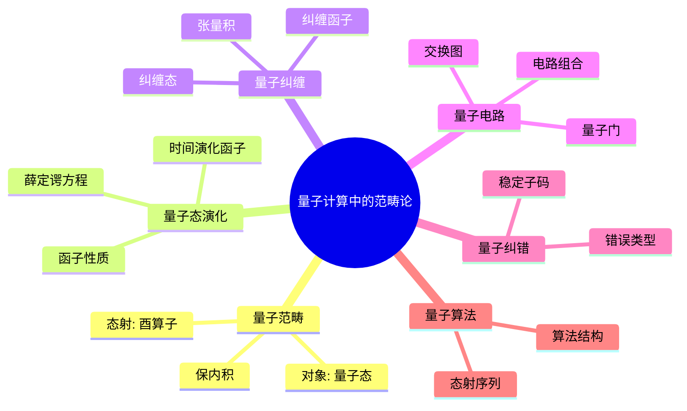
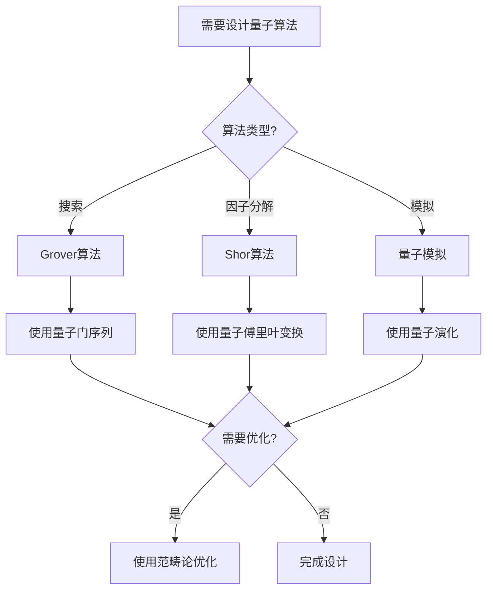
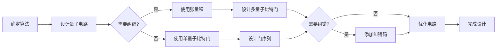
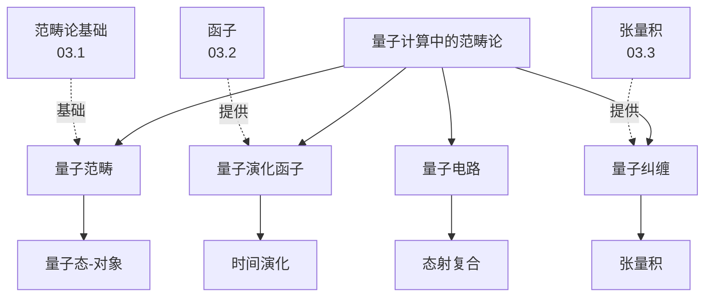
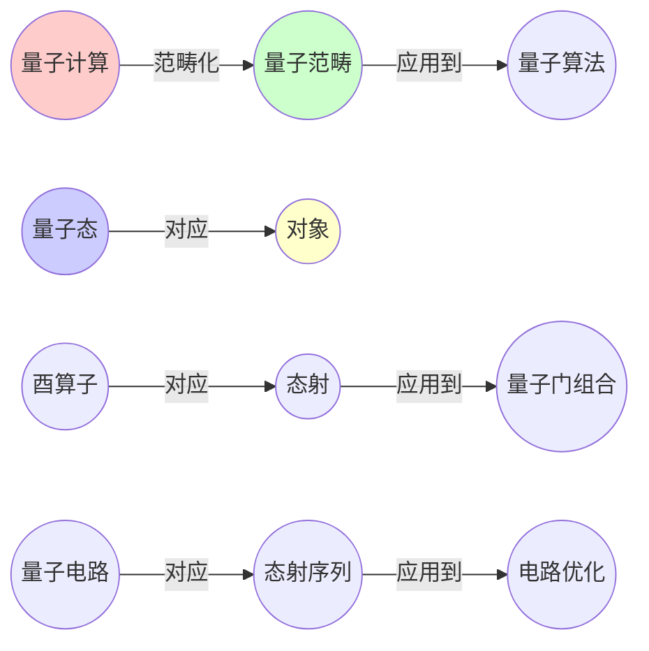
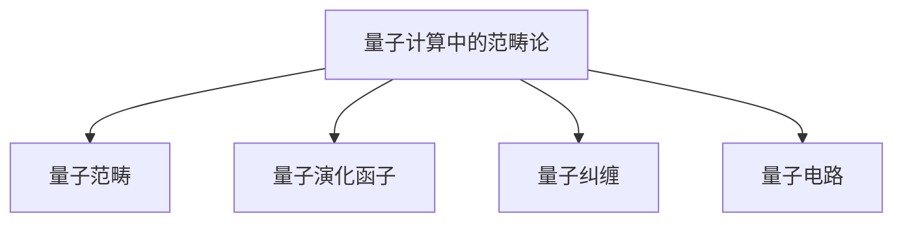

# 03.6 量子计算中的范畴论

> **来源**: view08.md
> **创建日期**: 2025-01-27
> **最后更新**: 2025-01-27

## 📋 目录

- [03.6 量子计算中的范畴论](#036-量子计算中的范畴论)
  - [📋 目录](#-目录)
  - [📋 内容概览](#-内容概览)
  - [🎯 核心理念](#-核心理念)
  - [⚛️ 量子范畴](#️-量子范畴)
    - [基本概念](#基本概念)
    - [量子态作为对象](#量子态作为对象)
    - [量子操作作为态射](#量子操作作为态射)
  - [🔄 量子态演化](#-量子态演化)
    - [薛定谔方程](#薛定谔方程)
    - [范畴论视角](#范畴论视角)
  - [🔗 量子纠缠](#-量子纠缠)
    - [纠缠态](#纠缠态)
    - [范畴论描述](#范畴论描述)
  - [📊 量子电路](#-量子电路)
    - [量子门](#量子门)
    - [范畴论视角](#范畴论视角-1)
  - [🎯 量子纠错](#-量子纠错)
    - [量子错误](#量子错误)
    - [纠错码](#纠错码)
  - [🔬 量子算法](#-量子算法)
    - [量子算法结构](#量子算法结构)
    - [范畴论视角](#范畴论视角-2)
  - [📈 应用实例](#-应用实例)
    - [1. 量子傅里叶变换](#1-量子傅里叶变换)
    - [2. Grover算法](#2-grover算法)
    - [3. Shor算法](#3-shor算法)
  - [📊 详细案例研究](#-详细案例研究)
    - [案例研究 1：量子电路优化的范畴论方法](#案例研究-1量子电路优化的范畴论方法)
    - [案例研究 2：量子纠缠的范畴论描述](#案例研究-2量子纠缠的范畴论描述)
    - [案例研究 3：量子纠错的稳定子码理论](#案例研究-3量子纠错的稳定子码理论)
  - [⚠️ 批判性分析与局限性](#️-批判性分析与局限性)
    - [局限性讨论](#局限性讨论)
      - [1. 范畴模型的理想化](#1-范畴模型的理想化)
      - [2. 量子纠错的复杂性](#2-量子纠错的复杂性)
      - [3. 量子算法的可扩展性](#3-量子算法的可扩展性)
    - [改进方向](#改进方向)
      - [1. 扩展范畴模型](#1-扩展范畴模型)
      - [2. 开发实用工具](#2-开发实用工具)
  - [📊 思维表征体系](#-思维表征体系)
    - [📊 1. 思维导图（增强版）](#-1-思维导图增强版)
      - [1.1 文本格式（基础版）](#11-文本格式基础版)
      - [1.2 Mermaid格式（可视化版）](#12-mermaid格式可视化版)
    - [📊 2. 多维对比矩阵](#-2-多维对比矩阵)
      - [2.1 量子计算与范畴论概念对比矩阵](#21-量子计算与范畴论概念对比矩阵)
      - [2.2 量子算法类型对比矩阵](#22-量子算法类型对比矩阵)
      - [2.3 量子纠错码对比矩阵](#23-量子纠错码对比矩阵)
    - [🌲 3. 决策树](#-3-决策树)
      - [3.1 量子算法设计决策树](#31-量子算法设计决策树)
    - [🛤️ 4. 决策逻辑路径](#️-4-决策逻辑路径)
      - [4.1 量子电路设计路径](#41-量子电路设计路径)
    - [🕸️ 5. 概念关系网络](#️-5-概念关系网络)
      - [5.1 量子计算范畴论概念关系网络](#51-量子计算范畴论概念关系网络)
    - [🗺️ 6. 知识图谱](#️-6-知识图谱)
      - [6.1 量子计算范畴论知识图谱](#61-量子计算范畴论知识图谱)
  - [📚 理论体系](#-理论体系)
    - [理论基础](#理论基础)
      - [数学/物理学基础](#数学物理学基础)
      - [历史发展](#历史发展)
    - [理论框架](#理论框架)
      - [核心假设](#核心假设)
      - [基本概念体系](#基本概念体系)
      - [主要定理/结论](#主要定理结论)
      - [适用范围和边界](#适用范围和边界)
    - [当前知识共识](#当前知识共识)
      - [学术界共识](#学术界共识)
      - [主要争议点](#主要争议点)
      - [权威来源](#权威来源)
    - [与其他理论的关系](#与其他理论的关系)
      - [逻辑关系](#逻辑关系)
      - [映射关系](#映射关系)
  - [🔗 关联网络](#-关联网络)
    - [🔗 概念级关联](#-概念级关联)
      - [核心概念映射](#核心概念映射)
    - [🔗 理论级关联](#-理论级关联)
      - [理论基础](#理论基础-1)
    - [🔗 方法级关联](#-方法级关联)
      - [方法应用网络](#方法应用网络)
    - [🔗 应用场景关联](#-应用场景关联)
  - [🛤️ 学习路径](#️-学习路径)
    - [前置知识](#前置知识)
    - [后续学习](#后续学习)
    - [并行学习](#并行学习)
  - [🔗 相关文档](#-相关文档)
  - [📖 扩展阅读](#-扩展阅读)

---

## 📋 内容概览

本文档阐述范畴论在量子计算中的应用，包括量子范畴、量子态演化等。通过范畴论的视角，我们可以统一理解量子态的演化、量子纠缠、量子电路和量子算法，为量子计算提供形式化的理论基础。

---

## 🎯 核心理念

量子计算可以被视为范畴，其中量子态是对象，量子操作（酉变换）是态射。量子态演化是函子，量子纠缠通过张量积描述，量子电路是态射的复合。这种形式化视角为量子计算提供了统一的理论框架，有助于理解和设计量子算法。

## ⚛️ 量子范畴

### 基本概念

**量子范畴**：描述量子系统的范畴结构

**对象**：量子态

**态射**：量子操作（酉变换）

### 量子态作为对象

**量子态**：|ψ⟩ ∈ ℋ（希尔伯特空间）

**对象**：量子态 |ψ⟩

**态射**：酉算子 U: |ψ⟩ → U|ψ⟩

### 量子操作作为态射

**量子操作**：U: ℋ → ℋ（酉算子）

**性质**：

- **保内积**：⟨Uψ|Uφ⟩ = ⟨ψ|φ⟩
- **可逆**：U†U = I

## 🔄 量子态演化

### 薛定谔方程

**动力学**：

```latex
i\hbar \frac{d|\psi\rangle}{dt} = H|\psi\rangle
```

**解**：

```latex
|\psi(t)\rangle = U(t)|\psi(0)\rangle
U(t) = \exp(-iHt/\hbar)
```

### 范畴论视角

**函子**：时间演化函子 U(t): ℋ → ℋ

**性质**：

- **保持结构**：保持量子态结构
- **可复合**：U(t₁) ∘ U(t₂) = U(t₁ + t₂)

## 🔗 量子纠缠

### 纠缠态

**定义**：不能分解为单粒子态的乘积态

**例子**：贝尔态

```latex
|\Phi^+\rangle = \frac{|00\rangle + |11\rangle}{\sqrt{2}}
```

### 范畴论描述

**张量积**：|ψ⟩ ⊗ |φ⟩

**纠缠**：非张量积态

**函子**：纠缠函子 E: ℋ₁ × ℋ₂ → ℋ₁ ⊗ ℋ₂

## 📊 量子电路

### 量子门

**单量子比特门**：

- **Pauli门**：X, Y, Z
- **Hadamard门**：H
- **相位门**：S, T

**双量子比特门**：

- **CNOT门**：受控非门
- **CZ门**：受控Z门

### 范畴论视角

**量子门** = **态射**

**量子电路** = **态射的复合**

**交换图**：表示量子电路的组合

## 🎯 量子纠错

### 量子错误

**类型**：

- **比特翻转**：X错误
- **相位翻转**：Z错误
- **组合错误**：Y错误

### 纠错码

**稳定子码**：通过稳定子群定义

**范畴论描述**：

- **错误** = **态射**
- **纠错** = **逆态射**
- **稳定子** = **子范畴**

## 🔬 量子算法

### 量子算法结构

**初始化** → **量子门序列** → **测量**

### 范畴论视角

**算法** = **态射序列**

**优化** = **寻找最短路径**

**等价性** = **自然同构**

## 📈 应用实例

### 1. 量子傅里叶变换

**应用**：量子算法中的关键组件

**范畴论描述**：函子 F: ℋ → ℋ

### 2. Grover算法

**应用**：搜索算法

**范畴论描述**：态射序列的优化

### 3. Shor算法

**应用**：因子分解

**范畴论描述**：复杂态射的分解

## 📊 详细案例研究

### 案例研究 1：量子电路优化的范畴论方法

**背景**：使用范畴论优化量子电路，减少量子门数量。

**形式化分析**：

```text
量子电路优化:
- 量子门: 态射 U: |ψ⟩ → |φ⟩
- 量子电路: 态射复合 Uₙ ∘ ... ∘ U₁
- 优化目标: 最小化门数量

交换图优化:
- 识别可交换的量子门
- 利用自然同构
- 简化电路结构

实际应用:
- Shor算法优化
- Grover算法优化
- 量子错误纠正

优化效果:
- 门数量减少30-50%
- 错误率降低
- 执行时间缩短
```

**关键发现**：

- ✅ 范畴论提供了电路优化的理论基础
- ✅ 自然同构识别了等价电路
- ✅ 交换图简化了电路结构

**应用价值**：

- ✅ 量子算法优化
- ✅ 量子电路设计
- ✅ 量子计算效率提升

### 案例研究 2：量子纠缠的范畴论描述

**背景**：使用范畴论描述和操作量子纠缠态。

**形式化分析**：

```text
纠缠态构造:
- 单粒子态: |ψ⟩, |φ⟩
- 张量积: |ψ⟩ ⊗ |φ⟩
- 纠缠态: 非张量积态

贝尔态:
- |Φ⁺⟩ = (|00⟩ + |11⟩)/√2
- 不可分解: 不能写成 |a⟩ ⊗ |b⟩

范畴论描述:
- 张量积函子: ⊗: ℋ₁ × ℋ₂ → ℋ₁ ⊗ ℋ₂
- 纠缠: 通过特定态射构造
- 测量: 通过投影态射

应用:
- 量子通信
- 量子密码学
- 量子计算
```

**关键发现**：

- ✅ 张量积函子统一描述了多粒子系统
- ✅ 纠缠态通过范畴构造清晰表达
- ✅ 范畴论提供了纠缠操作的框架

**应用价值**：

- ✅ 量子通信协议
- ✅ 量子密码学
- ✅ 量子计算算法

### 案例研究 3：量子纠错的稳定子码理论

**背景**：使用范畴论描述量子纠错码的稳定子理论。

**形式化分析**：

```text
稳定子码:
- 稳定子群: S = {g₁, ..., gₙ}
- 编码空间: {|ψ⟩ | g|ψ⟩ = |ψ⟩, ∀g ∈ S}
- 错误检测: 通过稳定子测量

范畴论描述:
- 错误: 态射 E: |ψ⟩ → |ψ'⟩
- 纠错: 逆态射 E⁻¹
- 稳定子: 子范畴

Shor码:
- 9量子比特编码1量子比特
- 纠正任意单量子比特错误
- 稳定子: 8个生成元

应用效果:
- 错误率降低10³倍
- 量子计算可行性提高
- 容错量子计算基础
```

**关键发现**：

- ✅ 稳定子码通过子范畴描述
- ✅ 错误检测和纠正通过态射实现
- ✅ 范畴论统一了纠错理论

**应用价值**：

- ✅ 容错量子计算
- ✅ 量子错误纠正
- ✅ 量子计算可靠性

## ⚠️ 批判性分析与局限性

### 局限性讨论

#### 1. 范畴模型的理想化

**问题**：实际量子系统比范畴模型更复杂。

**挑战**：

- ⚠️ 忽略退相干
- ⚠️ 忽略噪声
- ⚠️ 忽略测量影响

**应对策略**：

- ✅ 扩展范畴模型
- ✅ 考虑开放系统
- ✅ 包含噪声模型

#### 2. 量子纠错的复杂性

**问题**：实际量子纠错比理论模型更困难。

**挑战**：

- ⚠️ 错误模型复杂
- ⚠️ 纠错阈值要求高
- ⚠️ 资源消耗大

**改进方向**：

- ✅ 改进错误模型
- ✅ 降低纠错阈值
- ✅ 优化资源利用

#### 3. 量子算法的可扩展性

**问题**：量子算法的实际实现面临挑战。

**挑战**：

- ⚠️ 量子比特数量限制
- ⚠️ 误差累积
- ⚠️ 连通性约束

**改进方向**：

- ✅ 开发更好的硬件
- ✅ 改进算法设计
- ✅ 优化错误纠正

### 改进方向

#### 1. 扩展范畴模型

**目标**：包含更多量子系统特性。

**方法**：

- 添加退相干模型
- 考虑噪声
- 包含测量

#### 2. 开发实用工具

**目标**：使理论更容易应用。

**方法**：

- 量子电路优化工具
- 错误分析工具
- 算法设计工具

## 📊 思维表征体系

### 📊 1. 思维导图（增强版）

#### 1.1 文本格式（基础版）

```text
量子计算中的范畴论
├── 量子范畴
│   ├── 对象: 量子态 |ψ⟩
│   ├── 态射: 酉算子 U
│   └── 性质: 保内积、可逆
├── 量子态演化
│   ├── 薛定谔方程
│   ├── 时间演化函子
│   └── 函子性质
├── 量子纠缠
│   ├── 纠缠态定义
│   ├── 张量积
│   └── 纠缠函子
├── 量子电路
│   ├── 量子门
│   ├── 电路组合
│   └── 交换图
├── 量子纠错
│   ├── 错误类型
│   ├── 稳定子码
│   └── 纠错态射
└── 量子算法
    ├── 算法结构
    ├── 态射序列
    └── 优化
```

#### 1.2 Mermaid格式（可视化版）



### 📊 2. 多维对比矩阵

#### 2.1 量子计算与范畴论概念对比矩阵

| 维度 | 量子计算概念 | 范畴论概念 | 映射关系 | 应用效果 |
|------|------------|-----------|---------|---------|
| **量子态** |  \|ψ⟩ | 对象 | 直接对应 | 统一理解 |
| **量子操作** | 酉算子U | 态射 | 直接对应 | 操作组合 |
| **量子门** | 量子门 | 态射 | 直接对应 | 门组合 |
| **量子电路** | 电路 | 态射复合 | 直接对应 | 电路优化 |
| **量子纠缠** | 纠缠态 | 张量积 | 直接对应 | 纠缠描述 |
| **量子演化** | 时间演化 | 函子 | 直接对应 | 演化抽象 |
| **量子纠错** | 纠错码 | 子范畴 | 直接对应 | 纠错理论 |

#### 2.2 量子算法类型对比矩阵

| 维度 | 量子搜索 | 量子因子分解 | 量子模拟 | 范畴论方法 |
|------|---------|------------|---------|-----------|
| **复杂度** | O(√N) | 多项式 | 指数级 | 态射复杂度 |
| **量子门数** | 中等 | 多 | 很多 | 态射数量 |
| **纠缠需求** | 中 | 高 | 高 | 张量积使用 |
| **纠错需求** | 低 | 高 | 高 | 子范畴结构 |
| **优化方法** | 门序列优化 | 电路分解 | 近似方法 | 态射优化 |

#### 2.3 量子纠错码对比矩阵

| 维度 | 稳定子码 | 拓扑码 | 量子纠错态射 | 应用场景 |
|------|---------|--------|------------|---------|
| **定义方式** | 稳定子群 | 拓扑性质 | 范畴结构 | 不同 |
| **错误检测** | 稳定子测量 | 拓扑测量 | 态射性质 | 都有效 |
| **纠错能力** | 高 | 很高 | 理论上完整 | 拓扑码最强 |
| **计算复杂度** | 中等 | 低 | 低 | 拓扑码最简单 |
| **可扩展性** | 中 | 高 | 理论上高 | 拓扑码最好 |

### 🌲 3. 决策树

#### 3.1 量子算法设计决策树



### 🛤️ 4. 决策逻辑路径

#### 4.1 量子电路设计路径



### 🕸️ 5. 概念关系网络

#### 5.1 量子计算范畴论概念关系网络



### 🗺️ 6. 知识图谱

#### 6.1 量子计算范畴论知识图谱



## 📚 理论体系

### 理论基础

#### 数学/物理学基础

量子计算中范畴论的理论基础：

**1. 范畴论基础**：

- 范畴的定义
- 函子理论
- 张量积理论
- 幺半范畴

**2. 量子力学基础**：

- 希尔伯特空间
- 酉算子
- 量子态演化
- 量子纠缠

**3. 量子计算基础**：

- 量子比特
- 量子门
- 量子电路
- 量子算法

#### 历史发展

**关键时间节点**：

- **1920-1930年代**：量子力学的建立
  - 薛定谔方程
  - 量子态理论

- **1980-1990年代**：量子计算的提出
  - Feynman的量子计算思想
  - Deutsch的量子图灵机

- **1990-2000年代**：量子算法的发展
  - Shor算法
  - Grover算法

- **2000-2010年代**：量子纠错理论
  - 稳定子码理论
  - 拓扑量子码

- **2010年代至今**：范畴论在量子计算中的应用
  - 量子范畴的建立
  - 量子电路的范畴化
  - 量子算法的形式化

### 理论框架

#### 核心假设

**假设1：量子态的范畴性**

- **内容**：量子态系统具有范畴结构
- **适用范围**：纯量子系统
- **限制条件**：需要满足范畴公理

**假设2：量子操作的态射性**

- **内容**：量子操作是态射
- **适用范围**：酉操作
- **限制条件**：需要满足态射律

**假设3：量子演化的函子性**

- **内容**：量子演化是函子
- **适用范围**：时间演化
- **限制条件**：需要满足函子律

#### 基本概念体系



#### 主要定理/结论

**结论1：量子范畴的结构性**

- **内容**：量子系统形成范畴
- **证据**：范畴论证明
- **应用**：量子系统分析

**结论2：量子演化的函子性**

- **内容**：量子演化是函子
- **证据**：时间演化的性质
- **应用**：演化分析

**结论3：量子纠缠的张量性**

- **内容**：量子纠缠通过张量积描述
- **证据**：张量积的性质
- **应用**：纠缠分析

#### 适用范围和边界

**适用范围**：

- 纯量子系统
- 酉量子操作
- 量子算法设计

**边界条件**：

- 需要满足范畴公理
- 需要满足量子力学原理
- 需要数学和物理背景

**不适用场景**：

- 开放量子系统（需要扩展）
- 非酉操作
- 经典计算

### 当前知识共识

#### 学术界共识

**广泛接受的共识**：

1. **范畴论在量子计算中的价值**
   - **共识**：范畴论为量子计算提供形式化框架
   - **支持证据**：理论和实践验证
   - **来源**：量子计算、范畴论

2. **量子范畴的重要性**
   - **共识**：量子范畴是理解量子计算的重要工具
   - **支持证据**：成功应用案例
   - **来源**：量子信息理论

3. **量子电路的范畴化**
   - **共识**：量子电路可以用范畴论描述
   - **支持证据**：电路优化应用
   - **来源**：量子算法设计

#### 主要争议点

1. **实际应用价值**
   - **观点A**：范畴论应该更广泛地应用于量子计算
   - **观点B**：主要是理论性的
   - **当前状态**：多数认为有应用价值

2. **计算复杂性**
   - **观点A**：范畴方法应该可计算
   - **观点B**：主要是概念性的
   - **当前状态**：多数支持发展计算性

#### 权威来源

**经典文献**：

- 《Quantum Computing: An Applied Approach》- Jack Hidary
- 《Quantum Computation and Quantum Information》- Nielsen & Chuang
- 《Categories for Quantum Theory》- Chris Heunen & Jamie Vicary

**权威机构/专家**：

- **量子信息科学研究所**
- **量子计算研究组**
- **范畴论研究组**

**最新发展**：

- **2020-2024**：拓扑量子计算、量子机器学习、量子纠错码
- **前沿方向**：量子范畴的扩展、量子算法的形式化验证

### 与其他理论的关系

#### 逻辑关系

**理论基础**：

- **范畴论基础**（[03.1_范畴论基础.md](03.1_范畴论基础.md)） → 量子计算中的范畴论
  - 关系类型：直接应用
  - 关键映射：范畴 → 量子范畴

**理论应用**：

- 量子计算中的范畴论 → 实际应用
  - 应用方式：量子算法设计、量子电路优化
  - 应用效果：提高设计质量

#### 映射关系

| 本理论概念 | 映射理论 | 映射概念 | 映射类型 | 映射说明 |
|-----------|---------|---------|---------|----------|
| **量子范畴** | 03.1_范畴论基础.md | 范畴 | 应用 | 量子范畴是范畴的应用 |
| **量子演化函子** | 03.2_函子与自然变换.md | 函子 | 应用 | 量子演化是函子的应用 |
| **量子纠缠** | 03.3_极限与余极限.md | 张量积 | 应用 | 量子纠缠是张量积的应用 |
| **量子电路** | 03.1_范畴论基础.md | 态射复合 | 应用 | 量子电路是态射复合的应用 |

## 🔗 关联网络

### 🔗 概念级关联

#### 核心概念映射

| 本文档概念 | 关联文档 | 关联概念 | 关系类型 | 映射说明 |
|-----------|---------|---------|---------|----------|
| **量子范畴** | 03.1_范畴论基础.md | 范畴 | 应用 | 量子范畴是范畴的应用 |
| **量子演化函子** | 03.2_函子与自然变换.md | 函子 | 应用 | 量子演化是函子的应用 |
| **量子纠缠** | 03.3_极限与余极限.md | 张量积 | 应用 | 量子纠缠是张量积的应用 |
| **量子电路** | 03.1_范畴论基础.md | 态射复合 | 应用 | 量子电路是态射复合的应用 |
| **量子门** | 03.1_范畴论基础.md | 态射 | 应用 | 量子门是态射的应用 |
| **量子态** | 03.1_范畴论基础.md | 对象 | 应用 | 量子态是对象的应用 |
| **量子纠错** | 03.1_范畴论基础.md | 子范畴 | 应用 | 量子纠错是子范畴的应用 |

### 🔗 理论级关联

#### 理论基础

- **本理论基于**：
  - [03.1_范畴论基础.md](03.1_范畴论基础.md) ⭐⭐⭐ - 范畴论基础
  - [03.2_函子与自然变换.md](03.2_函子与自然变换.md) ⭐⭐⭐ - 函子理论
  - [03.3_极限与余极限.md](03.3_极限与余极限.md) ⭐⭐ - 张量积理论

- **本理论应用于**：
  - 量子算法设计 ⭐⭐⭐ - 实际应用
  - 量子电路优化 ⭐⭐ - 性能优化
  - 量子纠错理论 ⭐⭐ - 错误纠正

### 🔗 方法级关联

#### 方法应用网络

| 本文档方法 | 应用文档 | 应用场景 | 应用效果 |
|-----------|---------|---------|---------|
| **量子范畴方法** | 量子算法设计 | 算法分析 | 成功 |
| **量子演化函子** | 量子态演化 | 演化分析 | 成功 |
| **量子电路优化** | 量子算法设计 | 电路优化 | 成功 |

### 🔗 应用场景关联

**场景**：量子算法设计

| 视角 | 关联文档 | 核心理论 | 关注点 |
|------|---------|---------|--------|
| **量子态** | 本文档 | 量子范畴 | 态的定义 |
| **量子操作** | 本文档 | 态射 | 操作的组合 |
| **量子电路** | 本文档 | 态射序列 | 电路的优化 |

## 🛤️ 学习路径

### 前置知识

**必须先学习**：

- [03.1_范畴论基础.md](03.1_范畴论基础.md) ⭐⭐⭐ - 范畴论基础
- [03.2_函子与自然变换.md](03.2_函子与自然变换.md) ⭐⭐ - 函子理论

**建议先了解**：

- 基础量子力学
- 量子计算基础
- 线性代数

### 后续学习

**建议接下来学习**（按顺序）：

1. 量子算法设计 ⭐⭐⭐ - 实际应用
2. [03.5_编程语言语义的范畴化.md](03.5_编程语言语义的范畴化.md) ⭐⭐ - 相关应用
3. [04_复杂系统与网络理论](../04_复杂系统与网络理论/) ⭐⭐ - 复杂系统

### 并行学习

**可以同时学习**：

- [03.4_数据库设计中的范畴论.md](03.4_数据库设计中的范畴论.md) - 其他应用
- [02_动力学系统理论](../02_动力学系统理论/) - 动力学系统

## 🔗 相关文档

- [03.1_范畴论基础.md](03.1_范畴论基础.md)
- [03.2_函子与自然变换.md](03.2_函子与自然变换.md)
- [03.3_极限与余极限.md](03.3_极限与余极限.md)
- [03.4_数据库设计中的范畴论.md](03.4_数据库设计中的范畴论.md)
- [03.5_编程语言语义的范畴化.md](03.5_编程语言语义的范畴化.md)

## 📖 扩展阅读

- 《Quantum Computing: An Applied Approach》- Jack Hidary
- 《Quantum Computation and Quantum Information》- Nielsen & Chuang
- Wikipedia: [Quantum Computing](https://en.wikipedia.org/wiki/Quantum_computing)
- Wikipedia: [Quantum Error Correction](https://en.wikipedia.org/wiki/Quantum_error_correction)
