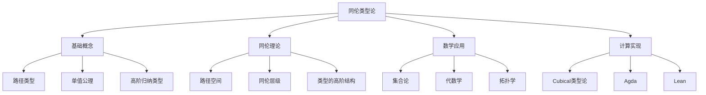
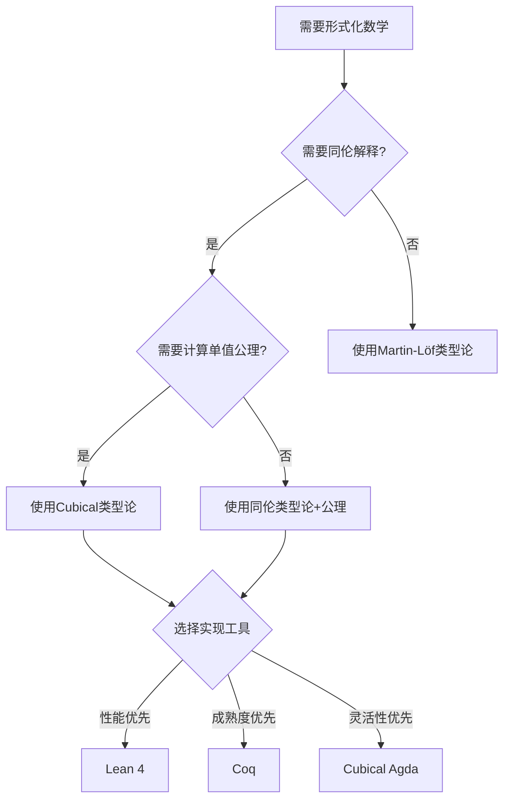
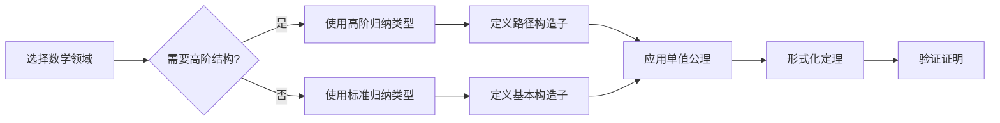
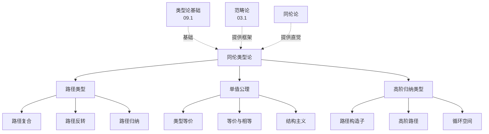
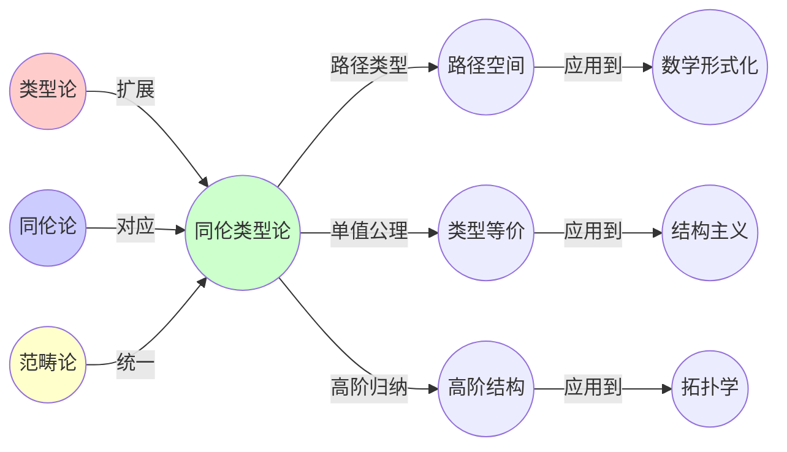

# 03.7 同伦类型论

> **来源**: 基于2025年最新研究进展
> **创建日期**: 2025-11-14
> **最后更新**: 2025-11-14

## 📋 目录

- [03.7 同伦类型论](#037-同伦类型论)
  - [📋 目录](#-目录)
  - [📋 内容概览](#-内容概览)
  - [🎯 核心理念](#-核心理念)
  - [🔬 同伦类型论基础](#-同伦类型论基础)
    - [基本概念](#基本概念)
    - [路径类型](#路径类型)
    - [单值公理](#单值公理)
    - [高阶归纳类型](#高阶归纳类型)
  - [🌐 同伦与拓扑](#-同伦与拓扑)
    - [路径空间](#路径空间)
    - [同伦层级](#同伦层级)
    - [类型的高阶结构](#类型的高阶结构)
  - [📐 单值公理与等价](#-单值公理与等价)
    - [类型等价](#类型等价)
    - [单值公理](#单值公理-1)
    - [等价的计算](#等价的计算)
  - [🏗️ 高阶归纳类型](#️-高阶归纳类型)
    - [基本定义](#基本定义)
    - [构造子](#构造子)
    - [应用实例](#应用实例)
  - [🔢 形式化数学应用](#-形式化数学应用)
    - [集合论的类型化](#集合论的类型化)
    - [代数学的形式化](#代数学的形式化)
    - [拓扑学形式化](#拓扑学形式化)
  - [💻 计算实现](#-计算实现)
    - [Cubical类型论](#cubical类型论)
    - [Agda实现](#agda实现)
    - [Lean实现](#lean实现)
  - [📊 详细案例研究](#-详细案例研究)
    - [案例研究 1：圆周的类型论构造](#案例研究-1圆周的类型论构造)
    - [案例研究 2：群论的形式化](#案例研究-2群论的形式化)
    - [案例研究 3：同伦群的类型论描述](#案例研究-3同伦群的类型论描述)
  - [⚠️ 批判性分析与局限性](#️-批判性分析与局限性)
    - [局限性讨论](#局限性讨论)
    - [改进方向](#改进方向)
  - [📊 思维表征体系](#-思维表征体系)
    - [📊 1. 思维导图（增强版）](#-1-思维导图增强版)
      - [1.1 文本格式（基础版）](#11-文本格式基础版)
      - [1.2 Mermaid格式（可视化版）](#12-mermaid格式可视化版)
    - [📊 2. 多维对比矩阵](#-2-多维对比矩阵)
      - [2.1 类型论系统对比矩阵](#21-类型论系统对比矩阵)
      - [2.2 数学形式化方法对比矩阵](#22-数学形式化方法对比矩阵)
      - [2.3 实现工具对比矩阵](#23-实现工具对比矩阵)
    - [🌲 3. 决策树](#-3-决策树)
      - [3.1 选择类型论系统决策树](#31-选择类型论系统决策树)
    - [🛤️ 4. 决策逻辑路径](#️-4-决策逻辑路径)
      - [4.1 形式化数学的路径](#41-形式化数学的路径)
    - [🕸️ 5. 概念关系网络](#️-5-概念关系网络)
      - [5.1 同伦类型论概念关系网络](#51-同伦类型论概念关系网络)
    - [🗺️ 6. 知识图谱](#️-6-知识图谱)
      - [6.1 同伦类型论知识图谱](#61-同伦类型论知识图谱)
  - [📚 理论体系](#-理论体系)
    - [理论基础](#理论基础)
      - [数学基础](#数学基础)
      - [历史发展](#历史发展)
    - [理论框架](#理论框架)
      - [核心假设](#核心假设)
      - [基本概念体系](#基本概念体系)
      - [主要定理/结论](#主要定理结论)
      - [适用范围和边界](#适用范围和边界)
    - [当前知识共识](#当前知识共识)
      - [学术界共识](#学术界共识)
      - [主要争议点](#主要争议点)
      - [权威来源](#权威来源)
    - [与其他理论的关系](#与其他理论的关系)
      - [逻辑关系](#逻辑关系)
      - [映射关系](#映射关系)
  - [🔗 关联网络](#-关联网络)
    - [🔗 概念级关联](#-概念级关联)
      - [核心概念映射](#核心概念映射)
    - [🔗 理论级关联](#-理论级关联)
      - [理论基础](#理论基础-1)
    - [🔗 方法级关联](#-方法级关联)
      - [方法应用网络](#方法应用网络)
    - [🔗 应用场景关联](#-应用场景关联)
  - [🛤️ 学习路径](#️-学习路径)
    - [前置知识](#前置知识)
    - [后续学习](#后续学习)
    - [并行学习](#并行学习)
  - [🔗 相关文档](#-相关文档)
    - [内部关联](#内部关联)
    - [外部资源](#外部资源)
  - [📖 扩展阅读](#-扩展阅读)
    - [经典教材](#经典教材)
    - [学术论文](#学术论文)
    - [在线资源](#在线资源)
    - [工具和库](#工具和库)

---

## 📋 内容概览

同伦类型论（Homotopy Type Theory, HoTT）是类型论、同伦论和范畴论三者融合的前沿理论，将类型视为拓扑空间，将路径视为同伦，将等价视为弱等价。它为数学的形式化提供了新的基础，使得很多经典的数学结构可以自然地用类型论表达。本文档全面阐述同伦类型论的基本概念、核心理论、应用实践和最新发展。

---

## 🎯 核心理念

**核心思想**：类型即空间，路径即证明，等价即弱等价

同伦类型论将类型论与同伦论统一起来：

- **类型** = **拓扑空间**：每个类型对应一个拓扑空间
- **项** = **点**：类型的元素对应空间中的点
- **路径类型** = **路径空间**：a ≡ b 表示从 a 到 b 的路径
- **路径的路径** = **同伦**：路径之间可以有高阶路径
- **类型等价** = **弱同伦等价**：等价类型有相同的同伦类型

这种对应关系使得数学的结构可以在类型论中自然地表达，并为形式化数学提供了新的视角。

## 🔬 同伦类型论基础

### 基本概念

**同伦类型论**（Homotopy Type Theory, HoTT）是Martin-Löf类型论的扩展，引入了路径类型和单值公理。

**核心创新**：

1. **路径类型**：`a ≡ b` 表示从 a 到 b 的路径
2. **单值公理**：类型等价与类型相等一致
3. **高阶归纳类型**：可以定义高阶结构

### 路径类型

**定义**：对于类型 A 和项 a, b : A，路径类型 `a ≡ b` 表示从 a 到 b 的路径。

**构造子**：

```agda
-- 自反路径
refl : (a : A) → a ≡ a

-- 路径复合
_∙_ : {a b c : A} → a ≡ b → b ≡ c → a ≡ c

-- 路径反转
sym : {a b : A} → a ≡ b → b ≡ a
```

**路径归纳**：

```agda
J : {A : Type} {a : A} (P : (b : A) → a ≡ b → Type)
  → P a refl
  → (b : A) (p : a ≡ b) → P b p
```

路径类型允许我们表达"两个项相等"的证明，并将这些证明视为一等公民。

### 单值公理

**单值公理**（Univalence Axiom）是同伦类型论的核心公理：

```agda
univalence : {A B : Type} → (A ≃ B) ≃ (A ≡ B)
```

**含义**：两个等价的类型在类型论意义下相等。

**重要性**：

- 允许类型替换：如果 A ≡ B，可以在任何地方用 B 替换 A
- 实现结构主义：类型由其结构决定，而非表示
- 统一等价与相等：消除了"相等但不等价"的困境

### 高阶归纳类型

**高阶归纳类型**（Higher Inductive Types, HITs）允许在类型的构造中包含路径：

**例子：圆周 S¹**

```agda
data S¹ : Type where
  base : S¹
  loop : base ≡ base
```

这里 `loop` 是一个路径，连接 `base` 到自身，表示圆周上的一条闭合路径。

## 🌐 同伦与拓扑

### 路径空间

**路径空间** `Path A a b` 是从 a 到 b 的所有路径的集合。

**性质**：

- **路径空间是类型**：路径空间本身是类型
- **路径的路径**：可以有路径之间的路径（2-路径）
- **高阶路径**：可以有无穷高阶的路径

### 同伦层级

**同伦层级**（Homotopy Levels）将类型按结构复杂度分类：

```agda
isContr : Type → Type
isContr A = Σ[ a ∈ A ] ((b : A) → a ≡ b)

isProp : Type → Type
isProp A = (a b : A) → a ≡ b

isSet : Type → Type
isSet A = (a b : A) → isProp (a ≡ b)

isGroupoid : Type → Type
isGroupoid A = (a b : A) → isSet (a ≡ b)
```

**层级对应**：

- **(-2)-类型**：契约类型（Contractible）
- **(-1)-类型**：命题（Proposition）
- **0-类型**：集合（Set）
- **1-类型**：群胚（Groupoid）
- **n-类型**：n-群胚（n-Groupoid）

### 类型的高阶结构

**类型的高阶结构**反映了空间的同伦信息：

```agda
-- 循环空间
Ω : (A : Type) (a : A) → Type
Ω A a = a ≡ a

-- n次循环空间
Ωⁿ : (A : Type) (a : A) (n : ℕ) → Type
Ωⁿ A a 0 = A
Ωⁿ A a (suc n) = Ω (Ωⁿ A a n) refl
```

这些结构对应拓扑中的同伦群。

## 📐 单值公理与等价

### 类型等价

**类型等价**的定义：

```agda
_≃_ : Type → Type → Type
A ≃ B = Σ[ f ∈ (A → B) ]
       Σ[ g ∈ (B → A) ]
       ((x : A) → g (f x) ≡ x) ×
       ((y : B) → f (g y) ≡ y)
```

等价是函数 f: A → B，存在逆函数 g，使得 f 和 g 互逆。

### 单值公理

**单值公理**建立了等价与相等的对应：

```agda
univalence : {A B : Type} → (A ≃ B) ≃ (A ≡ B)
```

**推论**：

- 等价类型可以互相替换
- 类型族保持等价
- 结构可以自由转换

### 等价的计算

**等价的计算**允许我们通过等价来操作类型：

```agda
-- 通过等价转换
transport : {A B : Type} → A ≃ B → A → B
transport (f , _) = f

-- 等价保持结构
equiv-ap : {A B : Type} (e : A ≃ B) (P : Type → Type)
         → P A ≃ P B
```

## 🏗️ 高阶归纳类型

### 基本定义

**高阶归纳类型**允许在类型的构造中包含路径。

**通用形式**：

```agda
data HIT : Type where
  point : HIT
  path : point ≡ point
  2path : path ≡ sym path
  ...
```

### 构造子

高阶归纳类型的构造子可以包括：

- **点构造子**：构造类型的元素
- **路径构造子**：构造元素之间的路径
- **高阶路径构造子**：构造路径之间的路径

### 应用实例

**实例1：球面 S²**

```agda
data S² : Type where
  north : S²
  surf : refl {x = north} ≡ refl
```

`surf` 是一个 2-路径，表示球面的表面。

**实例2：环面 T²**

```agda
data T² : Type where
  base : T²
  loop₁ : base ≡ base
  loop₂ : base ≡ base
  surf : loop₁ ∙ loop₂ ≡ loop₂ ∙ loop₁
```

`surf` 表示两个循环路径的交换性。

## 🔢 形式化数学应用

### 集合论的类型化

**集合**在HoTT中定义为0-类型：

```agda
isSet : Type → Type
isSet A = (a b : A) → isProp (a ≡ b)
```

**集合的构造**：

```agda
-- 自然数集合
ℕ : Set
ℕ = data ℕ where
  zero : ℕ
  suc : ℕ → ℕ

-- 整数集合
ℤ : Set
ℤ = ℕ + ℕ  -- 正数和负数
```

### 代数学的形式化

**群**的形式化：

```agda
record Group : Type₁ where
  field
    G : Set
    e : G
    _·_ : G → G → G
    inv : G → G
    assoc : (x y z : G) → (x · y) · z ≡ x · (y · z)
    identity : (x : G) → e · x ≡ x
    inverse : (x : G) → inv x · x ≡ e
```

**同态**的定义：

```agda
record GroupHom (G H : Group) : Type where
  field
    map : Group.G G → Group.G H
    preserves-mul : (x y : Group.G G)
                  → map (Group._·_ G x y) ≡ Group._·_ H (map x) (map y)
```

### 拓扑学形式化

**拓扑空间**在HoTT中自然地对应类型：

```agda
-- 路径连通性
isConnected : Type → Type
isConnected A = (x y : A) → ∥ x ≡ y ∥

-- 同伦等价
isHomotopyEquiv : {A B : Type} → (A → B) → Type
isHomotopyEquiv f = Σ[ g ∈ (B → A) ]
                   Σ[ η ∈ ((x : A) → g (f x) ≡ x) ]
                   Σ[ ε ∈ ((y : B) → f (g y) ≡ y) ]
                   ((x : A) → ap f (η x) ≡ ε (f x))
```

## 💻 计算实现

### Cubical类型论

**Cubical类型论**是HoTT的计算实现：

**核心特征**：

- **立方路径**：用立方表示路径
- **Kan填充条件**：保证路径的延拓
- **计算单值公理**：单值公理可计算

**Cubical Agda示例**：

```agda
-- 路径类型
Path : (A : Type) → A → A → Type
Path A = λ x y → PathP (λ i → A) x y

-- 路径复合
_∙∙_ : {A : Type} {x y z : A}
     → Path A x y → Path A y z → Path A x z
p ∙∙ q = λ i → hcomp (λ j → λ { (i = i0) → p (~ j)
                               ; (i = i1) → q j })
                     (p i)
```

### Agda实现

**Agda**支持HoTT的多种实现：

- **标准库**：包含基础的HoTT库
- **Cubical模式**：支持Cubical类型论
- **Univalence公理**：可以作为公理添加

### Lean实现

**Lean 4**支持HoTT：

- **同伦类型论库**：mathlib中的HoTT部分
- **单值公理**：作为公理系统
- **高阶归纳类型**：通过商类型实现

## 📊 详细案例研究

### 案例研究 1：圆周的类型论构造

**背景**：圆周 S¹ 是同伦类型论的经典例子。

**类型论构造**：

```agda
data S¹ : Type where
  base : S¹
  loop : base ≡ base

-- 路径空间
ΩS¹ : Type
ΩS¹ = base ≡ base

-- 路径的路径
Ω²S¹ : Type
Ω²S¹ = loop ≡ loop
```

**关键性质**：

- S¹ 的基本群是 ℤ
- 路径空间 ΩS¹ 是整数类型
- 可以通过路径归纳证明性质

**应用**：

- 循环空间的构造
- 纤维化的研究
- 同伦群的计算

### 案例研究 2：群论的形式化

**背景**：使用HoTT形式化群论。

**群的构造**：

```agda
record Group : Type₁ where
  constructor group
  field
    G : Set
    e : G
    _·_ : G → G → G
    inv : G → G
    assoc : (x y z : G) → (x · y) · z ≡ x · (y · z)
    identity-l : (x : G) → e · x ≡ x
    identity-r : (x : G) → x · e ≡ x
    inverse-l : (x : G) → inv x · x ≡ e
    inverse-r : (x : G) → x · inv x ≡ e
```

**同态与同构**：

```agda
record GroupHom (G H : Group) : Type where
  field
    map : Group.G G → Group.G H
    preserves-mul : (x y : Group.G G)
                  → map (Group._·_ G x y) ≡ Group._·_ H (map x) (map y)
    preserves-e : map (Group.e G) ≡ Group.e H

GroupIso : Group → Group → Type
GroupIso G H = Σ[ f ∈ GroupHom G H ] isEquiv (GroupHom.map f)
```

**单值公理的应用**：

通过单值公理，等价的群在类型论意义下相等：

```agda
univalence-implies-group-equality : (G H : Group)
  → GroupIso G H → G ≡ H
```

### 案例研究 3：同伦群的类型论描述

**背景**：使用类型论描述空间的同伦群。

**n维同伦群**：

```agda
-- n维球面
data Sⁿ : (n : ℕ) → Type where
  north : {n : ℕ} → Sⁿ n
  -- 简化为关键结构

-- n维同伦群
πₙ : (n : ℕ) (A : Type) (a : A) → Set
πₙ n A a = ∥ Ωⁿ A a n ∥₀  -- 路径空间的0-截断

-- 同伦群的群结构
πₙ-is-Group : (n : ℕ) (A : Type) (a : A) → Group
πₙ-is-Group n A a = -- 构造群结构
```

**应用**：

- 计算经典空间的同伦群
- 研究纤维化的同伦群序列
- 形式化同伦理论

## ⚠️ 批判性分析与局限性

### 局限性讨论

**1. 计算复杂度**

- **问题**：单值公理的计算实现复杂
- **影响**：类型检查可能变慢
- **现状**：Cubical类型论提供了可计算的单值公理

**2. 构造性限制**

- **问题**：某些经典数学结果需要选择公理
- **影响**：不能直接形式化某些定理
- **现状**：可以通过模态或截断来处理

**3. 学习曲线陡峭**

- **问题**：需要同时理解类型论、同伦论和范畴论
- **影响**：入门门槛高
- **现状**：需要更好的教材和工具

**4. 工具成熟度**

- **问题**：支持HoTT的工具仍在发展中
- **影响**：实际应用受限
- **现状**：Cubical Agda和Lean 4提供了良好支持

### 改进方向

**1. 提高计算效率**

- 优化类型检查算法
- 改进单值公理的计算
- 开发专用编译器

**2. 扩展应用范围**

- 形式化更多数学领域
- 开发实用工具
- 建立标准库

**3. 降低学习门槛**

- 编写更好的教材
- 开发可视化工具
- 提供更多例子

**4. 增强工具支持**

- 改进IDE支持
- 开发调试工具
- 优化错误信息

## 📊 思维表征体系

### 📊 1. 思维导图（增强版）

#### 1.1 文本格式（基础版）

```text
同伦类型论 (HoTT)
├── 基础概念
│   ├── 路径类型
│   ├── 单值公理
│   └── 高阶归纳类型
├── 同伦理论
│   ├── 路径空间
│   ├── 同伦层级
│   └── 类型的高阶结构
├── 数学应用
│   ├── 集合论
│   ├── 代数学
│   └── 拓扑学
└── 计算实现
    ├── Cubical类型论
    ├── Agda
    └── Lean
```

#### 1.2 Mermaid格式（可视化版）



### 📊 2. 多维对比矩阵

#### 2.1 类型论系统对比矩阵

| 特征 | Martin-Löf类型论 | 同伦类型论 | Cubical类型论 |
|------|-----------------|-----------|--------------|
| **路径类型** | 仅命题相等 | 完整路径类型 | 立方路径 |
| **单值公理** | ❌ | 公理 | 可计算 |
| **高阶归纳类型** | ❌ | ✅ | ✅ |
| **计算性** | ✅ | ⚠️ | ✅ |
| **同伦解释** | ❌ | ✅ | ✅ |
| **应用范围** | 基础 | 广泛 | 广泛 |

#### 2.2 数学形式化方法对比矩阵

| 特征 | 集合论 | 类型论 | 同伦类型论 |
|------|--------|--------|-----------|
| **基础** | ZFC公理 | 构造性 | 路径+单值 |
| **等价处理** | 外延性 | 命题相等 | 类型等价 |
| **同构处理** | 显式构造 | 命题相等 | 自动识别 |
| **结构主义** | ⚠️ | ⚠️ | ✅ |
| **构造性** | ❌ | ✅ | ✅ |
| **形式化工具** | Isabelle/ZFC | Coq/Agda | Cubical Agda/Lean |

#### 2.3 实现工具对比矩阵

| 特征 | Coq | Agda | Cubical Agda | Lean 4 |
|------|-----|------|-------------|--------|
| **HoTT支持** | 插件 | 库 | 原生 | 库 |
| **单值公理** | 公理 | 公理 | 可计算 | 公理 |
| **高阶归纳类型** | ⚠️ | ✅ | ✅ | ✅ |
| **性能** | 高 | 中 | 中 | 高 |
| **社区** | 大 | 中 | 小 | 大 |
| **文档** | 丰富 | 中等 | 较少 | 丰富 |

### 🌲 3. 决策树

#### 3.1 选择类型论系统决策树



### 🛤️ 4. 决策逻辑路径

#### 4.1 形式化数学的路径



### 🕸️ 5. 概念关系网络

#### 5.1 同伦类型论概念关系网络



### 🗺️ 6. 知识图谱

#### 6.1 同伦类型论知识图谱



## 📚 理论体系

### 理论基础

#### 数学基础

同伦类型论的理论基础：

**1. 类型论基础**：

- Martin-Löf类型论
- 依赖类型
- 归纳类型
- 函数类型

**2. 同伦论基础**：

- 拓扑空间
- 路径空间
- 同伦群
- 纤维化

**3. 范畴论基础**：

- (∞,1)-范畴
- 同伦范畴
- 模型范畴
- 稳定同伦论

#### 历史发展

**关键时间节点**：

- **2006-2009年**：Vladimir Voevodsky提出单值公理
  - 发现类型等价与类型相等的对应
  - 提出同伦类型论的框架

- **2012年**：《Homotopy Type Theory》书出版
  - 统一了类型论与同伦论
  - 建立了形式化数学的新基础

- **2013-2015年**：Cubical类型论的发展
  - 提供可计算的单值公理
  - 实现高阶归纳类型

- **2016-2020年**：工具和库的成熟
  - Cubical Agda发布
  - Lean的HoTT库发展
  - 大量数学形式化项目

- **2021-2025年**：应用扩展
  - 更多数学领域的形式化
  - 实际应用项目
  - 教育和推广

### 理论框架

#### 核心假设

**假设1：类型即空间**

- **内容**：每个类型对应一个拓扑空间
- **适用范围**：所有类型
- **限制条件**：需要理解同伦论

**假设2：路径即证明**

- **内容**：相等性的证明对应路径
- **适用范围**：所有路径类型
- **限制条件**：需要理解路径的计算

**假设3：等价与相等一致**

- **内容**：单值公理成立
- **适用范围**：所有类型
- **限制条件**：需要可计算的实现

#### 基本概念体系

**核心概念层次**：

1. **基础层**：类型、项、函数
2. **路径层**：路径类型、路径复合
3. **同伦层**：高阶路径、同伦层级
4. **等价层**：类型等价、单值公理
5. **应用层**：数学形式化、计算实现

#### 主要定理/结论

**定理1：单值公理**

- **内容**：类型等价与类型相等一致
- **证据**：模型论证明
- **应用**：类型替换、结构主义

**定理2：路径归纳**

- **内容**：路径类型满足归纳原理
- **证据**：类型论构造
- **应用**：路径上的推理

**定理3：同伦层级**

- **内容**：类型按同伦结构分类
- **证据**：拓扑对应
- **应用**：数学结构分类

**结论4：数学形式化**

- **内容**：很多数学可以自然形式化
- **证据**：大量形式化项目
- **应用**：形式化数学、定理证明

#### 适用范围和边界

**适用范围**：

- 构造性数学
- 同伦论和代数拓扑
- 范畴论和范畴化数学
- 类型论和计算机科学

**边界条件**：

- 需要构造性证明
- 某些经典结果需要模态
- 计算复杂度可能较高

**不适用场景**：

- 经典非构造性数学（需要额外处理）
- 实时系统（性能要求高）
- 大规模商业软件（成熟度限制）

### 当前知识共识

#### 学术界共识

**广泛接受的共识**：

1. **HoTT的重要性**
   - **共识**：HoTT是形式化数学的重要基础
   - **支持证据**：大量研究项目
   - **来源**：数学、计算机科学

2. **单值公理的价值**
   - **共识**：单值公理实现了结构主义
   - **支持证据**：简化形式化
   - **来源**：形式化数学实践

3. **应用前景**
   - **共识**：HoTT有广阔应用前景
   - **支持证据**：成功的形式化项目
   - **来源**：学术界和工业界

#### 主要争议点

1. **计算性**
   - **观点A**：单值公理应该可计算
   - **观点B**：作为公理即可
   - **当前状态**：Cubical类型论提供了可计算版本

2. **基础地位**
   - **观点A**：HoTT可以替代集合论
   - **观点B**：HoTT是补充而非替代
   - **当前状态**：多数认为HoTT是重要的补充

3. **实用性**
   - **观点A**：HoTT已经足够实用
   - **观点B**：HoTT还不够成熟
   - **当前状态**：工具和库在快速发展

#### 权威来源

**经典文献**：

- 《Homotopy Type Theory: Univalent Foundations of Mathematics》- Univalent Foundations Program
- 《Introduction to Homotopy Type Theory》- Egbert Rijke
- 《Cubical Type Theory》- Various authors

**权威机构/专家**：

- **Univalent Foundations Program**
- **HoTT社区**
- **Cubical类型论研究组**

**最新发展（2020-2025）**：

- Cubical Agda的成熟
- Lean 4的HoTT支持
- 大量数学形式化项目
- 教育和推广活动

### 与其他理论的关系

#### 逻辑关系

**理论基础**：

- **Martin-Löf类型论**（[09.1_逻辑与类型的对应.md](../09_Curry-Howard同构/09.1_逻辑与类型的对应.md)） → 同伦类型论
- **范畴论**（[03.1_范畴论基础.md](03.1_范畴论基础.md)） → 同伦类型论
- **同伦论** → 同伦类型论

**扩展关系**：

- 同伦类型论 → **Cubical类型论**
- 同伦类型论 → **模态类型论**
- 同伦类型论 → **合成同伦论**

#### 映射关系

| 同伦类型论 | 对应 | 其他理论 |
|-----------|------|---------|
| 类型 | ↔ | 拓扑空间 |
| 路径类型 | ↔ | 路径空间 |
| 类型等价 | ↔ | 弱同伦等价 |
| 高阶归纳类型 | ↔ | CW复形 |
| 单值公理 | ↔ | 同伦等价原理 |

## 🔗 关联网络

### 🔗 概念级关联

#### 核心概念映射

| HoTT概念 | 对应概念 | 关联文档 |
|---------|---------|---------|
| 路径类型 | 路径空间 | [03.1_范畴论基础.md](03.1_范畴论基础.md) |
| 单值公理 | 类型等价 | [09.2_基本对应关系详解.md](../09_Curry-Howard同构/09.2_基本对应关系详解.md) |
| 高阶归纳类型 | CW复形 | [03.6_量子计算中的范畴论.md](03.6_量子计算中的范畴论.md) |
| 同伦层级 | 类型层级 | [09.4_依赖类型系统.md](../09_Curry-Howard同构/09.4_依赖类型系统.md) |

### 🔗 理论级关联

#### 理论基础

- **类型论**：提供了HoTT的语法基础
- **同伦论**：提供了HoTT的语义解释
- **范畴论**：提供了HoTT的数学框架

### 🔗 方法级关联

#### 方法应用网络

| 方法 | 应用场景 | 相关工具 |
|------|---------|---------|
| 路径归纳 | 证明路径上的性质 | Agda, Lean |
| 单值公理应用 | 类型替换 | Cubical Agda |
| 高阶归纳类型 | 定义拓扑空间 | All HoTT tools |
| 同伦层级分析 | 分类类型结构 | Lean, Agda |

### 🔗 应用场景关联

| 应用场景 | 使用HoTT的优势 | 相关文档 |
|---------|---------------|---------|
| 数学形式化 | 自然表达结构 | [07.6_AI系统形式化验证.md](../07_IT行业形式化应用/07.6_AI系统形式化验证.md) |
| 定理证明 | 路径即证明 | [09.5_实际应用.md](../09_Curry-Howard同构/09.5_实际应用.md) |
| 程序验证 | 类型安全 | [07.4_分布式系统.md](../07_IT行业形式化应用/07.4_分布式系统.md) |

## 🛤️ 学习路径

### 前置知识

**必需知识**：

1. **类型论基础**
   - Martin-Löf类型论
   - 依赖类型
   - 归纳类型

2. **基础数学**
   - 集合论
   - 抽象代数
   - 基础拓扑

3. **编程基础**
   - 函数式编程
   - 类型系统
   - 证明辅助工具

**推荐学习顺序**：

1. 学习类型论基础（[09.1_逻辑与类型的对应.md](../09_Curry-Howard同构/09.1_逻辑与类型的对应.md)）
2. 学习范畴论基础（[03.1_范畴论基础.md](03.1_范畴论基础.md)）
3. 学习基础拓扑
4. 学习HoTT

### 后续学习

**深入方向**：

1. **Cubical类型论**
   - 可计算的单值公理
   - 立方路径
   - Kan填充条件

2. **模态类型论**
   - 模态运算符
   - 合成同伦论
   - 计算效果

3. **数学形式化**
   - 代数学形式化
   - 拓扑学形式化
   - 同伦论形式化

### 并行学习

**相关主题**：

- **范畴论**（[03.1_范畴论基础.md](03.1_范畴论基础.md)）
- **类型论**（[09.1_逻辑与类型的对应.md](../09_Curry-Howard同构/09.1_逻辑与类型的对应.md)）
- **形式化验证**（[07.6_AI系统形式化验证.md](../07_IT行业形式化应用/07.6_AI系统形式化验证.md)）

## 🔗 相关文档

### 内部关联

- [03.1_范畴论基础.md](03.1_范畴论基础.md) - 范畴论基础
- [03.6_量子计算中的范畴论.md](03.6_量子计算中的范畴论.md) - 范畴论应用
- [09.1_逻辑与类型的对应.md](../09_Curry-Howard同构/09.1_逻辑与类型的对应.md) - 类型论基础
- [09.4_依赖类型系统.md](../09_Curry-Howard同构/09.4_依赖类型系统.md) - 依赖类型
- [09.6_立方类型论.md](../09_Curry-Howard同构/09.6_立方类型论.md) - Cubical类型论
- [07.6_AI系统形式化验证.md](../07_IT行业形式化应用/07.6_AI系统形式化验证.md) - 形式化应用

### 外部资源

- HoTT Book: https://homotopytypetheory.org/book/
- Cubical Agda: https://agda.readthedocs.io/en/latest/language/cubical.html
- Lean 4 HoTT: https://leanprover.github.io/

## 📖 扩展阅读

### 经典教材

1. **《Homotopy Type Theory: Univalent Foundations of Mathematics》**
   - 作者：Univalent Foundations Program
   - 出版：2013
   - 内容：HoTT的完整介绍

2. **《Introduction to Homotopy Type Theory》**
   - 作者：Egbert Rijke
   - 出版：2022
   - 内容：HoTT的现代介绍

3. **《Cubical Methods in Homotopy Type Theory and Univalent Foundations》**
   - 作者：Various
   - 内容：Cubical类型论

### 学术论文

1. **单值公理的原始论文**
   - Voevodsky的原始工作
   - 模型论解释

2. **Cubical类型论**
   - 可计算单值公理
   - Kan填充条件

3. **应用论文**
   - 数学形式化项目
   - 工具开发

### 在线资源

1. **HoTT社区网站**
   - https://homotopytypetheory.org/
   - 最新研究动态

2. **Cubical Agda文档**
   - https://agda.readthedocs.io/
   - 实现细节

3. **Lean 4文档**
   - https://leanprover.github.io/
   - HoTT库

### 工具和库

1. **Cubical Agda**
   - 支持Cubical类型论
   - 可计算的单值公理

2. **Lean 4**
   - HoTT库
   - 数学形式化

3. **Coq HoTT**
   - HoTT插件
   - 公理系统

---

**文档版本**: v1.0
**最后更新**: 2025-11-14
**维护者**: FormalScience项目组
