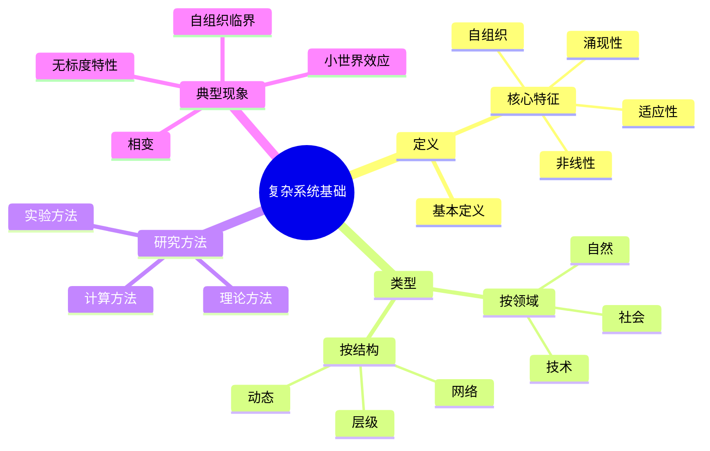
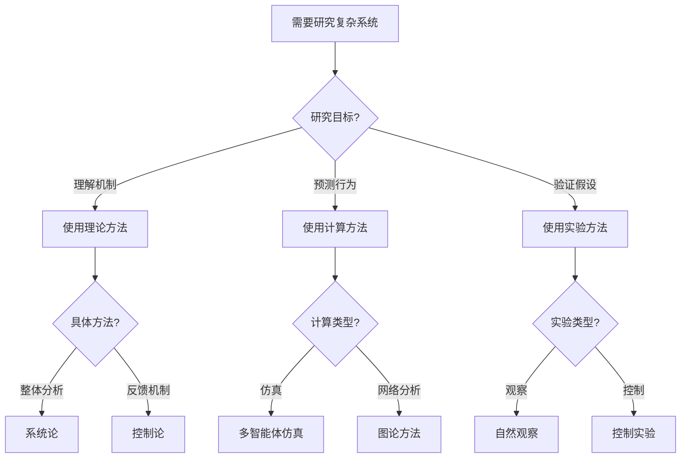
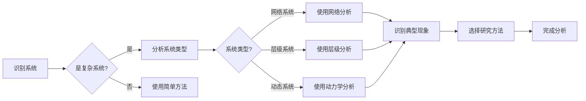
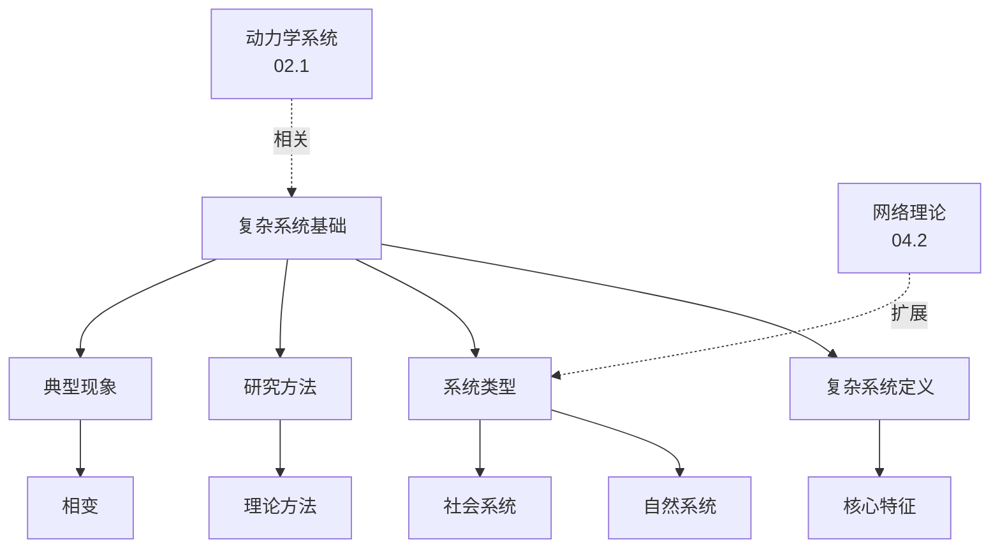
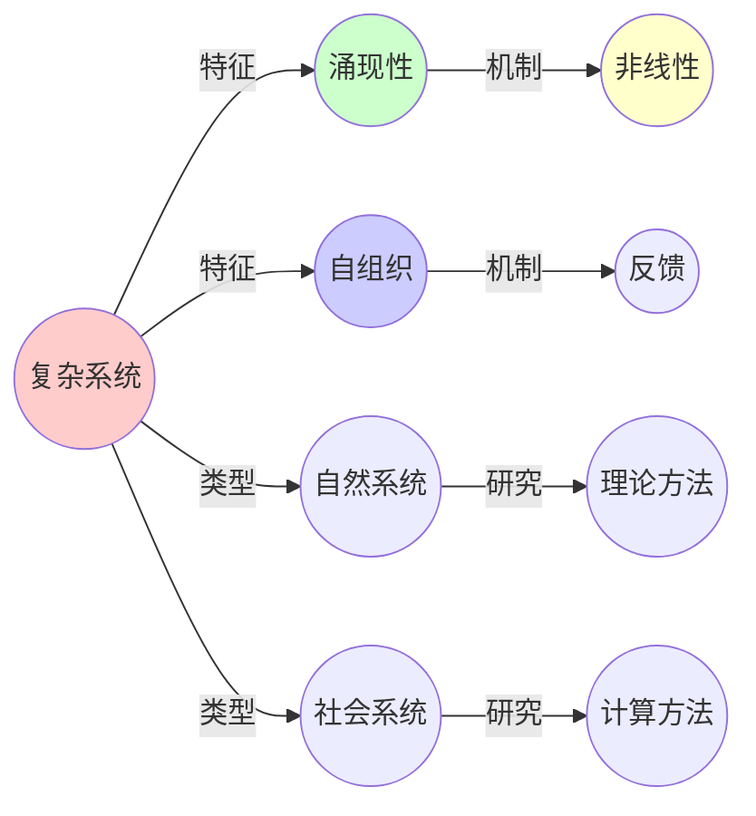
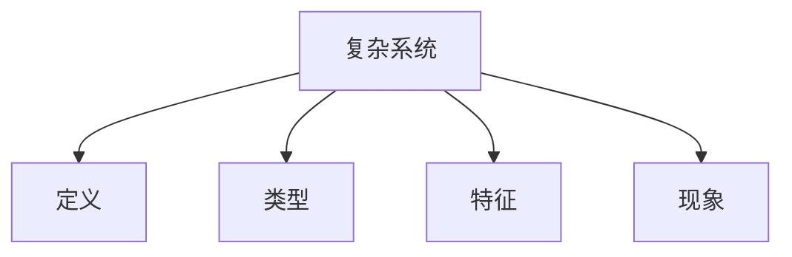

# 04.1 复杂系统基础

> **来源**: view03.md, view04.md, view05.md
> **创建日期**: 2025-01-27
> **最后更新**: 2025-01-27

## 📋 目录

- [04.1 复杂系统基础](#041-复杂系统基础)
  - [📋 目录](#-目录)
  - [📋 内容概览](#-内容概览)
  - [🎯 核心理念](#-核心理念)
  - [📚 复杂系统的定义](#-复杂系统的定义)
    - [基本定义](#基本定义)
    - [核心特征](#核心特征)
  - [🔍 复杂系统 vs 简单系统](#-复杂系统-vs-简单系统)
  - [📊 复杂系统的类型](#-复杂系统的类型)
    - [1. 按领域分类](#1-按领域分类)
      - [自然复杂系统](#自然复杂系统)
      - [社会复杂系统](#社会复杂系统)
      - [技术复杂系统](#技术复杂系统)
    - [2. 按结构分类](#2-按结构分类)
      - [网络系统](#网络系统)
      - [层级系统](#层级系统)
      - [动态系统](#动态系统)
  - [🎯 复杂系统的研究方法](#-复杂系统的研究方法)
    - [1. 理论方法](#1-理论方法)
    - [2. 计算方法](#2-计算方法)
    - [3. 实验方法](#3-实验方法)
  - [📈 复杂系统的典型现象](#-复杂系统的典型现象)
    - [1. 相变（Phase Transition）](#1-相变phase-transition)
    - [2. 自组织临界（Self-Organized Criticality）](#2-自组织临界self-organized-criticality)
    - [3. 小世界效应（Small World Effect）](#3-小世界效应small-world-effect)
    - [4. 无标度特性（Scale-Free Property）](#4-无标度特性scale-free-property)
  - [⚠️ 复杂系统研究的挑战](#️-复杂系统研究的挑战)
    - [1. 理论挑战](#1-理论挑战)
    - [2. 方法挑战](#2-方法挑战)
    - [3. 应用挑战](#3-应用挑战)
  - [📊 详细案例研究](#-详细案例研究)
    - [案例研究 1：生态系统中的涌现性](#案例研究-1生态系统中的涌现性)
    - [案例研究 2：社交网络中的小世界效应](#案例研究-2社交网络中的小世界效应)
    - [案例研究 3：金融市场中的自组织临界](#案例研究-3金融市场中的自组织临界)
  - [⚠️ 批判性分析与局限性](#️-批判性分析与局限性)
    - [局限性讨论](#局限性讨论)
      - [1. 复杂系统定义的模糊性](#1-复杂系统定义的模糊性)
      - [2. 涌现性的可预测性问题](#2-涌现性的可预测性问题)
      - [3. 方法论的限制](#3-方法论的限制)
    - [改进方向](#改进方向)
      - [1. 发展定量方法](#1-发展定量方法)
      - [2. 提高预测能力](#2-提高预测能力)
  - [📊 思维表征体系](#-思维表征体系)
    - [📊 1. 思维导图（增强版）](#-1-思维导图增强版)
      - [1.1 文本格式（基础版）](#11-文本格式基础版)
      - [1.2 Mermaid格式（可视化版）](#12-mermaid格式可视化版)
    - [📊 2. 多维对比矩阵](#-2-多维对比矩阵)
      - [2.1 复杂系统与简单系统对比矩阵](#21-复杂系统与简单系统对比矩阵)
      - [2.2 复杂系统类型对比矩阵](#22-复杂系统类型对比矩阵)
      - [2.3 复杂系统现象对比矩阵](#23-复杂系统现象对比矩阵)
    - [🌲 3. 决策树](#-3-决策树)
      - [3.1 复杂系统研究方法选择决策树](#31-复杂系统研究方法选择决策树)
    - [🛤️ 4. 决策逻辑路径](#️-4-决策逻辑路径)
      - [4.1 复杂系统分析路径](#41-复杂系统分析路径)
    - [🕸️ 5. 概念关系网络](#️-5-概念关系网络)
      - [5.1 复杂系统基础概念关系网络](#51-复杂系统基础概念关系网络)
    - [🗺️ 6. 知识图谱](#️-6-知识图谱)
      - [6.1 复杂系统知识图谱](#61-复杂系统知识图谱)
  - [📚 理论体系](#-理论体系)
    - [理论基础](#理论基础)
      - [数学/系统科学基础](#数学系统科学基础)
      - [历史发展](#历史发展)
    - [理论框架](#理论框架)
      - [核心假设](#核心假设)
      - [基本概念体系](#基本概念体系)
      - [主要定理/结论](#主要定理结论)
      - [适用范围和边界](#适用范围和边界)
    - [当前知识共识](#当前知识共识)
      - [学术界共识](#学术界共识)
      - [主要争议点](#主要争议点)
      - [权威来源](#权威来源)
    - [与其他理论的关系](#与其他理论的关系)
      - [逻辑关系](#逻辑关系)
      - [映射关系](#映射关系)
  - [🔗 关联网络](#-关联网络)
    - [🔗 概念级关联](#-概念级关联)
      - [核心概念映射](#核心概念映射)
    - [🔗 理论级关联](#-理论级关联)
      - [理论基础](#理论基础-1)
    - [🔗 方法级关联](#-方法级关联)
      - [方法应用网络](#方法应用网络)
    - [🔗 应用场景关联](#-应用场景关联)
  - [🛤️ 学习路径](#️-学习路径)
    - [前置知识](#前置知识)
    - [后续学习](#后续学习)
    - [并行学习](#并行学习)
  - [🔗 相关文档](#-相关文档)
  - [📖 扩展阅读](#-扩展阅读)

---

## 📋 内容概览

本文档阐述复杂系统的定义、核心特征及其与简单系统的区别。复杂系统由大量相互作用的组件构成，其整体行为无法通过单个组件的行为简单推导，展现了涌现性、自组织等独特性质。

---

## 🎯 核心理念

复杂系统的核心特征是涌现性和自组织。整体行为不是组件行为的简单叠加，而是通过组件间的非线性相互作用产生的新的、不可还原的性质。理解复杂系统需要整体论视角，关注系统层面的模式和规律。

## 📚 复杂系统的定义

### 基本定义

**复杂系统（Complex System）**是"由大量相互作用的组件构成的系统，其整体行为无法通过单个组件的行为简单推导"。

### 核心特征

1. **非线性（Nonlinearity）**
   - 输入与输出不成比例
   - 反馈循环
   - 阈值效应
   - 小变化可能产生大影响

2. **自组织（Self-organization）**
   - 无需外部控制
   - 局部规则产生全局秩序
   - 耗散结构
   - 从无序到有序的涌现

3. **涌现性（Emergence）**
   - 整体大于部分之和
   - 不可还原性
   - 新性质的出现
   - 宏观模式从微观交互中产生

4. **适应性（Adaptation）**
   - 环境响应
   - 学习与演化
   - 鲁棒性
   - 动态调整

## 🔍 复杂系统 vs 简单系统

| 特征 | 简单系统 | 复杂系统 |
|------|----------|----------|
| **组件数量** | 少量 | 大量 |
| **交互关系** | 线性、可预测 | 非线性、难以预测 |
| **行为** | 可还原为组件行为 | 涌现性，不可还原 |
| **控制** | 外部控制 | 自组织 |
| **预测** | 确定性预测 | 概率性预测 |
| **分析** | 还原论方法 | 整体论方法 |

## 📊 复杂系统的类型

### 1. 按领域分类

#### 自然复杂系统

- **生物系统**：生态系统、生物网络、基因调控网络
- **物理系统**：气候系统、地震系统、湍流
- **化学系统**：反应网络、自催化系统

#### 社会复杂系统

- **经济系统**：市场、金融网络、供应链
- **社会系统**：社交网络、组织、城市
- **信息系统**：互联网、通信网络、知识网络

#### 技术复杂系统

- **工程系统**：电网、交通系统、制造系统
- **计算系统**：分布式系统、云计算、物联网
- **智能系统**：人工智能、机器学习系统

### 2. 按结构分类

#### 网络系统

- 小世界网络
- 无标度网络
- 随机网络
- 规则网络

#### 层级系统

- 多尺度系统
- 嵌套系统
- 分层组织

#### 动态系统

- 混沌系统
- 周期系统
- 随机系统

## 🎯 复杂系统的研究方法

### 1. 理论方法

- **系统论**：整体性分析
- **控制论**：反馈机制
- **信息论**：信息流分析
- **网络科学**：拓扑结构分析

### 2. 计算方法

- **仿真建模**：多智能体仿真、系统动力学
- **网络分析**：图论方法、统计物理方法
- **机器学习**：模式识别、预测建模

### 3. 实验方法

- **观察研究**：自然系统观察
- **控制实验**：简化系统实验
- **数据挖掘**：大规模数据分析

## 📈 复杂系统的典型现象

### 1. 相变（Phase Transition）

系统在参数变化时发生定性行为改变。

**实例**：

- 物理：水的气液相变
- 生态：物种灭绝阈值
- 社会：舆论突变
- 经济：市场崩盘

### 2. 自组织临界（Self-Organized Criticality）

系统自发演化到临界状态。

**特征**：

- 幂律分布
- 雪崩现象
- 长程关联

**实例**：

- 沙堆模型
- 地震系统
- 金融市场

### 3. 小世界效应（Small World Effect）

网络具有短平均路径长度和高聚类系数。

**特征**：

- 六度分离
- 信息快速传播
- 局部密集、全局稀疏

**实例**：

- 社交网络
- 神经网络
- 互联网

### 4. 无标度特性（Scale-Free Property）

度分布服从幂律。

**特征**：

- 少数节点连接极多
- 大多数节点连接很少
- 鲁棒性与脆弱性并存

**实例**：

- 互联网
- 蛋白质网络
- 引用网络

## ⚠️ 复杂系统研究的挑战

### 1. 理论挑战

- **不可还原性**：整体行为无法从组件推导
- **不可预测性**：混沌、随机性
- **多尺度问题**：不同尺度的规律不同

### 2. 方法挑战

- **数据获取**：大规模数据收集困难
- **计算复杂度**：仿真计算资源需求大
- **模型验证**：难以验证复杂模型

### 3. 应用挑战

- **控制困难**：难以精确控制
- **干预风险**：干预可能产生意外后果
- **伦理问题**：涉及人类系统的伦理考量

## 📊 详细案例研究

### 案例研究 1：生态系统中的涌现性

**背景**：生态系统展示了典型的复杂系统特征，局部规则产生全局秩序。

**形式化分析**：

```text
捕食者-猎物系统:
- 微观规则:
  dN/dt = rN(1 - N/K) - aNP
  dP/dt = baNP - mP
- 宏观涌现: 周期性振荡、稳定共存
- 不可还原性: 整体行为无法从单个物种行为推导

多样性-稳定性关系:
- 微观: 物种间竞争、捕食关系
- 宏观: 生态系统稳定性、恢复力
- 涌现: 中等多样性时稳定性最高

应用价值:
- 生态保护
- 资源管理
- 环境政策
```

**关键发现**：

- ✅ 局部相互作用产生全局模式
- ✅ 涌现性质不可从组件推导
- ✅ 非线性相互作用是关键

**应用价值**：

- ✅ 生态保护
- ✅ 资源管理
- ✅ 环境政策

### 案例研究 2：社交网络中的小世界效应

**背景**：社交网络展示了小世界效应，短路径和高聚类并存。

**形式化分析**：

```text
小世界网络:
- 特征: 短平均路径长度、高聚类系数
- 机制: 局部密集连接 + 少量长程连接
- 涌现: 六度分离现象

信息传播:
- 局部: 高聚类使信息在社区内快速传播
- 全局: 短路径使信息快速到达远距离节点
- 结果: 信息快速传播到整个网络

应用价值:
- 社交媒体
- 病毒式营销
- 信息传播
```

**关键发现**：

- ✅ 局部结构产生全局效应
- ✅ 少量长程连接改变网络性质
- ✅ 小世界结构具有普遍性

**应用价值**：

- ✅ 社交媒体设计
- ✅ 营销策略
- ✅ 信息传播

### 案例研究 3：金融市场中的自组织临界

**背景**：金融市场展示自组织临界现象，价格波动呈现幂律分布。

**形式化分析**：

```text
自组织临界:
- 特征: 幂律分布、雪崩现象
- 机制: 交易者相互影响、正反馈
- 结果: 价格波动大小分布服从幂律

临界状态:
- 微观: 交易者决策、市场订单
- 宏观: 价格波动、市场崩盘
- 涌现: 系统自发演化到临界状态

应用价值:
- 风险管理
- 市场预测
- 政策制定
```

**关键发现**：

- ✅ 系统自发演化到临界状态
- ✅ 幂律分布反映了系统结构
- ✅ 临界状态具有普遍性

**应用价值**：

- ✅ 风险管理
- ✅ 市场预测
- ✅ 金融监管

## ⚠️ 批判性分析与局限性

### 局限性讨论

#### 1. 复杂系统定义的模糊性

**问题**：复杂系统的定义缺乏精确标准。

**挑战**：

- ⚠️ 边界模糊
- ⚠️ 判断主观
- ⚠️ 缺乏量化指标

**应对策略**：

- ✅ 建立量化指标
- ✅ 明确判断标准
- ✅ 提供实例对比

#### 2. 涌现性的可预测性问题

**问题**：涌现性往往难以预测和解释。

**挑战**：

- ⚠️ 不可还原性
- ⚠️ 难以预测
- ⚠️ 解释困难

**改进方向**：

- ✅ 发展预测方法
- ✅ 建立解释框架
- ✅ 使用计算方法

#### 3. 方法论的限制

**问题**：复杂系统研究缺乏统一方法论。

**挑战**：

- ⚠️ 方法多样
- ⚠️ 难以验证
- ⚠️ 结果不一致

**改进方向**：

- ✅ 统一方法论
- ✅ 建立验证标准
- ✅ 加强跨学科合作

### 改进方向

#### 1. 发展定量方法

**目标**：建立复杂系统的定量描述。

**方法**：

- 网络度量
- 信息论方法
- 统计物理方法

#### 2. 提高预测能力

**目标**：提高对复杂系统行为的预测能力。

**方法**：

- 机器学习
- 仿真建模
- 数据分析

## 📊 思维表征体系

### 📊 1. 思维导图（增强版）

#### 1.1 文本格式（基础版）

```text
复杂系统基础
├── 复杂系统的定义
│   ├── 基本定义
│   └── 核心特征
│       ├── 非线性
│       ├── 自组织
│       ├── 涌现性
│       └── 适应性
├── 复杂系统 vs 简单系统
│   ├── 组件数量
│   ├── 交互关系
│   ├── 行为特征
│   ├── 控制方式
│   ├── 预测能力
│   └── 分析方法
├── 复杂系统的类型
│   ├── 按领域分类
│   │   ├── 自然复杂系统
│   │   ├── 社会复杂系统
│   │   └── 技术复杂系统
│   └── 按结构分类
│       ├── 网络系统
│       ├── 层级系统
│       └── 动态系统
├── 研究方法
│   ├── 理论方法
│   ├── 计算方法
│   └── 实验方法
├── 典型现象
│   ├── 相变
│   ├── 自组织临界
│   ├── 小世界效应
│   └── 无标度特性
└── 研究挑战
    ├── 理论挑战
    ├── 方法挑战
    └── 应用挑战
```

#### 1.2 Mermaid格式（可视化版）



### 📊 2. 多维对比矩阵

#### 2.1 复杂系统与简单系统对比矩阵

| 维度 | 简单系统 | 复杂系统 | 差异程度 | 说明 |
|------|---------|---------|---------|------|
| **组件数量** | 少量 | 大量 | 很大 | 数量差异显著 |
| **交互关系** | 线性、可预测 | 非线性、难以预测 | 很大 | 关系复杂性差异 |
| **行为特征** | 可还原 | 涌现性、不可还原 | 很大 | 行为性质差异 |
| **控制方式** | 外部控制 | 自组织 | 很大 | 控制方式差异 |
| **预测能力** | 确定性预测 | 概率性预测 | 很大 | 预测精度差异 |
| **分析方法** | 还原论 | 整体论 | 很大 | 分析方法差异 |

#### 2.2 复杂系统类型对比矩阵

| 维度 | 自然复杂系统 | 社会复杂系统 | 技术复杂系统 | 共同特征 |
|------|------------|------------|------------|---------|
| **组件类型** | 生物、物理实体 | 人类、组织 | 设备、系统 | 都有大量组件 |
| **交互方式** | 自然法则 | 社会规则 | 技术协议 | 都非线性 |
| **演化速度** | 慢（进化时间尺度） | 中（历史时间尺度） | 快（技术时间尺度） | 都在演化 |
| **控制机制** | 自然选择 | 社会规范 | 技术设计 | 都有自组织 |
| **研究难度** | 高 | 很高 | 中 | 都很难研究 |

#### 2.3 复杂系统现象对比矩阵

| 维度 | 相变 | 自组织临界 | 小世界效应 | 无标度特性 | 重要性 |
|------|------|-----------|-----------|-----------|--------|
| **普遍性** | 很高 | 高 | 很高 | 很高 | 都很普遍 |
| **可预测性** | 中 | 低 | 中 | 高 | 不同 |
| **数学描述** | 好 | 中 | 很好 | 很好 | 描述清晰度不同 |
| **应用价值** | 高 | 中 | 很高 | 很高 | 都很有价值 |
| **研究成熟度** | 很高 | 中 | 高 | 高 | 成熟度不同 |

### 🌲 3. 决策树

#### 3.1 复杂系统研究方法选择决策树



### 🛤️ 4. 决策逻辑路径

#### 4.1 复杂系统分析路径



### 🕸️ 5. 概念关系网络

#### 5.1 复杂系统基础概念关系网络



### 🗺️ 6. 知识图谱

#### 6.1 复杂系统知识图谱



## 📚 理论体系

### 理论基础

#### 数学/系统科学基础

复杂系统理论基础：

**1. 系统论基础**：

- 系统思维
- 整体论
- 系统层次性

**2. 数学基础**：

- 非线性动力学
- 图论
- 统计物理
- 信息论

**3. 计算方法**：

- 多智能体系统
- 网络分析
- 机器学习
- 仿真建模

#### 历史发展

**关键时间节点**：

- **20世纪40-50年代**：系统论和控制论建立
  - 贝塔朗菲的一般系统论
  - 维纳的控制论
  - 信息论的建立

- **1960-1970年代**：复杂系统理论萌芽
  - 耗散结构理论
  - 协同学
  - 混沌理论

- **1980-1990年代**：复杂系统理论发展
  - 自组织临界理论
  - 小世界网络
  - 无标度网络

- **2000年代至今**：网络科学和计算社会科学
  - 网络科学的兴起
  - 大数据分析
  - 跨学科研究

### 理论框架

#### 核心假设

**假设1：整体性**

- **内容**：整体行为不是部分行为的简单叠加
- **适用范围**：所有复杂系统
- **限制条件**：需要识别涌现性

**假设2：非线性**

- **内容**：系统行为是非线性的
- **适用范围**：大多数复杂系统
- **限制条件**：线性系统不适用

**假设3：自组织**

- **内容**：系统可以自发组织
- **适用范围**：开放复杂系统
- **限制条件**：需要能量输入

#### 基本概念体系



#### 主要定理/结论

**结论1：涌现性原理**

- **内容**：整体行为涌现自局部交互
- **证据**：大量实证研究
- **应用**：系统设计

**结论2：自组织原理**

- **内容**：系统可以自发组织
- **证据**：理论和实验验证
- **应用**：系统演化

**结论3：相变原理**

- **内容**：系统在临界点发生相变
- **证据**：统计物理理论
- **应用**：系统控制

#### 适用范围和边界

**适用范围**：

- 大量组件组成的系统
- 具有非线性交互的系统
- 展现涌现性的系统

**边界条件**：

- 需要足够多的组件
- 需要非线性交互
- 需要开放系统（自组织）

**不适用场景**：

- 简单系统
- 线性系统
- 孤立系统

### 当前知识共识

#### 学术界共识

**广泛接受的共识**：

1. **复杂系统的重要性**
   - **共识**：复杂系统普遍存在
   - **支持证据**：各领域的实例
   - **来源**：系统科学、跨学科研究

2. **涌现性的存在**
   - **共识**：涌现性是复杂系统的核心特征
   - **支持证据**：理论和实证研究
   - **来源**：系统科学、哲学

3. **自组织的普遍性**
   - **共识**：自组织在复杂系统中普遍存在
   - **支持证据**：大量实例
   - **来源**：自组织理论

#### 主要争议点

1. **强涌现的存在**
   - **观点A**：强涌现存在
   - **观点B**：只有弱涌现
   - **当前状态**：多数认为只有弱涌现

2. **还原的可能性**
   - **观点A**：复杂系统可还原
   - **观点B**：不可还原
   - **当前状态**：多数认为部分可还原

#### 权威来源

**经典文献**：

- 《复杂》- 梅拉妮·米歇尔
- 《系统化思维导论》- 杰拉尔德·温伯格
- 《自组织临界》- Per Bak

**权威机构/专家**：

- **圣塔菲研究所**
- **复杂系统研究学会**
- **网络科学学会**

**最新发展**：

- **2020-2024**：网络科学、计算社会科学、系统生物学
- **前沿方向**：多尺度建模、数据驱动方法、人工智能辅助

### 与其他理论的关系

#### 逻辑关系

**理论基础**：

- **动力学系统理论**（[02_动力学系统理论](../02_动力学系统理论/)） → 复杂系统基础
  - 关系类型：基础与应用
  - 关键映射：动力学 → 复杂系统演化

**理论应用**：

- 复杂系统基础 → 应用（[04.2-04.5](04.2_复杂网络理论.md)）
  - 应用方式：网络理论、自组织、涌现性
  - 应用效果：深入理解复杂系统

#### 映射关系

| 本理论概念 | 映射理论 | 映射概念 | 映射类型 | 映射说明 |
|-----------|---------|---------|---------|----------|
| **复杂系统演化** | 02_动力学系统理论 | 动力学系统 | 应用 | 复杂系统是动力学系统的应用 |
| **网络系统** | 04.2_复杂网络理论 | 复杂网络 | 扩展 | 网络系统扩展为网络理论 |
| **自组织** | 04.3_自组织临界 | 自组织临界 | 扩展 | 自组织扩展为自组织临界 |
| **涌现性** | 04.4_涌现性理论 | 涌现性 | 扩展 | 涌现性扩展为涌现性理论 |

## 🔗 关联网络

### 🔗 概念级关联

#### 核心概念映射

| 本文档概念 | 关联文档 | 关联概念 | 关系类型 | 映射说明 |
|-----------|---------|---------|---------|----------|
| **复杂系统** | 02_动力学系统理论 | 动力学系统 | 扩展 | 复杂系统扩展动力学系统 |
| **网络系统** | 04.2_复杂网络理论 | 复杂网络 | 扩展 | 网络系统扩展为网络理论 |
| **自组织** | 04.3_自组织临界 | 自组织临界 | 扩展 | 自组织扩展为自组织临界 |
| **涌现性** | 04.4_涌现性理论 | 涌现性 | 扩展 | 涌现性扩展为涌现性理论 |
| **相变** | 02.4_分岔理论与相变 | 相变 | 对应 | 相变概念对应 |
| **非线性** | 02.1_经典确定性动力学 | 非线性动力学 | 对应 | 非线性概念对应 |
| **系统演化** | 02_动力学系统理论 | 系统演化 | 对应 | 演化概念对应 |

### 🔗 理论级关联

#### 理论基础

- **本理论基于**：
  - [02_动力学系统理论](../02_动力学系统理论/) ⭐⭐⭐ - 动力学系统理论

- **本理论应用于**：
  - [04.2_复杂网络理论.md](04.2_复杂网络理论.md) ⭐⭐⭐ - 复杂网络理论
  - [04.3_自组织临界.md](04.3_自组织临界.md) ⭐⭐⭐ - 自组织临界
  - [04.4_涌现性理论.md](04.4_涌现性理论.md) ⭐⭐⭐ - 涌现性理论
  - [04.5_复杂系统应用.md](04.5_复杂系统应用.md) ⭐⭐ - 复杂系统应用

### 🔗 方法级关联

#### 方法应用网络

| 本文档方法 | 应用文档 | 应用场景 | 应用效果 |
|-----------|---------|---------|---------|
| **系统论方法** | 04.2-04.5 | 复杂系统分析 | 成功 |
| **网络分析方法** | 04.2_复杂网络理论 | 网络系统分析 | 成功 |
| **仿真建模方法** | 04.5_复杂系统应用 | 系统仿真 | 成功 |

### 🔗 应用场景关联

**场景**：复杂系统设计

| 视角 | 关联文档 | 核心理论 | 关注点 |
|------|---------|---------|--------|
| **系统结构** | 本文档 | 复杂系统类型 | 系统分类 |
| **网络结构** | 04.2_复杂网络理论 | 网络理论 | 网络分析 |
| **系统行为** | 04.3_自组织临界 | 自组织 | 系统演化 |

## 🛤️ 学习路径

### 前置知识

**必须先学习**：

- [02_动力学系统理论](../02_动力学系统理论/) ⭐⭐⭐ - 动力学系统理论

**建议先了解**：

- 基础系统论
- 图论基础
- 概率论

### 后续学习

**建议接下来学习**（按顺序）：

1. [04.2_复杂网络理论.md](04.2_复杂网络理论.md) ⭐⭐⭐ - 复杂网络理论
2. [04.3_自组织临界.md](04.3_自组织临界.md) ⭐⭐⭐ - 自组织临界
3. [04.4_涌现性理论.md](04.4_涌现性理论.md) ⭐⭐⭐ - 涌现性理论
4. [04.5_复杂系统应用.md](04.5_复杂系统应用.md) ⭐⭐ - 复杂系统应用

### 并行学习

**可以同时学习**：

- [03_范畴论与形式化方法](../03_范畴论与形式化方法/) - 形式化方法
- [05_信息论与计算理论](../05_信息论与计算理论/) - 信息理论

## 🔗 相关文档

- [04.2_复杂网络理论.md](04.2_复杂网络理论.md)
- [04.3_自组织临界.md](04.3_自组织临界.md)
- [04.4_涌现性理论.md](04.4_涌现性理论.md)
- [04.5_复杂系统应用.md](04.5_复杂系统应用.md)

## 📖 扩展阅读

- Wikipedia: [Complex System](https://en.wikipedia.org/wiki/Complex_system)
- 《复杂》- 梅拉妮·米歇尔
- 《系统化思维导论》- 杰拉尔德·温伯格
- 《自组织临界》- Per Bak
