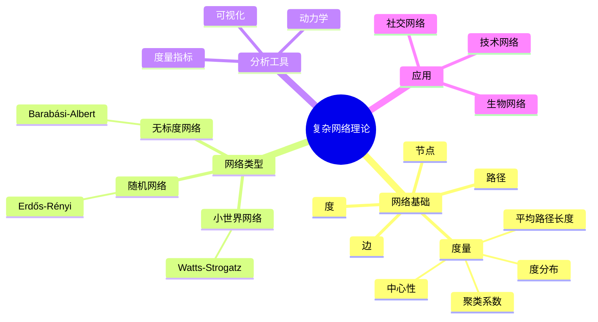
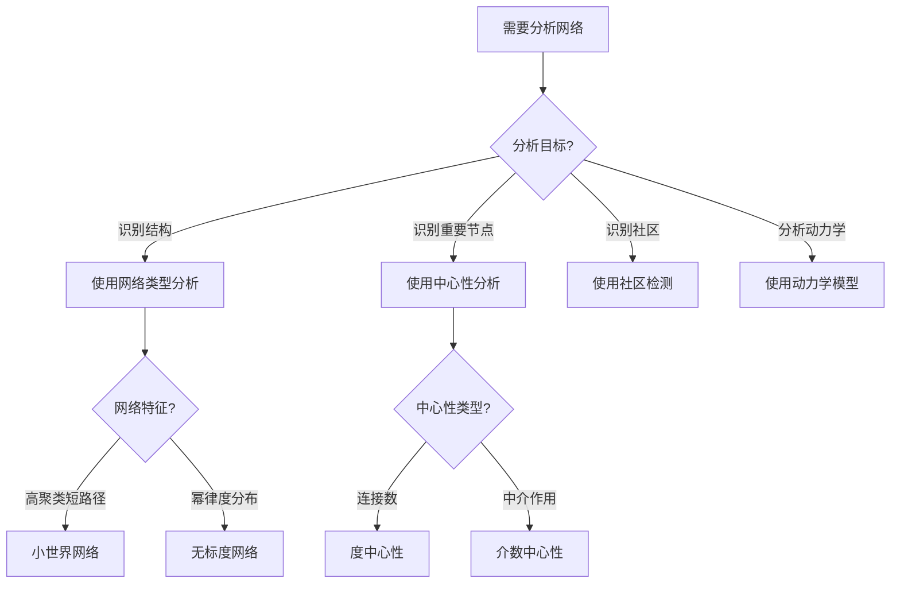
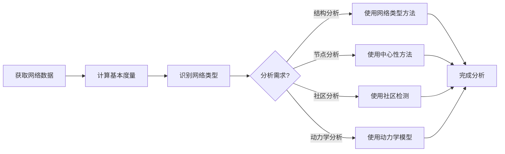
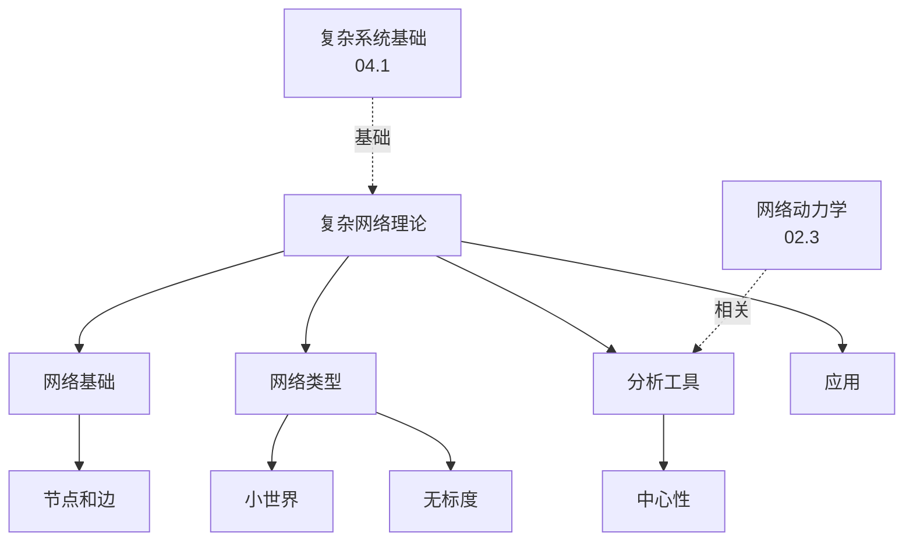
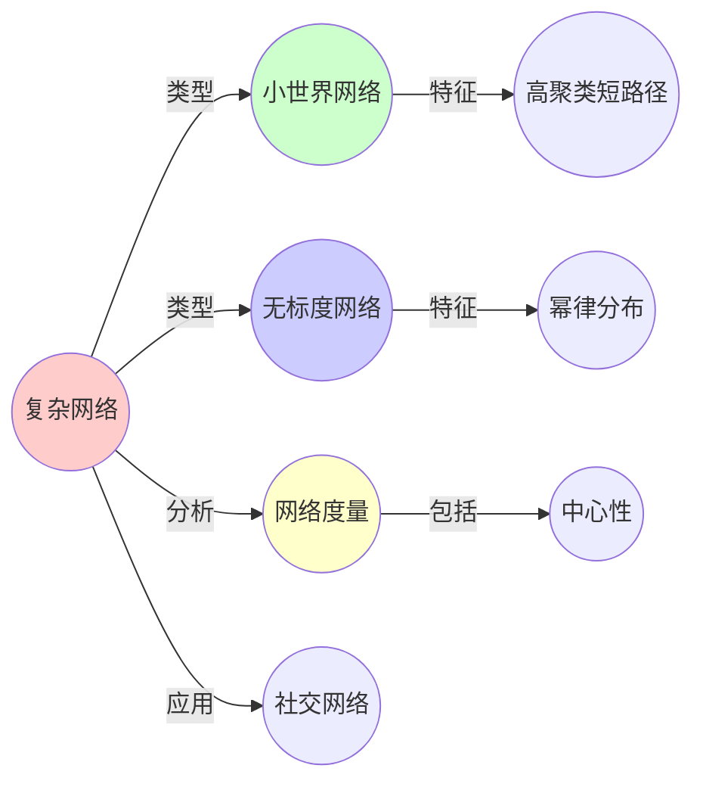
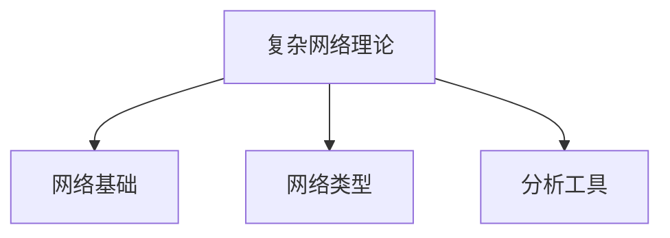

# 04.2 复杂网络理论

> **来源**: view03.md, view04.md
> **创建日期**: 2025-01-27
> **最后更新**: 2025-01-27

## 📋 目录

- [04.2 复杂网络理论](#042-复杂网络理论)
  - [📋 目录](#-目录)
  - [📋 内容概览](#-内容概览)
  - [🎯 核心理念](#-核心理念)
  - [📚 复杂网络基础](#-复杂网络基础)
    - [网络的基本要素](#网络的基本要素)
    - [网络的基本度量](#网络的基本度量)
  - [🔗 网络类型](#-网络类型)
    - [1. 小世界网络（Small-World Network）](#1-小世界网络small-world-network)
      - [特征](#特征)
      - [模型：Watts-Strogatz模型](#模型watts-strogatz模型)
      - [实例](#实例)
    - [2. 无标度网络（Scale-Free Network）](#2-无标度网络scale-free-network)
      - [特征](#特征-1)
      - [模型：Barabási-Albert模型](#模型barabási-albert模型)
      - [实例](#实例-1)
    - [3. 随机网络（Random Network）](#3-随机网络random-network)
      - [特征](#特征-2)
      - [模型：Erdős-Rényi模型](#模型erdős-rényi模型)
      - [临界现象](#临界现象)
  - [📊 网络分析工具](#-网络分析工具)
    - [1. 网络可视化工具](#1-网络可视化工具)
    - [2. 网络度量指标](#2-网络度量指标)
      - [中心性指标](#中心性指标)
      - [社区检测](#社区检测)
    - [3. 网络动力学](#3-网络动力学)
      - [传播动力学](#传播动力学)
      - [同步动力学](#同步动力学)
  - [🎯 应用实例](#-应用实例)
    - [1. 社交网络分析](#1-社交网络分析)
    - [2. 生物网络分析](#2-生物网络分析)
    - [3. 技术网络分析](#3-技术网络分析)
  - [📊 详细案例研究](#-详细案例研究)
    - [案例研究 1：社交网络中信息传播的SIR模型](#案例研究-1社交网络中信息传播的sir模型)
    - [案例研究 2：互联网拓扑的无标度特性](#案例研究-2互联网拓扑的无标度特性)
    - [案例研究 3：蛋白质相互作用网络的社区检测](#案例研究-3蛋白质相互作用网络的社区检测)
  - [⚠️ 批判性分析与局限性](#️-批判性分析与局限性)
    - [局限性讨论](#局限性讨论)
      - [1. 网络模型的简化假设](#1-网络模型的简化假设)
      - [2. 度分布假设的局限性](#2-度分布假设的局限性)
      - [3. 网络度量的计算复杂度](#3-网络度量的计算复杂度)
    - [改进方向](#改进方向)
      - [1. 发展动态网络理论](#1-发展动态网络理论)
      - [2. 提高计算效率](#2-提高计算效率)
  - [📊 思维表征体系](#-思维表征体系)
    - [📊 1. 思维导图（增强版）](#-1-思维导图增强版)
      - [1.1 文本格式（基础版）](#11-文本格式基础版)
      - [1.2 Mermaid格式（可视化版）](#12-mermaid格式可视化版)
    - [📊 2. 多维对比矩阵](#-2-多维对比矩阵)
      - [2.1 网络类型对比矩阵](#21-网络类型对比矩阵)
      - [2.2 网络度量指标对比矩阵](#22-网络度量指标对比矩阵)
      - [2.3 网络动力学模型对比矩阵](#23-网络动力学模型对比矩阵)
    - [🌲 3. 决策树](#-3-决策树)
      - [3.1 网络分析方法选择决策树](#31-网络分析方法选择决策树)
    - [🛤️ 4. 决策逻辑路径](#️-4-决策逻辑路径)
      - [4.1 复杂网络分析路径](#41-复杂网络分析路径)
    - [🕸️ 5. 概念关系网络](#️-5-概念关系网络)
      - [5.1 复杂网络理论概念关系网络](#51-复杂网络理论概念关系网络)
    - [🗺️ 6. 知识图谱](#️-6-知识图谱)
      - [6.1 复杂网络知识图谱](#61-复杂网络知识图谱)
  - [📚 理论体系](#-理论体系)
    - [理论基础](#理论基础)
      - [数学/图论基础](#数学图论基础)
      - [历史发展](#历史发展)
    - [理论框架](#理论框架)
      - [核心假设](#核心假设)
      - [基本概念体系](#基本概念体系)
      - [主要定理/结论](#主要定理结论)
      - [适用范围和边界](#适用范围和边界)
    - [当前知识共识](#当前知识共识)
      - [学术界共识](#学术界共识)
      - [主要争议点](#主要争议点)
      - [权威来源](#权威来源)
    - [与其他理论的关系](#与其他理论的关系)
      - [逻辑关系](#逻辑关系)
      - [映射关系](#映射关系)
  - [🔗 关联网络](#-关联网络)
    - [🔗 概念级关联](#-概念级关联)
      - [核心概念映射](#核心概念映射)
    - [🔗 理论级关联](#-理论级关联)
      - [理论基础](#理论基础-1)
    - [🔗 方法级关联](#-方法级关联)
      - [方法应用网络](#方法应用网络)
    - [🔗 应用场景关联](#-应用场景关联)
  - [🛤️ 学习路径](#️-学习路径)
    - [前置知识](#前置知识)
    - [后续学习](#后续学习)
    - [并行学习](#并行学习)
  - [🔗 相关文档](#-相关文档)
  - [📖 扩展阅读](#-扩展阅读)

---

## 📋 内容概览

本文档阐述复杂网络理论的核心概念、网络类型及其分析方法。复杂网络理论研究网络的结构特征、动力学行为和应用，揭示了从社交网络到生物网络的普遍规律。

---

## 🎯 核心理念

复杂网络理论通过图论和统计物理学方法研究网络的拓扑结构和动力学行为。不同类型网络（小世界、无标度、随机）展现出不同的结构特征和动力学性质，这些特征对信息传播、系统鲁棒性等有重要影响。

## 📚 复杂网络基础

### 网络的基本要素

- **节点（Node/Vertex）**：网络中的基本单元
- **边（Edge/Link）**：节点之间的连接
- **度（Degree）**：节点连接的边数
- **路径（Path）**：节点间的连接序列

### 网络的基本度量

1. **平均路径长度**：网络中任意两点间的最短路径的平均值
2. **聚类系数**：节点的邻居节点之间连接的紧密程度
3. **度分布**：节点度数的概率分布
4. **中心性**：节点在网络中的重要性

## 🔗 网络类型

### 1. 小世界网络（Small-World Network）

#### 特征

- **高聚类系数**：局部连接密集
- **短平均路径长度**：全局连接稀疏但高效

#### 模型：Watts-Strogatz模型

**构造方法**：

1. 从规则网络开始（每个节点连接k个最近邻居）
2. 以概率p随机重连边

**参数**：

- k：初始连接数
- p：重连概率

#### 实例

- **社交网络**：六度分离理论
- **神经网络**：神经元连接
- **互联网**：网页链接

### 2. 无标度网络（Scale-Free Network）

#### 特征

- **度分布服从幂律**：$P(k) \propto k^{-\gamma}$
- **少数节点连接极多**：Hub节点
- **大多数节点连接很少**：长尾分布

#### 模型：Barabási-Albert模型

**构造方法**：

1. 从少量节点开始
2. 每次添加新节点，连接到m个现有节点
3. **优先连接**：连接概率与节点度数成正比

**动力学**：

```latex
P(\text{连接到节点}i) = \frac{k_i}{\sum_j k_j}
```

#### 实例

- **互联网**：路由器网络
- **蛋白质网络**：蛋白质相互作用
- **引用网络**：学术论文引用

### 3. 随机网络（Random Network）

#### 特征

- **度分布泊松分布**：$P(k) \approx \frac{e^{-\lambda} \lambda^k}{k!}$
- **连接随机**：无偏好

#### 模型：Erdős-Rényi模型

**构造方法**：

- 从N个节点开始
- 每对节点以概率p连接

**参数**：

- N：节点数
- p：连接概率

#### 临界现象

**相变点**：p_c = 1/N

- p < p_c：网络碎片化
- p > p_c：出现巨大连通分量

## 📊 网络分析工具

### 1. 网络可视化工具

- **Gephi**：开源网络可视化工具
- **Cytoscape**：生物网络分析
- **NetworkX**：Python网络分析库

### 2. 网络度量指标

#### 中心性指标

- **度中心性**：连接数
- **接近中心性**：到其他节点的平均距离
- **介数中心性**：通过该节点的最短路径数
- **特征向量中心性**：连接重要节点的程度

#### 社区检测

- **模块度**：社区划分质量
- **Louvain算法**：社区检测算法
- **谱聚类**：基于特征向量的聚类

### 3. 网络动力学

#### 传播动力学

- **SIR模型**：易感-感染-康复
- **信息传播**：谣言传播模型
- **级联失效**：网络故障传播

#### 同步动力学

- **Kuramoto模型**：耦合振子同步
- **同步阈值**：同步发生的临界条件

## 🎯 应用实例

### 1. 社交网络分析

**应用**：

- 信息传播预测
- 影响力分析
- 社区发现

**工具**：

- NetworkX
- Gephi

### 2. 生物网络分析

**应用**：

- 蛋白质相互作用网络
- 基因调控网络
- 代谢网络

**工具**：

- Cytoscape
- STRING数据库

### 3. 技术网络分析

**应用**：

- 互联网拓扑
- 电网分析
- 交通网络

**工具**：

- NetworkX
- 专业仿真工具

## 📊 详细案例研究

### 案例研究 1：社交网络中信息传播的SIR模型

**背景**：使用复杂网络理论和SIR模型研究信息在社交网络中的传播。

**形式化分析**：

```text
信息传播模型:
- 网络: G = (V, E) (社交网络)
- 状态: S(易感), I(感染/传播), R(恢复/停止传播)
- 动力学:
  dS/dt = -βSI
  dI/dt = βSI - γI
  dR/dt = γI

网络影响:
- 度分布: 影响传播速度
- 聚类系数: 影响传播范围
- 路径长度: 影响传播时间

传播阈值:
- 基本再生数: R₀ = β/γ
- 网络效应: R₀_net = R₀ · ⟨k²⟩/⟨k⟩
- 传播条件: R₀_net > 1

应用效果:
- 预测信息传播范围
- 识别关键节点
- 设计传播策略
```

**关键发现**：

- ✅ 网络结构影响传播动力学
- ✅ Hub节点加速信息传播
- ✅ 聚类系数影响传播效率

**应用价值**：

- ✅ 社交媒体营销
- ✅ 公共卫生信息传播
- ✅ 病毒式营销策略

### 案例研究 2：互联网拓扑的无标度特性

**背景**：互联网路由器网络展示无标度特性，影响网络的鲁棒性和脆弱性。

**形式化分析**：

```text
互联网拓扑:
- 度分布: P(k) ∝ k^(-γ), γ ≈ 2.3
- Hub节点: 少数核心路由器连接极多
- 长尾: 大多数路由器连接很少

鲁棒性与脆弱性:
- 随机故障: 高度鲁棒（移除随机节点）
- 针对性攻击: 高度脆弱（攻击Hub节点）

级联失效:
- 负载重分布: 故障节点负载转移到邻居
- 连锁反应: 可能引发大规模失效
- 临界负载: 超过临界值导致崩溃

实际应用:
- 网络设计优化
- 故障预防策略
- 冗余设计
```

**关键发现**：

- ✅ 无标度网络具有双重特性
- ✅ Hub节点是关键脆弱点
- ✅ 负载重分布引发级联失效

**应用价值**：

- ✅ 网络基础设施设计
- ✅ 网络安全
- ✅ 容错系统设计

### 案例研究 3：蛋白质相互作用网络的社区检测

**背景**：使用复杂网络理论分析蛋白质相互作用网络，识别功能模块。

**形式化分析**：

```text
蛋白质网络分析:
- 节点: 蛋白质
- 边: 相互作用
- 网络: 无标度网络

社区检测:
- 模块度: Q = Σ[e_ii - a_i²]
- Louvain算法: 最大化模块度
- 功能模块: 对应生物功能

网络分析:
- 度中心性: 关键蛋白质
- 介数中心性: 枢纽蛋白质
- 社区结构: 功能模块

应用效果:
- 识别蛋白质功能
- 预测相互作用
- 药物靶点发现
```

**关键发现**：

- ✅ 网络结构反映功能关系
- ✅ 社区结构对应功能模块
- ✅ 关键节点影响系统功能

**应用价值**：

- ✅ 系统生物学
- ✅ 药物设计
- ✅ 疾病机制研究

## ⚠️ 批判性分析与局限性

### 局限性讨论

#### 1. 网络模型的简化假设

**问题**：实际网络比模型假设更复杂。

**挑战**：

- ⚠️ 忽略动态性
- ⚠️ 忽略权重和方向
- ⚠️ 忽略多层结构

**应对策略**：

- ✅ 考虑动态网络
- ✅ 使用加权网络
- ✅ 开发多层网络理论

#### 2. 度分布假设的局限性

**问题**：并非所有网络都严格服从幂律。

**挑战**：

- ⚠️ 数据拟合困难
- ⚠️ 截断效应
- ⚠️ 有限尺寸效应

**改进方向**：

- ✅ 使用更灵活模型
- ✅ 考虑截断幂律
- ✅ 有限尺寸分析

#### 3. 网络度量的计算复杂度

**问题**：某些网络度量的计算复杂度高。

**挑战**：

- ⚠️ 大规模网络计算困难
- ⚠️ 实时应用限制
- ⚠️ 资源消耗大

**改进方向**：

- ✅ 开发近似算法
- ✅ 利用网络稀疏性
- ✅ 并行计算

### 改进方向

#### 1. 发展动态网络理论

**目标**：处理网络结构随时间变化的情况。

**方法**：

- 时变网络模型
- 演化网络理论
- 自适应网络

#### 2. 提高计算效率

**目标**：使网络分析更实用。

**方法**：

- 高效算法
- 近似方法
- 并行计算

## 📊 思维表征体系

### 📊 1. 思维导图（增强版）

#### 1.1 文本格式（基础版）

```text
复杂网络理论
├── 复杂网络基础
│   ├── 基本要素
│   │   ├── 节点
│   │   ├── 边
│   │   ├── 度
│   │   └── 路径
│   └── 基本度量
│       ├── 平均路径长度
│       ├── 聚类系数
│       ├── 度分布
│       └── 中心性
├── 网络类型
│   ├── 小世界网络
│   │   ├── 特征
│   │   ├── Watts-Strogatz模型
│   │   └── 实例
│   ├── 无标度网络
│   │   ├── 特征: 幂律分布
│   │   ├── Barabási-Albert模型
│   │   └── 实例
│   └── 随机网络
│       ├── 特征: 泊松分布
│       ├── Erdős-Rényi模型
│       └── 临界现象
├── 网络分析工具
│   ├── 可视化工具
│   ├── 度量指标
│   │   ├── 中心性
│   │   └── 社区检测
│   └── 网络动力学
│       ├── 传播动力学
│       └── 同步动力学
└── 应用
    ├── 社交网络
    ├── 生物网络
    └── 技术网络
```

#### 1.2 Mermaid格式（可视化版）



### 📊 2. 多维对比矩阵

#### 2.1 网络类型对比矩阵

| 维度 | 小世界网络 | 无标度网络 | 随机网络 | 特点 |
|------|-----------|-----------|---------|------|
| **度分布** | 指数衰减 | 幂律分布 | 泊松分布 | 分布不同 |
| **聚类系数** | 高 | 低-中 | 低 | 聚类性不同 |
| **平均路径长度** | 短 | 很短 | 短 | 都较短 |
| **生成机制** | 重连 | 优先连接 | 随机连接 | 机制不同 |
| **鲁棒性** | 中 | 高（随机失效）低（攻击枢纽） | 中 | 鲁棒性不同 |
| **实际应用** | 社交网络 | 互联网、引用网络 | 理论基准 | 应用不同 |

#### 2.2 网络度量指标对比矩阵

| 维度 | 度中心性 | 介数中心性 | 接近中心性 | 特征向量中心性 | 适用场景 |
|------|---------|-----------|-----------|--------------|---------|
| **定义** | 节点连接数 | 经过节点的最短路径数 | 到其他节点平均距离 | 连接节点的重要性 | 定义不同 |
| **计算复杂度** | O(n) | O(nm) | O(nm) | O(n²) | 复杂度不同 |
| **适用网络** | 所有网络 | 所有网络 | 连通网络 | 所有网络 | 都适用 |
| **应用** | 识别枢纽 | 识别桥梁 | 识别中心 | 识别影响力 | 应用不同 |
| **敏感性** | 低 | 中 | 高 | 中 | 敏感性不同 |

#### 2.3 网络动力学模型对比矩阵

| 维度 | 传播动力学 | 同步动力学 | 博弈动力学 | 应用领域 |
|------|-----------|-----------|-----------|---------|
| **描述对象** | 信息、疾病传播 | 振荡器同步 | 策略演化 | 描述不同 |
| **主要模型** | SIR、SI、SIS | Kuramoto | 演化博弈 | 模型不同 |
| **关键参数** | 传播率、恢复率 | 耦合强度 | 收益矩阵 | 参数不同 |
| **典型现象** | 传播阈值、级联 | 同步相变 | 合作演化 | 现象不同 |
| **应用** | 流行病、谣言 | 神经网络、电网 | 社会合作 | 应用不同 |

### 🌲 3. 决策树

#### 3.1 网络分析方法选择决策树



### 🛤️ 4. 决策逻辑路径

#### 4.1 复杂网络分析路径



### 🕸️ 5. 概念关系网络

#### 5.1 复杂网络理论概念关系网络



### 🗺️ 6. 知识图谱

#### 6.1 复杂网络知识图谱



## 📚 理论体系

### 理论基础

#### 数学/图论基础

复杂网络理论的理论基础：

**1. 图论基础**：

- 图的基本概念
- 图的表示方法
- 图的算法

**2. 统计物理基础**：

- 相变理论
- 临界现象
- 标度律

**3. 概率论基础**：

- 随机过程
- 随机图理论
- 概率分布

#### 历史发展

**关键时间节点**：

- **1950-1960年代**：随机图理论建立
  - Erdős-Rényi模型
  - 随机图的性质

- **1990年代**：小世界网络发现
  - Watts-Strogatz模型
  - 小世界效应

- **1990-2000年代**：无标度网络发现
  - Barabási-Albert模型
  - 优先连接机制

- **2000年代至今**：网络科学兴起
  - 网络科学学科建立
  - 多领域应用
  - 大数据网络分析

### 理论框架

#### 核心假设

**假设1：网络结构的重要性**

- **内容**：网络结构决定系统行为
- **适用范围**：所有网络系统
- **限制条件**：需要明确的网络结构

**假设2：优先连接机制**

- **内容**：新节点倾向于连接高度节点
- **适用范围**：生长网络
- **限制条件**：需要网络生长过程

**假设3：小世界效应**

- **内容**：实际网络具有小世界特性
- **适用范围**：大多数实际网络
- **限制条件**：需要足够的网络规模

#### 基本概念体系



#### 主要定理/结论

**结论1：小世界网络的存在**

- **内容**：大多数实际网络是小世界网络
- **证据**：大量实证研究
- **应用**：网络分析

**结论2：无标度网络的普遍性**

- **内容**：许多实际网络是无标度网络
- **证据**：实证数据和理论模型
- **应用**：网络设计

**结论3：网络鲁棒性**

- **内容**：无标度网络对随机失效鲁棒但对攻击脆弱
- **证据**：理论和仿真
- **应用**：网络保护

#### 适用范围和边界

**适用范围**：

- 可以用网络描述的系统
- 具有大量节点的系统
- 具有复杂交互的系统

**边界条件**：

- 需要明确的节点和边定义
- 需要足够的网络规模
- 需要合理的度量方法

**不适用场景**：

- 无法网络化的系统
- 太小规模的系统
- 动态结构变化太快的系统

### 当前知识共识

#### 学术界共识

**广泛接受的共识**：

1. **复杂网络的重要性**
   - **共识**：复杂网络是描述复杂系统的重要工具
   - **支持证据**：广泛的应用
   - **来源**：网络科学、跨学科研究

2. **小世界和无标度网络的普遍性**
   - **共识**：大多数实际网络具有这些特性
   - **支持证据**：大量实证研究
   - **来源**：网络科学

3. **网络结构决定行为**
   - **共识**：网络结构影响系统动力学
   - **支持证据**：理论和实验
   - **来源**：网络动力学研究

#### 主要争议点

1. **无标度网络的普遍性**
   - **观点A**：大多数网络是无标度的
   - **观点B**：只有部分网络是无标度的
   - **当前状态**：多数认为部分网络是无标度的

2. **优先连接机制**
   - **观点A**：优先连接是主要机制
   - **观点B**：有多种机制
   - **当前状态**：多数认为有多种机制

#### 权威来源

**经典文献**：

- 《网络科学》- Albert-László Barabási
- 《链接》- Albert-László Barabási
- 《六度分隔》- Duncan Watts

**权威机构/专家**：

- **网络科学学会**
- **Barabási实验室**
- **网络科学研究中心**

**最新发展**：

- **2020-2024**：多层网络、时序网络、网络机器学习
- **前沿方向**：网络控制、网络推断、网络演化

### 与其他理论的关系

#### 逻辑关系

**理论基础**：

- **复杂系统基础**（[04.1_复杂系统基础.md](04.1_复杂系统基础.md)） → 复杂网络理论
  - 关系类型：扩展与应用
  - 关键映射：复杂系统 → 网络系统

**理论应用**：

- 复杂网络理论 → 应用（[04.5_复杂系统应用.md](04.5_复杂系统应用.md)）
  - 应用方式：网络分析、系统设计
  - 应用效果：深入理解系统结构

#### 映射关系

| 本理论概念 | 映射理论 | 映射概念 | 映射类型 | 映射说明 |
|-----------|---------|---------|---------|----------|
| **网络系统** | 04.1_复杂系统基础 | 复杂系统 | 应用 | 网络是复杂系统的具体形式 |
| **网络动力学** | 02.3_网络动力学 | 网络动力学 | 对应 | 概念对应 |
| **小世界效应** | 04.1_复杂系统基础 | 小世界效应 | 扩展 | 扩展为网络理论 |
| **无标度特性** | 04.1_复杂系统基础 | 无标度特性 | 扩展 | 扩展为网络理论 |

## 🔗 关联网络

### 🔗 概念级关联

#### 核心概念映射

| 本文档概念 | 关联文档 | 关联概念 | 关系类型 | 映射说明 |
|-----------|---------|---------|---------|----------|
| **网络系统** | 04.1_复杂系统基础 | 复杂系统 | 应用 | 网络是复杂系统的具体形式 |
| **网络动力学** | 02.3_网络动力学 | 网络动力学 | 对应 | 概念对应 |
| **小世界网络** | 04.1_复杂系统基础 | 小世界效应 | 扩展 | 扩展为网络类型 |
| **无标度网络** | 04.1_复杂系统基础 | 无标度特性 | 扩展 | 扩展为网络类型 |
| **传播动力学** | 02.2_随机动力学 | 随机过程 | 相关 | 传播是随机过程 |
| **同步动力学** | 02.3_网络动力学 | 同步 | 对应 | 概念对应 |
| **社区检测** | 04.4_涌现性理论 | 涌现结构 | 相关 | 社区是涌现结构 |

### 🔗 理论级关联

#### 理论基础

- **本理论基于**：
  - [04.1_复杂系统基础.md](04.1_复杂系统基础.md) ⭐⭐⭐ - 复杂系统基础
  - [02.3_网络动力学.md](../02_动力学系统理论/02.3_网络动力学.md) ⭐⭐ - 网络动力学

- **本理论应用于**：
  - [04.5_复杂系统应用.md](04.5_复杂系统应用.md) ⭐⭐⭐ - 复杂系统应用
  - [04.3_自组织临界.md](04.3_自组织临界.md) ⭐⭐ - 自组织临界
  - [04.4_涌现性理论.md](04.4_涌现性理论.md) ⭐⭐ - 涌现性理论

### 🔗 方法级关联

#### 方法应用网络

| 本文档方法 | 应用文档 | 应用场景 | 应用效果 |
|-----------|---------|---------|---------|
| **网络分析** | 04.5_复杂系统应用 | 系统分析 | 成功 |
| **中心性分析** | 04.5_复杂系统应用 | 节点重要性 | 成功 |
| **社区检测** | 04.4_涌现性理论 | 结构识别 | 成功 |

### 🔗 应用场景关联

**场景**：社交网络分析

| 视角 | 关联文档 | 核心理论 | 关注点 |
|------|---------|---------|--------|
| **网络结构** | 本文档 | 网络类型 | 结构特征 |
| **节点重要性** | 本文档 | 中心性 | 影响力 |
| **社区结构** | 04.4_涌现性理论 | 涌现性 | 群体形成 |

## 🛤️ 学习路径

### 前置知识

**必须先学习**：

- [04.1_复杂系统基础.md](04.1_复杂系统基础.md) ⭐⭐⭐ - 复杂系统基础

**建议先了解**：

- 基础图论
- 概率论
- 线性代数

### 后续学习

**建议接下来学习**（按顺序）：

1. [02.3_网络动力学.md](../02_动力学系统理论/02.3_网络动力学.md) ⭐⭐⭐ - 网络动力学
2. [04.3_自组织临界.md](04.3_自组织临界.md) ⭐⭐ - 自组织临界
3. [04.5_复杂系统应用.md](04.5_复杂系统应用.md) ⭐⭐ - 复杂系统应用

### 并行学习

**可以同时学习**：

- [04.4_涌现性理论.md](04.4_涌现性理论.md) - 涌现性理论
- [05_信息论与计算理论](../05_信息论与计算理论/) - 信息理论

## 🔗 相关文档

- [04.1_复杂系统基础.md](04.1_复杂系统基础.md)
- [04.3_自组织临界.md](04.3_自组织临界.md)
- [04.4_涌现性理论.md](04.4_涌现性理论.md)
- [04.5_复杂系统应用.md](04.5_复杂系统应用.md)

## 📖 扩展阅读

- 《网络科学》- Albert-László Barabási
- Wikipedia: [Complex Network](https://en.wikipedia.org/wiki/Complex_network)
- Wikipedia: [Scale-Free Network](https://en.wikipedia.org/wiki/Scale-free_network)
- Wikipedia: [Small-World Network](https://en.wikipedia.org/wiki/Small-world_network)
