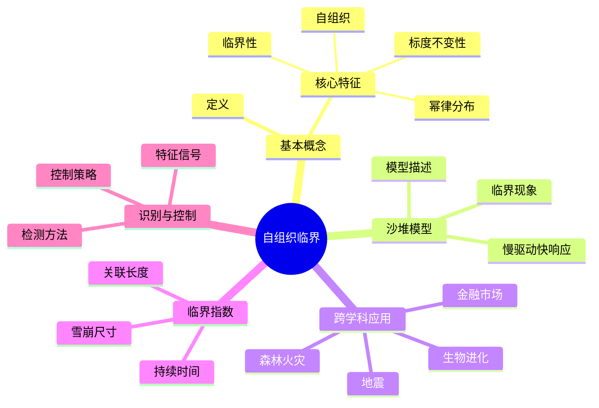
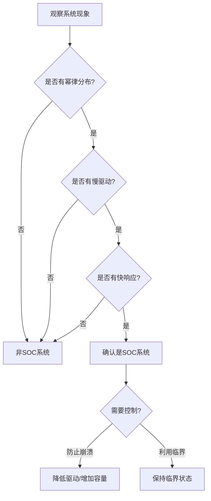
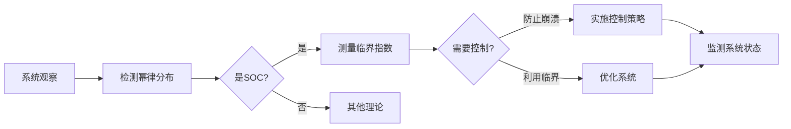
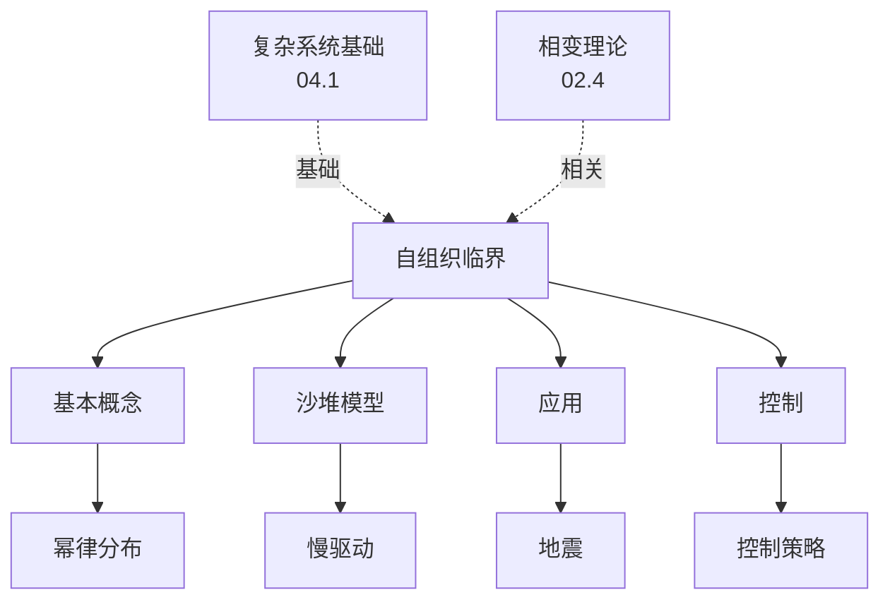
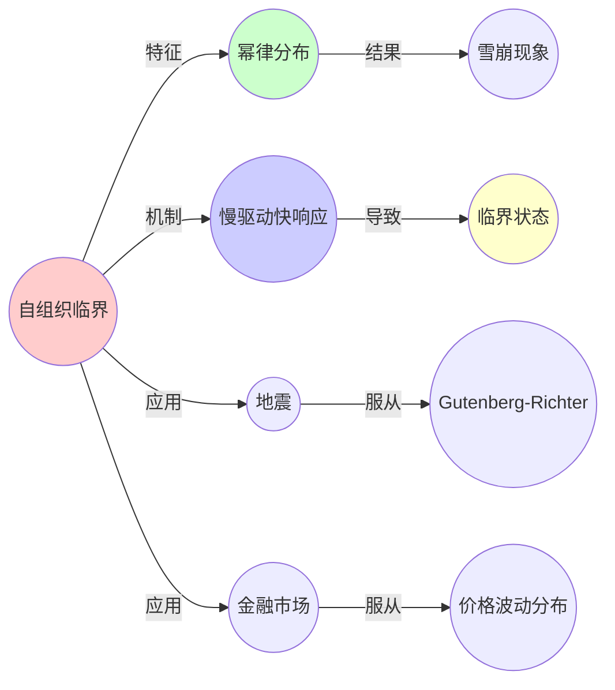
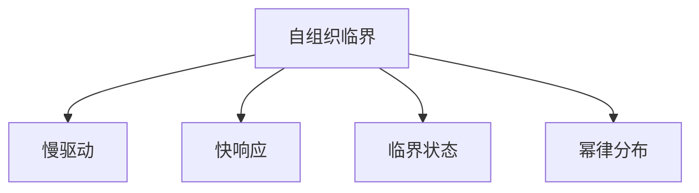

# 04.3 自组织临界

> **来源**: view07.md
> **创建日期**: 2025-01-27
> **最后更新**: 2025-01-27

## 📋 目录

- [04.3 自组织临界](#043-自组织临界)
  - [📋 目录](#-目录)
  - [📋 内容概览](#-内容概览)
  - [🎯 核心理念](#-核心理念)
  - [🌋 基本概念](#-基本概念)
    - [定义](#定义)
    - [核心特征](#核心特征)
  - [🏔️ 沙堆模型（Bak-Tang-Wiesenfeld模型）](#️-沙堆模型bak-tang-wiesenfeld模型)
    - [模型描述](#模型描述)
    - [动力学](#动力学)
    - [临界现象](#临界现象)
  - [📊 跨学科应用](#-跨学科应用)
    - [1. 地震](#1-地震)
    - [2. 金融市场](#2-金融市场)
    - [3. 生物进化](#3-生物进化)
    - [4. 森林火灾](#4-森林火灾)
    - [5. 数学创造](#5-数学创造)
  - [🔬 临界指数](#-临界指数)
    - [定义](#定义-1)
    - [常见指数](#常见指数)
    - [普适性](#普适性)
  - [📈 临界状态的识别](#-临界状态的识别)
    - [特征信号](#特征信号)
    - [检测方法](#检测方法)
  - [🎯 控制策略](#-控制策略)
    - [防止系统崩溃](#防止系统崩溃)
    - [利用临界性](#利用临界性)
  - [🔗 相关文档](#-相关文档)
  - [📖 扩展阅读](#-扩展阅读)

---

## 📋 内容概览

本文档阐述自组织临界（Self-Organized Criticality, SOC）理论，揭示复杂系统自发达到临界状态的机制。自组织临界解释了为什么许多自然系统表现出幂律分布和标度不变性，为理解地震、金融市场、生物进化等现象提供了统一框架。

---

## 🎯 核心理念

自组织临界的核心思想是系统通过慢驱动和快响应，自发演化到临界状态。在临界状态下，系统表现出幂律分布、标度不变性和长程关联。这种自组织过程无需外部控制，是复杂系统的普遍特征。

## 🌋 基本概念

### 定义

**自组织临界**：系统在没有任何外部控制的情况下，自发演化到临界状态，表现出幂律分布和标度不变性。

### 核心特征

1. **幂律分布**：事件大小服从幂律
2. **标度不变性**：无特征尺度
3. **自组织**：无需外部控制
4. **临界性**：处于临界点

## 🏔️ 沙堆模型（Bak-Tang-Wiesenfeld模型）

### 模型描述

**状态**：二维网格，每个格点有沙粒数 hᵢⱼ

**规则**：

```text
当 hᵢⱼ > h_critical:
    hᵢⱼ → hᵢⱼ - 4
    h_{neighbor} → h_{neighbor} + 1
    雪崩尺寸 s = 受影响格点数
```

### 动力学

**驱动**：持续添加沙粒（慢驱动）

**响应**：雪崩（快响应）

**平衡**：系统自发达到临界状态

### 临界现象

**幂律分布**：

```latex
P(s) \propto s^{-\tau} \quad (\tau \approx 1.5)
```

- **s**：雪崩尺寸
- **τ**：临界指数

## 📊 跨学科应用

### 1. 地震

**模型**：断层应力累积与释放

**动力学**：

- **应力累积**：慢驱动
- **地震**：快响应（雪崩）

**实证**：地震震级分布服从幂律（Gutenberg-Richter定律）

### 2. 金融市场

**模型**：价格波动与崩盘

**动力学**：

- **价格波动累积**：慢驱动
- **市场崩盘**：快响应（雪崩）

**实证**：价格波动分布服从幂律

### 3. 生物进化

**模型**：物种灭绝事件

**动力学**：

- **生态压力累积**：慢驱动
- **物种灭绝**：快响应（雪崩）

**实证**：灭绝事件大小分布服从幂律

### 4. 森林火灾

**模型**：可燃物累积与火灾

**动力学**：

- **可燃物累积**：慢驱动
- **火灾**：快响应（雪崩）

**实证**：火灾面积分布服从幂律

### 5. 数学创造

**模型**：概念网络中的创新

**动力学**：

- **概念连接累积**：慢驱动
- **定理发现**：快响应（雪崩）

**实证**：论文引用分布服从幂律

## 🔬 临界指数

### 定义

**临界指数**：描述临界行为特征的幂律指数

### 常见指数

1. **雪崩尺寸分布**：τ ≈ 1.5
2. **雪崩持续时间分布**：α ≈ 2.0
3. **空间关联长度**：ν ≈ 1.0
4. **时间关联长度**：z ≈ 1.0

### 普适性

**普适类**：不同系统可能属于同一普适类，具有相同的临界指数

## 📈 临界状态的识别

### 特征信号

1. **幂律分布**：事件大小分布
2. **1/f噪声**：功率谱密度
3. **分形结构**：空间或时间分形
4. **长程关联**：空间或时间关联

### 检测方法

1. **分布分析**：检查是否服从幂律
2. **标度分析**：检查标度不变性
3. **关联分析**：检查长程关联
4. **有限尺寸标度**：检查系统尺寸依赖性

## 🎯 控制策略

### 防止系统崩溃

**策略**：

1. **降低驱动速率**：减少外部压力
2. **增加系统容量**：提高临界阈值
3. **引入阻尼**：减少雪崩传播
4. **早期预警**：监测临界信号

### 利用临界性

**策略**：

1. **优化系统性能**：临界状态可能最优
2. **促进创新**：临界状态有利于创新
3. **提高适应性**：临界状态提高适应性

## 📊 思维表征体系

### 📊 1. 思维导图（增强版）

#### 1.1 文本格式（基础版）

```text
自组织临界
├── 基本概念
│   ├── 定义
│   └── 核心特征
│       ├── 幂律分布
│       ├── 标度不变性
│       ├── 自组织
│       └── 临界性
├── 沙堆模型
│   ├── 模型描述
│   ├── 动力学（慢驱动+快响应）
│   └── 临界现象
├── 跨学科应用
│   ├── 地震
│   ├── 金融市场
│   ├── 生物进化
│   ├── 森林火灾
│   └── 数学创造
├── 临界指数
│   ├── 雪崩尺寸分布指数
│   ├── 雪崩持续时间指数
│   ├── 空间关联长度指数
│   └── 时间关联长度指数
├── 临界状态识别
│   ├── 特征信号
│   └── 检测方法
└── 控制策略
    ├── 防止系统崩溃
    └── 利用临界性
```

#### 1.2 Mermaid格式（可视化版）



### 📊 2. 多维对比矩阵

#### 2.1 SOC与其他临界现象对比矩阵

| 维度 | 自组织临界 | 平衡相变 | 关系类型 | 说明 |
|------|-----------|---------|---------|------|
| **临界点** | 自发达到 | 外部调节参数 | 不同 | SOC无需外部控制 |
| **驱动方式** | 慢驱动 | 参数变化 | 不同 | 驱动方式不同 |
| **响应方式** | 快响应（雪崩） | 连续变化 | 不同 | 响应方式不同 |
| **普适性** | 广泛存在 | 特定系统 | 不同 | SOC更普遍 |
| **应用** | 广泛 | 物理系统 | 不同 | SOC应用更广 |

#### 2.2 SOC应用领域对比矩阵

| 维度 | 地震 | 金融市场 | 生物进化 | 森林火灾 | 共同特征 |
|------|------|---------|---------|---------|---------|
| **驱动** | 应力累积 | 价格波动累积 | 生态压力累积 | 可燃物累积 | 都是慢驱动 |
| **响应** | 地震 | 市场崩盘 | 物种灭绝 | 火灾 | 都是快响应 |
| **分布** | 幂律 | 幂律 | 幂律 | 幂律 | 都服从幂律 |
| **可预测性** | 低 | 低 | 低 | 中 | 都难以预测 |
| **控制难度** | 很高 | 高 | 很高 | 中 | 都难以控制 |

#### 2.3 临界指数对比矩阵

| 维度 | 雪崩尺寸指数τ | 持续时间指数α | 空间关联指数ν | 时间关联指数z | 普适性 |
|------|-------------|-------------|-------------|-------------|--------|
| **数值** | ≈1.5 | ≈2.0 | ≈1.0 | ≈1.0 | 不同 |
| **意义** | 雪崩大小分布 | 雪崩时间分布 | 空间相关性 | 时间相关性 | 意义不同 |
| **测量** | 容易 | 容易 | 中等 | 中等 | 测量难度不同 |
| **应用** | 广泛 | 广泛 | 有限 | 有限 | 应用范围不同 |
| **普适类** | 是 | 是 | 是 | 是 | 都属于普适类 |

### 🌲 3. 决策树

#### 3.1 SOC识别与控制决策树



### 🛤️ 4. 决策逻辑路径

#### 4.1 SOC分析与控制路径



### 🕸️ 5. 概念关系网络

#### 5.1 自组织临界概念关系网络



### 🗺️ 6. 知识图谱

#### 6.1 自组织临界知识图谱



## 📚 理论体系

### 理论基础

#### 数学/物理基础

自组织临界理论的理论基础：

**1. 统计物理基础**：

- 相变理论
- 临界现象
- 标度理论
- 重整化群

**2. 非线性动力学基础**：

- 非线性系统
- 混沌理论
- 分岔理论
- 吸引子

**3. 概率论基础**：

- 幂律分布
- 重尾分布
- 随机过程
- 极值理论

#### 历史发展

**关键时间节点**：

- **1987年**：自组织临界概念提出
  - Per Bak、Chao Tang、Kurt Wiesenfeld
  - 沙堆模型（BTW模型）

- **1990年代**：理论发展
  - 临界指数计算
  - 普适类研究
  - 跨学科应用

- **2000年代**：实证验证
  - 地震数据分析
  - 金融市场分析
  - 生物系统研究

- **2010年代至今**：扩展研究
  - 自适应临界
  - 非平衡临界
  - 计算临界

### 理论框架

#### 核心假设

**假设1：慢驱动与快响应**

- **内容**：系统通过慢驱动和快响应达到临界
- **适用范围**：开放耗散系统
- **限制条件**：需要持续的驱动

**假设2：自组织性**

- **内容**：系统自发达到临界状态
- **适用范围**：复杂系统
- **限制条件**：需要适当的动力学规则

**假设3：幂律分布**

- **内容**：临界状态产生幂律分布
- **适用范围**：SOC系统
- **限制条件**：需要足够大的系统

#### 基本概念体系



#### 主要定理/结论

**结论1：SOC的普遍性**

- **内容**：SOC在自然系统中普遍存在
- **证据**：大量实证研究
- **应用**：系统分析

**结论2：幂律分布**

- **内容**：SOC系统产生幂律分布
- **证据**：理论和实验
- **应用**：现象识别

**结论3：临界指数的普适性**

- **内容**：不同系统可能属于同一普适类
- **证据**：数值计算和实验
- **应用**：系统分类

#### 适用范围和边界

**适用范围**：

- 开放耗散系统
- 具有慢驱动和快响应的系统
- 可以自发达到临界状态的系统

**边界条件**：

- 需要持续的驱动
- 需要适当的动力学规则
- 需要足够大的系统规模

**不适用场景**：

- 平衡系统
- 封闭系统
- 太小的系统

### 当前知识共识

#### 学术界共识

**广泛接受的共识**：

1. **SOC的重要性**
   - **共识**：SOC是理解复杂系统的重要理论
   - **支持证据**：广泛的应用
   - **来源**：统计物理、复杂系统科学

2. **幂律分布的普遍性**
   - **共识**：SOC系统产生幂律分布
   - **支持证据**：理论和实证
   - **来源**：统计物理、数据分析

3. **跨学科应用**
   - **共识**：SOC适用于多个领域
   - **支持证据**：成功应用案例
   - **来源**：跨学科研究

#### 主要争议点

1. **SOC的普遍性**
   - **观点A**：SOC非常普遍
   - **观点B**：只有部分系统是SOC
   - **当前状态**：多数认为部分系统是SOC

2. **临界指数的普适性**
   - **观点A**：临界指数是普适的
   - **观点B**：临界指数可能变化
   - **当前状态**：多数认为有普适类但可能有变化

#### 权威来源

**经典文献**：

- 《How Nature Works》- Per Bak
- 《Self-Organized Criticality》- Per Bak等
- 《Criticality》- Henrik Jeldtoft Jensen

**权威机构/专家**：

- **圣塔菲研究所**
- **统计物理研究组**
- **复杂系统研究组**

**最新发展**：

- **2020-2024**：自适应临界、非平衡临界、机器学习方法
- **前沿方向**：SOC机制、控制策略、应用扩展

### 与其他理论的关系

#### 逻辑关系

**理论基础**：

- **复杂系统基础**（[04.1_复杂系统基础.md](04.1_复杂系统基础.md)） → 自组织临界
  - 关系类型：扩展与应用
  - 关键映射：复杂系统 → SOC系统

**理论应用**：

- **相变理论**（[02.4_分岔理论与相变.md](../02_动力学系统理论/02.4_分岔理论与相变.md)） → 自组织临界
  - 关系类型：理论基础
  - 关键映射：相变 → SOC

#### 映射关系

| 本理论概念 | 映射理论 | 映射概念 | 映射类型 | 映射说明 |
|-----------|---------|---------|---------|----------|
| **自组织临界** | 04.1_复杂系统基础 | 自组织 | 扩展 | SOC是自组织的具体形式 |
| **临界状态** | 02.4_分岔理论与相变 | 临界点 | 对应 | 概念对应 |
| **幂律分布** | 04.1_复杂系统基础 | 无标度特性 | 对应 | 都涉及幂律 |
| **慢驱动快响应** | 02.1_经典确定性动力学 | 动力学机制 | 对应 | 动力学机制对应 |

## 🔗 关联网络

### 🔗 概念级关联

#### 核心概念映射

| 本文档概念 | 关联文档 | 关联概念 | 关系类型 | 映射说明 |
|-----------|---------|---------|---------|----------|
| **自组织临界** | 04.1_复杂系统基础 | 自组织 | 扩展 | SOC是自组织的具体形式 |
| **临界状态** | 02.4_分岔理论与相变 | 临界点 | 对应 | 概念对应 |
| **幂律分布** | 04.1_复杂系统基础 | 无标度特性 | 对应 | 都涉及幂律 |
| **慢驱动快响应** | 02.1_经典确定性动力学 | 动力学机制 | 对应 | 动力学机制对应 |
| **沙堆模型** | 04.1_复杂系统基础 | 复杂系统模型 | 实例 | 沙堆是SOC的经典模型 |
| **雪崩现象** | 04.4_涌现性理论 | 涌现现象 | 相关 | 雪崩是涌现现象 |
| **临界指数** | 02.4_分岔理论与相变 | 临界指数 | 对应 | 概念对应 |

### 🔗 理论级关联

#### 理论基础

- **本理论基于**：
  - [04.1_复杂系统基础.md](04.1_复杂系统基础.md) ⭐⭐⭐ - 复杂系统基础
  - [02.4_分岔理论与相变.md](../02_动力学系统理论/02.4_分岔理论与相变.md) ⭐⭐⭐ - 相变理论

- **本理论应用于**：
  - [04.5_复杂系统应用.md](04.5_复杂系统应用.md) ⭐⭐⭐ - 复杂系统应用
  - [04.4_涌现性理论.md](04.4_涌现性理论.md) ⭐⭐ - 涌现性理论
  - [04.2_复杂网络理论.md](04.2_复杂网络理论.md) ⭐⭐ - 复杂网络理论

### 🔗 方法级关联

#### 方法应用网络

| 本文档方法 | 应用文档 | 应用场景 | 应用效果 |
|-----------|---------|---------|---------|
| **SOC分析方法** | 04.5_复杂系统应用 | 系统分析 | 成功 |
| **临界状态识别** | 04.5_复杂系统应用 | 状态识别 | 成功 |
| **控制策略** | 04.5_复杂系统应用 | 系统控制 | 成功 |

### 🔗 应用场景关联

**场景**：金融市场分析

| 视角 | 关联文档 | 核心理论 | 关注点 |
|------|---------|---------|--------|
| **价格波动** | 本文档 | SOC | 幂律分布 |
| **市场结构** | 04.2_复杂网络理论 | 网络结构 | 网络拓扑 |
| **市场崩溃** | 04.4_涌现性理论 | 涌现性 | 崩溃机制 |

## 🛤️ 学习路径

### 前置知识

**必须先学习**：

- [04.1_复杂系统基础.md](04.1_复杂系统基础.md) ⭐⭐⭐ - 复杂系统基础
- [02.4_分岔理论与相变.md](../02_动力学系统理论/02.4_分岔理论与相变.md) ⭐⭐ - 相变理论

**建议先了解**：

- 统计物理基础
- 非线性动力学
- 概率论

### 后续学习

**建议接下来学习**（按顺序）：

1. [04.4_涌现性理论.md](04.4_涌现性理论.md) ⭐⭐⭐ - 涌现性理论
2. [04.5_复杂系统应用.md](04.5_复杂系统应用.md) ⭐⭐ - 复杂系统应用
3. [04.2_复杂网络理论.md](04.2_复杂网络理论.md) ⭐⭐ - 复杂网络理论

### 并行学习

**可以同时学习**：

- [02.3_网络动力学.md](../02_动力学系统理论/02.3_网络动力学.md) - 网络动力学
- [05_信息论与计算理论](../05_信息论与计算理论/) - 信息理论

## 🔗 相关文档

- [04.1_复杂系统基础.md](04.1_复杂系统基础.md)
- [04.2_复杂网络理论.md](04.2_复杂网络理论.md)
- [04.4_涌现性理论.md](04.4_涌现性理论.md)
- [02_动力学系统理论/02.4_分岔理论与相变.md](../02_动力学系统理论/02.4_分岔理论与相变.md)

## 📖 扩展阅读

- 《How Nature Works》- Per Bak
- Wikipedia: [Self-Organized Criticality](https://en.wikipedia.org/wiki/Self-organized_criticality)
