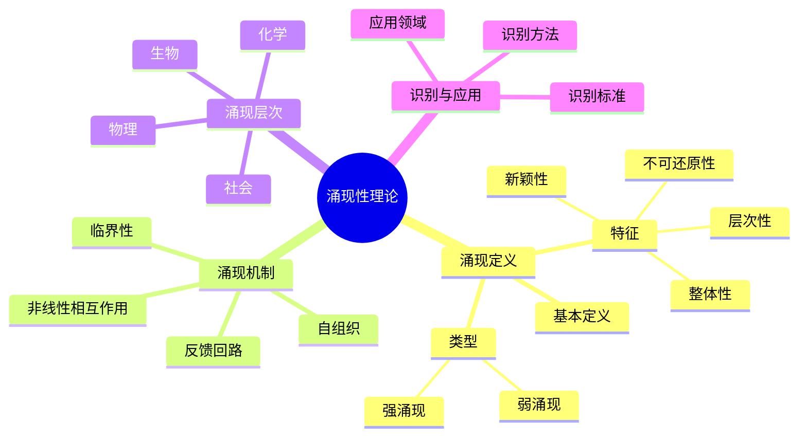
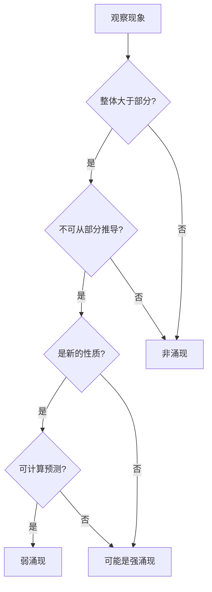
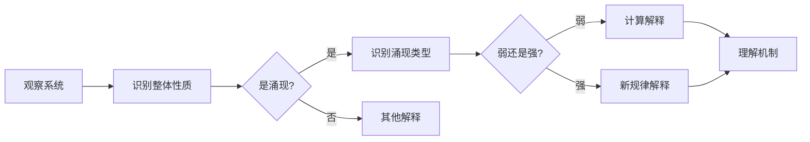
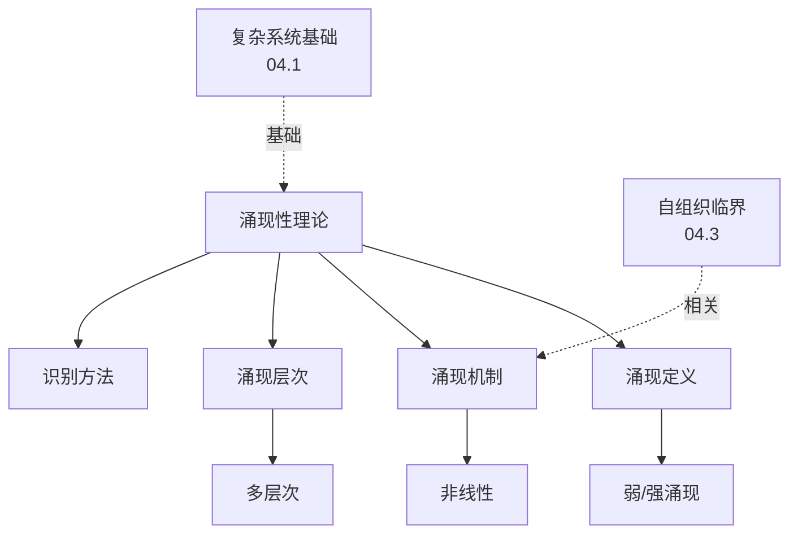
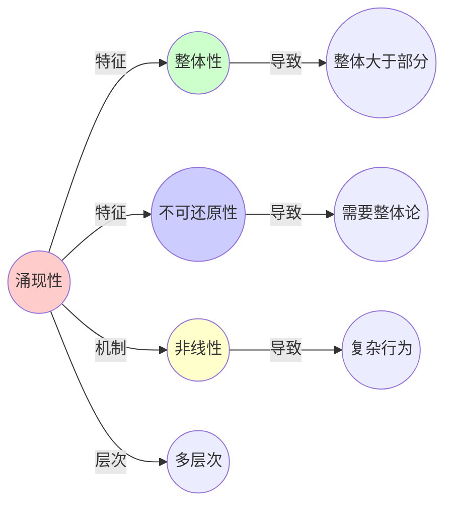
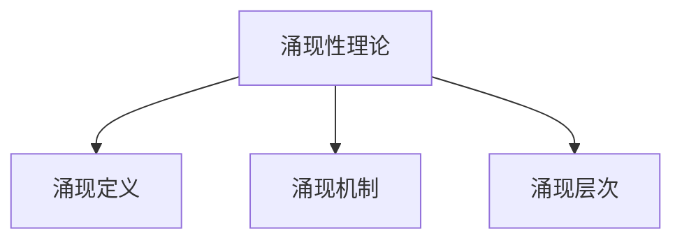

# 04.4 涌现性理论

> **来源**: view02.md, view06.md
> **创建日期**: 2025-01-27
> **最后更新**: 2025-01-27

## 📋 目录

- [04.4 涌现性理论](#044-涌现性理论)
  - [📋 目录](#-目录)
  - [📋 内容概览](#-内容概览)
  - [🎯 核心理念](#-核心理念)
  - [🌊 涌现的定义](#-涌现的定义)
    - [基本定义](#基本定义)
    - [特征](#特征)
    - [类型](#类型)
      - [弱涌现（Weak Emergence）](#弱涌现weak-emergence)
      - [强涌现（Strong Emergence）](#强涌现strong-emergence)
  - [🔬 涌现的机制](#-涌现的机制)
    - [1. 非线性相互作用](#1-非线性相互作用)
    - [2. 反馈回路](#2-反馈回路)
    - [3. 自组织](#3-自组织)
    - [4. 临界性](#4-临界性)
  - [📊 涌现的层次](#-涌现的层次)
    - [层次1：物理层次](#层次1物理层次)
    - [层次2：化学层次](#层次2化学层次)
    - [层次3：生物层次](#层次3生物层次)
    - [层次4：社会层次](#层次4社会层次)
  - [🎯 涌现的识别](#-涌现的识别)
    - [识别标准](#识别标准)
    - [识别方法](#识别方法)
  - [📈 涌现的应用](#-涌现的应用)
    - [1. 生物学](#1-生物学)
    - [2. 社会科学](#2-社会科学)
    - [3. 技术系统](#3-技术系统)
  - [⚠️ 涌现的争议](#️-涌现的争议)
    - [争议1：强涌现是否存在](#争议1强涌现是否存在)
    - [争议2：涌现与还原](#争议2涌现与还原)
    - [争议3：涌现与目的论](#争议3涌现与目的论)
  - [📊 详细案例研究](#-详细案例研究)
    - [案例研究 1：生命游戏中的涌现模式](#案例研究-1生命游戏中的涌现模式)
    - [案例研究 2：鸟群行为的涌现](#案例研究-2鸟群行为的涌现)
    - [案例研究 3：神经网络中的意识涌现（争议）](#案例研究-3神经网络中的意识涌现争议)
  - [⚠️ 批判性分析与局限性](#️-批判性分析与局限性)
    - [局限性讨论](#局限性讨论)
      - [1. 强涌现的科学验证困难](#1-强涌现的科学验证困难)
      - [2. 涌现与还原的二元对立](#2-涌现与还原的二元对立)
      - [3. 涌现识别的标准不明确](#3-涌现识别的标准不明确)
    - [改进方向](#改进方向)
      - [1. 发展量化方法](#1-发展量化方法)
      - [2. 统一理论框架](#2-统一理论框架)
  - [📊 思维表征体系](#-思维表征体系)
    - [📊 1. 思维导图（增强版）](#-1-思维导图增强版)
      - [1.1 文本格式（基础版）](#11-文本格式基础版)
      - [1.2 Mermaid格式（可视化版）](#12-mermaid格式可视化版)
    - [📊 2. 多维对比矩阵](#-2-多维对比矩阵)
      - [2.1 弱涌现与强涌现对比矩阵](#21-弱涌现与强涌现对比矩阵)
      - [2.2 涌现层次对比矩阵](#22-涌现层次对比矩阵)
      - [2.3 涌现机制对比矩阵](#23-涌现机制对比矩阵)
    - [🌲 3. 决策树](#-3-决策树)
      - [3.1 涌现识别决策树](#31-涌现识别决策树)
    - [🛤️ 4. 决策逻辑路径](#️-4-决策逻辑路径)
      - [4.1 涌现分析与识别路径](#41-涌现分析与识别路径)
    - [🕸️ 5. 概念关系网络](#️-5-概念关系网络)
      - [5.1 涌现性理论概念关系网络](#51-涌现性理论概念关系网络)
    - [🗺️ 6. 知识图谱](#️-6-知识图谱)
      - [6.1 涌现性知识图谱](#61-涌现性知识图谱)
  - [📚 理论体系](#-理论体系)
    - [理论基础](#理论基础)
      - [哲学/科学基础](#哲学科学基础)
      - [历史发展](#历史发展)
    - [理论框架](#理论框架)
      - [核心假设](#核心假设)
      - [基本概念体系](#基本概念体系)
      - [主要定理/结论](#主要定理结论)
      - [适用范围和边界](#适用范围和边界)
    - [当前知识共识](#当前知识共识)
      - [学术界共识](#学术界共识)
      - [主要争议点](#主要争议点)
      - [权威来源](#权威来源)
    - [与其他理论的关系](#与其他理论的关系)
      - [逻辑关系](#逻辑关系)
      - [映射关系](#映射关系)
  - [🔗 关联网络](#-关联网络)
    - [🔗 概念级关联](#-概念级关联)
      - [核心概念映射](#核心概念映射)
    - [🔗 理论级关联](#-理论级关联)
      - [理论基础](#理论基础-1)
    - [🔗 方法级关联](#-方法级关联)
      - [方法应用网络](#方法应用网络)
    - [🔗 应用场景关联](#-应用场景关联)
  - [🛤️ 学习路径](#️-学习路径)
    - [前置知识](#前置知识)
    - [后续学习](#后续学习)
    - [并行学习](#并行学习)
  - [🔗 相关文档](#-相关文档)
  - [📖 扩展阅读](#-扩展阅读)

---

## 📋 内容概览

本文档阐述涌现性理论，包括涌现的定义、特征、机制及其在复杂系统中的应用。涌现是复杂系统的核心特征，描述了整体性质如何从部分间的相互作用中产生。

---

## 🎯 核心理念

涌现性理论认为系统整体具有其组成部分所没有的性质。这种整体性来自于部分间的非线性相互作用、反馈回路、自组织和临界性等机制。涌现现象在不同层次上出现，从物理层次到社会层次，展现了复杂系统的层次性和不可还原性。

## 🌊 涌现的定义

### 基本定义

**涌现**（Emergence）：系统整体具有其组成部分所没有的性质。

### 特征

1. **整体性**：整体大于部分之和
2. **不可还原性**：无法从部分完全预测整体
3. **新颖性**：整体性质是新的
4. **层次性**：在不同层次上出现

### 类型

#### 弱涌现（Weak Emergence）

**定义**：原则上可以从微观规则推导，但计算上困难

**特征**：

- 可计算但复杂
- 需要大量计算资源
- 例子：生命游戏中的模式

#### 强涌现（Strong Emergence）

**定义**：无法从微观规则推导，需要新的规律

**特征**：

- 不可还原
- 需要新的理论
- 例子：意识（争议）

## 🔬 涌现的机制

### 1. 非线性相互作用

**原理**：部分间的非线性相互作用产生整体性质

**实例**：

- **化学反应**：反应物非线性相互作用产生新物质
- **神经网络**：神经元非线性相互作用产生认知

### 2. 反馈回路

**原理**：正反馈和负反馈产生复杂行为

**实例**：

- **生态系统**：捕食者-猎物反馈产生振荡
- **经济系统**：价格-需求反馈产生市场动态

### 3. 自组织

**原理**：系统自发组织形成有序结构

**实例**：

- **晶体形成**：分子自组织形成晶体
- **鸟群**：个体自组织形成群体行为

### 4. 临界性

**原理**：系统在临界点附近产生涌现行为

**实例**：

- **相变**：物质在临界点发生相变
- **自组织临界**：系统自发达到临界状态

## 📊 涌现的层次

### 层次1：物理层次

**特征**：基本物理规律

**涌现现象**：

- **相变**：从微观相互作用到宏观相变
- **对称性破缺**：从对称到不对称

### 层次2：化学层次

**特征**：分子相互作用

**涌现现象**：

- **化学反应**：从原子到分子
- **催化作用**：催化剂改变反应速率

### 层次3：生物层次

**特征**：生命现象

**涌现现象**：

- **生命**：从非生命到生命
- **意识**：从神经活动到意识（争议）

### 层次4：社会层次

**特征**：社会现象

**涌现现象**：

- **文化**：从个体行为到文化
- **语言**：从个体交流到语言系统

## 🎯 涌现的识别

### 识别标准

1. **新颖性**：整体性质是新的
2. **不可预测性**：无法从部分预测
3. **不可还原性**：无法完全还原到部分
4. **功能性**：整体性质有功能作用

### 识别方法

1. **层次分析**：分析不同层次的性质
2. **对比分析**：对比部分和整体
3. **模拟分析**：通过模拟研究涌现
4. **实验分析**：通过实验验证涌现

## 📈 涌现的应用

### 1. 生物学

**应用**：

- **生命起源**：从非生命到生命的涌现
- **进化**：从基因到表型的涌现
- **生态系统**：从个体到生态系统的涌现

### 2. 社会科学

**应用**：

- **社会结构**：从个体到社会的涌现
- **文化演化**：从个体行为到文化的涌现
- **经济系统**：从个体决策到市场动态的涌现

### 3. 技术系统

**应用**：

- **互联网**：从节点到网络的涌现
- **人工智能**：从算法到智能的涌现
- **分布式系统**：从组件到系统的涌现

## ⚠️ 涌现的争议

### 争议1：强涌现是否存在

**支持者**：认为意识等是强涌现

**反对者**：认为所有涌现都是弱涌现

### 争议2：涌现与还原

**还原论**：认为可以还原到微观

**整体论**：认为需要整体视角

**综合**：需要多层次分析

### 争议3：涌现与目的论

**问题**：涌现是否暗示目的

**回答**：涌现是自然过程，不必然有目的

## 📊 详细案例研究

### 案例研究 1：生命游戏中的涌现模式

**背景**：Conway的生命游戏展示了简单规则如何产生复杂涌现行为。

**形式化分析**：

```text
生命游戏规则:
- 规则1: 活细胞有2-3个邻居 → 继续存活
- 规则2: 死细胞有3个邻居 → 变为活细胞
- 规则3: 其他情况 → 死亡

涌现现象:
- 稳定模式: 静物（不变）
- 周期模式: 振荡器（周期变化）
- 移动模式: 滑翔机（移动）
- 复杂模式: 滑翔机枪（产生滑翔机）

涌现特征:
- 新颖性: 模式是新的，不能从单个细胞预测
- 不可还原性: 需要整体视角理解
- 功能性: 模式具有特定功能

计算复杂性:
- 弱涌现: 理论上可计算，但复杂
- 实际计算: 需要大量资源
- 预测困难: 长期行为难预测
```

**关键发现**：

- ✅ 简单规则产生复杂行为
- ✅ 涌现模式具有功能
- ✅ 弱涌现的可计算性

**应用价值**：

- ✅ 复杂系统建模
- ✅ 涌现行为研究
- ✅ 计算复杂性理解

### 案例研究 2：鸟群行为的涌现

**背景**：鸟群展示协调的群体行为，从简单的个体规则中涌现。

**形式化分析**：

```text
Boids模型:
- 规则1: 分离（避免碰撞）
- 规则2: 对齐（与邻居对齐）
- 规则3: 凝聚（向邻居移动）

涌现行为:
- 群体运动: 协调的群体移动
- 形状变化: 动态的形状变化
- 避障行为: 集体避障
- 捕食响应: 集体响应威胁

涌现特征:
- 自组织: 无需中央控制
- 适应性: 响应环境变化
- 鲁棒性: 部分失效不影响整体

实际应用:
- 群体机器人
- 交通流模拟
- 动画制作
```

**关键发现**：

- ✅ 简单规则产生复杂群体行为
- ✅ 自组织实现协调
- ✅ 涌现行为具有适应性

**应用价值**：

- ✅ 群体机器人系统
- ✅ 交通系统优化
- ✅ 计算机图形学

### 案例研究 3：神经网络中的意识涌现（争议）

**背景**：意识的涌现是强涌现的典型争议案例。

**形式化分析**：

```text
意识问题:
- 问题: 神经活动如何产生意识体验
- 特征: 主观性、统一性、选择性

涌现观点:
- 强涌现: 意识无法从神经活动还原
- 需要: 新的理论框架
- 挑战: 科学可验证性

弱涌现观点:
- 意识: 可以从神经活动推导
- 困难: 计算复杂性极高
- 未来: 可能通过计算模拟

神经科学证据:
- 意识相关神经活动
- 全局工作空间理论
- 整合信息理论

争议焦点:
- 可还原性
- 主观体验
- 科学方法
```

**关键发现**：

- ✅ 意识展现了涌现的复杂性
- ✅ 强涌现与弱涌现的争议
- ✅ 科学方法的局限性

**应用价值**：

- ✅ 意识科学研究
- ✅ 人工智能发展
- ✅ 哲学讨论

## ⚠️ 批判性分析与局限性

### 局限性讨论

#### 1. 强涌现的科学验证困难

**问题**：强涌现声称不可还原，但科学方法要求可验证。

**挑战**：

- ⚠️ 难以科学验证
- ⚠️ 可能陷入不可知论
- ⚠️ 缺乏可操作标准

**应对策略**：

- ✅ 使用弱涌现框架
- ✅ 发展验证方法
- ✅ 保持开放态度

#### 2. 涌现与还原的二元对立

**问题**：涌现论与还原论的对立可能过于简化。

**挑战**：

- ⚠️ 需要多层次分析
- ⚠️ 还原和涌现都重要
- ⚠️ 二元对立阻碍理解

**改进方向**：

- ✅ 综合方法
- ✅ 多层次分析
- ✅ 辩证思维

#### 3. 涌现识别的标准不明确

**问题**：如何确定某现象是涌现的缺乏明确标准。

**挑战**：

- ⚠️ 标准主观
- ⚠️ 边界模糊
- ⚠️ 验证困难

**改进方向**：

- ✅ 建立识别标准
- ✅ 量化方法
- ✅ 实证验证

### 改进方向

#### 1. 发展量化方法

**目标**：使涌现研究更科学。

**方法**：

- 量化指标
- 测量方法
- 统计验证

#### 2. 统一理论框架

**目标**：整合涌现和还原。

**方法**：

- 多层次理论
- 统一框架
- 综合方法

## 📊 思维表征体系

### 📊 1. 思维导图（增强版）

#### 1.1 文本格式（基础版）

```text
涌现性理论
├── 涌现的定义
│   ├── 基本定义
│   ├── 特征
│   │   ├── 整体性
│   │   ├── 不可还原性
│   │   ├── 新颖性
│   │   └── 层次性
│   └── 类型
│       ├── 弱涌现
│       └── 强涌现
├── 涌现的机制
│   ├── 非线性相互作用
│   ├── 反馈回路
│   ├── 自组织
│   └── 临界性
├── 涌现的层次
│   ├── 物理层次
│   ├── 化学层次
│   ├── 生物层次
│   └── 社会层次
├── 涌现的识别
│   ├── 识别标准
│   └── 识别方法
├── 涌现的应用
│   ├── 生物学
│   ├── 社会科学
│   └── 技术系统
└── 涌现的争议
    ├── 强涌现是否存在
    ├── 涌现与还原
    └── 涌现与目的论
```

#### 1.2 Mermaid格式（可视化版）



### 📊 2. 多维对比矩阵

#### 2.1 弱涌现与强涌现对比矩阵

| 维度 | 弱涌现 | 强涌现 | 区别程度 | 说明 |
|------|--------|--------|---------|------|
| **定义** | 可计算可预测 | 不可计算不可预测 | 很大 | 定义完全不同 |
| **可还原性** | 理论上可还原 | 不可还原 | 很大 | 还原性差异 |
| **存在性** | 广泛存在 | 存在性争议 | 很大 | 存在性不同 |
| **解释方式** | 计算解释 | 需要新规律 | 很大 | 解释方式不同 |
| **实例** | 生命游戏模式 | 意识（争议） | 不同 | 实例不同 |

#### 2.2 涌现层次对比矩阵

| 维度 | 物理层次 | 化学层次 | 生物层次 | 社会层次 | 层次关系 |
|------|---------|---------|---------|---------|---------|
| **基础** | 最基础 | 基于物理 | 基于化学 | 基于生物 | 层次递增 |
| **复杂度** | 低 | 中 | 高 | 很高 | 复杂度递增 |
| **涌现性** | 弱 | 中 | 强 | 很强 | 涌现性递增 |
| **可预测性** | 高 | 中 | 低 | 很低 | 可预测性递减 |
| **还原难度** | 低 | 中 | 高 | 很高 | 还原难度递增 |

#### 2.3 涌现机制对比矩阵

| 维度 | 非线性相互作用 | 反馈回路 | 自组织 | 临界性 | 重要性 |
|------|--------------|---------|--------|--------|--------|
| **普遍性** | 很高 | 高 | 高 | 中 | 都很重要 |
| **必要性** | 是 | 不是必需 | 不是必需 | 不是必需 | 非线性是必需的 |
| **作用** | 产生非线性效应 | 放大效应 | 产生秩序 | 产生临界行为 | 作用不同 |
| **应用** | 所有涌现 | 大多数涌现 | 许多涌现 | 部分涌现 | 应用范围不同 |

### 🌲 3. 决策树

#### 3.1 涌现识别决策树



### 🛤️ 4. 决策逻辑路径

#### 4.1 涌现分析与识别路径



### 🕸️ 5. 概念关系网络

#### 5.1 涌现性理论概念关系网络



### 🗺️ 6. 知识图谱

#### 6.1 涌现性知识图谱



## 📚 理论体系

### 理论基础

#### 哲学/科学基础

涌现性理论的理论基础：

**1. 系统论基础**：

- 整体论
- 系统思维
- 层次理论

**2. 复杂性科学基础**：

- 复杂系统理论
- 非线性动力学
- 自组织理论

**3. 哲学基础**：

- 还原论与整体论
- 因果关系
- 本体论

#### 历史发展

**关键时间节点**：

- **19-20世纪早期**：涌现概念的提出
  - 穆勒的涌现思想
  - 摩根的新兴进化论
  - 怀特海的过程哲学

- **20世纪中期**：系统论发展
  - 贝塔朗菲的系统论
  - 一般系统论
  - 控制论

- **20世纪后期**：复杂性科学
  - 复杂适应系统
  - 自组织理论
  - 混沌理论

- **2000年代至今**：涌现研究
  - 弱涌现与强涌现
  - 计算涌现
  - 跨学科应用

### 理论框架

#### 核心假设

**假设1：整体性**

- **内容**：整体具有部分所没有的性质
- **适用范围**：所有复杂系统
- **限制条件**：需要明确的整体和部分定义

**假设2：不可还原性**

- **内容**：涌现性质不能完全还原为部分性质
- **适用范围**：强涌现（弱涌现可还原）
- **限制条件**：弱涌现理论上可还原

**假设3：层次性**

- **内容**：涌现发生在不同层次
- **适用范围**：多层次系统
- **限制条件**：需要明确的层次结构

#### 基本概念体系



#### 主要定理/结论

**结论1：涌现的普遍性**

- **内容**：涌现性在复杂系统中普遍存在
- **证据**：大量实例
- **应用**：系统分析

**结论2：弱涌现的可计算性**

- **内容**：弱涌现可以通过计算解释
- **证据**：计算模拟
- **应用**：系统仿真

**结论3：强涌现的争议性**

- **内容**：强涌现是否存在存在争议
- **证据**：哲学和科学争论
- **应用**：哲学讨论

#### 适用范围和边界

**适用范围**：

- 复杂系统
- 多层次系统
- 具有非线性交互的系统

**边界条件**：

- 需要明确的整体和部分
- 需要明确的层次结构
- 需要非线性交互

**不适用场景**：

- 简单系统
- 线性系统
- 单一层次系统

### 当前知识共识

#### 学术界共识

**广泛接受的共识**：

1. **涌现性的存在**
   - **共识**：涌现性在复杂系统中存在
   - **支持证据**：大量实例
   - **来源**：系统科学、哲学

2. **弱涌现的普遍性**
   - **共识**：弱涌现广泛存在且可计算
   - **支持证据**：计算模拟
   - **来源**：复杂性科学

3. **整体论的必要性**
   - **共识**：理解涌现需要整体论视角
   - **支持证据**：理论和实证
   - **来源**：系统论

#### 主要争议点

1. **强涌现的存在**
   - **观点A**：强涌现存在
   - **观点B**：只有弱涌现
   - **当前状态**：多数认为只有弱涌现

2. **还原的可能性**
   - **观点A**：所有涌现可还原
   - **观点B**：强涌现不可还原
   - **当前状态**：多数认为弱涌现可还原

#### 权威来源

**经典文献**：

- 《Emergence》- Steven Johnson
- 《Emergence and Reduction》- 哲学文献
- 《The Re-emergence of Emergence》- 科学文献

**权威机构/专家**：

- **系统科学学会**
- **复杂性科学研究组**
- **哲学研究组**

**最新发展**：

- **2020-2024**：计算涌现、机器学习中的涌现、量子涌现
- **前沿方向**：涌现机制、涌现控制、涌现应用

### 与其他理论的关系

#### 逻辑关系

**理论基础**：

- **复杂系统基础**（[04.1_复杂系统基础.md](04.1_复杂系统基础.md)） → 涌现性理论
  - 关系类型：核心理论
  - 关键映射：复杂系统 → 涌现性

**理论应用**：

- **自组织临界**（[04.3_自组织临界.md](04.3_自组织临界.md)） → 涌现性理论
  - 关系类型：相关机制
  - 关键映射：SOC → 涌现

#### 映射关系

| 本理论概念 | 映射理论 | 映射概念 | 映射类型 | 映射说明 |
|-----------|---------|---------|---------|----------|
| **涌现性** | 04.1_复杂系统基础 | 复杂系统特征 | 核心 | 涌现性是复杂系统的核心特征 |
| **自组织** | 04.3_自组织临界 | 自组织 | 对应 | 自组织是涌现机制 |
| **非线性** | 02.1_经典确定性动力学 | 非线性 | 对应 | 非线性是涌现机制 |
| **层次性** | 04.1_复杂系统基础 | 系统层次 | 对应 | 层次性是涌现特征 |

## 🔗 关联网络

### 🔗 概念级关联

#### 核心概念映射

| 本文档概念 | 关联文档 | 关联概念 | 关系类型 | 映射说明 |
|-----------|---------|---------|---------|----------|
| **涌现性** | 04.1_复杂系统基础 | 复杂系统特征 | 核心 | 涌现性是复杂系统的核心特征 |
| **自组织** | 04.3_自组织临界 | 自组织 | 对应 | 自组织是涌现机制 |
| **非线性** | 02.1_经典确定性动力学 | 非线性 | 对应 | 非线性是涌现机制 |
| **层次性** | 04.1_复杂系统基础 | 系统层次 | 对应 | 层次性是涌现特征 |
| **弱涌现** | 04.1_复杂系统基础 | 可计算涌现 | 对应 | 弱涌现可计算 |
| **强涌现** | 哲学理论 | 不可还原涌现 | 相关 | 强涌现有哲学争议 |
| **涌现识别** | 04.5_复杂系统应用 | 系统分析 | 应用 | 识别用于系统分析 |

### 🔗 理论级关联

#### 理论基础

- **本理论基于**：
  - [04.1_复杂系统基础.md](04.1_复杂系统基础.md) ⭐⭐⭐ - 复杂系统基础

- **本理论应用于**：
  - [04.5_复杂系统应用.md](04.5_复杂系统应用.md) ⭐⭐⭐ - 复杂系统应用
  - [04.3_自组织临界.md](04.3_自组织临界.md) ⭐⭐ - 自组织临界
  - [04.2_复杂网络理论.md](04.2_复杂网络理论.md) ⭐⭐ - 复杂网络理论

### 🔗 方法级关联

#### 方法应用网络

| 本文档方法 | 应用文档 | 应用场景 | 应用效果 |
|-----------|---------|---------|---------|
| **涌现识别方法** | 04.5_复杂系统应用 | 系统分析 | 成功 |
| **涌现分析方法** | 04.5_复杂系统应用 | 系统理解 | 成功 |
| **层次分析方法** | 04.5_复杂系统应用 | 多尺度分析 | 成功 |

### 🔗 应用场景关联

**场景**：生物系统分析

| 视角 | 关联文档 | 核心理论 | 关注点 |
|------|---------|---------|--------|
| **生命涌现** | 本文档 | 涌现性 | 生命作为涌现现象 |
| **生态系统** | 04.5_复杂系统应用 | 复杂系统 | 生态系统结构 |
| **生物网络** | 04.2_复杂网络理论 | 网络理论 | 生物网络结构 |

## 🛤️ 学习路径

### 前置知识

**必须先学习**：

- [04.1_复杂系统基础.md](04.1_复杂系统基础.md) ⭐⭐⭐ - 复杂系统基础

**建议先了解**：

- 基础哲学
- 系统论
- 非线性动力学

### 后续学习

**建议接下来学习**（按顺序）：

1. [04.3_自组织临界.md](04.3_自组织临界.md) ⭐⭐⭐ - 自组织临界
2. [04.5_复杂系统应用.md](04.5_复杂系统应用.md) ⭐⭐ - 复杂系统应用
3. [04.2_复杂网络理论.md](04.2_复杂网络理论.md) ⭐⭐ - 复杂网络理论

### 并行学习

**可以同时学习**：

- [02_动力学系统理论](../02_动力学系统理论/) - 动力学系统
- [03_范畴论与形式化方法](../03_范畴论与形式化方法/) - 形式化方法

## 🔗 相关文档

- [04.1_复杂系统基础.md](04.1_复杂系统基础.md)
- [04.2_复杂网络理论.md](04.2_复杂网络理论.md)
- [04.3_自组织临界.md](04.3_自组织临界.md)
- [04.5_复杂系统应用.md](04.5_复杂系统应用.md)

## 📖 扩展阅读

- 《Emergence》- Steven Johnson
- Wikipedia: [Emergence](https://en.wikipedia.org/wiki/Emergence)
- Wikipedia: [Strong and Weak Emergence](https://en.wikipedia.org/wiki/Emergence#Strong_and_weak_emergence)
