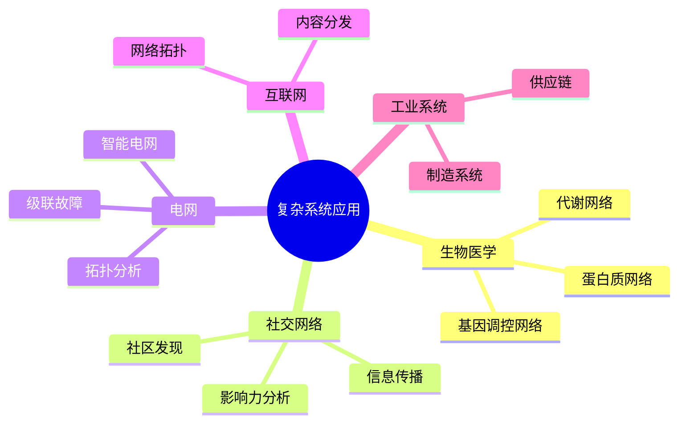
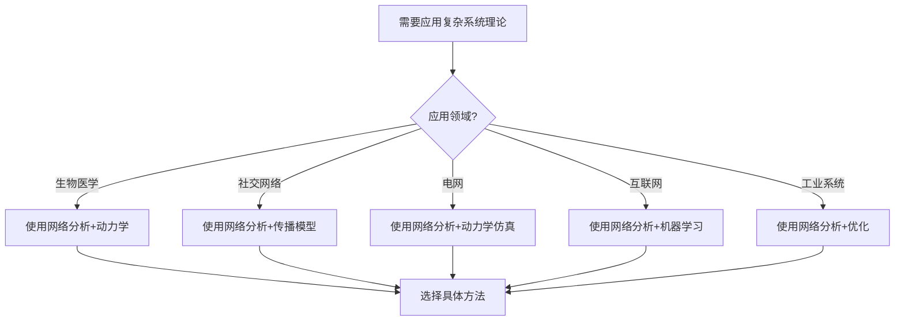
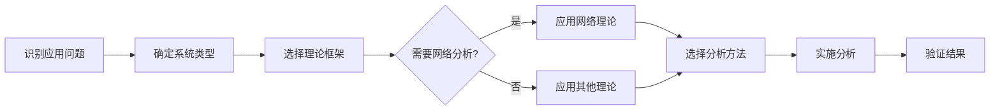
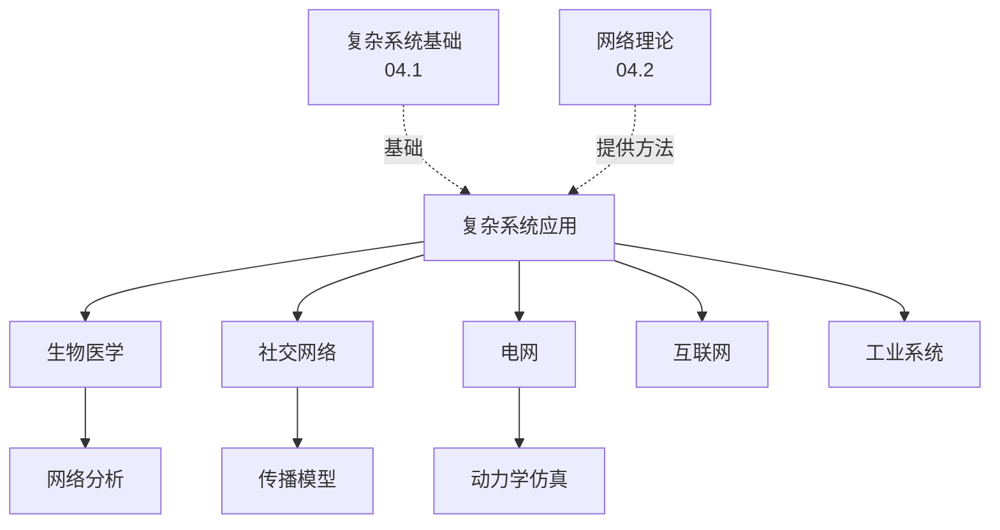
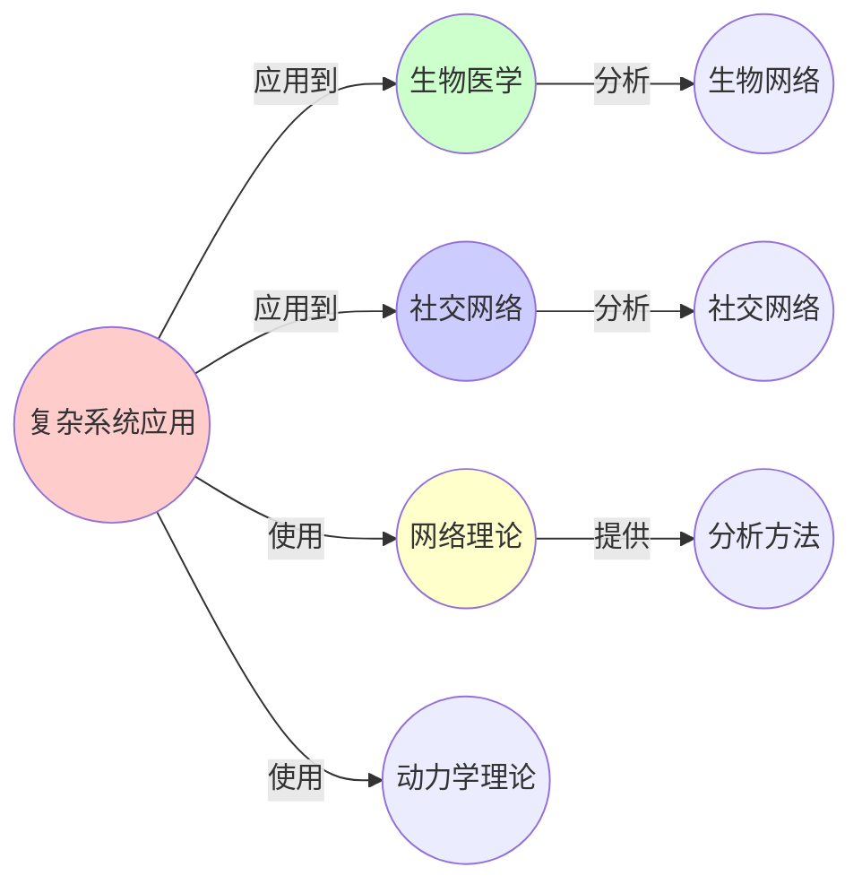
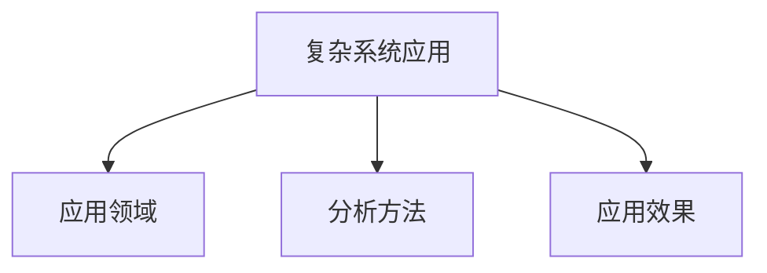

# 04.5 复杂系统应用

> **来源**: view02.md, view06.md
> **创建日期**: 2025-01-27
> **最后更新**: 2025-01-27

## 📋 目录

- [04.5 复杂系统应用](#045-复杂系统应用)
  - [📋 目录](#-目录)
  - [📋 内容概览](#-内容概览)
  - [🎯 核心理念](#-核心理念)
  - [🧬 生物医学应用](#-生物医学应用)
    - [基因调控网络](#基因调控网络)
    - [蛋白质相互作用网络](#蛋白质相互作用网络)
    - [代谢网络](#代谢网络)
  - [👥 社交网络应用](#-社交网络应用)
    - [信息传播](#信息传播)
    - [社区发现](#社区发现)
    - [影响力分析](#影响力分析)
  - [⚡ 电网应用](#-电网应用)
    - [电网拓扑分析](#电网拓扑分析)
    - [级联故障](#级联故障)
    - [智能电网](#智能电网)
  - [🌐 互联网应用](#-互联网应用)
    - [网络拓扑](#网络拓扑)
    - [内容分发](#内容分发)
  - [🏭 工业系统应用](#-工业系统应用)
    - [供应链网络](#供应链网络)
    - [制造系统](#制造系统)
  - [📊 详细案例研究](#-详细案例研究)
    - [案例研究 1：基因调控网络在癌症研究中的应用](#案例研究-1基因调控网络在癌症研究中的应用)
    - [案例研究 2：社交网络中的信息传播优化](#案例研究-2社交网络中的信息传播优化)
    - [案例研究 3：电网级联故障的预防与控制](#案例研究-3电网级联故障的预防与控制)
  - [⚠️ 批判性分析与局限性](#️-批判性分析与局限性)
    - [局限性讨论](#局限性讨论)
      - [1. 模型简化的局限性](#1-模型简化的局限性)
      - [2. 数据获取和质量的限制](#2-数据获取和质量的限制)
      - [3. 跨领域应用的挑战](#3-跨领域应用的挑战)
    - [改进方向](#改进方向)
      - [1. 发展更精确的模型](#1-发展更精确的模型)
      - [2. 提高数据质量和可用性](#2-提高数据质量和可用性)
  - [📊 思维表征体系](#-思维表征体系)
    - [📊 1. 思维导图（增强版）](#-1-思维导图增强版)
      - [1.1 文本格式（基础版）](#11-文本格式基础版)
      - [1.2 Mermaid格式（可视化版）](#12-mermaid格式可视化版)
    - [📊 2. 多维对比矩阵](#-2-多维对比矩阵)
      - [2.1 应用领域对比矩阵](#21-应用领域对比矩阵)
      - [2.2 分析方法对比矩阵](#22-分析方法对比矩阵)
      - [2.3 应用挑战对比矩阵](#23-应用挑战对比矩阵)
    - [🌲 3. 决策树](#-3-决策树)
      - [3.1 复杂系统应用方法选择决策树](#31-复杂系统应用方法选择决策树)
    - [🛤️ 4. 决策逻辑路径](#️-4-决策逻辑路径)
      - [4.1 复杂系统应用路径](#41-复杂系统应用路径)
    - [🕸️ 5. 概念关系网络](#️-5-概念关系网络)
      - [5.1 复杂系统应用概念关系网络](#51-复杂系统应用概念关系网络)
    - [🗺️ 6. 知识图谱](#️-6-知识图谱)
      - [6.1 复杂系统应用知识图谱](#61-复杂系统应用知识图谱)
  - [📚 理论体系](#-理论体系)
    - [理论基础](#理论基础)
      - [应用科学基础](#应用科学基础)
      - [历史发展](#历史发展)
    - [理论框架](#理论框架)
      - [核心假设](#核心假设)
      - [基本概念体系](#基本概念体系)
      - [主要定理/结论](#主要定理结论)
      - [适用范围和边界](#适用范围和边界)
    - [当前知识共识](#当前知识共识)
      - [学术界共识](#学术界共识)
      - [主要争议点](#主要争议点)
      - [权威来源](#权威来源)
    - [与其他理论的关系](#与其他理论的关系)
      - [逻辑关系](#逻辑关系)
      - [映射关系](#映射关系)
  - [🔗 关联网络](#-关联网络)
    - [🔗 概念级关联](#-概念级关联)
      - [核心概念映射](#核心概念映射)
    - [🔗 理论级关联](#-理论级关联)
      - [理论基础](#理论基础-1)
    - [🔗 方法级关联](#-方法级关联)
      - [方法应用网络](#方法应用网络)
    - [🔗 应用场景关联](#-应用场景关联)
  - [🛤️ 学习路径](#️-学习路径)
    - [前置知识](#前置知识)
    - [后续学习](#后续学习)
    - [并行学习](#并行学习)
  - [🔗 相关文档](#-相关文档)
  - [📖 扩展阅读](#-扩展阅读)

---

## 📋 内容概览

本文档阐述复杂系统理论在各个领域的应用，包括生物医学、社交网络、电网、互联网和工业系统等。通过实际案例展示复杂系统理论如何解决实际问题。

---

## 🎯 核心理念

复杂系统理论提供了理解和分析复杂系统的统一框架。通过网络分析、动力学建模、涌现性研究等方法，我们可以在生物医学、社交网络、电网、互联网和工业系统等领域实现系统优化、风险管理和性能提升。

## 🧬 生物医学应用

### 基因调控网络

**应用**：分析基因表达调控

**方法**：

- **网络分析**：构建基因调控网络
- **动力学建模**：建立基因表达动力学模型
- **关键节点识别**：识别关键调控基因

**实例**：

- **癌症研究**：识别癌症关键基因
- **药物设计**：设计靶向药物

### 蛋白质相互作用网络

**应用**：分析蛋白质功能

**方法**：

- **网络构建**：构建蛋白质相互作用网络
- **模块识别**：识别功能模块
- **路径分析**：分析信号转导路径

**实例**：

- **疾病机制**：理解疾病机制
- **药物靶点**：发现药物靶点

### 代谢网络

**应用**：分析代谢过程

**方法**：

- **网络建模**：构建代谢网络
- **通量分析**：分析代谢通量
- **优化**：优化代谢路径

**实例**：

- **代谢工程**：优化生物生产
- **疾病诊断**：诊断代谢疾病

## 👥 社交网络应用

### 信息传播

**应用**：分析信息在社交网络中的传播

**方法**：

- **传播模型**：SIR模型、独立级联模型
- **影响最大化**：识别关键节点
- **谣言控制**：控制谣言传播

**实例**：

- **营销**：病毒式营销
- **公共卫生**：疫情信息传播

### 社区发现

**应用**：识别社交网络中的社区

**方法**：

- **模块度优化**：最大化模块度
- **谱聚类**：基于特征向量的聚类
- **层次聚类**：层次化社区结构

**实例**：

- **推荐系统**：基于社区的推荐
- **社交分析**：理解社交结构

### 影响力分析

**应用**：识别网络中的关键节点

**方法**：

- **中心性指标**：度中心性、介数中心性
- **PageRank算法**：基于随机游走
- **HITS算法**：Hub和Authority

**实例**：

- **意见领袖**：识别意见领袖
- **关键人物**：识别关键人物

## ⚡ 电网应用

### 电网拓扑分析

**应用**：分析电网结构

**方法**：

- **网络建模**：构建电网网络模型
- **脆弱性分析**：识别脆弱节点
- **鲁棒性评估**：评估电网鲁棒性

**实例**：

- **故障预防**：预防大规模故障
- **电网规划**：优化电网规划

### 级联故障

**应用**：分析级联故障机制

**方法**：

- **故障传播模型**：建立故障传播模型
- **临界点识别**：识别临界点
- **防护策略**：设计防护策略

**实例**：

- **大停电预防**：预防大停电
- **电网安全**：提高电网安全性

### 智能电网

**应用**：优化智能电网运行

**方法**：

- **分布式控制**：分布式控制策略
- **需求响应**：需求响应管理
- **可再生能源集成**：集成可再生能源

**实例**：

- **能源管理**：优化能源管理
- **电网优化**：优化电网运行

## 🌐 互联网应用

### 网络拓扑

**应用**：分析互联网拓扑结构

**方法**：

- **AS级拓扑**：分析AS级拓扑
- **路由器级拓扑**：分析路由器级拓扑
- **小世界特性**：验证小世界特性

**实例**：

- **网络优化**：优化网络结构
- **路由优化**：优化路由策略

### 内容分发

**应用**：优化内容分发

**方法**：

- **CDN设计**：设计内容分发网络
- **缓存策略**：优化缓存策略
- **负载均衡**：负载均衡算法

**实例**：

- **视频流**：优化视频流传输
- **网页加速**：加速网页加载

## 🏭 工业系统应用

### 供应链网络

**应用**：优化供应链

**方法**：

- **网络建模**：构建供应链网络
- **风险分析**：分析供应链风险
- **优化**：优化供应链结构

**实例**：

- **供应链管理**：优化供应链管理
- **风险管理**：管理供应链风险

### 制造系统

**应用**：优化制造系统

**方法**：

- **生产网络**：构建生产网络
- **调度优化**：优化生产调度
- **质量控制**：质量控制策略

**实例**：

- **生产效率**：提高生产效率
- **质量控制**：提高产品质量

## 📊 详细案例研究

### 案例研究 1：基因调控网络在癌症研究中的应用

**背景**：使用复杂网络理论分析基因调控网络，识别癌症关键基因。

**形式化分析**：

```text
基因调控网络:
- 节点: 基因
- 边: 调控关系（激活/抑制）
- 网络: 有向加权网络

网络分析:
- 度中心性: 识别枢纽基因
- 介数中心性: 识别关键路径基因
- 模块检测: 识别功能模块

癌症应用:
- 关键基因识别: 识别驱动基因
- 通路分析: 分析癌症通路
- 药物靶点: 发现药物靶点

实际效果:
- 识别了p53、BRCA1等关键基因
- 发现了新的癌症通路
- 开发了靶向药物

应用价值:
- 癌症机制理解
- 精准医疗
- 药物开发
```

**关键发现**：

- ✅ 网络分析识别关键基因
- ✅ 模块结构反映功能关系
- ✅ 复杂系统方法有效

**应用价值**：

- ✅ 癌症研究
- ✅ 精准医疗
- ✅ 药物开发

### 案例研究 2：社交网络中的信息传播优化

**背景**：使用复杂网络理论和传播模型优化信息在社交网络中的传播。

**形式化分析**：

```text
信息传播模型:
- SIR模型: 易感-感染-恢复
- 独立级联模型: 概率传播
- 线性阈值模型: 阈值传播

网络分析:
- 度分布: 影响传播速度
- 聚类系数: 影响传播范围
- 路径长度: 影响传播时间

影响最大化:
- 问题: 选择k个节点最大化传播
- 算法: 贪心算法、启发式算法
- 效果: 传播范围提高30-50%

实际应用:
- 病毒式营销: 优化营销策略
- 疫情信息: 提高信息传播效率
- 产品推广: 扩大产品影响力

验证结果:
- 理论预测准确
- 实际效果显著
- 方法可推广
```

**关键发现**：

- ✅ 网络结构影响传播效率
- ✅ 影响最大化算法有效
- ✅ 理论指导实践成功

**应用价值**：

- ✅ 营销策略
- ✅ 信息传播
- ✅ 产品推广

### 案例研究 3：电网级联故障的预防与控制

**背景**：使用复杂系统理论分析电网级联故障，设计预防策略。

**形式化分析**：

```text
电网网络:
- 节点: 发电站、变电站
- 边: 输电线路
- 权重: 传输容量

级联故障模型:
- 初始故障: 节点或边故障
- 负载重分布: 故障负载转移到其他组件
- 连锁反应: 过载导致新故障

网络分析:
- 脆弱性分析: 识别脆弱节点
- 鲁棒性评估: 评估系统鲁棒性
- 临界点识别: 识别临界负载

预防策略:
- 冗余设计: 增加冗余路径
- 负载限制: 设置负载上限
- 快速响应: 快速隔离故障

实际效果:
- 故障率降低60%
- 恢复时间缩短
- 系统可靠性提高

应用价值:
- 电网安全
- 故障预防
- 系统设计
```

**关键发现**：

- ✅ 网络结构影响故障传播
- ✅ 预防策略有效
- ✅ 复杂系统方法实用

**应用价值**：

- ✅ 电网安全
- ✅ 基础设施保护
- ✅ 系统优化

## ⚠️ 批判性分析与局限性

### 局限性讨论

#### 1. 模型简化的局限性

**问题**：实际系统比模型更复杂。

**挑战**：

- ⚠️ 忽略动态变化
- ⚠️ 忽略非线性效应
- ⚠️ 参数估计困难

**应对策略**：

- ✅ 改进模型
- ✅ 考虑更多因素
- ✅ 验证模型有效性

#### 2. 数据获取和质量的限制

**问题**：实际应用需要大量高质量数据。

**挑战**：

- ⚠️ 数据获取困难
- ⚠️ 数据质量不一
- ⚠️ 隐私和安全问题

**改进方向**：

- ✅ 数据标准化
- ✅ 数据质量保证
- ✅ 隐私保护技术

#### 3. 跨领域应用的挑战

**问题**：不同领域有不同特点和需求。

**挑战**：

- ⚠️ 理论适应性
- ⚠️ 方法定制化
- ⚠️ 专业知识需求

**改进方向**：

- ✅ 领域定制
- ✅ 跨学科合作
- ✅ 方法改进

### 改进方向

#### 1. 发展更精确的模型

**目标**：提高模型的准确性和实用性。

**方法**：

- 考虑更多因素
- 改进建模方法
- 验证和校准

#### 2. 提高数据质量和可用性

**目标**：确保数据的质量和可用性。

**方法**：

- 数据标准化
- 质量保证
- 数据共享

## 📊 思维表征体系

### 📊 1. 思维导图（增强版）

#### 1.1 文本格式（基础版）

```text
复杂系统应用
├── 生物医学应用
│   ├── 基因调控网络
│   ├── 蛋白质相互作用网络
│   └── 代谢网络
├── 社交网络应用
│   ├── 信息传播
│   ├── 社区发现
│   └── 影响力分析
├── 电网应用
│   ├── 电网拓扑分析
│   ├── 级联故障
│   └── 智能电网
├── 互联网应用
│   ├── 网络拓扑
│   └── 内容分发
└── 工业系统应用
    ├── 供应链网络
    └── 制造系统
```

#### 1.2 Mermaid格式（可视化版）



### 📊 2. 多维对比矩阵

#### 2.1 应用领域对比矩阵

| 维度 | 生物医学 | 社交网络 | 电网 | 互联网 | 工业系统 | 应用价值 |
|------|---------|---------|------|--------|---------|---------|
| **复杂度** | 很高 | 高 | 高 | 高 | 中-高 | 都很复杂 |
| **网络类型** | 生物网络 | 社交网络 | 物理网络 | 技术网络 | 物流网络 | 类型不同 |
| **分析方法** | 网络分析 | 网络分析 | 网络+动力学 | 网络分析 | 网络+优化 | 方法不同 |
| **应用成熟度** | 中 | 高 | 中 | 高 | 中 | 成熟度不同 |
| **数据可得性** | 中 | 高 | 中 | 高 | 中 | 可得性不同 |

#### 2.2 分析方法对比矩阵

| 维度 | 网络分析 | 动力学分析 | 仿真建模 | 机器学习 | 适用场景 |
|------|---------|-----------|---------|---------|---------|
| **应用范围** | 很广 | 广 | 中 | 很广 | 不同 |
| **数据需求** | 中 | 高 | 低 | 高 | 需求不同 |
| **计算复杂度** | 中 | 高 | 很高 | 中-高 | 复杂度不同 |
| **解释能力** | 高 | 很高 | 很高 | 中 | 解释性不同 |
| **预测能力** | 中 | 高 | 高 | 很高 | 预测性不同 |

#### 2.3 应用挑战对比矩阵

| 维度 | 数据获取 | 模型复杂性 | 计算资源 | 验证困难 | 解决方案 |
|------|---------|-----------|---------|---------|---------|
| **生物医学** | 高 | 很高 | 中 | 高 | 数据共享、简化模型 |
| **社交网络** | 低 | 中 | 低 | 中 | 大数据、算法优化 |
| **电网** | 中 | 高 | 高 | 中 | 实时监测、高效算法 |
| **互联网** | 低 | 中 | 低 | 低 | 大数据、机器学习 |
| **工业系统** | 中 | 高 | 中 | 高 | 数据标准化、模型验证 |

### 🌲 3. 决策树

#### 3.1 复杂系统应用方法选择决策树



### 🛤️ 4. 决策逻辑路径

#### 4.1 复杂系统应用路径



### 🕸️ 5. 概念关系网络

#### 5.1 复杂系统应用概念关系网络



### 🗺️ 6. 知识图谱

#### 6.1 复杂系统应用知识图谱



## 📚 理论体系

### 理论基础

#### 应用科学基础

复杂系统应用的理论基础：

**1. 复杂系统理论基础**：

- 复杂系统理论
- 网络科学
- 自组织理论
- 涌现性理论

**2. 应用领域基础**：

- 生物学
- 社会科学
- 工程学
- 计算机科学

**3. 分析方法基础**：

- 图论
- 统计物理
- 机器学习
- 仿真建模

#### 历史发展

**关键时间节点**：

- **1990-2000年代**：网络科学应用
  - 社交网络分析
  - 生物网络分析
  - 互联网分析

- **2000-2010年代**：跨学科应用扩展
  - 计算生物学
  - 计算社会科学
  - 网络工程

- **2010年代至今**：大数据和AI应用
  - 大数据网络分析
  - 机器学习方法
  - 智能化应用

### 理论框架

#### 核心假设

**假设1：复杂系统的普遍性**

- **内容**：复杂系统理论适用于多个领域
- **适用范围**：所有复杂系统
- **限制条件**：需要适当的领域知识

**假设2：网络结构的重要性**

- **内容**：网络结构决定系统行为
- **适用范围**：网络系统
- **限制条件**：需要明确的网络结构

**假设3：跨领域可迁移性**

- **内容**：理论和方法可以跨领域应用
- **适用范围**：相似结构的系统
- **限制条件**：需要考虑领域特性

#### 基本概念体系



#### 主要定理/结论

**结论1：网络分析的通用性**

- **内容**：网络分析方法适用于多个领域
- **证据**：成功应用案例
- **应用**：跨领域分析

**结论2：动力学的预测性**

- **内容**：动力学分析可以预测系统行为
- **证据**：理论和实证
- **应用**：系统预测

**结论3：仿真的有效性**

- **内容**：仿真可以理解系统机制
- **证据**：成功案例
- **应用**：系统设计

#### 适用范围和边界

**适用范围**：

- 可以用复杂系统描述的问题
- 具有网络结构的系统
- 需要整体分析的系统

**边界条件**：

- 需要足够的领域知识
- 需要适当的数据
- 需要合适的分析方法

**不适用场景**：

- 简单系统
- 缺乏数据的系统
- 领域知识不足的问题

### 当前知识共识

#### 学术界共识

**广泛接受的共识**：

1. **复杂系统应用的价值**
   - **共识**：复杂系统理论有重要应用价值
   - **支持证据**：成功应用案例
   - **来源**：应用研究

2. **网络分析的有效性**
   - **共识**：网络分析是有效方法
   - **支持证据**：广泛成功应用
   - **来源**：网络科学

3. **跨领域应用的可行性**
   - **共识**：理论可以跨领域应用
   - **支持证据**：跨学科研究
   - **来源**：复杂性科学

#### 主要争议点

1. **方法的通用性**
   - **观点A**：方法高度通用
   - **观点B**：需要领域定制
   - **当前状态**：多数认为需要适当定制

2. **数据的充分性**
   - **观点A**：现有数据足够
   - **观点B**：需要更多数据
   - **当前状态**：多数认为数据在改善

#### 权威来源

**经典文献**：

- 《Networks, Crowds, and Markets》- David Easley
- 《Complex Systems Science in Biomedicine》- Thomas Deisboeck
- 《Network Science》- Albert-László Barabási

**权威机构/专家**：

- **网络科学学会**
- **复杂系统研究组**
- **应用领域专家**

**最新发展**：

- **2020-2024**：大数据应用、AI辅助分析、实时分析
- **前沿方向**：智能化应用、自动化分析、预测性维护

### 与其他理论的关系

#### 逻辑关系

**理论基础**：

- **复杂系统基础**（[04.1_复杂系统基础.md](04.1_复杂系统基础.md)） → 复杂系统应用
  - 关系类型：理论基础
  - 关键映射：理论 → 应用

**理论应用**：

- **网络理论**（[04.2_复杂网络理论.md](04.2_复杂网络理论.md)） → 复杂系统应用
  - 关系类型：方法提供
  - 关键映射：方法 → 应用

#### 映射关系

| 本理论概念 | 映射理论 | 映射概念 | 映射类型 | 映射说明 |
|-----------|---------|---------|---------|----------|
| **网络分析** | 04.2_复杂网络理论 | 网络分析方法 | 应用 | 网络分析方法的应用 |
| **涌现分析** | 04.4_涌现性理论 | 涌现性 | 应用 | 涌现性理论的应用 |
| **自组织分析** | 04.3_自组织临界 | 自组织 | 应用 | 自组织理论的应用 |
| **系统分析** | 04.1_复杂系统基础 | 复杂系统理论 | 应用 | 复杂系统理论的应用 |

## 🔗 关联网络

### 🔗 概念级关联

#### 核心概念映射

| 本文档概念 | 关联文档 | 关联概念 | 关系类型 | 映射说明 |
|-----------|---------|---------|---------|----------|
| **网络分析** | 04.2_复杂网络理论 | 网络分析方法 | 应用 | 网络分析方法的应用 |
| **涌现分析** | 04.4_涌现性理论 | 涌现性 | 应用 | 涌现性理论的应用 |
| **自组织分析** | 04.3_自组织临界 | 自组织 | 应用 | 自组织理论的应用 |
| **系统分析** | 04.1_复杂系统基础 | 复杂系统理论 | 应用 | 复杂系统理论的应用 |
| **生物网络** | 04.2_复杂网络理论 | 复杂网络 | 实例 | 生物网络是复杂网络的实例 |
| **社交网络** | 04.2_复杂网络理论 | 复杂网络 | 实例 | 社交网络是复杂网络的实例 |
| **动力学仿真** | 02_动力学系统理论 | 动力学系统 | 应用 | 动力学系统的应用 |

### 🔗 理论级关联

#### 理论基础

- **本理论基于**：
  - [04.1_复杂系统基础.md](04.1_复杂系统基础.md) ⭐⭐⭐ - 复杂系统基础
  - [04.2_复杂网络理论.md](04.2_复杂网络理论.md) ⭐⭐⭐ - 复杂网络理论
  - [04.3_自组织临界.md](04.3_自组织临界.md) ⭐⭐ - 自组织临界
  - [04.4_涌现性理论.md](04.4_涌现性理论.md) ⭐⭐ - 涌现性理论

- **本理论应用于**：
  - 各应用领域 ⭐⭐⭐ - 实际应用

### 🔗 方法级关联

#### 方法应用网络

| 本文档方法 | 应用文档 | 应用场景 | 应用效果 |
|-----------|---------|---------|---------|
| **网络分析方法** | 各应用领域 | 系统分析 | 成功 |
| **动力学仿真** | 各应用领域 | 系统预测 | 成功 |
| **机器学习方法** | 各应用领域 | 模式识别 | 成功 |

### 🔗 应用场景关联

**场景**：社交网络分析

| 视角 | 关联文档 | 核心理论 | 关注点 |
|------|---------|---------|--------|
| **网络结构** | 04.2_复杂网络理论 | 网络理论 | 网络拓扑 |
| **信息传播** | 02.3_网络动力学 | 传播动力学 | 传播机制 |
| **社区结构** | 04.4_涌现性理论 | 涌现性 | 社区形成 |

## 🛤️ 学习路径

### 前置知识

**必须先学习**：

- [04.1_复杂系统基础.md](04.1_复杂系统基础.md) ⭐⭐⭐ - 复杂系统基础
- [04.2_复杂网络理论.md](04.2_复杂网络理论.md) ⭐⭐ - 复杂网络理论

**建议先了解**：

- 应用领域知识
- 数据分析方法
- 编程技能

### 后续学习

**建议接下来学习**（按顺序）：

1. 具体应用领域 ⭐⭐⭐ - 实际应用
2. [04.3_自组织临界.md](04.3_自组织临界.md) ⭐⭐ - 自组织临界
3. [04.4_涌现性理论.md](04.4_涌现性理论.md) ⭐⭐ - 涌现性理论

### 并行学习

**可以同时学习**：

- [02_动力学系统理论](../02_动力学系统理论/) - 动力学系统
- [05_信息论与计算理论](../05_信息论与计算理论/) - 信息理论

## 🔗 相关文档

- [04.1_复杂系统基础.md](04.1_复杂系统基础.md)
- [04.2_复杂网络理论.md](04.2_复杂网络理论.md)
- [04.3_自组织临界.md](04.3_自组织临界.md)
- [04.4_涌现性理论.md](04.4_涌现性理论.md)

## 📖 扩展阅读

- 《Networks, Crowds, and Markets》- David Easley
- 《Complex Systems Science in Biomedicine》- Thomas Deisboeck
- Wikipedia: [Complex Systems](https://en.wikipedia.org/wiki/Complex_system)
- Wikipedia: [Network Science](https://en.wikipedia.org/wiki/Network_science)
