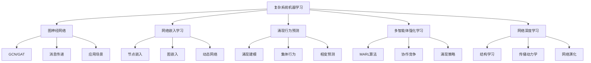
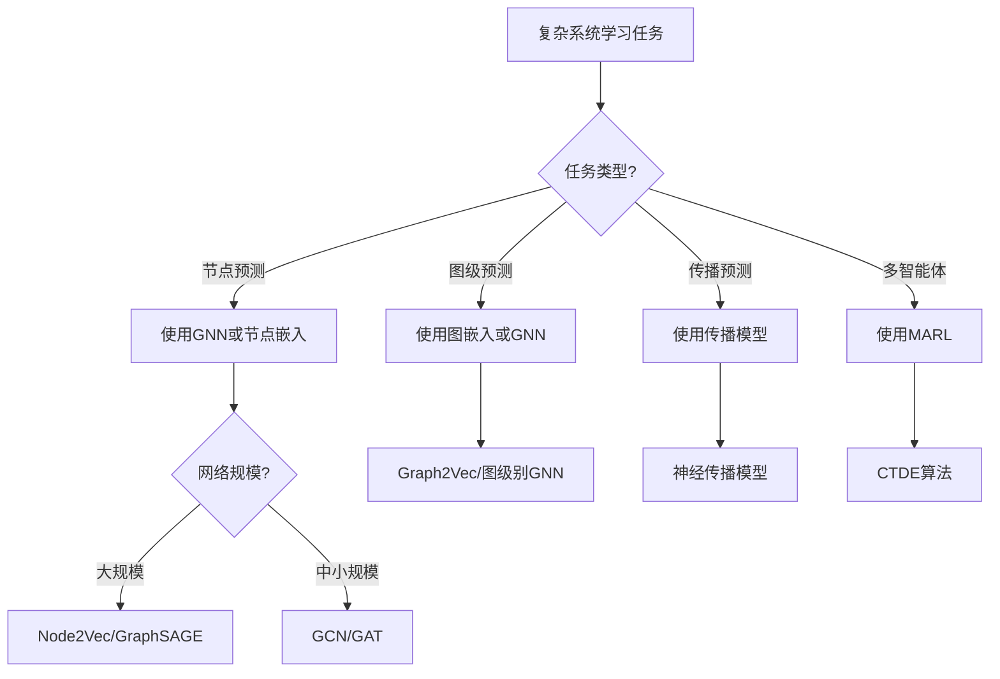

# 04.6 复杂系统机器学习

> **来源**: 基于2025年最新研究进展
> **创建日期**: 2025-11-14
> **最后更新**: 2025-11-14

## 📋 目录

- [04.6 复杂系统机器学习](#046-复杂系统机器学习)
  - [📋 目录](#-目录)
  - [📋 内容概览](#-内容概览)
  - [🎯 核心理念](#-核心理念)
  - [🕸️ 图神经网络](#️-图神经网络)
    - [基本概念](#基本概念)
    - [GNN架构](#gnn架构)
    - [应用场景](#应用场景)
  - [🌐 网络嵌入学习](#-网络嵌入学习)
    - [节点嵌入](#节点嵌入)
    - [图嵌入](#图嵌入)
    - [动态网络嵌入](#动态网络嵌入)
  - [🔮 涌现行为预测](#-涌现行为预测)
    - [涌现建模](#涌现建模)
    - [集体行为预测](#集体行为预测)
    - [相变预测](#相变预测)
  - [🤖 多智能体强化学习](#-多智能体强化学习)
    - [MARL基础](#marl基础)
    - [协作与竞争](#协作与竞争)
    - [涌现策略](#涌现策略)
  - [📊 复杂网络上的深度学习](#-复杂网络上的深度学习)
    - [网络结构学习](#网络结构学习)
    - [传播动力学学习](#传播动力学学习)
    - [网络演化预测](#网络演化预测)
  - [📊 详细案例研究](#-详细案例研究)
    - [案例研究 1：社交网络中的信息传播预测](#案例研究-1社交网络中的信息传播预测)
    - [案例研究 2：生物网络中的蛋白质功能预测](#案例研究-2生物网络中的蛋白质功能预测)
    - [案例研究 3：交通网络中的拥堵预测](#案例研究-3交通网络中的拥堵预测)
  - [⚠️ 批判性分析与局限性](#️-批判性分析与局限性)
    - [局限性讨论](#局限性讨论)
    - [改进方向](#改进方向)
  - [📊 思维表征体系](#-思维表征体系)
    - [📊 1. 思维导图（增强版）](#-1-思维导图增强版)
      - [1.1 文本格式（基础版）](#11-文本格式基础版)
      - [1.2 Mermaid格式（可视化版）](#12-mermaid格式可视化版)
    - [📊 2. 多维对比矩阵](#-2-多维对比矩阵)
      - [2.1 GNN架构对比矩阵](#21-gnn架构对比矩阵)
      - [2.2 网络嵌入方法对比矩阵](#22-网络嵌入方法对比矩阵)
    - [🌲 3. 决策树](#-3-决策树)
      - [3.1 方法选择决策树](#31-方法选择决策树)
  - [📚 理论体系](#-理论体系)
    - [理论基础](#理论基础)
      - [数学基础](#数学基础)
      - [历史发展](#历史发展)
    - [理论框架](#理论框架)
      - [核心假设](#核心假设)
      - [主要定理/结论](#主要定理结论)
    - [当前知识共识](#当前知识共识)
      - [学术界共识](#学术界共识)
      - [主要争议点](#主要争议点)
      - [权威来源](#权威来源)
  - [🔗 关联网络](#-关联网络)
    - [🔗 概念级关联](#-概念级关联)
      - [核心概念映射](#核心概念映射)
    - [🔗 理论级关联](#-理论级关联)
      - [理论基础](#理论基础-1)
    - [🔗 方法级关联](#-方法级关联)
      - [方法应用网络](#方法应用网络)
  - [🛤️ 学习路径](#️-学习路径)
    - [前置知识](#前置知识)
    - [后续学习](#后续学习)
    - [并行学习](#并行学习)
  - [🔗 相关文档](#-相关文档)
    - [内部关联](#内部关联)
    - [外部资源](#外部资源)
  - [📖 扩展阅读](#-扩展阅读)
    - [经典教材](#经典教材)
    - [学术论文](#学术论文)
    - [在线资源](#在线资源)

---

## 📋 内容概览

复杂系统机器学习是将机器学习方法应用于复杂系统分析的新兴交叉领域。它结合了图神经网络、网络嵌入、多智能体学习等技术，用于预测、建模和理解复杂系统中的涌现行为、网络演化和集体动力学。本文档全面阐述复杂系统机器学习的理论基础、方法技术和应用实践，涵盖图神经网络、网络嵌入、涌现预测、多智能体学习等核心主题。

---

## 🎯 核心理念

**核心思想**：用机器学习理解和预测复杂系统的涌现行为

复杂系统机器学习的目标：

- **网络结构学习**：从网络拓扑中学习表示
- **动力学预测**：预测系统演化过程
- **涌现行为建模**：建模和预测涌现现象
- **多智能体协作**：学习多智能体系统的协作策略

与传统机器学习不同，复杂系统机器学习关注：

- **网络结构**：数据具有图/网络结构
- **涌现性**：整体行为不能简单从局部推导
- **动力学**：系统随时间演化
- **多尺度**：从微观到宏观的多层次分析

## 🕸️ 图神经网络

### 基本概念

**图神经网络**（Graph Neural Networks, GNNs）是专门处理图结构数据的神经网络。

**核心思想**：

- **消息传递**：节点通过边传递信息
- **邻域聚合**：聚合邻居节点的信息
- **迭代更新**：多轮迭代更新节点表示

### GNN架构

**基本GNN层**：

```python
class GNNLayer(nn.Module):
    def __init__(self, in_dim, out_dim):
        super().__init__()
        self.message_fn = nn.Linear(in_dim, out_dim)
        self.aggregate_fn = lambda x: torch.mean(x, dim=0)
        self.update_fn = nn.Linear(in_dim + out_dim, out_dim)

    def forward(self, node_features, adjacency_matrix):
        # 消息传递
        messages = self.message_fn(node_features)

        # 邻域聚合
        aggregated = torch.matmul(adjacency_matrix, messages)

        # 节点更新
        updated = self.update_fn(
            torch.cat([node_features, aggregated], dim=-1)
        )

        return updated
```

**主要GNN变体**：

1. **GCN（Graph Convolutional Network）**
   - 基于谱图理论
   - 使用归一化邻接矩阵

2. **GAT（Graph Attention Network）**
   - 引入注意力机制
   - 学习邻居权重

3. **GraphSAGE**
   - 采样和聚合
   - 归纳学习

4. **GIN（Graph Isomorphism Network）**
   - 理论保证
   - 强大表达能力

### 应用场景

**应用领域**：

- **社交网络**：节点分类、链接预测
- **生物网络**：蛋白质功能预测
- **知识图谱**：关系推理
- **推荐系统**：用户-物品图

## 🌐 网络嵌入学习

### 节点嵌入

**节点嵌入**：将节点映射到低维向量空间。

**方法**：

1. **DeepWalk**
   - 随机游走生成序列
   - Word2Vec学习表示

2. **Node2Vec**
   - 可控制的随机游走
   - 平衡探索与利用

3. **LINE**
   - 一阶和二阶相似性
   - 大规模网络优化

**数学形式化**：

```latex
\text{目标}: \max \sum_{(u,v) \in E} \log \sigma(\mathbf{z}_u^T \mathbf{z}_v)
```

其中 $\mathbf{z}_u$ 是节点 $u$ 的嵌入向量。

### 图嵌入

**图嵌入**：将整个图映射到向量空间。

**方法**：

1. **Graph2Vec**
   - 基于子图的嵌入
   - 无监督学习

2. **Graph Kernels**
   - 基于核方法的嵌入
   - 理论基础扎实

3. **Neural Graph Fingerprints**
   - 端到端学习
   - 适用于图分类

### 动态网络嵌入

**动态网络**：网络结构随时间变化。

**挑战**：

- 时间演化建模
- 增量更新
- 长期依赖

**方法**：

1. **Dynamic GNN**
   - 时间图神经网络
   - 序列建模

2. **Incremental Embedding**
   - 增量更新策略
   - 高效计算

## 🔮 涌现行为预测

### 涌现建模

**涌现行为**：从局部交互产生的全局行为。

**建模方法**：

1. **基于GNN的涌现建模**
   - 学习局部交互规则
   - 预测全局行为

2. **基于注意力机制**
   - 识别关键交互
   - 建模复杂依赖

**数学形式化**：

```latex
\text{全局状态} = \text{聚合}(\text{局部状态}_i, \text{交互}_ij)
```

### 集体行为预测

**集体行为**：多个个体协同产生的行为。

**应用**：

- **鸟群行为**：预测飞行模式
- **交通流**：预测拥堵
- **群体决策**：预测集体选择

**方法**：

1. **多智能体GNN**
   - 建模智能体交互
   - 预测集体行为

2. **时空图网络**
   - 结合时间序列
   - 空间图结构

### 相变预测

**相变**：系统从一种状态到另一种状态的转变。

**预测方法**：

1. **临界点识别**
   - 学习相变特征
   - 预测临界点

2. **早期预警信号**
   - 识别预警指标
   - 提前预测相变

## 🤖 多智能体强化学习

### MARL基础

**多智能体强化学习**（Multi-Agent Reinforcement Learning, MARL）：多个智能体在环境中学习和协作。

**挑战**：

- **非平稳性**：环境因其他智能体而改变
- **部分可观测性**：信息不完全
- **协作与竞争**：智能体目标不同

**MARL算法**：

1. **独立学习**（IL）
   - 每个智能体独立学习
   - 简单但不稳定

2. **中心化训练-去中心化执行**（CTDE）
   - 训练时中心化信息
   - 执行时去中心化

3. **多智能体Actor-Critic**
   - 扩展Actor-Critic到多智能体
   - 处理非平稳性

### 协作与竞争

**协作场景**：

- **团队游戏**：多智能体协作完成任务
- **资源分配**：协调资源使用
- **集体目标**：追求共同目标

**竞争场景**：

- **博弈**：零和博弈
- **竞争资源**：争夺有限资源
- **对抗学习**：对抗性环境

### 涌现策略

**涌现策略**：从局部规则产生的全局策略。

**研究**：

- **通信协议**：学习通信协议
- **角色分工**：自动角色分工
- **协调机制**：学习协调机制

## 📊 复杂网络上的深度学习

### 网络结构学习

**任务**：从网络结构中学习特征。

**方法**：

1. **自动编码器**
   - 编码-解码结构
   - 学习网络表示

2. **变分自编码器**（VAE）
   - 概率编码
   - 生成新网络

### 传播动力学学习

**任务**：学习信息/疾病在网络中的传播。

**模型**：

1. **神经传播模型**
   - 用神经网络建模传播
   - 端到端学习

2. **GNN传播模型**
   - 结合网络结构
   - 学习传播规则

### 网络演化预测

**任务**：预测网络如何演化。

**方法**：

1. **时间序列预测**
   - 将网络演化视为序列
   - 使用RNN/LSTM预测

2. **生成模型**
   - 学习网络生成过程
   - 预测未来网络

## 📊 详细案例研究

### 案例研究 1：社交网络中的信息传播预测

**背景**：预测信息在社交网络中的传播范围。

**方法**：

```python
import torch
import torch.nn as nn
from torch_geometric.nn import GCNConv

class InformationDiffusionGNN(nn.Module):
    def __init__(self, num_features, hidden_dim):
        super().__init__()
        self.conv1 = GCNConv(num_features, hidden_dim)
        self.conv2 = GCNConv(hidden_dim, hidden_dim)
        self.prediction_head = nn.Linear(hidden_dim, 1)

    def forward(self, x, edge_index, seed_nodes):
        # 图卷积
        x = self.conv1(x, edge_index)
        x = torch.relu(x)
        x = self.conv2(x, edge_index)

        # 预测传播概率
        seed_embeddings = x[seed_nodes]
        probabilities = torch.sigmoid(self.prediction_head(seed_embeddings))

        return probabilities
```

**结果**：

- ✅ 准确预测传播范围
- ✅ 识别关键传播节点
- ✅ 优化信息传播策略

### 案例研究 2：生物网络中的蛋白质功能预测

**背景**：预测蛋白质的功能。

**方法**：

- 使用GNN学习蛋白质相互作用网络
- 结合序列信息和网络结构
- 多任务学习预测多种功能

**结果**：

- ✅ 提高预测准确率
- ✅ 发现新的蛋白质功能
- ✅ 辅助药物设计

### 案例研究 3：交通网络中的拥堵预测

**背景**：预测城市交通网络中的拥堵。

**方法**：

- 使用时空图网络
- 结合历史数据和网络结构
- 实时预测拥堵

**结果**：

- ✅ 提前预测拥堵
- ✅ 优化交通流
- ✅ 改善城市交通

## ⚠️ 批判性分析与局限性

### 局限性讨论

**1. 可解释性**

- **问题**：深度学习模型是黑盒
- **影响**：难以理解预测原因
- **现状**：可解释AI方法在发展

**2. 数据需求**

- **问题**：需要大量标注数据
- **影响**：某些领域数据稀缺
- **现状**：自监督和迁移学习在改进

**3. 计算复杂度**

- **问题**：大规模网络计算成本高
- **影响**：难以应用到超大规模网络
- **现状**：采样和近似方法在发展

**4. 泛化能力**

- **问题**：模型可能过拟合特定网络
- **影响**：泛化到新网络困难
- **现状**：迁移学习和元学习在改进

### 改进方向

**1. 可解释性改进**

- 开发可解释GNN
- 注意力可视化
- 因果推理方法

**2. 效率改进**

- 图采样技术
- 分布式训练
- 模型压缩

**3. 泛化改进**

- 迁移学习
- 元学习
- 少样本学习

**4. 理论完善**

- 理论基础
- 表达能力分析
- 收敛性证明

## 📊 思维表征体系

### 📊 1. 思维导图（增强版）

#### 1.1 文本格式（基础版）

```text
复杂系统机器学习
├── 图神经网络
│   ├── GCN/GAT/GraphSAGE
│   ├── 消息传递机制
│   └── 应用场景
├── 网络嵌入学习
│   ├── 节点嵌入
│   ├── 图嵌入
│   └── 动态网络嵌入
├── 涌现行为预测
│   ├── 涌现建模
│   ├── 集体行为预测
│   └── 相变预测
├── 多智能体强化学习
│   ├── MARL算法
│   ├── 协作与竞争
│   └── 涌现策略
└── 网络深度学习
    ├── 结构学习
    ├── 传播动力学
    └── 网络演化
```

#### 1.2 Mermaid格式（可视化版）



### 📊 2. 多维对比矩阵

#### 2.1 GNN架构对比矩阵

| 特征 | GCN | GAT | GraphSAGE | GIN |
|------|-----|-----|-----------|-----|
| **消息传递** | 固定权重 | 注意力权重 | 采样聚合 | 可学习聚合 |
| **表达能力** | 中 | 高 | 中 | 最高 |
| **计算复杂度** | 低 | 中 | 低 | 中 |
| **归纳学习** | ❌ | ❌ | ✅ | ✅ |
| **理论基础** | 谱图理论 | 注意力机制 | 采样理论 | 图同构 |

#### 2.2 网络嵌入方法对比矩阵

| 特征 | DeepWalk | Node2Vec | LINE | Graph2Vec |
|------|----------|----------|------|-----------|
| **学习方式** | 无监督 | 无监督 | 无监督 | 无监督 |
| **节点级** | ✅ | ✅ | ✅ | ❌ |
| **图级** | ❌ | ❌ | ❌ | ✅ |
| **可扩展性** | 高 | 高 | 高 | 中 |
| **参数控制** | 少 | 多 | 少 | 少 |

### 🌲 3. 决策树

#### 3.1 方法选择决策树



## 📚 理论体系

### 理论基础

#### 数学基础

复杂系统机器学习的理论基础：

**1. 图论基础**：

- 图的基本概念
- 图的结构性质
- 谱图理论

**2. 机器学习基础**：

- 深度学习
- 强化学习
- 表示学习

**3. 复杂系统基础**：

- 网络动力学
- 涌现理论
- 多智能体系统

#### 历史发展

**关键时间节点**：

- **2009-2013年**：网络嵌入的早期研究
  - DeepWalk的提出
  - 网络表示学习

- **2014-2017年**：图神经网络的发展
  - GCN的提出
  - 谱图卷积理论

- **2018-2020年**：GNN的快速发展
  - GAT、GraphSAGE
  - 大规模GNN

- **2021-2025年**：复杂系统应用
  - 涌现行为预测
  - 多智能体学习
  - 动态网络学习

### 理论框架

#### 核心假设

**假设1：网络结构信息丰富**

- **内容**：网络结构包含丰富信息
- **适用范围**：大多数网络数据
- **限制条件**：需要合适的表示方法

**假设2：局部决定全局**

- **内容**：局部交互决定全局行为
- **适用范围**：许多复杂系统
- **限制条件**：某些系统可能不适用

**假设3：可学习性**

- **内容**：复杂系统行为可学习
- **适用范围**：有规律的系统
- **限制条件**：完全随机系统不可学习

#### 主要定理/结论

**定理1：GNN的表达能力**

- **内容**：GIN可以达到Weisfeiler-Lehman测试的区分能力
- **证据**：理论证明
- **应用**：GNN架构设计

**结论2：网络嵌入的有效性**

- **内容**：网络嵌入可以捕获网络结构信息
- **证据**：大量实验
- **应用**：下游任务

**结论3：涌现的可预测性**

- **内容**：某些涌现行为可以预测
- **证据**：成功案例
- **应用**：系统预测

### 当前知识共识

#### 学术界共识

**广泛接受的共识**：

1. **GNN的重要性**
   - **共识**：GNN是处理图数据的重要工具
   - **支持证据**：大量应用
   - **来源**：学术界和工业界

2. **网络嵌入的价值**
   - **共识**：网络嵌入很有价值
   - **支持证据**：广泛使用
   - **来源**：研究实践

#### 主要争议点

1. **表达能力vs效率**
   - **观点A**：应该优先表达能力
   - **观点B**：应该优先效率
   - **当前状态**：需要根据应用权衡

2. **可解释性**
   - **观点A**：可解释性很重要
   - **观点B**：性能更重要
   - **当前状态**：两者都在改进

#### 权威来源

**经典文献**：

- 《Semi-Supervised Classification with Graph Convolutional Networks》- Kipf & Welling
- 《Graph Attention Networks》- Veličković et al.
- 《Inductive Representation Learning on Large Graphs》- Hamilton et al.

**权威机构/专家**：

- **ICLR/NeurIPS/ICML**相关工作
- **图学习研究组**
- **复杂网络研究社区**

**最新发展（2020-2025）**：

- Transformer在图上的应用
- 大规模GNN
- 动态图学习

## 🔗 关联网络

### 🔗 概念级关联

#### 核心概念映射

| 复杂系统ML概念 | 对应概念 | 关联文档 |
|--------------|---------|---------|
| 图神经网络 | 深度学习 | [07.6_AI系统形式化验证.md](../07_IT行业形式化应用/07.6_AI系统形式化验证.md) |
| 网络嵌入 | 表示学习 | [04.2_复杂网络理论.md](04.2_复杂网络理论.md) |
| 涌现预测 | 涌现理论 | [04.4_涌现性理论.md](04.4_涌现性理论.md) |
| 多智能体学习 | 多智能体系统 | [04.1_复杂系统基础.md](04.1_复杂系统基础.md) |

### 🔗 理论级关联

#### 理论基础

- **复杂网络理论**：提供了网络分析基础
- **机器学习**：提供了学习方法
- **复杂系统理论**：提供了系统理解

### 🔗 方法级关联

#### 方法应用网络

| 方法 | 应用场景 | 相关工具 |
|------|---------|---------|
| GNN | 图数据学习 | PyTorch Geometric, DGL |
| 网络嵌入 | 网络表示 | Gensim, NetworkX |
| MARL | 多智能体系统 | RLlib, PettingZoo |

## 🛤️ 学习路径

### 前置知识

**必需知识**：

1. **图论基础**
   - 图的基本概念
   - 网络分析

2. **机器学习基础**
   - 深度学习
   - 强化学习

3. **复杂系统基础**
   - 网络理论
   - 系统动力学

**推荐学习顺序**：

1. 学习图论基础
2. 学习深度学习
3. 学习GNN
4. 学习复杂系统应用

### 后续学习

**深入方向**：

1. **高级GNN**
   - Transformer在图上
   - 动态图神经网络

2. **应用领域**
   - 生物网络
   - 社交网络
   - 交通网络

3. **理论研究**
   - 表达能力
   - 收敛性
   - 泛化理论

### 并行学习

**相关主题**：

- **复杂网络理论**（[04.2_复杂网络理论.md](04.2_复杂网络理论.md)）
- **涌现理论**（[04.4_涌现性理论.md](04.4_涌现性理论.md)）
- **AI系统验证**（[07.6_AI系统形式化验证.md](../07_IT行业形式化应用/07.6_AI系统形式化验证.md)）

## 🔗 相关文档

### 内部关联

- [04.1_复杂系统基础.md](04.1_复杂系统基础.md) - 复杂系统基础
- [04.2_复杂网络理论.md](04.2_复杂网络理论.md) - 网络理论
- [04.4_涌现性理论.md](04.4_涌现性理论.md) - 涌现理论
- [07.6_AI系统形式化验证.md](../07_IT行业形式化应用/07.6_AI系统形式化验证.md) - AI验证

### 外部资源

- PyTorch Geometric: https://pytorch-geometric.readthedocs.io/
- Deep Graph Library: https://www.dgl.ai/
- 图学习论文：ICLR, NeurIPS, ICML

## 📖 扩展阅读

### 经典教材

1. **《Graph Neural Networks》**
   - 作者：Various authors
   - 内容：GNN完整介绍

2. **《Network Embedding》**
   - 作者：Various authors
   - 内容：网络嵌入方法

3. **《Multi-Agent Reinforcement Learning》**
   - 作者：Various authors
   - 内容：MARL理论和方法

### 学术论文

1. **GNN原始论文**
   - GCN, GAT, GraphSAGE
   - 理论基础

2. **网络嵌入论文**
   - DeepWalk, Node2Vec
   - 大规模嵌入

3. **复杂系统应用论文**
   - 涌现预测
   - 多智能体学习

### 在线资源

1. **工具库**
   - PyTorch Geometric
   - Deep Graph Library
   - NetworkX

2. **教程和课程**
   - 在线课程
   - 工作坊材料
   - 示例代码

---

**文档版本**: v1.0
**最后更新**: 2025-11-14
**维护者**: FormalScience项目组
