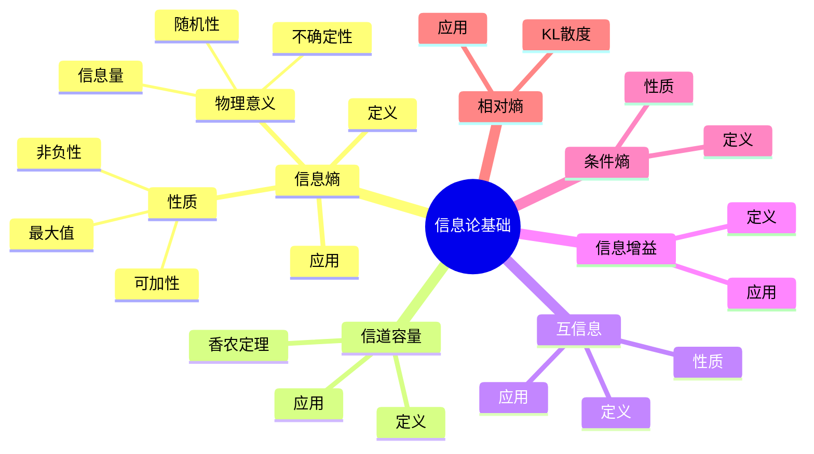
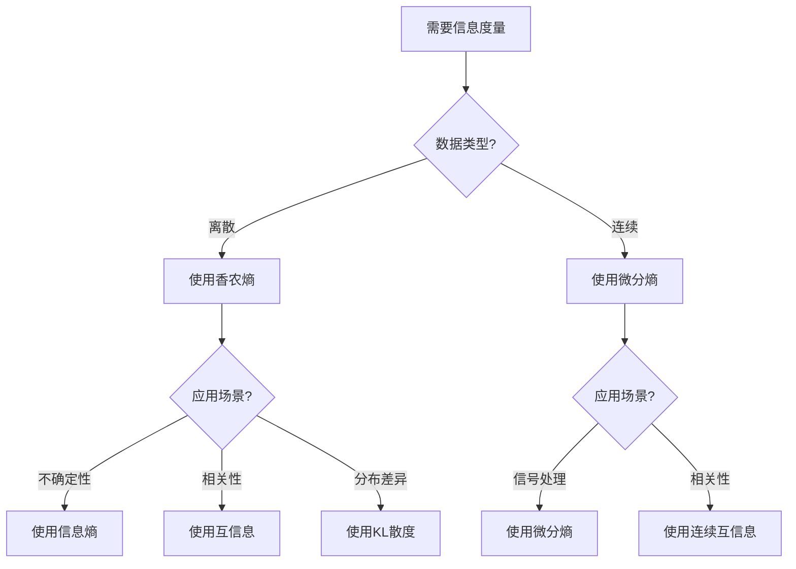
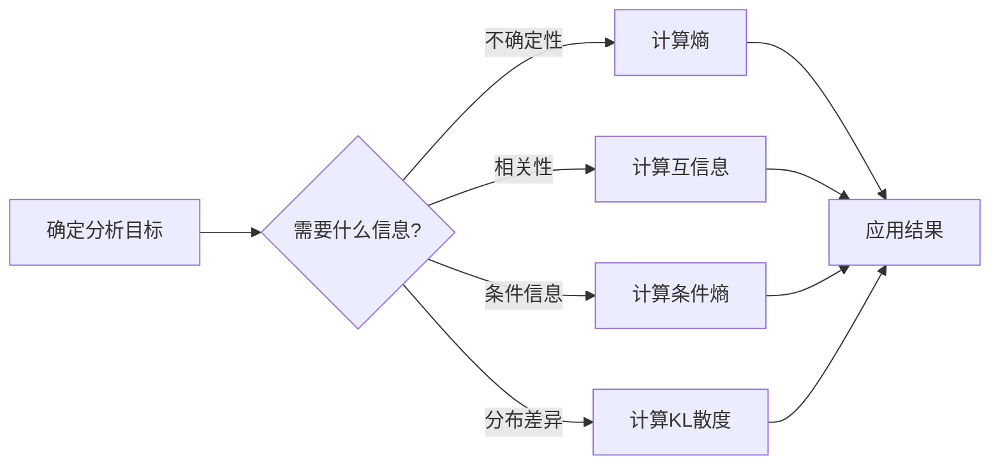
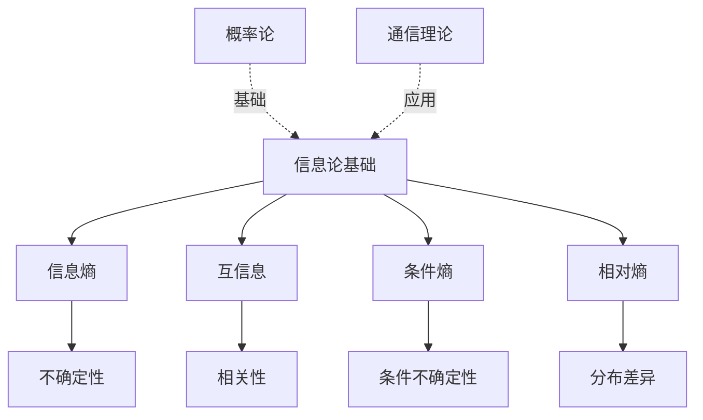
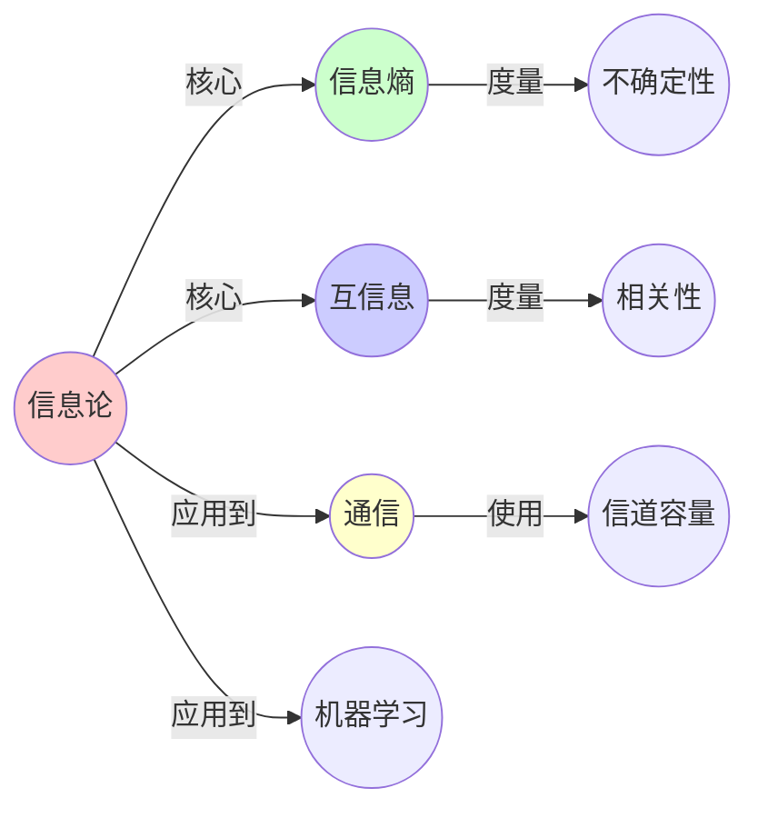
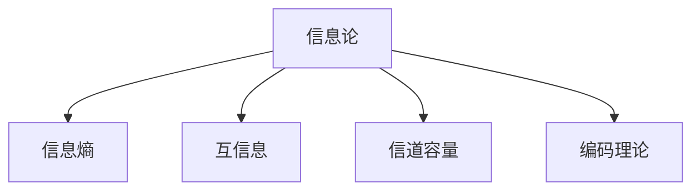

# 05.1 信息论基础

> **来源**: view02.md
> **创建日期**: 2025-01-27
> **最后更新**: 2025-01-27

## 📋 目录

- [05.1 信息论基础](#051-信息论基础)
  - [📋 目录](#-目录)
  - [📋 内容概览](#-内容概览)
  - [🎯 核心理念](#-核心理念)
  - [📊 信息熵（Information Entropy）](#-信息熵information-entropy)
    - [定义](#定义)
    - [物理意义](#物理意义)
    - [性质](#性质)
    - [应用实例](#应用实例)
  - [📡 信道容量（Channel Capacity）](#-信道容量channel-capacity)
    - [定义](#定义-1)
    - [香农第二定理](#香农第二定理)
    - [应用实例](#应用实例-1)
  - [🔄 互信息（Mutual Information）](#-互信息mutual-information)
    - [定义](#定义-2)
    - [性质](#性质-1)
    - [应用实例](#应用实例-2)
  - [📈 信息增益（Information Gain）](#-信息增益information-gain)
    - [定义](#定义-3)
    - [与互信息的关系](#与互信息的关系)
    - [应用实例](#应用实例-3)
  - [🔬 条件熵（Conditional Entropy）](#-条件熵conditional-entropy)
    - [定义](#定义-4)
    - [性质](#性质-2)
    - [应用实例](#应用实例-4)
  - [📊 相对熵（Relative Entropy / KL散度）](#-相对熵relative-entropy--kl散度)
    - [定义](#定义-5)
    - [性质](#性质-3)
    - [应用实例](#应用实例-5)
  - [📊 详细案例研究](#-详细案例研究)
    - [案例研究 1：信息熵在数据压缩中的应用](#案例研究-1信息熵在数据压缩中的应用)
    - [案例研究 2：互信息在特征选择中的应用](#案例研究-2互信息在特征选择中的应用)
    - [案例研究 3：KL散度在变分推断中的应用](#案例研究-3kl散度在变分推断中的应用)
  - [⚠️ 批判性分析与局限性](#️-批判性分析与局限性)
    - [局限性讨论](#局限性讨论)
      - [1. 概率分布假设的限制](#1-概率分布假设的限制)
      - [2. 离散性假设](#2-离散性假设)
      - [3. 独立同分布假设](#3-独立同分布假设)
    - [改进方向](#改进方向)
      - [1. 发展非参数方法](#1-发展非参数方法)
      - [2. 处理连续变量](#2-处理连续变量)
  - [📊 思维表征体系](#-思维表征体系)
    - [📊 1. 思维导图（增强版）](#-1-思维导图增强版)
      - [1.1 文本格式（基础版）](#11-文本格式基础版)
      - [1.2 Mermaid格式（可视化版）](#12-mermaid格式可视化版)
    - [📊 2. 多维对比矩阵](#-2-多维对比矩阵)
      - [2.1 信息论核心概念对比矩阵](#21-信息论核心概念对比矩阵)
      - [2.2 信息论应用领域对比矩阵](#22-信息论应用领域对比矩阵)
      - [2.3 信息度量方法对比矩阵](#23-信息度量方法对比矩阵)
    - [🌲 3. 决策树](#-3-决策树)
      - [3.1 信息论方法选择决策树](#31-信息论方法选择决策树)
    - [🛤️ 4. 决策逻辑路径](#️-4-决策逻辑路径)
      - [4.1 信息论分析路径](#41-信息论分析路径)
    - [🕸️ 5. 概念关系网络](#️-5-概念关系网络)
      - [5.1 信息论概念关系网络](#51-信息论概念关系网络)
    - [🗺️ 6. 知识图谱](#️-6-知识图谱)
      - [6.1 信息论知识图谱](#61-信息论知识图谱)
  - [📚 理论体系](#-理论体系)
    - [理论基础](#理论基础)
      - [数学基础](#数学基础)
      - [历史发展](#历史发展)
    - [理论框架](#理论框架)
      - [核心假设](#核心假设)
      - [基本概念体系](#基本概念体系)
      - [主要定理/结论](#主要定理结论)
      - [适用范围和边界](#适用范围和边界)
    - [当前知识共识](#当前知识共识)
      - [学术界共识](#学术界共识)
      - [主要争议点](#主要争议点)
      - [权威来源](#权威来源)
    - [与其他理论的关系](#与其他理论的关系)
      - [逻辑关系](#逻辑关系)
      - [映射关系](#映射关系)
  - [🔗 关联网络](#-关联网络)
    - [🔗 概念级关联](#-概念级关联)
      - [核心概念映射](#核心概念映射)
    - [🔗 理论级关联](#-理论级关联)
      - [理论基础](#理论基础-1)
    - [🔗 方法级关联](#-方法级关联)
      - [方法应用网络](#方法应用网络)
    - [🔗 应用场景关联](#-应用场景关联)
  - [🛤️ 学习路径](#️-学习路径)
    - [前置知识](#前置知识)
    - [后续学习](#后续学习)
    - [并行学习](#并行学习)
  - [🔗 相关文档](#-相关文档)
  - [📖 扩展阅读](#-扩展阅读)

---

## 📋 内容概览

本文档阐述信息论的基础概念，包括信息熵、信道容量、信息增益等。信息论提供了量化信息、测量不确定性和分析通信系统的数学框架，是现代通信、数据科学和机器学习的基础。

---

## 🎯 核心理念

信息论的核心思想是用熵来量化不确定性，用互信息来测量变量间的关联性。信息熵越大，不确定性越大，需要更多信息来消除这种不确定性。信息论为数据压缩、通信和机器学习提供了理论基础。

## 📊 信息熵（Information Entropy）

### 定义

**香农熵**：

```latex
H(X) = -\sum_{x} P(x) \log_2 P(x)
```

- **X**：随机变量
- **P(x)**：概率分布
- **单位**：比特（bit）

### 物理意义

- **不确定性**：熵越大，不确定性越大
- **信息量**：消除不确定性所需的信息量
- **随机性**：熵越大，随机性越大

### 性质

1. **非负性**：H(X) ≥ 0
2. **最大值**：均匀分布时熵最大
3. **可加性**：独立变量的熵可加

### 应用实例

- **数据压缩**：熵是压缩下限
- **密码学**：密钥熵
- **机器学习**：特征选择

## 📡 信道容量（Channel Capacity）

### 定义

**香农容量**：

```latex
C = \max_{P(X)} I(X;Y)
```

- **I(X;Y)**：互信息
- **P(X)**：输入分布
- **C**：最大传输速率

### 香农第二定理

**内容**：如果信息速率 R < C，则存在编码使错误概率任意小

**意义**：信道容量的可实现性

### 应用实例

- **通信系统**：设计编码方案
- **存储系统**：存储容量
- **网络传输**：带宽利用

## 🔄 互信息（Mutual Information）

### 定义

**互信息**：

```latex
I(X;Y) = H(X) - H(X|Y) = H(Y) - H(Y|X)
```

- **H(X|Y)**：条件熵
- **I(X;Y)**：X和Y的共享信息

### 性质

1. **对称性**：I(X;Y) = I(Y;X)
2. **非负性**：I(X;Y) ≥ 0
3. **独立性**：X和Y独立当且仅当 I(X;Y) = 0

### 应用实例

- **特征选择**：选择与目标变量互信息大的特征
- **信息瓶颈**：压缩信息同时保留相关信息
- **因果推断**：测量变量间的信息流

## 📈 信息增益（Information Gain）

### 定义

**信息增益**：

```latex
IG(Y|X) = H(Y) - H(Y|X)
```

- **H(Y)**：目标变量的熵
- **H(Y|X)**：给定X后Y的条件熵
- **IG(Y|X)**：X对Y的信息增益

### 与互信息的关系

**信息增益 = 互信息**：

```latex
IG(Y|X) = I(X;Y)
```

### 应用实例

- **决策树**：选择分裂属性
- **特征选择**：选择信息增益大的特征
- **数据挖掘**：发现重要属性

## 🔬 条件熵（Conditional Entropy）

### 定义

**条件熵**：

```latex
H(Y|X) = -\sum_{x,y} P(x,y) \log_2 P(y|x)
```

- **P(x,y)**：联合概率
- **P(y|x)**：条件概率
- **H(Y|X)**：给定X后Y的不确定性

### 性质

1. **链式法则**：H(X,Y) = H(X) + H(Y|X)
2. **非负性**：H(Y|X) ≥ 0
3. **独立性**：X和Y独立当且仅当 H(Y|X) = H(Y)

### 应用实例

- **预测**：给定输入预测输出
- **编码**：条件编码
- **学习**：条件学习

## 📊 相对熵（Relative Entropy / KL散度）

### 定义

**KL散度**：

```latex
D_{KL}(P||Q) = \sum_{x} P(x) \log_2 \frac{P(x)}{Q(x)}
```

- **P**：真实分布
- **Q**：近似分布
- **D_KL(P||Q)**：P和Q的差异

### 性质

1. **非负性**：D_KL(P||Q) ≥ 0
2. **非对称性**：D_KL(P||Q) ≠ D_KL(Q||P)
3. **零当且仅当相等**：D_KL(P||Q) = 0 当且仅当 P = Q

### 应用实例

- **模型选择**：比较模型分布
- **变分推断**：近似后验分布
- **信息几何**：概率流形上的距离

## 📊 详细案例研究

### 案例研究 1：信息熵在数据压缩中的应用

**背景**：使用信息熵理论设计数据压缩算法，实现最优压缩。

**形式化分析**：

```text
Huffman编码:
- 原理: 高概率符号用短码，低概率符号用长码
- 熵: H(X) = -Σ P(x) log₂ P(x)
- 平均码长: L = Σ P(x) l(x)
- 最优性: H(X) ≤ L < H(X) + 1

应用效果:
- 文本压缩: 减少存储空间
- 图像压缩: JPEG、PNG
- 音频压缩: MP3
- 视频压缩: H.264、H.265

实际应用:
- 数据存储优化
- 网络传输优化
- 资源节约
```

**关键发现**：

- ✅ 熵是压缩的理论下限
- ✅ Huffman编码接近最优
- ✅ 信息熵指导压缩算法设计

**应用价值**：

- ✅ 数据压缩
- ✅ 存储优化
- ✅ 通信效率

### 案例研究 2：互信息在特征选择中的应用

**背景**：机器学习中使用互信息选择最有价值的特征。

**形式化分析**：

```text
特征选择:
- 目标: 选择与目标变量互信息最大的特征
- 准则: max I(X_i; Y)
- 方法: 计算每个特征与目标的互信息

信息增益:
- 定义: IG(Y|X) = H(Y) - H(Y|X)
- 等价性: IG(Y|X) = I(X;Y)
- 应用: 决策树分裂准则

实际应用:
- 特征选择
- 降维
- 模型优化
```

**关键发现**：

- ✅ 互信息衡量特征重要性
- ✅ 信息增益指导特征选择
- ✅ 理论保证选择有效性

**应用价值**：

- ✅ 机器学习
- ✅ 数据挖掘
- ✅ 模式识别

### 案例研究 3：KL散度在变分推断中的应用

**背景**：使用KL散度进行变分推断，近似复杂后验分布。

**形式化分析**：

```text
变分推断:
- 目标: 近似后验分布 P(θ|D)
- 方法: 最小化 KL(Q(θ)||P(θ|D))
- 等价: 最大化证据下界 ELBO

KL散度:
- 定义: D_KL(Q||P) = Σ Q(θ) log(Q(θ)/P(θ|D))
- 性质: 非负性、非对称性
- 意义: 测量分布差异

应用效果:
- 近似推理
- 模型学习
- 贝叶斯推断
```

**关键发现**：

- ✅ KL散度测量分布差异
- ✅ 变分推断实现近似推理
- ✅ 理论保证近似质量

**应用价值**：

- ✅ 机器学习
- ✅ 统计推断
- ✅ 贝叶斯方法

## ⚠️ 批判性分析与局限性

### 局限性讨论

#### 1. 概率分布假设的限制

**问题**：信息论假设已知概率分布，但实际中往往未知。

**挑战**：

- ⚠️ 分布估计困难
- ⚠️ 样本不足
- ⚠️ 非平稳性

**应对策略**：

- ✅ 使用经验分布
- ✅ 贝叶斯方法
- ✅ 自适应估计

#### 2. 离散性假设

**问题**：经典信息论主要处理离散变量。

**挑战**：

- ⚠️ 连续变量需要离散化
- ⚠️ 离散化损失信息
- ⚠️ 连续信息论复杂

**改进方向**：

- ✅ 发展连续信息论
- ✅ 改进离散化方法
- ✅ 使用微分熵

#### 3. 独立同分布假设

**问题**：许多理论假设独立同分布。

**挑战**：

- ⚠️ 实际数据相关
- ⚠️ 非平稳性
- ⚠️ 时间依赖

**改进方向**：

- ✅ 考虑相关性
- ✅ 时间序列方法
- ✅ 非平稳分析

### 改进方向

#### 1. 发展非参数方法

**目标**：减少对分布的假设。

**方法**：

- 非参数估计
- 核方法
- 经验分布

#### 2. 处理连续变量

**目标**：更好地处理连续变量。

**方法**：

- 微分熵
- 连续互信息
- 数值方法

## 📊 思维表征体系

### 📊 1. 思维导图（增强版）

#### 1.1 文本格式（基础版）

```text
信息论基础
├── 信息熵
│   ├── 定义: H(X) = -Σ P(x) log₂ P(x)
│   ├── 物理意义
│   │   ├── 不确定性
│   │   ├── 信息量
│   │   └── 随机性
│   ├── 性质
│   │   ├── 非负性
│   │   ├── 最大值
│   │   └── 可加性
│   └── 应用: 数据压缩、密码学、机器学习
├── 信道容量
│   ├── 定义: C = max I(X;Y)
│   ├── 香农第二定理
│   └── 应用: 通信、存储、网络
├── 互信息
│   ├── 定义: I(X;Y) = H(X) - H(X|Y)
│   ├── 性质
│   │   ├── 对称性
│   │   ├── 非负性
│   │   └── 独立性
│   └── 应用: 特征选择、信息瓶颈、因果推断
├── 信息增益
│   ├── 定义: IG(Y|X) = H(Y) - H(Y|X)
│   ├── 与互信息的关系
│   └── 应用: 决策树、特征选择、数据挖掘
├── 条件熵
│   ├── 定义
│   ├── 性质
│   └── 应用: 预测、编码、学习
└── 相对熵 (KL散度)
    ├── 定义
    ├── 性质
    └── 应用: 模型选择、变分推断、信息几何
```

#### 1.2 Mermaid格式（可视化版）



### 📊 2. 多维对比矩阵

#### 2.1 信息论核心概念对比矩阵

| 维度 | 信息熵 | 互信息 | 条件熵 | 相对熵 | 重要性 |
|------|--------|--------|--------|--------|--------|
| **定义** | 不确定性度量 | 共享信息 | 条件不确定性 | 分布差异 | 定义不同 |
| **取值范围** | H(X) ≥ 0 | I(X;Y) ≥ 0 | H(Y\|X) ≥ 0 | D_KL ≥ 0 | 都非负 |
| **对称性** | - | 对称 | 不对称 | 不对称 | 对称性不同 |
| **应用** | 压缩、密码学 | 特征选择 | 预测 | 模型选择 | 应用不同 |
| **计算复杂度** | O(n) | O(n²) | O(n²) | O(n) | 复杂度不同 |

#### 2.2 信息论应用领域对比矩阵

| 维度 | 通信 | 数据压缩 | 机器学习 | 密码学 | 应用效果 |
|------|------|---------|---------|--------|---------|
| **核心概念** | 信道容量 | 信息熵 | 互信息 | 信息熵 | 概念不同 |
| **关键定理** | 香农定理 | 无损压缩 | 信息增益 | 密钥熵 | 定理不同 |
| **成功度** | 很高 | 很高 | 高 | 高 | 都成功 |
| **技术成熟度** | 很高 | 很高 | 高 | 高 | 都成熟 |
| **未来发展** | 量子通信 | 新算法 | AI应用 | 量子密码 | 方向不同 |

#### 2.3 信息度量方法对比矩阵

| 维度 | 香农熵 | 微分熵 | 最小描述长度 | 应用场景 |
|------|--------|--------|------------|---------|
| **变量类型** | 离散 | 连续 | 离散/连续 | 不同 |
| **理论基础** | 概率论 | 概率论 | 算法论 | 不同 |
| **计算方式** | 概率分布 | 概率密度 | 编码长度 | 不同 |
| **适用性** | 离散数据 | 连续数据 | 通用 | 不同 |
| **应用** | 通信、压缩 | 信号处理 | 模型选择 | 应用不同 |

### 🌲 3. 决策树

#### 3.1 信息论方法选择决策树



### 🛤️ 4. 决策逻辑路径

#### 4.1 信息论分析路径



### 🕸️ 5. 概念关系网络

#### 5.1 信息论概念关系网络



### 🗺️ 6. 知识图谱

#### 6.1 信息论知识图谱



## 📚 理论体系

### 理论基础

#### 数学基础

信息论的理论基础：

**1. 概率论基础**：

- 概率分布
- 条件概率
- 随机变量
- 随机过程

**2. 统计学基础**：

- 统计推断
- 参数估计
- 假设检验

**3. 数学分析基础**：

- 微积分
- 优化理论
- 泛函分析

#### 历史发展

**关键时间节点**：

- **1948年**：香农信息论建立
  - 香农的《通信的数学理论》
  - 信息熵的概念
  - 信道容量定理

- **1950-1960年代**：理论发展
  - 信道编码理论
  - 信源编码理论
  - 率失真理论

- **1970-1980年代**：应用扩展
  - 数据压缩
  - 密码学应用
  - 统计学应用

- **1990年代至今**：现代发展
  - 网络信息论
  - 量子信息论
  - 机器学习应用

### 理论框架

#### 核心假设

**假设1：概率分布的已知性**

- **内容**：信息论假设概率分布已知
- **适用范围**：理想情况
- **限制条件**：实际中需要估计

**假设2：离散性或连续性**

- **内容**：信息论处理离散或连续变量
- **适用范围**：相应的数据类型
- **限制条件**：需要适当的方法

**假设3：独立同分布**

- **内容**：许多理论假设独立同分布
- **适用范围**：理想情况
- **限制条件**：实际中可能不满足

#### 基本概念体系



#### 主要定理/结论

**定理1：香农第一定理（无损压缩）**

- **内容**：无损压缩的下限是熵
- **证据**：信息论证明
- **应用**：数据压缩

**定理2：香农第二定理（信道编码）**

- **内容**：如果速率小于容量，错误概率可任意小
- **证据**：信息论证明
- **应用**：通信系统

**结论3：互信息的非负性**

- **内容**：互信息非负，独立时为0
- **证据**：信息论证明
- **应用**：相关性测量

#### 适用范围和边界

**适用范围**：

- 可以用概率描述的系统
- 离散或连续随机变量
- 通信和数据处理系统

**边界条件**：

- 需要概率分布
- 需要适当的编码方法
- 需要足够的样本

**不适用场景**：

- 非随机系统
- 无概率结构
- 样本不足

### 当前知识共识

#### 学术界共识

**广泛接受的共识**：

1. **信息论的重要性**
   - **共识**：信息论是现代通信和计算的基础
   - **支持证据**：广泛的应用
   - **来源**：通信理论、计算机科学

2. **香农定理的正确性**
   - **共识**：香农定理是信息论的核心
   - **支持证据**：理论和实践验证
   - **来源**：信息论、通信工程

3. **信息度量的有效性**
   - **共识**：熵和互信息是有效的度量
   - **支持证据**：成功应用
   - **来源**：多个领域

#### 主要争议点

1. **信息定义**
   - **观点A**：香农熵是信息的定义
   - **观点B**：还有其他信息定义
   - **当前状态**：多数接受香农熵

2. **连续信息论**
   - **观点A**：微分熵是连续信息的度量
   - **观点B**：微分熵有局限性
   - **当前状态**：多数接受但有局限

#### 权威来源

**经典文献**：

- 《Elements of Information Theory》- Thomas M. Cover
- 《The Mathematical Theory of Communication》- Claude Shannon
- 《Information Theory, Inference, and Learning Algorithms》- David MacKay

**权威机构/专家**：

- **IEEE信息论学会**
- **香农奖**
- **信息论研究组**

**最新发展**：

- **2020-2024**：网络信息论、量子信息论、机器学习信息论
- **前沿方向**：信息几何、信息瓶颈、信息动力学

### 与其他理论的关系

#### 逻辑关系

**理论基础**：

- **概率论** → 信息论基础
  - 关系类型：数学基础
  - 关键映射：概率 → 信息

**理论应用**：

- 信息论基础 → 应用（[05.2-05.5](05.2_算法复杂度.md)）
  - 应用方式：算法复杂度、可计算性、信息动力学
  - 应用效果：统一理解

#### 映射关系

| 本理论概念 | 映射理论 | 映射概念 | 映射类型 | 映射说明 |
|-----------|---------|---------|---------|----------|
| **信息熵** | 05.4_信息动力学 | 信息流 | 应用 | 熵用于信息动力学 |
| **互信息** | 05.2_算法复杂度 | 信息量 | 相关 | 互信息与复杂度相关 |
| **信道容量** | 05.5_计算与物理 | 物理限制 | 对应 | 容量对应物理限制 |
| **KL散度** | 05.3_可计算性理论 | 计算距离 | 相关 | KL散度与计算距离相关 |

## 🔗 关联网络

### 🔗 概念级关联

#### 核心概念映射

| 本文档概念 | 关联文档 | 关联概念 | 关系类型 | 映射说明 |
|-----------|---------|---------|---------|----------|
| **信息熵** | 05.4_信息动力学 | 信息流 | 应用 | 熵用于信息动力学 |
| **互信息** | 05.2_算法复杂度 | 信息量 | 相关 | 互信息与复杂度相关 |
| **信道容量** | 05.5_计算与物理 | 物理限制 | 对应 | 容量对应物理限制 |
| **KL散度** | 05.3_可计算性理论 | 计算距离 | 相关 | KL散度与计算距离相关 |
| **信息增益** | 05.2_算法复杂度 | 复杂度分析 | 应用 | 信息增益用于复杂度分析 |
| **条件熵** | 05.3_可计算性理论 | 条件计算 | 相关 | 条件熵与条件计算相关 |
| **编码理论** | 05.3_可计算性理论 | 计算编码 | 对应 | 编码理论与计算编码对应 |

### 🔗 理论级关联

#### 理论基础

- **本理论基于**：
  - 概率论 ⭐⭐⭐ - 数学基础
  - 统计学 ⭐⭐ - 统计基础

- **本理论应用于**：
  - [05.2_算法复杂度.md](05.2_算法复杂度.md) ⭐⭐⭐ - 算法复杂度
  - [05.3_可计算性理论.md](05.3_可计算性理论.md) ⭐⭐⭐ - 可计算性理论
  - [05.4_信息动力学.md](05.4_信息动力学.md) ⭐⭐⭐ - 信息动力学
  - [05.5_计算与物理.md](05.5_计算与物理.md) ⭐⭐ - 计算与物理

### 🔗 方法级关联

#### 方法应用网络

| 本文档方法 | 应用文档 | 应用场景 | 应用效果 |
|-----------|---------|---------|---------|
| **信息熵方法** | 05.4_信息动力学 | 信息流分析 | 成功 |
| **互信息方法** | 05.2_算法复杂度 | 复杂度分析 | 成功 |
| **编码理论** | 05.3_可计算性理论 | 计算编码 | 成功 |

### 🔗 应用场景关联

**场景**：数据压缩

| 视角 | 关联文档 | 核心理论 | 关注点 |
|------|---------|---------|--------|
| **压缩下限** | 本文档 | 信息熵 | 熵是压缩下限 |
| **编码方法** | 05.3_可计算性理论 | 计算编码 | 编码实现 |
| **复杂度** | 05.2_算法复杂度 | 算法复杂度 | 压缩算法复杂度 |

## 🛤️ 学习路径

### 前置知识

**必须先学习**：

- 概率论基础 ⭐⭐⭐
- 统计学基础 ⭐⭐

**建议先了解**：

- 基础数学
- 离散数学
- 线性代数

### 后续学习

**建议接下来学习**（按顺序）：

1. [05.2_算法复杂度.md](05.2_算法复杂度.md) ⭐⭐⭐ - 算法复杂度
2. [05.3_可计算性理论.md](05.3_可计算性理论.md) ⭐⭐⭐ - 可计算性理论
3. [05.4_信息动力学.md](05.4_信息动力学.md) ⭐⭐ - 信息动力学
4. [05.5_计算与物理.md](05.5_计算与物理.md) ⭐⭐ - 计算与物理

### 并行学习

**可以同时学习**：

- [04_复杂系统与网络理论](../04_复杂系统与网络理论/) - 复杂系统
- [02_动力学系统理论](../02_动力学系统理论/) - 动力学系统

## 🔗 相关文档

- [05.2_算法复杂度.md](05.2_算法复杂度.md)
- [05.3_可计算性理论.md](05.3_可计算性理论.md)
- [05.4_信息动力学.md](05.4_信息动力学.md)
- [05.5_计算与物理.md](05.5_计算与物理.md)

## 📖 扩展阅读

- 《Elements of Information Theory》- Thomas M. Cover
- Wikipedia: [Information Theory](https://en.wikipedia.org/wiki/Information_theory)
- Wikipedia: [Shannon Entropy](https://en.wikipedia.org/wiki/Entropy_(information_theory))
- Wikipedia: [Mutual Information](https://en.wikipedia.org/wiki/Mutual_information)
