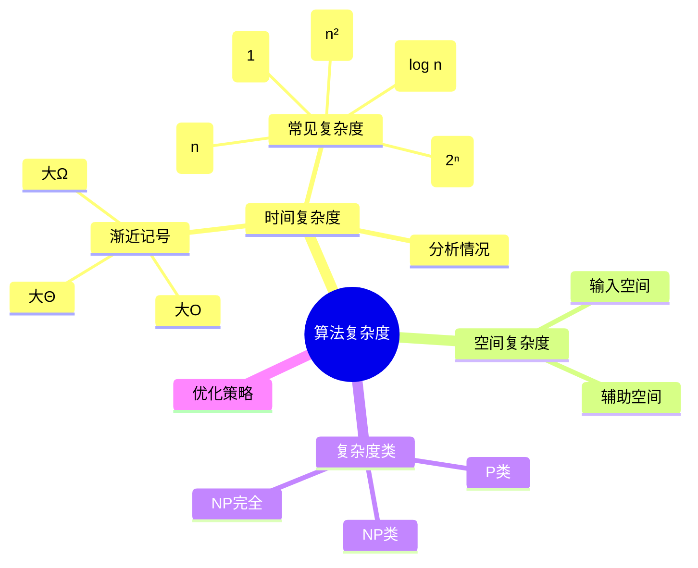
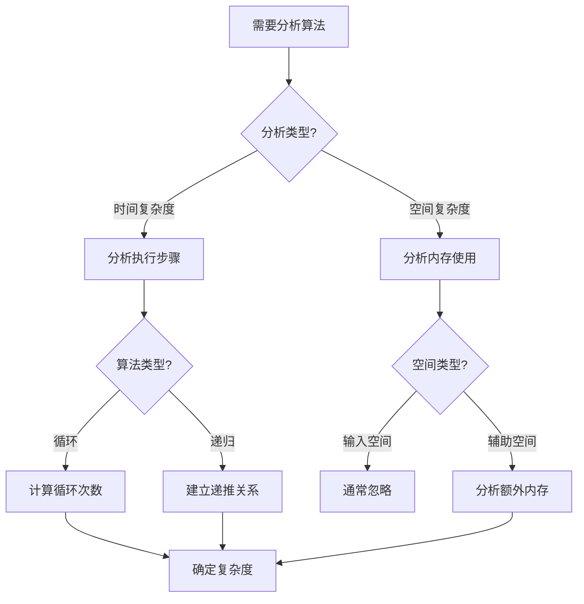
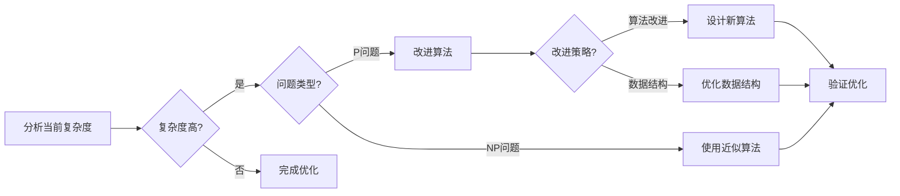
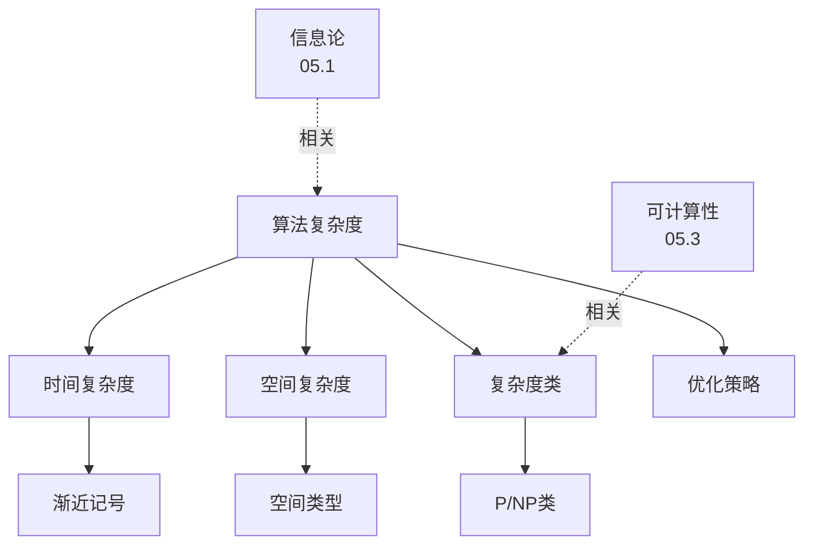
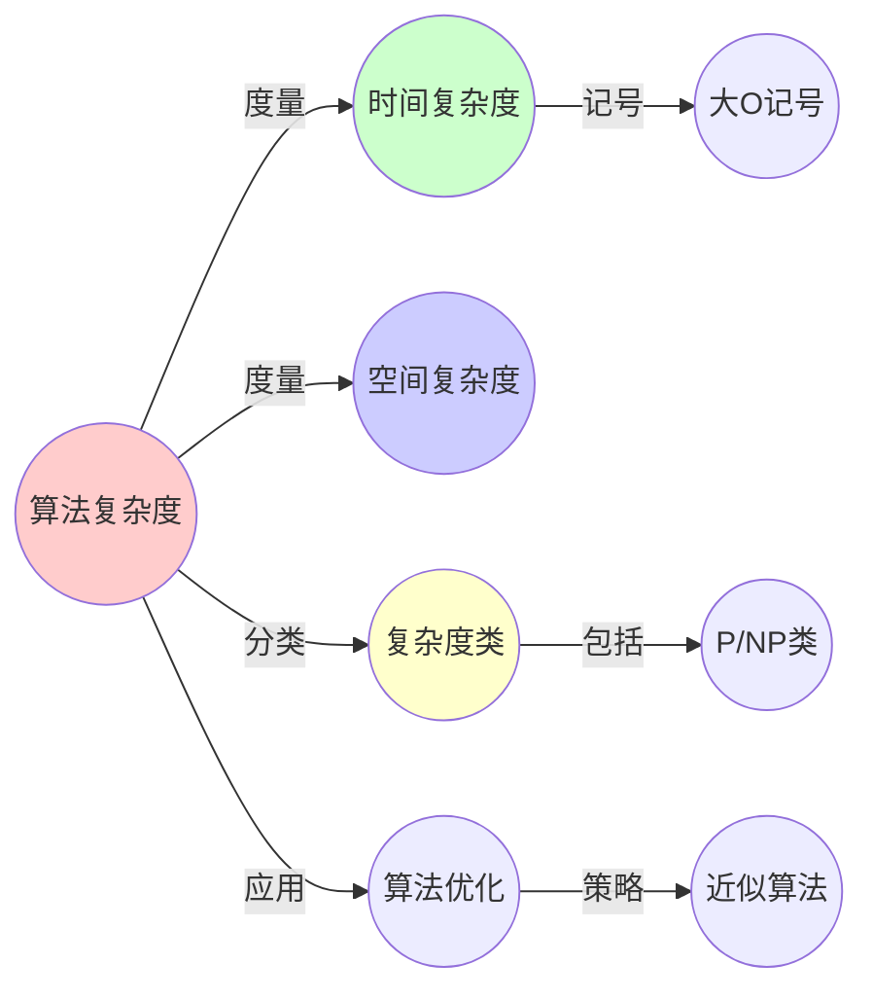
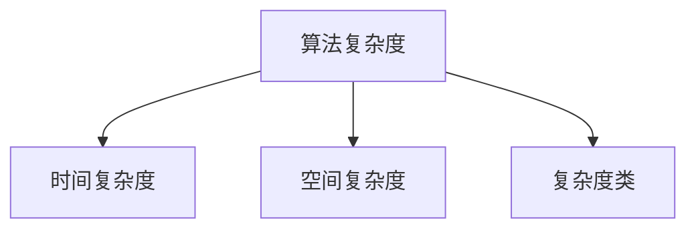

# 05.2 算法复杂度

> **来源**: view02.md
> **创建日期**: 2025-01-27
> **最后更新**: 2025-01-27

## 📋 目录

- [05.2 算法复杂度](#052-算法复杂度)
  - [📋 目录](#-目录)
  - [📋 内容概览](#-内容概览)
  - [🎯 核心理念](#-核心理念)
  - [⏱️ 时间复杂度](#️-时间复杂度)
    - [定义](#定义)
    - [渐近记号](#渐近记号)
      - [大O记号（Big-O）](#大o记号big-o)
      - [大Ω记号（Big-Omega）](#大ω记号big-omega)
      - [大Θ记号（Big-Theta）](#大θ记号big-theta)
    - [常见复杂度类](#常见复杂度类)
  - [💾 空间复杂度](#-空间复杂度)
    - [定义](#定义-1)
    - [类型](#类型)
      - [输入空间](#输入空间)
      - [辅助空间](#辅助空间)
    - [常见空间复杂度](#常见空间复杂度)
  - [🔍 复杂度分析](#-复杂度分析)
    - [最坏情况](#最坏情况)
    - [平均情况](#平均情况)
    - [最好情况](#最好情况)
  - [📊 复杂度类](#-复杂度类)
    - [P类](#p类)
    - [NP类](#np类)
    - [NP完全（NP-Complete）](#np完全np-complete)
    - [NP难（NP-Hard）](#np难np-hard)
  - [🎯 复杂度优化](#-复杂度优化)
    - [策略](#策略)
    - [权衡](#权衡)
  - [📊 详细案例研究](#-详细案例研究)
    - [案例研究 1：快速排序算法的时间复杂度分析](#案例研究-1快速排序算法的时间复杂度分析)
    - [案例研究 2：动态规划降低复杂度](#案例研究-2动态规划降低复杂度)
    - [案例研究 3：NP完全问题的近似算法](#案例研究-3np完全问题的近似算法)
  - [⚠️ 批判性分析与局限性](#️-批判性分析与局限性)
    - [局限性讨论](#局限性讨论)
      - [1. 渐近分析的局限性](#1-渐近分析的局限性)
      - [2. 输入分布假设](#2-输入分布假设)
      - [3. 并行计算的复杂性](#3-并行计算的复杂性)
    - [改进方向](#改进方向)
      - [1. 实际复杂度分析](#1-实际复杂度分析)
      - [2. 概率复杂度分析](#2-概率复杂度分析)
  - [📊 思维表征体系](#-思维表征体系)
    - [📊 1. 思维导图（增强版）](#-1-思维导图增强版)
      - [1.1 文本格式（基础版）](#11-文本格式基础版)
      - [1.2 Mermaid格式（可视化版）](#12-mermaid格式可视化版)
    - [📊 2. 多维对比矩阵](#-2-多维对比矩阵)
      - [2.1 时间复杂度对比矩阵](#21-时间复杂度对比矩阵)
      - [2.2 复杂度类对比矩阵](#22-复杂度类对比矩阵)
      - [2.3 空间复杂度对比矩阵](#23-空间复杂度对比矩阵)
    - [🌲 3. 决策树](#-3-决策树)
      - [3.1 算法复杂度分析决策树](#31-算法复杂度分析决策树)
    - [🛤️ 4. 决策逻辑路径](#️-4-决策逻辑路径)
      - [4.1 复杂度优化路径](#41-复杂度优化路径)
    - [🕸️ 5. 概念关系网络](#️-5-概念关系网络)
      - [5.1 算法复杂度概念关系网络](#51-算法复杂度概念关系网络)
    - [🗺️ 6. 知识图谱](#️-6-知识图谱)
      - [6.1 算法复杂度知识图谱](#61-算法复杂度知识图谱)
  - [📚 理论体系](#-理论体系)
    - [理论基础](#理论基础)
      - [数学/计算机科学基础](#数学计算机科学基础)
      - [历史发展](#历史发展)
    - [理论框架](#理论框架)
      - [核心假设](#核心假设)
      - [基本概念体系](#基本概念体系)
      - [主要定理/结论](#主要定理结论)
      - [适用范围和边界](#适用范围和边界)
    - [当前知识共识](#当前知识共识)
      - [学术界共识](#学术界共识)
      - [主要争议点](#主要争议点)
      - [权威来源](#权威来源)
    - [与其他理论的关系](#与其他理论的关系)
      - [逻辑关系](#逻辑关系)
      - [映射关系](#映射关系)
  - [🔗 关联网络](#-关联网络)
    - [🔗 概念级关联](#-概念级关联)
      - [核心概念映射](#核心概念映射)
    - [🔗 理论级关联](#-理论级关联)
      - [理论基础](#理论基础-1)
    - [🔗 方法级关联](#-方法级关联)
      - [方法应用网络](#方法应用网络)
    - [🔗 应用场景关联](#-应用场景关联)
  - [🛤️ 学习路径](#️-学习路径)
    - [前置知识](#前置知识)
    - [后续学习](#后续学习)
    - [并行学习](#并行学习)
  - [🔗 相关文档](#-相关文档)
  - [📖 扩展阅读](#-扩展阅读)

---

## 📋 内容概览

本文档阐述算法复杂度的基本概念，包括时间复杂度、空间复杂度及其分析方法。算法复杂度理论为算法设计、性能分析和问题分类提供了数学基础，是计算机科学的核心理论之一。

---

## 🎯 核心理念

算法复杂度理论通过渐近分析研究算法的性能特征。时间复杂度衡量算法执行时间随输入规模的增长，空间复杂度衡量内存使用。通过复杂度分类（P、NP等），我们可以理解问题的计算难度和算法的效率界限。

## ⏱️ 时间复杂度

### 定义

**时间复杂度**：算法执行时间随输入规模增长的趋势

### 渐近记号

#### 大O记号（Big-O）

**定义**：$T(n) = O(f(n))$ 如果存在常数 $c > 0$ 和 $n_0 > 0$，使得对所有 $n \geq n_0$，$T(n) \leq c \cdot f(n)$

**直观**：上界

#### 大Ω记号（Big-Omega）

**定义**：$T(n) = \Omega(f(n))$ 如果存在常数 $c > 0$ 和 $n_0 > 0$，使得对所有 $n \geq n_0$，$T(n) \geq c \cdot f(n)$

**直观**：下界

#### 大Θ记号（Big-Theta）

**定义**：$T(n) = \Theta(f(n))$ 如果 $T(n) = O(f(n))$ 且 $T(n) = \Omega(f(n))$

**直观**：紧界

### 常见复杂度类

| 复杂度 | 名称 | 示例算法 |
|--------|------|----------|
| **O(1)** | 常数时间 | 数组访问 |
| **O(log n)** | 对数时间 | 二分查找 |
| **O(n)** | 线性时间 | 线性查找 |
| **O(n log n)** | 线性对数时间 | 归并排序 |
| **O(n²)** | 平方时间 | 冒泡排序 |
| **O(n³)** | 立方时间 | 矩阵乘法（朴素） |
| **O(2ⁿ)** | 指数时间 | 穷举搜索 |
| **O(n!)** | 阶乘时间 | 旅行商问题（穷举） |

## 💾 空间复杂度

### 定义

**空间复杂度**：算法所需内存空间随输入规模增长的趋势

### 类型

#### 输入空间

**定义**：存储输入数据所需的空间

**通常**：不计算在空间复杂度中

#### 辅助空间

**定义**：算法执行过程中额外使用的空间

**通常**：这是空间复杂度的主要关注点

### 常见空间复杂度

| 复杂度 | 名称 | 示例算法 |
|--------|------|----------|
| **O(1)** | 常数空间 | 原地排序 |
| **O(log n)** | 对数空间 | 递归深度 |
| **O(n)** | 线性空间 | 数组复制 |
| **O(n²)** | 平方空间 | 二维数组 |

## 🔍 复杂度分析

### 最坏情况

**定义**：输入使算法执行时间最长的情况

**优点**：保证上界

**缺点**：可能过于悲观

### 平均情况

**定义**：所有可能输入的平均执行时间

**优点**：更接近实际

**缺点**：需要输入分布假设

### 最好情况

**定义**：输入使算法执行时间最短的情况

**优点**：了解下界

**缺点**：可能过于乐观

## 📊 复杂度类

### P类

**定义**：在多项式时间内可解决的问题

**示例**：

- 排序
- 搜索
- 最短路径（非负权重）

### NP类

**定义**：在多项式时间内可验证解的问题

**示例**：

- 旅行商问题
- 背包问题
- 图着色问题

### NP完全（NP-Complete）

**定义**：NP类中最难的问题

**特征**：

- 属于NP类
- 所有NP问题可归约到它

**示例**：

- 布尔可满足性问题（SAT）
- 旅行商问题
- 图着色问题

### NP难（NP-Hard）

**定义**：至少和NP完全问题一样难的问题

**特征**：不一定属于NP类

**示例**：

- 停机问题
- 优化版本的NP完全问题

## 🎯 复杂度优化

### 策略

1. **算法改进**：选择更高效的算法
2. **数据结构优化**：使用合适的数据结构
3. **并行化**：利用多核处理器
4. **近似算法**：接受近似解
5. **启发式算法**：使用经验规则

### 权衡

**时间 vs 空间**：

- 时间换空间：缓存、预计算
- 空间换时间：查找表、索引

**精确 vs 近似**：

- 精确算法：保证最优解
- 近似算法：快速得到近似解

## 📊 详细案例研究

### 案例研究 1：快速排序算法的时间复杂度分析

**背景**：快速排序是最常用的排序算法之一，展示复杂度分析在实际算法中的应用。

**形式化分析**：

```text
快速排序算法:
- 策略: 分治法
- 步骤:
  1. 选择基准元素
  2. 分区: 小于基准和大于基准
  3. 递归排序两部分

复杂度分析:
- 最好情况: O(n log n) (平衡划分)
- 平均情况: O(n log n) (随机划分)
- 最坏情况: O(n²) (不平衡划分)

空间复杂度:
- 递归栈: O(log n) (平均)
- 最坏: O(n) (不平衡)

优化策略:
- 随机化基准选择
- 三路快排
- 混合算法(小数组用插入排序)

应用效果:
- 实际性能优秀
- 广泛使用
- 标准库实现
```

**关键发现**：

- ✅ 平均复杂度优于最坏复杂度
- ✅ 随机化策略改善性能
- ✅ 实际性能通常接近平均情况

**应用价值**：

- ✅ 算法设计
- ✅ 性能优化
- ✅ 实际应用

### 案例研究 2：动态规划降低复杂度

**背景**：使用动态规划将指数复杂度问题降低到多项式复杂度。

**形式化分析**：

```text
背包问题:
- 问题: 给定物品和价值，选择最优组合
- 暴力法: O(2ⁿ) (指数复杂度)
- 动态规划: O(nW) (伪多项式)

动态规划:
- 状态: dp[i][w] = 前i个物品，容量w的最大价值
- 转移: dp[i][w] = max(dp[i-1][w], dp[i-1][w-w_i] + v_i)
- 复杂度: O(nW)

空间优化:
- 滚动数组: O(W)
- 进一步优化: O(min(W, Σw_i))

应用效果:
- 复杂度大幅降低
- 可处理更大规模问题
- 广泛应用
```

**关键发现**：

- ✅ 动态规划通过重叠子问题降低复杂度
- ✅ 状态转移方程是关键
- ✅ 空间优化进一步改善性能

**应用价值**：

- ✅ 算法优化
- ✅ 问题求解
- ✅ 实际应用

### 案例研究 3：NP完全问题的近似算法

**背景**：对于NP完全问题，使用近似算法在合理时间内得到近似解。

**形式化分析**：

```text
旅行商问题(TSP):
- 精确解: O(n!) (不可行)
- 近似算法: O(n² log n)

最近邻算法:
- 复杂度: O(n²)
- 近似比: ≤ 2 (欧氏距离)
- 性能: 快速但质量一般

Christofides算法:
- 复杂度: O(n³)
- 近似比: ≤ 1.5
- 性能: 质量好但较慢

实际应用:
- 物流优化
- 电路设计
- 基因组测序

权衡:
- 时间 vs 质量
- 不同场景选择不同算法
```

**关键发现**：

- ✅ 近似算法提供可行解
- ✅ 近似比衡量解的质量
- ✅ 实际应用需要权衡

**应用价值**：

- ✅ NP完全问题求解
- ✅ 实际应用
- ✅ 算法设计

## ⚠️ 批判性分析与局限性

### 局限性讨论

#### 1. 渐近分析的局限性

**问题**：渐近分析可能忽略实际因素。

**挑战**：

- ⚠️ 常数因子忽略
- ⚠️ 小规模问题差异
- ⚠️ 实际硬件影响

**应对策略**：

- ✅ 结合实际测试
- ✅ 考虑常数因子
- ✅ 分析不同规模

#### 2. 输入分布假设

**问题**：复杂度分析通常假设均匀输入。

**挑战**：

- ⚠️ 实际输入非均匀
- ⚠️ 最坏情况可能不出现
- ⚠️ 平均情况难以定义

**改进方向**：

- ✅ 考虑输入分布
- ✅ 使用概率分析
- ✅ 实际数据验证

#### 3. 并行计算的复杂性

**问题**：传统复杂度分析主要考虑串行计算。

**挑战**：

- ⚠️ 并行复杂度复杂
- ⚠️ 通信开销
- ⚠️ 同步成本

**改进方向**：

- ✅ 并行复杂度模型
- ✅ 考虑通信成本
- ✅ 分布式算法分析

### 改进方向

#### 1. 实际复杂度分析

**目标**：更准确地预测实际性能。

**方法**：

- 考虑常数因子
- 实际测试
- 多因素分析

#### 2. 概率复杂度分析

**目标**：考虑输入分布的影响。

**方法**：

- 概率分析
- 输入模型
- 期望复杂度

## 📊 思维表征体系

### 📊 1. 思维导图（增强版）

#### 1.1 文本格式（基础版）

```text
算法复杂度
├── 时间复杂度
│   ├── 渐近记号
│   │   ├── 大O (上界)
│   │   ├── 大Ω (下界)
│   │   └── 大Θ (紧界)
│   ├── 常见复杂度类
│   │   ├── O(1), O(log n), O(n)
│   │   ├── O(n log n), O(n²), O(n³)
│   │   └── O(2ⁿ), O(n!)
│   └── 分析情况
│       ├── 最坏情况
│       ├── 平均情况
│       └── 最好情况
├── 空间复杂度
│   ├── 输入空间
│   ├── 辅助空间
│   └── 常见复杂度
├── 复杂度类
│   ├── P类 (多项式时间)
│   ├── NP类 (可验证)
│   ├── NP完全
│   └── NP难
└── 优化策略
    ├── 算法改进
    ├── 数据结构优化
    ├── 并行化
    └── 近似算法
```

#### 1.2 Mermaid格式（可视化版）



### 📊 2. 多维对比矩阵

#### 2.1 时间复杂度对比矩阵

| 复杂度 | O(1) | O(log n) | O(n) | O(n log n) | O(n²) | O(2ⁿ) | O(n!) | 推荐场景 |
|--------|------|----------|------|-----------|-------|-------|-------|---------|
| **增长率** | 常数 | 很慢 | 慢 | 中 | 快 | 很快 | 极快 | 增长率不同 |
| **可扩展性** | 完美 | 很好 | 好 | 中 | 差 | 很差 | 不可行 | 可扩展性不同 |
| **典型算法** | 数组访问 | 二分查找 | 线性查找 | 归并排序 | 冒泡排序 | 穷举 | 全排列 | 算法不同 |
| **实际应用** | 所有 | 大量 | 大量 | 大量 | 有限 | 很少 | 几乎不用 | 应用范围不同 |
| **优化价值** | 低 | 低 | 中 | 中 | 高 | 很高 | 极高 | 优化价值不同 |

#### 2.2 复杂度类对比矩阵

| 维度 | P类 | NP类 | NP完全 | NP难 | 关系 |
|------|-----|------|--------|------|------|
| **定义** | 多项式可解 | 多项式可验证 | NP中最难 | 至少和NP一样难 | 定义不同 |
| **包含关系** | P ⊆ NP | NP包含P | NPC ⊆ NP | NP-hard ⊇ NP | 关系不同 |
| **实际难度** | 易 | 中-难 | 很难 | 很难 | 难度不同 |
| **解决方法** | 精确算法 | 精确/近似 | 近似/启发式 | 近似/启发式 | 方法不同 |
| **应用** | 广泛 | 广泛 | 有限 | 有限 | 应用不同 |

#### 2.3 空间复杂度对比矩阵

| 复杂度 | O(1) | O(log n) | O(n) | O(n log n) | O(n²) | 内存需求 |
|--------|------|----------|------|-----------|-------|---------|
| **增长率** | 常数 | 很慢 | 慢 | 中 | 快 | 增长率不同 |
| **典型场景** | 原地算法 | 递归深度 | 数组/列表 | 排序辅助 | 矩阵 | 场景不同 |
| **优化难度** | 低 | 中 | 中 | 中 | 高 | 优化难度不同 |
| **权衡** | 无 | 时间换空间 | 平衡 | 时间换空间 | 避免 | 权衡不同 |

### 🌲 3. 决策树

#### 3.1 算法复杂度分析决策树



### 🛤️ 4. 决策逻辑路径

#### 4.1 复杂度优化路径



### 🕸️ 5. 概念关系网络

#### 5.1 算法复杂度概念关系网络



### 🗺️ 6. 知识图谱

#### 6.1 算法复杂度知识图谱



## 📚 理论体系

### 理论基础

#### 数学/计算机科学基础

算法复杂度的理论基础：

**1. 数学基础**：

- 数学分析
- 渐近分析
- 组合数学
- 图论

**2. 计算机科学基础**：

- 算法设计
- 数据结构
- 计算模型
- 复杂性理论

**3. 概率论基础**：

- 概率分析
- 随机算法
- 期望复杂度

#### 历史发展

**关键时间节点**：

- **1960年代**：算法复杂度理论建立
  - 大O记号引入
  - 渐近分析
  - 复杂度分类

- **1970年代**：P和NP类定义
  - Cook定理
  - NP完全理论
  - P vs NP问题

- **1980-1990年代**：复杂度理论发展
  - 概率复杂度
  - 并行复杂度
  - 近似算法理论

- **2000年代至今**：现代发展
  - 实际复杂度分析
  - 参数化复杂度
  - 平均复杂度

### 理论框架

#### 核心假设

**假设1：渐近分析**

- **内容**：关注大规模输入的行为
- **适用范围**：大规模问题
- **限制条件**：小规模可能不适用

**假设2：机器模型**

- **内容**：假设标准计算模型
- **适用范围**：传统计算模型
- **限制条件**：并行/量子模型不同

**假设3：输入分布**

- **内容**：通常假设均匀分布或最坏情况
- **适用范围**：理论分析
- **限制条件**：实际输入可能不同

#### 基本概念体系



#### 主要定理/结论

**定理1：时间复杂度上界**

- **内容**：大O记号提供上界
- **证据**：数学定义
- **应用**：算法分析

**定理2：P vs NP问题**

- **内容**：P是否等于NP是未解决问题
- **证据**：计算复杂性理论
- **应用**：问题分类

**结论3：NP完全问题的难度**

- **内容**：NP完全问题是最难的NP问题
- **证据**：归约理论
- **应用**：问题难度判断

#### 适用范围和边界

**适用范围**：

- 算法性能分析
- 问题难度分类
- 算法设计指导

**边界条件**：

- 需要明确的输入模型
- 需要标准计算模型
- 需要渐近假设

**不适用场景**：

- 固定规模问题
- 非标准计算模型
- 实际硬件约束重要时

### 当前知识共识

#### 学术界共识

**广泛接受的共识**：

1. **复杂度分析的重要性**
   - **共识**：复杂度分析是算法设计的核心
   - **支持证据**：广泛的应用
   - **来源**：计算机科学

2. **P vs NP的开放性**
   - **共识**：P vs NP是重要未解决问题
   - **支持证据**：大量研究
   - **来源**：计算复杂性理论

3. **渐近分析的价值**
   - **共识**：渐近分析提供了有用的指导
   - **支持证据**：实践验证
   - **来源**：算法分析

#### 主要争议点

1. **实际相关性**
   - **观点A**：渐近分析非常有用
   - **观点B**：实际中常数因子更重要
   - **当前状态**：多数认为两者都重要

2. **并行复杂度**
   - **观点A**：需要新的复杂度模型
   - **观点B**：传统模型仍适用
   - **当前状态**：多数认为需要扩展模型

#### 权威来源

**经典文献**：

- 《Introduction to Algorithms》- CLRS
- 《Computational Complexity》- Arora & Barak
- 《The Art of Computer Programming》- Knuth

**权威机构/专家**：

- **ACM**
- **IEEE**
- **计算复杂性理论研究会**

**最新发展**：

- **2020-2024**：参数化复杂度、平均复杂度、实际复杂度分析
- **前沿方向**：量子复杂度、近似复杂度、细粒度复杂度

### 与其他理论的关系

#### 逻辑关系

**理论基础**：

- **信息论基础**（[05.1_信息论基础.md](05.1_信息论基础.md)） → 算法复杂度
  - 关系类型：相关理论
  - 关键映射：信息量 → 复杂度

**理论应用**：

- **可计算性理论**（[05.3_可计算性理论.md](05.3_可计算性理论.md)） → 算法复杂度
  - 关系类型：理论基础
  - 关键映射：可计算性 → 复杂度

#### 映射关系

| 本理论概念 | 映射理论 | 映射概念 | 映射类型 | 映射说明 |
|-----------|---------|---------|---------|----------|
| **时间复杂度** | 05.1_信息论基础 | 信息量 | 相关 | 时间与信息相关 |
| **复杂度类** | 05.3_可计算性理论 | 可计算性 | 对应 | 复杂度对应可计算性 |
| **NP完全** | 05.3_可计算性理论 | 不可判定性 | 相关 | NP完全与不可判定相关 |
| **算法优化** | 05.4_信息动力学 | 信息处理 | 应用 | 优化用于信息处理 |

## 🔗 关联网络

### 🔗 概念级关联

#### 核心概念映射

| 本文档概念 | 关联文档 | 关联概念 | 关系类型 | 映射说明 |
|-----------|---------|---------|---------|----------|
| **时间复杂度** | 05.1_信息论基础 | 信息量 | 相关 | 时间与信息相关 |
| **复杂度类** | 05.3_可计算性理论 | 可计算性 | 对应 | 复杂度对应可计算性 |
| **NP完全** | 05.3_可计算性理论 | 不可判定性 | 相关 | NP完全与不可判定相关 |
| **算法优化** | 05.4_信息动力学 | 信息处理 | 应用 | 优化用于信息处理 |
| **P类** | 05.3_可计算性理论 | 可计算函数 | 对应 | P类对应可计算函数 |
| **空间复杂度** | 05.5_计算与物理 | 物理限制 | 相关 | 空间复杂度与物理限制相关 |
| **渐近分析** | 05.1_信息论基础 | 信息理论 | 相关 | 渐近分析用于信息理论 |

### 🔗 理论级关联

#### 理论基础

- **本理论基于**：
  - [05.1_信息论基础.md](05.1_信息论基础.md) ⭐⭐ - 信息论基础
  - 数学分析 ⭐⭐⭐ - 数学基础

- **本理论应用于**：
  - [05.3_可计算性理论.md](05.3_可计算性理论.md) ⭐⭐⭐ - 可计算性理论
  - [05.4_信息动力学.md](05.4_信息动力学.md) ⭐⭐ - 信息动力学
  - [05.5_计算与物理.md](05.5_计算与物理.md) ⭐⭐ - 计算与物理

### 🔗 方法级关联

#### 方法应用网络

| 本文档方法 | 应用文档 | 应用场景 | 应用效果 |
|-----------|---------|---------|---------|
| **复杂度分析** | 05.4_信息动力学 | 算法分析 | 成功 |
| **优化策略** | 05.4_信息动力学 | 算法优化 | 成功 |
| **近似算法** | 05.3_可计算性理论 | NP问题求解 | 成功 |

### 🔗 应用场景关联

**场景**：算法设计

| 视角 | 关联文档 | 核心理论 | 关注点 |
|------|---------|---------|--------|
| **性能分析** | 本文档 | 复杂度分析 | 时间复杂度 |
| **可计算性** | 05.3_可计算性理论 | 可计算性 | 问题可解性 |
| **信息处理** | 05.4_信息动力学 | 信息动力学 | 信息处理效率 |

## 🛤️ 学习路径

### 前置知识

**必须先学习**：

- 基础数学 ⭐⭐⭐
- 基础算法 ⭐⭐

**建议先了解**：

- 离散数学
- 数据结构
- 编程基础

### 后续学习

**建议接下来学习**（按顺序）：

1. [05.3_可计算性理论.md](05.3_可计算性理论.md) ⭐⭐⭐ - 可计算性理论
2. [05.4_信息动力学.md](05.4_信息动力学.md) ⭐⭐ - 信息动力学
3. [05.5_计算与物理.md](05.5_计算与物理.md) ⭐⭐ - 计算与物理

### 并行学习

**可以同时学习**：

- [05.1_信息论基础.md](05.1_信息论基础.md) - 信息论基础
- [04_复杂系统与网络理论](../04_复杂系统与网络理论/) - 复杂系统

## 🔗 相关文档

- [05.1_信息论基础.md](05.1_信息论基础.md)
- [05.3_可计算性理论.md](05.3_可计算性理论.md)
- [05.4_信息动力学.md](05.4_信息动力学.md)
- [05.5_计算与物理.md](05.5_计算与物理.md)

## 📖 扩展阅读

- 《Introduction to Algorithms》- CLRS
- 《Algorithm Design》- Kleinberg & Tardos
- Wikipedia: [Computational Complexity](https://en.wikipedia.org/wiki/Computational_complexity_theory)
- Wikipedia: [Big O Notation](https://en.wikipedia.org/wiki/Big_O_notation)
