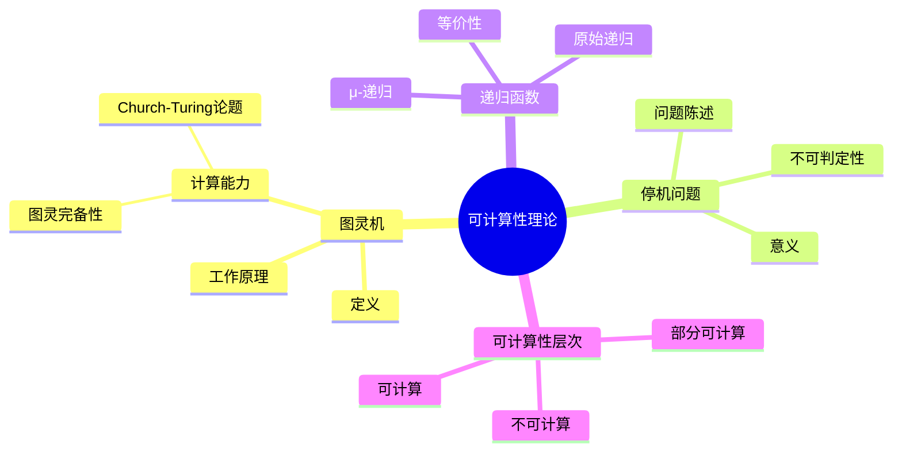
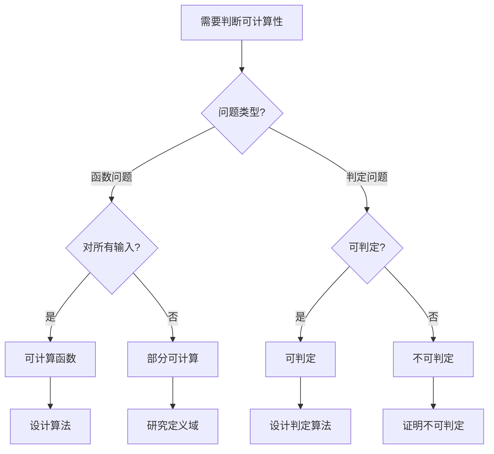
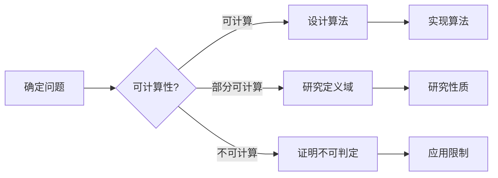
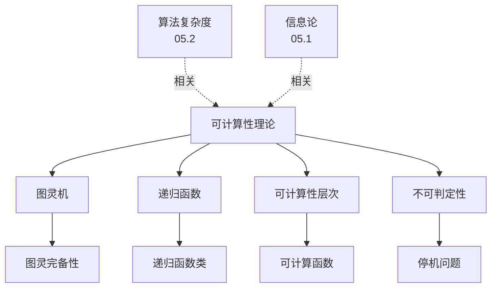
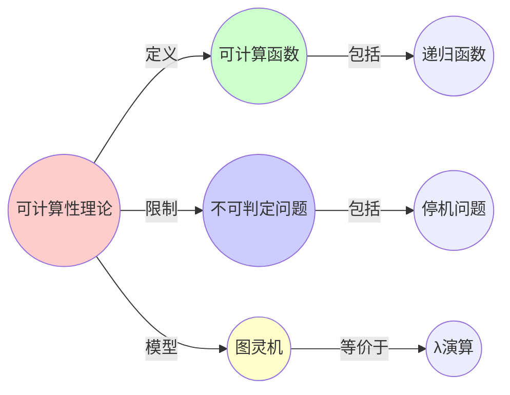
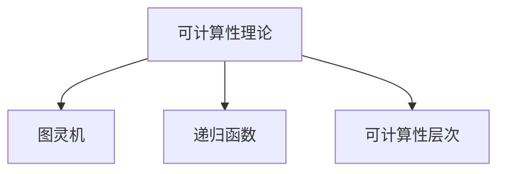

# 05.3 可计算性理论

> **来源**: view02.md
> **创建日期**: 2025-01-27
> **最后更新**: 2025-01-27

## 📋 目录

- [05.3 可计算性理论](#053-可计算性理论)
  - [📋 目录](#-目录)
  - [📋 内容概览](#-内容概览)
  - [🎯 核心理念](#-核心理念)
  - [💻 图灵机（Turing Machine）](#-图灵机turing-machine)
    - [定义](#定义)
    - [工作原理](#工作原理)
    - [计算能力](#计算能力)
  - [⏹️ 停机问题（Halting Problem）](#️-停机问题halting-problem)
    - [问题陈述](#问题陈述)
    - [不可判定性](#不可判定性)
    - [意义](#意义)
  - [🔄 递归函数](#-递归函数)
    - [原始递归函数](#原始递归函数)
      - [基础函数](#基础函数)
      - [构造规则](#构造规则)
    - [μ-递归函数](#μ-递归函数)
    - [等价性](#等价性)
  - [📊 可计算性层次](#-可计算性层次)
    - [可计算函数](#可计算函数)
    - [部分可计算函数](#部分可计算函数)
    - [不可计算函数](#不可计算函数)
  - [🎯 复杂度与可计算性](#-复杂度与可计算性)
    - [关系](#关系)
    - [不可计算但可近似](#不可计算但可近似)
  - [📊 详细案例研究](#-详细案例研究)
    - [案例研究 1：停机问题在程序验证中的应用](#案例研究-1停机问题在程序验证中的应用)
    - [案例研究 2：图灵机作为计算模型的基础](#案例研究-2图灵机作为计算模型的基础)
    - [案例研究 3：递归函数在函数式编程中的应用](#案例研究-3递归函数在函数式编程中的应用)
  - [⚠️ 批判性分析与局限性](#️-批判性分析与局限性)
    - [局限性讨论](#局限性讨论)
      - [1. Church-Turing论题的哲学问题](#1-church-turing论题的哲学问题)
      - [2. 不可判定性在实际中的影响](#2-不可判定性在实际中的影响)
      - [3. 计算模型的多样性](#3-计算模型的多样性)
    - [改进方向](#改进方向)
      - [1. 扩展计算模型](#1-扩展计算模型)
      - [2. 实际应用研究](#2-实际应用研究)
  - [📊 思维表征体系](#-思维表征体系)
    - [📊 1. 思维导图（增强版）](#-1-思维导图增强版)
      - [1.1 文本格式（基础版）](#11-文本格式基础版)
      - [1.2 Mermaid格式（可视化版）](#12-mermaid格式可视化版)
    - [📊 2. 多维对比矩阵](#-2-多维对比矩阵)
      - [2.1 计算模型对比矩阵](#21-计算模型对比矩阵)
      - [2.2 可计算性问题对比矩阵](#22-可计算性问题对比矩阵)
      - [2.3 Church-Turing论题形式对比矩阵](#23-church-turing论题形式对比矩阵)
    - [🌲 3. 决策树](#-3-决策树)
      - [3.1 可计算性问题分析决策树](#31-可计算性问题分析决策树)
    - [🛤️ 4. 决策逻辑路径](#️-4-决策逻辑路径)
      - [4.1 可计算性问题分析路径](#41-可计算性问题分析路径)
    - [🕸️ 5. 概念关系网络](#️-5-概念关系网络)
      - [5.1 可计算性理论概念关系网络](#51-可计算性理论概念关系网络)
    - [🗺️ 6. 知识图谱](#️-6-知识图谱)
      - [6.1 可计算性理论知识图谱](#61-可计算性理论知识图谱)
  - [📚 理论体系](#-理论体系)
    - [理论基础](#理论基础)
      - [数学/逻辑基础](#数学逻辑基础)
      - [历史发展](#历史发展)
    - [理论框架](#理论框架)
      - [核心假设](#核心假设)
      - [基本概念体系](#基本概念体系)
      - [主要定理/结论](#主要定理结论)
      - [适用范围和边界](#适用范围和边界)
    - [当前知识共识](#当前知识共识)
      - [学术界共识](#学术界共识)
      - [主要争议点](#主要争议点)
      - [权威来源](#权威来源)
    - [与其他理论的关系](#与其他理论的关系)
      - [逻辑关系](#逻辑关系)
      - [映射关系](#映射关系)
  - [🔗 关联网络](#-关联网络)
    - [🔗 概念级关联](#-概念级关联)
      - [核心概念映射](#核心概念映射)
    - [🔗 理论级关联](#-理论级关联)
      - [理论基础](#理论基础-1)
    - [🔗 方法级关联](#-方法级关联)
      - [方法应用网络](#方法应用网络)
    - [🔗 应用场景关联](#-应用场景关联)
  - [🛤️ 学习路径](#️-学习路径)
    - [前置知识](#前置知识)
    - [后续学习](#后续学习)
    - [并行学习](#并行学习)
  - [🔗 相关文档](#-相关文档)
  - [📖 扩展阅读](#-扩展阅读)

---

## 📋 内容概览

本文档阐述可计算性理论的基本概念，包括图灵机、停机问题、递归函数等。可计算性理论研究什么问题可以通过算法解决，什么问题无法通过算法解决，揭示了计算的本质限制。

---

## 🎯 核心理念

可计算性理论的核心是Church-Turing论题：所有可计算函数都是图灵可计算的。这为计算提供了统一的理论基础。停机问题的不可判定性揭示了计算的本质限制，说明存在不可计算的问题。

## 💻 图灵机（Turing Machine）

### 定义

**图灵机** M = (Q, Σ, Γ, δ, q₀, q_accept, q_reject)：

- **Q**：状态集合
- **Σ**：输入字母表
- **Γ**：带字母表（Σ ⊆ Γ）
- **δ**：转移函数 δ: Q × Γ → Q × Γ × {L, R}
- **q₀**：初始状态
- **q_accept**：接受状态
- **q_reject**：拒绝状态

### 工作原理

1. **带**：无限长的带，每个格子包含一个符号
2. **读写头**：可以读写当前格子的符号
3. **状态**：当前状态决定下一步动作
4. **转移**：根据当前状态和符号，转移到新状态、写入新符号、移动读写头

### 计算能力

**图灵完备性**：能够计算所有可计算函数

**Church-Turing论题**：所有可计算函数都是图灵可计算的

## ⏹️ 停机问题（Halting Problem）

### 问题陈述

**停机问题**：是否存在算法判断任意程序在给定输入下是否停机？

### 不可判定性

**定理**：停机问题是不可判定的。

**证明**（反证法）：

假设存在算法 H(P, x) 判断程序P在输入x下是否停机。

构造程序 D：

```text
D(P):
    if H(P, P) == "停机":
        while True: pass  // 无限循环
    else:
        return  // 停机
```

考虑 D(D)：

- 如果 H(D, D) == "停机"，则 D(D) 无限循环，矛盾
- 如果 H(D, D) == "不停机"，则 D(D) 停机，矛盾

因此，H不存在。

### 意义

**计算的根本限制**：存在不可计算的问题

**影响**：

- 算法设计：某些问题无法用算法解决
- 程序验证：无法自动验证所有程序
- 人工智能：存在算法不可判定的问题

## 🔄 递归函数

### 原始递归函数

#### 基础函数

1. **零函数**：Z(n) = 0
2. **后继函数**：S(n) = n + 1
3. **投影函数**：Pᵢⁿ(x₁, ..., xₙ) = xᵢ

#### 构造规则

1. **复合**：从函数 f, g₁, ..., gₖ 构造 h(x) = f(g₁(x), ..., gₖ(x))
2. **原始递归**：从函数 g, h 构造 f：

   ```latex
   f(0, x) = g(x)
   f(n+1, x) = h(n, f(n, x), x)
   ```

### μ-递归函数

**最小化算子**：从函数 g 构造 f：

```latex
f(x) = \mu y[g(x, y) = 0]
```

（最小的y使得g(x, y) = 0）

### 等价性

**定理**：以下计算模型等价：

- 图灵机
- μ-递归函数
- λ演算
- 寄存器机

## 📊 可计算性层次

### 可计算函数

**定义**：存在算法计算的函数

**特征**：

- 有算法
- 可编程实现
- 图灵可计算

### 部分可计算函数

**定义**：在某些输入上可计算，在某些输入上未定义

**特征**：

- 可能不终止
- 停机问题相关

### 不可计算函数

**定义**：不存在算法计算的函数

**实例**：

- 停机问题
- Busy Beaver函数
- Kolmogorov复杂度

## 🎯 复杂度与可计算性

### 关系

**可计算性**：问题是否可解

**复杂度**：问题求解的效率

**关系**：

- 可计算性：存在性
- 复杂度：效率性

### 不可计算但可近似

**实例**：

- **停机概率**：不可计算，但可近似
- **Kolmogorov复杂度**：不可计算，但可上界估计

## 📊 详细案例研究

### 案例研究 1：停机问题在程序验证中的应用

**背景**：停机问题的不可判定性对程序验证有重要影响。

**形式化分析**：

```text
程序验证问题:
- 问题: 验证程序P在输入x下是否停机
- 不可判定性: 停机问题不可判定
- 影响: 无法完全自动化验证

实际限制:
- 静态分析: 只能检测部分问题
- 运行时验证: 只能验证已执行路径
- 形式化验证: 需要人工辅助

应对策略:
- 受限子集: 限制程序类（如终止程序）
- 近似方法: 超集近似
- 启发式方法: 实际有效的方法

应用价值:
- 理解验证限制
- 设计验证工具
- 指导软件开发
```

**关键发现**：

- ✅ 停机问题揭示了验证的根本限制
- ✅ 实际验证需要妥协
- ✅ 受限子集可以完全验证

**应用价值**：

- ✅ 程序验证工具
- ✅ 软件开发方法
- ✅ 系统可靠性

### 案例研究 2：图灵机作为计算模型的基础

**背景**：图灵机为计算提供了统一的理论基础。

**形式化分析**：

```text
图灵机的通用性:
- 图灵完备性: 能计算所有可计算函数
- Church-Turing论题: 所有可计算函数都图灵可计算
- 等价性: 与λ演算、递归函数等价

实际计算模型:
- 现代计算机: 图灵等价的
- 编程语言: 图灵完备的
- 虚拟机: 图灵等价的

计算能力:
- 可计算: 图灵机可计算
- 不可计算: 图灵机不可计算
- 计算复杂性: 在图灵机上的复杂度

应用价值:
- 理论计算基础
- 算法设计
- 计算模型理解
```

**关键发现**：

- ✅ 图灵机提供了计算的统一模型
- ✅ Church-Turing论题是计算的基础
- ✅ 所有现代计算模型都是图灵等价的

**应用价值**：

- ✅ 计算理论
- ✅ 算法分析
- ✅ 计算模型设计

### 案例研究 3：递归函数在函数式编程中的应用

**背景**：递归函数理论为函数式编程提供了理论基础。

**形式化分析**：

```text
递归函数理论:
- 原始递归: 基础递归模式
- μ-递归: 无界搜索
- 等价性: 与图灵机等价

函数式编程:
- 递归: 核心编程范式
- 模式匹配: 递归的基础
- 终止性: 递归的终止问题

类型系统:
- 结构递归: 保证终止
- 依赖类型: 证明终止
- 总函数: 总是终止的函数

实际应用:
- 函数式语言设计
- 程序正确性
- 形式化验证
```

**关键发现**：

- ✅ 递归函数提供了计算的形式化基础
- ✅ 类型系统可以保证终止性
- ✅ 函数式编程体现了递归思想

**应用价值**：

- ✅ 函数式编程语言
- ✅ 程序验证
- ✅ 形式化方法

## ⚠️ 批判性分析与局限性

### 局限性讨论

#### 1. Church-Turing论题的哲学问题

**问题**：Church-Turing论题是哲学假设，无法严格证明。

**挑战**：

- ⚠️ 无法形式化定义"算法"
- ⚠️ 新计算模型的挑战
- ⚠️ 量子计算的影响

**应对策略**：

- ✅ 接受论题的实用性
- ✅ 研究新计算模型
- ✅ 保持理论开放性

#### 2. 不可判定性在实际中的影响

**问题**：理论上的不可判定性在实践中的影响可能有限。

**挑战**：

- ⚠️ 实际问题的受限性
- ⚠️ 近似方法有效
- ⚠️ 启发式方法成功

**改进方向**：

- ✅ 研究受限子集
- ✅ 开发实用工具
- ✅ 实际应用验证

#### 3. 计算模型的多样性

**问题**：不同计算模型可能有不同的能力。

**挑战**：

- ⚠️ 量子计算模型
- ⚠️ 并行计算模型
- ⚠️ 近似计算模型

**改进方向**：

- ✅ 研究新计算模型
- ✅ 统一理论框架
- ✅ 比较分析

### 改进方向

#### 1. 扩展计算模型

**目标**：包含更多计算模型。

**方法**：

- 量子计算模型
- 并行计算模型
- 近似计算模型

#### 2. 实际应用研究

**目标**：使理论更实用。

**方法**：

- 受限问题研究
- 实用工具开发
- 实际应用验证

## 📊 思维表征体系

### 📊 1. 思维导图（增强版）

#### 1.1 文本格式（基础版）

```text
可计算性理论
├── 图灵机
│   ├── 定义
│   ├── 工作原理
│   └── 计算能力
│       ├── 图灵完备性
│       └── Church-Turing论题
├── 停机问题
│   ├── 问题陈述
│   ├── 不可判定性
│   │   └── 证明
│   └── 意义
│       ├── 计算限制
│       └── 应用影响
├── 递归函数
│   ├── 原始递归函数
│   │   ├── 基础函数
│   │   └── 构造规则
│   ├── μ-递归函数
│   │   └── 最小化算子
│   └── 等价性
├── 可计算性层次
│   ├── 可计算函数
│   ├── 部分可计算函数
│   └── 不可计算函数
└── 复杂度与可计算性
    ├── 关系
    └── 不可计算但可近似
```

#### 1.2 Mermaid格式（可视化版）



### 📊 2. 多维对比矩阵

#### 2.1 计算模型对比矩阵

| 维度 | 图灵机 | λ演算 | 递归函数 | 等价性 | 应用 |
|------|--------|-------|---------|--------|------|
| **计算能力** | 图灵完备 | 图灵完备 | 图灵完备 | 等价 | 都等价 |
| **直观性** | 中 | 高 | 中 | 不同 | 直观性不同 |
| **形式化程度** | 高 | 高 | 很高 | 都很高 | 都很形式化 |
| **应用** | 理论证明 | 函数式编程 | 数学证明 | 不同 | 应用不同 |
| **证明难度** | 中 | 中 | 中 | 相似 | 难度相似 |

#### 2.2 可计算性问题对比矩阵

| 维度 | 可计算 | 部分可计算 | 不可计算 | 关系 |
|------|--------|-----------|---------|------|
| **定义** | 对所有输入有输出 | 对某些输入有输出 | 不存在算法 | 定义不同 |
| **实例** | 加法、乘法 | 停机问题 | 停机问题判定 | 实例不同 |
| **复杂度** | 可能很高 | 可能很高 | 无复杂度 | 复杂度不同 |
| **应用** | 广泛 | 理论 | 理论限制 | 应用不同 |

#### 2.3 Church-Turing论题形式对比矩阵

| 维度 | 图灵机形式 | λ演算形式 | 递归函数形式 | 关系 |
|------|-----------|----------|------------|------|
| **等价性** | 等价 | 等价 | 等价 | 都等价 |
| **证明** | 可证明等价 | 可证明等价 | 可证明等价 | 都等价 |
| **应用** | 理论证明 | 编程语言 | 数学证明 | 应用不同 |
| **接受度** | 广泛接受 | 广泛接受 | 广泛接受 | 都接受 |

### 🌲 3. 决策树

#### 3.1 可计算性问题分析决策树



### 🛤️ 4. 决策逻辑路径

#### 4.1 可计算性问题分析路径



### 🕸️ 5. 概念关系网络

#### 5.1 可计算性理论概念关系网络



### 🗺️ 6. 知识图谱

#### 6.1 可计算性理论知识图谱



## 📚 理论体系

### 理论基础

#### 数学/逻辑基础

可计算性理论的理论基础：

**1. 数学基础**：

- 递归论
- 集合论
- 逻辑学
- 数论

**2. 逻辑基础**：

- 一阶逻辑
- 形式系统
- 证明论

**3. 计算机科学基础**：

- 计算模型
- 算法理论
- 编程语言理论

#### 历史发展

**关键时间节点**：

- **1930年代**：可计算性理论建立
  - 图灵机的提出
  - λ演算的建立
  - 递归函数的定义

- **1936年**：Church-Turing论题
  - 图灵和Church的独立工作
  - 计算模型的等价性

- **1940-1950年代**：理论发展
  - 停机问题的证明
  - 递归论的发展
  - 可计算性层次

- **1960年代至今**：现代发展
  - 复杂度理论
  - 应用扩展
  - 量子计算

### 理论框架

#### 核心假设

**假设1：Church-Turing论题**

- **内容**：所有可计算函数都可用图灵机计算
- **适用范围**：经典计算
- **限制条件**：量子计算可能不同

**假设2：递归可枚举性**

- **内容**：部分可计算函数是可枚举的
- **适用范围**：递归函数
- **限制条件**：需要明确的枚举

**假设3：不可判定性**

- **内容**：存在不可判定的问题
- **适用范围**：形式系统
- **限制条件**：需要明确的系统

#### 基本概念体系



#### 主要定理/结论

**定理1：Church-Turing论题**

- **内容**：所有计算模型等价
- **证据**：相互模拟
- **应用**：计算能力判断

**定理2：停机问题的不可判定性**

- **内容**：停机问题是不可判定的
- **证据**：对角化证明
- **应用**：计算限制

**结论3：递归函数的等价性**

- **内容**：不同递归函数类等价
- **证据**：相互定义
- **应用**：函数分类

#### 适用范围和边界

**适用范围**：

- 形式化计算问题
- 算法存在性判断
- 计算模型比较

**边界条件**：

- 需要明确的问题定义
- 需要形式化系统
- 需要计算模型

**不适用场景**：

- 非形式化问题
- 物理计算
- 量子计算（可能扩展）

### 当前知识共识

#### 学术界共识

**广泛接受的共识**：

1. **Church-Turing论题的正确性**
   - **共识**：Church-Turing论题是正确的
   - **支持证据**：大量验证
   - **来源**：计算理论

2. **停机问题的不可判定性**
   - **共识**：停机问题确实不可判定
   - **支持证据**：严格证明
   - **来源**：可计算性理论

3. **计算模型的等价性**
   - **共识**：主要计算模型等价
   - **支持证据**：相互模拟
   - **来源**：计算理论

#### 主要争议点

1. **量子计算的影响**
   - **观点A**：量子计算超越图灵机
   - **观点B**：仍在图灵机范围内
   - **当前状态**：多数认为在范围内但效率不同

2. **超计算的可能性**
   - **观点A**：超计算可能
   - **观点B**：超计算不可能
   - **当前状态**：多数认为不可行

#### 权威来源

**经典文献**：

- 《Computability and Logic》- George Boolos
- 《Introduction to the Theory of Computation》- Michael Sipser
- 《Recursive Functions》- 数学文献

**权威机构/专家**：

- **ACM**
- **计算理论研究会**
- **逻辑研究会**

**最新发展**：

- **2020-2024**：量子计算、超计算、计算物理
- **前沿方向**：量子可计算性、物理计算、生物计算

### 与其他理论的关系

#### 逻辑关系

**理论基础**：

- **算法复杂度**（[05.2_算法复杂度.md](05.2_算法复杂度.md)） → 可计算性理论
  - 关系类型：扩展理论
  - 关键映射：可计算性 → 复杂度

**理论应用**：

- 可计算性理论 → 应用
  - 应用方式：计算限制、问题分类
  - 应用效果：理解计算边界

#### 映射关系

| 本理论概念 | 映射理论 | 映射概念 | 映射类型 | 映射说明 |
|-----------|---------|---------|---------|----------|
| **可计算函数** | 05.2_算法复杂度 | P类 | 对应 | 可计算对应P类 |
| **不可判定问题** | 05.2_算法复杂度 | 不可计算 | 对应 | 不可判定对应不可计算 |
| **图灵机** | 05.2_算法复杂度 | 计算模型 | 对应 | 图灵机是计算模型 |
| **递归函数** | 05.4_信息动力学 | 计算函数 | 对应 | 递归函数是计算函数 |

## 🔗 关联网络

### 🔗 概念级关联

#### 核心概念映射

| 本文档概念 | 关联文档 | 关联概念 | 关系类型 | 映射说明 |
|-----------|---------|---------|---------|----------|
| **可计算函数** | 05.2_算法复杂度 | P类 | 对应 | 可计算对应P类 |
| **不可判定问题** | 05.2_算法复杂度 | 不可计算 | 对应 | 不可判定对应不可计算 |
| **图灵机** | 05.2_算法复杂度 | 计算模型 | 对应 | 图灵机是计算模型 |
| **递归函数** | 05.4_信息动力学 | 计算函数 | 对应 | 递归函数是计算函数 |
| **停机问题** | 05.2_算法复杂度 | 不可判定 | 对应 | 停机问题是不可判定的 |
| **Church-Turing论题** | 05.2_算法复杂度 | 计算等价性 | 对应 | 论题说明计算等价性 |
| **可计算性层次** | 05.2_算法复杂度 | 复杂度类 | 相关 | 层次与复杂度类相关 |

### 🔗 理论级关联

#### 理论基础

- **本理论基于**：
  - 数学基础 ⭐⭐⭐
  - 逻辑基础 ⭐⭐

- **本理论应用于**：
  - [05.2_算法复杂度.md](05.2_算法复杂度.md) ⭐⭐⭐ - 算法复杂度
  - [05.4_信息动力学.md](05.4_信息动力学.md) ⭐⭐ - 信息动力学
  - [05.5_计算与物理.md](05.5_计算与物理.md) ⭐⭐ - 计算与物理

### 🔗 方法级关联

#### 方法应用网络

| 本文档方法 | 应用文档 | 应用场景 | 应用效果 |
|-----------|---------|---------|---------|
| **可计算性判断** | 05.2_算法复杂度 | 问题分类 | 成功 |
| **不可判定性证明** | 05.2_算法复杂度 | 复杂度下界 | 成功 |
| **计算模型** | 05.5_计算与物理 | 物理计算 | 成功 |

### 🔗 应用场景关联

**场景**：问题可解性判断

| 视角 | 关联文档 | 核心理论 | 关注点 |
|------|---------|---------|--------|
| **可计算性** | 本文档 | 可计算性理论 | 是否可计算 |
| **复杂度** | 05.2_算法复杂度 | 复杂度理论 | 计算复杂度 |
| **实际可行性** | 05.2_算法复杂度 | 算法设计 | 实际可解性 |

## 🛤️ 学习路径

### 前置知识

**必须先学习**：

- 基础数学 ⭐⭐⭐
- 基础逻辑 ⭐⭐

**建议先了解**：

- 离散数学
- 形式系统
- 算法基础

### 后续学习

**建议接下来学习**（按顺序）：

1. [05.2_算法复杂度.md](05.2_算法复杂度.md) ⭐⭐⭐ - 算法复杂度
2. [05.4_信息动力学.md](05.4_信息动力学.md) ⭐⭐ - 信息动力学
3. [05.5_计算与物理.md](05.5_计算与物理.md) ⭐⭐ - 计算与物理

### 并行学习

**可以同时学习**：

- [05.1_信息论基础.md](05.1_信息论基础.md) - 信息论基础
- [03_范畴论与形式化方法](../03_范畴论与形式化方法/) - 形式化方法

## 🔗 相关文档

- [05.1_信息论基础.md](05.1_信息论基础.md)
- [05.2_算法复杂度.md](05.2_算法复杂度.md)
- [05.4_信息动力学.md](05.4_信息动力学.md)
- [05.5_计算与物理.md](05.5_计算与物理.md)

## 📖 扩展阅读

- 《Computability and Logic》- George Boolos
- 《Introduction to the Theory of Computation》- Michael Sipser
- Wikipedia: [Computability Theory](https://en.wikipedia.org/wiki/Computability_theory)
- Wikipedia: [Turing Machine](https://en.wikipedia.org/wiki/Turing_machine)
- Wikipedia: [Halting Problem](https://en.wikipedia.org/wiki/Halting_problem)
