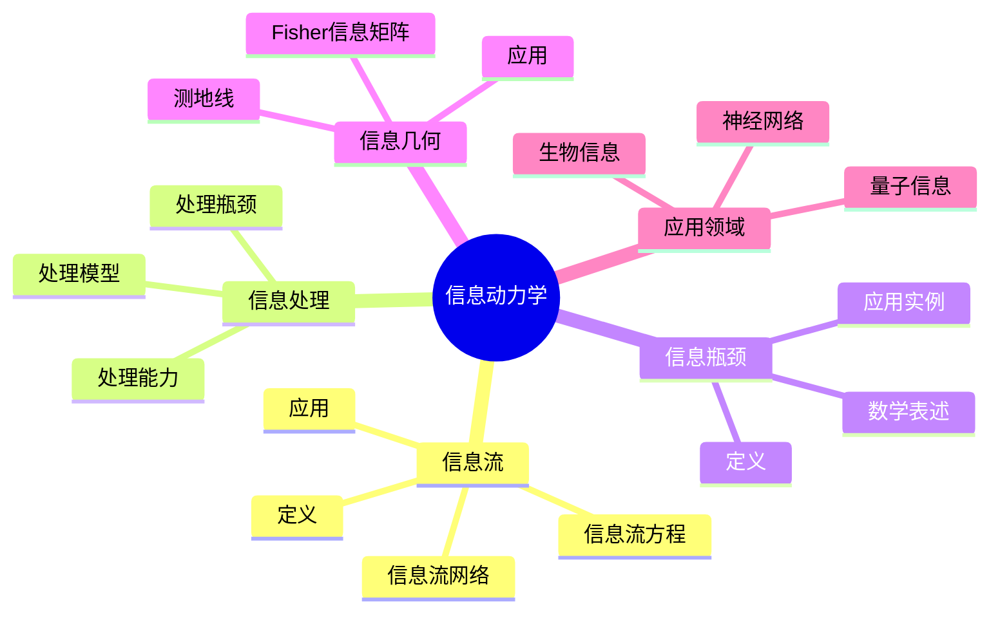
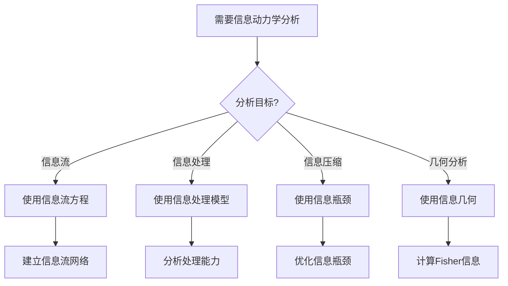
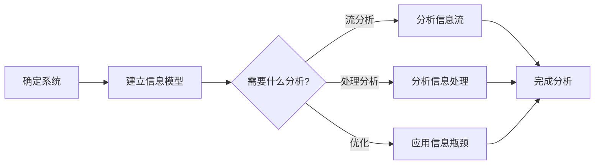
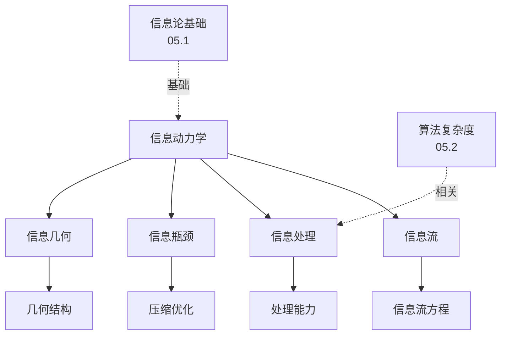
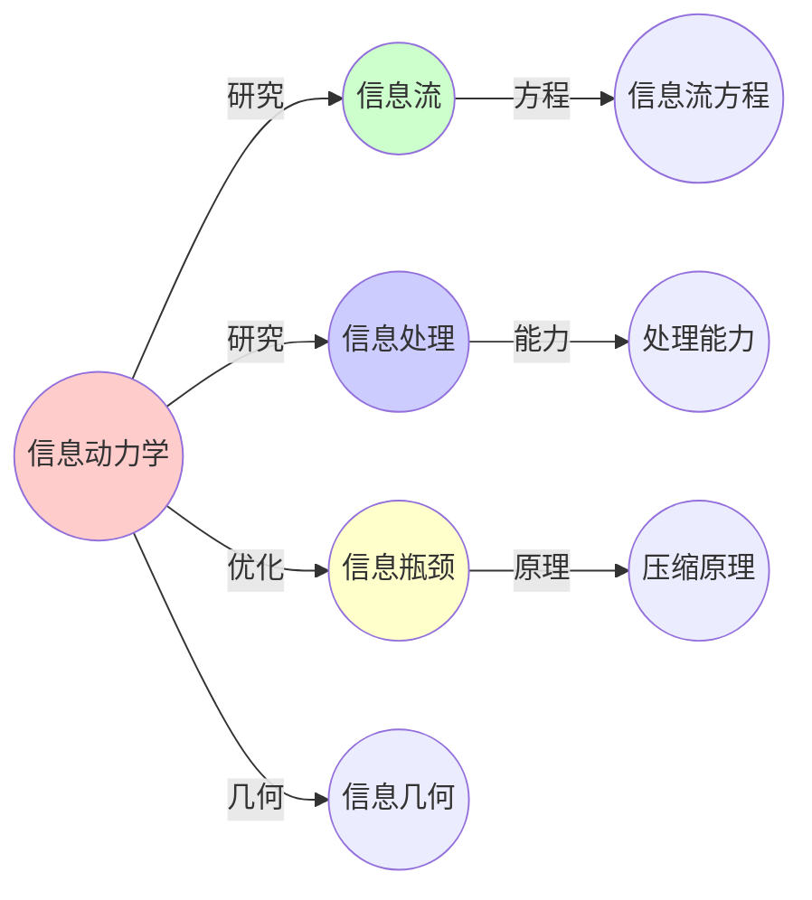
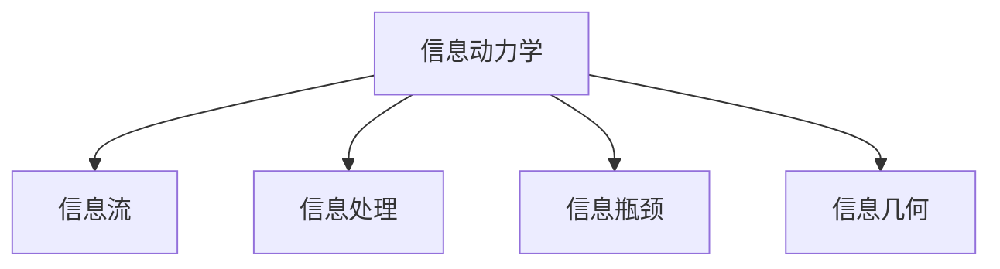

# 05.4 信息动力学

> **来源**: view07.md
> **创建日期**: 2025-01-27
> **最后更新**: 2025-01-27

## 📋 目录

- [05.4 信息动力学](#054-信息动力学)
  - [📋 目录](#-目录)
  - [📋 内容概览](#-内容概览)
  - [🎯 核心理念](#-核心理念)
  - [🔄 信息流（Information Flow）](#-信息流information-flow)
    - [定义](#定义)
    - [信息流方程](#信息流方程)
    - [信息流网络](#信息流网络)
    - [应用实例](#应用实例)
  - [🧠 信息处理](#-信息处理)
    - [信息处理模型](#信息处理模型)
    - [信息处理能力](#信息处理能力)
    - [信息处理瓶颈](#信息处理瓶颈)
  - [📊 信息瓶颈原理](#-信息瓶颈原理)
    - [定义](#定义-1)
    - [数学表述](#数学表述)
    - [应用实例](#应用实例-1)
      - [1. 机器学习](#1-机器学习)
      - [2. 认知科学](#2-认知科学)
      - [3. 通信理论](#3-通信理论)
  - [🔬 信息几何](#-信息几何)
    - [定义](#定义-2)
    - [基本概念](#基本概念)
      - [Fisher信息矩阵](#fisher信息矩阵)
      - [测地线](#测地线)
    - [应用实例](#应用实例-2)
      - [1. 统计推断](#1-统计推断)
      - [2. 机器学习](#2-机器学习)
  - [📈 信息动力学应用](#-信息动力学应用)
    - [1. 神经网络](#1-神经网络)
    - [2. 量子信息](#2-量子信息)
    - [3. 生物信息](#3-生物信息)
  - [📊 详细案例研究](#-详细案例研究)
    - [案例研究 1：信息瓶颈原理在深度学习中的应用](#案例研究-1信息瓶颈原理在深度学习中的应用)
    - [案例研究 2：信息几何在自然梯度下降中的应用](#案例研究-2信息几何在自然梯度下降中的应用)
    - [案例研究 3：信息流在通信网络优化中的应用](#案例研究-3信息流在通信网络优化中的应用)
  - [⚠️ 批判性分析与局限性](#️-批判性分析与局限性)
    - [局限性讨论](#局限性讨论)
      - [1. 信息度量的困难](#1-信息度量的困难)
      - [2. 信息瓶颈的实用性](#2-信息瓶颈的实用性)
      - [3. 信息几何的复杂性](#3-信息几何的复杂性)
    - [改进方向](#改进方向)
      - [1. 发展实用方法](#1-发展实用方法)
      - [2. 提高计算效率](#2-提高计算效率)
  - [📊 思维表征体系](#-思维表征体系)
    - [📊 1. 思维导图（增强版）](#-1-思维导图增强版)
      - [1.1 文本格式（基础版）](#11-文本格式基础版)
      - [1.2 Mermaid格式（可视化版）](#12-mermaid格式可视化版)
    - [📊 2. 多维对比矩阵](#-2-多维对比矩阵)
      - [2.1 信息处理模型对比矩阵](#21-信息处理模型对比矩阵)
      - [2.2 信息瓶颈应用对比矩阵](#22-信息瓶颈应用对比矩阵)
      - [2.3 信息几何应用对比矩阵](#23-信息几何应用对比矩阵)
    - [🌲 3. 决策树](#-3-决策树)
      - [3.1 信息动力学方法选择决策树](#31-信息动力学方法选择决策树)
    - [🛤️ 4. 决策逻辑路径](#️-4-决策逻辑路径)
      - [4.1 信息动力学分析路径](#41-信息动力学分析路径)
    - [🕸️ 5. 概念关系网络](#️-5-概念关系网络)
      - [5.1 信息动力学概念关系网络](#51-信息动力学概念关系网络)
    - [🗺️ 6. 知识图谱](#️-6-知识图谱)
      - [6.1 信息动力学知识图谱](#61-信息动力学知识图谱)
  - [📚 理论体系](#-理论体系)
    - [理论基础](#理论基础)
      - [数学/物理基础](#数学物理基础)
      - [历史发展](#历史发展)
    - [理论框架](#理论框架)
      - [核心假设](#核心假设)
      - [基本概念体系](#基本概念体系)
      - [主要定理/结论](#主要定理结论)
      - [适用范围和边界](#适用范围和边界)
    - [当前知识共识](#当前知识共识)
      - [学术界共识](#学术界共识)
      - [主要争议点](#主要争议点)
      - [权威来源](#权威来源)
    - [与其他理论的关系](#与其他理论的关系)
      - [逻辑关系](#逻辑关系)
      - [映射关系](#映射关系)
  - [🔗 关联网络](#-关联网络)
    - [🔗 概念级关联](#-概念级关联)
      - [核心概念映射](#核心概念映射)
    - [🔗 理论级关联](#-理论级关联)
      - [理论基础](#理论基础-1)
    - [🔗 方法级关联](#-方法级关联)
      - [方法应用网络](#方法应用网络)
    - [🔗 应用场景关联](#-应用场景关联)
  - [🛤️ 学习路径](#️-学习路径)
    - [前置知识](#前置知识)
    - [后续学习](#后续学习)
    - [并行学习](#并行学习)
  - [🔗 相关文档](#-相关文档)
  - [📖 扩展阅读](#-扩展阅读)

---

## 📋 内容概览

本文档阐述信息动力学，包括信息流、信息处理、信息瓶颈原理等。信息动力学研究信息在系统中的流动、处理和转换，为理解复杂系统的信息处理能力提供了理论框架。

---

## 🎯 核心理念

信息动力学研究信息在系统中的动态行为。信息流描述了信息的传递，信息处理研究了信息的编码、存储、计算和解码，信息瓶颈原理揭示了在压缩信息的同时保留相关信息的方法，信息几何提供了研究概率分布流形的几何工具。

## 🔄 信息流（Information Flow）

### 定义

**信息流**：信息在系统中的流动和传递

### 信息流方程

**一般形式**：

```latex
\frac{dI}{dt} = \text{输入} - \text{输出} - \text{耗散}
```

### 信息流网络

**节点**：信息源/汇

**边**：信息通道

**权重**：信息传输速率

### 应用实例

| 领域 | 信息流对象 | 信息通道 |
|------|-----------|----------|
| **通信** | 数据包 | 网络链路 |
| **生物** | 信号分子 | 信号通路 |
| **社会** | 信息 | 社交网络 |
| **经济** | 价格信息 | 市场网络 |

## 🧠 信息处理

### 信息处理模型

**输入** → **处理** → **输出**

**处理阶段**：

1. **编码**：将输入转换为内部表示
2. **存储**：保存信息
3. **计算**：处理信息
4. **解码**：将内部表示转换为输出

### 信息处理能力

**容量**：最大信息处理量

**效率**：信息处理效率

**准确性**：信息处理准确性

### 信息处理瓶颈

**瓶颈**：限制信息处理能力的因素

**类型**：

- **容量瓶颈**：处理容量限制
- **速度瓶颈**：处理速度限制
- **精度瓶颈**：处理精度限制

## 📊 信息瓶颈原理

### 定义

**信息瓶颈**：在压缩信息的同时保留相关信息

### 数学表述

**目标**：最小化 I(X;Z) 同时最大化 I(Z;Y)

**拉格朗日形式**：

```latex
L = I(X;Z) - \beta \cdot I(Z;Y)
```

- **I(X;Z)**：压缩项（最小化）
- **I(Z;Y)**：相关信息项（最大化）
- **β**：权衡参数

### 应用实例

#### 1. 机器学习

**应用**：特征提取

**原理**：压缩输入X到表示Z，同时保留与目标Y相关的信息

**效果**：学习到有用特征

#### 2. 认知科学

**应用**：认知压缩

**原理**：大脑压缩感知信息，保留行为相关信息

**效果**：高效认知

#### 3. 通信理论

**应用**：有损压缩

**原理**：压缩信号，保留重要信息

**效果**：高效传输

## 🔬 信息几何

### 定义

**信息几何**：研究概率分布流形的几何结构

### 基本概念

#### Fisher信息矩阵

**定义**：

```latex
g_{ij}(\theta) = E\left[\frac{\partial \log p(x|\theta)}{\partial \theta_i} \cdot \frac{\partial \log p(x|\theta)}{\partial \theta_j}\right]
```

**意义**：概率流形上的度量

#### 测地线

**定义**：概率流形上的最短路径

**应用**：信息传输的最优路径

### 应用实例

#### 1. 统计推断

**应用**：参数估计

**原理**：在概率流形上寻找最优参数

**效果**：最优估计

#### 2. 机器学习

**应用**：优化算法

**原理**：在概率流形上优化

**效果**：自然梯度下降

## 📈 信息动力学应用

### 1. 神经网络

**应用**：信息处理

**原理**：神经元网络处理信息

**特征**：

- **并行处理**：多个神经元同时处理
- **分布式存储**：信息分布式存储
- **自适应**：网络自适应调整

### 2. 量子信息

**应用**：量子计算

**原理**：量子系统处理信息

**特征**：

- **叠加**：量子叠加态
- **纠缠**：量子纠缠
- **测量**：量子测量

### 3. 生物信息

**应用**：生物信号处理

**原理**：生物系统处理信息

**特征**：

- **信号转导**：信号在细胞间传递
- **基因调控**：基因表达调控
- **神经网络**：神经信号处理

## 📊 详细案例研究

### 案例研究 1：信息瓶颈原理在深度学习中的应用

**背景**：信息瓶颈原理为理解深度学习提供了新的视角。

**形式化分析**：

```text
深度学习信息瓶颈:
- 输入: X (原始数据)
- 表示: Z (隐藏层表示)
- 输出: Y (标签)

信息瓶颈目标:
- 压缩: 最小化 I(X;Z)
- 保留: 最大化 I(Z;Y)
- 权衡: L = I(X;Z) - β·I(Z;Y)

深度网络行为:
- 初期: β小，压缩主导，学习压缩表示
- 中期: β增大，保留主导，学习相关特征
- 后期: β大，过拟合风险

实际效果:
- 理解训练过程
- 解释特征学习
- 指导网络设计

应用价值:
- 网络架构设计
- 正则化方法
- 理解深度学习
```

**关键发现**：

- ✅ 信息瓶颈解释了特征学习过程
- ✅ β参数控制压缩和保留的权衡
- ✅ 理论指导实践

**应用价值**：

- ✅ 深度学习理解
- ✅ 网络设计
- ✅ 特征提取

### 案例研究 2：信息几何在自然梯度下降中的应用

**背景**：信息几何为优化算法提供了新方法。

**形式化分析**：

```text
自然梯度下降:
- 问题: 传统梯度下降在参数空间优化
- 改进: 在概率分布流形上优化
- 方法: 使用Fisher信息矩阵

Fisher信息矩阵:
- 定义: g_ij(θ) = E[∂log p/∂θ_i · ∂log p/∂θ_j]
- 意义: 概率流形上的度量
- 作用: 定义自然梯度

自然梯度:
- 传统梯度: ∇θ L(θ)
- 自然梯度: G^(-1) · ∇θ L(θ)
- 优势: 考虑了概率分布的结构

应用效果:
- 收敛速度提高
- 适应概率结构
- 鲁棒性增强

实际应用:
- 神经网络训练
- 强化学习
- 变分推断
```

**关键发现**：

- ✅ 信息几何提供了优化新视角
- ✅ 自然梯度考虑了分布结构
- ✅ 方法有效提升性能

**应用价值**：

- ✅ 优化算法
- ✅ 机器学习
- ✅ 统计推断

### 案例研究 3：信息流在通信网络优化中的应用

**背景**：信息流理论指导通信网络的设计和优化。

**形式化分析**：

```text
通信网络信息流:
- 节点: 信息源/汇
- 边: 通信链路
- 权重: 传输速率

信息流方程:
- dI/dt = 输入 - 输出 - 耗散
- 平衡: 信息产生 = 信息传输 + 信息丢失

网络优化:
- 最大流: 最大化信息传输
- 最小割: 最小化瓶颈
- 路由优化: 最优路径选择

实际应用:
- 网络设计
- 流量控制
- 路由优化

效果:
- 传输效率提高
- 延迟降低
- 资源利用优化
```

**关键发现**：

- ✅ 信息流理论指导网络优化
- ✅ 最大流最小割理论有效
- ✅ 实际应用效果好

**应用价值**：

- ✅ 网络设计
- ✅ 流量工程
- ✅ 通信优化

## ⚠️ 批判性分析与局限性

### 局限性讨论

#### 1. 信息度量的困难

**问题**：实际系统中信息度量可能困难。

**挑战**：

- ⚠️ 互信息计算复杂
- ⚠️ 需要概率分布假设
- ⚠️ 高维问题计算困难

**应对策略**：

- ✅ 使用估计方法
- ✅ 简化假设
- ✅ 近似计算

#### 2. 信息瓶颈的实用性

**问题**：信息瓶颈原理的理论与实际应用存在差距。

**挑战**：

- ⚠️ 参数选择困难
- ⚠️ 计算复杂度高
- ⚠️ 实际效果不确定

**改进方向**：

- ✅ 改进算法
- ✅ 参数自适应
- ✅ 实际验证

#### 3. 信息几何的复杂性

**问题**：信息几何方法可能过于复杂。

**挑战**：

- ⚠️ Fisher信息矩阵计算困难
- ⚠️ 需要专业知识
- ⚠️ 应用限制

**改进方向**：

- ✅ 简化方法
- ✅ 开发工具
- ✅ 降低门槛

### 改进方向

#### 1. 发展实用方法

**目标**：使理论更容易应用。

**方法**：

- 简化计算
- 开发工具
- 提供指南

#### 2. 提高计算效率

**目标**：使方法更高效。

**方法**：

- 近似算法
- 并行计算
- 优化实现

## 📊 思维表征体系

### 📊 1. 思维导图（增强版）

#### 1.1 文本格式（基础版）

```text
信息动力学
├── 信息流
│   ├── 定义
│   ├── 信息流方程
│   ├── 信息流网络
│   └── 应用实例
├── 信息处理
│   ├── 信息处理模型
│   ├── 信息处理能力
│   └── 信息处理瓶颈
├── 信息瓶颈原理
│   ├── 定义
│   ├── 数学表述
│   └── 应用实例
│       ├── 机器学习
│       ├── 认知科学
│       └── 通信理论
├── 信息几何
│   ├── 定义
│   ├── Fisher信息矩阵
│   ├── 测地线
│   └── 应用实例
│       ├── 统计推断
│       └── 机器学习
└── 应用
    ├── 神经网络
    ├── 量子信息
    └── 生物信息
```

#### 1.2 Mermaid格式（可视化版）



### 📊 2. 多维对比矩阵

#### 2.1 信息处理模型对比矩阵

| 维度 | 编码-存储-计算-解码 | 信息瓶颈 | 信息几何 | 适用场景 |
|------|-------------------|---------|---------|---------|
| **复杂度** | 中 | 高 | 高 | 复杂度不同 |
| **应用范围** | 广 | 中 | 中 | 范围不同 |
| **理论基础** | 信息论 | 信息论+优化 | 信息论+几何 | 基础不同 |
| **计算难度** | 中 | 高 | 高 | 难度不同 |
| **解释能力** | 中 | 高 | 高 | 解释性不同 |

#### 2.2 信息瓶颈应用对比矩阵

| 维度 | 机器学习 | 认知科学 | 通信理论 | 应用效果 |
|------|---------|---------|---------|---------|
| **目标** | 特征提取 | 认知压缩 | 有损压缩 | 目标不同 |
| **方法** | 神经网络 | 认知模型 | 编码方案 | 方法不同 |
| **成功度** | 高 | 中 | 高 | 成功度不同 |
| **研究成熟度** | 高 | 中 | 高 | 成熟度不同 |

#### 2.3 信息几何应用对比矩阵

| 维度 | 统计推断 | 机器学习 | 优化 | 应用效果 |
|------|---------|---------|------|---------|
| **方法** | 参数估计 | 优化算法 | 几何优化 | 方法不同 |
| **理论基础** | 统计理论 | 信息理论 | 几何理论 | 基础不同 |
| **计算复杂度** | 中 | 高 | 高 | 复杂度不同 |
| **应用成熟度** | 高 | 中 | 中 | 成熟度不同 |

### 🌲 3. 决策树

#### 3.1 信息动力学方法选择决策树



### 🛤️ 4. 决策逻辑路径

#### 4.1 信息动力学分析路径



### 🕸️ 5. 概念关系网络

#### 5.1 信息动力学概念关系网络



### 🗺️ 6. 知识图谱

#### 6.1 信息动力学知识图谱



## 📚 理论体系

### 理论基础

#### 数学/物理基础

信息动力学的理论基础：

**1. 信息论基础**：

- 信息熵
- 互信息
- 条件熵
- KL散度

**2. 动力学基础**：

- 动力学系统
- 随机过程
- 控制理论

**3. 几何基础**：

- 微分几何
- 流形理论
- 信息几何

#### 历史发展

**关键时间节点**：

- **1940-1950年代**：信息论建立
  - 香农信息论
  - 信息熵概念
  - 信道容量

- **1990年代**：信息瓶颈原理
  - Tishby的信息瓶颈
  - 机器学习应用
  - 认知科学应用

- **2000年代**：信息几何
  - Amari的信息几何
  - Fisher信息矩阵
  - 几何优化

- **2010年代至今**：信息动力学
  - 信息流理论
  - 信息处理动力学
  - 跨学科应用

### 理论框架

#### 核心假设

**假设1：信息的动态性**

- **内容**：信息在系统中流动和变化
- **适用范围**：动态信息系统
- **限制条件**：需要明确的系统定义

**假设2：信息瓶颈优化**

- **内容**：系统在压缩和保留信息间优化
- **适用范围**：信息处理系统
- **限制条件**：需要明确的优化目标

**假设3：信息几何结构**

- **内容**：概率分布形成几何流形
- **适用范围**：概率分布系统
- **限制条件**：需要概率结构

#### 基本概念体系



#### 主要定理/结论

**结论1：信息流的守恒性**

- **内容**：信息流在某些条件下守恒
- **证据**：信息论证明
- **应用**：信息流分析

**结论2：信息瓶颈的最优性**

- **内容**：信息瓶颈提供最优压缩
- **证据**：优化理论
- **应用**：特征提取

**结论3：Fisher信息的度量性**

- **内容**：Fisher信息提供概率流形的度量
- **证据**：信息几何证明
- **应用**：统计推断

#### 适用范围和边界

**适用范围**：

- 信息处理系统
- 概率分布系统
- 动态信息系统

**边界条件**：

- 需要明确的系统定义
- 需要概率或信息结构
- 需要动态过程

**不适用场景**：

- 非信息 system
- 静态系统
- 无概率结构

### 当前知识共识

#### 学术界共识

**广泛接受的共识**：

1. **信息动力学的价值**
   - **共识**：信息动力学是理解信息系统的有用框架
   - **支持证据**：成功应用
   - **来源**：信息论、机器学习

2. **信息瓶颈的重要性**
   - **共识**：信息瓶颈是重要的优化原理
   - **支持证据**：机器学习成功
   - **来源**：机器学习、信息论

3. **信息几何的有效性**
   - **共识**：信息几何提供了有用的工具
   - **支持证据**：统计应用
   - **来源**：统计理论、信息论

#### 主要争议点

1. **信息瓶颈的普遍性**
   - **观点A**：信息瓶颈是普遍原理
   - **观点B**：只在特定情况下适用
   - **当前状态**：多数认为有局限性但有价值

2. **信息几何的计算性**
   - **观点A**：信息几何应该更可计算
   - **观点B**：主要是概念性的
   - **当前状态**：多数支持发展计算性

#### 权威来源

**经典文献**：

- 《Information Theory, Inference, and Learning Algorithms》- David MacKay
- 《Information Geometry》- Shun-ichi Amari
- 《The Information Bottleneck Method》- Tishby等

**权威机构/专家**：

- **IEEE信息论学会**
- **机器学习研究会**
- **信息几何研究组**

**最新发展**：

- **2020-2024**：深度学习的信息瓶颈、信息动力学、信息几何优化
- **前沿方向**：信息流控制、信息动力学建模、几何机器学习

### 与其他理论的关系

#### 逻辑关系

**理论基础**：

- **信息论基础**（[05.1_信息论基础.md](05.1_信息论基础.md)） → 信息动力学
  - 关系类型：直接扩展
  - 关键映射：信息论 → 信息动力学

**理论应用**：

- **算法复杂度**（[05.2_算法复杂度.md](05.2_算法复杂度.md)） → 信息动力学
  - 关系类型：相关理论
  - 关键映射：复杂度 → 信息处理

#### 映射关系

| 本理论概念 | 映射理论 | 映射概念 | 映射类型 | 映射说明 |
|-----------|---------|---------|---------|----------|
| **信息流** | 05.1_信息论基础 | 信息传输 | 扩展 | 信息流扩展信息传输 |
| **信息处理** | 05.2_算法复杂度 | 计算 | 对应 | 信息处理对应计算 |
| **信息瓶颈** | 05.1_信息论基础 | 信息压缩 | 扩展 | 信息瓶颈扩展压缩 |
| **信息几何** | 05.1_信息论基础 | 信息度量 | 扩展 | 信息几何扩展度量 |

## 🔗 关联网络

### 🔗 概念级关联

#### 核心概念映射

| 本文档概念 | 关联文档 | 关联概念 | 关系类型 | 映射说明 |
|-----------|---------|---------|---------|----------|
| **信息流** | 05.1_信息论基础 | 信息传输 | 扩展 | 信息流扩展信息传输 |
| **信息处理** | 05.2_算法复杂度 | 计算 | 对应 | 信息处理对应计算 |
| **信息瓶颈** | 05.1_信息论基础 | 信息压缩 | 扩展 | 信息瓶颈扩展压缩 |
| **信息几何** | 05.1_信息论基础 | 信息度量 | 扩展 | 信息几何扩展度量 |
| **信息处理能力** | 05.2_算法复杂度 | 计算复杂度 | 相关 | 处理能力与复杂度相关 |
| **信息流网络** | 04.2_复杂网络理论 | 复杂网络 | 对应 | 信息流网络对应复杂网络 |
| **Fisher信息矩阵** | 05.1_信息论基础 | 信息度量 | 扩展 | Fisher信息扩展信息度量 |

### 🔗 理论级关联

#### 理论基础

- **本理论基于**：
  - [05.1_信息论基础.md](05.1_信息论基础.md) ⭐⭐⭐ - 信息论基础
  - [05.2_算法复杂度.md](05.2_算法复杂度.md) ⭐⭐ - 算法复杂度

- **本理论应用于**：
  - 机器学习 ⭐⭐⭐ - 实际应用
  - 认知科学 ⭐⭐ - 应用
  - [05.5_计算与物理.md](05.5_计算与物理.md) ⭐⭐ - 计算与物理

### 🔗 方法级关联

#### 方法应用网络

| 本文档方法 | 应用文档 | 应用场景 | 应用效果 |
|-----------|---------|---------|---------|
| **信息瓶颈方法** | 机器学习 | 特征提取 | 成功 |
| **信息几何方法** | 统计推断 | 参数估计 | 成功 |
| **信息流分析** | 05.5_计算与物理 | 信息流动 | 成功 |

### 🔗 应用场景关联

**场景**：机器学习系统

| 视角 | 关联文档 | 核心理论 | 关注点 |
|------|---------|---------|--------|
| **特征提取** | 本文档 | 信息瓶颈 | 信息压缩 |
| **优化** | 本文档 | 信息几何 | 几何优化 |
| **复杂度** | 05.2_算法复杂度 | 算法复杂度 | 计算复杂度 |

## 🛤️ 学习路径

### 前置知识

**必须先学习**：

- [05.1_信息论基础.md](05.1_信息论基础.md) ⭐⭐⭐ - 信息论基础
- [05.2_算法复杂度.md](05.2_算法复杂度.md) ⭐⭐ - 算法复杂度

**建议先了解**：

- 概率论
- 优化理论
- 机器学习基础

### 后续学习

**建议接下来学习**（按顺序）：

1. [05.5_计算与物理.md](05.5_计算与物理.md) ⭐⭐⭐ - 计算与物理
2. 机器学习应用 ⭐⭐ - 实际应用
3. [04_复杂系统与网络理论](../04_复杂系统与网络理论/) ⭐⭐ - 复杂系统

### 并行学习

**可以同时学习**：

- [05.3_可计算性理论.md](05.3_可计算性理论.md) - 可计算性理论
- [02_动力学系统理论](../02_动力学系统理论/) - 动力学系统

## 🔗 相关文档

- [05.1_信息论基础.md](05.1_信息论基础.md)
- [05.2_算法复杂度.md](05.2_算法复杂度.md)
- [05.3_可计算性理论.md](05.3_可计算性理论.md)
- [05.5_计算与物理.md](05.5_计算与物理.md)

## 📖 扩展阅读

- 《Information Theory, Inference, and Learning Algorithms》- David MacKay
- Wikipedia: [Information Geometry](https://en.wikipedia.org/wiki/Information_geometry)
- Wikipedia: [Information Bottleneck Method](https://en.wikipedia.org/wiki/Information_bottleneck_method)
