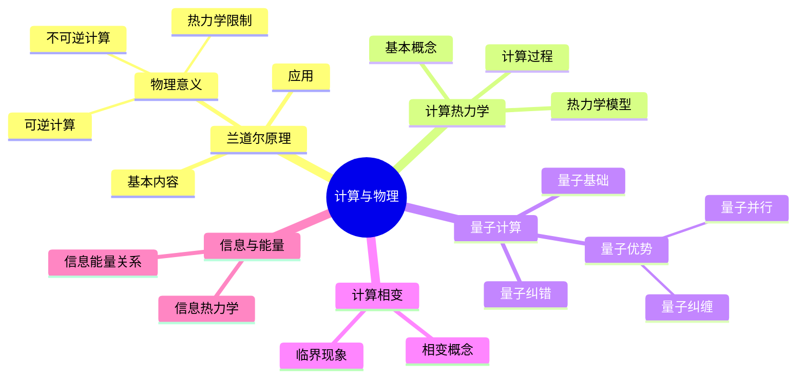
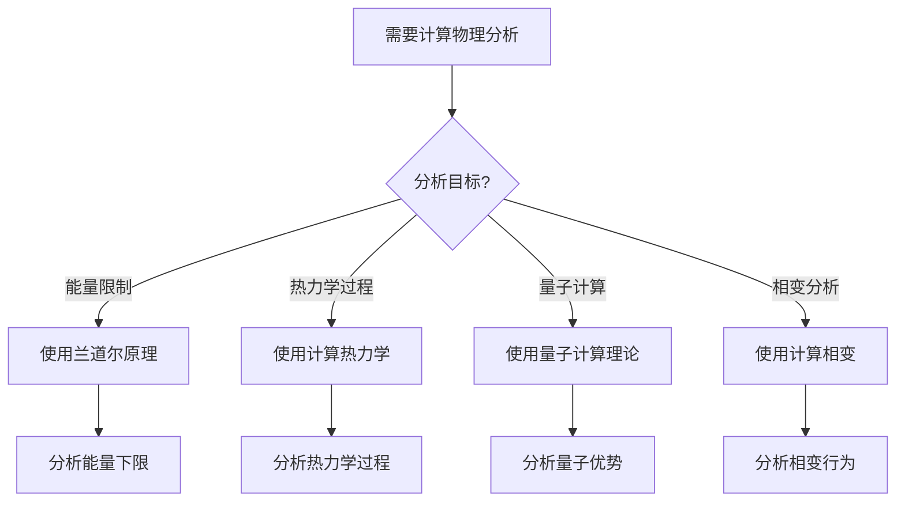
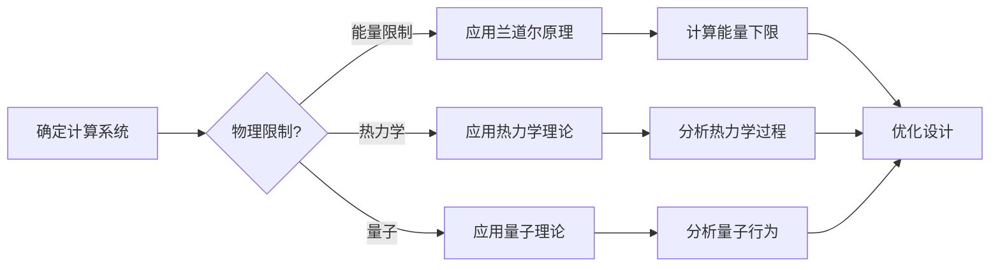
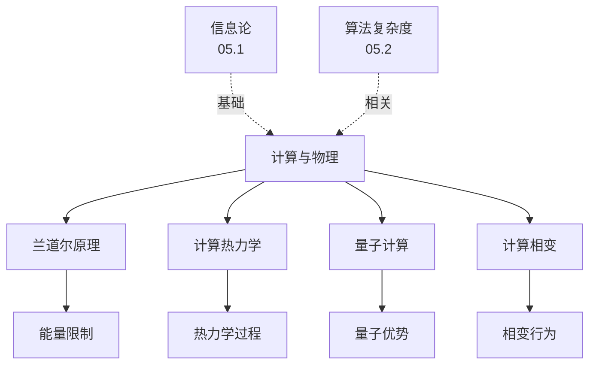
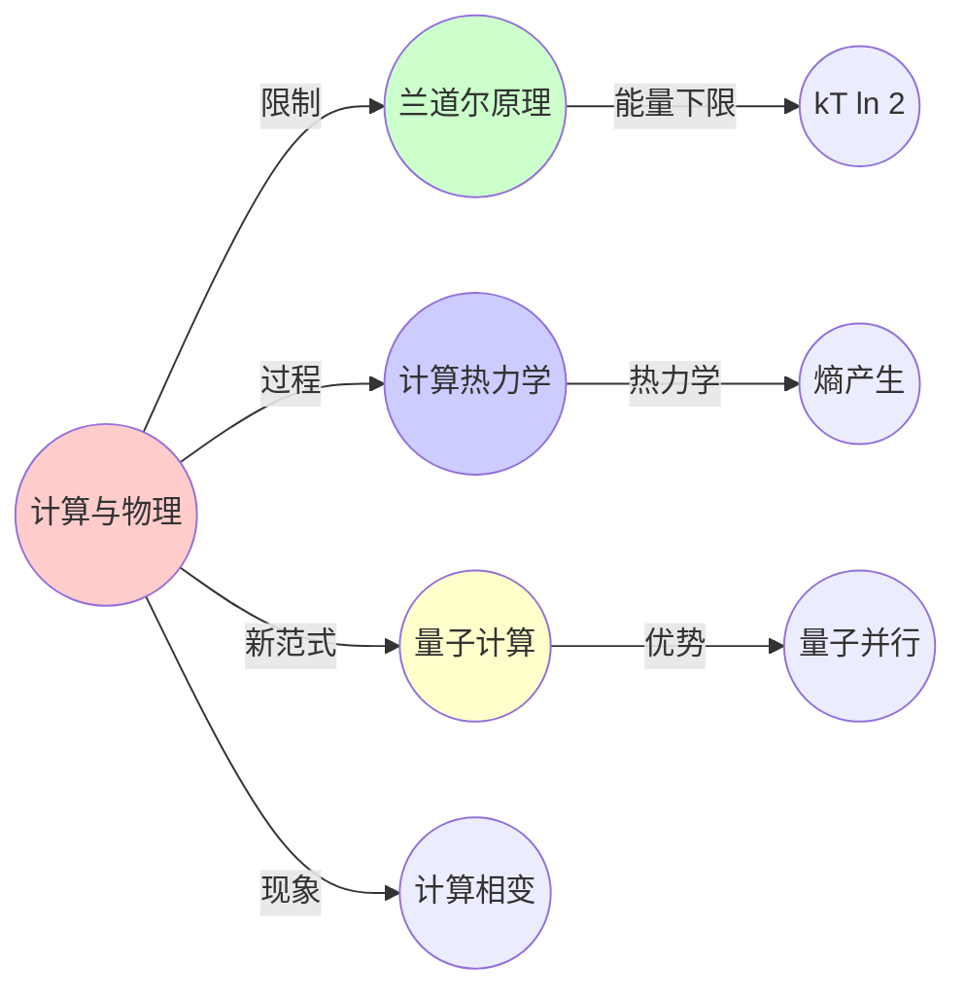
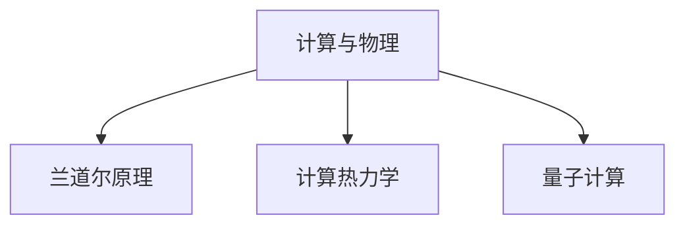

# 05.5 计算与物理

> **来源**: view02.md
> **创建日期**: 2025-01-27
> **最后更新**: 2025-01-27

## 📋 目录

- [05.5 计算与物理](#055-计算与物理)
  - [📋 目录](#-目录)
  - [📋 内容概览](#-内容概览)
  - [🎯 核心理念](#-核心理念)
  - [🔬 兰道尔原理（Landauer's Principle）](#-兰道尔原理landauers-principle)
    - [基本内容](#基本内容)
    - [物理意义](#物理意义)
    - [应用](#应用)
  - [⚡ 计算热力学](#-计算热力学)
    - [基本概念](#基本概念)
    - [计算过程的热力学](#计算过程的热力学)
    - [热力学计算模型](#热力学计算模型)
  - [⚛️ 量子计算](#️-量子计算)
    - [量子计算基础](#量子计算基础)
    - [量子优势](#量子优势)
    - [量子纠错](#量子纠错)
  - [🔄 计算相变](#-计算相变)
    - [相变概念](#相变概念)
    - [临界现象](#临界现象)
    - [应用](#应用-1)
  - [📊 信息与能量](#-信息与能量)
    - [信息能量关系](#信息能量关系)
    - [信息热力学](#信息热力学)
  - [🎯 应用实例](#-应用实例)
    - [1. 可逆计算](#1-可逆计算)
    - [2. 量子计算](#2-量子计算)
    - [3. 生物计算](#3-生物计算)
  - [📊 详细案例研究](#-详细案例研究)
    - [案例研究 1：兰道尔原理在可逆计算中的应用](#案例研究-1兰道尔原理在可逆计算中的应用)
    - [案例研究 2：量子计算的优势与应用](#案例研究-2量子计算的优势与应用)
    - [案例研究 3：计算相变在SAT问题中的应用](#案例研究-3计算相变在sat问题中的应用)
  - [⚠️ 批判性分析与局限性](#️-批判性分析与局限性)
    - [局限性讨论](#局限性讨论)
      - [1. 兰道尔原理的实验验证](#1-兰道尔原理的实验验证)
      - [2. 量子计算的可扩展性](#2-量子计算的可扩展性)
      - [3. 计算相变的普适性](#3-计算相变的普适性)
    - [改进方向](#改进方向)
      - [1. 实验验证](#1-实验验证)
      - [2. 技术发展](#2-技术发展)
  - [📊 思维表征体系](#-思维表征体系)
    - [📊 1. 思维导图（增强版）](#-1-思维导图增强版)
      - [1.1 文本格式（基础版）](#11-文本格式基础版)
      - [1.2 Mermaid格式（可视化版）](#12-mermaid格式可视化版)
    - [📊 2. 多维对比矩阵](#-2-多维对比矩阵)
      - [2.1 计算类型对比矩阵](#21-计算类型对比矩阵)
      - [2.2 信息与能量关系对比矩阵](#22-信息与能量关系对比矩阵)
      - [2.3 量子计算优势对比矩阵](#23-量子计算优势对比矩阵)
    - [🌲 3. 决策树](#-3-决策树)
      - [3.1 计算物理方法选择决策树](#31-计算物理方法选择决策树)
    - [🛤️ 4. 决策逻辑路径](#️-4-决策逻辑路径)
      - [4.1 计算物理分析路径](#41-计算物理分析路径)
    - [🕸️ 5. 概念关系网络](#️-5-概念关系网络)
      - [5.1 计算与物理概念关系网络](#51-计算与物理概念关系网络)
    - [🗺️ 6. 知识图谱](#️-6-知识图谱)
      - [6.1 计算与物理知识图谱](#61-计算与物理知识图谱)
  - [📚 理论体系](#-理论体系)
    - [理论基础](#理论基础)
      - [物理/信息科学基础](#物理信息科学基础)
      - [历史发展](#历史发展)
    - [理论框架](#理论框架)
      - [核心假设](#核心假设)
      - [基本概念体系](#基本概念体系)
      - [主要定理/结论](#主要定理结论)
      - [适用范围和边界](#适用范围和边界)
    - [当前知识共识](#当前知识共识)
      - [学术界共识](#学术界共识)
      - [主要争议点](#主要争议点)
      - [权威来源](#权威来源)
    - [与其他理论的关系](#与其他理论的关系)
      - [逻辑关系](#逻辑关系)
      - [映射关系](#映射关系)
  - [🔗 关联网络](#-关联网络)
    - [🔗 概念级关联](#-概念级关联)
      - [核心概念映射](#核心概念映射)
    - [🔗 理论级关联](#-理论级关联)
      - [理论基础](#理论基础-1)
    - [🔗 方法级关联](#-方法级关联)
      - [方法应用网络](#方法应用网络)
    - [🔗 应用场景关联](#-应用场景关联)
  - [🛤️ 学习路径](#️-学习路径)
    - [前置知识](#前置知识)
    - [后续学习](#后续学习)
    - [并行学习](#并行学习)
  - [🔗 相关文档](#-相关文档)
  - [📖 扩展阅读](#-扩展阅读)

---

## 📋 内容概览

本文档阐述计算与物理的关系，包括兰道尔原理、计算热力学、量子计算等。计算与物理的交叉揭示了计算的物理本质，为理解计算的能量消耗、可逆计算和量子计算提供了理论基础。

---

## 🎯 核心理念

计算与物理的交叉研究揭示了计算的物理本质。兰道尔原理说明了信息擦除需要消耗能量，计算热力学研究计算过程中的热力学行为，量子计算利用量子力学特性实现计算优势，计算相变揭示了计算复杂度的临界行为。

## 🔬 兰道尔原理（Landauer's Principle）

### 基本内容

**兰道尔原理**：擦除1比特信息至少需要 kT ln 2 的能量

**数学表述**：

```latex
E_{\min} = kT \ln 2
```

- **k**：玻尔兹曼常数
- **T**：温度
- **ln 2**：自然对数2

### 物理意义

**可逆计算**：不擦除信息的计算不消耗能量

**不可逆计算**：擦除信息的计算消耗能量

**热力学限制**：计算有热力学限制

### 应用

**计算能耗**：理解计算的最小能耗

**可逆计算**：设计可逆计算系统

**热力学计算**：热力学计算模型

## ⚡ 计算热力学

### 基本概念

**计算热力学**：研究计算过程中的热力学

**熵产生**：计算过程中的熵产生

**能量耗散**：计算过程中的能量耗散

### 计算过程的热力学

**可逆过程**：熵不变

**不可逆过程**：熵增加

**计算过程**：通常是不可逆的

### 热力学计算模型

**热机模型**：将计算建模为热机

**效率**：计算效率

**优化**：优化计算效率

## ⚛️ 量子计算

### 量子计算基础

**量子比特**：$|\psi\rangle = \alpha|0\rangle + \beta|1\rangle$

**量子门**：酉变换

**量子测量**：投影测量

### 量子优势

**量子并行**：量子叠加带来的并行性

**量子纠缠**：量子纠缠带来的优势

**量子算法**：量子算法优势

### 量子纠错

**量子错误**：退相干、噪声

**纠错码**：量子纠错码

**阈值定理**：量子纠错的阈值

## 🔄 计算相变

### 相变概念

**计算相变**：计算复杂度在参数变化时的突变

**例子**：

- **SAT问题**：可满足性问题的相变
- **图着色**：图着色问题的相变

### 临界现象

**临界点**：相变发生的点

**临界指数**：描述相变行为的指数

**标度律**：临界点附近的标度律

### 应用

**算法设计**：利用相变设计算法

**问题分类**：根据相变分类问题

**优化**：优化算法性能

## 📊 信息与能量

### 信息能量关系

**信息即能量**：信息可以转换为能量

**麦克斯韦妖**：信息可以降低熵

**Szilard引擎**：信息驱动的引擎

### 信息热力学

**信息熵**：信息的熵

**热力学熵**：热力学的熵

**关系**：信息熵与热力学熵的关系

## 🎯 应用实例

### 1. 可逆计算

**应用**：设计可逆计算系统

**原理**：避免信息擦除

**优势**：降低能耗

### 2. 量子计算

**应用**：量子计算系统

**原理**：利用量子力学

**优势**：计算优势

### 3. 生物计算

**应用**：生物计算系统

**原理**：利用生物过程

**优势**：高效计算

## 📊 详细案例研究

### 案例研究 1：兰道尔原理在可逆计算中的应用

**背景**：兰道尔原理揭示了计算的能量下限，指导可逆计算的设计。

**形式化分析**：

```text
兰道尔原理:
- 擦除1比特信息: E_min = kT ln 2
- 可逆计算: 不擦除信息，理论上零能耗
- 不可逆计算: 擦除信息，消耗能量

可逆计算设计:
- Fredkin门: 可逆逻辑门
- Toffoli门: 通用可逆门
- 可逆电路: 不擦除信息的电路

实际应用:
- 低功耗计算
- 量子计算
- 热力学计算

效果:
- 理论能耗为零
- 实际能耗显著降低
- 为未来计算提供方向
```

**关键发现**：

- ✅ 兰道尔原理揭示了计算的物理限制
- ✅ 可逆计算可以避免信息擦除
- ✅ 理论指导了低功耗设计

**应用价值**：

- ✅ 低功耗计算
- ✅ 未来计算技术
- ✅ 量子计算

### 案例研究 2：量子计算的优势与应用

**背景**：量子计算利用量子力学特性实现计算优势。

**形式化分析**：

```text
量子计算优势:
- 量子叠加: 同时处理多个状态
- 量子纠缠: 非经典相关性
- 量子并行: 指数级并行性

量子算法:
- Shor算法: 因子分解，O(n³) vs O(2^(n/3))
- Grover算法: 搜索，O(√N) vs O(N)
- 量子模拟: 模拟量子系统

实际应用:
- 密码学: 破解RSA
- 优化: 组合优化问题
- 模拟: 量子系统模拟

挑战:
- 退相干: 量子态易受干扰
- 纠错: 需要量子纠错
- 可扩展性: 扩大量子比特数困难
```

**关键发现**：

- ✅ 量子计算具有理论优势
- ✅ 量子算法在特定问题上高效
- ✅ 实际应用面临技术挑战

**应用价值**：

- ✅ 密码学
- ✅ 优化问题
- ✅ 量子模拟

### 案例研究 3：计算相变在SAT问题中的应用

**背景**：计算相变揭示了SAT问题的临界行为。

**形式化分析**：

```text
SAT问题相变:
- 参数: 变量数n，子句数m，比率α = m/n
- 临界点: α_c ≈ 4.27 (3-SAT)
- 相变行为: 可满足性突变

临界现象:
- α < α_c: 几乎总是可满足
- α > α_c: 几乎总是不可满足
- α ≈ α_c: 最难求解

算法影响:
- 临界点附近: 求解时间最长
- 远离临界点: 求解时间短
- 相变区域: 算法性能下降

应用:
- 算法设计
- 问题生成
- 性能预测
```

**关键发现**：

- ✅ 计算相变揭示了问题的临界行为
- ✅ 临界点附近问题最难
- ✅ 相变理论指导算法设计

**应用价值**：

- ✅ 算法优化
- ✅ 问题生成
- ✅ 性能分析

## ⚠️ 批判性分析与局限性

### 局限性讨论

#### 1. 兰道尔原理的实验验证

**问题**：兰道尔原理的实验验证存在困难。

**挑战**：

- ⚠️ 测量精度要求高
- ⚠️ 实验条件限制
- ⚠️ 理论假设理想化

**应对策略**：

- ✅ 改进实验方法
- ✅ 提高测量精度
- ✅ 考虑实际因素

#### 2. 量子计算的可扩展性

**问题**：量子计算的可扩展性面临挑战。

**挑战**：

- ⚠️ 退相干问题
- ⚠️ 纠错复杂度
- ⚠️ 硬件限制

**改进方向**：

- ✅ 改进纠错方法
- ✅ 开发新技术
- ✅ 优化硬件设计

#### 3. 计算相变的普适性

**问题**：计算相变理论是否具有普适性。

**挑战**：

- ⚠️ 不同问题可能有不同相变
- ⚠️ 相变点可能难以确定
- ⚠️ 应用限制

**改进方向**：

- ✅ 研究更多问题
- ✅ 建立统一理论
- ✅ 明确适用范围

### 改进方向

#### 1. 实验验证

**目标**：验证理论预测。

**方法**：

- 改进实验方法
- 提高测量精度
- 多实验验证

#### 2. 技术发展

**目标**：克服技术障碍。

**方法**：

- 新技术开发
- 硬件改进
- 算法优化

## 📊 思维表征体系

### 📊 1. 思维导图（增强版）

#### 1.1 文本格式（基础版）

```text
计算与物理
├── 兰道尔原理
│   ├── 基本内容
│   ├── 物理意义
│   │   ├── 可逆计算
│   │   ├── 不可逆计算
│   │   └── 热力学限制
│   └── 应用
├── 计算热力学
│   ├── 基本概念
│   ├── 计算过程的热力学
│   └── 热力学计算模型
├── 量子计算
│   ├── 量子计算基础
│   ├── 量子优势
│   │   ├── 量子并行
│   │   ├── 量子纠缠
│   │   └── 量子算法
│   └── 量子纠错
├── 计算相变
│   ├── 相变概念
│   ├── 临界现象
│   └── 应用
└── 信息与能量
    ├── 信息能量关系
    └── 信息热力学
```

#### 1.2 Mermaid格式（可视化版）



### 📊 2. 多维对比矩阵

#### 2.1 计算类型对比矩阵

| 维度 | 经典计算 | 可逆计算 | 量子计算 | 关系 |
|------|---------|---------|---------|------|
| **能量消耗** | 高 | 低（理论上0） | 低 | 能量不同 |
| **信息擦除** | 有 | 无 | 有 | 擦除不同 |
| **热力学限制** | 受限制 | 不受限制 | 受限制 | 限制不同 |
| **计算能力** | 图灵完备 | 图灵完备 | 可能更强 | 能力不同 |
| **实现难度** | 低 | 很高 | 很高 | 难度不同 |

#### 2.2 信息与能量关系对比矩阵

| 维度 | 兰道尔原理 | 信息热力学 | 计算热力学 | 关系 |
|------|-----------|-----------|-----------|------|
| **理论基础** | 信息论+热力学 | 信息论+热力学 | 热力学+计算 | 基础不同 |
| **适用范围** | 信息擦除 | 信息过程 | 计算过程 | 范围不同 |
| **能量下限** | kT ln 2 | 可变 | 可变 | 下限不同 |
| **应用** | 计算物理 | 信息处理 | 计算设计 | 应用不同 |

#### 2.3 量子计算优势对比矩阵

| 维度 | 量子并行 | 量子纠缠 | 量子算法 | 重要性 |
|------|---------|---------|---------|--------|
| **优势程度** | 很高 | 很高 | 很高 | 都很重要 |
| **应用范围** | 广 | 广 | 有限 | 范围不同 |
| **实现难度** | 中 | 高 | 高 | 难度不同 |
| **当前状态** | 理论成熟 | 实验验证 | 算法开发中 | 状态不同 |

### 🌲 3. 决策树

#### 3.1 计算物理方法选择决策树



### 🛤️ 4. 决策逻辑路径

#### 4.1 计算物理分析路径



### 🕸️ 5. 概念关系网络

#### 5.1 计算与物理概念关系网络



### 🗺️ 6. 知识图谱

#### 6.1 计算与物理知识图谱



## 📚 理论体系

### 理论基础

#### 物理/信息科学基础

计算与物理的理论基础：

**1. 热力学基础**：

- 热力学定律
- 熵理论
- 统计物理

**2. 信息论基础**：

- 信息熵
- 信息量
- 信息处理

**3. 量子力学基础**：

- 量子力学
- 量子信息
- 量子计算

#### 历史发展

**关键时间节点**：

- **1961年**：兰道尔原理提出
  - 信息擦除的能量成本
  - kT ln 2 下限

- **1980-1990年代**：可逆计算
  - 可逆计算理论
  - 能量最小计算

- **1990-2000年代**：量子计算发展
  - 量子算法
  - 量子纠错
  - 量子优势

- **2000年代至今**：计算热力学
  - 计算过程热力学
  - 信息热力学
  - 物理计算

### 理论框架

#### 核心假设

**假设1：兰道尔原理**

- **内容**：擦除1比特信息至少需要 kT ln 2 能量
- **适用范围**：经典计算
- **限制条件**：需要热力学平衡

**假设2：可逆计算的可能性**

- **内容**：理论上可逆计算无能量消耗
- **适用范围**：理想可逆计算
- **限制条件**：实际实现困难

**假设3：量子计算的优越性**

- **内容**：量子计算可能超越经典计算
- **适用范围**：特定问题
- **限制条件**：需要量子纠错

#### 基本概念体系



#### 主要定理/结论

**定理1：兰道尔原理**

- **内容**：信息擦除的最小能量成本
- **证据**：热力学和信息论证明
- **应用**：计算物理限制

**结论2：可逆计算的能量优势**

- **内容**：可逆计算理论上无能量消耗
- **证据**：热力学理论
- **应用**：低能耗计算

**结论3：量子计算的优势**

- **内容**：量子计算对某些问题有优势
- **证据**：算法和实验
- **应用**：量子算法设计

#### 适用范围和边界

**适用范围**：

- 物理计算系统
- 能量受限计算
- 量子计算系统

**边界条件**：

- 需要物理系统
- 需要考虑热力学
- 需要量子系统（量子计算）

**不适用场景**：

- 抽象计算模型
- 不考虑物理限制
- 理想化系统

### 当前知识共识

#### 学术界共识

**广泛接受的共识**：

1. **兰道尔原理的正确性**
   - **共识**：兰道尔原理是正确的
   - **支持证据**：理论和实验
   - **来源**：热力学、信息论

2. **量子计算的优势**
   - **共识**：量子计算对某些问题有优势
   - **支持证据**：算法和实验
   - **来源**：量子计算研究

3. **计算热力学的重要性**
   - **共识**：计算热力学是重要研究领域
   - **支持证据**：理论和实验
   - **来源**：计算物理

#### 主要争议点

1. **可逆计算的可行性**
   - **观点A**：可逆计算可行
   - **观点B**：实际不可行
   - **当前状态**：多数认为理论可行但实际困难

2. **量子计算的普遍优势**
   - **观点A**：量子计算有广泛优势
   - **观点B**：只对特定问题有优势
   - **当前状态**：多数认为只对特定问题有优势

#### 权威来源

**经典文献**：

- 《Information, Physics, and Computation》- Marc Mézard
- 《Quantum Computation and Quantum Information》- Nielsen & Chuang
- 《Reversible Computing》- 计算物理文献

**权威机构/专家**：

- **计算物理研究会**
- **量子计算研究组**
- **热力学研究会**

**最新发展**：

- **2020-2024**：量子优势实验、计算热力学、可逆计算实现
- **前沿方向**：量子纠错、低能耗计算、物理计算

### 与其他理论的关系

#### 逻辑关系

**理论基础**：

- **信息论基础**（[05.1_信息论基础.md](05.1_信息论基础.md)） → 计算与物理
  - 关系类型：理论基础
  - 关键映射：信息 → 物理

**理论应用**：

- **算法复杂度**（[05.2_算法复杂度.md](05.2_算法复杂度.md)） → 计算与物理
  - 关系类型：相关理论
  - 关键映射：复杂度 → 物理限制

#### 映射关系

| 本理论概念 | 映射理论 | 映射概念 | 映射类型 | 映射说明 |
|-----------|---------|---------|---------|----------|
| **信息能量关系** | 05.1_信息论基础 | 信息量 | 对应 | 信息与能量对应 |
| **计算复杂度** | 05.2_算法复杂度 | 算法复杂度 | 对应 | 计算复杂度对应 |
| **量子计算** | 03.6_量子计算中的范畴论 | 量子计算 | 对应 | 概念对应 |
| **计算相变** | 02.4_分岔理论与相变 | 相变 | 对应 | 相变概念对应 |

## 🔗 关联网络

### 🔗 概念级关联

#### 核心概念映射

| 本文档概念 | 关联文档 | 关联概念 | 关系类型 | 映射说明 |
|-----------|---------|---------|---------|----------|
| **信息能量关系** | 05.1_信息论基础 | 信息量 | 对应 | 信息与能量对应 |
| **计算复杂度** | 05.2_算法复杂度 | 算法复杂度 | 对应 | 计算复杂度对应 |
| **量子计算** | 03.6_量子计算中的范畴论 | 量子计算 | 对应 | 概念对应 |
| **计算相变** | 02.4_分岔理论与相变 | 相变 | 对应 | 相变概念对应 |
| **兰道尔原理** | 05.1_信息论基础 | 信息擦除 | 对应 | 原理涉及信息擦除 |
| **计算热力学** | 02.4_分岔理论与相变 | 热力学 | 对应 | 热力学概念对应 |
| **量子优势** | 03.6_量子计算中的范畴论 | 量子算法 | 相关 | 量子优势来自量子算法 |

### 🔗 理论级关联

#### 理论基础

- **本理论基于**：
  - [05.1_信息论基础.md](05.1_信息论基础.md) ⭐⭐⭐ - 信息论基础
  - [05.2_算法复杂度.md](05.2_算法复杂度.md) ⭐⭐ - 算法复杂度
  - 热力学 ⭐⭐⭐ - 物理基础

- **本理论应用于**：
  - 计算系统设计 ⭐⭐⭐ - 实际应用
  - [03.6_量子计算中的范畴论.md](../03_范畴论与形式化方法/03.6_量子计算中的范畴论.md) ⭐⭐ - 量子计算

### 🔗 方法级关联

#### 方法应用网络

| 本文档方法 | 应用文档 | 应用场景 | 应用效果 |
|-----------|---------|---------|---------|
| **兰道尔原理** | 计算系统设计 | 能量优化 | 成功 |
| **计算热力学** | 计算系统设计 | 热力学分析 | 成功 |
| **量子计算理论** | 03.6_量子计算中的范畴论 | 量子算法设计 | 成功 |

### 🔗 应用场景关联

**场景**：计算系统设计

| 视角 | 关联文档 | 核心理论 | 关注点 |
|------|---------|---------|--------|
| **能量限制** | 本文档 | 兰道尔原理 | 能量下限 |
| **量子计算** | 03.6_量子计算中的范畴论 | 量子计算 | 量子优势 |
| **复杂度** | 05.2_算法复杂度 | 算法复杂度 | 计算复杂度 |

## 🛤️ 学习路径

### 前置知识

**必须先学习**：

- [05.1_信息论基础.md](05.1_信息论基础.md) ⭐⭐⭐ - 信息论基础
- 基础热力学 ⭐⭐

**建议先了解**：

- 量子力学基础
- 统计物理
- 计算基础

### 后续学习

**建议接下来学习**（按顺序）：

1. [03.6_量子计算中的范畴论.md](../03_范畴论与形式化方法/03.6_量子计算中的范畴论.md) ⭐⭐⭐ - 量子计算
2. [02.4_分岔理论与相变.md](../02_动力学系统理论/02.4_分岔理论与相变.md) ⭐⭐ - 相变理论
3. 计算系统设计 ⭐⭐ - 实际应用

### 并行学习

**可以同时学习**：

- [05.2_算法复杂度.md](05.2_算法复杂度.md) - 算法复杂度
- [05.4_信息动力学.md](05.4_信息动力学.md) - 信息动力学

## 🔗 相关文档

- [05.1_信息论基础.md](05.1_信息论基础.md)
- [05.2_算法复杂度.md](05.2_算法复杂度.md)
- [05.3_可计算性理论.md](05.3_可计算性理论.md)
- [05.4_信息动力学.md](05.4_信息动力学.md)

## 📖 扩展阅读

- 《Information, Physics, and Computation》- Marc Mézard
- Wikipedia: [Landauer's Principle](https://en.wikipedia.org/wiki/Landauer%27s_principle)
- Wikipedia: [Quantum Computing](https://en.wikipedia.org/wiki/Quantum_computing)
- Wikipedia: [Computational Phase Transition](https://en.wikipedia.org/wiki/Phase_transition)
