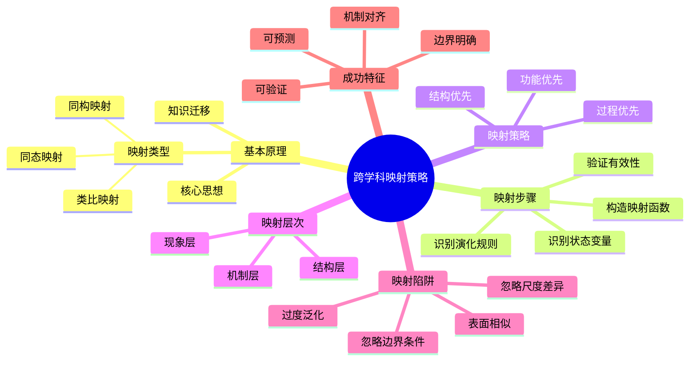
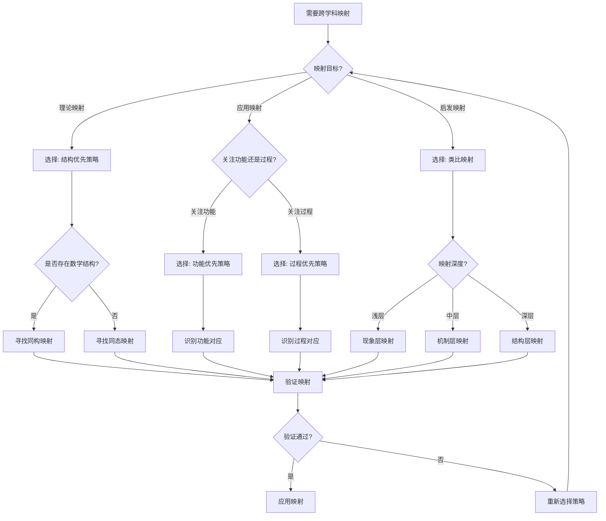
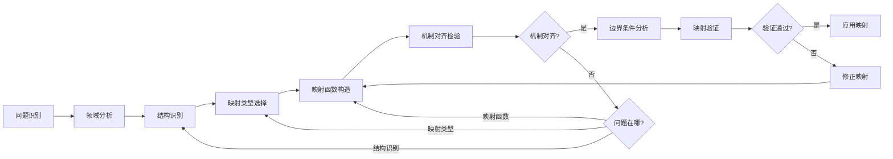
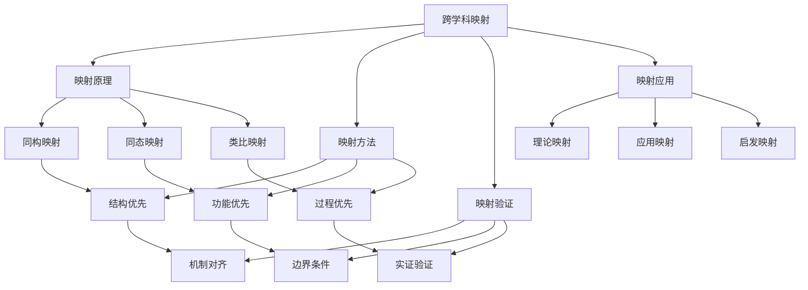
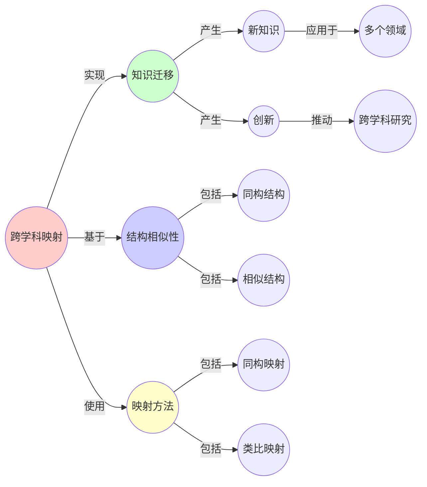
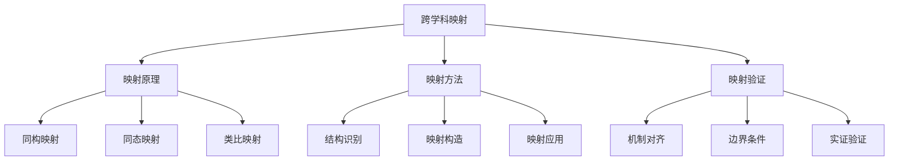
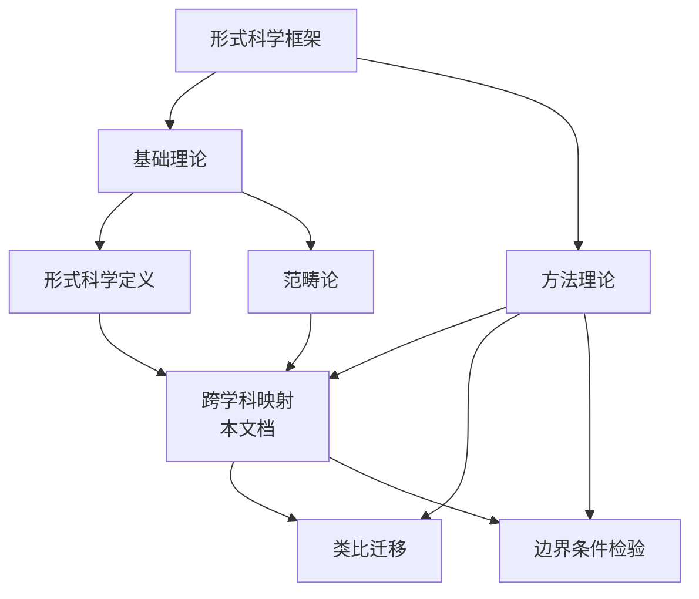
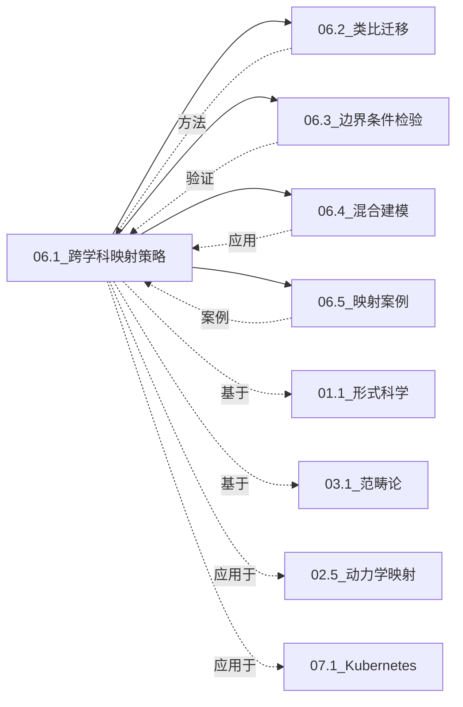

# 06.1 跨学科映射策略

> **来源**: view01.md, view06.md
> **创建日期**: 2025-01-27
> **最后更新**: 2025-01-27

## 📋 目录

- [06.1 跨学科映射策略](#061-跨学科映射策略)
  - [📋 目录](#-目录)
  - [📋 内容概览](#-内容概览)
  - [🎯 核心理念](#-核心理念)
  - [🔄 映射的基本原理](#-映射的基本原理)
    - [核心思想](#核心思想)
    - [映射的类型](#映射的类型)
      - [1. 同构映射（Isomorphism）](#1-同构映射isomorphism)
      - [2. 同态映射（Homomorphism）](#2-同态映射homomorphism)
      - [3. 类比映射（Analogy）](#3-类比映射analogy)
  - [📊 映射步骤](#-映射步骤)
    - [步骤1：识别状态变量](#步骤1识别状态变量)
    - [步骤2：识别演化规则](#步骤2识别演化规则)
    - [步骤3：构造映射函数](#步骤3构造映射函数)
    - [步骤4：验证映射有效性](#步骤4验证映射有效性)
  - [🎯 映射策略](#-映射策略)
    - [策略1：结构优先](#策略1结构优先)
    - [策略2：功能优先](#策略2功能优先)
    - [策略3：过程优先](#策略3过程优先)
  - [📈 映射的层次](#-映射的层次)
    - [层次1：现象层](#层次1现象层)
    - [层次2：机制层](#层次2机制层)
    - [层次3：结构层](#层次3结构层)
  - [⚠️ 映射的陷阱](#️-映射的陷阱)
    - [陷阱1：表面相似](#陷阱1表面相似)
    - [陷阱2：过度泛化](#陷阱2过度泛化)
    - [陷阱3：忽略边界条件](#陷阱3忽略边界条件)
    - [陷阱4：忽略尺度差异](#陷阱4忽略尺度差异)
  - [✅ 成功映射的特征](#-成功映射的特征)
    - [特征1：机制对齐](#特征1机制对齐)
    - [特征2：边界明确](#特征2边界明确)
    - [特征3：可验证](#特征3可验证)
    - [特征4：可预测](#特征4可预测)
  - [📊 思维表征体系](#-思维表征体系)
    - [📊 1. 思维导图（增强版）](#-1-思维导图增强版)
      - [1.1 文本格式（基础版）](#11-文本格式基础版)
      - [1.2 Mermaid格式（可视化版）](#12-mermaid格式可视化版)
    - [📊 2. 多维对比矩阵](#-2-多维对比矩阵)
      - [2.1 映射类型对比矩阵](#21-映射类型对比矩阵)
      - [2.2 映射策略对比矩阵](#22-映射策略对比矩阵)
      - [2.3 映射层次对比矩阵](#23-映射层次对比矩阵)
    - [🌲 3. 决策树](#-3-决策树)
      - [3.1 映射策略选择决策树](#31-映射策略选择决策树)
    - [🛤️ 4. 决策逻辑路径](#️-4-决策逻辑路径)
      - [4.1 跨学科映射实施路径](#41-跨学科映射实施路径)
    - [🕸️ 5. 概念关系网络](#️-5-概念关系网络)
      - [5.1 跨学科映射核心概念网络](#51-跨学科映射核心概念网络)
    - [🗺️ 6. 知识图谱](#️-6-知识图谱)
      - [6.1 跨学科映射知识图谱](#61-跨学科映射知识图谱)
  - [📚 理论体系](#-理论体系)
    - [理论基础](#理论基础)
      - [数学/逻辑基础](#数学逻辑基础)
      - [历史发展](#历史发展)
    - [理论框架](#理论框架)
      - [核心假设](#核心假设)
      - [基本概念体系](#基本概念体系)
      - [主要定理/结论](#主要定理结论)
      - [适用范围和边界](#适用范围和边界)
    - [当前知识共识](#当前知识共识)
      - [学术界共识](#学术界共识)
      - [主要争议点](#主要争议点)
      - [权威来源](#权威来源)
    - [与其他理论的关系](#与其他理论的关系)
      - [逻辑关系](#逻辑关系)
      - [映射关系](#映射关系)
      - [统一性论证](#统一性论证)
  - [🔗 关联网络](#-关联网络)
    - [🔗 概念级关联](#-概念级关联)
      - [核心概念映射](#核心概念映射)
    - [🔗 理论级关联](#-理论级关联)
      - [理论基础](#理论基础-1)
      - [理论关系网络](#理论关系网络)
    - [🔗 方法级关联](#-方法级关联)
      - [方法应用网络](#方法应用网络)
    - [🔗 应用场景关联](#-应用场景关联)
      - [同一场景的多视角分析](#同一场景的多视角分析)
  - [🛤️ 学习路径](#️-学习路径)
    - [前置知识](#前置知识)
    - [后续学习](#后续学习)
    - [并行学习](#并行学习)
  - [🔗 相关文档](#-相关文档)
  - [📖 扩展阅读](#-扩展阅读)

---

## 📋 内容概览

本文档阐述跨学科映射的基本策略和方法，揭示不同领域间的结构相似性。跨学科映射通过识别结构对应关系，实现知识迁移和创新，是跨学科研究的重要方法。

---

## 🎯 核心理念

跨学科映射的核心是识别不同领域间的结构相似性。通过同构映射、同态映射或类比映射，我们可以将某个领域的知识、方法和工具迁移到另一个领域，实现知识创新和应用拓展。

## 🔄 映射的基本原理

### 核心思想

**跨学科映射**：识别不同领域间的结构相似性，通过映射实现知识迁移。

### 映射的类型

#### 1. 同构映射（Isomorphism）

**定义**：保持所有结构的双射

**特征**：

- 一一对应
- 保持所有关系
- 可逆

**实例**：

- 群同构
- 图同构
- 拓扑同胚

#### 2. 同态映射（Homomorphism）

**定义**：保持部分结构的映射

**特征**：

- 不一定一一对应
- 保持主要关系
- 可能不可逆

**实例**：

- 群同态
- 线性映射
- 连续映射

#### 3. 类比映射（Analogy）

**定义**：结构相似但细节不同的映射

**特征**：

- 结构对应
- 细节不同
- 启发式

**实例**：

- 电路-流体类比
- 生态-经济类比
- 生物-社会类比

## 📊 映射步骤

### 步骤1：识别状态变量

**目标**：找出系统的关键状态变量

**方法**：

1. 分析系统行为
2. 识别关键参数
3. 确定状态空间维度

**实例**：

- **生态系统**：[捕食者数, 猎物数, 资源量]
- **经济系统**：[价格, 产量, 需求]
- **社会系统**：[人口, 资源, 冲突]

### 步骤2：识别演化规则

**目标**：找出系统的演化规律

**方法**：

1. 观察系统变化
2. 建立动力学方程
3. 验证模型有效性

**实例**：

- **Lotka-Volterra**：捕食者-猎物模型
- **SIR模型**：传染病传播
- **Logistic增长**：资源限制增长

### 步骤3：构造映射函数

**目标**：建立领域间的对应关系

**方法**：

1. 识别结构对应
2. 构造映射函数
3. 验证映射有效性

**实例**：

- **函子映射**：范畴间的映射
- **同构映射**：结构保持映射
- **类比映射**：启发式映射

### 步骤4：验证映射有效性

**目标**：确保映射的正确性

**方法**：

1. 机制对齐检验
2. 边界条件分析
3. 反例挖掘

**实例**：

- **机制检验**：验证因果机制一致
- **尺度检验**：验证尺度适用性
- **参数检验**：验证参数范围

## 🎯 映射策略

### 策略1：结构优先

**原则**：优先识别结构相似性

**方法**：

1. 抽象出核心结构
2. 忽略细节差异
3. 建立结构对应

**适用**：理论映射

### 策略2：功能优先

**原则**：优先识别功能相似性

**方法**：

1. 识别系统功能
2. 建立功能对应
3. 验证功能等价

**适用**：应用映射

### 策略3：过程优先

**原则**：优先识别过程相似性

**方法**：

1. 识别演化过程
2. 建立过程对应
3. 验证过程等价

**适用**：动力学映射

## 📈 映射的层次

### 层次1：现象层

**特征**：表面相似性

**实例**：

- 形状相似
- 行为相似
- 模式相似

### 层次2：机制层

**特征**：因果机制相似

**实例**：

- 反馈机制
- 控制机制
- 演化机制

### 层次3：结构层

**特征**：数学结构相似

**实例**：

- 群结构
- 拓扑结构
- 范畴结构

## ⚠️ 映射的陷阱

### 陷阱1：表面相似

**问题**：只看到表面相似，忽略本质差异

**避免**：深入分析机制

### 陷阱2：过度泛化

**问题**：将局部相似性推广到全局

**避免**：明确适用范围

### 陷阱3：忽略边界条件

**问题**：忽略映射的边界条件

**避免**：明确边界条件

### 陷阱4：忽略尺度差异

**问题**：在不同尺度间直接映射

**避免**：考虑尺度效应

## ✅ 成功映射的特征

### 特征1：机制对齐

**要求**：因果机制一致

**验证**：机制对齐检验

### 特征2：边界明确

**要求**：明确适用范围

**验证**：边界条件分析

### 特征3：可验证

**要求**：可被实验验证

**验证**：实证检验

### 特征4：可预测

**要求**：可做出新预测

**验证**：预测验证

## 📊 思维表征体系

### 📊 1. 思维导图（增强版）

#### 1.1 文本格式（基础版）

```text
跨学科映射策略
├── 基本原理
│   ├── 核心思想：识别结构相似性
│   ├── 映射类型
│   │   ├── 同构映射（完全对应）
│   │   ├── 同态映射（部分对应）
│   │   └── 类比映射（启发对应）
│   └── 知识迁移
├── 映射步骤
│   ├── 步骤1：识别状态变量
│   ├── 步骤2：识别演化规则
│   ├── 步骤3：构造映射函数
│   └── 步骤4：验证映射有效性
├── 映射策略
│   ├── 策略1：结构优先（理论映射）
│   ├── 策略2：功能优先（应用映射）
│   └── 策略3：过程优先（动力学映射）
├── 映射层次
│   ├── 层次1：现象层（表面相似）
│   ├── 层次2：机制层（因果相似）
│   └── 层次3：结构层（数学相似）
├── 映射陷阱
│   ├── 表面相似
│   ├── 过度泛化
│   ├── 忽略边界条件
│   └── 忽略尺度差异
└── 成功特征
    ├── 机制对齐
    ├── 边界明确
    ├── 可验证
    └── 可预测
```

#### 1.2 Mermaid格式（可视化版）



### 📊 2. 多维对比矩阵

#### 2.1 映射类型对比矩阵

| 维度 | 同构映射 | 同态映射 | 类比映射 | 综合评价 |
|------|---------|---------|---------|----------|
| **对应关系** | 一一对应 | 多对一 | 结构对应 | 同构最严格 |
| **结构保持** | 完全保持 | 部分保持 | 相似保持 | 同构最完整 |
| **可逆性** | 可逆 | 不一定可逆 | 不可逆 | 同构可逆 |
| **精确度** | 最高 | 中等 | 较低 | 同构最精确 |
| **适用范围** | 窄（严格对应） | 中等 | 广（启发式） | 类比最广泛 |
| **应用难度** | 高（需要完全对应） | 中等 | 低（灵活） | 类比最容易 |
| **成功率** | 高（一旦建立） | 中等 | 低（需要验证） | 同构最可靠 |
| **典型应用** | 数学同构 | 群同态 | 跨领域类比 | 各有优势 |

#### 2.2 映射策略对比矩阵

| 维度 | 结构优先 | 功能优先 | 过程优先 | 适用场景 |
|------|---------|---------|---------|---------|
| **关注点** | 数学结构 | 系统功能 | 演化过程 | 各有侧重 |
| **抽象程度** | 极高 | 中高 | 中等 | 结构优先最抽象 |
| **应用难度** | 高 | 中等 | 中等 | 结构优先最难 |
| **验证难度** | 中等 | 高 | 中等 | 功能优先最难验证 |
| **跨领域适用** | 理论映射 | 应用映射 | 动力学映射 | 不同场景 |
| **典型方法** | 范畴论、代数 | 功能分析 | 动力学方程 | 方法不同 |
| **成功案例** | 机械-电路同构 | 控制论应用 | 生态-经济类比 | 各有典型 |

#### 2.3 映射层次对比矩阵

| 维度 | 现象层 | 机制层 | 结构层 | 层次关系 |
|------|--------|--------|--------|----------|
| **抽象程度** | 低 | 中 | 高 | 结构层最抽象 |
| **可靠性** | 低 | 中 | 高 | 结构层最可靠 |
| **深度** | 浅 | 中 | 深 | 结构层最深 |
| **应用广度** | 广 | 中 | 窄 | 现象层最广 |
| **验证难度** | 低 | 中 | 高 | 结构层最难验证 |
| **跨领域价值** | 低 | 中 | 高 | 结构层价值最高 |
| **典型特征** | 表面相似 | 因果相似 | 数学相似 | 特征不同 |

### 🌲 3. 决策树

#### 3.1 映射策略选择决策树



**决策说明**：

- 根据映射目标选择策略
- 根据系统特征选择映射类型
- 根据需要的深度选择映射层次

### 🛤️ 4. 决策逻辑路径

#### 4.1 跨学科映射实施路径



**路径说明**：

1. **问题识别**：明确映射目标
2. **领域分析**：深入理解源域和目标域
3. **结构识别**：识别关键结构
4. **映射选择**：选择合适映射类型
5. **函数构造**：建立映射函数
6. **机制检验**：验证机制对齐
7. **边界分析**：明确边界条件
8. **映射验证**：验证映射有效性

### 🕸️ 5. 概念关系网络

#### 5.1 跨学科映射核心概念网络



### 🗺️ 6. 知识图谱

#### 6.1 跨学科映射知识图谱



## 📚 理论体系

### 理论基础

#### 数学/逻辑基础

跨学科映射策略的理论基础建立在以下数学和逻辑结构之上：

**1. 范畴论基础**：

- 函子（Functor）：保持结构的映射
- 自然变换（Natural Transformation）：函子间的映射
- 伴随（Adjunction）：结构对应关系

**2. 同构理论**：

- 群同构、环同构
- 图同构
- 拓扑同胚

**3. 类比推理理论**：

- 结构对应理论
- 类比推理的逻辑基础
- 相似性度量

#### 历史发展

**关键时间节点**：

- **古代（公元前6世纪-公元5世纪）**：类比思维的萌芽
  - **关键人物**：柏拉图、亚里士多德
  - **关键贡献**：类比推理的哲学基础

- **17-18世纪**：科学类比的应用
  - **关键人物**：牛顿、莱布尼茨
  - **关键贡献**：数学类比在物理中的应用

- **19世纪**：结构对应理论
  - **关键人物**：Galois、Cayley
  - **关键贡献**：群论、同构概念的建立

- **20世纪中期**：范畴论的建立
  - **关键人物**：Eilenberg、Mac Lane
  - **关键贡献**：范畴论为映射提供统一框架

- **20世纪后期-现在**：跨学科映射的广泛应用
  - **关键发展**：系统论、控制论、复杂性科学中的映射应用

### 理论框架

#### 核心假设

**假设1：结构相似性存在**

- **内容**：不同领域之间存在结构相似性
- **适用范围**：大多数形式化系统
- **限制条件**：需要在适当的抽象层次

**假设2：映射可实现知识迁移**

- **内容**：通过映射可以将知识从源域迁移到目标域
- **适用范围**：结构对应的领域
- **限制条件**：需要验证映射有效性

**假设3：结构对应反映本质**

- **内容**：结构对应反映了系统的本质特征
- **适用范围**：深层结构映射
- **限制条件**：需要区分表面和深层结构

#### 基本概念体系



#### 主要定理/结论

**定理1：映射的可传递性**

- **内容**：如果A映射到B，B映射到C，则A可以映射到C
- **证明思路**：利用映射的复合
- **应用**：建立跨领域的映射链

**定理2：结构保持定理**

- **内容**：同构映射完全保持结构，同态映射部分保持结构
- **证明思路**：利用范畴论理论
- **应用**：判断映射的类型和有效性

**结论3：类比的有效性条件**

- **内容**：类比映射的有效性取决于机制对齐程度
- **证据**：大量成功和失败的映射案例
- **应用**：评估类比映射的质量

#### 适用范围和边界

**适用范围**：

- **理论映射**：数学、物理等理论领域
- **应用映射**：工程、技术等应用领域
- **跨领域研究**：需要统一框架的研究

**边界条件**：

- **结构对应**：必须有可识别的结构对应
- **机制对齐**：因果机制应该对齐
- **边界明确**：需要明确映射的边界

**不适用场景**：

- **完全不同的领域**：没有结构对应的领域
- **不可形式化的领域**：无法抽象出结构的领域
- **价值判断领域**：涉及主观价值的领域

### 当前知识共识

#### 学术界共识

**广泛接受的共识**：

1. **结构相似性的存在**
   - **共识**：不同领域之间存在结构相似性
   - **支持证据**：大量跨学科成功案例
   - **来源**：系统论、控制论、复杂性科学

2. **映射的有效性**
   - **共识**：正确建立的映射可以实现知识迁移
   - **支持证据**：理论映射的成功应用
   - **来源**：数学、物理学、工程学

3. **验证的重要性**
   - **共识**：映射必须经过严格验证
   - **支持证据**：失败映射的教训
   - **来源**：科学哲学、方法论研究

#### 主要争议点

1. **映射的客观性**
   - **观点A**：映射是客观存在的结构对应
   - **观点B**：映射是主观构建的认知工具
   - **当前状态**：部分解决，多数认为两者都有

2. **类比的有效性**
   - **观点A**：类比只是启发式工具，不可靠
   - **观点B**：正确的类比可以产生可靠知识
   - **当前状态**：未解决，持续讨论

#### 权威来源

**经典文献**：

- 《类比与隐喻》- Gentner（1983）- 类比推理理论
- 《范畴论基础》- Mac Lane（1971）- 映射的数学基础
- 《模型思维》- Page（2018）- 跨学科建模方法

**权威机构/专家**：

- **国际系统科学学会**（ISSS）- 跨学科研究的组织
- **Gentner** - 类比推理理论的权威
- **Page** - 模型思维和跨学科研究的专家

**最新发展**：

- **2020-2024**：计算类比方法、AI辅助映射
- **前沿方向**：自动映射发现、大规模映射网络

### 与其他理论的关系

#### 逻辑关系

**理论基础**：

- **范畴论**（[03.1_范畴论基础.md](../03_范畴论与形式化方法/03.1_范畴论基础.md)） → 跨学科映射
  - 关系类型：提供数学基础
  - 关键映射：函子 → 映射函数

- **形式科学**（[01.1_形式科学的定义与特征.md](../01_形式科学基础理论/01.1_形式科学的定义与特征.md)） → 跨学科映射
  - 关系类型：提供理论框架
  - 关键映射：抽象结构 → 结构识别

**理论应用**：

- 跨学科映射 → 动力学映射（[02.5_跨学科动力学映射.md](../02_动力学系统理论/02.5_跨学科动力学映射.md)）
  - 应用方式：应用于动力学系统
  - 应用效果：实现动力学知识的跨领域迁移

- 跨学科映射 → IT应用（[07.1_Kubernetes动力学.md](../07_IT行业形式化应用/07.1_Kubernetes动力学.md)）
  - 应用方式：IT系统的跨领域建模
  - 应用效果：优化系统设计

**理论组合**：

- 跨学科映射 ↔ 类比迁移（[06.2_类比迁移方法.md](06.2_类比迁移方法.md)）
  - 组合方式：映射提供框架，类比提供方法
  - 协同作用：提高映射成功率

- 跨学科映射 ↔ 边界条件检验（[06.3_边界条件检验.md](06.3_边界条件检验.md)）
  - 组合方式：映射建立对应，边界检验确保有效性
  - 协同作用：提高映射可靠性

#### 映射关系

| 本理论概念 | 映射理论 | 映射概念 | 映射类型 | 映射说明 |
|-----------|---------|---------|---------|----------|
| **映射函数** | 03.2_函子与自然变换.md | 函子 | 同构 | 映射函数是函子的实例 |
| **结构对应** | 03.1_范畴论基础.md | 范畴对应 | 同构 | 结构对应对应范畴对应 |
| **机制对齐** | 02.1_经典确定性动力学.md | 演化规则对应 | 类比 | 机制对齐对应演化规则对应 |
| **跨学科应用** | 02.5_跨学科动力学映射.md | 动力学映射 | 应用 | 跨学科映射在动力学中的应用 |
| **映射验证** | 06.3_边界条件检验.md | 边界检验 | 组合 | 映射验证使用边界检验 |

#### 统一性论证

**在形式科学框架中的位置**：



**统一性说明**：

- **本理论（跨学科映射策略）**是形式科学方法论的核心
- **统一的基础**是结构相似性和映射原理
- **统一的体现**是所有跨学科研究都遵循相同的映射原则

## 🔗 关联网络

### 🔗 概念级关联

#### 核心概念映射

| 本文档概念 | 关联文档 | 关联概念 | 关系类型 | 映射说明 |
|-----------|---------|---------|---------|----------|
| **映射函数** | 03.2_函子与自然变换.md | 函子 | 同构 | 映射函数对应范畴中的函子 |
| **结构对应** | 03.1_范畴论基础.md | 范畴对应 | 同构 | 结构对应对应范畴间的对应 |
| **同构映射** | 02.1_经典确定性动力学.md | 机械-电路同构 | 应用案例 | 动力学中的同构是映射的典型案例 |
| **机制对齐** | 06.3_边界条件检验.md | 机制检验 | 组合 | 机制对齐使用机制检验方法 |
| **类比映射** | 06.2_类比迁移方法.md | 类比方法 | 应用 | 类比映射使用类比迁移方法 |
| **映射验证** | 06.3_边界条件检验.md | 边界检验 | 组合 | 映射验证使用边界检验方法 |
| **跨学科应用** | 02.5_跨学科动力学映射.md | 动力学映射 | 应用 | 动力学映射是跨学科映射的应用 |

### 🔗 理论级关联

#### 理论基础

本理论是跨学科研究的方法论基础：

- **本理论基于**：
  - [01.1_形式科学的定义与特征.md](../01_形式科学基础理论/01.1_形式科学的定义与特征.md) ⭐⭐⭐ - 形式科学提供理论框架
  - [03.1_范畴论基础.md](../03_范畴论与形式化方法/03.1_范畴论基础.md) ⭐⭐⭐ - 范畴论提供数学基础
  - [02.1_经典确定性动力学.md](../02_动力学系统理论/02.1_经典确定性动力学.md) ⭐⭐ - 动力学提供映射案例

- **本理论应用于**：
  - [02.5_跨学科动力学映射.md](../02_动力学系统理论/02.5_跨学科动力学映射.md) ⭐⭐⭐ - 动力学映射是映射策略的应用
  - [06.2_类比迁移方法.md](06.2_类比迁移方法.md) ⭐⭐⭐ - 类比迁移是映射的具体方法
  - [06.3_边界条件检验.md](06.3_边界条件检验.md) ⭐⭐⭐ - 边界检验是映射验证的方法
  - [06.4_混合建模.md](06.4_混合建模.md) ⭐⭐ - 混合建模使用映射方法
  - [06.5_跨学科映射案例.md](06.5_跨学科映射案例.md) ⭐⭐ - 映射案例验证映射策略
  - [07.1_Kubernetes动力学.md](../07_IT行业形式化应用/07.1_Kubernetes动力学.md) ⭐⭐ - IT应用使用映射方法
  - [07.2_EKS系统分析.md](../07_IT行业形式化应用/07.2_EKS系统分析.md) ⭐ - 系统分析应用映射

#### 理论关系网络



### 🔗 方法级关联

#### 方法应用网络

| 本文档方法 | 应用文档 | 应用场景 | 应用效果 |
|-----------|---------|---------|---------|
| **结构优先策略** | 02.5_跨学科动力学映射.md | 动力学映射 | 成功 |
| **类比映射** | 06.2_类比迁移方法.md | 类比迁移 | 成功 |
| **机制对齐** | 06.3_边界条件检验.md | 边界检验 | 成功 |
| **映射验证** | 06.5_跨学科映射案例.md | 案例验证 | 成功 |
| **混合建模** | 06.4_混合建模.md | 混合建模 | 成功 |

### 🔗 应用场景关联

#### 同一场景的多视角分析

**场景**：跨学科知识迁移

| 视角 | 关联文档 | 核心理论 | 关注点 |
|------|---------|---------|--------|
| **映射策略** | 06.1_跨学科映射策略.md（本文档） | 映射原理和方法 | 如何映射 |
| **类比方法** | 06.2_类比迁移方法.md | 类比推理 | 如何进行类比 |
| **边界检验** | 06.3_边界条件检验.md | 边界条件 | 如何验证映射 |
| **混合建模** | 06.4_混合建模.md | 混合方法 | 如何应用映射 |
| **映射案例** | 06.5_跨学科映射案例.md | 实际案例 | 映射的实际应用 |

## 🛤️ 学习路径

### 前置知识

**必须先学习**：

- [01.1_形式科学的定义与特征.md](../01_形式科学基础理论/01.1_形式科学的定义与特征.md) ⭐⭐⭐ - 形式科学基础
- [02.1_经典确定性动力学.md](../02_动力学系统理论/02.1_经典确定性动力学.md) ⭐⭐ - 了解映射案例

**建议先了解**：

- [03.1_范畴论基础.md](../03_范畴论与形式化方法/03.1_范畴论基础.md) - 数学基础

### 后续学习

**建议接下来学习**（按顺序）：

1. **[06.2_类比迁移方法.md](06.2_类比迁移方法.md)** ⭐⭐⭐
   - 学习类比迁移的具体方法
   - 掌握类比推理技巧

2. **[06.3_边界条件检验.md](06.3_边界条件检验.md)** ⭐⭐⭐
   - 学习如何检验映射的有效性
   - 掌握边界条件分析方法

3. **[06.4_混合建模.md](06.4_混合建模.md)** ⭐⭐
   - 学习混合建模方法
   - 了解映射在实际建模中的应用

4. **[06.5_跨学科映射案例.md](06.5_跨学科映射案例.md)** ⭐⭐
   - 学习映射的成功和失败案例
   - 总结映射的经验教训

5. **[02.5_跨学科动力学映射.md](../02_动力学系统理论/02.5_跨学科动力学映射.md)** ⭐⭐
   - 学习动力学映射的具体应用
   - 理解映射在动力学中的应用

### 并行学习

**可以同时学习**：

- [03.1_范畴论基础.md](../03_范畴论与形式化方法/03.1_范畴论基础.md) - 了解映射的数学基础
- [07.1_Kubernetes动力学.md](../07_IT行业形式化应用/07.1_Kubernetes动力学.md) - 通过IT应用理解映射
- [04.1_复杂系统基础.md](../04_复杂系统与网络理论/04.1_复杂系统基础.md) - 了解复杂系统的映射

## 🔗 相关文档

- [06.2_类比迁移方法.md](06.2_类比迁移方法.md)
- [06.3_边界条件检验.md](06.3_边界条件检验.md)
- [06.4_混合建模.md](06.4_混合建模.md)
- [02_动力学系统理论/02.5_跨学科动力学映射.md](../02_动力学系统理论/02.5_跨学科动力学映射.md)

## 📖 扩展阅读

- 《模型思维》- Scott Page
- 《复杂》- 梅拉妮·米歇尔
