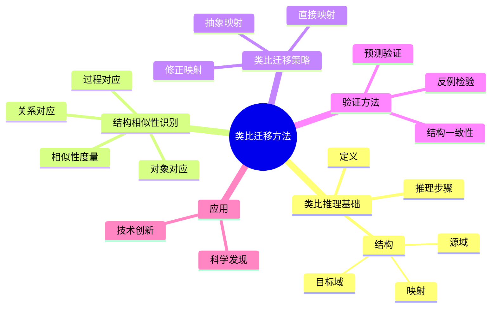
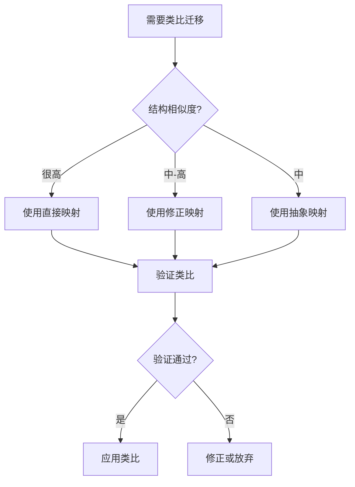
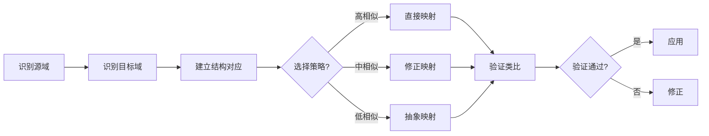
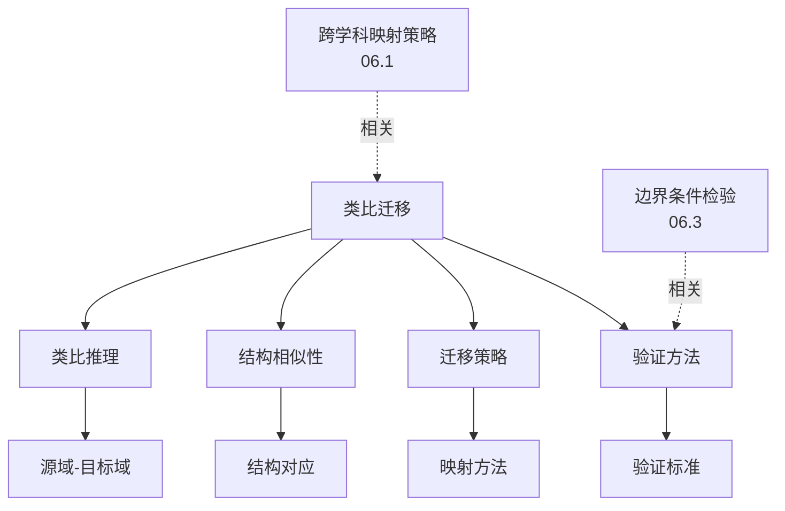
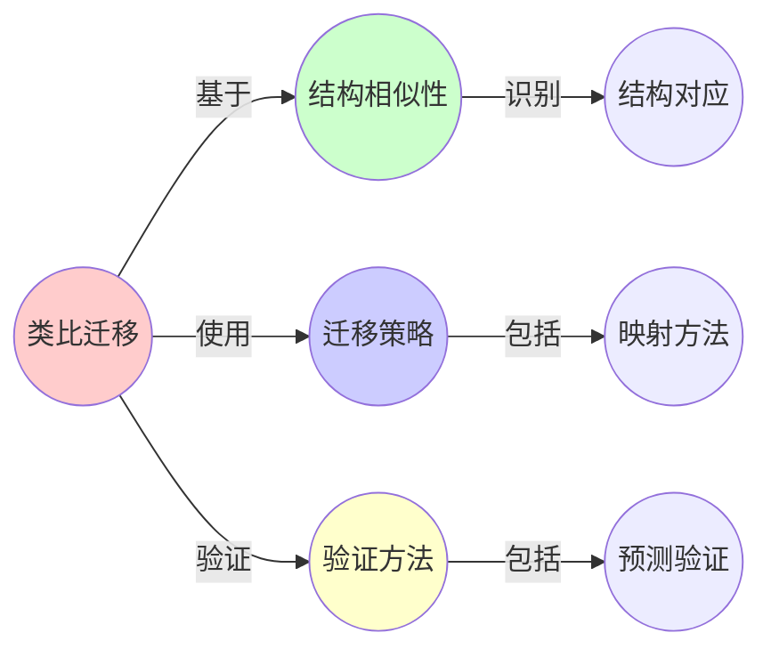
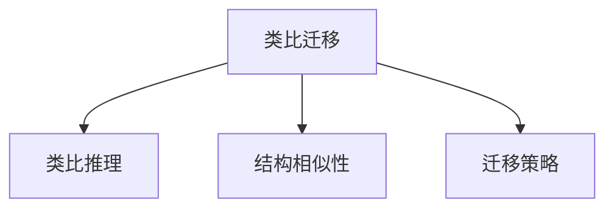

# 06.2 类比迁移方法

> **来源**: view01.md, view06.md
> **创建日期**: 2025-01-27
> **最后更新**: 2025-01-27

## 📋 目录

- [06.2 类比迁移方法](#062-类比迁移方法)
  - [📋 目录](#-目录)
  - [📋 内容概览](#-内容概览)
  - [🎯 核心理念](#-核心理念)
  - [🔍 类比推理基础](#-类比推理基础)
    - [定义](#定义)
    - [类比的结构](#类比的结构)
    - [类比推理步骤](#类比推理步骤)
  - [📊 结构相似性识别](#-结构相似性识别)
    - [结构对应](#结构对应)
      - [对象对应](#对象对应)
      - [关系对应](#关系对应)
      - [过程对应](#过程对应)
    - [结构相似性度量](#结构相似性度量)
      - [结构匹配度](#结构匹配度)
      - [结构一致性](#结构一致性)
  - [🔄 类比迁移策略](#-类比迁移策略)
    - [策略1：直接映射](#策略1直接映射)
    - [策略2：修正映射](#策略2修正映射)
    - [策略3：抽象映射](#策略3抽象映射)
  - [📈 类比迁移的验证](#-类比迁移的验证)
    - [验证方法](#验证方法)
      - [1. 结构一致性检验](#1-结构一致性检验)
      - [2. 预测验证](#2-预测验证)
      - [3. 反例检验](#3-反例检验)
    - [验证标准](#验证标准)
  - [🎯 类比迁移的应用](#-类比迁移的应用)
    - [应用1：科学发现](#应用1科学发现)
    - [应用2：技术创新](#应用2技术创新)
    - [应用3：问题解决](#应用3问题解决)
  - [⚠️ 类比迁移的陷阱](#️-类比迁移的陷阱)
    - [陷阱1：表面相似](#陷阱1表面相似)
    - [陷阱2：过度泛化](#陷阱2过度泛化)
    - [陷阱3：忽略边界条件](#陷阱3忽略边界条件)
    - [陷阱4：错误对应](#陷阱4错误对应)
  - [✅ 成功类比的特征](#-成功类比的特征)
    - [特征1：结构对应完整](#特征1结构对应完整)
    - [特征2：关系对应一致](#特征2关系对应一致)
    - [特征3：预测准确](#特征3预测准确)
    - [特征4：可扩展](#特征4可扩展)
  - [🔗 相关文档](#-相关文档)
  - [📖 扩展阅读](#-扩展阅读)

---

## 📋 内容概览

本文档阐述类比迁移的方法，包括类比推理基础、结构相似性识别等。类比迁移通过识别不同领域间的结构相似性，实现知识的跨领域应用和创新。

---

## 🎯 核心理念

类比迁移的核心是识别源域和目标域之间的结构对应关系。通过对象对应、关系对应和过程对应，我们可以将源域的知识、方法和工具迁移到目标域，实现跨学科的知识创新和应用拓展。

## 🔍 类比推理基础

### 定义

**类比**：基于两个领域间的结构相似性进行推理

**核心**：识别结构对应关系

### 类比的结构

**源域**（Source Domain）：已知领域

**目标域**（Target Domain）：待理解领域

**映射**：源域 → 目标域

### 类比推理步骤

1. **识别源域结构**
2. **识别目标域结构**
3. **建立结构对应**
4. **迁移知识**
5. **验证迁移有效性**

## 📊 结构相似性识别

### 结构对应

#### 对象对应

**源域对象** ↔ **目标域对象**

**实例**：

- 电路中的**电压** ↔ 流体中的**压力**
- 电路中的**电流** ↔ 流体中的**流量**
- 电路中的**电阻** ↔ 流体中的**阻力**

#### 关系对应

**源域关系** ↔ **目标域关系**

**实例**：

- 电路中的**欧姆定律** V = IR ↔ 流体中的**达西定律** ΔP = QR

#### 过程对应

**源域过程** ↔ **目标域过程**

**实例**：

- 电路中的**充电过程** ↔ 流体中的**填充过程**

### 结构相似性度量

#### 结构匹配度

**定义**：结构对应的完整程度

**度量**：

```text
相似度 = 匹配的结构数 / 总结构数
```

#### 结构一致性

**定义**：结构对应的一致性

**要求**：

- 对象对应一致
- 关系对应一致
- 过程对应一致

## 🔄 类比迁移策略

### 策略1：直接映射

**方法**：直接将源域结构映射到目标域

**适用**：结构高度相似

**风险**：可能忽略领域差异

### 策略2：修正映射

**方法**：映射后进行修正

**适用**：结构基本相似但有差异

**优势**：考虑领域差异

### 策略3：抽象映射

**方法**：先抽象出共同结构，再映射

**适用**：结构相似但细节不同

**优势**：抓住本质

## 📈 类比迁移的验证

### 验证方法

#### 1. 结构一致性检验

**检查**：结构对应是否一致

**方法**：验证所有结构对应的一致性

#### 2. 预测验证

**检查**：基于类比做出的预测是否正确

**方法**：实验验证预测

#### 3. 反例检验

**检查**：是否存在反例

**方法**：寻找不符合类比的情况

### 验证标准

**成功标准**：

1. 结构对应一致
2. 预测得到验证
3. 无重大反例

**失败标准**：

1. 结构对应不一致
2. 预测被证伪
3. 存在重大反例

## 🎯 类比迁移的应用

### 应用1：科学发现

**实例**：

- **达尔文**：从马尔萨斯人口论类比到自然选择
- **开普勒**：从音乐和谐类比到行星运动
- **麦克斯韦**：从流体类比到电磁场

### 应用2：技术创新

**实例**：

- **飞机设计**：从鸟类飞行类比
- **潜艇设计**：从鱼类游泳类比
- **雷达技术**：从蝙蝠回声定位类比

### 应用3：问题解决

**实例**：

- **算法设计**：从其他算法类比
- **系统设计**：从其他系统类比
- **策略制定**：从历史案例类比

## ⚠️ 类比迁移的陷阱

### 陷阱1：表面相似

**问题**：只看到表面相似，忽略本质差异

**避免**：深入分析结构

### 陷阱2：过度泛化

**问题**：将局部相似性推广到全局

**避免**：明确适用范围

### 陷阱3：忽略边界条件

**问题**：忽略类比的边界条件

**避免**：明确边界条件

### 陷阱4：错误对应

**问题**：建立错误的结构对应

**避免**：仔细验证对应关系

## ✅ 成功类比的特征

### 特征1：结构对应完整

**要求**：主要结构都有对应

**验证**：结构匹配度高

### 特征2：关系对应一致

**要求**：关系对应保持一致

**验证**：关系对应一致

### 特征3：预测准确

**要求**：基于类比做出的预测准确

**验证**：预测得到验证

### 特征4：可扩展

**要求**：类比可以扩展到新情况

**验证**：在新情况下仍然有效

## 📊 思维表征体系

### 📊 1. 思维导图（增强版）

#### 1.1 文本格式（基础版）

```text
类比迁移方法
├── 类比推理基础
│   ├── 定义
│   ├── 结构
│   │   ├── 源域
│   │   ├── 目标域
│   │   └── 映射
│   └── 推理步骤
├── 结构相似性识别
│   ├── 结构对应
│   │   ├── 对象对应
│   │   ├── 关系对应
│   │   └── 过程对应
│   └── 相似性度量
│       ├── 结构匹配度
│       └── 结构一致性
├── 类比迁移策略
│   ├── 直接映射
│   ├── 修正映射
│   └── 抽象映射
├── 验证方法
│   ├── 结构一致性检验
│   ├── 预测验证
│   └── 反例检验
└── 应用
    ├── 科学发现
    ├── 技术创新
    └── 问题解决
```

#### 1.2 Mermaid格式（可视化版）



### 📊 2. 多维对比矩阵

#### 2.1 类比迁移策略对比矩阵

| 维度 | 直接映射 | 修正映射 | 抽象映射 | 适用场景 |
|------|---------|---------|---------|---------|
| **相似度要求** | 很高 | 中-高 | 中 | 要求不同 |
| **修正程度** | 无 | 中 | 高 | 修正不同 |
| **风险** | 高 | 中 | 低 | 风险不同 |
| **适用性** | 有限 | 广 | 很广 | 适用性不同 |
| **复杂度** | 低 | 中 | 高 | 复杂度不同 |

#### 2.2 验证方法对比矩阵

| 维度 | 结构一致性检验 | 预测验证 | 反例检验 | 有效性 |
|------|--------------|---------|---------|--------|
| **验证类型** | 结构 | 结果 | 反例 | 类型不同 |
| **难度** | 中 | 高 | 中 | 难度不同 |
| **可靠性** | 中 | 高 | 高 | 可靠性不同 |
| **应用** | 初期 | 验证 | 全面 | 应用不同 |

#### 2.3 成功类比特征对比矩阵

| 维度 | 结构对应完整 | 关系对应一致 | 预测准确 | 可扩展 | 重要性 |
|------|------------|------------|---------|--------|--------|
| **重要性** | 高 | 很高 | 很高 | 高 | 都很重要 |
| **验证难度** | 中 | 中 | 高 | 高 | 难度不同 |
| **成功影响** | 高 | 很高 | 很高 | 中 | 影响不同 |

### 🌲 3. 决策树

#### 3.1 类比迁移方法选择决策树



### 🛤️ 4. 决策逻辑路径

#### 4.1 类比迁移完整路径



### 🕸️ 5. 概念关系网络

#### 5.1 类比迁移概念关系网络



### 🗺️ 6. 知识图谱

#### 6.1 类比迁移知识图谱



## 📚 理论体系

### 理论基础

#### 认知科学/哲学基础

类比迁移的理论基础：

**1. 认知科学基础**：

- 类比推理
- 结构映射理论
- 认知模型

**2. 哲学基础**：

- 科学类比
- 科学发现
- 知识迁移

**3. 逻辑基础**：

- 结构对应
- 关系映射
- 推理验证

#### 历史发展

**关键时间节点**：

- **古代**：类比推理的早期应用
  - 亚里士多德的类比
  - 古代科学类比

- **17-18世纪**：科学类比
  - 牛顿的光学类比
  - 麦克斯韦的电磁类比

- **20世纪**：认知科学研究
  - Gentner的结构映射理论
  - Holyoak的类比推理

- **21世纪**：计算化发展
  - 类比推理算法
  - 自动类比系统

### 理论框架

#### 核心假设

**假设1：结构相似性**

- **内容**：类比基于结构相似性而非表面相似性
- **适用范围**：大多数类比
- **限制条件**：需要明确的 structure

**假设2：结构映射**

- **内容**：类比通过结构映射实现
- **适用范围**：结构类比
- **限制条件**：需要可映射的结构

**假设3：验证必要性**

- **内容**：类比需要验证
- **适用范围**：所有类比
- **限制条件**：验证方法可能有限

#### 基本概念体系



#### 主要定理/结论

**结论1：结构映射的有效性**

- **内容**：结构映射比表面映射更有效
- **证据**：认知科学研究
- **应用**：类比推理

**结论2：验证的重要性**

- **内容**：验证是类比成功的关键
- **证据**：大量案例
- **应用**：类比应用

**结论3：修正的必要性**

- **内容**：大多数类比需要修正
- **证据**：实际应用
- **应用**：类比迁移

#### 适用范围和边界

**适用范围**：

- 跨学科知识迁移
- 科学发现
- 问题解决

**边界条件**：

- 需要结构相似性
- 需要明确的源域和目标域
- 需要验证方法

**不适用场景**：

- 无结构相似性
- 不可验证的类比
- 完全不同的领域

### 当前知识共识

#### 学术界共识

**广泛接受的共识**：

1. **结构相似性的重要性**
   - **共识**：结构相似性比表面相似性更重要
   - **支持证据**：认知科学研究
   - **来源**：认知科学

2. **验证的必要性**
   - **共识**：类比需要验证
   - **支持证据**：失败案例
   - **来源**：科学哲学

3. **修正的普遍性**
   - **共识**：大多数类比需要修正
   - **支持证据**：实际应用
   - **来源**：科学实践

#### 主要争议点

1. **自动类比的可能性**
   - **观点A**：可以实现自动类比
   - **观点B**：需要人类判断
   - **当前状态**：多数认为部分自动化可能

2. **类比的普遍性**
   - **观点A**：类比是普遍方法
   - **观点B**：只在特定情况下有效
   - **当前状态**：多数认为广泛有效但有局限

#### 权威来源

**经典文献**：

- 《Analogy and Structure》- Ryszard S. Michalski
- 《The Analogical Mind》- Dedre Gentner
- 《Structure-Mapping Theory》- 认知科学文献

**权威机构/专家**：

- **认知科学研究会**
- **类比推理研究组**
- **科学哲学研究会**

**最新发展**：

- **2020-2024**：计算类比、自动类比系统、类比学习
- **前沿方向**：深度学习中的类比、自动类比发现、类比验证

### 与其他理论的关系

#### 逻辑关系

**理论基础**：

- **跨学科映射策略**（[06.1_跨学科映射策略.md](06.1_跨学科映射策略.md)） → 类比迁移方法
  - 关系类型：方法实现
  - 关键映射：策略 → 方法

**理论应用**：

- **边界条件检验**（[06.3_边界条件检验.md](06.3_边界条件检验.md)） → 类比迁移方法
  - 关系类型：验证方法
  - 关键映射：检验 → 验证

#### 映射关系

| 本理论概念 | 映射理论 | 映射概念 | 映射类型 | 映射说明 |
|-----------|---------|---------|---------|----------|
| **结构对应** | 06.1_跨学科映射策略 | 结构映射 | 对应 | 结构对应实现结构映射 |
| **验证方法** | 06.3_边界条件检验 | 边界检验 | 对应 | 验证包含边界检验 |
| **类比迁移** | 02.5_跨学科动力学映射 | 动力学映射 | 相关 | 类比用于动力学映射 |
| **结构相似性** | 03_范畴论与形式化方法 | 范畴结构 | 相关 | 结构相似性对应范畴结构 |

## 🔗 关联网络

### 🔗 概念级关联

#### 核心概念映射

| 本文档概念 | 关联文档 | 关联概念 | 关系类型 | 映射说明 |
|-----------|---------|---------|---------|----------|
| **结构对应** | 06.1_跨学科映射策略 | 结构映射 | 对应 | 结构对应实现结构映射 |
| **验证方法** | 06.3_边界条件检验 | 边界检验 | 对应 | 验证包含边界检验 |
| **类比迁移** | 02.5_跨学科动力学映射 | 动力学映射 | 相关 | 类比用于动力学映射 |
| **结构相似性** | 03_范畴论与形式化方法 | 范畴结构 | 相关 | 结构相似性对应范畴结构 |
| **源域-目标域** | 06.1_跨学科映射策略 | 领域映射 | 对应 | 源域-目标域是领域映射 |
| **迁移策略** | 06.4_混合建模 | 建模策略 | 相关 | 迁移策略用于建模 |
| **预测验证** | 06.3_边界条件检验 | 预测检验 | 对应 | 预测验证对应预测检验 |

### 🔗 理论级关联

#### 理论基础

- **本理论基于**：
  - [06.1_跨学科映射策略.md](06.1_跨学科映射策略.md) ⭐⭐⭐ - 跨学科映射策略
  - 认知科学基础 ⭐⭐

- **本理论应用于**：
  - [06.3_边界条件检验.md](06.3_边界条件检验.md) ⭐⭐⭐ - 边界条件检验
  - [06.4_混合建模.md](06.4_混合建模.md) ⭐⭐ - 混合建模
  - [02.5_跨学科动力学映射.md](../02_动力学系统理论/02.5_跨学科动力学映射.md) ⭐⭐ - 动力学映射

### 🔗 方法级关联

#### 方法应用网络

| 本文档方法 | 应用文档 | 应用场景 | 应用效果 |
|-----------|---------|---------|---------|
| **类比迁移方法** | 06.3_边界条件检验 | 结构验证 | 成功 |
| **结构对应方法** | 06.4_混合建模 | 模型映射 | 成功 |
| **验证方法** | 06.5_跨学科映射案例 | 案例验证 | 成功 |

### 🔗 应用场景关联

**场景**：跨学科知识迁移

| 视角 | 关联文档 | 核心理论 | 关注点 |
|------|---------|---------|--------|
| **迁移方法** | 本文档 | 类比迁移 | 如何迁移 |
| **验证** | 06.3_边界条件检验 | 边界检验 | 如何验证 |
| **建模** | 06.4_混合建模 | 混合建模 | 如何建模 |

## 🛤️ 学习路径

### 前置知识

**必须先学习**：

- [06.1_跨学科映射策略.md](06.1_跨学科映射策略.md) ⭐⭐⭐ - 跨学科映射策略
- 基础认知科学 ⭐

**建议先了解**：

- 科学哲学
- 类比推理基础
- 结构理论

### 后续学习

**建议接下来学习**（按顺序）：

1. [06.3_边界条件检验.md](06.3_边界条件检验.md) ⭐⭐⭐ - 边界条件检验
2. [06.4_混合建模.md](06.4_混合建模.md) ⭐⭐ - 混合建模
3. [06.5_跨学科映射案例.md](06.5_跨学科映射案例.md) ⭐⭐ - 映射案例

### 并行学习

**可以同时学习**：

- [02.5_跨学科动力学映射.md](../02_动力学系统理论/02.5_跨学科动力学映射.md) - 动力学映射
- [03_范畴论与形式化方法](../03_范畴论与形式化方法/) - 形式化方法

## 🔗 相关文档

- [06.1_跨学科映射策略.md](06.1_跨学科映射策略.md)
- [06.3_边界条件检验.md](06.3_边界条件检验.md)
- [06.4_混合建模.md](06.4_混合建模.md)
- [02_动力学系统理论/02.5_跨学科动力学映射.md](../02_动力学系统理论/02.5_跨学科动力学映射.md)

## 📖 扩展阅读

- 《Analogy and Structure》- Ryszard S. Michalski
- 《The Analogical Mind》- Dedre Gentner
