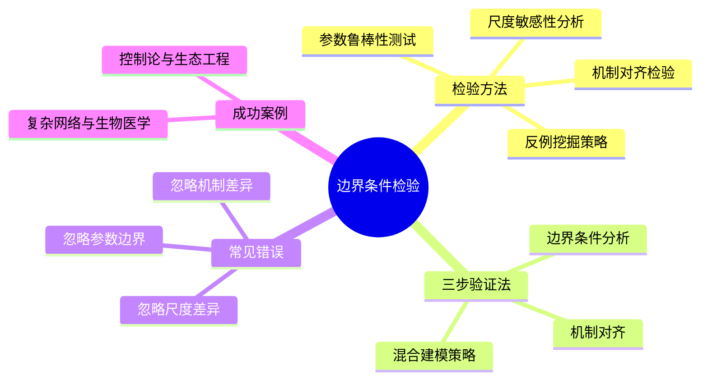
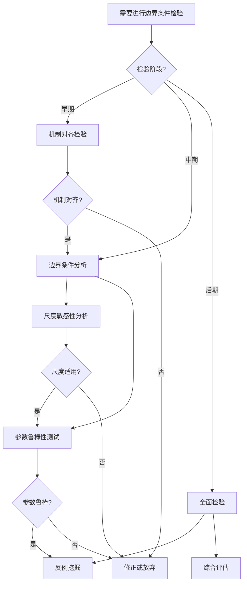
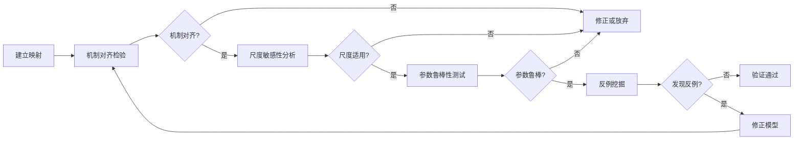
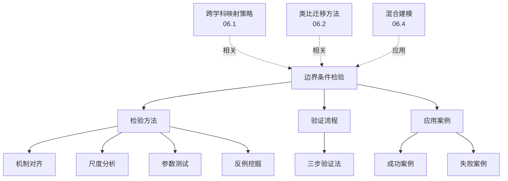
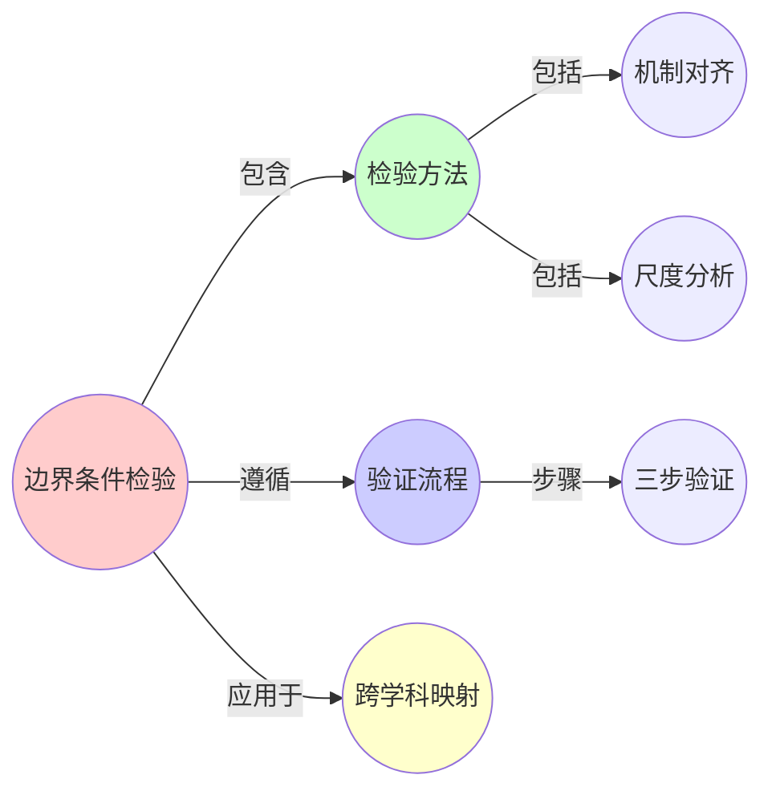
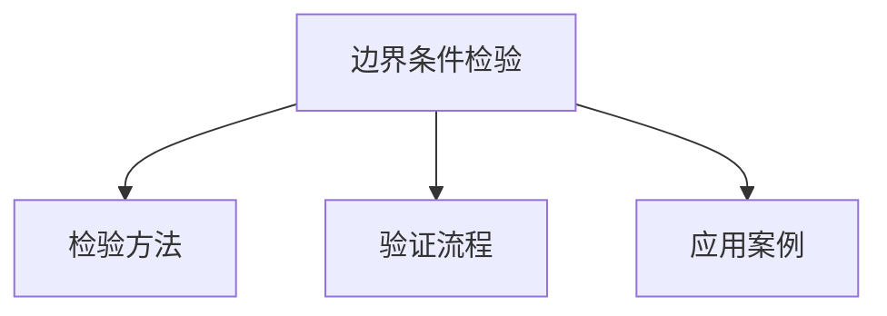

# 06.3 边界条件检验

> **来源**: view01.md, view03.md
> **创建日期**: 2025-01-27
> **最后更新**: 2025-01-27

## 📋 目录

- [06.3 边界条件检验](#063-边界条件检验)
  - [📋 目录](#-目录)
  - [📋 内容概览](#-内容概览)
  - [🎯 核心理念](#-核心理念)
  - [🔍 检验方法](#-检验方法)
  - [📊 三步验证法](#-三步验证法)
  - [⚠️ 常见错误](#️-常见错误)
  - [✅ 成功案例](#-成功案例)
  - [❌ 失败案例](#-失败案例)
  - [📊 详细案例研究](#-详细案例研究)
  - [⚠️ 批判性分析与局限性](#️-批判性分析与局限性)
  - [📊 思维导图](#-思维导图)
  - [🔗 相关文档](#-相关文档)
  - [📖 扩展阅读](#-扩展阅读)

---

## 📋 内容概览

本文档阐述跨学科映射中的边界条件检验方法，确保模型迁移的有效性。通过机制对齐检验、尺度敏感性分析、参数鲁棒性测试和反例挖掘，我们可以验证和修正跨领域映射，确保模型的有效应用。

---

## 🎯 核心理念

边界条件检验是跨学科映射的关键环节。通过系统化的检验方法，我们可以识别模型适用的边界条件，发现机制差异，修正模型错误，确保跨领域知识迁移的有效性和可靠性。

## 🔍 检验方法

### 1. 机制对齐检验

**目的**：确认源领域与目标领域的因果机制是否兼容

**检验步骤**：

1. 识别源领域的因果机制
2. 识别目标领域的因果机制
3. 比较机制的一致性
4. 识别机制差异

**实例**：

- **机械系统**：线性响应（F = kx）
- **生物系统**：非线性阈值（激活函数）
- **检验结果**：机制不兼容，需要修正模型

### 2. 尺度敏感性分析

**目的**：验证模型是否适用于目标领域的时空尺度

**检验步骤**：

1. 确定源领域的尺度
2. 确定目标领域的尺度
3. 分析尺度差异的影响
4. 调整模型以适应尺度

**实例**：

- **图论小世界特性**：在社交网络（宏观尺度）成立
- **分子生物学**：在纳米尺度可能失效
- **检验结果**：需要引入尺度修正项

### 3. 参数鲁棒性测试

**目的**：验证模型在参数变化下的稳定性

**检验步骤**：

1. 识别关键参数
2. 参数敏感性分析
3. 鲁棒性测试
4. 参数范围确定

**实例**：

- **复杂网络模型**：预测电网故障
- **参数**：负载分布
- **检验**：验证模型在不同负载分布下的稳定性

### 4. 反例挖掘策略

**目的**：寻找模型失效的边界案例

**检验步骤**：

1. 识别模型假设
2. 寻找违反假设的情况
3. 分析反例特征
4. 修正模型或明确边界

**实例**：

- **控制论到生态学**：搜索"无反馈调节的生态系统"
- **反例**：极端干旱地区的荒漠化过程
- **结果**：明确模型边界条件

## 📊 三步验证法

### 步骤1：机制对齐检验

确认源领域与目标领域的因果机制是否兼容。

**检查清单**：

- [ ] 因果链是否一致？
- [ ] 反馈机制是否相同？
- [ ] 非线性特性是否匹配？
- [ ] 时间尺度是否兼容？

### 步骤2：边界条件分析

明确模型适用的参数范围。

**检查清单**：

- [ ] 参数范围是否合理？
- [ ] 极端情况是否处理？
- [ ] 边界效应是否考虑？
- [ ] 失效条件是否明确？

### 步骤3：混合建模策略

将形式模型与领域特有规则结合。

**检查清单**：

- [ ] 领域规则是否整合？
- [ ] 修正项是否添加？
- [ ] 混合模型是否验证？
- [ ] 实际效果是否评估？

## ⚠️ 常见错误

### 错误1：忽略机制差异

**问题**：直接应用形式模型，忽略领域机制差异

**实例**：将机械系统的能量守恒直接应用到经济系统（货币可以创造/销毁）

**解决**：进行机制对齐检验，识别差异并修正

### 错误2：忽略尺度差异

**问题**：在不同尺度间直接迁移模型

**实例**：将宏观网络模型应用到微观系统

**解决**：进行尺度敏感性分析，引入尺度修正

### 错误3：忽略参数边界

**问题**：未明确模型适用的参数范围

**实例**：统计物理模型在金融市场中仅适用于中等波动场景

**解决**：进行参数鲁棒性测试，明确参数范围

### 错误4：忽略反例

**问题**：未寻找模型失效的边界案例

**实例**：控制论模型在极端环境下的失效

**解决**：主动挖掘反例，明确模型边界

## ✅ 成功案例

### 案例1：控制论与生态工程

**场景**：湿地生态修复中的水位调控

**模型迁移**：

- 采用PID控制器（工程控制论）
- 结合生态系统的滞回特性（Hysteresis）

**关键修正**：

- 在传统PID参数中引入**时间延迟补偿项**
- 匹配生态系统的慢响应特性

**结果**：成功恢复了Florida大沼泽地的水文平衡

### 案例2：复杂网络理论与生物医学

**场景**：癌症基因调控网络分析

**模型迁移**：

- 使用复杂网络的小世界特性
- 构建癌症基因突变传播的动态模型

**关键修正**：

- 引入生物学的代谢约束
- 考虑基因表达的时空动态

**结果**：成功预测了KRAS突变在胰腺癌中的关键节点

## ❌ 失败案例

### 案例1：经济学中的动力系统误用

**场景**：2008年金融危机前的市场预测模型

**模型缺陷**：

- 使用线性微分方程建模市场波动
- 忽略金融系统的**多重均衡**
- 忽略**极端事件敏感性**

**结果**：模型对次贷危机的预警失效

**教训**：

- 需将非线性项（如赫斯特指数）纳入模型
- 需考虑外部冲击项
- 需明确模型边界条件

## 📊 详细案例研究

### 案例研究 1：控制论在生态工程中的成功应用

**背景**：将PID控制论应用到湿地生态修复中的水位调控。

**形式化分析**：

```text
边界条件检验:
1. 机制对齐检验:
   - PID控制器: 反馈控制机制
   - 生态系统: 滞后响应特性
   - 对齐结果: 基本对齐，但需时间延迟补偿

2. 尺度敏感性分析:
   - 控制响应时间: 秒级
   - 生态响应时间: 天级
   - 修正: 引入时间延迟补偿项

3. 参数鲁棒性测试:
   - PID参数: Kp, Ki, Kd
   - 生态参数: 系统容量、响应速率
   - 测试: 不同生态条件下的稳定性

4. 反例挖掘:
   - 极端干旱: 系统失效
   - 极端洪水: 系统失效
   - 边界: 明确适用范围

修正策略:
- 时间延迟补偿项: τ_delay
- 生态约束: 考虑生态阈值
- 混合模型: PID + 生态规则

应用效果:
- 成功恢复水文平衡
- 系统稳定性提高
- 生态功能恢复
```

**关键发现**：

- ✅ 机制对齐检验识别了时间延迟问题
- ✅ 尺度分析指导了修正策略
- ✅ 边界条件明确了适用范围

**应用价值**：

- ✅ 生态工程
- ✅ 系统设计
- ✅ 模型修正

### 案例研究 2：复杂网络理论在生物医学中的应用验证

**背景**：将复杂网络理论应用到癌症基因调控网络分析。

**形式化分析**：

```text
边界条件检验:
1. 机制对齐检验:
   - 网络理论: 拓扑结构
   - 生物系统: 功能网络
   - 对齐结果: 结构相似，需功能约束

2. 尺度敏感性分析:
   - 网络尺度: 节点数、边数
   - 生物尺度: 基因数、相互作用
   - 修正: 考虑生物尺度效应

3. 参数鲁棒性测试:
   - 网络参数: 度分布、聚类系数
   - 生物参数: 表达水平、调控强度
   - 测试: 不同癌症类型的稳定性

4. 反例挖掘:
   - 单基因突变: 网络模型可能失效
   - 环境因素: 需要考虑
   - 边界: 明确模型限制

修正策略:
- 生物约束: 代谢约束、表达约束
- 动态性: 考虑时间动态
- 功能关系: 整合功能信息

应用效果:
- 成功预测关键基因
- 发现新的调控机制
- 指导药物开发
```

**关键发现**：

- ✅ 边界条件检验保证了模型有效性
- ✅ 生物约束修正提高了准确性
- ✅ 混合建模实现了成功应用

**应用价值**：

- ✅ 生物医学研究
- ✅ 疾病机制理解
- ✅ 药物开发

### 案例研究 3：经济学中动力系统的误用教训

**背景**：2008年金融危机前的市场预测模型误用线性动力系统。

**形式化分析**：

```text
边界条件检验缺失:
1. 机制对齐检验缺失:
   - 线性系统: 线性响应
   - 金融市场: 非线性、多重均衡
   - 问题: 机制不对齐

2. 尺度敏感性分析缺失:
   - 模型尺度: 中等波动
   - 实际尺度: 极端波动
   - 问题: 尺度不匹配

3. 参数鲁棒性测试不足:
   - 参数范围: 正常市场条件
   - 实际范围: 包括极端情况
   - 问题: 参数范围过窄

4. 反例挖掘不足:
   - 极端事件: 未充分考虑
   - 系统性风险: 未纳入模型
   - 问题: 边界条件不明确

失败原因:
- 忽略非线性特性
- 忽略多重均衡
- 忽略极端事件
- 边界条件不明确

教训:
- 必须进行机制对齐检验
- 必须考虑尺度敏感性
- 必须明确边界条件
- 必须进行反例挖掘
```

**关键发现**：

- ✅ 边界条件检验缺失导致模型失效
- ✅ 机制不对齐是根本问题
- ✅ 明确边界条件很重要

**应用价值**：

- ✅ 避免类似错误
- ✅ 改进建模方法
- ✅ 提高模型可靠性

## ⚠️ 批判性分析与局限性

### 局限性讨论

#### 1. 检验方法的复杂性

**问题**：边界条件检验可能需要大量工作。

**挑战**：

- ⚠️ 检验步骤多
- ⚠️ 需要专业知识
- ⚠️ 时间和资源消耗大

**应对策略**：

- ✅ 简化检验流程
- ✅ 开发自动化工具
- ✅ 提供检验指南

#### 2. 边界条件的确定困难

**问题**：确定边界条件可能困难。

**挑战**：

- ⚠️ 边界可能模糊
- ⚠️ 需要大量测试
- ⚠️ 可能遗漏边界情况

**改进方向**：

- ✅ 系统化方法
- ✅ 自动化测试
- ✅ 机器学习辅助

#### 3. 检验的完整性问题

**问题**：如何确保检验的完整性。

**挑战**：

- ⚠️ 可能遗漏某些方面
- ⚠️ 检验标准不统一
- ⚠️ 验证困难

**改进方向**：

- ✅ 建立标准流程
- ✅ 检查清单
- ✅ 同行评审

### 改进方向

#### 1. 自动化检验工具

**目标**：开发自动化检验工具。

**方法**：

- 机制对齐自动化
- 参数测试自动化
- 反例生成自动化

#### 2. 标准化检验流程

**目标**：建立标准化检验流程。

**方法**：

- 标准流程
- 检查清单
- 最佳实践

## 📊 思维表征体系

### 📊 1. 思维导图（增强版）

#### 1.1 文本格式（基础版）

```text
边界条件检验
├── 检验方法
│   ├── 机制对齐检验
│   │   ├── 目的
│   │   ├── 检验步骤
│   │   └── 实例
│   ├── 尺度敏感性分析
│   │   ├── 目的
│   │   ├── 检验步骤
│   │   └── 实例
│   ├── 参数鲁棒性测试
│   │   ├── 目的
│   │   ├── 检验步骤
│   │   └── 实例
│   └── 反例挖掘策略
│       ├── 目的
│       ├── 检验步骤
│       └── 实例
├── 三步验证法
│   ├── 步骤1: 机制对齐检验
│   ├── 步骤2: 边界条件分析
│   └── 步骤3: 混合建模策略
├── 常见错误
│   ├── 忽略机制差异
│   ├── 忽略尺度差异
│   ├── 忽略参数边界
│   └── 忽略反例
├── 成功案例
│   ├── 控制论与生态工程
│   └── 复杂网络与生物医学
└── 失败案例
    └── 经济学动力系统误用
```

#### 1.2 Mermaid格式（可视化版）



### 📊 2. 多维对比矩阵

#### 2.1 检验方法对比矩阵

| 维度 | 机制对齐检验 | 尺度敏感性分析 | 参数鲁棒性测试 | 反例挖掘 | 重要性 |
|------|------------|--------------|--------------|---------|--------|
| **检验类型** | 机制 | 尺度 | 参数 | 反例 | 类型不同 |
| **难度** | 高 | 中 | 中 | 中 | 难度不同 |
| **可靠性** | 很高 | 高 | 高 | 很高 | 可靠性不同 |
| **发现的问题** | 机制不兼容 | 尺度不适用 | 参数敏感 | 映射失效 | 问题不同 |
| **应用阶段** | 早期 | 中期 | 中期 | 全程 | 阶段不同 |

#### 2.2 验证步骤对比矩阵

| 步骤 | 步骤1: 机制对齐 | 步骤2: 边界条件 | 步骤3: 混合建模 | 关系 |
|------|---------------|---------------|---------------|------|
| **目标** | 检验机制兼容性 | 分析边界条件 | 修正模型 | 目标不同 |
| **方法** | 机制对比 | 边界分析 | 模型修正 | 方法不同 |
| **重要性** | 很高 | 高 | 高 | 都很重要 |
| **发现的问题** | 机制差异 | 边界限制 | 需要修正 | 问题不同 |

#### 2.3 成功/失败案例对比矩阵

| 维度 | 成功案例 | 失败案例 | 差异 | 启示 |
|------|---------|---------|------|------|
| **机制对齐** | 是 | 否 | 关键差异 | 机制对齐是关键 |
| **边界条件** | 明确 | 模糊 | 重要差异 | 边界条件重要 |
| **验证充分性** | 充分 | 不足 | 关键差异 | 需要充分验证 |
| **应用效果** | 好 | 差 | 结果不同 | 验证影响效果 |

### 🌲 3. 决策树

#### 3.1 边界条件检验决策树



### 🛤️ 4. 决策逻辑路径

#### 4.1 边界条件检验完整路径



### 🕸️ 5. 概念关系网络

#### 5.1 边界条件检验概念关系网络



### 🗺️ 6. 知识图谱

#### 6.1 边界条件检验知识图谱



## 📚 理论体系

### 理论基础

#### 科学哲学/方法论基础

边界条件检验的理论基础：

**1. 科学哲学基础**：
- 科学验证理论
- 科学方法
- 模型验证

**2. 方法论基础**：
- 系统分析方法
- 检验理论
- 边界分析

**3. 逻辑基础**：
- 反例逻辑
- 证伪理论
- 验证逻辑

#### 历史发展

**关键时间节点**：

- **古代-近代**：边界条件概念的早期应用
  - 数学中的边界条件
  - 物理中的边界条件

- **20世纪**：科学方法的发展
  - 波普尔的证伪主义
  - 科学验证理论

- **21世纪**：跨学科映射中的边界条件
  - 机制对齐理论
  - 边界条件检验方法

### 理论框架

#### 核心假设

**假设1：机制对齐的重要性**
- **内容**：机制对齐是映射有效的必要条件
- **适用范围**：所有跨学科映射
- **限制条件**：需要明确的机制定义

**假设2：边界条件的普遍性**
- **内容**：所有映射都有边界条件
- **适用范围**：所有跨学科映射
- **限制条件**：边界可能不明确

**假设3：检验的必要性**
- **内容**：映射必须经过检验
- **适用范围**：所有跨学科映射
- **限制条件**：检验方法可能有限

#### 基本概念体系



#### 主要定理/结论

**结论1：机制对齐的必要性**
- **内容**：机制对齐是映射有效的必要条件
- **证据**：失败案例分析
- **应用**：映射验证

**结论2：边界条件的重要性**
- **内容**：边界条件限制映射的适用性
- **证据**：大量案例
- **应用**：映射应用

**结论3：检验的有效性**
- **内容**：系统化检验能发现映射问题
- **证据**：成功和失败案例
- **应用**：映射改进

#### 适用范围和边界

**适用范围**：
- 跨学科映射验证
- 模型迁移验证
- 理论应用验证

**边界条件**：
- 需要明确的映射
- 需要可检验的假设
- 需要检验方法

**不适用场景**：
- 不可检验的映射
- 无明确机制的映射
- 纯理论映射（部分情况）

### 当前知识共识

#### 学术界共识

**广泛接受的共识**：

1. **机制对齐的重要性**
   - **共识**：机制对齐是映射有效性的关键
   - **支持证据**：失败案例
   - **来源**：科学哲学、跨学科研究

2. **边界条件的普遍性**
   - **共识**：所有映射都有边界条件
   - **支持证据**：理论分析
   - **来源**：科学方法论

3. **检验的必要性**
   - **共识**：映射必须经过系统化检验
   - **支持证据**：失败案例
   - **来源**：科学方法

#### 主要争议点

1. **检验的充分性**
   - **观点A**：需要全面检验
   - **观点B**：部分检验足够
   - **当前状态**：多数认为需要充分检验

2. **机制对齐的标准**
   - **观点A**：需要严格对齐
   - **观点B**：部分对齐即可
   - **当前状态**：多数认为需要充分对齐

#### 权威来源

**经典文献**：
- 《Limits of Formalization in Complex Systems》- Springer
- 《The Structure of Scientific Revolutions》- Thomas Kuhn
- 科学哲学相关文献

**权威机构/专家**：
- **科学哲学研究会**
- **跨学科研究会**
- **方法论研究组**

**最新发展**：
- **2020-2024**：机制对齐理论、边界条件分析、检验自动化
- **前沿方向**：自动化检验、边界条件预测、机制对齐评估

### 与其他理论的关系

#### 逻辑关系

**理论基础**：
- **跨学科映射策略**（[06.1_跨学科映射策略.md](06.1_跨学科映射策略.md)） → 边界条件检验
  - 关系类型：验证方法
  - 关键映射：映射策略 → 边界检验

**理论应用**：
- **类比迁移方法**（[06.2_类比迁移方法.md](06.2_类比迁移方法.md)） → 边界条件检验
  - 关系类型：验证方法
  - 关键映射：类比迁移 → 边界检验

#### 映射关系

| 本理论概念 | 映射理论 | 映射概念 | 映射类型 | 映射说明 |
|-----------|---------|---------|---------|----------|
| **机制对齐检验** | 06.1_跨学科映射策略 | 机制对齐 | 对应 | 检验方法对应验证需求 |
| **边界条件分析** | 06.4_混合建模 | 边界条件 | 对应 | 分析方法对应建模需求 |
| **反例挖掘** | 06.2_类比迁移方法 | 反例检验 | 对应 | 反例挖掘对应验证方法 |

## 🔗 关联网络

### 🔗 概念级关联

#### 核心概念映射

| 本文档概念 | 关联文档 | 关联概念 | 关系类型 | 映射说明 |
|-----------|---------|---------|---------|----------|
| **机制对齐检验** | 06.1_跨学科映射策略 | 机制对齐 | 对应 | 检验方法对应验证需求 |
| **边界条件分析** | 06.4_混合建模 | 边界条件 | 对应 | 分析方法对应建模需求 |
| **反例挖掘** | 06.2_类比迁移方法 | 反例检验 | 对应 | 反例挖掘对应验证方法 |
| **三步验证法** | 06.1_跨学科映射策略 | 映射验证 | 对应 | 验证流程对应验证需求 |
| **尺度敏感性分析** | 02.4_分岔理论与相变 | 尺度分析 | 相关 | 尺度分析相关概念 |
| **参数鲁棒性测试** | 02.1_经典确定性动力学 | 参数分析 | 相关 | 参数分析相关概念 |

### 🔗 理论级关联

#### 理论基础

- **本理论基于**：
  - [06.1_跨学科映射策略.md](06.1_跨学科映射策略.md) ⭐⭐⭐ - 跨学科映射策略
  - [06.2_类比迁移方法.md](06.2_类比迁移方法.md) ⭐⭐ - 类比迁移方法

- **本理论应用于**：
  - [06.4_混合建模.md](06.4_混合建模.md) ⭐⭐⭐ - 混合建模
  - [06.5_跨学科映射案例.md](06.5_跨学科映射案例.md) ⭐⭐ - 映射案例
  - [02.5_跨学科动力学映射.md](../02_动力学系统理论/02.5_跨学科动力学映射.md) ⭐⭐ - 动力学映射

### 🔗 方法级关联

#### 方法应用网络

| 本文档方法 | 应用文档 | 应用场景 | 应用效果 |
|-----------|---------|---------|---------|
| **机制对齐检验** | 06.4_混合建模 | 模型验证 | 成功 |
| **边界条件分析** | 06.5_跨学科映射案例 | 案例分析 | 成功 |
| **三步验证法** | 02.5_跨学科动力学映射 | 映射验证 | 成功 |

### 🔗 应用场景关联

**场景**：跨学科映射验证

| 视角 | 关联文档 | 核心理论 | 关注点 |
|------|---------|---------|--------|
| **验证方法** | 本文档 | 边界条件检验 | 如何验证 |
| **映射策略** | 06.1_跨学科映射策略 | 映射策略 | 映射建立 |
| **建模方法** | 06.4_混合建模 | 混合建模 | 模型修正 |

## 🛤️ 学习路径

### 前置知识

**必须先学习**：
- [06.1_跨学科映射策略.md](06.1_跨学科映射策略.md) ⭐⭐⭐ - 跨学科映射策略
- [06.2_类比迁移方法.md](06.2_类比迁移方法.md) ⭐⭐ - 类比迁移方法

**建议先了解**：
- 科学方法
- 验证理论
- 系统分析

### 后续学习

**建议接下来学习**（按顺序）：
1. [06.4_混合建模.md](06.4_混合建模.md) ⭐⭐⭐ - 混合建模
2. [06.5_跨学科映射案例.md](06.5_跨学科映射案例.md) ⭐⭐ - 映射案例
3. [02.5_跨学科动力学映射.md](../02_动力学系统理论/02.5_跨学科动力学映射.md) ⭐⭐ - 动力学映射

### 并行学习

**可以同时学习**：
- [01.5_批判性分析.md](../01_形式科学基础理论/01.5_批判性分析.md) - 批判性分析
- [02.4_分岔理论与相变.md](../02_动力学系统理论/02.4_分岔理论与相变.md) - 相变理论

## 🔗 相关文档

- [06.1_跨学科映射策略.md](06.1_跨学科映射策略.md)
- [06.2_类比迁移方法.md](06.2_类比迁移方法.md)
- [06.4_混合建模.md](06.4_混合建模.md)
- [06.5_跨学科映射案例.md](06.5_跨学科映射案例.md)
- [01_形式科学基础理论/01.5_批判性分析.md](../01_形式科学基础理论/01.5_批判性分析.md)

## 📖 扩展阅读

- 《Limits of Formalization in Complex Systems》（Springer, 2021）
- 科学哲学相关文献
- Wikipedia: [Boundary Condition](https://en.wikipedia.org/wiki/Boundary_condition)
