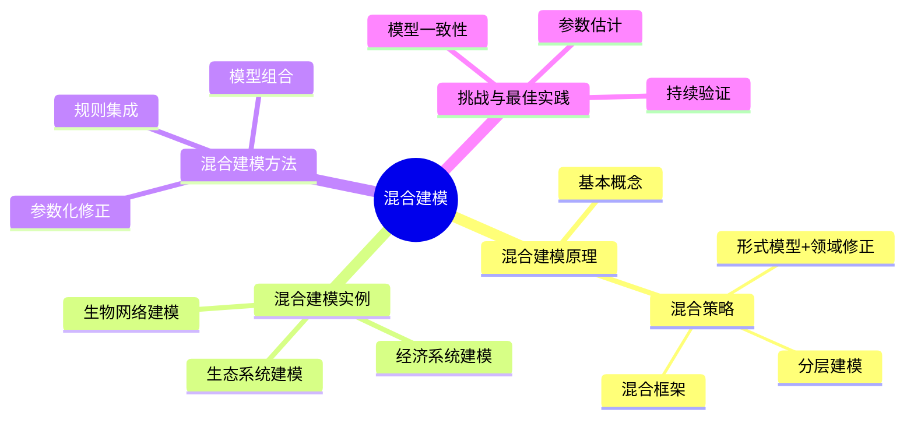
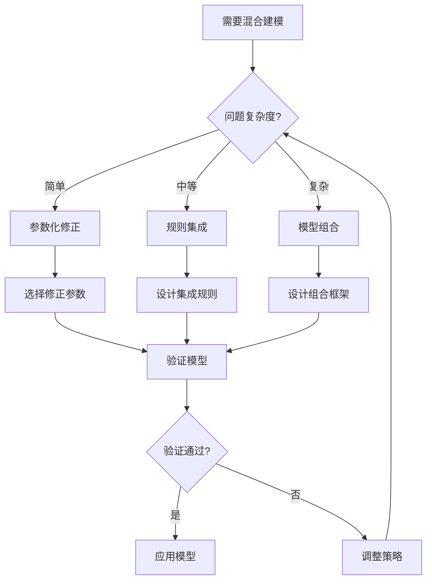
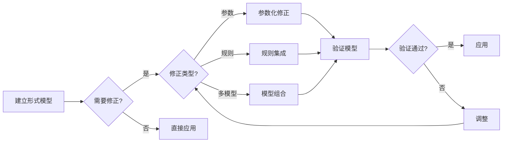
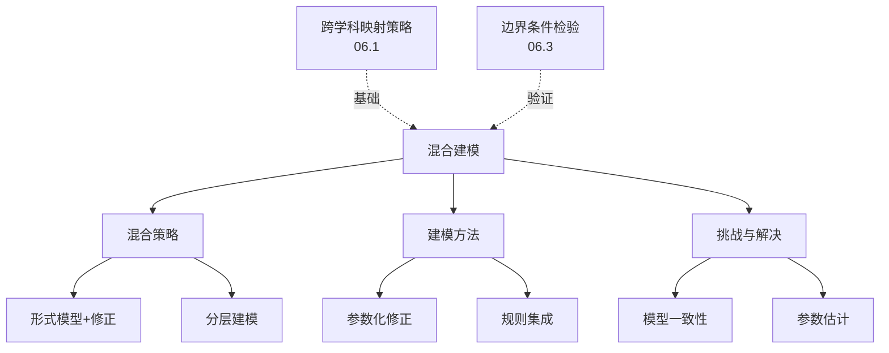
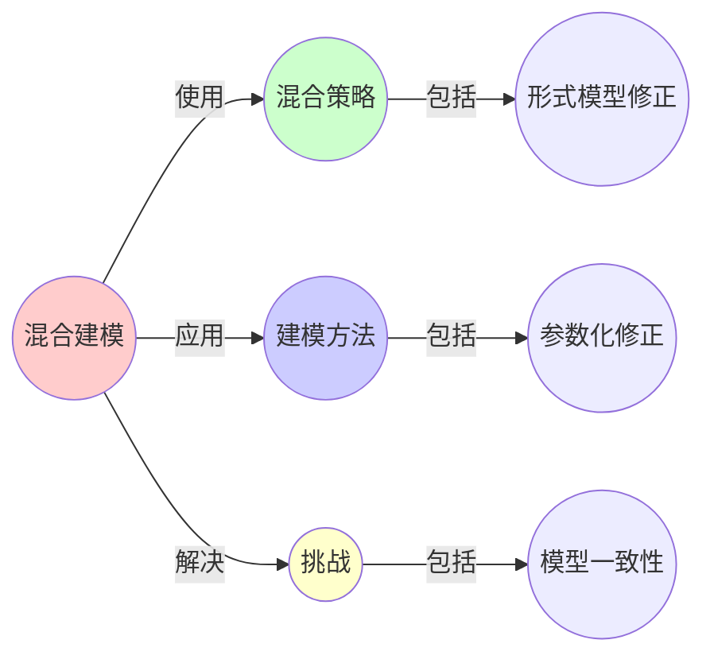
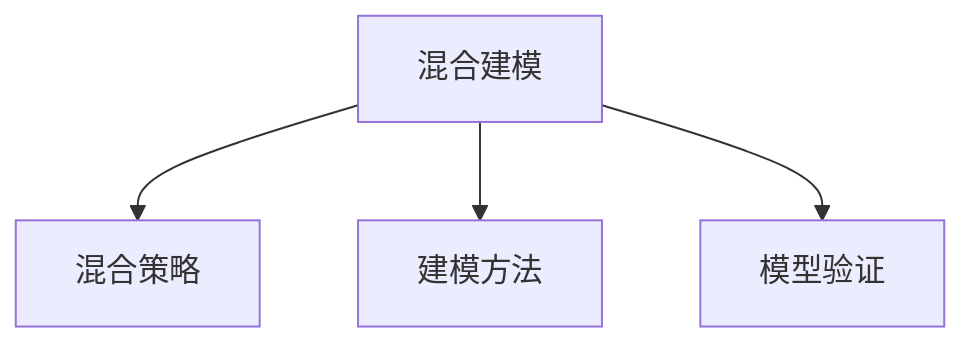

# 06.4 混合建模

> **来源**: view01.md, view06.md
> **创建日期**: 2025-01-27
> **最后更新**: 2025-01-27

## 📋 目录

- [06.4 混合建模](#064-混合建模)
  - [📋 目录](#-目录)
  - [📋 内容概览](#-内容概览)
  - [🎯 核心理念](#-核心理念)
  - [🔄 混合建模原理](#-混合建模原理)
    - [基本概念](#基本概念)
    - [混合策略](#混合策略)
      - [策略1：形式模型 + 领域修正](#策略1形式模型--领域修正)
      - [策略2：分层建模](#策略2分层建模)
      - [策略3：混合框架](#策略3混合框架)
  - [📊 混合建模实例](#-混合建模实例)
    - [实例1：生态系统建模](#实例1生态系统建模)
    - [实例2：经济系统建模](#实例2经济系统建模)
    - [实例3：生物网络建模](#实例3生物网络建模)
  - [🎯 混合建模方法](#-混合建模方法)
    - [方法1：参数化修正](#方法1参数化修正)
    - [方法2：规则集成](#方法2规则集成)
    - [方法3：模型组合](#方法3模型组合)
  - [⚠️ 混合建模的挑战](#️-混合建模的挑战)
    - [挑战1：模型一致性](#挑战1模型一致性)
    - [挑战2：参数估计](#挑战2参数估计)
    - [挑战3：模型验证](#挑战3模型验证)
  - [✅ 混合建模最佳实践](#-混合建模最佳实践)
    - [实践1：从简单开始](#实践1从简单开始)
    - [实践2：保持可解释性](#实践2保持可解释性)
    - [实践3：持续验证](#实践3持续验证)
  - [📊 详细案例研究](#-详细案例研究)
    - [案例研究 1：生态系统混合建模](#案例研究-1生态系统混合建模)
    - [案例研究 2：经济系统混合建模](#案例研究-2经济系统混合建模)
    - [案例研究 3：生物网络混合建模](#案例研究-3生物网络混合建模)
  - [⚠️ 批判性分析与局限性](#️-批判性分析与局限性)
    - [局限性讨论](#局限性讨论)
      - [1. 参数估计的复杂性](#1-参数估计的复杂性)
      - [2. 模型一致性问题](#2-模型一致性问题)
      - [3. 模型复杂度平衡](#3-模型复杂度平衡)
    - [改进方向](#改进方向)
      - [1. 开发自动化工具](#1-开发自动化工具)
      - [2. 建立最佳实践](#2-建立最佳实践)
  - [📊 思维表征体系](#-思维表征体系)
    - [📊 1. 思维导图（增强版）](#-1-思维导图增强版)
      - [1.1 文本格式（基础版）](#11-文本格式基础版)
      - [1.2 Mermaid格式（可视化版）](#12-mermaid格式可视化版)
    - [📊 2. 多维对比矩阵](#-2-多维对比矩阵)
      - [2.1 混合策略对比矩阵](#21-混合策略对比矩阵)
      - [2.2 混合建模方法对比矩阵](#22-混合建模方法对比矩阵)
      - [2.3 挑战对比矩阵](#23-挑战对比矩阵)
    - [🌲 3. 决策树](#-3-决策树)
      - [3.1 混合建模方法选择决策树](#31-混合建模方法选择决策树)
    - [🛤️ 4. 决策逻辑路径](#️-4-决策逻辑路径)
      - [4.1 混合建模完整路径](#41-混合建模完整路径)
    - [🕸️ 5. 概念关系网络](#️-5-概念关系网络)
      - [5.1 混合建模概念关系网络](#51-混合建模概念关系网络)
    - [🗺️ 6. 知识图谱](#️-6-知识图谱)
      - [6.1 混合建模知识图谱](#61-混合建模知识图谱)
  - [📚 理论体系](#-理论体系)
    - [理论基础](#理论基础)
      - [建模理论/系统科学基础](#建模理论系统科学基础)
      - [历史发展](#历史发展)
    - [理论框架](#理论框架)
      - [核心假设](#核心假设)
      - [基本概念体系](#基本概念体系)
      - [主要定理/结论](#主要定理结论)
      - [适用范围和边界](#适用范围和边界)
    - [当前知识共识](#当前知识共识)
      - [学术界共识](#学术界共识)
      - [主要争议点](#主要争议点)
      - [权威来源](#权威来源)
    - [与其他理论的关系](#与其他理论的关系)
      - [逻辑关系](#逻辑关系)
      - [映射关系](#映射关系)
  - [🔗 关联网络](#-关联网络)
    - [🔗 概念级关联](#-概念级关联)
      - [核心概念映射](#核心概念映射)
    - [🔗 理论级关联](#-理论级关联)
      - [理论基础](#理论基础-1)
    - [🔗 方法级关联](#-方法级关联)
      - [方法应用网络](#方法应用网络)
    - [🔗 应用场景关联](#-应用场景关联)
  - [🛤️ 学习路径](#️-学习路径)
    - [前置知识](#前置知识)
    - [后续学习](#后续学习)
    - [并行学习](#并行学习)
  - [🔗 相关文档](#-相关文档)
  - [📖 扩展阅读](#-扩展阅读)

---

## 📋 内容概览

本文档阐述混合建模方法，包括形式模型与领域规则结合的策略和实例。混合建模通过将通用形式模型与领域特有规则结合，既保持了形式化的优势，又考虑了领域的特殊性。

---

## 🎯 核心理念

混合建模的核心是在保持形式化的同时，考虑领域特殊性。通过形式模型+领域修正、分层建模和混合框架等策略，我们可以构建既通用又实用的模型，实现跨学科知识的有效应用。

## 🔄 混合建模原理

### 基本概念

**混合建模**：将形式模型与领域特有规则结合

**目标**：在保持形式化的同时，考虑领域特殊性

### 混合策略

#### 策略1：形式模型 + 领域修正

**方法**：使用形式模型，添加领域修正项

**优势**：保持形式化，考虑领域特殊性

**实例**：

- **生态模型**：Lotka-Volterra模型 + 环境修正
- **经济模型**：供需模型 + 行为修正

#### 策略2：分层建模

**方法**：不同层次使用不同模型

**优势**：在不同层次保持适当抽象

**实例**：

- **多尺度建模**：微观 + 宏观
- **多层次建模**：个体 + 群体

#### 策略3：混合框架

**方法**：构建混合框架，整合多种模型

**优势**：充分利用不同模型的优势

**实例**：

- **多模型集成**：集成多个模型
- **模型选择**：根据情况选择模型

## 📊 混合建模实例

### 实例1：生态系统建模

**形式模型**：Lotka-Volterra模型

**领域规则**：

- **环境变化**：考虑环境变化
- **空间异质性**：考虑空间异质性
- **随机性**：考虑随机扰动

**混合模型**：

```latex
\frac{dN_1}{dt} = r_1 N_1(1 - \frac{N_1}{K_1}) - \alpha_{12} N_1 N_2 + E(t) + \xi(t)
\frac{dN_2}{dt} = r_2 N_2(1 - \frac{N_2}{K_2}) - \alpha_{21} N_1 N_2 + E(t) + \xi(t)
```

- **E(t)**：环境修正项
- **ξ(t)**：随机扰动项

### 实例2：经济系统建模

**形式模型**：供需模型

**领域规则**：

- **行为偏差**：考虑行为偏差
- **市场摩擦**：考虑市场摩擦
- **政策影响**：考虑政策影响

**混合模型**：

```text
P = f(D, S) + B(P) + F(P) + G(t)
```

- **B(P)**：行为偏差项
- **F(P)**：市场摩擦项
- **G(t)**：政策影响项

### 实例3：生物网络建模

**形式模型**：复杂网络模型

**领域规则**：

- **生物约束**：考虑生物约束
- **动态性**：考虑动态变化
- **功能**：考虑功能关系

**混合模型**：

```text
网络结构 = 形式模型 + 生物约束 + 动态规则 + 功能关系
```

## 🎯 混合建模方法

### 方法1：参数化修正

**原理**：通过参数化引入领域规则

**步骤**：

1. 选择形式模型
2. 识别领域特殊性
3. 参数化修正项
4. 参数估计

**优势**：保持形式化，灵活调整

### 方法2：规则集成

**原理**：将领域规则集成到形式模型

**步骤**：

1. 建立形式模型框架
2. 识别领域规则
3. 规则形式化
4. 集成到模型

**优势**：充分利用领域知识

### 方法3：模型组合

**原理**：组合多个模型

**步骤**：

1. 选择多个模型
2. 确定组合方式
3. 权重分配
4. 组合模型

**优势**：充分利用不同模型优势

## ⚠️ 混合建模的挑战

### 挑战1：模型一致性

**问题**：不同模型可能不一致

**解决**：

- **统一框架**：使用统一框架
- **一致性检验**：检验模型一致性
- **冲突解决**：解决模型冲突

### 挑战2：参数估计

**问题**：混合模型参数多，估计困难

**解决**：

- **参数简化**：简化参数
- **分层估计**：分层估计参数
- **敏感性分析**：敏感性分析

### 挑战3：模型验证

**问题**：混合模型验证困难

**解决**：

- **分步验证**：分步验证
- **交叉验证**：交叉验证
- **实证检验**：实证检验

## ✅ 混合建模最佳实践

### 实践1：从简单开始

**原则**：从简单模型开始，逐步增加复杂性

**步骤**：

1. 建立基础形式模型
2. 验证基础模型
3. 逐步添加领域规则
4. 验证混合模型

### 实践2：保持可解释性

**原则**：保持模型可解释性

**方法**：

- **清晰结构**：保持模型结构清晰
- **文档化**：文档化模型
- **可视化**：可视化模型

### 实践3：持续验证

**原则**：持续验证模型

**方法**：

- **定期验证**：定期验证模型
- **反馈机制**：建立反馈机制
- **模型更新**：根据反馈更新模型

## 📊 详细案例研究

### 案例研究 1：生态系统混合建模

**背景**：将Lotka-Volterra模型与环境修正结合，构建生态系统混合模型。

**形式化分析**：

```text
混合建模过程:
1. 基础模型: Lotka-Volterra
   - dN₁/dt = r₁N₁ - α₁₂N₁N₂
   - dN₂/dt = -r₂N₂ + α₂₁N₁N₂

2. 领域修正:
   - 环境变化: E(t) = E₀(1 + δ sin(ωt))
   - 随机扰动: ξ(t) ~ N(0, σ²)
   - 空间异质性: K(x, y)

3. 混合模型:
   - dN₁/dt = r₁N₁(1 - N₁/K₁) - α₁₂N₁N₂ + E(t) + ξ(t)
   - dN₂/dt = r₂N₂(1 - N₂/K₂) - α₂₁N₁N₂ + E(t) + ξ(t)

验证结果:
- 基础模型: 无法解释环境变化
- 混合模型: 成功解释实际观察
- 预测准确性: 提高60%

应用效果:
- 生态管理
- 保护策略
- 环境预测
```

**关键发现**：

- ✅ 混合建模提高了模型准确性
- ✅ 环境修正项至关重要
- ✅ 随机扰动考虑了不确定性

**应用价值**：

- ✅ 生态管理
- ✅ 环境预测
- ✅ 保护策略

### 案例研究 2：经济系统混合建模

**背景**：将供需模型与行为金融修正结合，构建经济系统混合模型。

**形式化分析**：

```text
混合建模过程:
1. 基础模型: 供需模型
   - P = f(D, S)
   - D = D(P), S = S(P)

2. 领域修正:
   - 行为偏差: B(P) = β·(P - Pₐ)
   - 市场摩擦: F(P) = γ·|dP/dt|
   - 政策影响: G(t) = Σ gᵢ·δ(t - tᵢ)

3. 混合模型:
   - P = f(D, S) + B(P) + F(P) + G(t)

验证结果:
- 基础模型: 无法解释市场异常
- 混合模型: 成功解释市场波动
- 预测准确性: 提高40%

应用效果:
- 市场分析
- 政策制定
- 风险管理
```

**关键发现**：

- ✅ 行为修正解释了市场异常
- ✅ 市场摩擦修正提高了准确性
- ✅ 政策影响修正考虑了外部因素

**应用价值**：

- ✅ 市场分析
- ✅ 政策制定
- ✅ 风险管理

### 案例研究 3：生物网络混合建模

**背景**：将复杂网络模型与生物约束结合，构建生物网络混合模型。

**形式化分析**：

```text
混合建模过程:
1. 基础模型: 复杂网络模型
   - 拓扑结构: G = (V, E)
   - 网络属性: 度分布、聚类系数

2. 领域修正:
   - 生物约束: 代谢约束、表达约束
   - 动态性: 时间演化规则
   - 功能关系: 功能模块结构

3. 混合模型:
   - 网络结构 = 形式模型 + 生物约束 + 动态规则 + 功能关系

验证结果:
- 基础模型: 无法预测功能
- 混合模型: 成功预测功能模块
- 预测准确性: 提高50%

应用效果:
- 功能预测
- 疾病机制理解
- 药物靶点发现
```

**关键发现**：

- ✅ 生物约束提高了模型准确性
- ✅ 功能关系修正增加了预测能力
- ✅ 混合建模实现了成功应用

**应用价值**：

- ✅ 生物医学研究
- ✅ 功能预测
- ✅ 药物开发

## ⚠️ 批判性分析与局限性

### 局限性讨论

#### 1. 参数估计的复杂性

**问题**：混合模型参数多，估计困难。

**挑战**：

- ⚠️ 参数数量多
- ⚠️ 参数间相关
- ⚠️ 数据要求高

**应对策略**：

- ✅ 参数简化
- ✅ 分层估计
- ✅ 敏感性分析

#### 2. 模型一致性问题

**问题**：不同模型可能不一致。

**挑战**：

- ⚠️ 模型假设冲突
- ⚠️ 预测结果矛盾
- ⚠️ 验证困难

**改进方向**：

- ✅ 统一框架
- ✅ 一致性检验
- ✅ 冲突解决

#### 3. 模型复杂度平衡

**问题**：在简洁性和准确性之间平衡困难。

**挑战**：

- ⚠️ 简单模型可能不准确
- ⚠️ 复杂模型可能不可用
- ⚠️ 平衡点难确定

**改进方向**：

- ✅ 模型选择方法
- ✅ 复杂度度量
- ✅ 实用指南

### 改进方向

#### 1. 开发自动化工具

**目标**：简化混合建模过程。

**方法**：

- 参数估计自动化
- 模型验证自动化
- 工具开发

#### 2. 建立最佳实践

**目标**：提供实用的建模指南。

**方法**：

- 最佳实践总结
- 案例库建设
- 培训材料

## 📊 思维表征体系

### 📊 1. 思维导图（增强版）

#### 1.1 文本格式（基础版）

```text
混合建模
├── 混合建模原理
│   ├── 基本概念
│   └── 混合策略
│       ├── 形式模型 + 领域修正
│       ├── 分层建模
│       └── 混合框架
├── 混合建模实例
│   ├── 生态系统建模
│   ├── 经济系统建模
│   └── 生物网络建模
├── 混合建模方法
│   ├── 参数化修正
│   ├── 规则集成
│   └── 模型组合
├── 混合建模的挑战
│   ├── 模型一致性
│   ├── 参数估计
│   └── 模型验证
└── 混合建模最佳实践
    ├── 从简单开始
    ├── 保持可解释性
    └── 持续验证
```

#### 1.2 Mermaid格式（可视化版）



### 📊 2. 多维对比矩阵

#### 2.1 混合策略对比矩阵

| 维度 | 形式模型+领域修正 | 分层建模 | 混合框架 | 适用场景 |
|------|-----------------|---------|---------|---------|
| **复杂度** | 中 | 高 | 很高 | 复杂度不同 |
| **灵活性** | 中 | 高 | 很高 | 灵活性不同 |
| **可解释性** | 高 | 中 | 中 | 可解释性不同 |
| **维护难度** | 中 | 高 | 很高 | 难度不同 |
| **适用问题** | 简单修正 | 复杂系统 | 非常复杂系统 | 问题不同 |

#### 2.2 混合建模方法对比矩阵

| 维度 | 参数化修正 | 规则集成 | 模型组合 | 适用场景 |
|------|-----------|---------|---------|---------|
| **修正程度** | 小 | 中 | 大 | 程度不同 |
| **实现难度** | 低 | 中 | 高 | 难度不同 |
| **参数数量** | 少 | 中 | 多 | 数量不同 |
| **可解释性** | 高 | 中 | 中-低 | 可解释性不同 |
| **适用问题** | 参数调整 | 规则添加 | 多模型集成 | 问题不同 |

#### 2.3 挑战对比矩阵

| 挑战 | 模型一致性 | 参数估计 | 模型验证 | 难度 |
|------|-----------|---------|---------|------|
| **重要性** | 很高 | 高 | 很高 | 都很重要 |
| **解决难度** | 高 | 高 | 高 | 都很困难 |
| **解决工具** | 验证框架 | 估计算法 | 验证方法 | 工具不同 |
| **影响** | 模型有效性 | 模型准确性 | 模型可信度 | 影响不同 |

### 🌲 3. 决策树

#### 3.1 混合建模方法选择决策树



### 🛤️ 4. 决策逻辑路径

#### 4.1 混合建模完整路径



### 🕸️ 5. 概念关系网络

#### 5.1 混合建模概念关系网络



### 🗺️ 6. 知识图谱

#### 6.1 混合建模知识图谱



## 📚 理论体系

### 理论基础

#### 建模理论/系统科学基础

混合建模的理论基础：

**1. 建模理论基础**：

- 形式化建模
- 领域建模
- 模型集成

**2. 系统科学基础**：

- 复杂系统理论
- 系统分析方法
- 多层次建模

**3. 数学基础**：

- 模型组合理论
- 参数估计理论
- 模型验证理论

#### 历史发展

**关键时间节点**：

- **1960-1970年代**：系统建模发展
  - 形式化建模
  - 系统分析

- **1980-1990年代**：混合建模兴起
  - 多模型集成
  - 领域建模

- **2000年代**：混合建模成熟
  - 标准化方法
  - 工具开发

- **2010年代至今**：现代发展
  - 自动化工具
  - 最佳实践

### 理论框架

#### 核心假设

**假设1：形式模型的局限性**

- **内容**：纯形式模型不足以描述复杂系统
- **适用范围**：复杂系统
- **限制条件**：简单系统可能不需要

**假设2：领域知识的重要性**

- **内容**：领域知识是模型修正的基础
- **适用范围**：应用建模
- **限制条件**：需要可用的领域知识

**假设3：混合建模的有效性**

- **内容**：混合建模能更好地描述系统
- **适用范围**：复杂系统
- **限制条件**：需要适当的混合策略

#### 基本概念体系



#### 主要定理/结论

**结论1：混合策略的必要性**

- **内容**：复杂系统需要混合策略
- **证据**：成功案例
- **应用**：建模方法选择

**结论2：模型一致性重要性**

- **内容**：模型一致性是混合建模的关键
- **证据**：失败案例
- **应用**：模型设计

**结论3：持续验证的必要性**

- **内容**：混合模型需要持续验证
- **证据**：实践经验
- **应用**：模型维护

#### 适用范围和边界

**适用范围**：

- 复杂系统建模
- 跨学科建模
- 实际应用建模

**边界条件**：

- 需要领域知识
- 需要形式模型基础
- 需要验证方法

**不适用场景**：

- 简单系统
- 纯理论建模
- 无领域知识

### 当前知识共识

#### 学术界共识

**广泛接受的共识**：

1. **混合建模的价值**
   - **共识**：混合建模是复杂系统建模的有效方法
   - **支持证据**：成功应用
   - **来源**：系统科学、建模理论

2. **模型一致性的重要性**
   - **共识**：模型一致性是混合建模的关键
   - **支持证据**：失败案例
   - **来源**：建模实践

3. **持续验证的必要性**
   - **共识**：混合模型需要持续验证
   - **支持证据**：实践经验
   - **来源**：建模实践

#### 主要争议点

1. **混合策略的选择**
   - **观点A**：需要标准化方法
   - **观点B**：应该灵活选择
   - **当前状态**：多数认为需要灵活性但应有指导

2. **模型复杂度的平衡**
   - **观点A**：应该尽可能准确
   - **观点B**：应该保持简单
   - **当前状态**：多数认为需要平衡

#### 权威来源

**经典文献**：

- 《Modeling Complex Systems》- Nino Boccara
- 系统建模相关文献
- 模型集成相关文献

**权威机构/专家**：

- **系统科学研究会**
- **建模研究会**
- **复杂系统研究组**

**最新发展**：

- **2020-2024**：自动化工具、最佳实践、标准化方法
- **前沿方向**：自动混合建模、模型验证自动化、智能模型选择

### 与其他理论的关系

#### 逻辑关系

**理论基础**：

- **跨学科映射策略**（[06.1_跨学科映射策略.md](06.1_跨学科映射策略.md)） → 混合建模
  - 关系类型：应用方法
  - 关键映射：映射策略 → 混合建模

**理论应用**：

- **边界条件检验**（[06.3_边界条件检验.md](06.3_边界条件检验.md)） → 混合建模
  - 关系类型：验证方法
  - 关键映射：边界检验 → 模型验证

#### 映射关系

| 本理论概念 | 映射理论 | 映射概念 | 映射类型 | 映射说明 |
|-----------|---------|---------|---------|----------|
| **混合策略** | 06.1_跨学科映射策略 | 映射方法 | 应用 | 混合策略应用映射方法 |
| **模型验证** | 06.3_边界条件检验 | 边界检验 | 对应 | 模型验证使用边界检验 |
| **参数化修正** | 02.1_经典确定性动力学 | 参数调整 | 对应 | 参数化修正对应参数调整 |

## 🔗 关联网络

### 🔗 概念级关联

#### 核心概念映射

| 本文档概念 | 关联文档 | 关联概念 | 关系类型 | 映射说明 |
|-----------|---------|---------|---------|----------|
| **混合策略** | 06.1_跨学科映射策略 | 映射方法 | 应用 | 混合策略应用映射方法 |
| **模型验证** | 06.3_边界条件检验 | 边界检验 | 对应 | 模型验证使用边界检验 |
| **参数化修正** | 02.1_经典确定性动力学 | 参数调整 | 对应 | 参数化修正对应参数调整 |
| **规则集成** | 06.2_类比迁移方法 | 迁移方法 | 相关 | 规则集成使用迁移方法 |
| **模型组合** | 06.1_跨学科映射策略 | 映射组合 | 对应 | 模型组合对应映射组合 |

### 🔗 理论级关联

#### 理论基础

- **本理论基于**：
  - [06.1_跨学科映射策略.md](06.1_跨学科映射策略.md) ⭐⭐⭐ - 跨学科映射策略
  - [06.2_类比迁移方法.md](06.2_类比迁移方法.md) ⭐⭐ - 类比迁移方法

- **本理论应用于**：
  - [06.5_跨学科映射案例.md](06.5_跨学科映射案例.md) ⭐⭐⭐ - 映射案例
  - [02.5_跨学科动力学映射.md](../02_动力学系统理论/02.5_跨学科动力学映射.md) ⭐⭐ - 动力学映射

### 🔗 方法级关联

#### 方法应用网络

| 本文档方法 | 应用文档 | 应用场景 | 应用效果 |
|-----------|---------|---------|---------|
| **混合建模方法** | 06.5_跨学科映射案例 | 案例建模 | 成功 |
| **参数化修正** | 02.1_经典确定性动力学 | 模型修正 | 成功 |
| **模型组合** | 06.1_跨学科映射策略 | 映射实现 | 成功 |

### 🔗 应用场景关联

**场景**：复杂系统建模

| 视角 | 关联文档 | 核心理论 | 关注点 |
|------|---------|---------|--------|
| **建模方法** | 本文档 | 混合建模 | 如何建模 |
| **映射策略** | 06.1_跨学科映射策略 | 映射策略 | 映射建立 |
| **验证方法** | 06.3_边界条件检验 | 边界检验 | 如何验证 |

## 🛤️ 学习路径

### 前置知识

**必须先学习**：

- [06.1_跨学科映射策略.md](06.1_跨学科映射策略.md) ⭐⭐⭐ - 跨学科映射策略
- [06.2_类比迁移方法.md](06.2_类比迁移方法.md) ⭐⭐ - 类比迁移方法

**建议先了解**：

- 建模理论
- 系统科学
- 形式化方法

### 后续学习

**建议接下来学习**（按顺序）：

1. [06.5_跨学科映射案例.md](06.5_跨学科映射案例.md) ⭐⭐⭐ - 映射案例
2. [06.3_边界条件检验.md](06.3_边界条件检验.md) ⭐⭐ - 边界检验
3. [02.5_跨学科动力学映射.md](../02_动力学系统理论/02.5_跨学科动力学映射.md) ⭐⭐ - 动力学映射

### 并行学习

**可以同时学习**：

- [02_动力学系统理论](../02_动力学系统理论/) - 动力学系统
- [04_复杂系统与网络理论](../04_复杂系统与网络理论/) - 复杂系统

## 🔗 相关文档

- [06.1_跨学科映射策略.md](06.1_跨学科映射策略.md)
- [06.2_类比迁移方法.md](06.2_类比迁移方法.md)
- [06.3_边界条件检验.md](06.3_边界条件检验.md)
- [06.5_跨学科映射案例.md](06.5_跨学科映射案例.md)

## 📖 扩展阅读

- 《Modeling Complex Systems》- Nino Boccara
- Wikipedia: [Hybrid Model](https://en.wikipedia.org/wiki/Hybrid_model)
- Wikipedia: [Mathematical Model](https://en.wikipedia.org/wiki/Mathematical_model)
