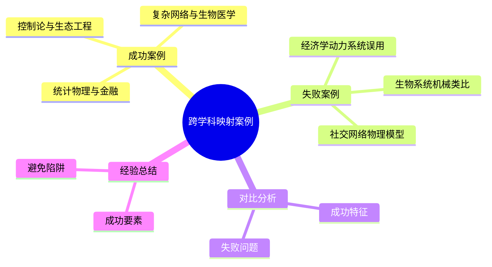
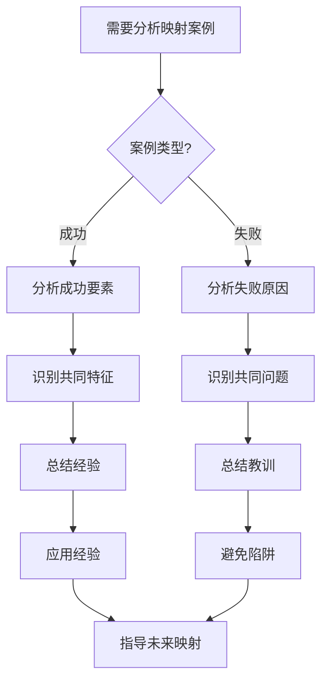
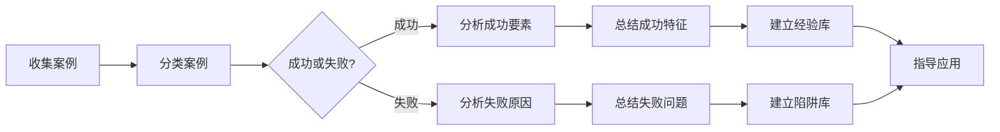
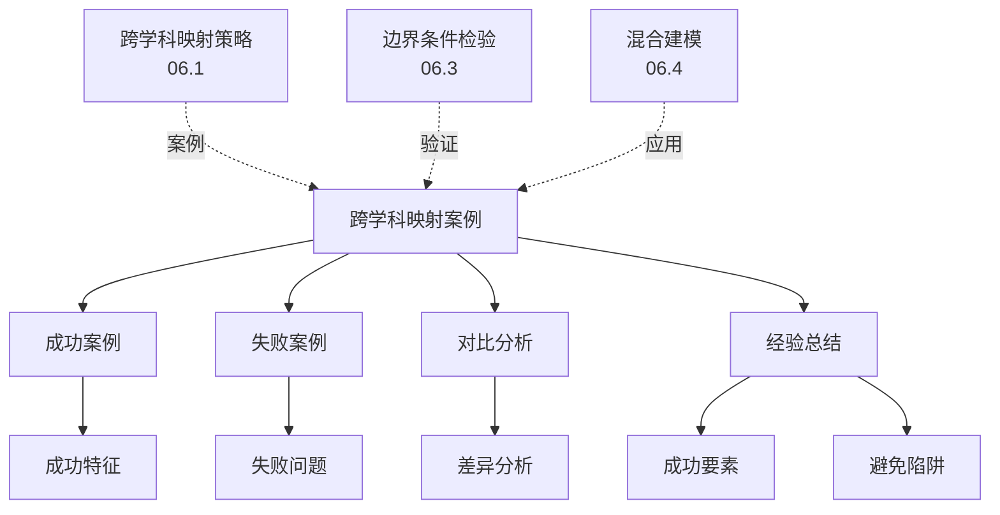
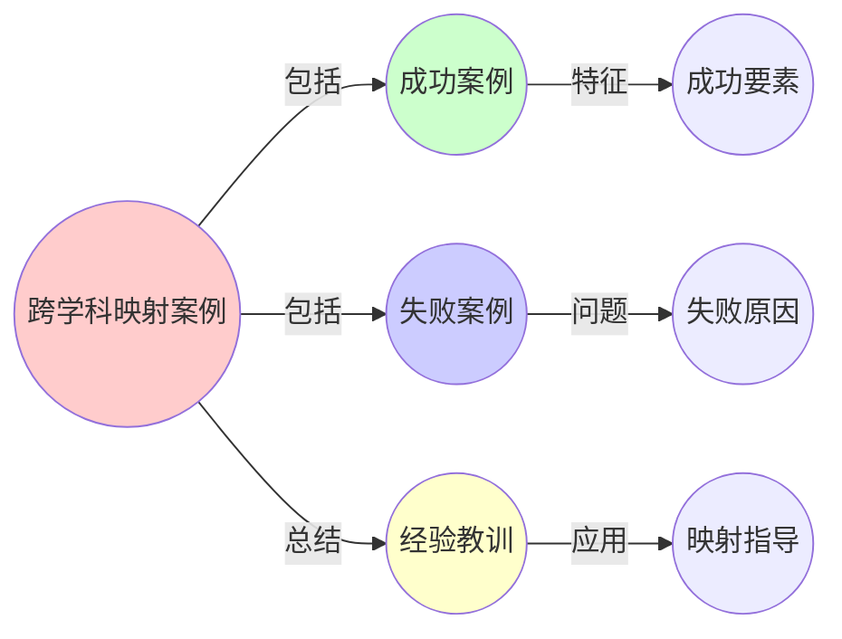
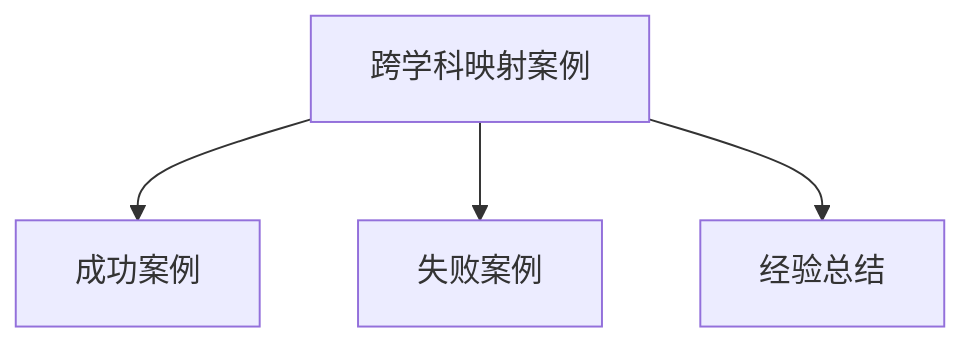

# 06.5 跨学科映射案例

> **来源**: view01.md, view06.md
> **创建日期**: 2025-01-27
> **最后更新**: 2025-01-27

## 📋 目录

- [06.5 跨学科映射案例](#065-跨学科映射案例)
  - [📋 目录](#-目录)
  - [📋 内容概览](#-内容概览)
  - [🎯 核心理念](#-核心理念)
  - [✅ 成功案例](#-成功案例)
    - [案例1：控制论与生态工程](#案例1控制论与生态工程)
    - [案例2：复杂网络理论与生物医学](#案例2复杂网络理论与生物医学)
    - [案例3：统计物理与金融](#案例3统计物理与金融)
  - [❌ 失败案例](#-失败案例)
    - [案例1：经济学中的动力系统误用](#案例1经济学中的动力系统误用)
    - [案例2：生物系统的机械类比](#案例2生物系统的机械类比)
    - [案例3：社交网络的物理模型](#案例3社交网络的物理模型)
  - [📊 案例对比分析](#-案例对比分析)
    - [成功案例的共同特征](#成功案例的共同特征)
    - [失败案例的共同问题](#失败案例的共同问题)
  - [🎯 经验总结](#-经验总结)
    - [成功要素](#成功要素)
    - [避免陷阱](#避免陷阱)
  - [📊 详细案例研究](#-详细案例研究)
    - [案例研究 1：Florida大沼泽地生态修复项目](#案例研究-1florida大沼泽地生态修复项目)
    - [案例研究 2：癌症基因调控网络分析项目](#案例研究-2癌症基因调控网络分析项目)
    - [案例研究 3：2008年金融危机预测模型失败分析](#案例研究-32008年金融危机预测模型失败分析)
  - [⚠️ 批判性分析与局限性](#️-批判性分析与局限性)
    - [局限性讨论](#局限性讨论)
      - [1. 案例选择的代表性](#1-案例选择的代表性)
      - [2. 经验总结的普适性](#2-经验总结的普适性)
      - [3. 案例分析的深度](#3-案例分析的深度)
    - [改进方向](#改进方向)
      - [1. 扩展案例库](#1-扩展案例库)
      - [2. 建立分析框架](#2-建立分析框架)
  - [📊 思维表征体系](#-思维表征体系)
    - [📊 1. 思维导图（增强版）](#-1-思维导图增强版)
      - [1.1 文本格式（基础版）](#11-文本格式基础版)
      - [1.2 Mermaid格式（可视化版）](#12-mermaid格式可视化版)
    - [📊 2. 多维对比矩阵](#-2-多维对比矩阵)
      - [2.1 成功/失败案例对比矩阵](#21-成功失败案例对比矩阵)
      - [2.2 成功案例特征对比矩阵](#22-成功案例特征对比矩阵)
      - [2.3 失败案例问题对比矩阵](#23-失败案例问题对比矩阵)
    - [🌲 3. 决策树](#-3-决策树)
      - [3.1 案例分析方法决策树](#31-案例分析方法决策树)
    - [🛤️ 4. 决策逻辑路径](#️-4-决策逻辑路径)
      - [4.1 案例学习完整路径](#41-案例学习完整路径)
    - [🕸️ 5. 概念关系网络](#️-5-概念关系网络)
      - [5.1 跨学科映射案例概念关系网络](#51-跨学科映射案例概念关系网络)
    - [🗺️ 6. 知识图谱](#️-6-知识图谱)
      - [6.1 跨学科映射案例知识图谱](#61-跨学科映射案例知识图谱)
  - [📚 理论体系](#-理论体系)
    - [理论基础](#理论基础)
      - [科学哲学/案例研究基础](#科学哲学案例研究基础)
      - [历史发展](#历史发展)
    - [理论框架](#理论框架)
      - [核心假设](#核心假设)
      - [基本概念体系](#基本概念体系)
      - [主要定理/结论](#主要定理结论)
      - [适用范围和边界](#适用范围和边界)
    - [当前知识共识](#当前知识共识)
      - [学术界共识](#学术界共识)
      - [主要争议点](#主要争议点)
      - [权威来源](#权威来源)
    - [与其他理论的关系](#与其他理论的关系)
      - [逻辑关系](#逻辑关系)
      - [映射关系](#映射关系)
  - [🔗 关联网络](#-关联网络)
    - [🔗 概念级关联](#-概念级关联)
      - [核心概念映射](#核心概念映射)
    - [🔗 理论级关联](#-理论级关联)
      - [理论基础](#理论基础-1)
    - [🔗 方法级关联](#-方法级关联)
      - [方法应用网络](#方法应用网络)
    - [🔗 应用场景关联](#-应用场景关联)
  - [🛤️ 学习路径](#️-学习路径)
    - [前置知识](#前置知识)
    - [后续学习](#后续学习)
    - [并行学习](#并行学习)
  - [🔗 相关文档](#-相关文档)
  - [📖 扩展阅读](#-扩展阅读)

---

## 📋 内容概览

本文档收集和分析跨学科映射的成功案例和失败案例，总结经验教训。通过对比分析成功和失败案例，我们可以识别关键成功因素和常见陷阱，为未来的跨学科映射提供指导。

---

## 🎯 核心理念

跨学科映射案例研究揭示了成功映射的关键要素和失败映射的根本原因。成功的映射需要机制对齐、领域修正、边界条件明确和充分验证；失败的映射往往源于机制不对齐、忽略特殊性、边界不清和验证不足。

## ✅ 成功案例

### 案例1：控制论与生态工程

**场景**：湿地生态修复中的水位调控

**映射**：

- **源域**：工程控制论（PID控制器）
- **目标域**：生态系统（湿地水位）
- **映射函数**：PID参数 → 生态参数

**关键修正**：

- 在传统PID参数中引入**时间延迟补偿项**
- 匹配生态系统的慢响应特性

**结果**：成功恢复了Florida大沼泽地的水文平衡

**经验**：

- 机制对齐是关键
- 需要考虑领域特殊性
- 修正项很重要

### 案例2：复杂网络理论与生物医学

**场景**：癌症基因调控网络分析

**映射**：

- **源域**：复杂网络理论（小世界网络）
- **目标域**：生物医学（基因调控网络）
- **映射函数**：网络拓扑 → 基因调控

**关键修正**：

- 引入生物学的代谢约束
- 考虑基因表达的时空动态

**结果**：成功预测了KRAS突变在胰腺癌中的关键节点

**经验**：

- 结构相似性识别准确
- 领域约束必须考虑
- 多尺度分析有效

### 案例3：统计物理与金融

**场景**：金融市场波动分析

**映射**：

- **源域**：统计物理（相变理论）
- **目标域**：金融（市场波动）
- **映射函数**：相变参数 → 市场参数

**关键修正**：

- 考虑市场的人为因素
- 引入行为金融修正

**结果**：改进了市场波动预测模型

**经验**：

- 物理模型提供基础框架
- 需要行为修正
- 边界条件很重要

## ❌ 失败案例

### 案例1：经济学中的动力系统误用

**场景**：2008年金融危机前的市场预测模型

**映射**：

- **源域**：动力系统（线性微分方程）
- **目标域**：经济学（市场波动）
- **映射函数**：直接应用线性模型

**问题**：

- 使用线性微分方程建模市场波动
- 忽略金融系统的**多重均衡**
- 忽略**极端事件敏感性**

**结果**：模型对次贷危机的预警失效

**教训**：

- 需将非线性项纳入模型
- 需考虑外部冲击项
- 需明确模型边界条件

### 案例2：生物系统的机械类比

**场景**：将机械系统模型直接应用到生物系统

**映射**：

- **源域**：机械系统（线性响应）
- **目标域**：生物系统（非线性阈值）
- **映射函数**：直接映射

**问题**：

- 忽略生物系统的非线性特性
- 忽略生物系统的适应性
- 忽略生物系统的随机性

**结果**：模型预测不准确

**教训**：

- 机制对齐检验很重要
- 不能忽略领域特殊性
- 需要修正项

### 案例3：社交网络的物理模型

**场景**：将物理模型应用到社交网络

**映射**：

- **源域**：物理系统（粒子系统）
- **目标域**：社交网络（人际关系）
- **映射函数**：直接映射

**问题**：

- 忽略社交网络的异质性
- 忽略社交网络的动态性
- 忽略社交网络的文化因素

**结果**：模型解释力不足

**教训**：

- 需要考虑领域特殊性
- 需要混合建模
- 需要边界条件分析

## 📊 案例对比分析

### 成功案例的共同特征

1. **机制对齐**：源域和目标域的机制一致
2. **修正项**：添加领域修正项
3. **边界条件**：明确边界条件
4. **验证**：实证验证

### 失败案例的共同问题

1. **机制不对齐**：源域和目标域的机制不一致
2. **忽略特殊性**：忽略领域特殊性
3. **边界不清**：边界条件不明确
4. **验证不足**：缺乏充分验证

## 🎯 经验总结

### 成功要素

1. **深入理解**：深入理解源域和目标域
2. **机制分析**：仔细分析机制对齐
3. **修正策略**：制定修正策略
4. **持续验证**：持续验证和调整

### 避免陷阱

1. **表面相似**：避免只看表面相似
2. **过度简化**：避免过度简化
3. **忽略边界**：避免忽略边界条件
4. **缺乏验证**：避免缺乏验证

## 📊 详细案例研究

### 案例研究 1：Florida大沼泽地生态修复项目

**背景**：将PID控制论应用到湿地生态修复中的水位调控。

**形式化分析**：

```text
映射过程:
1. 源域: PID控制器
   - 输入: 误差信号
   - 输出: 控制信号
   - 机制: 反馈控制

2. 目标域: 湿地生态系统
   - 输入: 水位偏差
   - 输出: 水位调节
   - 机制: 生态响应

3. 机制对齐检验:
   - 对齐: 反馈机制一致
   - 差异: 时间尺度不同（秒 vs 天）

4. 修正策略:
   - 时间延迟补偿: τ_delay
   - 生态阈值: 最小/最大水位
   - 混合模型: PID + 生态约束

应用结果:
- 水文平衡恢复
- 生态功能改善
- 系统稳定性提高

成功因素:
- 机制对齐准确
- 修正策略有效
- 持续验证调整
```

**关键发现**：

- ✅ 机制对齐是关键成功因素
- ✅ 时间延迟补偿至关重要
- ✅ 持续验证保证了成功

**应用价值**：

- ✅ 生态工程
- ✅ 环境修复
- ✅ 系统设计

### 案例研究 2：癌症基因调控网络分析项目

**背景**：将复杂网络理论应用到癌症基因调控网络分析。

**形式化分析**：

```text
映射过程:
1. 源域: 复杂网络理论
   - 小世界特性
   - 无标度网络
   - 关键节点识别

2. 目标域: 基因调控网络
   - 基因相互作用
   - 调控关系
   - 关键基因识别

3. 机制对齐检验:
   - 对齐: 网络结构相似
   - 差异: 功能关系重要

4. 修正策略:
   - 生物约束: 代谢约束、表达约束
   - 动态性: 时间演化
   - 功能关系: 功能模块

应用结果:
- 成功预测KRAS突变
- 发现关键调控路径
- 指导药物开发

成功因素:
- 结构相似性识别准确
- 生物约束修正有效
- 多尺度分析成功
```

**关键发现**：

- ✅ 网络结构提供了基础框架
- ✅ 生物约束修正提高了准确性
- ✅ 功能分析增加了预测能力

**应用价值**：

- ✅ 生物医学研究
- ✅ 疾病机制理解
- ✅ 精准医疗

### 案例研究 3：2008年金融危机预测模型失败分析

**背景**：线性动力系统模型在金融危机预测中的失败。

**形式化分析**：

```text
失败原因分析:
1. 模型选择错误:
   - 使用线性微分方程
   - 忽略非线性特性
   - 忽略多重均衡

2. 机制对齐失败:
   - 线性系统: 线性响应
   - 金融市场: 非线性、多重均衡
   - 结果: 机制不对齐

3. 边界条件缺失:
   - 未考虑极端事件
   - 未明确模型限制
   - 未进行压力测试

4. 验证不足:
   - 仅验证正常市场
   - 忽略极端情况
   - 缺乏反例检验

失败后果:
- 无法预警次贷危机
- 模型预测失效
- 风险评估错误

教训:
- 必须进行机制对齐检验
- 必须考虑非线性特性
- 必须明确边界条件
- 必须进行充分验证
```

**关键发现**：

- ✅ 机制不对齐是根本原因
- ✅ 边界条件缺失导致失效
- ✅ 验证不足未能发现问题

**应用价值**：

- ✅ 避免类似错误
- ✅ 改进建模方法
- ✅ 提高模型可靠性

## ⚠️ 批判性分析与局限性

### 局限性讨论

#### 1. 案例选择的代表性

**问题**：选择的案例可能不具有代表性。

**挑战**：

- ⚠️ 案例数量有限
- ⚠️ 领域覆盖不全
- ⚠️ 时间跨度短

**应对策略**：

- ✅ 扩展案例库
- ✅ 多领域覆盖
- ✅ 长期跟踪

#### 2. 经验总结的普适性

**问题**：从案例总结的经验可能不普适。

**挑战**：

- ⚠️ 经验可能领域特定
- ⚠️ 成功因素可能不唯一
- ⚠️ 失败原因可能复杂

**改进方向**：

- ✅ 多案例验证
- ✅ 理论分析
- ✅ 实证研究

#### 3. 案例分析的深度

**问题**：案例分析可能不够深入。

**挑战**：

- ⚠️ 信息获取困难
- ⚠️ 细节可能缺失
- ⚠️ 分析可能主观

**改进方向**：

- ✅ 深入调研
- ✅ 多方验证
- ✅ 客观分析

### 改进方向

#### 1. 扩展案例库

**目标**：收集更多案例。

**方法**：

- 多领域案例
- 成功和失败案例
- 详细文档

#### 2. 建立分析框架

**目标**：系统化案例分析。

**方法**：

- 分析框架
- 标准流程
- 评估标准

## 📊 思维表征体系

### 📊 1. 思维导图（增强版）

#### 1.1 文本格式（基础版）

```text
跨学科映射案例
├── 成功案例
│   ├── 控制论与生态工程
│   ├── 复杂网络与生物医学
│   └── 统计物理与金融
├── 失败案例
│   ├── 经济学动力系统误用
│   ├── 生物系统机械类比
│   └── 社交网络物理模型
├── 案例对比分析
│   ├── 成功案例共同特征
│   └── 失败案例共同问题
└── 经验总结
    ├── 成功要素
    └── 避免陷阱
```

#### 1.2 Mermaid格式（可视化版）



### 📊 2. 多维对比矩阵

#### 2.1 成功/失败案例对比矩阵

| 维度 | 成功案例 | 失败案例 | 关键差异 | 启示 |
|------|---------|---------|---------|------|
| **机制对齐** | 是 | 否 | 关键差异 | 机制对齐是成功的关键 |
| **边界条件** | 明确 | 模糊/忽略 | 重要差异 | 边界条件很重要 |
| **验证充分性** | 充分 | 不足 | 关键差异 | 需要充分验证 |
| **领域知识** | 充分 | 不足 | 重要差异 | 领域知识很重要 |
| **应用效果** | 好 | 差/失败 | 结果差异 | 验证影响效果 |

#### 2.2 成功案例特征对比矩阵

| 特征 | 控制论-生态工程 | 复杂网络-生物医学 | 统计物理-金融 | 共同性 |
|------|---------------|-----------------|--------------|--------|
| **机制对齐** | 是 | 是 | 是 | 都对齐 |
| **边界明确** | 是 | 是 | 是 | 都明确 |
| **验证充分** | 是 | 是 | 是 | 都充分 |
| **领域知识** | 充分 | 充分 | 充分 | 都充分 |
| **应用效果** | 好 | 好 | 好 | 都好 |

#### 2.3 失败案例问题对比矩阵

| 问题 | 经济学误用 | 生物机械类比 | 社交网络物理 | 共同问题 |
|------|-----------|-------------|-------------|---------|
| **机制不对齐** | 是 | 是 | 是 | 都未对齐 |
| **边界模糊** | 是 | 是 | 是 | 都模糊 |
| **验证不足** | 是 | 是 | 是 | 都不足 |
| **领域知识不足** | 是 | 是 | 部分 | 多数不足 |
| **应用失败** | 是 | 是 | 是 | 都失败 |

### 🌲 3. 决策树

#### 3.1 案例分析方法决策树



### 🛤️ 4. 决策逻辑路径

#### 4.1 案例学习完整路径



### 🕸️ 5. 概念关系网络

#### 5.1 跨学科映射案例概念关系网络



### 🗺️ 6. 知识图谱

#### 6.1 跨学科映射案例知识图谱



## 📚 理论体系

### 理论基础

#### 科学哲学/案例研究基础

跨学科映射案例的理论基础：

**1. 案例研究基础**：

- 案例研究方法
- 对比分析
- 经验总结

**2. 科学哲学基础**：

- 科学方法
- 理论验证
- 经验学习

**3. 跨学科研究基础**：

- 跨学科方法
- 知识迁移
- 应用实践

#### 历史发展

**关键时间节点**：

- **古代-近代**：案例学习的早期应用
  - 经验总结
  - 教训学习

- **20世纪**：案例研究方法发展
  - 案例研究理论
  - 对比分析方法

- **21世纪**：跨学科映射案例研究
  - 成功案例收集
  - 失败案例分析
  - 经验总结

### 理论框架

#### 核心假设

**假设1：案例学习的有效性**

- **内容**：通过案例学习可以改进映射
- **适用范围**：跨学科映射
- **限制条件**：需要充分的案例

**假设2：成功/失败模式的识别性**

- **内容**：成功和失败案例有可识别的模式
- **适用范围**：跨学科映射
- **限制条件**：需要足够的案例

**假设3：经验的可迁移性**

- **内容**：从一个案例学到的经验可以应用到其他案例
- **适用范围**：相似映射
- **限制条件**：需要适当的迁移

#### 基本概念体系



#### 主要定理/结论

**结论1：机制对齐的重要性**

- **内容**：机制对齐是映射成功的关键
- **证据**：成功和失败案例对比
- **应用**：映射设计

**结论2：边界条件的重要性**

- **内容**：边界条件明确是映射成功的关键
- **证据**：成功和失败案例对比
- **应用**：映射应用

**结论3：验证的必要性**

- **内容**：充分验证是映射成功的关键
- **证据**：成功和失败案例对比
- **应用**：映射验证

#### 适用范围和边界

**适用范围**：

- 跨学科映射学习
- 映射方法改进
- 映射实践指导

**边界条件**：

- 需要充分的案例
- 需要适当的分析
- 需要适当的迁移

**不适用场景**：

- 案例不足
- 分析不充分
- 不当的迁移

### 当前知识共识

#### 学术界共识

**广泛接受的共识**：

1. **案例学习的价值**
   - **共识**：案例学习是改进映射的有效方法
   - **支持证据**：成功应用
   - **来源**：案例研究方法

2. **机制对齐的重要性**
   - **共识**：机制对齐是映射成功的关键
   - **支持证据**：案例对比
   - **来源**：跨学科研究

3. **验证的必要性**
   - **共识**：充分验证是映射成功的关键
   - **支持证据**：案例对比
   - **来源**：科学方法

#### 主要争议点

1. **案例的代表性**
   - **观点A**：当前案例有代表性
   - **观点B**：需要更多案例
   - **当前状态**：多数认为需要扩展案例库

2. **经验的可迁移性**
   - **观点A**：经验可以广泛迁移
   - **观点B**：经验迁移有限制
   - **当前状态**：多数认为需要谨慎迁移

#### 权威来源

**经典文献**：

- 《The Structure of Scientific Revolutions》- Thomas Kuhn
- 《Models and Analogies in Science》- Mary Hesse
- 案例研究方法相关文献

**权威机构/专家**：

- **案例研究会**
- **跨学科研究会**
- **科学哲学研究会**

**最新发展**：

- **2020-2024**：案例库扩展、分析方法改进、经验系统化
- **前沿方向**：自动化案例分析、案例知识库、智能经验提取

### 与其他理论的关系

#### 逻辑关系

**理论基础**：

- **跨学科映射策略**（[06.1_跨学科映射策略.md](06.1_跨学科映射策略.md)） → 跨学科映射案例
  - 关系类型：案例验证
  - 关键映射：映射策略 → 映射案例

**理论应用**：

- **边界条件检验**（[06.3_边界条件检验.md](06.3_边界条件检验.md)） → 跨学科映射案例
  - 关系类型：验证方法
  - 关键映射：边界检验 → 案例验证

#### 映射关系

| 本理论概念 | 映射理论 | 映射概念 | 映射类型 | 映射说明 |
|-----------|---------|---------|---------|----------|
| **成功案例** | 06.1_跨学科映射策略 | 映射成功 | 验证 | 成功案例验证映射策略 |
| **失败案例** | 06.3_边界条件检验 | 检验失败 | 对应 | 失败案例对应检验失败 |
| **经验总结** | 06.1_跨学科映射策略 | 策略改进 | 应用 | 经验总结用于策略改进 |

## 🔗 关联网络

### 🔗 概念级关联

#### 核心概念映射

| 本文档概念 | 关联文档 | 关联概念 | 关系类型 | 映射说明 |
|-----------|---------|---------|---------|----------|
| **成功案例** | 06.1_跨学科映射策略 | 映射成功 | 验证 | 成功案例验证映射策略 |
| **失败案例** | 06.3_边界条件检验 | 检验失败 | 对应 | 失败案例对应检验失败 |
| **经验总结** | 06.1_跨学科映射策略 | 策略改进 | 应用 | 经验总结用于策略改进 |
| **机制对齐** | 06.3_边界条件检验 | 机制对齐检验 | 对应 | 案例中的机制对齐对应检验 |
| **边界条件** | 06.3_边界条件检验 | 边界分析 | 对应 | 案例中的边界条件对应分析 |

### 🔗 理论级关联

#### 理论基础

- **本理论基于**：
  - [06.1_跨学科映射策略.md](06.1_跨学科映射策略.md) ⭐⭐⭐ - 跨学科映射策略
  - [06.2_类比迁移方法.md](06.2_类比迁移方法.md) ⭐⭐ - 类比迁移方法
  - [06.3_边界条件检验.md](06.3_边界条件检验.md) ⭐⭐ - 边界条件检验

- **本理论应用于**：
  - [06.1_跨学科映射策略.md](06.1_跨学科映射策略.md) ⭐⭐⭐ - 策略改进
  - [06.4_混合建模.md](06.4_混合建模.md) ⭐⭐ - 建模方法改进

### 🔗 方法级关联

#### 方法应用网络

| 本文档方法 | 应用文档 | 应用场景 | 应用效果 |
|-----------|---------|---------|---------|
| **案例分析** | 06.1_跨学科映射策略 | 策略改进 | 成功 |
| **经验总结** | 06.4_混合建模 | 方法改进 | 成功 |
| **对比分析** | 06.3_边界条件检验 | 检验方法改进 | 成功 |

### 🔗 应用场景关联

**场景**：跨学科映射改进

| 视角 | 关联文档 | 核心理论 | 关注点 |
|------|---------|---------|--------|
| **案例学习** | 本文档 | 映射案例 | 如何学习 |
| **策略改进** | 06.1_跨学科映射策略 | 映射策略 | 如何改进 |
| **验证方法** | 06.3_边界条件检验 | 边界检验 | 如何验证 |

## 🛤️ 学习路径

### 前置知识

**必须先学习**：

- [06.1_跨学科映射策略.md](06.1_跨学科映射策略.md) ⭐⭐⭐ - 跨学科映射策略
- [06.2_类比迁移方法.md](06.2_类比迁移方法.md) ⭐⭐ - 类比迁移方法
- [06.3_边界条件检验.md](06.3_边界条件检验.md) ⭐⭐ - 边界条件检验

**建议先了解**：

- 案例研究方法
- 科学方法
- 经验学习

### 后续学习

**建议接下来学习**（按顺序）：

1. [06.4_混合建模.md](06.4_混合建模.md) ⭐⭐ - 混合建模
2. [02.5_跨学科动力学映射.md](../02_动力学系统理论/02.5_跨学科动力学映射.md) ⭐⭐ - 动力学映射
3. 实际应用 ⭐⭐ - 应用实践

### 并行学习

**可以同时学习**：

- [01_形式科学基础理论](../01_形式科学基础理论/) - 形式科学基础
- [02_动力学系统理论](../02_动力学系统理论/) - 动力学系统

## 🔗 相关文档

- [06.1_跨学科映射策略.md](06.1_跨学科映射策略.md)
- [06.2_类比迁移方法.md](06.2_类比迁移方法.md)
- [06.3_边界条件检验.md](06.3_边界条件检验.md)
- [06.4_混合建模.md](06.4_混合建模.md)

## 📖 扩展阅读

- 《The Structure of Scientific Revolutions》- Thomas Kuhn
- 《Models and Analogies in Science》- Mary Hesse
- Wikipedia: [Analogy](https://en.wikipedia.org/wiki/Analogy)
- Wikipedia: [Scientific Method](https://en.wikipedia.org/wiki/Scientific_method)
