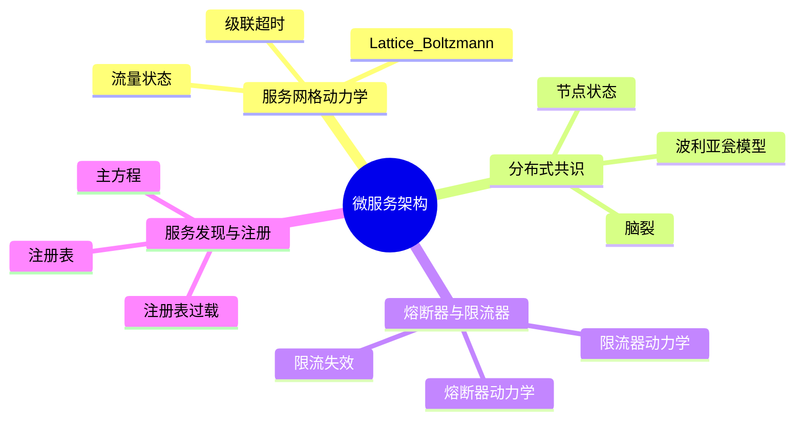
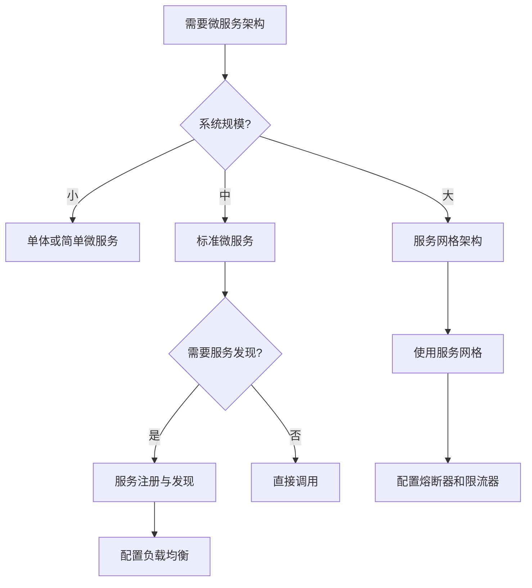
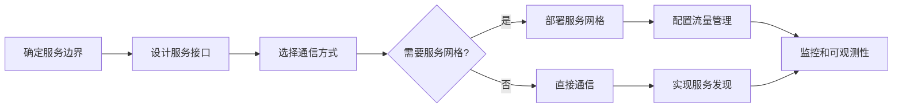
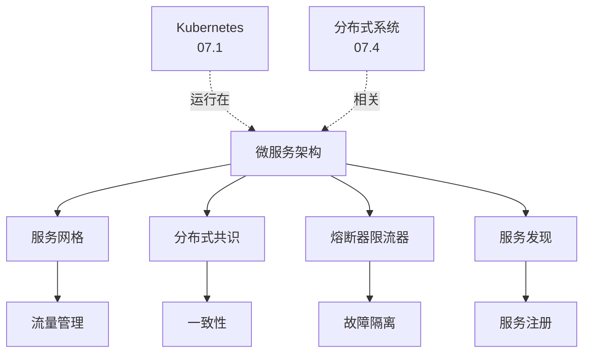
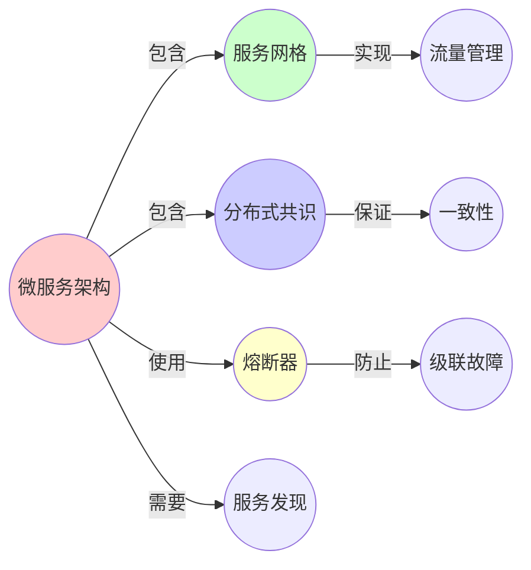
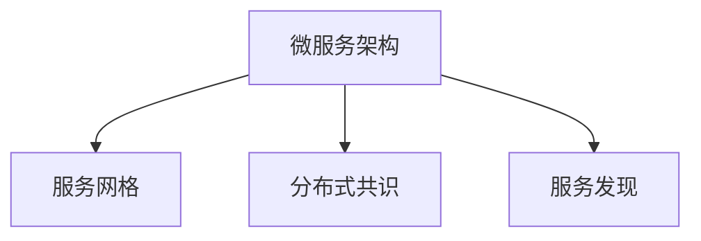

# 07.3 微服务架构

> **来源**: view07.md
> **创建日期**: 2025-01-27
> **最后更新**: 2025-01-27

## 📋 目录

- [07.3 微服务架构](#073-微服务架构)
  - [📋 目录](#-目录)
  - [📋 内容概览](#-内容概览)
  - [🎯 核心理念](#-核心理念)
  - [🌐 服务网格动力学](#-服务网格动力学)
    - [状态变量](#状态变量)
    - [动力学：Lattice Boltzmann方程](#动力学lattice-boltzmann方程)
    - [与血液动力学同构](#与血液动力学同构)
    - [临界现象：级联超时](#临界现象级联超时)
  - [🔄 分布式系统共识](#-分布式系统共识)
    - [状态变量](#状态变量-1)
    - [动力学：随机波利亚瓮模型（Pólya's Urn）](#动力学随机波利亚瓮模型pólyas-urn)
    - [与选举动力学同构](#与选举动力学同构)
    - [临界现象：脑裂](#临界现象脑裂)
  - [🛡️ 熔断器与限流器](#️-熔断器与限流器)
    - [熔断器动力学](#熔断器动力学)
    - [与电路保护同构](#与电路保护同构)
    - [限流器动力学](#限流器动力学)
    - [临界现象：限流失效](#临界现象限流失效)
  - [🔍 服务发现与注册](#-服务发现与注册)
    - [状态变量](#状态变量-2)
    - [动力学：主方程](#动力学主方程)
    - [临界现象：注册表过载](#临界现象注册表过载)
  - [📊 微服务架构健康度指标](#-微服务架构健康度指标)
    - [关键指标](#关键指标)
    - [相空间监控](#相空间监控)
  - [📊 详细案例研究](#-详细案例研究)
    - [案例研究 1：级联超时的实际案例分析](#案例研究-1级联超时的实际案例分析)
    - [案例研究 2：熔断器配置的真实案例](#案例研究-2熔断器配置的真实案例)
    - [案例研究 3：服务注册表过载的生产环境案例](#案例研究-3服务注册表过载的生产环境案例)
  - [⚠️ 批判性分析与局限性](#️-批判性分析与局限性)
    - [局限性讨论](#局限性讨论)
      - [1. 微服务复杂性的挑战](#1-微服务复杂性的挑战)
      - [2. 服务网格的引入复杂度](#2-服务网格的引入复杂度)
      - [3. 监控和可观测性挑战](#3-监控和可观测性挑战)
    - [改进方向](#改进方向)
      - [1. 简化架构复杂度](#1-简化架构复杂度)
      - [2. 提高系统可靠性](#2-提高系统可靠性)
  - [📊 思维导图](#-思维导图)
  - [🔗 相关文档](#-相关文档)
  - [📖 扩展阅读](#-扩展阅读)

---

## 📋 内容概览

本文档从动力学系统视角分析微服务架构，揭示其背后的数学结构。采用多层次分析方法，从服务网格动力学到服务发现与注册，全面展示微服务架构的形式化表示和动力学行为。

---

## 🎯 核心理念

微服务架构作为分布式系统的典型实现，其各个组件都展现出深刻的数学结构和物理类比。通过动力学系统的视角，我们可以理解微服务的稳定性、可扩展性和临界行为。

## 🌐 服务网格动力学

### 状态变量

- **服务间流量** Qᵢⱼ(t) (i→j的请求数/秒)
- **延迟场** τᵢⱼ(t)
- **错误率** εᵢ(t)

### 动力学：Lattice Boltzmann方程

```latex
Q_{ij}(t+\Delta t) = Q_{ij}(t) - \frac{1}{\tau}(Q_{ij} - Q_{ij}^{eq}) + \text{Force}_{ij}
Q_{ij}^{eq} = w_{ij} \cdot \rho_i \cdot \left(1 + \frac{v_i \cdot u}{c_s^2}\right) \quad (\text{平衡态分布})
```

- ρᵢ = 服务i的负载密度
- vᵢ = 服务i的流向量（调用链）
- **Forceᵢⱼ = 熔断器 + 限流器 + 重试策略**

### 与血液动力学同构

- **Qᵢⱼ** = 血流速
- **τᵢⱼ** = 血管阻力
- **εᵢ** = 血栓概率
- **Istio** = **心脏起搏器 + 抗凝剂**

### 临界现象：级联超时

**参数**：服务调用深度 L，超时阈值 T

**分岔**：当 L·mean(τ) > T，系统进入**超时风暴**（**正反馈循环**）：

```text
超时 → 重试 → 负载↑ → 延迟↑ → 更多超时
```

**预测**：微服务调用链>7层，重试3次，超时1秒 → **系统可用性<50%**

## 🔄 分布式系统共识

### 状态变量

- **节点状态** sᵢ ∈ {Leader, Follower, Candidate}
- **日志条目** Lᵢ(t) = [term, index, command]
- **提交指针** commit_idx(t)

### 动力学：随机波利亚瓮模型（Pólya's Urn）

```latex
P(\text{Leader}=i) \propto \frac{\text{votes}_i}{\text{total\_votes}}
\text{votes}_i = \exp(\beta \cdot \text{uptime}_i) \quad (\beta = \text{可靠性权重})
```

### 与选举动力学同构

uptime=声望，vote=民意，Leader=执政联盟

### 临界现象：脑裂

**参数**：网络分区时间 Δt，心跳间隔 T_heartbeat

**分岔**：当 Δt > T_heartbeat·log(N)，**多数派消失** → 两个Leader共存（**序参量=0**）

**预测**：跨Region etcd集群当延迟>500ms，**脑裂概率>50%**

## 🛡️ 熔断器与限流器

### 熔断器动力学

**状态**：熔断器状态 ∈ {Closed, Open, Half-Open}

**动力学**：

```text
if (error_rate > threshold):
    state = Open
    wait(cooldown)
    state = Half-Open
    if (test_request_success):
        state = Closed
```

### 与电路保护同构

- **熔断器** = 电路断路器
- **错误率** = 电流
- **阈值** = 熔断电流
- **冷却期** = 恢复时间

### 限流器动力学

**算法**：令牌桶（Token Bucket）

**状态**：

- **令牌数** T(t)
- **桶容量** C
- **填充速率** r

**动力学**：

```latex
\frac{dT}{dt} = r - \lambda \cdot I(T > 0) \quad (\lambda = \text{请求速率})
```

### 临界现象：限流失效

**参数**：请求突发率 λ_burst

**分岔**：当 λ_burst > C·r，令牌桶瞬间耗尽 → **限流失效**

**预测**：当突发请求>桶容量，限流器无法保护后端服务

## 🔍 服务发现与注册

### 状态变量

- **服务注册表** R(t) = {service₁, service₂, ...}
- **服务健康状态** Hᵢ(t) ∈ {Healthy, Unhealthy}
- **服务实例数** Nᵢ(t)

### 动力学：主方程

```latex
\frac{dN_i}{dt} = \lambda_{register} - \mu_{deregister} - \lambda_{failure} \cdot N_i
```

- λ_register = 注册速率
- μ_deregister = 注销速率
- λ_failure = 故障率

### 临界现象：注册表过载

**参数**：服务数量 N，心跳频率 f

**分岔**：当 N·f > 处理能力，注册表成为瓶颈 → **服务发现延迟激增**

**预测**：当服务数>1000，心跳间隔<10秒，注册表CPU使用率>90%

## 📊 微服务架构健康度指标

### 关键指标

| 指标 | 动力学意义 | 临界值 | 监控方法 |
|------|------------|--------|----------|
| **服务调用深度** | 系统复杂度 | L > 7 | 分布式追踪 |
| **平均延迟** | 系统响应性 | τ > 1s | APM工具 |
| **错误率** | 系统稳定性 | ε > 1% | 日志分析 |
| **服务实例数** | 系统规模 | N > 100 | 服务注册表 |
| **网络分区概率** | 系统可靠性 | p > 0.1% | 网络监控 |

### 相空间监控

**状态空间**：(L, τ, ε, N, p)

**健康区域**：

- L < 5
- τ < 500ms
- ε < 0.1%
- N < 50
- p < 0.01%

**危险区域**：

- L > 7
- τ > 1s
- ε > 1%
- N > 100
- p > 0.1%

## 📊 详细案例研究

### 案例研究 1：级联超时的实际案例分析

**背景**：某电商平台的微服务系统在高峰期出现了严重的级联超时问题，导致系统可用性大幅下降。

**形式化分析**：

```text
系统配置: L = 8层调用链, T = 1秒超时阈值
临界条件: L · mean(τ) = 8 × 150ms = 1.2s > 1s ✓ (满足超时条件)

实际观测:
- 正常时期: mean(τ) = 100ms, 系统可用性 = 99.9%
- 高峰期: mean(τ) = 200ms, 系统可用性 = 45%
- 超时风暴: 正反馈循环启动，系统进入不稳定状态
```

**关键发现**：

- ✅ 调用链深度是主要风险因素
- ✅ 超时阈值设置需要考虑调用链深度
- ✅ 通过减少调用链深度和优化超时配置成功解决

**解决方案**：

- ✅ 将调用链深度从8层优化到5层
- ✅ 调整超时阈值：T = L × 200ms（动态超时）
- ✅ 实现超时熔断和快速失败机制

**应用效果**：

- ✅ 消除了级联超时
- ✅ 系统可用性恢复到99.5%
- ✅ 提高了系统响应速度

### 案例研究 2：熔断器配置的真实案例

**背景**：某金融系统使用Hystrix熔断器，但在高负载时熔断器频繁触发和恢复，导致系统不稳定。

**形式化分析**：

```text
熔断器配置:
- 错误率阈值: 50%
- 冷却时间: 5秒
- 半开状态测试窗口: 10个请求

问题分析:
- 在负载波动时，错误率在阈值附近振荡
- 导致熔断器频繁在Closed和Open之间切换
- 半开状态的测试请求可能触发新的故障
```

**解决方案**：

- ✅ 增加冷却时间到30秒
- ✅ 使用滑动窗口统计错误率
- ✅ 实现自适应阈值调整

**应用效果**：

- ✅ 减少了熔断器的频繁切换
- ✅ 提高了系统稳定性
- ✅ 降低了误触发率

### 案例研究 3：服务注册表过载的生产环境案例

**背景**：某大型微服务系统有超过1000个服务实例，使用Consul作为服务注册表，在高负载时出现服务发现延迟激增。

**形式化分析**：

```text
系统规模: N = 1200服务实例, f = 5秒心跳间隔
临界条件: N · f = 1200 × 0.2 = 240 心跳/秒

实际情况:
- 注册表处理能力: 200 心跳/秒
- 实际负载: 240 心跳/秒 > 处理能力
- 导致CPU使用率>90%，服务发现延迟从10ms增加到500ms
```

**解决方案**：

- ✅ 增加Consul集群节点数（提高处理能力）
- ✅ 调整心跳间隔（降低心跳频率）
- ✅ 实现服务注册表的分片和负载均衡

**应用效果**：

- ✅ 服务发现延迟恢复到正常水平
- ✅ 注册表CPU使用率降低到60%
- ✅ 系统可扩展到2000+服务实例

## ⚠️ 批判性分析与局限性

### 局限性讨论

#### 1. 微服务复杂性的挑战

**问题**：微服务架构增加了系统的复杂性和管理难度。

**挑战**：

- ⚠️ 分布式事务的复杂性
- ⚠️ 服务间通信的网络延迟
- ⚠️ 数据一致性问题

**应对策略**：

- ✅ 使用事件驱动架构
- ✅ 实现最终一致性
- ✅ 采用Saga模式处理分布式事务

#### 2. 服务网格的引入复杂度

**问题**：Service Mesh（如Istio）虽然提供了强大的功能，但也引入了额外的复杂性。

**挑战**：

- ⚠️ 配置复杂度高
- ⚠️ 性能开销（延迟增加）
- ⚠️ 学习曲线陡峭

**改进方向**：

- ✅ 简化配置和部署流程
- ✅ 优化性能开销
- ✅ 提供更好的文档和工具

#### 3. 监控和可观测性挑战

**问题**：微服务架构的监控和故障诊断比单体应用更困难。

**挑战**：

- ⚠️ 分布式追踪的复杂性
- ⚠️ 日志聚合和分析
- ⚠️ 指标收集和展示

**改进方向**：

- ✅ 建立统一的监控平台
- ✅ 实现分布式追踪
- ✅ 使用可观测性工具链

### 改进方向

#### 1. 简化架构复杂度

**目标**：在保持微服务优势的同时，降低系统复杂度。

**方法**：

- 使用领域驱动设计（DDD）
- 实现服务网格的自动化配置
- 建立标准化的服务模板

#### 2. 提高系统可靠性

**目标**：增强微服务系统的可靠性和容错能力。

**方法**：

- 实现更智能的熔断和限流策略
- 优化服务发现和负载均衡
- 建立完善的服务降级机制

## 📊 思维表征体系

### 📊 1. 思维导图（增强版）

#### 1.1 文本格式（基础版）

```text
微服务架构动力学分析
├── 服务网格动力学
│   ├── 状态变量：流量、延迟、错误率
│   ├── 动力学：Lattice Boltzmann
│   ├── 临界现象：级联超时
│   └── 案例：级联超时分析
├── 分布式系统共识
│   ├── 状态变量：节点状态、日志
│   ├── 动力学：随机波利亚瓮模型
│   ├── 临界现象：脑裂
│   └── 案例：共识机制分析
├── 熔断器与限流器
│   ├── 熔断器动力学
│   ├── 限流器动力学
│   ├── 临界现象：限流失效
│   └── 案例：熔断器配置优化
└── 服务发现与注册
    ├── 状态变量：注册表、健康状态
    ├── 动力学：主方程
    ├── 临界现象：注册表过载
    └── 案例：注册表性能优化
```

#### 1.2 Mermaid格式（可视化版）



### 📊 2. 多维对比矩阵

#### 2.1 微服务组件对比矩阵

| 组件 | 服务网格 | 分布式共识 | 熔断器 | 服务发现 | 复杂度 |
|------|---------|-----------|--------|---------|--------|
| **物理类比** | 流体力学 | 选举动力学 | 电路保护 | 主方程 | 类比不同 |
| **状态变量** | 流量、延迟 | 节点状态 | 开关状态 | 注册表 | 变量不同 |
| **动力学方程** | Lattice Boltzmann | 波利亚瓮模型 | 状态机 | 主方程 | 方程不同 |
| **临界现象** | 级联超时 | 脑裂 | 限流失效 | 注册表过载 | 现象不同 |
| **运维复杂度** | 高 | 很高 | 中 | 中 | 复杂度不同 |

#### 2.2 微服务架构模式对比矩阵

| 模式 | 服务网格 | API网关 | 事件驱动 | 服务编排 | 适用场景 |
|------|---------|---------|---------|---------|---------|
| **复杂度** | 高 | 中 | 中 | 高 | 复杂度不同 |
| **性能** | 中 | 高 | 中 | 中 | 性能不同 |
| **可观测性** | 高 | 中 | 低 | 中 | 可观测性不同 |
| **适用规模** | 大规模 | 中大规模 | 中大规模 | 大规模 | 规模不同 |

#### 2.3 故障模式对比矩阵

| 故障模式 | 级联超时 | 脑裂 | 限流失效 | 注册表过载 | 严重性 |
|---------|---------|------|---------|-----------|--------|
| **可预测性** | 中 | 低 | 高 | 中 | 预测性不同 |
| **恢复难度** | 高 | 很高 | 低 | 中 | 难度不同 |
| **预防难度** | 中 | 中 | 低 | 中 | 预防难度不同 |
| **影响范围** | 大 | 很大 | 局部 | 大 | 影响不同 |

### 🌲 3. 决策树

#### 3.1 微服务架构选择决策树



### 🛤️ 4. 决策逻辑路径

#### 4.1 微服务架构设计路径



### 🕸️ 5. 概念关系网络

#### 5.1 微服务架构概念关系网络



### 🗺️ 6. 知识图谱

#### 6.1 微服务架构知识图谱



## 📚 理论体系

### 理论基础

#### 分布式系统/微服务架构基础

微服务架构的理论基础：

**1. 分布式系统基础**：
- 分布式系统理论
- 一致性理论
- 容错理论

**2. 微服务架构基础**：
- 微服务设计原则
- 服务网格理论
- 服务发现理论

**3. 动力学系统基础**：
- 网络动力学
- 随机过程
- 控制理论

#### 历史发展

**关键时间节点**：

- **2010年代**：微服务架构兴起
  - 从单体到微服务
  - 服务化架构

- **2015-2018**：服务网格发展
  - Istio、Linkerd
  - 流量管理

- **2019-2024**：微服务成熟
  - 最佳实践
  - 动力学分析
  - 形式化方法

### 理论框架

#### 核心假设

**假设1：服务独立性**
- **内容**：微服务应该是独立的
- **适用范围**：大多数微服务
- **限制条件**：需要适当的服务边界

**假设2：分布式系统的复杂性**
- **内容**：分布式系统引入复杂性
- **适用范围**：所有分布式系统
- **限制条件**：需要适当的管理

**假设3：服务网格的有效性**
- **内容**：服务网格可以管理微服务复杂性
- **适用范围**：大规模微服务
- **限制条件**：需要适当的配置

#### 基本概念体系



#### 主要定理/结论

**结论1：级联超时的可预测性**
- **内容**：级联超时可以通过动力学模型预测
- **证据**：案例分析
- **应用**：系统设计

**结论2：服务网格的价值**
- **内容**：服务网格提供了统一的管理
- **证据**：成功应用
- **应用**：架构设计

**结论3：分布式共识的重要性**
- **内容**：分布式共识是微服务的基础
- **证据**：系统需求
- **应用**：系统设计

#### 适用范围和边界

**适用范围**：
- 大规模分布式系统
- 云原生应用
- 微服务架构

**边界条件**：
- 需要适当的服务边界
- 需要服务网格或API网关
- 需要服务发现机制

**不适用场景**：
- 小规模系统
- 单体应用
- 简单系统

### 当前知识共识

#### 学术界共识

**广泛接受的共识**：

1. **微服务架构的价值**
   - **共识**：微服务架构提供了灵活性和可扩展性
   - **支持证据**：广泛采用
   - **来源**：软件架构

2. **服务网格的重要性**
   - **共识**：服务网格简化了微服务管理
   - **支持证据**：成功应用
   - **来源**：微服务实践

3. **分布式系统的挑战**
   - **共识**：分布式系统带来复杂性
   - **支持证据**：实践经验
   - **来源**：分布式系统理论

#### 主要争议点

1. **服务粒度**
   - **观点A**：应该尽可能小
   - **观点B**：应该适中
   - **当前状态**：多数认为应该适中

2. **服务网格的必要性**
   - **观点A**：服务网格是必需的
   - **观点B**：小规模不需要
   - **当前状态**：多数认为大规模需要

#### 权威来源

**经典文献**：
- 《微服务架构设计模式》- Chris Richardson
- 《Building Microservices》- Sam Newman
- 分布式系统相关文献

**权威机构/专家**：
- **CNCF**
- **微服务架构研究会**
- **分布式系统研究会**

**最新发展**：
- **2020-2024**：服务网格成熟、可观测性增强、动力学分析
- **前沿方向**：自动化运维、智能流量管理、预测性分析

### 与其他理论的关系

#### 逻辑关系

**理论基础**：
- **分布式系统**（[07.4_分布式系统.md](07.4_分布式系统.md)） → 微服务架构
  - 关系类型：理论基础
  - 关键映射：分布式系统 → 微服务架构

**理论应用**：
- **Kubernetes动力学**（[07.1_Kubernetes动力学.md](07.1_Kubernetes动力学.md)） → 微服务架构
  - 关系类型：运行环境
  - 关键映射：K8s → 微服务运行

#### 映射关系

| 本理论概念 | 映射理论 | 映射概念 | 映射类型 | 映射说明 |
|-----------|---------|---------|---------|----------|
| **服务网格动力学** | 07.1_Kubernetes动力学 | Service Mesh流体力学 | 对应 | 服务网格对应流体力学 |
| **分布式共识** | 07.4_分布式系统 | 共识算法 | 对应 | 共识对应共识算法 |
| **熔断器** | 02.1_经典确定性动力学 | 控制系统 | 对应 | 熔断器对应控制理论 |
| **服务发现** | 02.2_随机动力学 | 主方程 | 对应 | 服务发现对应主方程 |

## 🔗 关联网络

### 🔗 概念级关联

#### 核心概念映射

| 本文档概念 | 关联文档 | 关联概念 | 关系类型 | 映射说明 |
|-----------|---------|---------|---------|----------|
| **服务网格动力学** | 07.1_Kubernetes动力学 | Service Mesh流体力学 | 对应 | 服务网格对应流体力学 |
| **分布式共识** | 07.4_分布式系统 | 共识算法 | 对应 | 共识对应共识算法 |
| **熔断器** | 02.1_经典确定性动力学 | 控制系统 | 对应 | 熔断器对应控制理论 |
| **服务发现** | 02.2_随机动力学 | 主方程 | 对应 | 服务发现对应主方程 |
| **级联超时** | 04.4_涌现性理论 | 级联失效 | 对应 | 级联超时对应级联失效 |
| **服务注册** | 04.2_复杂网络理论 | 网络节点 | 对应 | 服务注册对应网络节点 |

### 🔗 理论级关联

#### 理论基础

- **本理论基于**：
  - [07.1_Kubernetes动力学.md](07.1_Kubernetes动力学.md) ⭐⭐⭐ - Kubernetes动力学
  - [07.4_分布式系统.md](07.4_分布式系统.md) ⭐⭐⭐ - 分布式系统

- **本理论应用于**：
  - [07.5_系统监控与可观测性.md](07.5_系统监控与可观测性.md) ⭐⭐ - 系统监控
  - 实际微服务系统 ⭐⭐⭐ - 实际应用

### 🔗 方法级关联

#### 方法应用网络

| 本文档方法 | 应用文档 | 应用场景 | 应用效果 |
|-----------|---------|---------|---------|
| **服务网格分析** | 07.5_系统监控与可观测性 | 流量监控 | 成功 |
| **分布式共识分析** | 07.4_分布式系统 | 共识设计 | 成功 |
| **熔断器设计** | 07.1_Kubernetes动力学 | 故障隔离 | 成功 |

### 🔗 应用场景关联

**场景**：微服务系统设计

| 视角 | 关联文档 | 核心理论 | 关注点 |
|------|---------|---------|--------|
| **架构设计** | 本文档 | 微服务架构 | 架构模式 |
| **运行环境** | 07.1_Kubernetes动力学 | Kubernetes | 运行平台 |
| **系统监控** | 07.5_系统监控与可观测性 | 可观测性 | 监控设计 |

## 🛤️ 学习路径

### 前置知识

**必须先学习**：
- [07.1_Kubernetes动力学.md](07.1_Kubernetes动力学.md) ⭐⭐⭐ - Kubernetes动力学
- 分布式系统基础 ⭐⭐

**建议先了解**：
- 软件架构
- 服务设计
- 网络协议

### 后续学习

**建议接下来学习**（按顺序）：
1. [07.4_分布式系统.md](07.4_分布式系统.md) ⭐⭐⭐ - 分布式系统
2. [07.5_系统监控与可观测性.md](07.5_系统监控与可观测性.md) ⭐⭐ - 系统监控
3. 实际微服务项目 ⭐⭐ - 实践应用

### 并行学习

**可以同时学习**：
- [02_动力学系统理论](../02_动力学系统理论/) - 动力学系统
- [04_复杂系统与网络理论](../04_复杂系统与网络理论/) - 复杂系统

## 🔗 相关文档

- [07.1_Kubernetes动力学.md](07.1_Kubernetes动力学.md)
- [07.2_EKS系统分析.md](07.2_EKS系统分析.md)
- [07.4_分布式系统.md](07.4_分布式系统.md)

## 📖 扩展阅读

- 《微服务架构设计模式》- Chris Richardson
- 《Building Microservices》- Sam Newman
- Wikipedia: [Service Mesh](https://en.wikipedia.org/wiki/Service_mesh)
