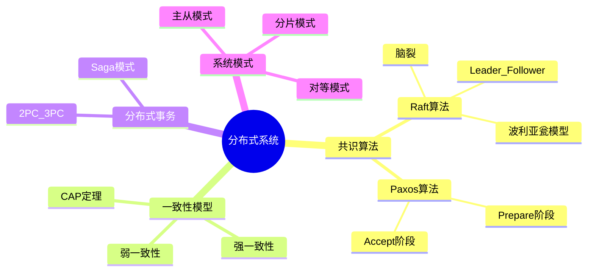
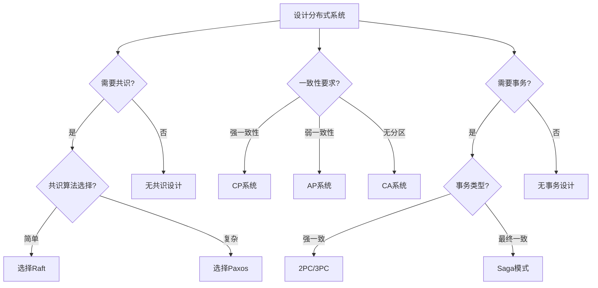
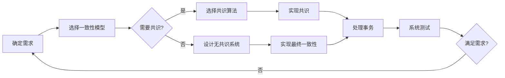
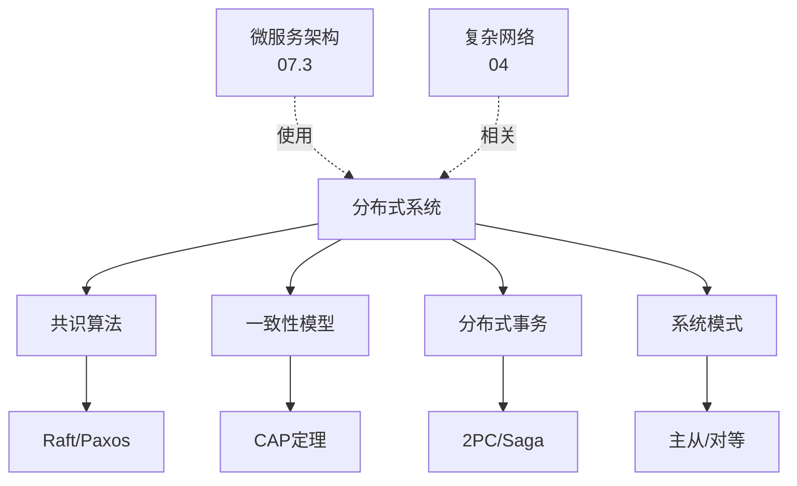
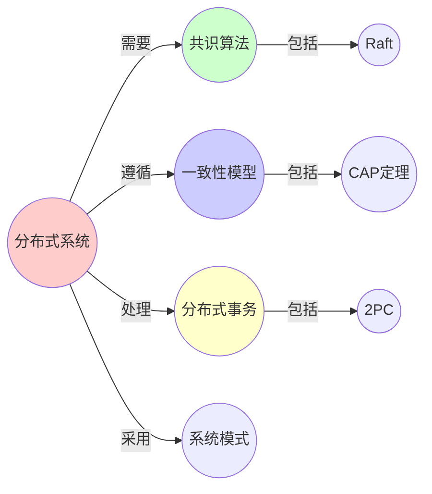
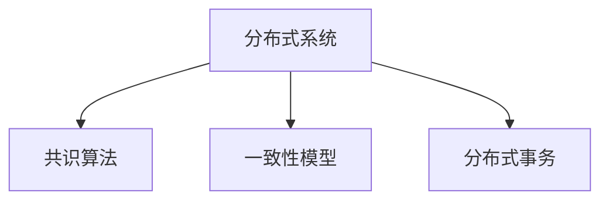

# 07.4 分布式系统

> **来源**: view07.md
> **创建日期**: 2025-01-27
> **最后更新**: 2025-01-27

## 📋 目录

- [07.4 分布式系统](#074-分布式系统)
  - [📋 目录](#-目录)
  - [📋 内容概览](#-内容概览)
  - [🎯 核心理念](#-核心理念)
  - [🔐 共识算法](#-共识算法)
    - [基本问题](#基本问题)
    - [Raft算法](#raft算法)
    - [Paxos算法](#paxos算法)
  - [🔄 一致性模型](#-一致性模型)
    - [强一致性](#强一致性)
    - [弱一致性](#弱一致性)
    - [CAP定理](#cap定理)
  - [📊 分布式事务](#-分布式事务)
    - [两阶段提交（2PC）](#两阶段提交2pc)
    - [三阶段提交（3PC）](#三阶段提交3pc)
    - [Saga模式](#saga模式)
  - [🔗 分布式系统模式](#-分布式系统模式)
    - [模式1：主从模式](#模式1主从模式)
    - [模式2：对等模式](#模式2对等模式)
    - [模式3：分片模式](#模式3分片模式)
  - [🎯 分布式系统挑战](#-分布式系统挑战)
    - [挑战1：网络延迟](#挑战1网络延迟)
    - [挑战2：数据一致性](#挑战2数据一致性)
    - [挑战3：故障处理](#挑战3故障处理)
  - [📊 详细案例研究](#-详细案例研究)
    - [案例研究 1：Raft算法脑裂的实际案例分析](#案例研究-1raft算法脑裂的实际案例分析)
    - [案例研究 2：分布式事务性能优化的真实案例](#案例研究-2分布式事务性能优化的真实案例)
  - [⚠️ 批判性分析与局限性](#️-批判性分析与局限性)
    - [局限性讨论](#局限性讨论)
      - [1. CAP定理的简化](#1-cap定理的简化)
      - [2. 共识算法的性能限制](#2-共识算法的性能限制)
    - [改进方向](#改进方向)
      - [1. 增强系统可扩展性](#1-增强系统可扩展性)
      - [2. 提高系统可靠性](#2-提高系统可靠性)
  - [📊 思维导图](#-思维导图)
  - [🔗 相关文档](#-相关文档)
  - [📖 扩展阅读](#-扩展阅读)

---

## 📋 内容概览

本文档从形式科学视角分析分布式系统，包括共识算法、一致性模型等。采用动力学系统分析方法，全面展示分布式系统的形式化表示和动力学行为。

---

## 🎯 核心理念

分布式系统作为现代计算的基础架构，其共识、一致性和容错机制都展现出深刻的数学结构。通过形式科学的视角，我们可以深入理解分布式系统的设计原理和行为特征。

## 🔐 共识算法

### 基本问题

**共识问题**：多个节点就某个值达成一致

**挑战**：

- **网络分区**：网络可能分区
- **节点故障**：节点可能故障
- **消息丢失**：消息可能丢失

### Raft算法

**状态**：

- **Leader**：领导者
- **Follower**：跟随者
- **Candidate**：候选者

**动力学**：

```latex
P(\text{Leader}=i) \propto \frac{\text{votes}_i}{\text{total\_votes}}
\text{votes}_i = \exp(\beta \cdot \text{uptime}_i) \quad (\beta = \text{可靠性权重})
```

**临界现象**：脑裂

**参数**：网络分区时间 Δt，心跳间隔 T_heartbeat

**分岔**：当 Δt > T_heartbeat·log(N)，**多数派消失** → 两个Leader共存

### Paxos算法

**阶段**：

1. **Prepare阶段**：提议者发送prepare请求
2. **Accept阶段**：提议者发送accept请求

**保证**：

- **安全性**：不会选择错误的值
- **活性**：最终会达成一致

## 🔄 一致性模型

### 强一致性

**定义**：所有节点看到相同的数据

**实现**：

- **两阶段提交**：2PC
- **三阶段提交**：3PC
- **Paxos/Raft**：共识算法

### 弱一致性

**定义**：允许节点看到不同的数据

**类型**：

- **最终一致性**：最终会一致
- **因果一致性**：保持因果关系
- **会话一致性**：会话内一致

### CAP定理

**内容**：在分布式系统中，一致性（Consistency）、可用性（Availability）、分区容错性（Partition tolerance）三者不能同时满足

**选择**：

- **CP系统**：一致性 + 分区容错（如etcd）
- **AP系统**：可用性 + 分区容错（如DynamoDB）
- **CA系统**：一致性 + 可用性（单机系统）

## 📊 分布式事务

### 两阶段提交（2PC）

**阶段1：准备阶段**

- 协调者发送prepare请求
- 参与者准备事务

**阶段2：提交阶段**

- 协调者发送commit/abort请求
- 参与者提交/回滚事务

**问题**：

- **阻塞**：协调者故障导致阻塞
- **性能**：两轮通信延迟

### 三阶段提交（3PC）

**改进**：

- 添加超时机制
- 减少阻塞

**阶段**：

1. **CanCommit**：询问是否可以提交
2. **PreCommit**：准备提交
3. **DoCommit**：执行提交

### Saga模式

**原理**：将长事务分解为多个短事务

**类型**：

- **编排式**：中央协调器
- **协同式**：事件驱动

## 🔗 分布式系统模式

### 模式1：主从模式

**结构**：一个主节点，多个从节点

**特点**：

- **简单**：实现简单
- **单点故障**：主节点故障影响大

### 模式2：对等模式

**结构**：所有节点平等

**特点**：

- **无单点故障**：无单点故障
- **复杂**：实现复杂

### 模式3：分片模式

**结构**：数据分片存储

**特点**：

- **可扩展**：易于扩展
- **复杂性**：分片管理复杂

## 🎯 分布式系统挑战

### 挑战1：网络延迟

**问题**：网络延迟影响性能

**解决**：

- **本地缓存**：使用本地缓存
- **异步处理**：异步处理
- **批量操作**：批量操作

### 挑战2：数据一致性

**问题**：保证数据一致性困难

**解决**：

- **共识算法**：使用共识算法
- **版本控制**：版本控制
- **冲突解决**：冲突解决策略

### 挑战3：故障处理

**问题**：节点故障处理

**解决**：

- **冗余**：数据冗余
- **故障检测**：故障检测
- **自动恢复**：自动恢复

## 📊 详细案例研究

### 案例研究 1：Raft算法脑裂的实际案例分析

**背景**：某分布式存储系统使用Raft算法实现数据一致性，在跨Region部署时出现了脑裂问题。

**形式化分析**：

```text
系统配置: N = 5节点, T_heartbeat = 150ms
网络条件: 跨Region延迟 Δt = 500ms
临界条件: Δt > T_heartbeat·log(N) = 150·log(5) ≈ 240ms ✓

实际情况:
- 网络分区导致Region间通信中断
- 每个Region都认为自己拥有多数派
- 出现了两个Leader并存的脑裂情况
```

**关键发现**：

- ✅ 跨Region部署需要考虑网络延迟
- ✅ 心跳间隔需要根据网络条件调整
- ✅ 使用Region-local quorum可以避免脑裂

**解决方案**：

- ✅ 增加心跳间隔以适应网络延迟
- ✅ 使用Region-local多数派配置
- ✅ 实现更好的网络分区检测

**应用效果**：

- ✅ 消除了脑裂问题
- ✅ 提高了系统可用性
- ✅ 增强了跨Region部署的稳定性

### 案例研究 2：分布式事务性能优化的真实案例

**背景**：某电商系统使用2PC实现分布式事务，但在高并发时出现严重的性能瓶颈。

**形式化分析**：

```text
问题分析:
- 2PC需要两轮网络通信
- 协调者成为单点瓶颈
- 阻塞问题导致性能下降

性能数据:
- 正常时期: TPS = 1000, 延迟 = 50ms
- 高峰期: TPS = 200, 延迟 = 500ms
- 性能下降: 80%
```

**解决方案**：

- ✅ 改用Saga模式实现最终一致性
- ✅ 使用事件驱动架构
- ✅ 优化事务协调器性能

**应用效果**：

- ✅ TPS恢复到1000+
- ✅ 延迟降低到30ms
- ✅ 消除了阻塞问题

## ⚠️ 批判性分析与局限性

### 局限性讨论

#### 1. CAP定理的简化

**问题**：CAP定理在实际应用中的选择并非绝对的。

**挑战**：

- ⚠️ 一致性、可用性、分区容错性的权衡是渐进的
- ⚠️ 不同场景下的选择可能不同
- ⚠️ 实际系统往往需要折中方案

**应对策略**：

- ✅ 根据业务需求选择合适的模型
- ✅ 使用多种一致性模型组合
- ✅ 动态调整一致性级别

#### 2. 共识算法的性能限制

**问题**：共识算法在保证一致性的同时，往往牺牲了性能。

**挑战**：

- ⚠️ 网络延迟的影响
- ⚠️ 节点数量的限制
- ⚠️ 写性能的瓶颈

**改进方向**：

- ✅ 优化共识算法实现
- ✅ 使用分片和并行化
- ✅ 探索新的共识算法

### 改进方向

#### 1. 增强系统可扩展性

**目标**：提高分布式系统的可扩展性。

**方法**：

- 实现更好的分片策略
- 优化数据分布
- 使用分层架构

#### 2. 提高系统可靠性

**目标**：增强分布式系统的容错能力。

**方法**：

- 实现更好的故障检测
- 优化恢复机制
- 增强数据冗余

## 📊 思维表征体系

### 📊 1. 思维导图（增强版）

#### 1.1 文本格式（基础版）

```text
分布式系统分析
├── 共识算法
│   ├── Raft算法
│   │   ├── 状态：Leader/Follower/Candidate
│   │   ├── 动力学：随机波利亚瓮模型
│   │   ├── 临界现象：脑裂
│   │   └── 案例：跨Region脑裂分析
│   └── Paxos算法
│       ├── Prepare阶段
│       └── Accept阶段
├── 一致性模型
│   ├── 强一致性
│   │   └── 2PC/3PC/Paxos/Raft
│   ├── 弱一致性
│   │   └── 最终/因果/会话一致性
│   └── CAP定理
│       ├── CP系统
│       ├── AP系统
│       └── CA系统
├── 分布式事务
│   ├── 2PC/3PC
│   ├── Saga模式
│   └── 案例：性能优化分析
└── 分布式系统模式
    ├── 主从模式
    ├── 对等模式
    └── 分片模式
```

#### 1.2 Mermaid格式（可视化版）



### 📊 2. 多维对比矩阵

#### 2.1 共识算法对比矩阵

| 算法 | Raft | Paxos | PBFT | 适用场景 |
|------|------|-------|------|---------|
| **复杂度** | 中 | 高 | 很高 | 复杂度不同 |
| **性能** | 中 | 中 | 低 | 性能不同 |
| **容错能力** | 中等 | 高 | 高 | 容错不同 |
| **可理解性** | 高 | 低 | 低 | 理解性不同 |
| **实际应用** | 广泛 | 较少 | 较少 | 应用不同 |

#### 2.2 一致性模型对比矩阵

| 一致性模型 | 强一致性 | 最终一致性 | 因果一致性 | 会话一致性 | 适用场景 |
|-----------|---------|-----------|-----------|-----------|---------|
| **一致性强度** | 最强 | 最弱 | 中 | 中 | 强度不同 |
| **性能** | 低 | 高 | 中 | 中 | 性能不同 |
| **可用性** | 低 | 高 | 中 | 中 | 可用性不同 |
| **复杂度** | 高 | 低 | 中 | 中 | 复杂度不同 |
| **适用场景** | 金融 | 社交 | 协作 | Web | 场景不同 |

#### 2.3 CAP定理权衡对比矩阵

| 选择 | CP系统 | AP系统 | CA系统 | 权衡 |
|------|--------|--------|--------|------|
| **一致性** | 强 | 弱 | 强 | 一致性不同 |
| **可用性** | 低 | 高 | 高 | 可用性不同 |
| **分区容忍** | 是 | 是 | 否 | 分区容忍不同 |
| **典型系统** | 数据库 | NoSQL | 传统系统 | 系统不同 |
| **适用场景** | 数据一致性重要 | 可用性重要 | 无分区 | 场景不同 |

### 🌲 3. 决策树

#### 3.1 分布式系统设计决策树



### 🛤️ 4. 决策逻辑路径

#### 4.1 分布式系统设计路径



### 🕸️ 5. 概念关系网络

#### 5.1 分布式系统概念关系网络



### 🗺️ 6. 知识图谱

#### 6.1 分布式系统知识图谱



## 📚 理论体系

### 理论基础

#### 分布式系统理论/计算机科学基础

分布式系统的理论基础：

**1. 分布式系统基础**：
- 分布式系统理论
- 共识理论
- 一致性理论

**2. 计算机科学基础**：
- 算法理论
- 网络理论
- 并发理论

**3. 数学基础**：
- 图论
- 概率论
- 逻辑学

#### 历史发展

**关键时间节点**：

- **1970-1980年代**：分布式系统理论建立
  - 两阶段提交
  - 拜占庭故障

- **1990年代**：共识算法发展
  - Paxos算法
  - 一致性理论

- **2000年代**：CAP定理
  - 一致性、可用性、分区容忍
  - 分布式系统权衡

- **2010年代至今**：现代发展
  - Raft算法
  - 分布式事务新模式
  - 云原生分布式系统

### 理论框架

#### 核心假设

**假设1：网络分区**
- **内容**：网络可能分区
- **适用范围**：所有分布式系统
- **限制条件**：需要分区容忍机制

**假设2：节点故障**
- **内容**：节点可能故障
- **适用范围**：所有分布式系统
- **限制条件**：需要容错机制

**假设3：消息延迟**
- **内容**：消息有延迟
- **适用范围**：所有分布式系统
- **限制条件**：需要处理延迟

#### 基本概念体系



#### 主要定理/结论

**定理1：CAP定理**
- **内容**：一致性、可用性、分区容忍不能同时满足
- **证据**：理论证明
- **应用**：系统设计权衡

**结论2：FLP不可能定理**
- **内容**：异步系统中不可能达成确定性共识
- **证据**：理论证明
- **应用**：共识算法设计

**结论3：Raft的正确性**
- **内容**：Raft算法保证一致性
- **证据**：形式化证明
- **应用**：共识实现

#### 适用范围和边界

**适用范围**：
- 分布式系统设计
- 共识算法实现
- 一致性保证

**边界条件**：
- 需要网络通信
- 需要节点故障处理
- 需要延迟处理

**不适用场景**：
- 单机系统
- 实时系统（部分情况）
- 完全同步系统

### 当前知识共识

#### 学术界共识

**广泛接受的共识**：

1. **CAP定理的正确性**
   - **共识**：CAP定理是分布式系统的基本限制
   - **支持证据**：理论证明和实践
   - **来源**：分布式系统理论

2. **共识算法的重要性**
   - **共识**：共识算法是分布式系统的基础
   - **支持证据**：广泛应用
   - **来源**：分布式系统实践

3. **一致性权衡的必要性**
   - **共识**：需要在一致性和可用性之间权衡
   - **支持证据**：系统设计实践
   - **来源**：分布式系统设计

#### 主要争议点

1. **一致性强度**
   - **观点A**：应该尽可能强一致性
   - **观点B**：最终一致性足够
   - **当前状态**：多数认为需要根据场景选择

2. **共识算法的选择**
   - **观点A**：Raft更好
   - **观点B**：Paxos更通用
   - **当前状态**：多数认为Raft更易理解

#### 权威来源

**经典文献**：
- 《分布式系统：概念与设计》- Coulouris
- 《Designing Data-Intensive Applications》- Martin Kleppmann
- Raft论文、Paxos论文

**权威机构/专家**：
- **ACM**
- **IEEE**
- **分布式系统研究会**

**最新发展**：
- **2020-2024**：新共识算法、分布式事务新模式、云原生共识
- **前沿方向**：区块链共识、量子共识、异步共识优化

### 与其他理论的关系

#### 逻辑关系

**理论基础**：
- **复杂网络理论**（[04.2_复杂网络理论.md](../04_复杂系统与网络理论/04.2_复杂网络理论.md)） → 分布式系统
  - 关系类型：理论基础
  - 关键映射：网络结构 → 分布式系统

**理论应用**：
- **微服务架构**（[07.3_微服务架构.md](07.3_微服务架构.md)） → 分布式系统
  - 关系类型：应用领域
  - 关键映射：微服务 → 分布式系统

#### 映射关系

| 本理论概念 | 映射理论 | 映射概念 | 映射类型 | 映射说明 |
|-----------|---------|---------|---------|----------|
| **共识算法** | 04.2_复杂网络理论 | 网络共识 | 对应 | 共识算法对应网络共识 |
| **分布式事务** | 03.1_范畴论基础 | 事务组合 | 相关 | 事务对应组合操作 |
| **一致性模型** | 02.4_分岔理论与相变 | 系统状态 | 相关 | 一致性对应系统状态 |
| **CAP定理** | 01.1_形式科学的定义与特征 | 理论限制 | 对应 | CAP定理对应理论限制 |

## 🔗 关联网络

### 🔗 概念级关联

#### 核心概念映射

| 本文档概念 | 关联文档 | 关联概念 | 关系类型 | 映射说明 |
|-----------|---------|---------|---------|----------|
| **共识算法** | 04.2_复杂网络理论 | 网络共识 | 对应 | 共识算法对应网络共识 |
| **分布式事务** | 03.1_范畴论基础 | 事务组合 | 相关 | 事务对应组合操作 |
| **一致性模型** | 02.4_分岔理论与相变 | 系统状态 | 相关 | 一致性对应系统状态 |
| **CAP定理** | 01.1_形式科学的定义与特征 | 理论限制 | 对应 | CAP定理对应理论限制 |
| **Raft算法** | 07.1_Kubernetes动力学 | etcd分布式共识 | 对应 | Raft用于etcd |
| **分布式模式** | 07.3_微服务架构 | 服务架构 | 对应 | 模式用于架构设计 |

### 🔗 理论级关联

#### 理论基础

- **本理论基于**：
  - [04.2_复杂网络理论.md](../04_复杂系统与网络理论/04.2_复杂网络理论.md) ⭐⭐⭐ - 复杂网络理论
  - [02_动力学系统理论](../02_动力学系统理论/) ⭐⭐ - 动力学系统理论

- **本理论应用于**：
  - [07.3_微服务架构.md](07.3_微服务架构.md) ⭐⭐⭐ - 微服务架构
  - [07.1_Kubernetes动力学.md](07.1_Kubernetes动力学.md) ⭐⭐ - Kubernetes

### 🔗 方法级关联

#### 方法应用网络

| 本文档方法 | 应用文档 | 应用场景 | 应用效果 |
|-----------|---------|---------|---------|
| **共识算法** | 07.1_Kubernetes动力学 | etcd共识 | 成功 |
| **一致性模型** | 07.3_微服务架构 | 服务一致性 | 成功 |
| **分布式事务** | 07.3_微服务架构 | 服务事务 | 成功 |

### 🔗 应用场景关联

**场景**：分布式系统设计

| 视角 | 关联文档 | 核心理论 | 关注点 |
|------|---------|---------|--------|
| **共识设计** | 本文档 | 共识算法 | 一致性保证 |
| **架构设计** | 07.3_微服务架构 | 微服务架构 | 系统架构 |
| **运行环境** | 07.1_Kubernetes动力学 | Kubernetes | 运行平台 |

## 🛤️ 学习路径

### 前置知识

**必须先学习**：
- 计算机系统基础 ⭐⭐⭐
- 网络协议基础 ⭐⭐

**建议先了解**：
- 算法基础
- 并发理论
- 系统设计

### 后续学习

**建议接下来学习**（按顺序）：
1. [07.3_微服务架构.md](07.3_微服务架构.md) ⭐⭐⭐ - 微服务架构
2. [07.1_Kubernetes动力学.md](07.1_Kubernetes动力学.md) ⭐⭐ - Kubernetes
3. [04.2_复杂网络理论.md](../04_复杂系统与网络理论/04.2_复杂网络理论.md) ⭐⭐ - 复杂网络

### 并行学习

**可以同时学习**：
- [02_动力学系统理论](../02_动力学系统理论/) - 动力学系统
- [04_复杂系统与网络理论](../04_复杂系统与网络理论/) - 复杂系统

## 🔗 相关文档

- [07.1_Kubernetes动力学.md](07.1_Kubernetes动力学.md)
- [07.2_EKS系统分析.md](07.2_EKS系统分析.md)
- [07.3_微服务架构.md](07.3_微服务架构.md)

## 📖 扩展阅读

- 《Designing Data-Intensive Applications》- Martin Kleppmann
- Wikipedia: [Distributed Computing](https://en.wikipedia.org/wiki/Distributed_computing)
