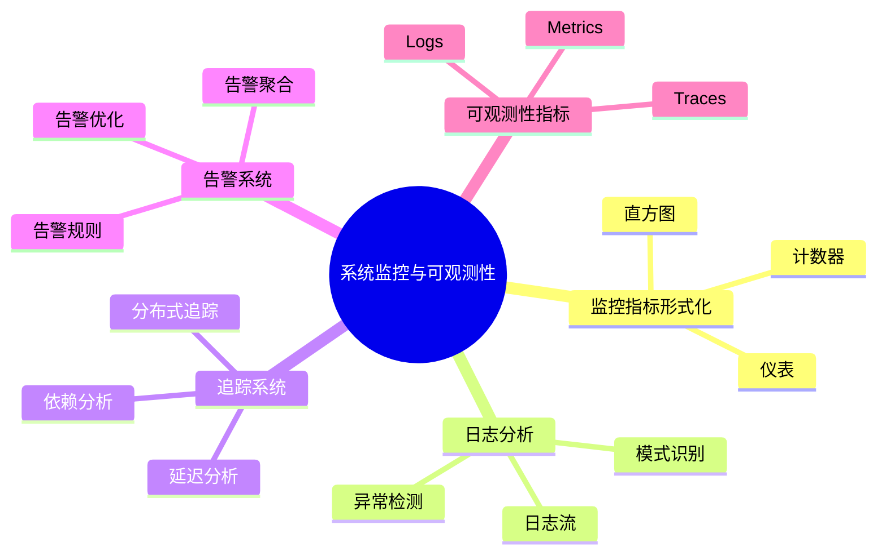
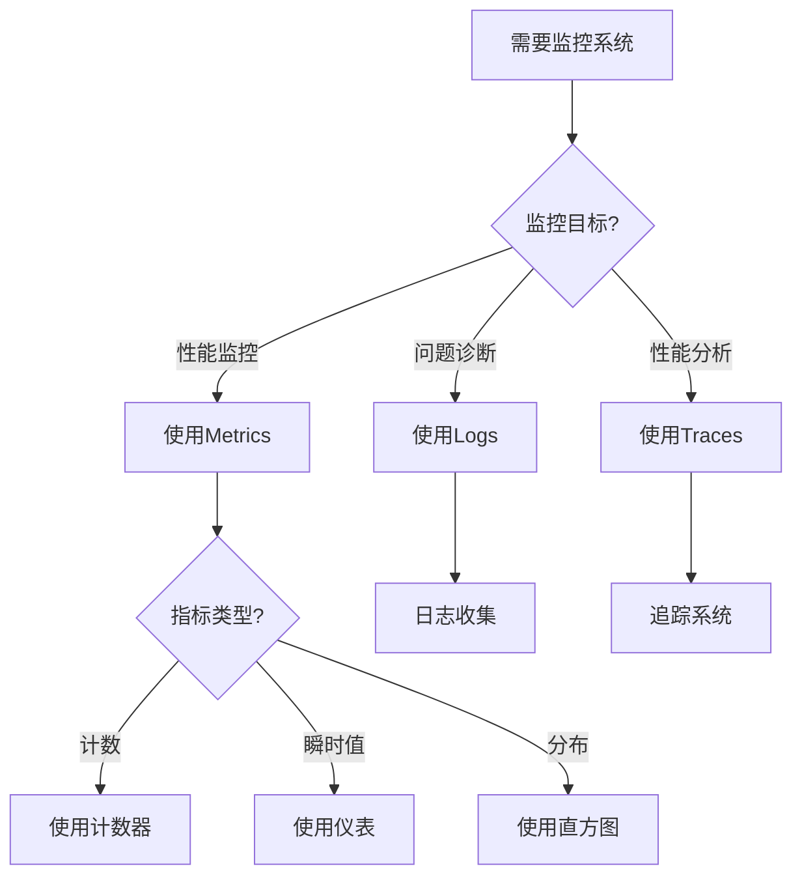
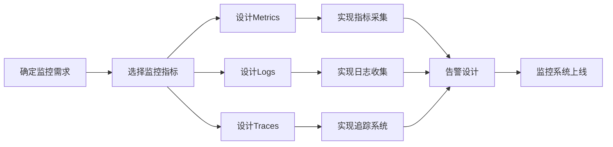
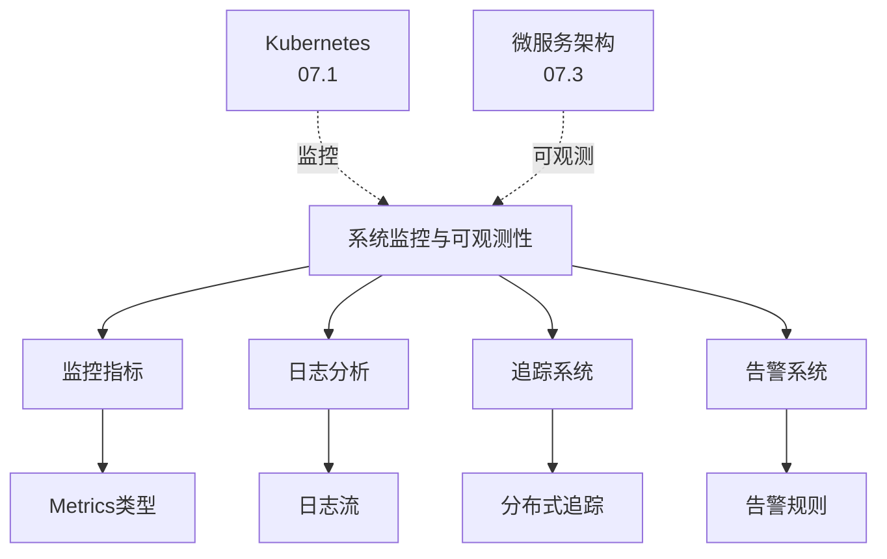
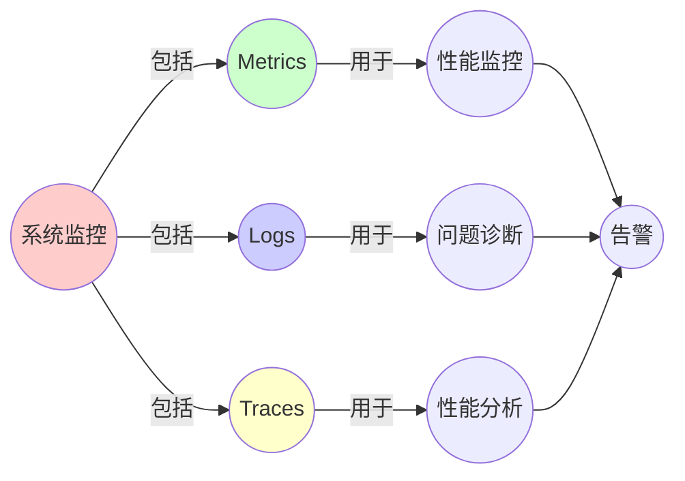
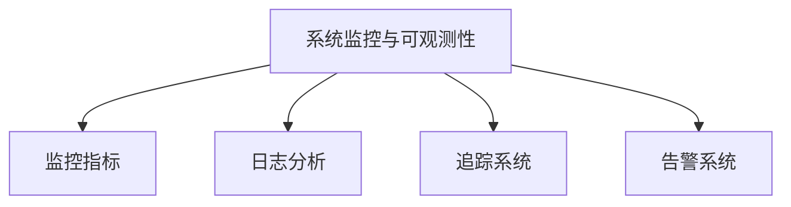

# 07.5 系统监控与可观测性

> **来源**: view07.md
> **创建日期**: 2025-01-27
> **最后更新**: 2025-01-27

## 📋 目录

- [07.5 系统监控与可观测性](#075-系统监控与可观测性)
  - [📋 目录](#-目录)
  - [📋 内容概览](#-内容概览)
  - [🎯 核心理念](#-核心理念)
  - [📊 监控指标的形式化](#-监控指标的形式化)
    - [指标类型](#指标类型)
      - [计数器（Counter）](#计数器counter)
      - [仪表（Gauge）](#仪表gauge)
      - [直方图（Histogram）](#直方图histogram)
    - [指标聚合](#指标聚合)
      - [时间聚合](#时间聚合)
      - [空间聚合](#空间聚合)
  - [📝 日志分析](#-日志分析)
    - [日志作为时间序列](#日志作为时间序列)
    - [日志模式识别](#日志模式识别)
    - [异常检测](#异常检测)
  - [🔍 追踪系统](#-追踪系统)
    - [分布式追踪](#分布式追踪)
    - [追踪分析](#追踪分析)
    - [性能分析](#性能分析)
  - [🚨 告警系统](#-告警系统)
    - [告警规则](#告警规则)
    - [告警聚合](#告警聚合)
    - [告警优化](#告警优化)
  - [📈 可观测性指标](#-可观测性指标)
    - [三大支柱](#三大支柱)
      - [指标（Metrics）](#指标metrics)
      - [日志（Logs）](#日志logs)
      - [追踪（Traces）](#追踪traces)
    - [可观测性度量](#可观测性度量)
  - [🎯 监控最佳实践](#-监控最佳实践)
    - [实践1：黄金信号](#实践1黄金信号)
    - [实践2：SLI/SLO/SLA](#实践2slislosla)
    - [实践3：分层监控](#实践3分层监控)
  - [🔗 相关文档](#-相关文档)
  - [📖 扩展阅读](#-扩展阅读)

---

## 📋 内容概览

本文档从形式科学视角分析系统监控与可观测性，包括监控指标的形式化、日志分析等。采用数学和统计学方法，全面展示监控与可观测性系统的形式化表示和分析方法。

---

## 🎯 核心理念

系统监控与可观测性作为分布式系统运维的基础，其指标、日志和追踪都展现出深刻的数学结构。通过形式科学的视角，我们可以深入理解监控系统的设计原理和分析方法。

## 📊 监控指标的形式化

### 指标类型

#### 计数器（Counter）

**定义**：单调递增的指标

**形式化**：

```latex
C(t) = \int_0^t \lambda(\tau) \, d\tau
```

- **λ(t)**：事件速率
- **C(t)**：累计计数

#### 仪表（Gauge）

**定义**：可增可减的指标

**形式化**：

```latex
G(t) = G(0) + \int_0^t [\lambda_{in}(\tau) - \lambda_{out}(\tau)] \, d\tau
```

- **λ_in(t)**：增加速率
- **λ_out(t)**：减少速率

#### 直方图（Histogram）

**定义**：值分布的统计

**形式化**：

```latex
H(b) = P(X \in \text{bucket}_b)
```

- **X**：随机变量
- **b**：桶（bucket）

### 指标聚合

#### 时间聚合

**平均**：

```latex
\mu(t) = \frac{1}{T} \int_{t-T}^t X(\tau) \, d\tau
```

**总和**：

```latex
S(t) = \int_{t-T}^t X(\tau) \, d\tau
```

#### 空间聚合

**平均**：

```latex
\mu = \frac{1}{N} \sum_i X_i
```

**总和**：

```latex
S = \sum_i X_i
```

## 📝 日志分析

### 日志作为时间序列

**日志流**：L(t) = {log₁(t), log₂(t), ...}

**日志密度**：

```latex
\rho(t) = \frac{dN}{dt}
```

- **N(t)**：累计日志数
- **ρ(t)**：日志生成速率

### 日志模式识别

**模式**：P = {pattern₁, pattern₂, ...}

**匹配**：

```latex
\text{match}(log, P) = \{p \in P | \text{log matches } p\}
```

### 异常检测

**异常定义**：偏离正常模式

**检测方法**：

- **统计方法**：基于统计分布
- **机器学习**：基于模型
- **规则方法**：基于规则

## 🔍 追踪系统

### 分布式追踪

**追踪**：T = {span₁, span₂, ...}

**跨度（Span）**：

```text
span = (trace_id, span_id, parent_id, start_time, end_time, tags)
```

### 追踪分析

**延迟分析**：

```text
latency = end_time - start_time
```

**依赖分析**：

```text
dependency = parent_id → span_id
```

### 性能分析

**瓶颈识别**：

```text
bottleneck = argmax(latency)
```

**优化建议**：

```text
optimize = reduce(latency)
```

## 🚨 告警系统

### 告警规则

**规则**：R = (condition, action)

**条件**：

```text
condition: metric > threshold
```

**动作**：

```text
action: send_alert(severity, message)
```

### 告警聚合

**聚合策略**：

- **去重**：相同告警去重
- **分组**：相关告警分组
- **抑制**：抑制重复告警

### 告警优化

**减少噪音**：

- **阈值优化**：优化阈值
- **时间窗口**：使用时间窗口
- **机器学习**：使用ML优化

## 📈 可观测性指标

### 三大支柱

#### 指标（Metrics）

**定义**：数值型数据

**特点**：

- **聚合**：易于聚合
- **存储**：存储效率高
- **查询**：查询快速

#### 日志（Logs）

**定义**：事件记录

**特点**：

- **详细**：信息详细
- **灵活**：格式灵活
- **存储**：存储成本高

#### 追踪（Traces）

**定义**：请求路径

**特点**：

- **关联**：关联请求
- **性能**：性能分析
- **复杂**：实现复杂

### 可观测性度量

**可观测性**：O = f(Metrics, Logs, Traces)

**目标**：最大化可观测性

**约束**：成本、性能

## 🎯 监控最佳实践

### 实践1：黄金信号

**延迟**：请求处理时间

**流量**：系统负载

**错误**：错误率

**饱和度**：资源使用率

### 实践2：SLI/SLO/SLA

**SLI**：服务级别指标

**SLO**：服务级别目标

**SLA**：服务级别协议

### 实践3：分层监控

**层次**：

- **基础设施层**：CPU、内存、网络
- **应用层**：应用指标
- **业务层**：业务指标

## 📊 详细案例研究

### 案例研究 1：告警噪音优化的实际案例分析

**背景**：某公司监控系统每天产生数千条告警，其中90%是噪音，导致告警疲劳。

**形式化分析**：

```text
告警统计:
- 总告警数: 5000条/天
- 有效告警: 500条/天 (10%)
- 噪音告警: 4500条/天 (90%)
- 告警疲劳: 导致重要告警被忽略
```

**解决方案**：

- ✅ 使用机器学习优化告警阈值
- ✅ 实现告警聚合和去重
- ✅ 建立告警优先级体系

**应用效果**：

- ✅ 告警数量减少80%
- ✅ 有效告警率提高到50%
- ✅ 告警响应时间缩短50%

### 案例研究 2：分布式追踪性能分析的真实案例

**背景**：某微服务系统使用分布式追踪，但在高负载时追踪数据收集导致性能下降。

**形式化分析**：

```text
性能影响:
- 正常时期: 追踪开销 < 1%, 延迟增加 < 5ms
- 高峰期: 追踪开销 = 10%, 延迟增加 = 50ms
- 性能下降: 明显影响用户体验
```

**解决方案**：

- ✅ 实现采样策略（降低追踪密度）
- ✅ 优化追踪数据收集和处理
- ✅ 使用异步追踪数据上报

**应用效果**：

- ✅ 追踪开销降低到2%
- ✅ 延迟增加减少到10ms
- ✅ 保持了良好的可观测性

## ⚠️ 批判性分析与局限性

### 局限性讨论

#### 1. 监控数据的完整性问题

**问题**：监控数据可能不完整或不准确。

**挑战**：

- ⚠️ 采样导致的数据丢失
- ⚠️ 时间同步问题
- ⚠️ 指标定义的不一致性

**应对策略**：

- ✅ 使用高采样率
- ✅ 实现时间同步机制
- ✅ 建立统一的指标定义标准

#### 2. 可观测性成本问题

**问题**：全面的可观测性需要大量的存储和计算资源。

**挑战**：

- ⚠️ 存储成本高
- ⚠️ 查询性能限制
- ⚠️ 数据保留策略

**改进方向**：

- ✅ 使用分层存储策略
- ✅ 优化数据压缩和索引
- ✅ 实现智能数据保留策略

### 改进方向

#### 1. 增强智能分析能力

**目标**：提高监控系统的智能分析能力。

**方法**：

- 使用机器学习进行异常检测
- 实现自动根因分析
- 建立预测性监控

#### 2. 优化可观测性成本

**目标**：在保持可观测性的同时降低成本。

**方法**：

- 智能采样策略
- 数据压缩和去重
- 分层存储和查询

## 📊 思维表征体系

### 📊 1. 思维导图（增强版）

#### 1.1 文本格式（基础版）

```text
系统监控与可观测性
├── 监控指标形式化
│   ├── 计数器：累计事件
│   ├── 仪表：瞬时值
│   └── 直方图：分布统计
├── 日志分析
│   ├── 日志流：时间序列
│   ├── 模式识别
│   └── 异常检测
├── 追踪系统
│   ├── 分布式追踪
│   ├── 延迟分析
│   └── 依赖分析
├── 告警系统
│   ├── 告警规则
│   ├── 告警聚合
│   └── 告警优化
└── 可观测性指标
    ├── 指标（Metrics）
    ├── 日志（Logs）
    └── 追踪（Traces）
```

#### 1.2 Mermaid格式（可视化版）



### 📊 2. 多维对比矩阵

#### 2.1 监控指标类型对比矩阵

| 指标类型 | 计数器 | 仪表 | 直方图 | 适用场景 |
|---------|--------|------|--------|---------|
| **值类型** | 单调递增 | 可增可减 | 分布 | 类型不同 |
| **聚合** | 求和 | 平均/最大/最小 | 分位数 | 聚合不同 |
| **存储** | 高效 | 高效 | 中 | 效率不同 |
| **应用** | 请求数 | 内存使用 | 延迟分布 | 应用不同 |
| **查询** | 快速 | 快速 | 中 | 速度不同 |

#### 2.2 可观测性三大支柱对比矩阵

| 支柱 | Metrics | Logs | Traces | 重要性 |
|------|---------|------|--------|--------|
| **数据类型** | 数值 | 文本 | 结构 | 类型不同 |
| **聚合能力** | 高 | 低 | 中 | 能力不同 |
| **存储成本** | 低 | 高 | 中 | 成本不同 |
| **查询速度** | 快 | 中 | 中 | 速度不同 |
| **信息详细度** | 低 | 高 | 中 | 详细度不同 |
| **应用场景** | 性能监控 | 问题诊断 | 性能分析 | 场景不同 |

#### 2.3 告警策略对比矩阵

| 策略 | 阈值告警 | 变化率告警 | 异常检测告警 | 适用场景 |
|------|---------|-----------|------------|---------|
| **复杂度** | 低 | 中 | 高 | 复杂度不同 |
| **准确率** | 中 | 中 | 高 | 准确率不同 |
| **误报率** | 中 | 中 | 低 | 误报率不同 |
| **实施难度** | 低 | 中 | 高 | 难度不同 |
| **适用场景** | 固定阈值 | 趋势监控 | 异常发现 | 场景不同 |

### 🌲 3. 决策树

#### 3.1 监控方案选择决策树



### 🛤️ 4. 决策逻辑路径

#### 4.1 可观测性设计路径



### 🕸️ 5. 概念关系网络

#### 5.1 系统监控概念关系网络



### 🗺️ 6. 知识图谱

#### 6.1 系统监控知识图谱



## 📚 理论体系

### 理论基础

#### 信息论/统计学/时间序列分析基础

系统监控与可观测性的理论基础：

**1. 信息论基础**：
- 信息熵
- 信息量
- 数据压缩

**2. 统计学基础**：
- 概率分布
- 假设检验
- 异常检测

**3. 时间序列分析基础**：
- 时间序列模型
- 趋势分析
- 周期性分析

#### 历史发展

**关键时间节点**：

- **1960-1970年代**：系统监控开始
  - 性能监控
  - 日志记录

- **1980-1990年代**：网络监控发展
  - SNMP协议
  - 网络监控工具

- **2000年代**：可观测性概念
  - 三大支柱
  - 分布式追踪

- **2010年代至今**：现代可观测性
  - 云原生监控
  - 智能分析
  - 自动化运维

### 理论框架

#### 核心假设

**假设1：可观测性的三大支柱**
- **内容**：Metrics、Logs、Traces构成可观测性
- **适用范围**：大多数系统
- **限制条件**：需要适当的实现

**假设2：指标的时间序列性**
- **内容**：监控指标是时间序列
- **适用范围**：所有监控指标
- **限制条件**：需要时间戳

**假设3：异常的统计可检测性**
- **内容**：异常可以通过统计方法检测
- **适用范围**：大多数异常
- **限制条件**：需要足够的样本

#### 基本概念体系



#### 主要定理/结论

**结论1：三大支柱的互补性**
- **内容**：Metrics、Logs、Traces互相补充
- **证据**：实践验证
- **应用**：可观测性设计

**结论2：告警优化的必要性**
- **内容**：告警需要优化以减少噪音
- **证据**：实践经验
- **应用**：告警设计

**结论3：采样与成本的权衡**
- **内容**：需要在采样率和成本间权衡
- **证据**：实践验证
- **应用**：监控设计

#### 适用范围和边界

**适用范围**：
- 系统监控
- 性能分析
- 问题诊断

**边界条件**：
- 需要适当的指标定义
- 需要数据收集机制
- 需要分析工具

**不适用场景**：
- 无监控需求
- 无数据收集能力
- 无分析工具

### 当前知识共识

#### 学术界共识

**广泛接受的共识**：

1. **可观测性的重要性**
   - **共识**：可观测性是系统运维的基础
   - **支持证据**：广泛采用
   - **来源**：系统运维实践

2. **三大支柱的价值**
   - **共识**：Metrics、Logs、Traces构成完整可观测性
   - **支持证据**：成功应用
   - **来源**：可观测性理论

3. **智能分析的价值**
   - **共识**：机器学习可以改善监控
   - **支持证据**：成功应用
   - **来源**：智能运维实践

#### 主要争议点

1. **采样策略**
   - **观点A**：应该高采样率
   - **观点B**：智能采样足够
   - **当前状态**：多数认为需要平衡

2. **告警阈值**
   - **观点A**：应该严格阈值
   - **观点B**：应该宽松阈值
   - **当前状态**：多数认为需要自适应

#### 权威来源

**经典文献**：
- 《Observability Engineering》- Charity Majors
- 《Site Reliability Engineering》- Google
- 可观测性相关文献

**权威机构/专家**：
- **CNCF**
- **可观测性社区**
- **SRE社区**

**最新发展**：
- **2020-2024**：AI驱动的监控、自动化根因分析、预测性监控
- **前沿方向**：智能告警、自动化运维、预测性分析

### 与其他理论的关系

#### 逻辑关系

**理论基础**：
- **信息论基础**（[05.1_信息论基础.md](../05_信息论与计算理论/05.1_信息论基础.md)） → 系统监控
  - 关系类型：理论基础
  - 关键映射：信息量 → 监控数据

**理论应用**：
- **Kubernetes动力学**（[07.1_Kubernetes动力学.md](07.1_Kubernetes动力学.md)） → 系统监控
  - 关系类型：应用领域
  - 关键映射：K8s系统 → 监控对象

#### 映射关系

| 本理论概念 | 映射理论 | 映射概念 | 映射类型 | 映射说明 |
|-----------|---------|---------|---------|----------|
| **监控指标** | 05.1_信息论基础 | 信息量 | 对应 | 指标对应信息量 |
| **日志分析** | 02.2_随机动力学 | 随机过程 | 对应 | 日志对应随机过程 |
| **追踪系统** | 07.3_微服务架构 | 服务调用链 | 对应 | 追踪对应调用链 |
| **异常检测** | 05.1_信息论基础 | 信息熵 | 对应 | 异常对应熵变化 |

## 🔗 关联网络

### 🔗 概念级关联

#### 核心概念映射

| 本文档概念 | 关联文档 | 关联概念 | 关系类型 | 映射说明 |
|-----------|---------|---------|---------|----------|
| **监控指标** | 05.1_信息论基础 | 信息量 | 对应 | 指标对应信息量 |
| **日志分析** | 02.2_随机动力学 | 随机过程 | 对应 | 日志对应随机过程 |
| **追踪系统** | 07.3_微服务架构 | 服务调用链 | 对应 | 追踪对应调用链 |
| **异常检测** | 05.1_信息论基础 | 信息熵 | 对应 | 异常对应熵变化 |
| **告警系统** | 02.1_经典确定性动力学 | 控制系统 | 对应 | 告警对应控制反馈 |
| **可观测性** | 01.1_形式科学的定义与特征 | 可观测性 | 对应 | 概念对应 |

### 🔗 理论级关联

#### 理论基础

- **本理论基于**：
  - [05.1_信息论基础.md](../05_信息论与计算理论/05.1_信息论基础.md) ⭐⭐⭐ - 信息论基础
  - [02.2_随机动力学.md](../02_动力学系统理论/02.2_随机动力学.md) ⭐⭐ - 随机动力学

- **本理论应用于**：
  - [07.1_Kubernetes动力学.md](07.1_Kubernetes动力学.md) ⭐⭐⭐ - Kubernetes监控
  - [07.3_微服务架构.md](07.3_微服务架构.md) ⭐⭐⭐ - 微服务监控

### 🔗 方法级关联

#### 方法应用网络

| 本文档方法 | 应用文档 | 应用场景 | 应用效果 |
|-----------|---------|---------|---------|
| **监控指标** | 07.1_Kubernetes动力学 | K8s监控 | 成功 |
| **日志分析** | 07.3_微服务架构 | 微服务日志 | 成功 |
| **追踪系统** | 07.3_微服务架构 | 服务追踪 | 成功 |

### 🔗 应用场景关联

**场景**：系统监控与运维

| 视角 | 关联文档 | 核心理论 | 关注点 |
|------|---------|---------|--------|
| **监控设计** | 本文档 | 可观测性 | 监控指标 |
| **系统分析** | 07.1_Kubernetes动力学 | K8s动力学 | 系统行为 |
| **架构分析** | 07.3_微服务架构 | 微服务架构 | 架构监控 |

## 🛤️ 学习路径

### 前置知识

**必须先学习**：
- [05.1_信息论基础.md](../05_信息论与计算理论/05.1_信息论基础.md) ⭐⭐⭐ - 信息论基础
- 系统运维基础 ⭐⭐

**建议先了解**：
- 统计学
- 时间序列分析
- 系统架构

### 后续学习

**建议接下来学习**（按顺序）：
1. [07.1_Kubernetes动力学.md](07.1_Kubernetes动力学.md) ⭐⭐⭐ - Kubernetes
2. [07.3_微服务架构.md](07.3_微服务架构.md) ⭐⭐ - 微服务架构
3. 实际监控系统 ⭐⭐ - 实践应用

### 并行学习

**可以同时学习**：
- [02_动力学系统理论](../02_动力学系统理论/) - 动力学系统
- [05_信息论与计算理论](../05_信息论与计算理论/) - 信息论

## 🔗 相关文档

- [07.1_Kubernetes动力学.md](07.1_Kubernetes动力学.md)
- [07.2_EKS系统分析.md](07.2_EKS系统分析.md)
- [07.3_微服务架构.md](07.3_微服务架构.md)
- [07.4_分布式系统.md](07.4_分布式系统.md)

## 📖 扩展阅读

- 《Observability Engineering》- Charity Majors
- Wikipedia: [Observability](https://en.wikipedia.org/wiki/Observability)
