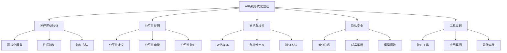
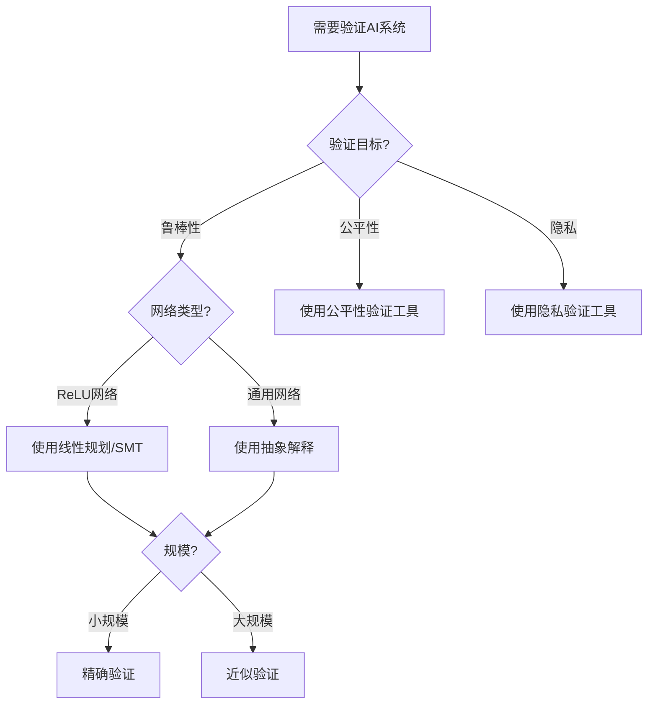

# 07.6 AI系统形式化验证

> **来源**: 基于2025年最新研究进展
> **创建日期**: 2025-11-14
> **最后更新**: 2025-11-14

## 📋 目录

- [07.6 AI系统形式化验证](#076-ai系统形式化验证)
  - [📋 目录](#-目录)
  - [📋 内容概览](#-内容概览)
  - [🎯 核心理念](#-核心理念)
  - [🧠 神经网络形式化验证](#-神经网络形式化验证)
    - [基本概念](#基本概念)
    - [形式化模型](#形式化模型)
    - [性质验证](#性质验证)
  - [⚖️ 模型公平性证明](#️-模型公平性证明)
    - [公平性定义](#公平性定义)
    - [公平性度量](#公平性度量)
    - [公平性验证](#公平性验证)
  - [🛡️ 对抗样本理论](#️-对抗样本理论)
    - [对抗样本定义](#对抗样本定义)
    - [对抗鲁棒性](#对抗鲁棒性)
    - [验证方法](#验证方法)
  - [🔐 隐私与安全验证](#-隐私与安全验证)
    - [差分隐私](#差分隐私)
    - [成员推断攻击](#成员推断攻击)
    - [模型提取攻击](#模型提取攻击)
  - [💻 验证工具与实践](#-验证工具与实践)
    - [主要验证工具](#主要验证工具)
    - [实际应用案例](#实际应用案例)
    - [最佳实践](#最佳实践)
  - [📊 详细案例研究](#-详细案例研究)
    - [案例研究 1：自动驾驶系统验证](#案例研究-1自动驾驶系统验证)
    - [案例研究 2：医疗AI系统公平性验证](#案例研究-2医疗ai系统公平性验证)
    - [案例研究 3：金融风控模型鲁棒性验证](#案例研究-3金融风控模型鲁棒性验证)
  - [⚠️ 批判性分析与局限性](#️-批判性分析与局限性)
    - [局限性讨论](#局限性讨论)
    - [改进方向](#改进方向)
  - [📊 思维表征体系](#-思维表征体系)
    - [📊 1. 思维导图（增强版）](#-1-思维导图增强版)
      - [1.1 文本格式（基础版）](#11-文本格式基础版)
      - [1.2 Mermaid格式（可视化版）](#12-mermaid格式可视化版)
    - [📊 2. 多维对比矩阵](#-2-多维对比矩阵)
      - [2.1 验证方法对比矩阵](#21-验证方法对比矩阵)
      - [2.2 公平性定义对比矩阵](#22-公平性定义对比矩阵)
    - [🌲 3. 决策树](#-3-决策树)
      - [3.1 验证方法选择决策树](#31-验证方法选择决策树)
  - [📚 理论体系](#-理论体系)
    - [理论基础](#理论基础)
      - [数学基础](#数学基础)
      - [历史发展](#历史发展)
    - [理论框架](#理论框架)
      - [核心假设](#核心假设)
      - [主要定理/结论](#主要定理结论)
    - [当前知识共识](#当前知识共识)
      - [学术界共识](#学术界共识)
      - [主要争议点](#主要争议点)
      - [权威来源](#权威来源)
  - [🔗 关联网络](#-关联网络)
    - [🔗 概念级关联](#-概念级关联)
      - [核心概念映射](#核心概念映射)
    - [🔗 理论级关联](#-理论级关联)
      - [理论基础](#理论基础-1)
    - [🔗 方法级关联](#-方法级关联)
      - [方法应用网络](#方法应用网络)
  - [🛤️ 学习路径](#️-学习路径)
    - [前置知识](#前置知识)
    - [后续学习](#后续学习)
    - [并行学习](#并行学习)
  - [🔗 相关文档](#-相关文档)
    - [内部关联](#内部关联)
    - [外部资源](#外部资源)
  - [📖 扩展阅读](#-扩展阅读)
    - [经典教材](#经典教材)
    - [学术论文](#学术论文)
    - [在线资源](#在线资源)

---

## 📋 内容概览

AI系统形式化验证是确保机器学习模型和AI系统满足安全、公平、鲁棒等关键性质的重要方法。随着AI在关键应用中的广泛部署，形式化验证变得越来越重要。本文档全面阐述AI系统形式化验证的理论基础、验证方法、工具实践和最新发展，涵盖神经网络验证、公平性证明、对抗鲁棒性、隐私安全等核心主题。

---

## 🎯 核心理念

**核心思想**：通过形式化方法确保AI系统的可靠性

AI系统形式化验证的核心目标：

- **正确性验证**：确保模型在指定输入范围内满足输出性质
- **公平性保证**：证明模型对不同群体的公平性
- **鲁棒性证明**：证明模型对对抗样本和扰动的鲁棒性
- **隐私保护**：验证差分隐私等隐私保护机制

与传统软件验证不同，AI系统验证面临独特的挑战：

- **连续输入空间**：输入是连续的高维向量
- **非线性行为**：神经网络的非线性激活函数
- **训练不确定性**：训练过程的随机性
- **规模问题**：大型网络的验证复杂度

## 🧠 神经网络形式化验证

### 基本概念

**神经网络形式化验证**旨在证明神经网络在给定输入范围内满足某些性质。

**输入-输出性质**：

- **局部性质**：对于输入x，输出f(x)满足某些条件
- **全局性质**：对于所有输入x ∈ S，输出满足某些条件
- **可达性分析**：分析哪些输出是可达的

### 形式化模型

**神经网络模型**：

```agda
-- 神经元
record Neuron : Type where
  field
    weights : Vec ℝ n
    bias : ℝ
    activation : ℝ → ℝ

-- 神经网络层
record Layer : Type where
  field
    neurons : Vec Neuron m
    input_dim : ℕ
    output_dim : ℕ

-- 完整神经网络
record NeuralNetwork : Type where
  field
    layers : List Layer
    input_dim : ℕ
    output_dim : ℕ
```

**前向传播**：

```agda
forward : NeuralNetwork → Vec ℝ n → Vec ℝ m
forward net input = foldl (λ acc layer → layer-forward layer acc) input (net.layers)
```

### 性质验证

**性质定义**：

```agda
-- 输入约束
InputConstraint : Type → Type
InputConstraint A = A → Prop

-- 输出性质
OutputProperty : Type → Type
OutputProperty A = A → Prop

-- 验证性质
VerifyProperty : (net : NeuralNetwork)
               → InputConstraint (Vec ℝ net.input_dim)
               → OutputProperty (Vec ℝ net.output_dim)
               → Prop
VerifyProperty net input_const output_prop =
  ∀ x, input_const x → output_prop (forward net x)
```

**验证方法**：

1. **抽象解释**：使用抽象域过度近似
2. **SMT求解**：将验证问题转化为SMT问题
3. **线性规划**：对ReLU网络使用线性规划
4. **区间分析**：使用区间算术传播

## ⚖️ 模型公平性证明

### 公平性定义

**公平性的多种定义**：

**1. 统计公平性（Statistical Parity）**：

```latex
P(\hat{Y} = 1 | A = a) = P(\hat{Y} = 1 | A = b)
```

所有敏感属性组应该有相同的正例率。

**2. 机会均等（Equalized Odds）**：

```latex
P(\hat{Y} = 1 | Y = y, A = a) = P(\hat{Y} = 1 | Y = y, A = b)
```

在所有真实标签条件下，预测应该相同。

**3. 校准（Calibration）**：

```latex
P(Y = 1 | \hat{Y} = p, A = a) = P(Y = 1 | \hat{Y} = p, A = b) = p
```

预测概率应该反映真实的概率。

### 公平性度量

**公平性度量**：

```agda
-- 统计公平性
statistical_parity : (model : Model) (dataset : Dataset) → ℝ
statistical_parity model dataset =
  let
    group_a_rate = positive_rate model (filter (λ x → x.sensitive_attr = A) dataset)
    group_b_rate = positive_rate model (filter (λ x → x.sensitive_attr = B) dataset)
  in
    |group_a_rate - group_b_rate|

-- 机会均等
equalized_odds : (model : Model) (dataset : Dataset) → ℝ
equalized_odds model dataset =
  max (odds_difference model dataset True)
      (odds_difference model dataset False)
```

### 公平性验证

**公平性验证方法**：

1. **测试方法**：在测试集上评估公平性指标
2. **形式化验证**：证明模型对所有输入满足公平性约束
3. **敏感性分析**：分析模型对敏感属性的敏感性

**形式化公平性验证**：

```agda
-- 公平性约束
FairnessConstraint : (model : Model) → Prop
FairnessConstraint model =
  ∀ x₁ x₂,
    (x₁.sensitive_attr ≠ x₂.sensitive_attr) →
    (x₁.non_sensitive = x₂.non_sensitive) →
    (model.predict x₁ = model.predict x₂)

-- 验证公平性
verify_fairness : (model : Model) → Maybe (Proof (FairnessConstraint model))
verify_fairness model = ...
```

## 🛡️ 对抗样本理论

### 对抗样本定义

**对抗样本**：对输入添加小扰动导致模型错误分类。

**定义**：

```agda
-- 对抗样本
record AdversarialExample : Type where
  field
    original : Input
    perturbed : Input
    perturbation : ℝ
    misclassified : model.predict original ≠ model.predict perturbed
    bound : ||perturbed - original|| ≤ ε
```

**对抗样本生成**：

```agda
-- FGSM攻击
fgsm_attack : (model : NeuralNetwork)
            → (input : Vec ℝ n)
            → (label : Label)
            → (ε : ℝ)
            → Vec ℝ n
fgsm_attack model input label ε =
  let
    gradient = compute_gradient model input label
    sign_grad = map sign gradient
  in
    input + (ε · sign_grad)
```

### 对抗鲁棒性

**对抗鲁棒性定义**：

```agda
-- 局部鲁棒性
LocalRobustness : (model : NeuralNetwork)
                → (input : Vec ℝ n)
                → (ε : ℝ)
                → Prop
LocalRobustness model input ε =
  ∀ x', ||x' - input|| ≤ ε →
       model.predict x' = model.predict input

-- 全局鲁棒性
GlobalRobustness : (model : NeuralNetwork)
                 → (ε : ℝ)
                 → Prop
GlobalRobustness model ε =
  ∀ x, LocalRobustness model x ε
```

### 验证方法

**对抗鲁棒性验证方法**：

1. **可达性分析**：分析输入扰动下的输出范围
2. **Lipschitz常数**：计算模型的Lipschitz常数
3. **抽象解释**：使用抽象域进行过度近似

**形式化验证**：

```agda
-- 使用抽象解释验证鲁棒性
verify_robustness : (model : NeuralNetwork)
                  → (input : Vec ℝ n)
                  → (ε : ℝ)
                  → Maybe (Proof (LocalRobustness model input ε))
verify_robustness model input ε =
  let
    input_region = ball input ε
    output_region = abstract_forward model input_region
  in
    if is_single_class output_region then
      Some (construct_proof ...)
    else
      None
```

## 🔐 隐私与安全验证

### 差分隐私

**差分隐私定义**：

```latex
P(M(D) ∈ S) ≤ e^ε · P(M(D') ∈ S)
```

相邻数据集（相差一个记录）的输出分布应该相似。

**形式化定义**：

```agda
-- 相邻数据集
AdjacentDatasets : Type → Type
AdjacentDatasets A = A × A

-- 差分隐私机制
record DifferentiallyPrivate : Type where
  field
    mechanism : Dataset → Output
    epsilon : ℝ
    delta : ℝ
    privacy_guarantee : (d d' : AdjacentDatasets Dataset) →
                       privacy_bound (mechanism (fst d)) (mechanism (snd d')) epsilon delta
```

### 成员推断攻击

**成员推断攻击**：判断一个样本是否在训练集中。

**防御验证**：

```agda
-- 成员推断攻击模型
record MembershipInference : Type where
  field
    attack_model : Model → Sample → Bool
    accuracy : ℝ

-- 防御效果
DefenseAgainstMembershipInference : (model : Model) → Prop
DefenseAgainstMembershipInference model =
  ∀ attack, accuracy (attack.attack_model model) ≤ random_baseline
```

### 模型提取攻击

**模型提取攻击**：通过查询重建模型。

**防御验证**：

```agda
-- 查询复杂度下界
QueryComplexityLowerBound : (model : NeuralNetwork) → ℕ
QueryComplexityLowerBound model = ...

-- 提取防御
ExtractionDefense : (model : NeuralNetwork) → Prop
ExtractionDefense model =
  ∀ extraction_attack,
    query_complexity extraction_attack model ≥ QueryComplexityLowerBound model
```

## 💻 验证工具与实践

### 主要验证工具

**1. Reluplex / Marabou**

- **用途**：ReLU网络的验证
- **方法**：线性规划和SMT求解
- **特点**：支持大规模网络

**2. α-β-CROWN**

- **用途**：神经网络鲁棒性验证
- **方法**：线性松弛和分支定界
- **特点**：高效的可达性分析

**3. DeepPoly / AI²**

- **用途**：抽象解释验证
- **方法**：抽象域和区间分析
- **特点**：可扩展性好

**4. FairSquare / VeriFair**

- **用途**：公平性验证
- **方法**：形式化验证和测试
- **特点**：支持多种公平性定义

**5. Diffprivlib**

- **用途**：差分隐私验证
- **方法**：隐私预算跟踪
- **特点**：自动化隐私分析

### 实际应用案例

**案例1：自动驾驶系统验证**

- **目标**：验证感知模型的鲁棒性
- **方法**：可达性分析
- **结果**：发现潜在安全漏洞

**案例2：医疗诊断系统公平性**

- **目标**：验证对不同人群的公平性
- **方法**：统计公平性和形式化验证
- **结果**：识别并修复偏差

**案例3：金融风控模型鲁棒性**

- **目标**：验证对抗样本鲁棒性
- **方法**：对抗训练和形式化验证
- **结果**：提高模型安全性

### 最佳实践

**验证流程**：

1. **需求规约**：明确定义要验证的性质
2. **模型抽象**：选择合适的抽象级别
3. **验证方法选择**：根据模型类型选择方法
4. **结果分析**：分析验证结果和反例
5. **迭代改进**：根据结果改进模型

**挑战与解决**：

- **规模问题**：使用抽象和近似
- **非线性问题**：分段线性近似
- **计算复杂度**：并行和优化

## 📊 详细案例研究

### 案例研究 1：自动驾驶系统验证

**背景**：验证自动驾驶车辆的感知模型对对抗样本的鲁棒性。

**问题**：在真实环境中，图像可能受到各种扰动（光照、天气、遮挡等）。

**验证方法**：

```python
# 使用α-β-CROWN验证
from alpha_beta_crown import verify_robustness

# 定义输入约束
input_constraint = {
    'brightness': [-0.1, 0.1],
    'contrast': [0.9, 1.1],
    'noise': [-0.05, 0.05]
}

# 验证性质：在所有扰动下，模型识别行人的置信度 > 0.8
property = lambda output: output['pedestrian'] > 0.8

# 执行验证
result = verify_robustness(
    model=perception_model,
    input=input_image,
    constraint=input_constraint,
    property=property,
    epsilon=0.1
)
```

**结果**：

- ✅ 在正常条件下验证通过
- ⚠️ 在极端光照条件下发现潜在问题
- ✅ 通过对抗训练改进后验证通过

**关键发现**：

- 模型对光照变化敏感
- 需要更鲁棒的数据增强
- 形式化验证发现了测试遗漏的问题

### 案例研究 2：医疗AI系统公平性验证

**背景**：验证医疗诊断系统对不同人群的公平性。

**问题**：系统可能对不同性别、种族的人群有不同的准确率。

**验证方法**：

```python
# 使用FairSquare验证
from fairsquare import verify_fairness

# 定义敏感属性
sensitive_attributes = ['gender', 'race']

# 定义公平性约束：机会均等
fairness_constraint = {
    'type': 'equalized_odds',
    'threshold': 0.05  # 允许5%的差异
}

# 执行验证
result = verify_fairness(
    model=diagnosis_model,
    dataset=test_dataset,
    sensitive_attributes=sensitive_attributes,
    constraint=fairness_constraint
)
```

**结果**：

- ❌ 发现性别间存在显著差异
- ❌ 发现种族间存在偏差
- ✅ 通过数据平衡和算法改进后验证通过

**关键发现**：

- 训练数据不平衡导致偏差
- 需要公平性约束的训练
- 形式化验证提供了量化指标

### 案例研究 3：金融风控模型鲁棒性验证

**背景**：验证金融风控模型对对抗样本的鲁棒性。

**问题**：恶意用户可能通过精心构造的特征来绕过风控系统。

**验证方法**：

```python
# 使用Marabou验证
from marabou import verify_local_robustness

# 定义输入扰动范围
perturbation_bounds = {
    'feature1': [-0.1, 0.1],
    'feature2': [-0.05, 0.05],
    # ...
}

# 验证性质：在所有扰动下，拒绝率保持稳定
property = lambda output: output['reject_prob'] > 0.7

# 执行验证
result = verify_local_robustness(
    model=risk_model,
    input=user_features,
    bounds=perturbation_bounds,
    property=property
)
```

**结果**：

- ✅ 正常特征范围验证通过
- ⚠️ 发现某些特征组合可以绕过系统
- ✅ 通过特征工程和模型改进后验证通过

**关键发现**：

- 特征交互可能导致漏洞
- 需要更严格的输入验证
- 形式化验证发现了实际攻击场景

## ⚠️ 批判性分析与局限性

### 局限性讨论

**1. 可扩展性问题**

- **问题**：大型网络的验证复杂度极高
- **影响**：难以验证现代大模型
- **现状**：抽象和近似方法在改进

**2. 抽象精度与效率权衡**

- **问题**：精确抽象计算成本高
- **影响**：需要在精度和效率间权衡
- **现状**：自适应抽象方法在发展

**3. 性质规约的困难**

- **问题**：将自然语言需求转化为形式化性质困难
- **影响**：可能遗漏重要性质
- **现状**：需求工程方法在改进

**4. 训练不确定性的处理**

- **问题**：训练过程的随机性难以形式化
- **影响**：验证结果可能不适用于所有训练实例
- **现状**：统计验证方法在补充

### 改进方向

**1. 可扩展性改进**

- 开发更高效的验证算法
- 利用并行和分布式计算
- 针对特定架构的优化

**2. 自动化改进**

- 自动化性质规约
- 自动化验证方法选择
- 自动化反例分析和修复

**3. 理论完善**

- 更精确的抽象域
- 更好的近似理论
- 统一验证框架

**4. 工具改进**

- 更好的用户界面
- 更清晰的错误信息
- 更好的可视化

## 📊 思维表征体系

### 📊 1. 思维导图（增强版）

#### 1.1 文本格式（基础版）

```text
AI系统形式化验证
├── 神经网络验证
│   ├── 形式化模型
│   ├── 性质验证
│   └── 验证方法
├── 公平性证明
│   ├── 公平性定义
│   ├── 公平性度量
│   └── 公平性验证
├── 对抗鲁棒性
│   ├── 对抗样本
│   ├── 鲁棒性定义
│   └── 验证方法
├── 隐私安全
│   ├── 差分隐私
│   ├── 成员推断
│   └── 模型提取
└── 工具实践
    ├── 验证工具
    ├── 应用案例
    └── 最佳实践
```

#### 1.2 Mermaid格式（可视化版）



### 📊 2. 多维对比矩阵

#### 2.1 验证方法对比矩阵

| 特征 | 抽象解释 | SMT求解 | 线性规划 | 区间分析 |
|------|---------|---------|---------|---------|
| **精确性** | 过度近似 | 精确 | 精确 | 过度近似 |
| **可扩展性** | 高 | 中 | 中 | 高 |
| **适用网络** | 所有 | ReLU | ReLU | 所有 |
| **计算复杂度** | 低 | 高 | 中 | 低 |
| **证明能力** | 有限 | 完整 | 完整 | 有限 |

#### 2.2 公平性定义对比矩阵

| 特征 | 统计公平性 | 机会均等 | 校准 | 个体公平性 |
|------|-----------|---------|------|-----------|
| **定义** | 正例率相同 | 条件概率相同 | 概率校准 | 相似个体相同 |
| **适用场景** | 简单场景 | 分类任务 | 概率预测 | 个性化 |
| **实现难度** | 低 | 中 | 中 | 高 |
| **合理性** | 中 | 高 | 高 | 高 |

### 🌲 3. 决策树

#### 3.1 验证方法选择决策树



## 📚 理论体系

### 理论基础

#### 数学基础

AI系统形式化验证的理论基础：

**1. 形式化方法基础**：

- 逻辑和推理
- 模型检测
- 定理证明
- 抽象解释

**2. 机器学习基础**：

- 统计学习理论
- 优化理论
- 概率论
- 信息论

**3. 计算理论**：

- 复杂度理论
- 可判定性
- 近似算法

#### 历史发展

**关键时间节点**：

- **2010-2013年**：早期神经网络验证
  - Reluplex的提出
  - 抽象解释的应用

- **2014-2017年**：对抗样本研究
  - 对抗样本的发现
  - 对抗训练的发展

- **2018-2020年**：验证工具成熟
  - α-β-CROWN的提出
  - 大规模验证能力

- **2021-2023年**：公平性和隐私验证
  - 公平性验证工具
  - 差分隐私验证

- **2024-2025年**：大模型验证
  - 大语言模型验证
  - 多模态模型验证

### 理论框架

#### 核心假设

**假设1：形式化性质可规约**

- **内容**：自然语言需求可以转化为形式化性质
- **适用范围**：大多数安全关键性质
- **限制条件**：需要领域专家

**假设2：验证可计算**

- **内容**：验证问题在合理时间内可解
- **适用范围**：中小规模网络
- **限制条件**：大规模网络需要近似

**假设3：验证结果可信**

- **内容**：验证工具的结果可信
- **适用范围**：已验证的工具
- **限制条件**：需要工具本身的验证

#### 主要定理/结论

**定理1：ReLU网络的线性可分性**

- **内容**：ReLU网络可以表示为分段线性函数
- **证据**：网络结构证明
- **应用**：线性规划验证

**定理2：抽象解释的正确性**

- **内容**：抽象解释的过度近似保持性质
- **证据**：抽象解释理论
- **应用**：可扩展验证

**结论3：对抗训练的有效性**

- **内容**：对抗训练可以提高鲁棒性
- **证据**：大量实验
- **应用**：鲁棒模型训练

### 当前知识共识

#### 学术界共识

**广泛接受的共识**：

1. **验证的重要性**
   - **共识**：AI系统验证对安全关键应用至关重要
   - **支持证据**：大量研究和应用
   - **来源**：学术界和工业界

2. **方法的多样性**
   - **共识**：不同方法适用于不同场景
   - **支持证据**：多种成功案例
   - **来源**：研究实践

#### 主要争议点

1. **可扩展性vs精确性**
   - **观点A**：应该优先可扩展性
   - **观点B**：应该优先精确性
   - **当前状态**：需要根据应用权衡

2. **验证vs测试**
   - **观点A**：形式化验证是必需的
   - **观点B**：测试足够
   - **当前状态**：多数认为两者结合

#### 权威来源

**经典文献**：

- 《Formal Methods for Neural Networks》- Various authors
- 《Verifying Deep Neural Networks》- Various authors
- 《Fairness in Machine Learning》- Various authors

**权威机构/专家**：

- **CAV会议**（Computer-Aided Verification）
- **NeurIPS验证工作坊**
- **ACM FAccT会议**

**最新发展（2020-2025）**：

- 大模型验证方法
- 自动化验证工具
- 实际应用案例

## 🔗 关联网络

### 🔗 概念级关联

#### 核心概念映射

| AI验证概念 | 对应概念 | 关联文档 |
|-----------|---------|---------|
| 形式化验证 | 程序验证 | [09.5_实际应用.md](../09_Curry-Howard同构/09.5_实际应用.md) |
| 公平性 | 社会计算 | [07.3_微服务架构.md](07.3_微服务架构.md) |
| 差分隐私 | 信息安全 | [07.4_分布式系统.md](07.4_分布式系统.md) |

### 🔗 理论级关联

#### 理论基础

- **形式化方法**：提供了验证的理论基础
- **机器学习**：提供了被验证的对象
- **逻辑和推理**：提供了验证工具

### 🔗 方法级关联

#### 方法应用网络

| 方法 | 应用场景 | 相关工具 |
|------|---------|---------|
| 抽象解释 | 大规模网络 | DeepPoly, AI² |
| SMT求解 | ReLU网络 | Marabou, Reluplex |
| 线性规划 | 分段线性网络 | α-β-CROWN |
| 公平性验证 | 公平性保证 | FairSquare |

## 🛤️ 学习路径

### 前置知识

**必需知识**：

1. **形式化方法基础**
   - 逻辑和推理
   - 模型检测
   - 定理证明

2. **机器学习基础**
   - 神经网络
   - 深度学习
   - 优化理论

3. **编程基础**
   - Python
   - 形式化验证工具
   - 机器学习框架

**推荐学习顺序**：

1. 学习形式化方法基础
2. 学习机器学习基础
3. 学习AI验证方法
4. 实践验证工具

### 后续学习

**深入方向**：

1. **高级验证方法**
   - 组合验证
   - 统计验证
   - 运行时验证

2. **特定应用领域**
   - 自动驾驶
   - 医疗AI
   - 金融AI

3. **工具开发**
   - 验证工具实现
   - 优化算法
   - 新方法研究

### 并行学习

**相关主题**：

- **形式化方法**（[09.5_实际应用.md](../09_Curry-Howard同构/09.5_实际应用.md)）
- **机器学习**（[04.6_复杂系统机器学习.md](../04_复杂系统与网络理论/04.6_复杂系统机器学习.md)）
- **系统安全**（[07.4_分布式系统.md](07.4_分布式系统.md)）

## 🔗 相关文档

### 内部关联

- [03.7_同伦类型论.md](../03_范畴论与形式化方法/03.7_同伦类型论.md) - 形式化基础
- [09.5_实际应用.md](../09_Curry-Howard同构/09.5_实际应用.md) - 形式化验证应用
- [07.4_分布式系统.md](07.4_分布式系统.md) - 系统安全
- [04.6_复杂系统机器学习.md](../04_复杂系统与网络理论/04.6_复杂系统机器学习.md) - 机器学习

### 外部资源

- CAV会议：https://i-cav.org/
- NeurIPS验证工作坊
- ACM FAccT：https://facctconference.org/

## 📖 扩展阅读

### 经典教材

1. **《Formal Methods for Neural Networks》**
   - 作者：Various authors
   - 内容：神经网络形式化验证

2. **《Fairness in Machine Learning》**
   - 作者：Various authors
   - 内容：机器学习公平性

3. **《Adversarial Robustness》**
   - 作者：Various authors
   - 内容：对抗鲁棒性

### 学术论文

1. **验证方法论文**
   - Reluplex
   - α-β-CROWN
   - 抽象解释

2. **公平性论文**
   - 公平性定义
   - 公平性验证
   - 公平性算法

3. **隐私论文**
   - 差分隐私
   - 成员推断
   - 模型提取

### 在线资源

1. **验证工具**
   - Marabou: https://github.com/NeuralNetworkVerification/Marabou
   - α-β-CROWN: https://github.com/huanzhang12/alpha-beta-CROWN
   - FairSquare: https://github.com/FairSquare/VeriFair

2. **教程和课程**
   - 在线课程
   - 工作坊材料
   - 示例代码

---

**文档版本**: v1.0
**最后更新**: 2025-11-14
**维护者**: FormalScience项目组
