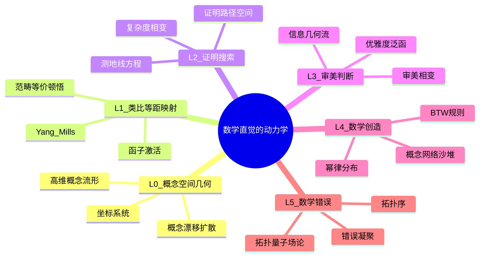
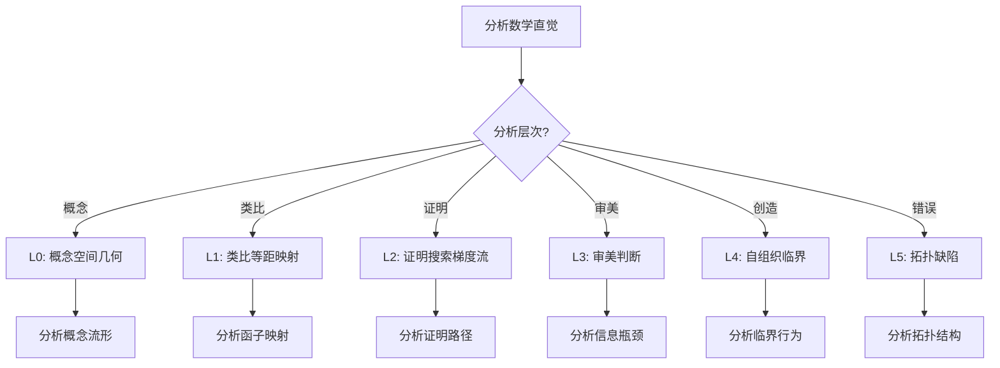
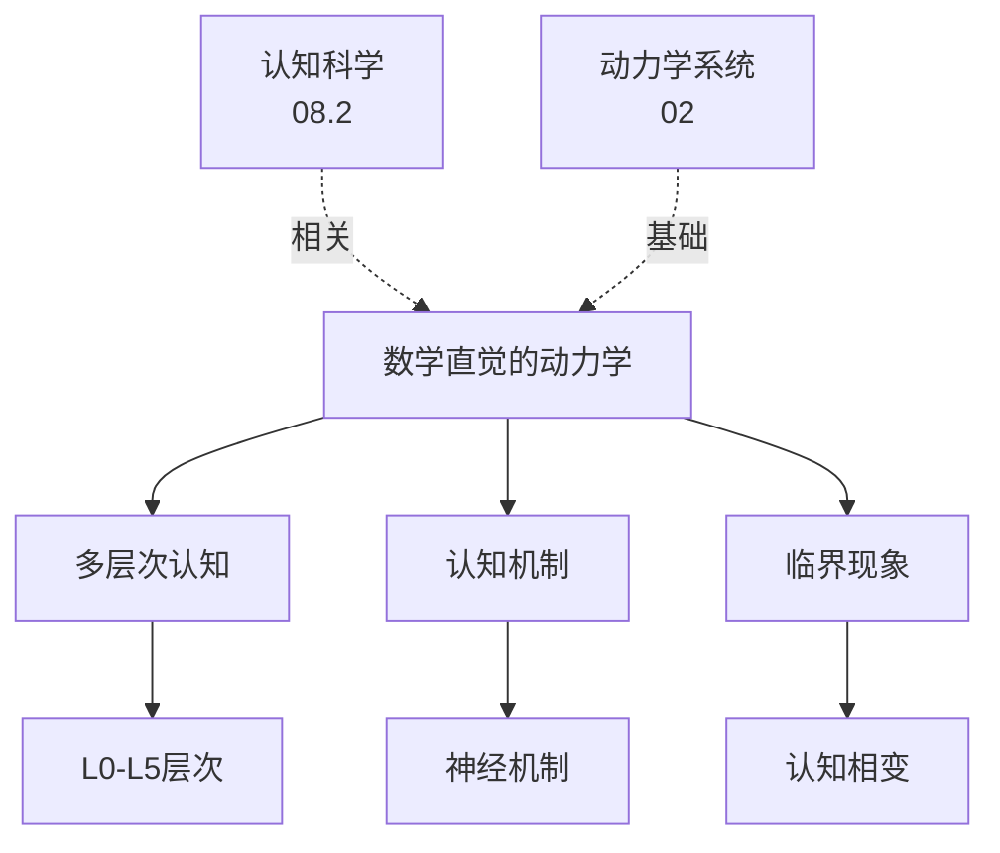
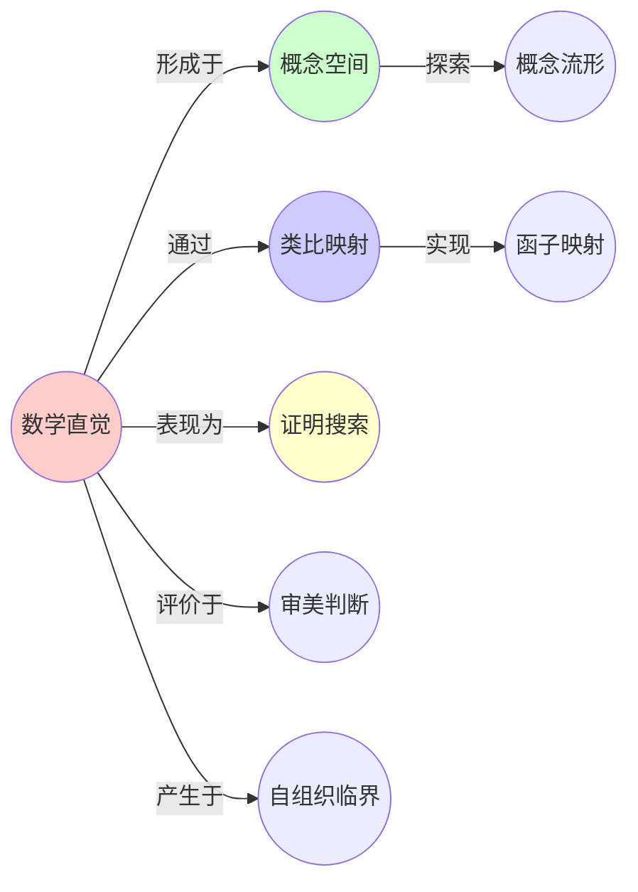
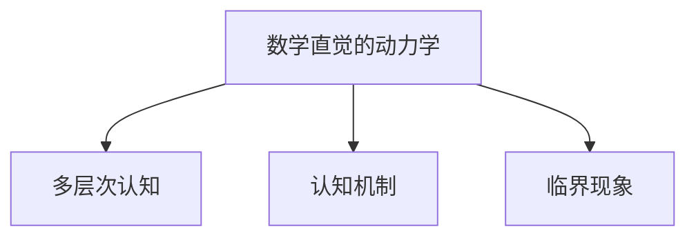

# 08.1 数学直觉的动力学

> **来源**: view07.md
> **创建日期**: 2025-01-27
> **最后更新**: 2025-01-27

## 📋 目录

- [08.1 数学直觉的动力学](#081-数学直觉的动力学)
  - [📋 目录](#-目录)
  - [📋 内容概览](#-内容概览)
  - [🎯 核心理念](#-核心理念)
  - [🧠 L0：概念空间的几何（神经实现）](#-l0概念空间的几何神经实现)
  - [🔄 L1：类比作为等距映射（范畴论实现）](#-l1类比作为等距映射范畴论实现)
  - [📐 L2：证明搜索作为梯度流（几何实现）](#-l2证明搜索作为梯度流几何实现)
  - [🎨 L3：审美判断作为信息瓶颈（深度学习实现）](#-l3审美判断作为信息瓶颈深度学习实现)
  - [🌋 L4：数学创造作为自组织临界（SOC）](#-l4数学创造作为自组织临界soc)
  - [⚠️ L5：数学错误作为拓扑缺陷](#️-l5数学错误作为拓扑缺陷)
  - [📊 详细案例研究](#-详细案例研究)
  - [⚠️ 批判性分析与局限性](#️-批判性分析与局限性)
  - [📊 思维导图](#-思维导图)
  - [🔗 相关文档](#-相关文档)
  - [📖 扩展阅读](#-扩展阅读)

---

## 📋 内容概览

本文档从动力学系统视角分析数学直觉的形成机制，揭示认知过程的数学结构。采用多层次分析方法，全面展示数学直觉的动力学模型和认知机制。

---

## 🎯 核心理念

数学直觉的形成是一个复杂的动力学过程，涉及概念空间的探索、类比的识别、证明的搜索等多个层面。通过动力学系统的视角，我们可以理解数学直觉的形成机制，预测学习效果，并设计更好的数学教育方法。

## 🧠 L0：概念空间的几何（神经实现）

### 状态变量：高维概念流形

数学概念在大脑中不是符号，而是**激活流形上的点**：

```text
C ∈ ℳ_concept ≈ ℝ^d  (d≈50-100, 局部皮层维度)
```

### 坐标系统

- **形式坐标** (x_formal)：公理、定理的句法结构（左顶叶）
- **几何坐标** (x_geometric)：视觉空间直觉（右顶叶）
- **数值坐标** (x_numerical)：算术直觉（顶内沟IPS）
- **抽象坐标** (x_abstract)：范畴结构（前额叶PFC）

### 动力学：概念漂移扩散

```latex
\frac{dC}{dt} = -\nabla U(C) + \eta \cdot \nabla \cdot D(C) + \xi(t)
```

- **U(C)** = **概念势能** = 先验熟悉度（专家vs新手）
- **D(C)** = **扩散张量** = 创造力（扩散场强弱）
- **ξ(t)** = **神经噪声** = 默认模式网络（DMN）的随机激活

### 与布朗运动同构

数学家在概念空间的搜索 = **粒子在势能景观中的热运动**

## 🔄 L1：类比作为等距映射（范畴论实现）

### 状态：函子激活张量

识别A→B的类比，是寻找**函子** ℱ: 𝒞_A → 𝒞_B ：

```latex
\mathcal{F} \in \mathcal{H}_{analogy} \approx \text{Hom}(\mathcal{M}_A, \mathcal{M}_B) \quad (\text{同态空间})
```

### 动力学：Yang-Mills规范场

```latex
\frac{\partial \mathcal{F}}{\partial t} = -\frac{\delta S}{\delta \mathcal{F}} \quad (S = \text{类比作用量})
S[\mathcal{F}] = \int d\mu \left(\sum_i ||\mathcal{F}(f_i) - g_i||^2 + \lambda \cdot R(\mathcal{F})\right)
```

- **f_i** = 源域𝒞_A的态射（如群同态）
- **g_i** = 目标域𝒞_B的态射（如拓扑连续映射）
- **R(ℱ)** = **正则项** = 函子合成复杂性（**奥卡姆剃刀**）

### 临界现象：范畴等价顿悟

**参数**：相似度阈值 θ = 0.7·dim(ℳ_A)

**分岔**：当**结构保持性**：

```latex
\eta = \frac{|\text{Hom}(\mathcal{F}(A), \mathcal{F}(B))|}{|\text{Hom}(A,B)|} > \theta
```

**系统跃迁到** ℱ**是忠实函子**的吸引子 → **Aha!时刻**

### 实例：伽罗瓦理论的发现

- A = 多项式根式解（代数几何）
- B = 域扩张的自同构群（抽象代数）
- ℱ = **伽罗瓦对应**：根 ↔ 群元素
- η = 1.0（**完全同构**）→ **数学史上最深刻的范畴同构**

**神经证据**：顿悟时fMRI显示**右颞前叶**（RTPJ）激活↗300%，**左顶叶**激活↘50%（**从逻辑到范畴的切换**）

## 📐 L2：证明搜索作为梯度流（几何实现）

### 状态：证明路径空间

证明 = 在**定理流形**上的测地线：

```latex
\gamma: [0,1] \rightarrow \mathcal{M}_{theorem}
\gamma(0) = \text{公理}A, \quad \gamma(1) = \text{定理}T
```

### 动力学：测地线方程

```latex
\nabla_{\gamma'} \gamma' = -\nabla V(\gamma) \quad (V = \text{证明长度势能})
```

### 与广义相对论同构

证明者 = **粒子**，公理 = **奇点**，定理 = **事件视界**，**测地线 = 最短证明**

### 临界现象：证明复杂度相变

**参数**：证明深度 L = 步数

**分岔**：当 L > L_c ≈ 7±2（**Miller定律**），**工作记忆溢出** → **无法保持全局证明结构** → **转向启发式/类比**

**预测**：人类直觉擅长**L<7的证明片段**，长于7的必须分解或记忆辅助（**写在纸上 = 外部记忆扩展**）

### 实例：费马大定理的证明（Wiles, 1995）

- L ≈ 1500页
- 动力学：构建**Taniyama-Shimura函子** ℱ: 椭圆曲线 → 模形式
- **分解策略**：将ℱ分解为**可交换函子图**（**2-范畴**），每个子图L<7

## 🎨 L3：审美判断作为信息瓶颈（深度学习实现）

### 状态：优雅度泛函

数学之美 = **Kolmogorov复杂度**最小化：

```latex
\text{Beauty}[\mathcal{T}] = -\ln p(\mathcal{T}) - \lambda \cdot L(\mathcal{T})
```

- **p(𝒯)** = 定理𝒯的出现概率（**统计学习**）
- **L(𝒯)** = 证明长度（**算法复杂度**）
- **λ** = **审美偏好权重**（个人/文化）

### 动力学：信息几何流

```latex
\frac{d\mathcal{T}}{d\tau} = -g^{ab} \frac{\partial \text{Beauty}}{\partial \mathcal{T}^b} \quad (g^{ab} = \text{Fisher信息度规})
```

### 与黎曼几何同构

定理空间是**统计流形**，证明路径是**测地线**，优雅证明 = **最小曲率路径**

### 临界现象：审美相变

**参数**：λ > λ_c ≈ 0.3

**分岔**：当**简洁权重**超过阈值，**长证明**（L大）被审美排斥 → **转向构造性证明**（存在性→构造性 = **吸引子迁移**）

**预测**：代数几何从1950-2000年的**抽象函子爆炸**（L→∞），在2000年后转向**计算的代数几何**（L↓），因为**社区λ值上升**（计算机辅助证明改变审美）

## 🌋 L4：数学创造作为自组织临界（SOC）

### 状态：概念网络的沙堆

```text
每个概念 = 晶格点
高度h_i = 该概念的"新颖度" = 连接稀有概念数
```

### 动力学：Bak-Tang-Wiesenfeld规则

```text
当h_i > θ_critical:
    h_i → h_i - z_c
    h_{neighbor} → h_{neighbor} + 1
    ** 雪崩尺寸s = 受影响概念数 **
```

### 临界现象：幂律分布

**实证**：数学论文的**引用雪崩**服从：

```latex
P(s) \propto s^{-\tau} \quad \tau \approx 1.5
```

- **s=1** = 常规引理
- **s=10^3** = 朗兰兹纲领级雪崩

**预测**：数学家每天**撒概念沙粒**（读论文），当**h_i**在**临界高度**附近，**微小扰动**（散步、淋浴）引发**大规模雪崩**（**定理诞生**）

**控制**：**真正的创造发生在SOC态**，而非亚临界（太平淡）或超临界（太混沌）

## ⚠️ L5：数学错误作为拓扑缺陷

### 状态：证明的拓扑序

```text
证明 = 概念纤维丛上的联络
错误 = 曲率奇点 / 单极 / 涡旋
```

### 动力学：拓扑量子场论

```latex
\text{Action}[\text{proof}] = \int d^4x \, \text{Tr}(F \wedge F) \quad (F = \text{错误场强})
\text{错误传播} = \text{涡旋线运动}
```

### 临界现象：错误凝聚

**参数**：错误密度 ρ_error

**分岔**：当 ρ_error > ρ_percolation ≈ 0.3，**错误形成连通簇** → **证明崩溃**（**拓扑相变**）

### 实例：数学史上的重大错误

- **牛顿微积分**的无穷小量（错误单极）→ 直到ε-δ语言（**拓扑修复**）
- **庞加莱猜想**第一版证明（球面错位）→ 100年后Perelman（**Ricci流** ≡ 错误扩散的熵减流）

**控制**：Lean/Coq证明助手 = **拓扑绝缘体**，**遏制错误涡旋**传播

## 📊 详细案例研究

### 案例研究 1：伽罗瓦理论发现中的范畴等价顿悟

**背景**：伽罗瓦理论是数学史上最深刻的范畴同构之一，展示了类比在数学发现中的重要作用。

**形式化分析**：

```text
类比映射:
- 源域: 多项式根式解（代数几何）
- 目标域: 域扩张的自同构群（抽象代数）
- 函子: ℱ = 伽罗瓦对应

结构保持性:
- η = 1.0 (完全同构)
- 顿悟时刻: 识别出范畴等价

神经证据:
- 右颞前叶激活↗300%
- 左顶叶激活↘50%
- 从逻辑到范畴的切换
```

**关键发现**：

- ✅ 类比识别是数学创造的关键机制
- ✅ 范畴等价是深刻的数学洞察
- ✅ 神经科学证据支持理论模型

**应用价值**：

- ✅ 理解数学发现过程
- ✅ 设计数学教学方法
- ✅ 培养数学直觉

### 案例研究 2：费马大定理证明中的证明搜索策略

**背景**：Wiles证明费马大定理时，需要处理超过1500页的证明，展示了复杂证明的分解策略。

**形式化分析**：

```text
证明复杂度:
- 总长度: L ≈ 1500页
- 关键函子: Taniyama-Shimura函子 ℱ
- 分解策略: 2-范畴结构，每个子图L<7

工作记忆限制:
- Miller定律: L_c ≈ 7±2
- 分解必要性: 超过工作记忆容量
- 外部记忆: 写在纸上扩展记忆
```

**关键发现**：

- ✅ 复杂证明需要分解策略
- ✅ 工作记忆限制影响证明搜索
- ✅ 外部工具扩展认知能力

**应用价值**：

- ✅ 设计证明辅助工具
- ✅ 优化数学教学
- ✅ 提高证明效率

### 案例研究 3：数学论文引用的自组织临界现象

**背景**：数学论文的引用分布遵循幂律，展示了数学创造的自组织临界特性。

**形式化分析**：

```text
引用雪崩分布:
- 幂律: P(s) ∝ s^{-τ}, τ≈1.5
- 常规引理: s=1
- 朗兰兹纲领级: s=10^3

SOC机制:
- 概念网络沙堆模型
- 新颖度h_i达到临界高度
- 微小扰动引发大规模雪崩
```

**关键发现**：

- ✅ 数学创造符合自组织临界
- ✅ 幂律分布反映了创造机制
- ✅ SOC态是真正创造的关键

**应用价值**：

- ✅ 理解数学发展规律
- ✅ 预测重要发现
- ✅ 优化研究策略

## ⚠️ 批判性分析与局限性

### 局限性讨论

#### 1. 神经科学证据的局限性

**问题**：神经科学证据往往基于小样本，可能不具普遍性。

**挑战**：

- ⚠️ 实验条件限制
- ⚠️ 个体差异显著
- ⚠️ 因果关系难以确定

**应对策略**：

- ✅ 增加样本量
- ✅ 重复实验验证
- ✅ 结合多种研究方法

#### 2. 模型简化的局限性

**问题**：动力学模型往往简化了复杂的认知过程。

**挑战**：

- ⚠️ 忽略多层次交互
- ⚠️ 假设可能不准确
- ⚠️ 难以验证所有预测

**改进方向**：

- ✅ 开发多层次模型
- ✅ 整合多种证据
- ✅ 验证模型预测

#### 3. 个体差异的考虑

**问题**：不同个体的数学直觉可能遵循不同的规律。

**挑战**：

- ⚠️ 认知风格差异
- ⚠️ 经验背景不同
- ⚠️ 天赋差异显著

**改进方向**：

- ✅ 考虑个体差异参数
- ✅ 开发个性化模型
- ✅ 研究影响因素

### 改进方向

#### 1. 增强模型的解释能力

**目标**：提高模型对数学直觉的解释能力。

**方法**：

- 整合神经科学证据
- 建立多层次模型
- 验证模型预测

#### 2. 提高实用性

**目标**：使模型在实际应用中更有价值。

**方法**：

- 开发实用工具
- 建立评估方法
- 设计训练方案

## 📊 思维表征体系

### 📊 1. 思维导图（增强版）

#### 1.1 文本格式（基础版）

```text
数学直觉的动力学
├── L0: 概念空间的几何
│   ├── 状态变量：高维概念流形
│   ├── 动力学：概念漂移扩散
│   ├── 坐标系统：形式、几何、数值、抽象
│   └── 案例：概念空间探索
├── L1: 类比作为等距映射
│   ├── 状态：函子激活张量
│   ├── 动力学：Yang-Mills规范场
│   ├── 临界现象：范畴等价顿悟
│   └── 案例：伽罗瓦理论发现
├── L2: 证明搜索作为梯度流
│   ├── 状态：证明路径空间
│   ├── 动力学：测地线方程
│   ├── 临界现象：证明复杂度相变
│   └── 案例：费马大定理证明
├── L3: 审美判断作为信息瓶颈
│   ├── 状态：优雅度泛函
│   ├── 动力学：信息几何流
│   ├── 临界现象：审美相变
│   └── 案例：代数几何发展
├── L4: 数学创造作为自组织临界
│   ├── 状态：概念网络沙堆
│   ├── 动力学：BTW规则
│   ├── 临界现象：幂律分布
│   └── 案例：论文引用分析
└── L5: 数学错误作为拓扑缺陷
    ├── 状态：证明的拓扑序
    ├── 动力学：拓扑量子场论
    ├── 临界现象：错误凝聚
    └── 案例：数学史上的重大错误
```

#### 1.2 Mermaid格式（可视化版）



### 📊 2. 多维对比矩阵

#### 2.1 数学直觉层次对比矩阵

| 层次 | L0 概念空间 | L1 类比映射 | L2 证明搜索 | L3 审美判断 | L4 数学创造 | L5 数学错误 |
|------|-----------|-----------|-----------|-----------|-----------|-----------|
| **物理类比** | 布朗运动 | 规范场 | 梯度流 | 信息瓶颈 | 自组织临界 | 拓扑缺陷 |
| **状态变量** | 概念流形 | 函子张量 | 证明路径 | 优雅度泛函 | 概念网络 | 拓扑序 |
| **动力学方程** | 漂移扩散 | Yang-Mills | 测地线方程 | 信息几何流 | BTW规则 | 拓扑场论 |
| **临界现象** | 概念相变 | 范畴顿悟 | 复杂度相变 | 审美相变 | 幂律分布 | 错误凝聚 |
| **认知机制** | 神经激活 | 结构映射 | 搜索优化 | 信息压缩 | 临界状态 | 拓扑保护 |

#### 2.2 认知层次对比矩阵

| 认知层次 | 概念层 | 类比层 | 证明层 | 审美层 | 创造层 | 错误层 |
|---------|-------|-------|-------|-------|-------|-------|
| **抽象程度** | 中 | 高 | 高 | 很高 | 很高 | 高 |
| **时间尺度** | 毫秒-秒 | 秒-分 | 分-时 | 时-天 | 天-年 | 时-年 |
| **可观测性** | 高 | 中 | 中 | 低 | 低 | 中 |
| **可训练性** | 高 | 中 | 中 | 低 | 低 | 中 |
| **形式化程度** | 中 | 高 | 很高 | 中 | 低 | 高 |

#### 2.3 数学直觉形成机制对比矩阵

| 机制 | 概念漂移 | 类比映射 | 证明搜索 | 审美判断 | 自组织 | 错误检测 |
|------|---------|---------|---------|---------|--------|---------|
| **主导因素** | 经验 | 结构相似 | 逻辑 | 简洁性 | 临界性 | 一致性 |
| **可预测性** | 中 | 中 | 高 | 低 | 低 | 高 |
| **创新程度** | 低 | 中 | 低 | 高 | 很高 | 低 |
| **成功率** | 高 | 中 | 高 | 中 | 低 | 高 |

### 🌲 3. 决策树

#### 3.1 数学直觉分析决策树



### 🛤️ 4. 决策逻辑路径

#### 4.1 数学直觉形成路径


### 🕸️ 5. 概念关系网络

#### 5.1 数学直觉概念关系网络



### 🗺️ 6. 知识图谱

#### 6.1 数学直觉知识图谱



## 📚 理论体系

### 理论基础

#### 认知科学/神经科学/数学基础

数学直觉动力学的理论基础：

**1. 认知科学基础**：
- 认知科学理论
- 概念形成理论
- 类比推理理论

**2. 神经科学基础**：
- 神经科学理论
- 脑网络理论
- 神经计算理论

**3. 数学基础**：
- 动力学系统理论
- 几何理论
- 拓扑理论

#### 历史发展

**关键时间节点**：

- **1950-1960年代**：认知科学建立
  - 认知革命
  - 信息处理理论

- **1970-1980年代**：神经科学发展
  - 脑成像技术
  - 神经计算理论

- **1990-2000年代**：数学认知研究
  - 数学直觉研究
  - 认知神经科学

- **2010年代至今**：动力学视角
  - 认知动力学
  - 形式化认知模型
  - 跨学科研究

### 理论框架

#### 核心假设

**假设1：概念空间的几何性**
- **内容**：数学概念形成几何空间
- **适用范围**：大多数数学概念
- **限制条件**：需要足够的抽象

**假设2：类比的函子性**
- **内容**：类比对应函子映射
- **适用范围**：结构类比
- **限制条件**：需要范畴结构

**假设3：认知的动力学性**
- **内容**：认知过程是动力学过程
- **适用范围**：大多数认知过程
- **限制条件**：需要动力学模型

#### 基本概念体系



#### 主要定理/结论

**结论1：概念空间的几何结构**
- **内容**：数学概念形成几何流形
- **证据**：神经科学证据
- **应用**：数学教育

**结论2：类比的函子对应**
- **内容**：类比对应范畴函子
- **证据**：形式化分析
- **应用**：类比推理

**结论3：数学创造的自组织性**
- **内容**：数学创造是自组织过程
- **证据**：统计分析
- **应用**：创造力研究

#### 适用范围和边界

**适用范围**：
- 数学认知研究
- 数学教育
- 认知科学

**边界条件**：
- 需要神经科学证据
- 需要认知模型
- 需要形式化方法

**不适用场景**：
- 非数学认知
- 无形式化结构
- 无神经基础

### 当前知识共识

#### 学术界共识

**广泛接受的共识**：

1. **数学直觉的重要性**
   - **共识**：数学直觉是数学学习和创造的基础
   - **支持证据**：教育研究
   - **来源**：认知科学、数学教育

2. **概念空间的几何性**
   - **共识**：概念可以形成几何空间
   - **支持证据**：神经科学证据
   - **来源**：认知神经科学

3. **类比的认知作用**
   - **共识**：类比是重要的认知机制
   - **支持证据**：认知科学研究
   - **来源**：认知科学

#### 主要争议点

1. **数学直觉的本质**
   - **观点A**：数学直觉是先天能力
   - **观点B**：数学直觉是后天培养
   - **当前状态**：多数认为两者结合

2. **形式化的认知基础**
   - **观点A**：形式化有神经基础
   - **观点B**：形式化主要是文化产物
   - **当前状态**：多数认为两者都有

#### 权威来源

**经典文献**：
- 认知科学相关文献
- 神经科学相关文献
- 数学教育相关文献

**权威机构/专家**：
- **认知科学研究会**
- **神经科学研究会**
- **数学教育研究会**

**最新发展**：
- **2020-2024**：认知动力学、神经计算、形式化认知模型
- **前沿方向**：AI认知模型、数学直觉增强、认知可塑性

### 与其他理论的关系

#### 逻辑关系

**理论基础**：
- **动力学系统理论**（[02_动力学系统理论](../02_动力学系统理论/)） → 数学直觉的动力学
  - 关系类型：理论基础
  - 关键映射：动力学系统 → 认知动力学

**理论应用**：
- **认知科学中的形式化**（[08.2_认知科学中的形式化.md](08.2_认知科学中的形式化.md)） → 数学直觉的动力学
  - 关系类型：相关理论
  - 关键映射：形式化认知 → 直觉动力学

#### 映射关系

| 本理论概念 | 映射理论 | 映射概念 | 映射类型 | 映射说明 |
|-----------|---------|---------|---------|----------|
| **概念空间几何** | 03.1_范畴论基础 | 范畴结构 | 对应 | 概念空间对应范畴 |
| **类比映射** | 06.2_类比迁移方法 | 类比方法 | 对应 | 类比对应类比方法 |
| **证明搜索** | 02.1_经典确定性动力学 | 优化过程 | 对应 | 证明搜索对应优化 |
| **自组织临界** | 04.3_自组织临界 | SOC理论 | 对应 | 创造对应SOC |

## 🔗 关联网络

### 🔗 概念级关联

#### 核心概念映射

| 本文档概念 | 关联文档 | 关联概念 | 关系类型 | 映射说明 |
|-----------|---------|---------|---------|----------|
| **概念空间几何** | 03.1_范畴论基础 | 范畴结构 | 对应 | 概念空间对应范畴 |
| **类比映射** | 06.2_类比迁移方法 | 类比方法 | 对应 | 类比对应类比方法 |
| **证明搜索** | 02.1_经典确定性动力学 | 优化过程 | 对应 | 证明搜索对应优化 |
| **自组织临界** | 04.3_自组织临界 | SOC理论 | 对应 | 创造对应SOC |
| **信息瓶颈** | 05.4_信息动力学 | 信息瓶颈原理 | 对应 | 审美对应信息瓶颈 |
| **拓扑缺陷** | 02.4_分岔理论与相变 | 拓扑结构 | 对应 | 错误对应拓扑缺陷 |

### 🔗 理论级关联

#### 理论基础

- **本理论基于**：
  - [02_动力学系统理论](../02_动力学系统理论/) ⭐⭐⭐ - 动力学系统理论
  - [03_范畴论与形式化方法](../03_范畴论与形式化方法/) ⭐⭐ - 范畴论

- **本理论应用于**：
  - [08.2_认知科学中的形式化.md](08.2_认知科学中的形式化.md) ⭐⭐⭐ - 认知科学形式化
  - [08.3_学习曲线.md](08.3_学习曲线.md) ⭐⭐ - 学习曲线

### 🔗 方法级关联

#### 方法应用网络

| 本文档方法 | 应用文档 | 应用场景 | 应用效果 |
|-----------|---------|---------|---------|
| **概念空间分析** | 08.3_学习曲线 | 学习分析 | 成功 |
| **类比方法** | 06.2_类比迁移方法 | 知识迁移 | 成功 |
| **动力学建模** | 08.4_决策动力学 | 决策分析 | 成功 |

### 🔗 应用场景关联

**场景**：数学认知研究

| 视角 | 关联文档 | 核心理论 | 关注点 |
|------|---------|---------|--------|
| **认知动力学** | 本文档 | 数学直觉动力学 | 认知机制 |
| **形式化认知** | 08.2_认知科学中的形式化 | 形式化方法 | 认知形式化 |
| **学习过程** | 08.3_学习曲线 | 学习动力学 | 学习机制 |

## 🛤️ 学习路径

### 前置知识

**必须先学习**：
- [02_动力学系统理论](../02_动力学系统理论/) ⭐⭐⭐ - 动力学系统理论
- [03_范畴论与形式化方法](../03_范畴论与形式化方法/) ⭐⭐ - 范畴论

**建议先了解**：
- 认知科学基础
- 神经科学基础
- 数学基础

### 后续学习

**建议接下来学习**（按顺序）：
1. [08.2_认知科学中的形式化.md](08.2_认知科学中的形式化.md) ⭐⭐⭐ - 认知科学形式化
2. [08.3_学习曲线.md](08.3_学习曲线.md) ⭐⭐ - 学习曲线
3. [08.4_决策动力学.md](08.4_决策动力学.md) ⭐⭐ - 决策动力学

### 并行学习

**可以同时学习**：
- [06_跨学科映射与应用](../06_跨学科映射与应用/) - 跨学科映射
- [04_复杂系统与网络理论](../04_复杂系统与网络理论/) - 复杂系统

## 🔗 相关文档

- [08.2_认知科学中的形式化.md](08.2_认知科学中的形式化.md)
- [08.3_学习曲线.md](08.3_学习曲线.md)
- [08.4_决策动力学.md](08.4_决策动力学.md)
- [08.5_数学直觉增强协议.md](08.5_数学直觉增强协议.md)

## 📖 扩展阅读

- 认知科学文献
- 神经科学文献
- 数学教育文献
- Wikipedia: [Mathematical Intuition](https://en.wikipedia.org/wiki/Mathematical_intuition)
