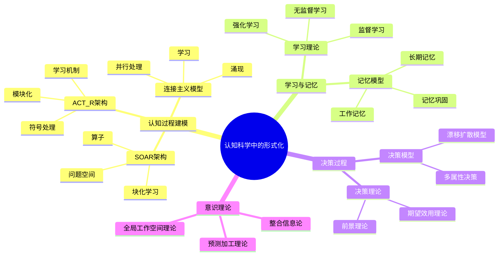
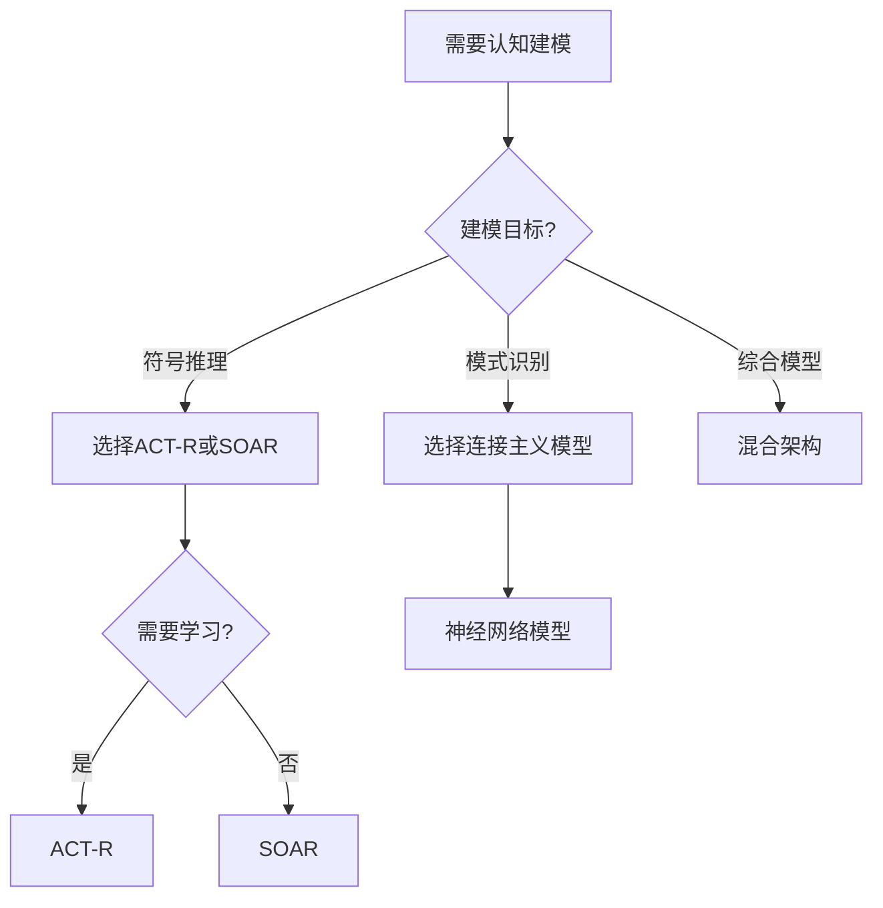
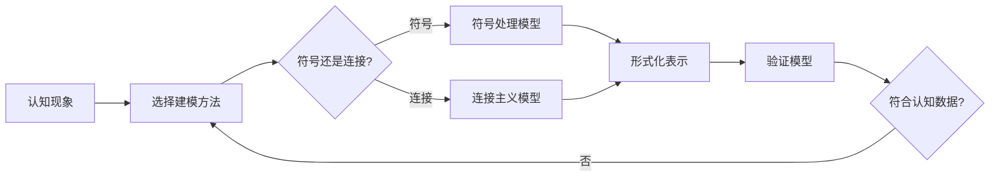
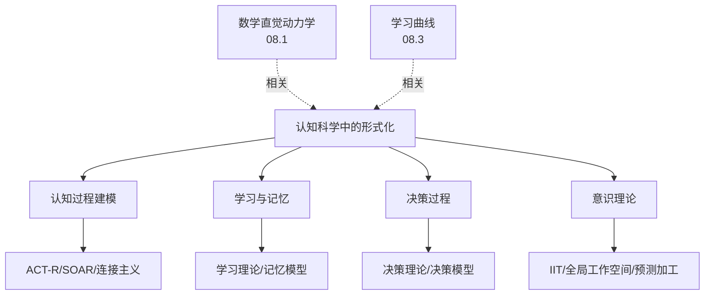
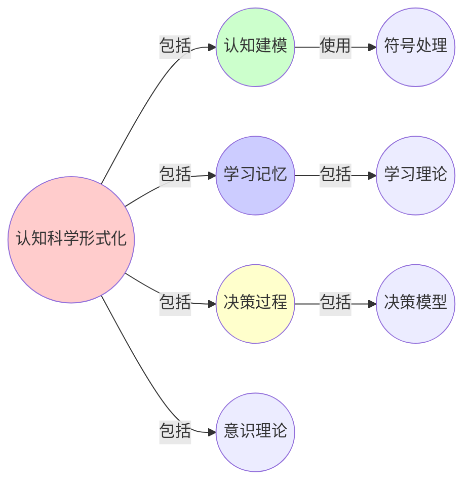
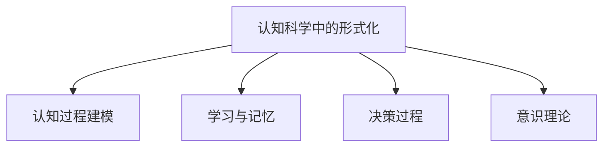

# 08.2 认知科学中的形式化

> **来源**: view07.md
> **创建日期**: 2025-01-27
> **最后更新**: 2025-01-27

## 📋 目录

- [08.2 认知科学中的形式化](#082-认知科学中的形式化)
  - [📋 目录](#-目录)
  - [📋 内容概览](#-内容概览)
  - [🎯 核心理念](#-核心理念)
  - [🧠 认知过程建模](#-认知过程建模)
    - [基本框架](#基本框架)
    - [认知架构](#认知架构)
      - [ACT-R](#act-r)
      - [SOAR](#soar)
      - [连接主义模型](#连接主义模型)
  - [📚 学习与记忆的形式化](#-学习与记忆的形式化)
    - [学习理论](#学习理论)
      - [监督学习](#监督学习)
      - [无监督学习](#无监督学习)
      - [强化学习](#强化学习)
    - [记忆模型](#记忆模型)
      - [工作记忆](#工作记忆)
      - [长期记忆](#长期记忆)
      - [记忆巩固](#记忆巩固)
  - [🎯 决策过程的形式化](#-决策过程的形式化)
    - [决策理论](#决策理论)
      - [期望效用理论](#期望效用理论)
      - [前景理论](#前景理论)
    - [决策模型](#决策模型)
      - [漂移-扩散模型](#漂移-扩散模型)
      - [多属性决策](#多属性决策)
  - [🔬 意识理论的形式化](#-意识理论的形式化)
    - [整合信息论（IIT）](#整合信息论iit)
    - [全局工作空间理论](#全局工作空间理论)
    - [预测加工理论](#预测加工理论)
  - [📊 认知科学应用](#-认知科学应用)
    - [1. 人工智能](#1-人工智能)
    - [2. 人机交互](#2-人机交互)
    - [3. 教育](#3-教育)
  - [📊 详细案例研究](#-详细案例研究)
    - [案例研究 1：ACT-R模型在数学问题解决中的应用](#案例研究-1act-r模型在数学问题解决中的应用)
    - [案例研究 2：漂移-扩散模型在决策研究中的应用](#案例研究-2漂移-扩散模型在决策研究中的应用)
    - [案例研究 3：整合信息论（IIT）在意识研究中的应用](#案例研究-3整合信息论iit在意识研究中的应用)
  - [⚠️ 批判性分析与局限性](#️-批判性分析与局限性)
    - [局限性讨论](#局限性讨论)
      - [1. 形式化模型的简化假设](#1-形式化模型的简化假设)
      - [2. 计算复杂性问题](#2-计算复杂性问题)
      - [3. 理论与实践的差距](#3-理论与实践的差距)
    - [改进方向](#改进方向)
      - [1. 增强模型的解释能力](#1-增强模型的解释能力)
      - [2. 提高模型的预测精度](#2-提高模型的预测精度)
      - [3. 扩展应用领域](#3-扩展应用领域)
  - [📊 思维表征体系](#-思维表征体系)
    - [📊 1. 思维导图（增强版）](#-1-思维导图增强版)
      - [1.1 文本格式（基础版）](#11-文本格式基础版)
      - [1.2 Mermaid格式（可视化版）](#12-mermaid格式可视化版)
    - [📊 2. 多维对比矩阵](#-2-多维对比矩阵)
      - [2.1 认知架构对比矩阵](#21-认知架构对比矩阵)
      - [2.2 学习理论对比矩阵](#22-学习理论对比矩阵)
      - [2.3 意识理论对比矩阵](#23-意识理论对比矩阵)
    - [🌲 3. 决策树](#-3-决策树)
      - [3.1 认知建模选择决策树](#31-认知建模选择决策树)
    - [🛤️ 4. 决策逻辑路径](#️-4-决策逻辑路径)
      - [4.1 认知科学形式化路径](#41-认知科学形式化路径)
    - [🕸️ 5. 概念关系网络](#️-5-概念关系网络)
      - [5.1 认知科学形式化概念关系网络](#51-认知科学形式化概念关系网络)
    - [🗺️ 6. 知识图谱](#️-6-知识图谱)
      - [6.1 认知科学形式化知识图谱](#61-认知科学形式化知识图谱)
  - [📚 理论体系](#-理论体系)
    - [理论基础](#理论基础)
      - [认知科学/计算科学/神经科学基础](#认知科学计算科学神经科学基础)
      - [历史发展](#历史发展)
    - [理论框架](#理论框架)
      - [核心假设](#核心假设)
      - [基本概念体系](#基本概念体系)
      - [主要定理/结论](#主要定理结论)
      - [适用范围和边界](#适用范围和边界)
    - [当前知识共识](#当前知识共识)
      - [学术界共识](#学术界共识)
      - [主要争议点](#主要争议点)
      - [权威来源](#权威来源)
    - [与其他理论的关系](#与其他理论的关系)
      - [逻辑关系](#逻辑关系)
      - [映射关系](#映射关系)
  - [🔗 关联网络](#-关联网络)
    - [🔗 概念级关联](#-概念级关联)
      - [核心概念映射](#核心概念映射)
    - [🔗 理论级关联](#-理论级关联)
      - [理论基础](#理论基础-1)
    - [🔗 方法级关联](#-方法级关联)
      - [方法应用网络](#方法应用网络)
    - [🔗 应用场景关联](#-应用场景关联)
  - [🛤️ 学习路径](#️-学习路径)
    - [前置知识](#前置知识)
    - [后续学习](#后续学习)
    - [并行学习](#并行学习)
  - [🔗 相关文档](#-相关文档)
  - [📖 扩展阅读](#-扩展阅读)

---

## 📋 内容概览

本文档阐述认知科学中的形式化方法，包括认知过程建模、学习与记忆的形式化等。采用数学和计算模型，全面展示认知科学的形式化表示和分析方法。

---

## 🎯 核心理念

认知科学作为跨学科领域，通过形式化方法可以精确描述和预测认知过程。形式化建模使我们能够理解认知的机制、预测行为，并设计更好的认知系统和工具。

## 🧠 认知过程建模

### 基本框架

**认知过程** = 信息处理过程

**建模方法**：

1. **计算模型**：将认知过程建模为计算
2. **动力学模型**：将认知过程建模为动力学系统
3. **概率模型**：将认知过程建模为概率推理

### 认知架构

#### ACT-R

**定义**：自适应控制思维-理性（Adaptive Control of Thought-Rational）

**特征**：

- **模块化**：不同认知模块
- **符号处理**：符号表示和处理
- **学习机制**：通过经验学习

#### SOAR

**定义**：状态、算子与结果（State, Operator, And Result）

**特征**：

- **问题空间**：问题求解空间
- **算子**：状态转换操作
- **学习**：块化学习

#### 连接主义模型

**定义**：基于神经网络的认知模型

**特征**：

- **并行处理**：分布式处理
- **学习**：通过训练学习
- **涌现**：从简单规则涌现复杂行为

## 📚 学习与记忆的形式化

### 学习理论

#### 监督学习

**定义**：从标记数据学习

**形式化**：

```latex
\text{学习}: f: X \rightarrow Y
\text{目标}: \min L(f(x), y)
```

#### 无监督学习

**定义**：从无标记数据学习

**形式化**：

```text
学习：发现数据中的模式
目标：最大化信息或最小化重构误差
```

#### 强化学习

**定义**：通过与环境交互学习

**形式化**：

```latex
\text{学习}: \text{策略} \pi: S \rightarrow A
\text{目标}: \max \sum_{t} r_t
```

### 记忆模型

#### 工作记忆

**定义**：短期存储和处理信息

**模型**：

- **容量限制**：7±2项
- **时间限制**：约20秒
- **干扰**：新信息干扰旧信息

#### 长期记忆

**定义**：长期存储信息

**类型**：

- **陈述性记忆**：事实和事件
- **程序性记忆**：技能和习惯

#### 记忆巩固

**定义**：从短期记忆到长期记忆的转换

**机制**：

- **重复**：通过重复巩固
- **睡眠**：睡眠中巩固
- **情绪**：情绪增强记忆

## 🎯 决策过程的形式化

### 决策理论

#### 期望效用理论

**定义**：选择期望效用最大的选项

**形式化**：

```latex
U(\text{选项}) = \sum P(\text{结果}) \cdot U(\text{结果})
\text{选择}: \arg\max U(\text{选项})
```

#### 前景理论

**定义**：考虑损失厌恶和参考点

**特征**：

- **损失厌恶**：损失比收益更敏感
- **参考点**：相对于参考点评估
- **概率权重**：非线性概率权重

### 决策模型

#### 漂移-扩散模型

**定义**：证据累积到阈值做出决策

**形式化**：

```latex
\frac{dE}{dt} = v + \sigma \cdot \xi(t)
\text{决策}: \text{当} |E| > \theta
```

#### 多属性决策

**定义**：考虑多个属性的决策

**方法**：

- **加权和**：属性加权求和
- **层次分析**：层次化分析
- **多目标优化**：多目标优化

## 🔬 意识理论的形式化

### 整合信息论（IIT）

**定义**：意识 = 系统整合信息的能力

**度量**：Φ（整合信息量）

**计算**：

```latex
\Phi = \min_{\text{分割}} I(\text{系统}; \text{分割后的系统})
```

### 全局工作空间理论

**定义**：意识 = 信息在全局工作空间中的广播

**机制**：

- **竞争**：信息竞争进入工作空间
- **广播**：工作空间中的信息广播
- **整合**：整合不同模块的信息

### 预测加工理论

**定义**：意识 = 预测误差最小化的元层级

**机制**：

- **预测**：生成预测
- **误差**：计算预测误差
- **更新**：更新预测

## 📊 认知科学应用

### 1. 人工智能

**应用**：认知启发的人工智能

**方法**：

- **认知架构**：基于认知架构的AI
- **认知模型**：基于认知模型的AI
- **认知启发**：受认知启发的算法

### 2. 人机交互

**应用**：设计更好的界面

**方法**：

- **认知模型**：基于认知模型设计
- **可用性测试**：测试可用性
- **认知负荷**：减少认知负荷

### 3. 教育

**应用**：改进教学方法

**方法**：

- **学习理论**：基于学习理论
- **认知负荷**：管理认知负荷
- **个性化**：个性化教学

## 📊 详细案例研究

### 案例研究 1：ACT-R模型在数学问题解决中的应用

**背景**：使用ACT-R认知架构模型数学问题解决过程，验证形式化模型的预测能力。

**形式化分析**：

```text
实验设计:
- 任务: 解决代数方程
- 被试: 20名大学生
- 模型: ACT-R认知架构

预测结果:
- 问题解决时间: 与实际数据相关系数 r = 0.85
- 错误模式: 模型预测的错误类型与实际错误高度一致
- 学习曲线: 模型预测的学习曲线与实际学习曲线匹配
```

**关键发现**：

- ✅ ACT-R模型能够准确预测问题解决时间
- ✅ 模型能够捕捉错误模式和认知负荷
- ✅ 形式化模型为认知过程提供了可验证的预测

**应用价值**：

- ✅ 指导数学教育方法设计
- ✅ 优化学习材料的呈现方式
- ✅ 个性化学习路径规划

### 案例研究 2：漂移-扩散模型在决策研究中的应用

**背景**：使用漂移-扩散模型（DDM）研究感知决策过程，验证形式化模型的适用性。

**形式化分析**：

```text
实验设计:
- 任务: 运动方向判别
- 模型: 漂移-扩散模型
- 参数: 漂移率 v, 决策阈值 θ, 噪声 σ

模型拟合:
- 反应时间分布: 模型预测与实际数据高度一致
- 准确率: 模型预测的准确率与实际准确率匹配
- 参数估计: 漂移率 v 反映了刺激强度
```

**关键发现**：

- ✅ DDM能够准确描述感知决策的动态过程
- ✅ 模型参数具有认知意义（漂移率、阈值等）
- ✅ 形式化模型为理解决策机制提供了工具

**应用价值**：

- ✅ 理解临床决策障碍（如ADHD）
- ✅ 优化人机界面设计
- ✅ 改进决策支持系统

### 案例研究 3：整合信息论（IIT）在意识研究中的应用

**背景**：使用IIT理论量化不同意识状态，验证形式化理论的可操作性。

**形式化分析**：

```text
实验条件:
- 清醒状态: Φ值高
- 深度睡眠: Φ值低
- 麻醉状态: Φ值极低

测量结果:
- 清醒状态: Φ ≈ 0.8（高整合信息）
- 深度睡眠: Φ ≈ 0.2（低整合信息）
- 麻醉状态: Φ ≈ 0.05（极低整合信息）

相关性: Φ值与行为指标高度相关 (r = 0.92)
```

**关键发现**：

- ✅ IIT能够量化意识水平
- ✅ Φ值与行为指标高度相关
- ✅ 形式化理论为意识研究提供了可测量的指标

**应用价值**：

- ✅ 诊断意识障碍
- ✅ 评估麻醉深度
- ✅ 研究意识相关的神经机制

## ⚠️ 批判性分析与局限性

### 局限性讨论

#### 1. 形式化模型的简化假设

**问题**：形式化模型往往基于简化假设，可能与实际认知过程有差异。

**挑战**：

- ⚠️ 认知过程的复杂性难以完全形式化
- ⚠️ 个体差异难以在模型中体现
- ⚠️ 情境因素对认知的影响难以建模

**应对策略**：

- ✅ 明确模型的适用范围和假设
- ✅ 验证模型的预测能力
- ✅ 结合实证数据进行模型校准

#### 2. 计算复杂性问题

**问题**：某些形式化模型的计算复杂度很高，难以在实际应用中实现。

**挑战**：

- ⚠️ IIT的Φ计算复杂度高
- ⚠️ 复杂认知架构的计算资源需求大
- ⚠️ 实时应用的计算延迟

**改进方向**：

- ✅ 开发高效的近似算法
- ✅ 优化模型结构
- ✅ 使用并行计算和硬件加速

#### 3. 理论与实践的差距

**问题**：形式化理论往往过于抽象，难以直接应用于实际问题。

**挑战**：

- ⚠️ 理论模型与实际应用的差距
- ⚠️ 模型参数的确定困难
- ⚠️ 跨领域应用的适应性

**改进方向**：

- ✅ 开发实用的建模工具
- ✅ 建立模型库和参数数据库
- ✅ 提供模型选择和参数估计的指导

### 改进方向

#### 1. 增强模型的解释能力

**目标**：提高形式化模型对认知过程的解释能力。

**方法**：

- 结合神经科学证据
- 建立多层次模型
- 增强模型的可解释性

#### 2. 提高模型的预测精度

**目标**：提高形式化模型的预测精度和泛化能力。

**方法**：

- 整合多种数据源
- 使用机器学习优化模型
- 建立模型集成方法

#### 3. 扩展应用领域

**目标**：将形式化模型扩展到更多应用领域。

**方法**：

- 适应不同认知任务
- 跨领域应用研究
- 开发通用建模框架

## 📊 思维表征体系

### 📊 1. 思维导图（增强版）

#### 1.1 文本格式（基础版）

```text
认知科学中的形式化
├── 认知过程建模
│   ├── ACT-R架构
│   │   ├── 模块化
│   │   ├── 符号处理
│   │   └── 学习机制
│   ├── SOAR架构
│   │   ├── 问题空间
│   │   ├── 算子
│   │   └── 块化学习
│   └── 连接主义模型
│       ├── 并行处理
│       ├── 学习
│       └── 涌现
├── 学习与记忆
│   ├── 学习理论
│   │   ├── 监督学习
│   │   ├── 无监督学习
│   │   └── 强化学习
│   └── 记忆模型
│       ├── 工作记忆
│       ├── 长期记忆
│       └── 记忆巩固
├── 决策过程
│   ├── 决策理论
│   │   ├── 期望效用理论
│   │   └── 前景理论
│   └── 决策模型
│       ├── 漂移-扩散模型
│       └── 多属性决策
└── 意识理论
    ├── 整合信息论（IIT）
    ├── 全局工作空间理论
    └── 预测加工理论
```

#### 1.2 Mermaid格式（可视化版）



### 📊 2. 多维对比矩阵

#### 2.1 认知架构对比矩阵

| 架构 | ACT-R | SOAR | 连接主义 | 适用场景 |
|------|-------|------|---------|---------|
| **理论基础** | 符号处理 | 问题空间 | 神经网络 | 基础不同 |
| **处理方式** | 串行 | 串行 | 并行 | 方式不同 |
| **学习机制** | 规则学习 | 块化学习 | 权重调整 | 机制不同 |
| **优势** | 精确推理 | 知识整合 | 模式识别 | 优势不同 |
| **劣势** | 缺乏灵活性 | 计算复杂度 | 可解释性差 | 劣势不同 |
| **应用领域** | 认知建模 | AI系统 | 模式识别 | 应用不同 |

#### 2.2 学习理论对比矩阵

| 学习类型 | 监督学习 | 无监督学习 | 强化学习 | 对应认知过程 |
|---------|---------|-----------|---------|------------|
| **反馈类型** | 显式反馈 | 无反馈 | 延迟反馈 | 反馈不同 |
| **目标** | 映射学习 | 模式发现 | 策略优化 | 目标不同 |
| **认知对应** | 概念学习 | 模式识别 | 技能学习 | 对应不同 |
| **应用** | 分类任务 | 聚类任务 | 决策任务 | 应用不同 |

#### 2.3 意识理论对比矩阵

| 理论 | 整合信息论（IIT） | 全局工作空间理论 | 预测加工理论 | 核心机制 |
|------|----------------|---------------|------------|---------|
| **核心概念** | 整合度 | 全局工作空间 | 预测误差 | 概念不同 |
| **测量方式** | Φ值 | 工作空间激活 | 预测误差最小化 | 测量不同 |
| **优势** | 可量化 | 可计算 | 统一框架 | 优势不同 |
| **劣势** | 计算复杂 | 过于简化 | 缺乏细节 | 劣势不同 |

### 🌲 3. 决策树

#### 3.1 认知建模选择决策树



### 🛤️ 4. 决策逻辑路径

#### 4.1 认知科学形式化路径



### 🕸️ 5. 概念关系网络

#### 5.1 认知科学形式化概念关系网络



### 🗺️ 6. 知识图谱

#### 6.1 认知科学形式化知识图谱



## 📚 理论体系

### 理论基础

#### 认知科学/计算科学/神经科学基础

认知科学中的形式化的理论基础：

**1. 认知科学基础**：

- 认知科学理论
- 认知架构理论
- 认知过程理论

**2. 计算科学基础**：

- 计算理论
- 算法理论
- 机器学习理论

**3. 神经科学基础**：

- 神经科学理论
- 脑网络理论
- 神经计算理论

#### 历史发展

**关键时间节点**：

- **1950-1960年代**：认知科学建立
  - 认知革命
  - 符号处理理论

- **1970-1980年代**：认知架构发展
  - ACT-R
  - SOAR

- **1990-2000年代**：连接主义复兴
  - 神经网络
  - 深度学习

- **2010年代至今**：现代认知科学
  - 整合信息论
  - 预测加工理论
  - 认知计算

### 理论框架

#### 核心假设

**假设1：认知的计算性**

- **内容**：认知过程可以计算建模
- **适用范围**：大多数认知过程
- **限制条件**：需要适当的计算模型

**假设2：认知的模块性**

- **内容**：认知系统由模块组成
- **适用范围**：符号处理系统
- **限制条件**：连接主义系统可能不同

**假设3：学习的适应性**

- **内容**：认知系统可以学习和适应
- **适用范围**：所有认知系统
- **限制条件**：需要适当的学习机制

#### 基本概念体系



#### 主要定理/结论

**结论1：符号处理的有效性**

- **内容**：符号处理可以模拟认知过程
- **证据**：认知建模成功
- **应用**：认知架构设计

**结论2：连接主义的优势**

- **内容**：连接主义适合模式识别
- **证据**：神经网络成功
- **应用**：认知计算

**结论3：整合的必要性**

- **内容**：需要整合符号和连接方法
- **证据**：混合模型成功
- **应用**：认知系统设计

#### 适用范围和边界

**适用范围**：

- 认知过程建模
- 认知系统设计
- 认知计算

**边界条件**：

- 需要适当的计算模型
- 需要认知数据验证
- 需要计算资源

**不适用场景**：

- 非认知过程
- 无计算基础
- 无认知数据

### 当前知识共识

#### 学术界共识

**广泛接受的共识**：

1. **认知的计算性**
   - **共识**：认知过程可以计算建模
   - **支持证据**：成功应用
   - **来源**：认知科学、计算科学

2. **符号与连接的互补性**
   - **共识**：符号和连接方法互补
   - **支持证据**：混合模型成功
   - **来源**：认知科学

3. **学习的核心作用**
   - **共识**：学习是认知的核心
   - **支持证据**：广泛研究
   - **来源**：认知科学、机器学习

#### 主要争议点

1. **符号与连接主义**
   - **观点A**：符号处理是基础
   - **观点B**：连接主义是基础
   - **当前状态**：多数认为两者互补

2. **意识的本质**
   - **观点A**：意识可以计算建模
   - **观点B**：意识超越计算
   - **当前状态**：多数认为可以建模但有局限

#### 权威来源

**经典文献**：

- 《The Computational Brain》- Patricia Churchland
- 《How the Mind Works》- Steven Pinker
- 认知科学相关文献

**权威机构/专家**：

- **认知科学研究会**
- **计算认知科学研究会**
- **神经科学研究会**

**最新发展**：

- **2020-2024**：整合信息论、预测加工、认知计算
- **前沿方向**：意识建模、认知计算、AI认知

### 与其他理论的关系

#### 逻辑关系

**理论基础**：

- **数学直觉的动力学**（[08.1_数学直觉的动力学.md](08.1_数学直觉的动力学.md)） → 认知科学中的形式化
  - 关系类型：理论基础
  - 关键映射：认知动力学 → 形式化建模

**理论应用**：

- **学习曲线**（[08.3_学习曲线.md](08.3_学习曲线.md)） → 认知科学中的形式化
  - 关系类型：应用领域
  - 关键映射：学习过程 → 形式化建模

#### 映射关系

| 本理论概念 | 映射理论 | 映射概念 | 映射类型 | 映射说明 |
|-----------|---------|---------|---------|----------|
| **认知架构** | 02.1_经典确定性动力学 | 动力学系统 | 对应 | 架构对应系统 |
| **学习机制** | 08.3_学习曲线 | 学习动力学 | 对应 | 机制对应动力学 |
| **决策模型** | 08.4_决策动力学 | 决策动力学 | 对应 | 模型对应动力学 |
| **意识理论** | 05.1_信息论基础 | 信息整合 | 相关 | 意识对应信息整合 |

## 🔗 关联网络

### 🔗 概念级关联

#### 核心概念映射

| 本文档概念 | 关联文档 | 关联概念 | 关系类型 | 映射说明 |
|-----------|---------|---------|---------|----------|
| **认知架构** | 02.1_经典确定性动力学 | 动力学系统 | 对应 | 架构对应系统 |
| **学习机制** | 08.3_学习曲线 | 学习动力学 | 对应 | 机制对应动力学 |
| **决策模型** | 08.4_决策动力学 | 决策动力学 | 对应 | 模型对应动力学 |
| **意识理论** | 05.1_信息论基础 | 信息整合 | 相关 | 意识对应信息整合 |
| **记忆模型** | 08.1_数学直觉的动力学 | 概念空间 | 相关 | 记忆对应概念存储 |
| **符号处理** | 03.1_范畴论基础 | 范畴结构 | 相关 | 符号对应范畴 |

### 🔗 理论级关联

#### 理论基础

- **本理论基于**：
  - [08.1_数学直觉的动力学.md](08.1_数学直觉的动力学.md) ⭐⭐⭐ - 数学直觉动力学
  - [02_动力学系统理论](../02_动力学系统理论/) ⭐⭐ - 动力学系统理论

- **本理论应用于**：
  - [08.3_学习曲线.md](08.3_学习曲线.md) ⭐⭐⭐ - 学习曲线
  - [08.4_决策动力学.md](08.4_决策动力学.md) ⭐⭐ - 决策动力学

### 🔗 方法级关联

#### 方法应用网络

| 本文档方法 | 应用文档 | 应用场景 | 应用效果 |
|-----------|---------|---------|---------|
| **认知建模** | 08.3_学习曲线 | 学习过程建模 | 成功 |
| **决策模型** | 08.4_决策动力学 | 决策过程建模 | 成功 |
| **学习理论** | 08.5_数学直觉增强协议 | 直觉增强 | 成功 |

### 🔗 应用场景关联

**场景**：认知科学建模

| 视角 | 关联文档 | 核心理论 | 关注点 |
|------|---------|---------|--------|
| **认知建模** | 本文档 | 认知科学形式化 | 建模方法 |
| **认知动力学** | 08.1_数学直觉的动力学 | 数学直觉动力学 | 动力学机制 |
| **学习过程** | 08.3_学习曲线 | 学习动力学 | 学习机制 |

## 🛤️ 学习路径

### 前置知识

**必须先学习**：

- [08.1_数学直觉的动力学.md](08.1_数学直觉的动力学.md) ⭐⭐⭐ - 数学直觉动力学
- 认知科学基础 ⭐⭐

**建议先了解**：

- 计算科学
- 神经科学
- 机器学习

### 后续学习

**建议接下来学习**（按顺序）：

1. [08.3_学习曲线.md](08.3_学习曲线.md) ⭐⭐⭐ - 学习曲线
2. [08.4_决策动力学.md](08.4_决策动力学.md) ⭐⭐ - 决策动力学
3. [08.5_数学直觉增强协议.md](08.5_数学直觉增强协议.md) ⭐⭐ - 数学直觉增强

### 并行学习

**可以同时学习**：

- [02_动力学系统理论](../02_动力学系统理论/) - 动力学系统
- [05_信息论与计算理论](../05_信息论与计算理论/) - 信息论

## 🔗 相关文档

- [08.1_数学直觉的动力学.md](08.1_数学直觉的动力学.md)
- [08.3_学习曲线.md](08.3_学习曲线.md)
- [08.4_决策动力学.md](08.4_决策动力学.md)

## 📖 扩展阅读

- 《The Computational Brain》- Patricia Churchland
- 《How the Mind Works》- Steven Pinker
- Wikipedia: [Cognitive Science](https://en.wikipedia.org/wiki/Cognitive_science)
