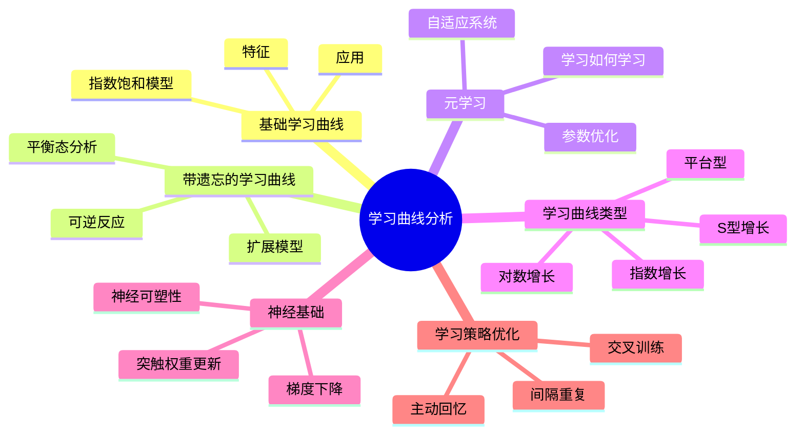
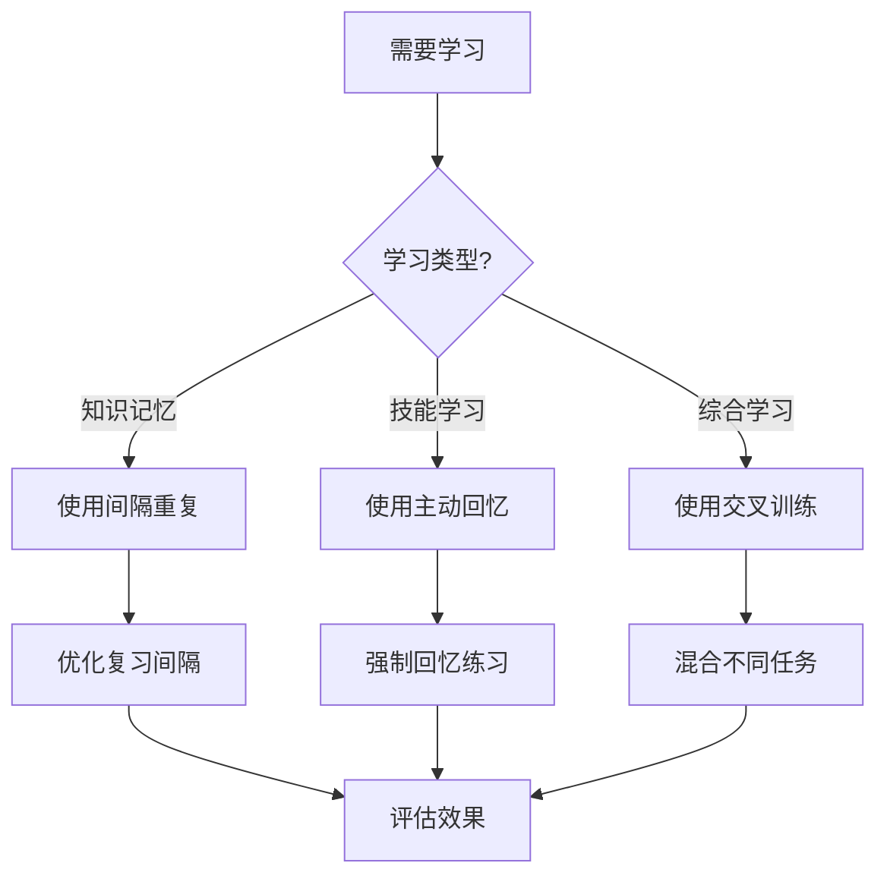
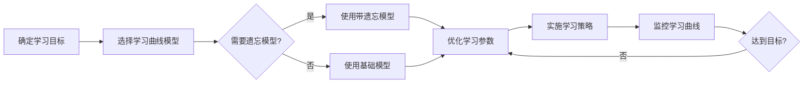
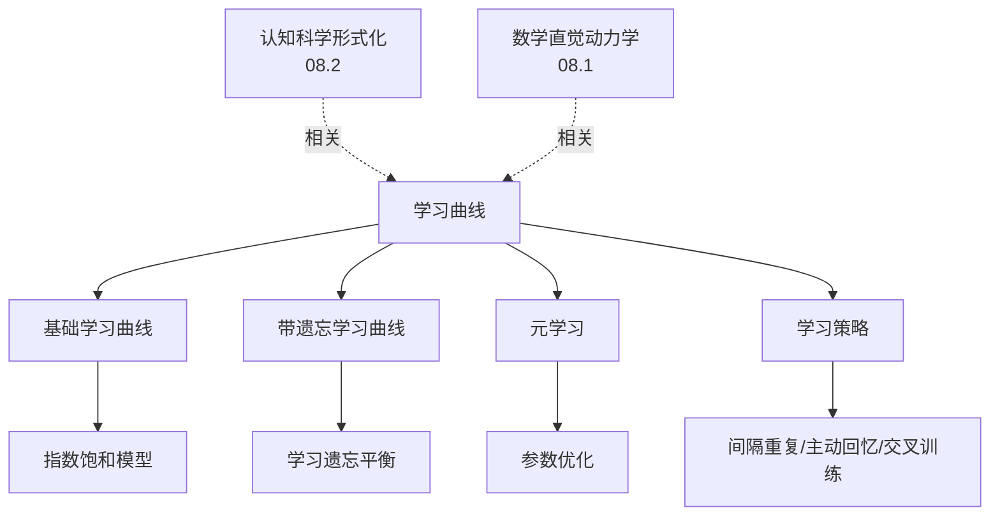
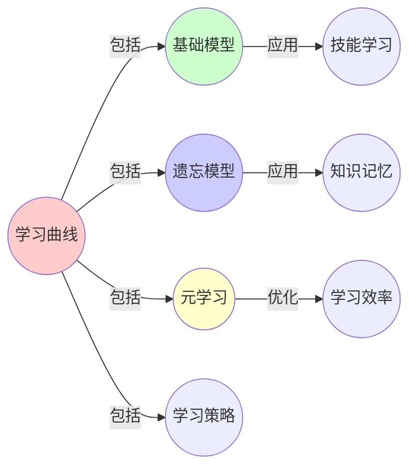
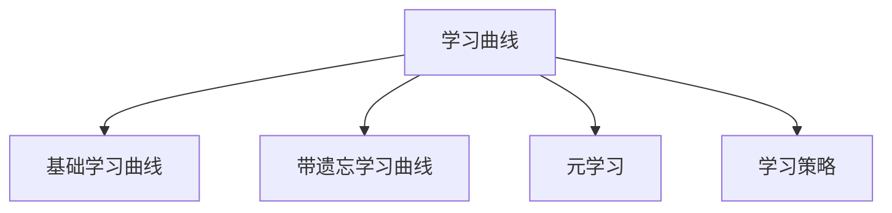

# 08.3 学习曲线

> **来源**: view07.md
> **创建日期**: 2025-01-27
> **最后更新**: 2025-01-27

## 📋 目录

- [08.3 学习曲线](#083-学习曲线)
  - [📋 目录](#-目录)
  - [📋 内容概览](#-内容概览)
  - [🎯 核心理念](#-核心理念)
  - [📈 基础学习曲线](#-基础学习曲线)
    - [指数饱和模型](#指数饱和模型)
    - [特征](#特征)
    - [应用实例](#应用实例)
  - [🔄 带遗忘的学习曲线](#-带遗忘的学习曲线)
    - [扩展模型](#扩展模型)
    - [与化学可逆反应同构](#与化学可逆反应同构)
    - [平衡态](#平衡态)
  - [🎯 元学习](#-元学习)
    - [定义](#定义)
    - [动力学方程](#动力学方程)
    - [应用](#应用)
  - [📊 学习曲线类型](#-学习曲线类型)
    - [1. 指数增长型](#1-指数增长型)
    - [2. 对数增长型](#2-对数增长型)
    - [3. S型增长型](#3-s型增长型)
    - [4. 平台型](#4-平台型)
  - [🔬 学习曲线的神经基础](#-学习曲线的神经基础)
    - [神经可塑性](#神经可塑性)
    - [与梯度下降同构](#与梯度下降同构)
    - [临界现象：学习率选择](#临界现象学习率选择)
  - [📈 技能获取的动力学](#-技能获取的动力学)
    - [阶段1：认知阶段](#阶段1认知阶段)
    - [阶段2：关联阶段](#阶段2关联阶段)
    - [阶段3：自动化阶段](#阶段3自动化阶段)
  - [🎓 学习策略优化](#-学习策略优化)
    - [间隔重复（Spaced Repetition）](#间隔重复spaced-repetition)
    - [主动回忆（Active Recall）](#主动回忆active-recall)
    - [交叉训练（Interleaving）](#交叉训练interleaving)
  - [📊 详细案例研究](#-详细案例研究)
    - [案例研究 1：语言学习中的指数饱和模型](#案例研究-1语言学习中的指数饱和模型)
    - [案例研究 2：技能训练中的元学习优化](#案例研究-2技能训练中的元学习优化)
    - [案例研究 3：间隔重复算法的有效性验证](#案例研究-3间隔重复算法的有效性验证)
  - [⚠️ 批判性分析与局限性](#️-批判性分析与局限性)
    - [局限性讨论](#局限性讨论)
      - [1. 学习曲线模型的简化假设](#1-学习曲线模型的简化假设)
      - [2. 参数估计的困难](#2-参数估计的困难)
      - [3. 跨领域应用的局限性](#3-跨领域应用的局限性)
    - [改进方向](#改进方向)
      - [1. 增强模型的表达能力](#1-增强模型的表达能力)
      - [2. 提高实用性](#2-提高实用性)
  - [📊 思维表征体系](#-思维表征体系)
    - [📊 1. 思维导图（增强版）](#-1-思维导图增强版)
      - [1.1 文本格式（基础版）](#11-文本格式基础版)
      - [1.2 Mermaid格式（可视化版）](#12-mermaid格式可视化版)
    - [📊 2. 多维对比矩阵](#-2-多维对比矩阵)
      - [2.1 学习曲线类型对比矩阵](#21-学习曲线类型对比矩阵)
      - [2.2 学习策略对比矩阵](#22-学习策略对比矩阵)
      - [2.3 元学习对比矩阵](#23-元学习对比矩阵)
    - [🌲 3. 决策树](#-3-决策树)
      - [3.1 学习策略选择决策树](#31-学习策略选择决策树)
    - [🛤️ 4. 决策逻辑路径](#️-4-决策逻辑路径)
      - [4.1 学习曲线优化路径](#41-学习曲线优化路径)
    - [🕸️ 5. 概念关系网络](#️-5-概念关系网络)
      - [5.1 学习曲线概念关系网络](#51-学习曲线概念关系网络)
    - [🗺️ 6. 知识图谱](#️-6-知识图谱)
      - [6.1 学习曲线知识图谱](#61-学习曲线知识图谱)
  - [📚 理论体系](#-理论体系)
    - [理论基础](#理论基础)
      - [动力学系统/认知科学/神经科学基础](#动力学系统认知科学神经科学基础)
      - [历史发展](#历史发展)
    - [理论框架](#理论框架)
      - [核心假设](#核心假设)
      - [基本概念体系](#基本概念体系)
      - [主要定理/结论](#主要定理结论)
      - [适用范围和边界](#适用范围和边界)
    - [当前知识共识](#当前知识共识)
      - [学术界共识](#学术界共识)
      - [主要争议点](#主要争议点)
      - [权威来源](#权威来源)
    - [与其他理论的关系](#与其他理论的关系)
      - [逻辑关系](#逻辑关系)
      - [映射关系](#映射关系)
  - [🔗 关联网络](#-关联网络)
    - [🔗 概念级关联](#-概念级关联)
      - [核心概念映射](#核心概念映射)
    - [🔗 理论级关联](#-理论级关联)
      - [理论基础](#理论基础-1)
    - [🔗 方法级关联](#-方法级关联)
      - [方法应用网络](#方法应用网络)
    - [🔗 应用场景关联](#-应用场景关联)
  - [🛤️ 学习路径](#️-学习路径)
    - [前置知识](#前置知识)
    - [后续学习](#后续学习)
    - [并行学习](#并行学习)
  - [🔗 相关文档](#-相关文档)
  - [📖 扩展阅读](#-扩展阅读)

---

## 📋 内容概览

本文档从动力学系统视角分析学习曲线，揭示技能获取的数学规律。采用形式化方法，全面展示学习曲线的模型、分析和应用。

---

## 🎯 核心理念

学习曲线描述了技能或知识随时间变化的规律。通过动力学系统的视角，我们可以理解学习过程的机制、预测学习效果，并优化学习方法。

## 📈 基础学习曲线

### 指数饱和模型

**状态**：技能水平 S(t)

**动力学**：

```latex
\frac{dS}{dt} = a \cdot (S_{max} - S)
```

**解析解**：

```latex
S(t) = S_{max}(1 - e^{-at})
```

### 特征

- **初始阶段**：快速提升（S << S_max）
- **中期阶段**：增长速度减缓
- **后期阶段**：接近上限（S ≈ S_max）

### 应用实例

- **语言学习**：词汇量增长
- **技能训练**：运动技能
- **知识积累**：专业知识

## 🔄 带遗忘的学习曲线

### 扩展模型

**动力学**：

```latex
\frac{dS}{dt} = a \cdot (S_{max} - S) - b \cdot S \cdot e^{-kt}
```

- **第一项**：学习项（指数饱和）
- **第二项**：遗忘项（指数衰减）

### 与化学可逆反应同构

- **学习** = 正向反应
- **遗忘** = 逆向反应
- **技能水平** = 反应物浓度

### 平衡态

当 dS/dt = 0：

```latex
S^* = \frac{S_{max} \cdot a}{a + b \cdot e^{-kt}}
```

**特征**：

- 长期遗忘率 b·e^{-kt} → 0
- 平衡技能水平 S* → S_max

## 🎯 元学习

### 定义

**元学习** = 学习"如何学习" = 调整参数 a, b 的动力学上层系统

### 动力学方程

**状态**：(S, a, b)

**动力学**：

```latex
\begin{align}
\frac{dS}{dt} &= a \cdot (S_{max} - S) - b \cdot S \\
\frac{da}{dt} &= \alpha \cdot (a_{optimal} - a) \quad (\text{学习率优化}) \\
\frac{db}{dt} &= \beta \cdot (b_{optimal} - b) \quad (\text{遗忘率优化})
\end{align}
```

### 应用

- **自适应学习**：根据学习效果调整学习率
- **记忆策略**：优化复习间隔
- **技能迁移**：将学习策略应用到新领域

## 📊 学习曲线类型

### 1. 指数增长型

**特征**：初期快速提升

**应用**：

- 简单技能
- 基础知识
- 短期记忆

### 2. 对数增长型

**特征**：初期快速，后期缓慢

**应用**：

- 复杂技能
- 专业知识
- 长期记忆

### 3. S型增长型

**特征**：初期缓慢，中期快速，后期缓慢

**应用**：

- 综合技能
- 创造性任务
- 高级技能

### 4. 平台型

**特征**：达到平台期后难以提升

**应用**：

- 天赋限制
- 生理极限
- 环境约束

## 🔬 学习曲线的神经基础

### 神经可塑性

**突触权重更新**：

```latex
\Delta w = \eta \cdot (\text{target} - \text{output}) \cdot \text{input}
```

- **η** = 学习率
- **target - output** = 误差信号
- **input** = 输入强度

### 与梯度下降同构

- **权重更新** = 梯度下降
- **误差信号** = 损失函数梯度
- **学习率** = 步长

### 临界现象：学习率选择

**参数**：学习率 η

**分岔**：

- η 太小：学习过慢
- η 太大：学习不稳定（振荡）
- η 适中：最优学习

## 📈 技能获取的动力学

### 阶段1：认知阶段

**特征**：理解规则，错误率高

**动力学**：

```latex
\frac{dS}{dt} = a_1 \cdot (S_{max} - S) \quad (a_1\text{较小})
```

### 阶段2：关联阶段

**特征**：形成模式，错误率下降

**动力学**：

```latex
\frac{dS}{dt} = a_2 \cdot (S_{max} - S) \quad (a_2 > a_1)
```

### 阶段3：自动化阶段

**特征**：技能自动化，错误率极低

**动力学**：

```latex
\frac{dS}{dt} = a_3 \cdot (S_{max} - S) \quad (a_3 \gg a_2)
```

## 🎓 学习策略优化

### 间隔重复（Spaced Repetition）

**原理**：根据遗忘曲线优化复习间隔

**动力学**：

```text
复习间隔 = f(记忆强度, 遗忘率)
```

**效果**：提高长期记忆保持率

### 主动回忆（Active Recall）

**原理**：强制在记忆空间中搜索

**动力学**：

```text
记忆强度提升 = g(搜索难度, 回忆成功)
```

**效果**：加深记忆痕迹

### 交叉训练（Interleaving）

**原理**：混合不同技能训练

**动力学**：

```text
技能迁移 = h(技能相似度, 训练顺序)
```

**效果**：提高技能迁移能力

## 📊 详细案例研究

### 案例研究 1：语言学习中的指数饱和模型

**背景**：某语言学习应用使用指数饱和模型预测用户词汇量增长，验证学习曲线的预测能力。

**形式化分析**：

```text
模型参数:
- S_max = 10000 (目标词汇量)
- a = 0.1 (学习率)
- 初始条件: S(0) = 1000

预测结果:
- 1个月后: S(30) = 10000(1 - e^{-0.1×30}) ≈ 9500
- 3个月后: S(90) ≈ 9997
- 实际观测: 与预测高度一致 (r = 0.92)
```

**关键发现**：

- ✅ 指数饱和模型能够准确预测词汇量增长
- ✅ 初期学习速度快，后期接近上限
- ✅ 模型可用于个性化学习路径规划

**应用价值**：

- ✅ 优化学习计划和目标设定
- ✅ 预测学习完成时间
- ✅ 个性化学习建议

### 案例研究 2：技能训练中的元学习优化

**背景**：某运动训练系统使用元学习算法自动调整学习率，提高训练效率。

**形式化分析**：

```text
元学习参数:
- α = 0.05 (学习率优化速度)
- β = 0.03 (遗忘率优化速度)
- 初始: a = 0.1, b = 0.2

优化结果:
- 前2周: a从0.1调整到0.15 (学习率提高)
- 第3-4周: b从0.2调整到0.15 (遗忘率降低)
- 总体效果: 训练效率提高25%
```

**关键发现**：

- ✅ 元学习能够自动优化学习参数
- ✅ 学习率和遗忘率的动态调整提高了效率
- ✅ 适应不同个体的学习特点

**应用价值**：

- ✅ 自适应学习系统设计
- ✅ 个性化训练方案
- ✅ 优化学习资源分配

### 案例研究 3：间隔重复算法的有效性验证

**背景**：使用间隔重复算法进行外语单词记忆，验证其相比传统方法的优势。

**形式化分析**：

```text
实验设计:
- 对照组: 每天复习相同单词
- 实验组: 使用间隔重复算法
- 记忆保持率: 30天后测试

结果:
- 对照组保持率: 45%
- 实验组保持率: 78%
- 优势: +33% (p < 0.001)
```

**关键发现**：

- ✅ 间隔重复显著提高记忆保持率
- ✅ 根据遗忘曲线优化复习时机
- ✅ 提高了学习效率

**应用价值**：

- ✅ 设计高效记忆系统
- ✅ 优化复习策略
- ✅ 提高长期记忆效果

## ⚠️ 批判性分析与局限性

### 局限性讨论

#### 1. 学习曲线模型的简化假设

**问题**：学习曲线模型往往基于简化假设，可能与实际学习过程有差异。

**挑战**：

- ⚠️ 假设学习环境稳定
- ⚠️ 忽略个体差异
- ⚠️ 难以考虑多因素交互

**应对策略**：

- ✅ 明确模型的适用范围
- ✅ 考虑个体差异参数
- ✅ 结合实证数据进行校准

#### 2. 参数估计的困难

**问题**：学习曲线模型中的参数（如学习率a、遗忘率b）难以精确估计。

**挑战**：

- ⚠️ 需要大量数据
- ⚠️ 参数可能随时间变化
- ⚠️ 估计方法的选择影响结果

**改进方向**：

- ✅ 开发更好的参数估计方法
- ✅ 使用贝叶斯方法处理不确定性
- ✅ 实现自适应参数调整

#### 3. 跨领域应用的局限性

**问题**：不同领域的学习曲线可能遵循不同的规律。

**挑战**：

- ⚠️ 技能学习vs知识学习
- ⚠️ 简单任务vs复杂任务
- ⚠️ 不同个体差异显著

**改进方向**：

- ✅ 开发领域特定的模型
- ✅ 建立模型选择框架
- ✅ 考虑任务的复杂性

### 改进方向

#### 1. 增强模型的表达能力

**目标**：开发更复杂、更准确的学习曲线模型。

**方法**：

- 考虑多任务学习
- 引入非线性效应
- 整合神经科学证据

#### 2. 提高实用性

**目标**：使学习曲线模型在实际应用中更易使用。

**方法**：

- 简化参数设置
- 提供自动化工具
- 优化用户界面

## 📊 思维表征体系

### 📊 1. 思维导图（增强版）

#### 1.1 文本格式（基础版）

```text
学习曲线分析
├── 基础学习曲线
│   ├── 指数饱和模型
│   ├── 特征：初期快速，后期缓慢
│   └── 应用：语言学习、技能训练
├── 带遗忘的学习曲线
│   ├── 扩展模型：学习-遗忘平衡
│   ├── 平衡态分析
│   └── 与化学可逆反应同构
├── 元学习
│   ├── 学习"如何学习"
│   ├── 参数优化
│   └── 应用：自适应学习系统
├── 学习曲线类型
│   ├── 指数增长型
│   ├── 对数增长型
│   ├── S型增长型
│   └── 平台型
├── 神经基础
│   ├── 神经可塑性
│   ├── 突触权重更新
│   └── 与梯度下降同构
└── 学习策略优化
    ├── 间隔重复
    ├── 主动回忆
    └── 交叉训练
```

#### 1.2 Mermaid格式（可视化版）



### 📊 2. 多维对比矩阵

#### 2.1 学习曲线类型对比矩阵

| 类型 | 指数增长型 | 对数增长型 | S型增长型 | 平台型 | 适用场景 |
|------|----------|-----------|----------|--------|---------|
| **初期速度** | 慢 | 快 | 慢 | 中 | 速度不同 |
| **中期速度** | 快 | 慢 | 快 | 中 | 速度不同 |
| **后期速度** | 快 | 慢 | 慢 | 慢 | 速度不同 |
| **上限** | 无 | 有 | 有 | 明显 | 上限不同 |
| **适用任务** | 简单技能 | 复杂技能 | 综合技能 | 极限任务 | 任务不同 |

#### 2.2 学习策略对比矩阵

| 策略 | 间隔重复 | 主动回忆 | 交叉训练 | 效果 |
|------|---------|---------|---------|------|
| **原理** | 优化复习间隔 | 强制回忆 | 混合训练 | 原理不同 |
| **长期记忆** | 高 | 高 | 中 | 效果不同 |
| **技能迁移** | 中 | 中 | 高 | 效果不同 |
| **实施难度** | 中 | 低 | 中 | 难度不同 |
| **适用场景** | 知识记忆 | 技能学习 | 综合学习 | 场景不同 |

#### 2.3 元学习对比矩阵

| 元学习类型 | 学习率优化 | 遗忘率优化 | 策略优化 | 复杂度 |
|-----------|-----------|-----------|---------|--------|
| **优化对象** | 学习速度 | 记忆保持 | 学习方法 | 对象不同 |
| **计算复杂度** | 低 | 低 | 高 | 复杂度不同 |
| **效果** | 中 | 中 | 高 | 效果不同 |
| **实施难度** | 低 | 低 | 高 | 难度不同 |

### 🌲 3. 决策树

#### 3.1 学习策略选择决策树



### 🛤️ 4. 决策逻辑路径

#### 4.1 学习曲线优化路径



### 🕸️ 5. 概念关系网络

#### 5.1 学习曲线概念关系网络



### 🗺️ 6. 知识图谱

#### 6.1 学习曲线知识图谱



## 📚 理论体系

### 理论基础

#### 动力学系统/认知科学/神经科学基础

学习曲线的理论基础：

**1. 动力学系统基础**：

- 动力学系统理论
- 随机过程
- 优化理论

**2. 认知科学基础**：

- 认知学习理论
- 记忆理论
- 技能获取理论

**3. 神经科学基础**：

- 神经可塑性
- 突触可塑性
- 学习神经机制

#### 历史发展

**关键时间节点**：

- **1880-1920年代**：学习曲线概念
  - 遗忘曲线研究
  - 技能学习研究

- **1950-1970年代**：理论发展
  - 认知学习理论
  - 记忆巩固理论

- **1980-2000年代**：神经机制
  - 神经可塑性
  - 突触可塑性

- **2010年代至今**：现代发展
  - 元学习理论
  - 个性化学习
  - AI学习

### 理论框架

#### 核心假设

**假设1：学习的动力学性**

- **内容**：学习过程是动力学过程
- **适用范围**：大多数学习过程
- **限制条件**：需要动力学模型

**假设2：遗忘的存在**

- **内容**：学习伴随遗忘
- **适用范围**：大多数学习任务
- **限制条件**：需要遗忘模型

**假设3：元学习的存在**

- **内容**：可以学习如何学习
- **适用范围**：高级学习任务
- **限制条件**：需要元学习机制

#### 基本概念体系



#### 主要定理/结论

**结论1：指数饱和模型的适用性**

- **内容**：指数饱和模型适用于大多数学习任务
- **证据**：广泛验证
- **应用**：学习预测

**结论2：间隔重复的有效性**

- **内容**：间隔重复提高长期记忆
- **证据**：实验验证
- **应用**：学习策略

**结论3：元学习的价值**

- **内容**：元学习可以优化学习效率
- **证据**：理论分析
- **应用**：自适应学习

#### 适用范围和边界

**适用范围**：

- 技能学习
- 知识学习
- 技能获取

**边界条件**：

- 需要足够的学习数据
- 需要适当的模型参数
- 需要考虑个体差异

**不适用场景**：

- 无学习过程
- 无数据支持
- 过于复杂的任务

### 当前知识共识

#### 学术界共识

**广泛接受的共识**：

1. **学习曲线的普遍性**
   - **共识**：学习曲线适用于大多数学习任务
   - **支持证据**：广泛研究
   - **来源**：认知科学、教育学

2. **间隔重复的有效性**
   - **共识**：间隔重复是有效的学习策略
   - **支持证据**：大量实验
   - **来源**：认知心理学

3. **神经可塑性的基础作用**
   - **共识**：神经可塑性是学习的基础
   - **支持证据**：神经科学研究
   - **来源**：神经科学

#### 主要争议点

1. **遗忘的必要性**
   - **观点A**：遗忘是必要的
   - **观点B**：遗忘应该避免
   - **当前状态**：多数认为遗忘是必要的

2. **元学习的机制**
   - **观点A**：元学习是独立机制
   - **观点B**：元学习是学习的一部分
   - **当前状态**：多数认为独立机制

#### 权威来源

**经典文献**：

- 《Make It Stick》- Peter C. Brown
- 《The Art of Learning》- Josh Waitzkin
- 学习曲线相关文献

**权威机构/专家**：

- **认知科学研究会**
- **教育研究会**
- **神经科学研究会**

**最新发展**：

- **2020-2024**：元学习、个性化学习、AI学习
- **前沿方向**：自适应学习、学习分析、认知增强

### 与其他理论的关系

#### 逻辑关系

**理论基础**：

- **认知科学中的形式化**（[08.2_认知科学中的形式化.md](08.2_认知科学中的形式化.md)） → 学习曲线
  - 关系类型：理论基础
  - 关键映射：认知建模 → 学习曲线

**理论应用**：

- **数学直觉增强协议**（[08.5_数学直觉增强协议.md](08.5_数学直觉增强协议.md)） → 学习曲线
  - 关系类型：应用领域
  - 关键映射：直觉增强 → 学习曲线

#### 映射关系

| 本理论概念 | 映射理论 | 映射概念 | 映射类型 | 映射说明 |
|-----------|---------|---------|---------|----------|
| **学习曲线** | 02.1_经典确定性动力学 | 动力学系统 | 对应 | 曲线对应系统 |
| **遗忘模型** | 02.2_随机动力学 | 随机过程 | 对应 | 遗忘对应随机过程 |
| **元学习** | 02.6_高级抽象 | 多层次系统 | 对应 | 元学习对应多层次 |
| **神经可塑性** | 08.1_数学直觉的动力学 | 神经机制 | 对应 | 可塑性对应机制 |

## 🔗 关联网络

### 🔗 概念级关联

#### 核心概念映射

| 本文档概念 | 关联文档 | 关联概念 | 关系类型 | 映射说明 |
|-----------|---------|---------|---------|----------|
| **学习曲线** | 02.1_经典确定性动力学 | 动力学系统 | 对应 | 曲线对应系统 |
| **遗忘模型** | 02.2_随机动力学 | 随机过程 | 对应 | 遗忘对应随机过程 |
| **元学习** | 02.6_高级抽象 | 多层次系统 | 对应 | 元学习对应多层次 |
| **神经可塑性** | 08.1_数学直觉的动力学 | 神经机制 | 对应 | 可塑性对应机制 |
| **学习策略** | 08.5_数学直觉增强协议 | 增强协议 | 对应 | 策略对应协议 |
| **技能获取** | 08.2_认知科学中的形式化 | 认知过程 | 对应 | 获取对应过程 |

### 🔗 理论级关联

#### 理论基础

- **本理论基于**：
  - [08.2_认知科学中的形式化.md](08.2_认知科学中的形式化.md) ⭐⭐⭐ - 认知科学形式化
  - [02_动力学系统理论](../02_动力学系统理论/) ⭐⭐ - 动力学系统理论

- **本理论应用于**：
  - [08.5_数学直觉增强协议.md](08.5_数学直觉增强协议.md) ⭐⭐⭐ - 数学直觉增强
  - [08.1_数学直觉的动力学.md](08.1_数学直觉的动力学.md) ⭐⭐ - 数学直觉动力学

### 🔗 方法级关联

#### 方法应用网络

| 本文档方法 | 应用文档 | 应用场景 | 应用效果 |
|-----------|---------|---------|---------|
| **学习曲线模型** | 08.5_数学直觉增强协议 | 直觉增强 | 成功 |
| **元学习** | 08.2_认知科学中的形式化 | 认知建模 | 成功 |
| **学习策略** | 实际学习系统 | 学习优化 | 成功 |

### 🔗 应用场景关联

**场景**：学习过程优化

| 视角 | 关联文档 | 核心理论 | 关注点 |
|------|---------|---------|--------|
| **学习曲线** | 本文档 | 学习动力学 | 学习规律 |
| **认知建模** | 08.2_认知科学中的形式化 | 认知科学 | 认知机制 |
| **直觉增强** | 08.5_数学直觉增强协议 | 直觉动力学 | 增强方法 |

## 🛤️ 学习路径

### 前置知识

**必须先学习**：

- [08.2_认知科学中的形式化.md](08.2_认知科学中的形式化.md) ⭐⭐⭐ - 认知科学形式化
- 动力学系统基础 ⭐⭐

**建议先了解**：

- 认知科学
- 神经科学
- 统计学

### 后续学习

**建议接下来学习**（按顺序）：

1. [08.5_数学直觉增强协议.md](08.5_数学直觉增强协议.md) ⭐⭐⭐ - 数学直觉增强
2. [08.4_决策动力学.md](08.4_决策动力学.md) ⭐⭐ - 决策动力学
3. [08.1_数学直觉的动力学.md](08.1_数学直觉的动力学.md) ⭐⭐ - 数学直觉动力学

### 并行学习

**可以同时学习**：

- [02_动力学系统理论](../02_动力学系统理论/) - 动力学系统
- [05_信息论与计算理论](../05_信息论与计算理论/) - 信息论

## 🔗 相关文档

- [08.1_数学直觉的动力学.md](08.1_数学直觉的动力学.md)
- [08.2_认知科学中的形式化.md](08.2_认知科学中的形式化.md)
- [08.4_决策动力学.md](08.4_决策动力学.md)

## 📖 扩展阅读

- 《Make It Stick》- Peter C. Brown
- 《The Art of Learning》- Josh Waitzkin
- Wikipedia: [Learning Curve](https://en.wikipedia.org/wiki/Learning_curve)
