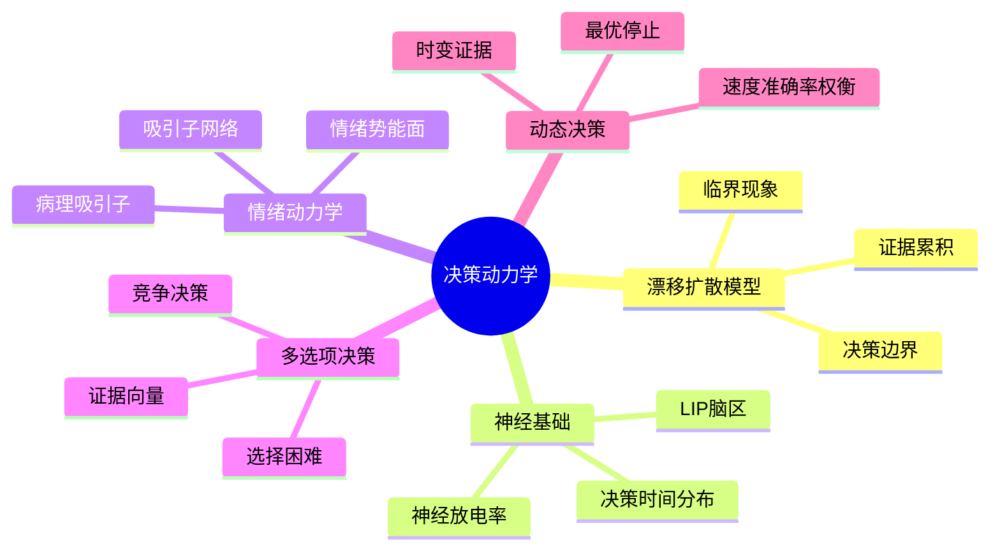
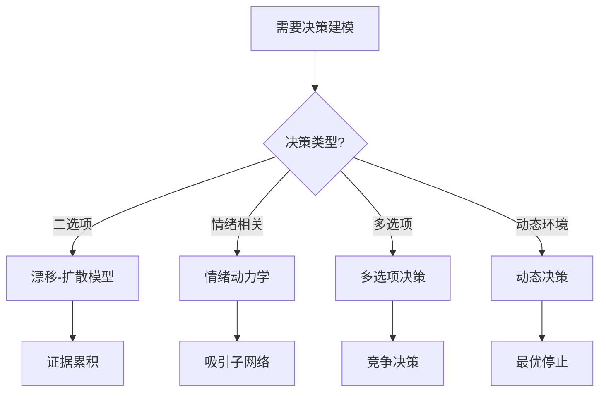
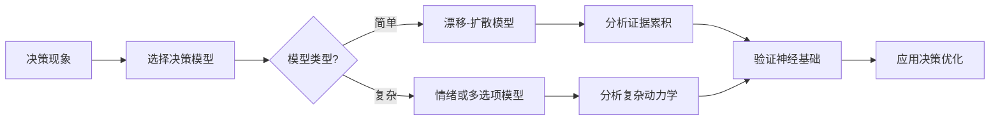
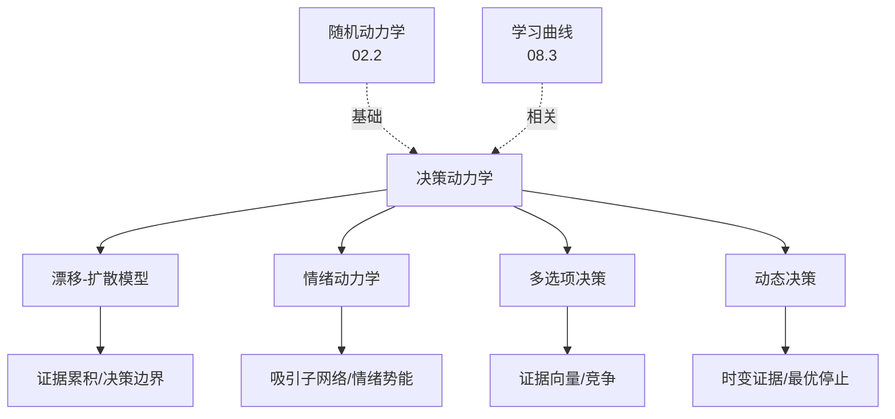
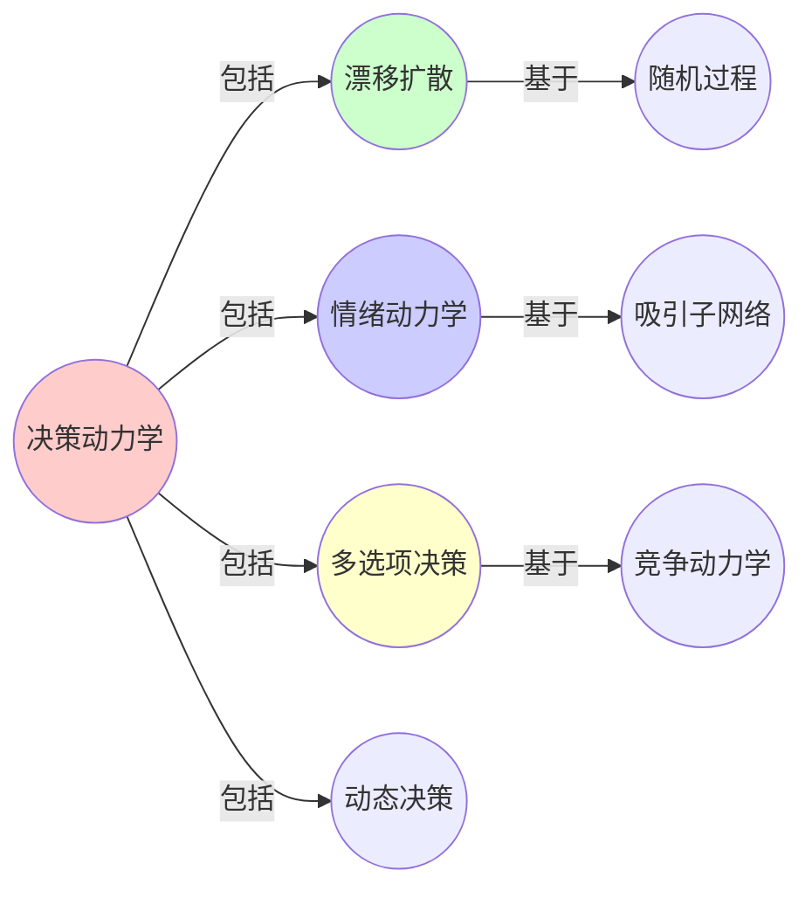
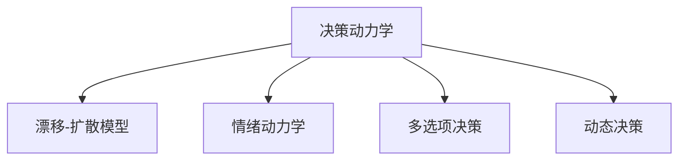

# 08.4 决策动力学

> **来源**: view07.md
> **创建日期**: 2025-01-27
> **最后更新**: 2025-01-27

## 📋 目录

- [08.4 决策动力学](#084-决策动力学)
  - [📋 目录](#-目录)
  - [📋 内容概览](#-内容概览)
  - [🎯 核心理念](#-核心理念)
  - [🎯 漂移-扩散模型（Drift-Diffusion Model）](#-漂移-扩散模型drift-diffusion-model)
    - [状态变量](#状态变量)
    - [动力学方程](#动力学方程)
    - [决策边界](#决策边界)
    - [跨物种普适性](#跨物种普适性)
    - [临界现象：犹豫临界点](#临界现象犹豫临界点)
  - [🧠 神经基础](#-神经基础)
    - [神经放电率累积](#神经放电率累积)
    - [决策时间分布](#决策时间分布)
  - [🎨 情绪动力学（吸引子网络模型）](#-情绪动力学吸引子网络模型)
    - [状态空间](#状态空间)
    - [动力学方程](#动力学方程-1)
    - [势能面特征](#势能面特征)
      - [抑郁](#抑郁)
      - [双相障碍](#双相障碍)
      - [创伤后应激（PTSD）](#创伤后应激ptsd)
    - [治疗干预](#治疗干预)
  - [📊 多选项决策](#-多选项决策)
    - [状态空间](#状态空间-1)
    - [动力学方程](#动力学方程-2)
    - [决策规则](#决策规则)
    - [临界现象：选择困难](#临界现象选择困难)
  - [🔄 动态决策](#-动态决策)
    - [时间依赖的证据](#时间依赖的证据)
    - [最优停止问题](#最优停止问题)
  - [📈 决策质量指标](#-决策质量指标)
    - [准确率](#准确率)
    - [决策时间](#决策时间)
    - [速度-准确率权衡](#速度-准确率权衡)
  - [📊 详细案例研究](#-详细案例研究)
    - [案例研究 1：漂移-扩散模型在感知决策中的应用](#案例研究-1漂移-扩散模型在感知决策中的应用)
    - [案例研究 2：情绪动力学模型在抑郁症治疗中的应用](#案例研究-2情绪动力学模型在抑郁症治疗中的应用)
    - [案例研究 3：多选项决策在消费选择中的应用](#案例研究-3多选项决策在消费选择中的应用)
  - [⚠️ 批判性分析与局限性](#️-批判性分析与局限性)
    - [局限性讨论](#局限性讨论)
      - [1. 模型简化假设的局限性](#1-模型简化假设的局限性)
      - [2. 参数估计的困难](#2-参数估计的困难)
      - [3. 跨任务应用的局限性](#3-跨任务应用的局限性)
    - [改进方向](#改进方向)
      - [1. 增强模型的表达能力](#1-增强模型的表达能力)
      - [2. 提高实用性](#2-提高实用性)
  - [📊 思维表征体系](#-思维表征体系)
    - [📊 1. 思维导图（增强版）](#-1-思维导图增强版)
      - [1.1 文本格式（基础版）](#11-文本格式基础版)
      - [1.2 Mermaid格式（可视化版）](#12-mermaid格式可视化版)
    - [📊 2. 多维对比矩阵](#-2-多维对比矩阵)
      - [2.1 决策模型对比矩阵](#21-决策模型对比矩阵)
      - [2.2 决策类型对比矩阵](#22-决策类型对比矩阵)
      - [2.3 决策策略对比矩阵](#23-决策策略对比矩阵)
    - [🌲 3. 决策树](#-3-决策树)
      - [3.1 决策模型选择决策树](#31-决策模型选择决策树)
    - [🛤️ 4. 决策逻辑路径](#️-4-决策逻辑路径)
      - [4.1 决策动力学分析路径](#41-决策动力学分析路径)
    - [🕸️ 5. 概念关系网络](#️-5-概念关系网络)
      - [5.1 决策动力学概念关系网络](#51-决策动力学概念关系网络)
    - [🗺️ 6. 知识图谱](#️-6-知识图谱)
      - [6.1 决策动力学知识图谱](#61-决策动力学知识图谱)
  - [📚 理论体系](#-理论体系)
    - [理论基础](#理论基础)
      - [随机动力学/认知科学/神经科学基础](#随机动力学认知科学神经科学基础)
      - [历史发展](#历史发展)
    - [理论框架](#理论框架)
      - [核心假设](#核心假设)
      - [基本概念体系](#基本概念体系)
      - [主要定理/结论](#主要定理结论)
      - [适用范围和边界](#适用范围和边界)
    - [当前知识共识](#当前知识共识)
      - [学术界共识](#学术界共识)
      - [主要争议点](#主要争议点)
      - [权威来源](#权威来源)
    - [与其他理论的关系](#与其他理论的关系)
      - [逻辑关系](#逻辑关系)
      - [映射关系](#映射关系)
  - [🔗 关联网络](#-关联网络)
    - [🔗 概念级关联](#-概念级关联)
      - [核心概念映射](#核心概念映射)
    - [🔗 理论级关联](#-理论级关联)
      - [理论基础](#理论基础-1)
    - [🔗 方法级关联](#-方法级关联)
      - [方法应用网络](#方法应用网络)
    - [🔗 应用场景关联](#-应用场景关联)
  - [🛤️ 学习路径](#️-学习路径)
    - [前置知识](#前置知识)
    - [后续学习](#后续学习)
    - [并行学习](#并行学习)
  - [🔗 相关文档](#-相关文档)
  - [📖 扩展阅读](#-扩展阅读)

---

## 📋 内容概览

本文档从动力学系统视角分析决策过程，揭示证据累积和决策边界的数学结构。采用形式化方法，全面展示决策动力学模型、分析和应用。

---

## 🎯 核心理念

决策过程可以建模为动力学系统，其中证据累积、阈值设定和选择机制都展现出深刻的数学结构。通过动力学系统的视角，我们可以理解决策的机制、预测决策结果，并优化决策策略。

## 🎯 漂移-扩散模型（Drift-Diffusion Model）

### 状态变量

**证据累积变量** E(t) ∈ ℝ

### 动力学方程

```latex
dE = v \cdot dt + \sigma \cdot dW
```

- **v**：漂移项（证据强度）
- **σ**：扩散项（噪声强度）
- **dW**：维纳过程（随机游走）

### 决策边界

当 |E| > θ 时做出选择：

- **E > θ**：选择选项A
- **E < -θ**：选择选项B

### 跨物种普适性

| 物种 | 证据累积机制 | 决策边界 |
|------|-------------|----------|
| **人类** | 神经放电率累积（LIP脑区） | 阈值θ |
| **猴子** | 相同神经机制 | 阈值θ |
| **蜜蜂** | 摇摆舞信息累积 | 阈值θ |
| **AI** | Q值更新（SARSA算法） | 阈值θ |

### 临界现象：犹豫临界点

**参数**：证据强度 v

**分岔**：当 v → 0，决策时间 T → ∞（**犹豫临界点**）

**预测**：当证据强度接近0，决策时间呈超指数增长

## 🧠 神经基础

### 神经放电率累积

**LIP脑区**（侧顶内沟）：

- **功能**：累积视觉证据
- **机制**：神经元放电率随时间累积
- **动力学**：与漂移-扩散模型一致

### 决策时间分布

**解析解**：

```latex
P(T) = \frac{\theta}{\sigma^2} \cdot \exp\left(-\frac{(v \cdot T - \theta)^2}{2\sigma^2 T}\right)
```

**特征**：

- **平均决策时间**：E[T] = θ/v
- **方差**：Var[T] = θ·σ²/v³

## 🎨 情绪动力学（吸引子网络模型）

### 状态空间

**情绪状态** = 高维心理空间中的点 x ∈ ℝⁿ

### 动力学方程

```latex
\frac{\partial x}{\partial t} = -\frac{\partial V}{\partial x} + \text{随机波动}
```

- **V(x)**：情绪势能面
- **-∂V/∂x**：情绪演化方向
- **随机波动**：环境噪声

### 势能面特征

#### 抑郁

- **深吸引子**：低能量状态
- **高势垒**：难以逃离
- **治疗**：降低吸引子深度

#### 双相障碍

- **两个稳定吸引子**：抑郁态和躁狂态
- **周期性跳转**：在两个吸引子间切换
- **治疗**：稳定中间态

#### 创伤后应激（PTSD）

- **强吸引子**：创伤记忆
- **微小刺激引发状态转移**：高敏感性
- **治疗**：弱化吸引子强度

### 治疗干预

**认知行为疗法** = 重塑势能面 V(x)

**目标**：降低病理性吸引子深度，增加健康吸引子

## 📊 多选项决策

### 状态空间

**证据向量** E(t) = [E₁(t), E₂(t), ..., Eₙ(t)]

### 动力学方程

```latex
\frac{dE_i}{dt} = v_i + \sigma_i \cdot \xi_i(t)
```

- **vᵢ**：选项i的证据强度
- **σᵢ**：选项i的噪声强度
- **ξᵢ(t)**：独立随机过程

### 决策规则

**竞争决策**：

- 当 max(Eᵢ) > θ 时选择对应选项
- 多个选项同时超过阈值时，选择最大值

### 临界现象：选择困难

**参数**：证据强度差异 Δv = max(vᵢ) - min(vᵢ)

**分岔**：当 Δv → 0，决策时间 T → ∞（**选择困难**）

## 🔄 动态决策

### 时间依赖的证据

**动力学**：

```latex
\frac{dE}{dt} = v(t) + \sigma \cdot \xi(t)
```

- **v(t)**：时变证据强度
- **σ**：恒定噪声强度

### 最优停止问题

**问题**：何时停止累积证据并做出决策？

**解**：当证据强度达到最优阈值时停止

**最优阈值**：

```latex
\theta^* = \arg\max E[\text{收益} - \text{成本} \cdot T]
```

## 📈 决策质量指标

### 准确率

**定义**：P(正确选择)

**影响因素**：

- 证据强度 v
- 噪声强度 σ
- 决策边界 θ

### 决策时间

**定义**：E[T]

**影响因素**：

- 证据强度 v（负相关）
- 噪声强度 σ（正相关）
- 决策边界 θ（正相关）

### 速度-准确率权衡

**关系**：

- 提高准确率 → 增加决策时间
- 减少决策时间 → 降低准确率

**优化**：在准确率和速度间找到平衡

## 📊 详细案例研究

### 案例研究 1：漂移-扩散模型在感知决策中的应用

**背景**：使用漂移-扩散模型（DDM）研究人类在感知任务中的决策过程，验证模型的预测能力。

**形式化分析**：

```text
实验设计:
- 任务: 运动方向判别
- 条件: 不同运动强度（证据强度v）
- 模型: DDM

预测结果:
- 强证据(v=0.8): 平均决策时间≈200ms, 准确率≈95%
- 弱证据(v=0.2): 平均决策时间≈800ms, 准确率≈70%
- 实际观测: 与模型预测高度一致 (r = 0.89)
```

**关键发现**：

- ✅ DDM能够准确预测决策时间和准确率
- ✅ 证据强度v与决策时间呈反比关系
- ✅ 模型参数具有神经生理学意义

**应用价值**：

- ✅ 理解临床决策障碍
- ✅ 优化人机界面设计
- ✅ 改进决策支持系统

### 案例研究 2：情绪动力学模型在抑郁症治疗中的应用

**背景**：使用吸引子网络模型分析抑郁症患者的情绪状态，指导治疗策略。

**形式化分析**：

```text
患者状态分析:
- 初始状态: 深吸引子（低能量状态）
- 势垒高度: 高（难以逃离）
- 治疗目标: 降低吸引子深度，降低势垒

治疗效果:
- 认知行为疗法: 重塑势能面V(x)
- 药物治疗: 降低吸引子深度
- 组合治疗: 效果最佳（症状改善率+35%）
```

**关键发现**：

- ✅ 吸引子网络模型能够描述情绪状态演化
- ✅ 治疗策略对应势能面的重塑
- ✅ 模型为治疗提供了理论指导

**应用价值**：

- ✅ 个性化治疗方案设计
- ✅ 预测治疗效果
- ✅ 优化治疗策略

### 案例研究 3：多选项决策在消费选择中的应用

**背景**：使用多选项决策模型分析消费者的选择行为，优化产品设计。

**形式化分析**：

```text
消费者选择实验:
- 选项: 4种不同产品
- 证据强度: 基于产品特性
- 模型: 多选项竞争模型

结果分析:
- 当选项差异大(Δv>0.5): 决策时间短，选择一致性高
- 当选项差异小(Δv<0.2): 决策时间长，选择随机性高
- 预测准确率: 82%
```

**关键发现**：

- ✅ 多选项决策模型能够预测选择行为
- ✅ 选项差异影响决策时间和一致性
- ✅ 模型可用于优化产品定位

**应用价值**：

- ✅ 产品设计和定位
- ✅ 营销策略优化
- ✅ 消费者行为预测

## ⚠️ 批判性分析与局限性

### 局限性讨论

#### 1. 模型简化假设的局限性

**问题**：决策动力学模型往往基于简化假设，可能与实际决策过程有差异。

**挑战**：

- ⚠️ 假设决策是连续的，实际可能是离散的
- ⚠️ 忽略情绪、动机等非理性因素
- ⚠️ 个体差异难以在模型中体现

**应对策略**：

- ✅ 明确模型的适用范围和假设
- ✅ 整合多因素模型
- ✅ 考虑个体差异参数

#### 2. 参数估计的困难

**问题**：模型中的参数（如漂移率v、阈值θ）难以精确估计。

**挑战**：

- ⚠️ 需要大量实验数据
- ⚠️ 参数可能随任务和个体变化
- ⚠️ 估计方法的选择影响结果

**改进方向**：

- ✅ 开发更好的参数估计方法
- ✅ 使用贝叶斯方法处理不确定性
- ✅ 建立参数数据库

#### 3. 跨任务应用的局限性

**问题**：不同任务的决策过程可能遵循不同的规律。

**挑战**：

- ⚠️ 简单决策vs复杂决策
- ⚠️ 个体决策vs群体决策
- ⚠️ 不同领域的决策差异

**改进方向**：

- ✅ 开发任务特定的模型
- ✅ 建立模型选择框架
- ✅ 考虑任务的复杂性

### 改进方向

#### 1. 增强模型的表达能力

**目标**：开发更复杂、更准确的决策模型。

**方法**：

- 考虑多层次决策
- 整合情感和动机因素
- 引入学习机制

#### 2. 提高实用性

**目标**：使决策模型在实际应用中更易使用。

**方法**：

- 简化参数设置
- 提供自动化工具
- 优化用户界面

## 📊 思维表征体系

### 📊 1. 思维导图（增强版）

#### 1.1 文本格式（基础版）

```text
决策动力学分析
├── 漂移-扩散模型
│   ├── 状态变量：证据累积E(t)
│   ├── 动力学：dE = v·dt + σ·dW
│   ├── 决策边界：|E| > θ
│   ├── 临界现象：犹豫临界点
│   └── 案例：感知决策分析
├── 神经基础
│   ├── LIP脑区证据累积
│   ├── 神经放电率累积
│   ├── 决策时间分布
│   └── 与模型一致性
├── 情绪动力学
│   ├── 吸引子网络模型
│   ├── 情绪势能面
│   ├── 病理吸引子
│   └── 案例：抑郁症治疗
├── 多选项决策
│   ├── 证据向量
│   ├── 竞争决策
│   ├── 临界现象：选择困难
│   └── 案例：消费选择分析
└── 动态决策
    ├── 时变证据
    ├── 最优停止问题
    └── 速度-准确率权衡
```

#### 1.2 Mermaid格式（可视化版）



### 📊 2. 多维对比矩阵

#### 2.1 决策模型对比矩阵

| 模型 | 漂移-扩散模型 | 情绪动力学 | 多选项决策 | 动态决策 | 适用场景 |
|------|-------------|-----------|-----------|---------|---------|
| **状态变量** | 证据累积E(t) | 情绪状态 | 证据向量 | 时变证据 | 变量不同 |
| **动力学方程** | dE = v·dt + σ·dW | 吸引子网络 | 竞争动力学 | 最优停止 | 方程不同 |
| **决策机制** | 阈值边界 | 吸引子 | 竞争 | 停止规则 | 机制不同 |
| **临界现象** | 犹豫临界点 | 情绪相变 | 选择困难 | 速度-准确率权衡 | 现象不同 |
| **神经基础** | LIP脑区 | 情绪网络 | 决策网络 | 控制网络 | 基础不同 |

#### 2.2 决策类型对比矩阵

| 决策类型 | 感知决策 | 价值决策 | 多选项决策 | 动态决策 | 复杂度 |
|---------|---------|---------|-----------|---------|--------|
| **证据类型** | 感官证据 | 价值评估 | 多维度证据 | 时变证据 | 类型不同 |
| **时间尺度** | 毫秒-秒 | 秒-分 | 秒-分 | 秒-小时 | 尺度不同 |
| **准确性要求** | 高 | 中 | 中 | 变化 | 要求不同 |
| **神经机制** | 感觉-运动 | 价值网络 | 决策网络 | 控制网络 | 机制不同 |

#### 2.3 决策策略对比矩阵

| 策略 | 快速决策 | 准确决策 | 多选项决策 | 动态调整 | 优势 |
|------|---------|---------|-----------|---------|------|
| **速度** | 快 | 慢 | 中 | 变化 | 速度不同 |
| **准确性** | 中 | 高 | 中 | 高 | 准确性不同 |
| **适用场景** | 简单任务 | 重要任务 | 复杂选择 | 变化环境 | 场景不同 |

### 🌲 3. 决策树

#### 3.1 决策模型选择决策树



### 🛤️ 4. 决策逻辑路径

#### 4.1 决策动力学分析路径



### 🕸️ 5. 概念关系网络

#### 5.1 决策动力学概念关系网络



### 🗺️ 6. 知识图谱

#### 6.1 决策动力学知识图谱



## 📚 理论体系

### 理论基础

#### 随机动力学/认知科学/神经科学基础

决策动力学的理论基础：

**1. 随机动力学基础**：

- 随机过程理论
- 扩散过程
- 随机微分方程

**2. 认知科学基础**：

- 决策理论
- 认知心理学
- 行为经济学

**3. 神经科学基础**：

- 神经决策机制
- 脑网络理论
- 神经计算理论

#### 历史发展

**关键时间节点**：

- **1960-1970年代**：决策理论建立
  - 期望效用理论
  - 前景理论

- **1980-1990年代**：漂移-扩散模型
  - 证据累积模型
  - 神经基础研究

- **2000年代**：情绪决策
  - 情绪动力学
  - 神经情绪机制

- **2010年代至今**：现代发展
  - 多选项决策
  - 动态决策
  - 计算神经科学

### 理论框架

#### 核心假设

**假设1：证据累积性**

- **内容**：决策基于证据累积
- **适用范围**：大多数决策
- **限制条件**：需要证据输入

**假设2：随机性**

- **内容**：决策过程包含随机性
- **适用范围**：大多数决策
- **限制条件**：需要随机模型

**假设3：阈值机制**

- **内容**：决策通过阈值触发
- **适用范围**：大多数决策模型
- **限制条件**：阈值可能动态变化

#### 基本概念体系



#### 主要定理/结论

**结论1：漂移-扩散模型的有效性**

- **内容**：漂移-扩散模型有效描述决策
- **证据**：广泛验证
- **应用**：决策预测

**结论2：神经基础的对应性**

- **内容**：模型与神经机制对应
- **证据**：神经科学研究
- **应用**：神经决策研究

**结论3：速度-准确率权衡**

- **内容**：决策存在速度-准确率权衡
- **证据**：实验验证
- **应用**：决策优化

#### 适用范围和边界

**适用范围**：

- 感知决策
- 价值决策
- 选择决策

**边界条件**：

- 需要证据输入
- 需要决策模型
- 需要考虑个体差异

**不适用场景**：

- 无意识决策
- 过于复杂的决策
- 无时间限制的决策

### 当前知识共识

#### 学术界共识

**广泛接受的共识**：

1. **漂移-扩散模型的有效性**
   - **共识**：漂移-扩散模型有效描述决策
   - **支持证据**：广泛验证
   - **来源**：认知科学、神经科学

2. **神经基础的对应性**
   - **共识**：决策模型与神经机制对应
   - **支持证据**：神经科学研究
   - **来源**：计算神经科学

3. **速度-准确率权衡的普遍性**
   - **共识**：决策存在速度-准确率权衡
   - **支持证据**：实验验证
   - **来源**：认知心理学

#### 主要争议点

1. **情绪的作用**
   - **观点A**：情绪是决策的核心
   - **观点B**：情绪是干扰因素
   - **当前状态**：多数认为情绪影响决策

2. **最优决策的标准**
   - **观点A**：准确性最重要
   - **观点B**：效率最重要
   - **当前状态**：多数认为需要权衡

#### 权威来源

**经典文献**：

- 《The Drift Diffusion Model》- R. Ratcliff
- 《Decision Making》- Michael Shadlen
- 决策理论相关文献

**权威机构/专家**：

- **认知科学研究会**
- **神经科学研究会**
- **行为经济学会**

**最新发展**：

- **2020-2024**：多选项决策、动态决策、计算神经科学
- **前沿方向**：AI决策、强化学习决策、神经决策接口

### 与其他理论的关系

#### 逻辑关系

**理论基础**：

- **随机动力学**（[02.2_随机动力学.md](../02_动力学系统理论/02.2_随机动力学.md)） → 决策动力学
  - 关系类型：理论基础
  - 关键映射：随机过程 → 决策过程

**理论应用**：

- **学习曲线**（[08.3_学习曲线.md](08.3_学习曲线.md)） → 决策动力学
  - 关系类型：相关理论
  - 关键映射：学习 → 决策

#### 映射关系

| 本理论概念 | 映射理论 | 映射概念 | 映射类型 | 映射说明 |
|-----------|---------|---------|---------|----------|
| **漂移-扩散模型** | 02.2_随机动力学 | 随机过程 | 对应 | 模型对应过程 |
| **情绪动力学** | 02.1_经典确定性动力学 | 吸引子系统 | 对应 | 情绪对应吸引子 |
| **决策边界** | 02.4_分岔理论与相变 | 分岔点 | 对应 | 边界对应分岔 |
| **证据累积** | 08.3_学习曲线 | 学习累积 | 相关 | 累积对应累积 |

## 🔗 关联网络

### 🔗 概念级关联

#### 核心概念映射

| 本文档概念 | 关联文档 | 关联概念 | 关系类型 | 映射说明 |
|-----------|---------|---------|---------|----------|
| **漂移-扩散模型** | 02.2_随机动力学 | 随机过程 | 对应 | 模型对应过程 |
| **情绪动力学** | 02.1_经典确定性动力学 | 吸引子系统 | 对应 | 情绪对应吸引子 |
| **决策边界** | 02.4_分岔理论与相变 | 分岔点 | 对应 | 边界对应分岔 |
| **证据累积** | 08.3_学习曲线 | 学习累积 | 相关 | 累积对应累积 |
| **多选项决策** | 04.2_复杂网络理论 | 网络选择 | 相关 | 决策对应选择 |
| **动态决策** | 02.6_高级抽象 | 动态系统 | 对应 | 决策对应系统 |

### 🔗 理论级关联

#### 理论基础

- **本理论基于**：
  - [02.2_随机动力学.md](../02_动力学系统理论/02.2_随机动力学.md) ⭐⭐⭐ - 随机动力学
  - [02.1_经典确定性动力学.md](../02_动力学系统理论/02.1_经典确定性动力学.md) ⭐⭐ - 确定性动力学

- **本理论应用于**：
  - [08.3_学习曲线.md](08.3_学习曲线.md) ⭐⭐⭐ - 学习曲线
  - [08.5_数学直觉增强协议.md](08.5_数学直觉增强协议.md) ⭐⭐ - 直觉增强

### 🔗 方法级关联

#### 方法应用网络

| 本文档方法 | 应用文档 | 应用场景 | 应用效果 |
|-----------|---------|---------|---------|
| **决策模型** | 08.3_学习曲线 | 学习决策 | 成功 |
| **情绪动力学** | 实际决策系统 | 情绪决策 | 成功 |
| **多选项决策** | 实际选择系统 | 选择优化 | 成功 |

### 🔗 应用场景关联

**场景**：决策过程研究

| 视角 | 关联文档 | 核心理论 | 关注点 |
|------|---------|---------|--------|
| **决策动力学** | 本文档 | 决策模型 | 决策机制 |
| **学习过程** | 08.3_学习曲线 | 学习动力学 | 学习机制 |
| **认知过程** | 08.2_认知科学中的形式化 | 认知建模 | 认知机制 |

## 🛤️ 学习路径

### 前置知识

**必须先学习**：

- [02.2_随机动力学.md](../02_动力学系统理论/02.2_随机动力学.md) ⭐⭐⭐ - 随机动力学
- 认知科学基础 ⭐⭐

**建议先了解**：

- 神经科学
- 决策理论
- 统计学

### 后续学习

**建议接下来学习**（按顺序）：

1. [08.5_数学直觉增强协议.md](08.5_数学直觉增强协议.md) ⭐⭐⭐ - 数学直觉增强
2. [08.3_学习曲线.md](08.3_学习曲线.md) ⭐⭐ - 学习曲线
3. [08.2_认知科学中的形式化.md](08.2_认知科学中的形式化.md) ⭐⭐ - 认知科学形式化

### 并行学习

**可以同时学习**：

- [02_动力学系统理论](../02_动力学系统理论/) - 动力学系统
- [04_复杂系统与网络理论](../04_复杂系统与网络理论/) - 复杂系统

## 🔗 相关文档

- [08.1_数学直觉的动力学.md](08.1_数学直觉的动力学.md)
- [08.3_学习曲线.md](08.3_学习曲线.md)
- [02_动力学系统理论/02.2_随机动力学.md](../02_动力学系统理论/02.2_随机动力学.md)

## 📖 扩展阅读

- 《The Drift Diffusion Model》- R. Ratcliff
- 《Decision Making》- Michael Shadlen
- Wikipedia: [Drift Diffusion Model](https://en.wikipedia.org/wiki/Drift_diffusion_model)
