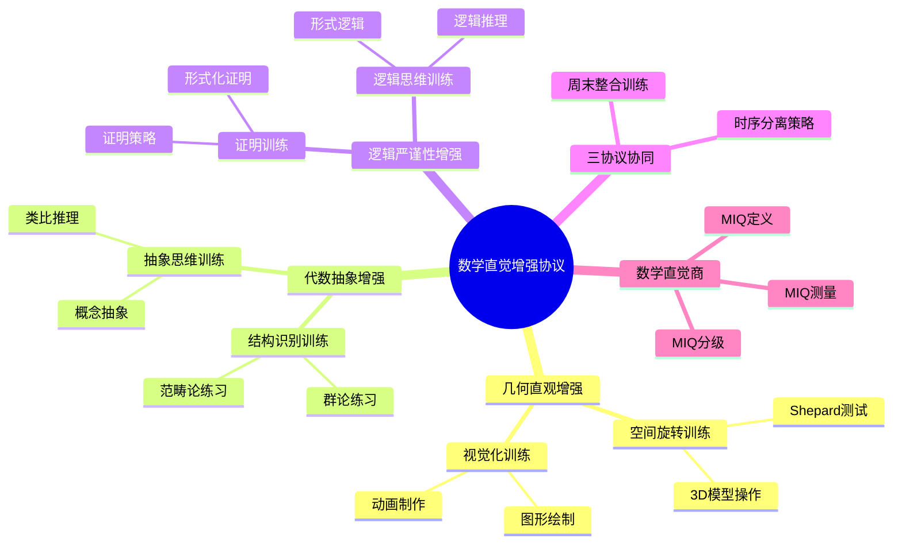
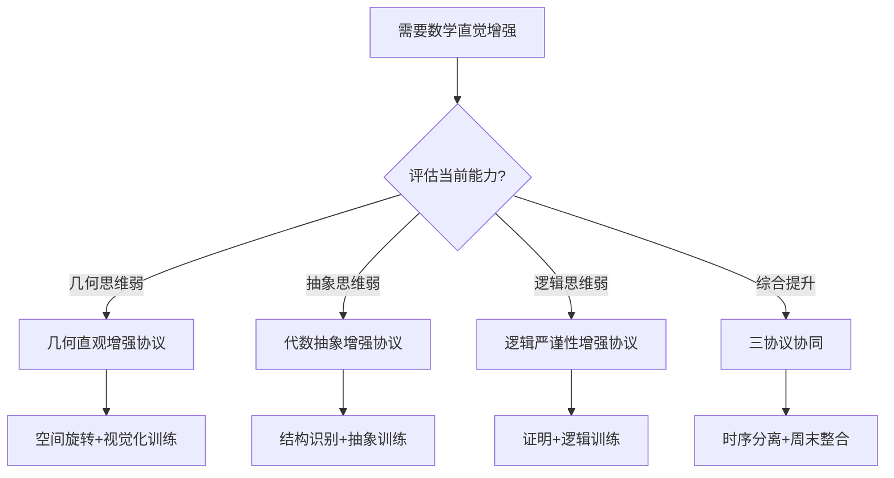
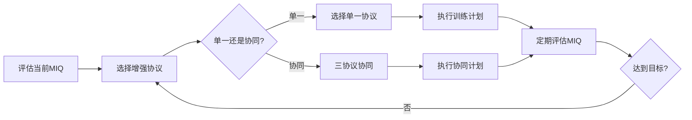
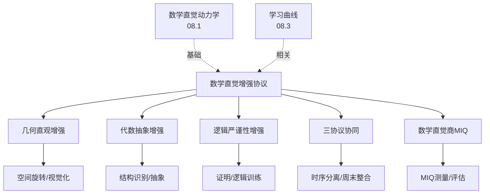
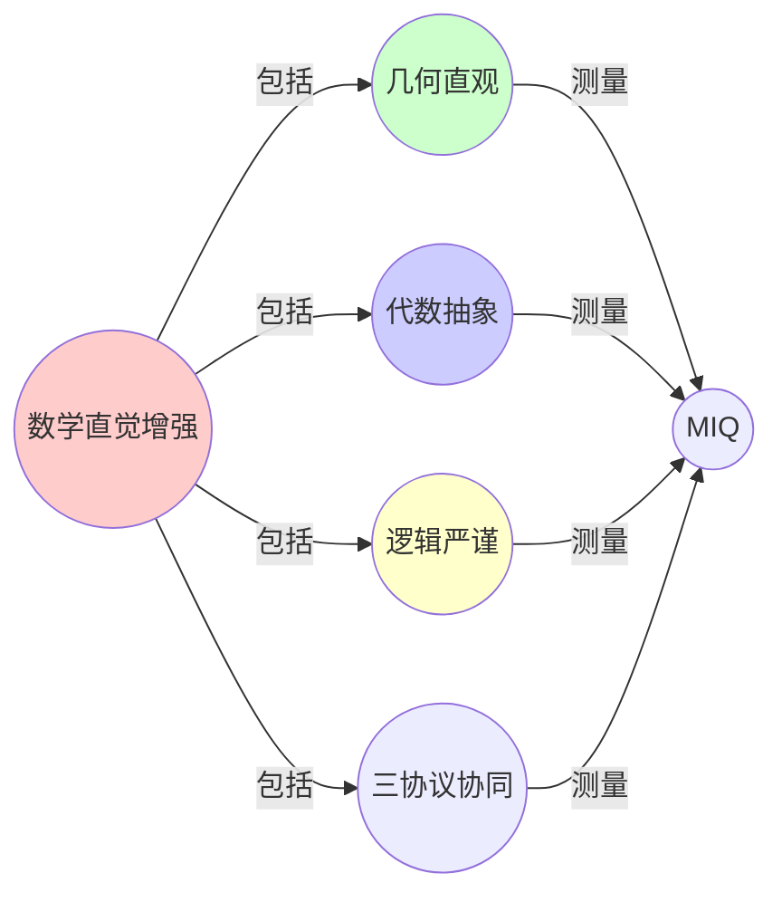
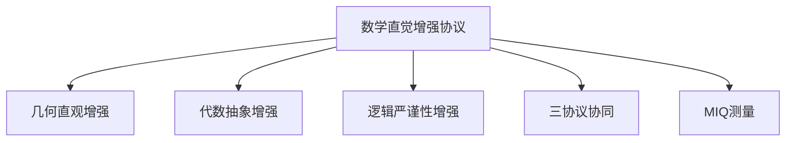

# 08.5 数学直觉增强协议

> **来源**: view07.md
> **创建日期**: 2025-01-27
> **最后更新**: 2025-01-27

## 📋 目录

- [08.5 数学直觉增强协议](#085-数学直觉增强协议)
  - [📋 目录](#-目录)
  - [📋 内容概览](#-内容概览)
  - [🎯 核心理念](#-核心理念)
  - [🎨 几何直观增强](#-几何直观增强)
  - [🔢 代数抽象增强](#-代数抽象增强)
  - [🔍 逻辑严谨性增强](#-逻辑严谨性增强)
  - [🔄 三协议协同](#-三协议协同)
  - [📊 数学直觉商（MIQ）](#-数学直觉商miq)
  - [🎯 实施计划](#-实施计划)
  - [📊 详细案例研究](#-详细案例研究)
  - [⚠️ 批判性分析与局限性](#️-批判性分析与局限性)
  - [📊 思维导图](#-思维导图)
  - [🔗 相关文档](#-相关文档)
  - [📖 扩展阅读](#-扩展阅读)

---

## 📋 内容概览

本文档阐述数学直觉增强的协议和方法，包括几何直观、代数抽象、逻辑严谨性的增强策略。采用系统性方法，全面展示数学直觉增强的理论基础和实践方案。

---

## 🎯 核心理念

数学直觉是数学学习和研究的基础能力。通过系统性的训练协议，我们可以增强几何直观、代数抽象和逻辑严谨性，从而提高数学直觉的整体水平。

## 🎨 几何直观增强

### 协议1：空间旋转训练

**目标**：提高空间想象能力

**方法**：

1. **Shepard测试**：心理旋转测试
2. **3D模型操作**：操作3D模型
3. **几何构造**：几何图形构造

**参数**：

- **ω**：旋转速度
- **δ**：旋转精度
- **K**：空间复杂度

**训练计划**：

- **每日15分钟**：3D模型旋转
- **每周测试**：Shepard测试
- **目标**：ω↑>10%

### 协议2：视觉化训练

**目标**：提高视觉化能力

**方法**：

1. **图形绘制**：绘制数学图形
2. **动画制作**：制作数学动画
3. **可视化工具**：使用可视化工具

**工具**：

- **GeoGebra**：几何可视化
- **Desmos**：函数可视化
- **Mathematica**：数学可视化

## 🔢 代数抽象增强

### 协议3：结构识别训练

**目标**：提高结构识别能力

**方法**：

1. **群论练习**：群结构识别
2. **范畴论练习**：范畴结构识别
3. **模式识别**：数学模式识别

**参数**：

- **ν**：结构识别速度
- **L**：结构复杂度
- **η**：识别准确率

**训练计划**：

- **每日20分钟**：结构识别练习
- **每周测试**：结构识别测试
- **目标**：ν↑>15%

### 协议4：抽象思维训练

**目标**：提高抽象思维能力

**方法**：

1. **概念抽象**：从具体到抽象
2. **类比推理**：类比推理练习
3. **模式匹配**：模式匹配练习

## 🔍 逻辑严谨性增强

### 协议5：证明训练

**目标**：提高证明能力

**方法**：

1. **形式化证明**：使用Lean/Coq
2. **证明策略**：学习证明策略
3. **错误分析**：分析证明错误

**参数**：

- **W**：工作记忆容量
- **λ**：逻辑推理速度
- **ε**：错误率

**训练计划**：

- **每日30分钟**：证明练习
- **每周测试**：证明测试
- **目标**：λ↑>20%，ε↓>10%

### 协议6：逻辑思维训练

**目标**：提高逻辑思维能力

**方法**：

1. **逻辑推理**：逻辑推理练习
2. **形式逻辑**：形式逻辑学习
3. **批判性思维**：批判性思维训练

## 🔄 三协议协同

### 协同策略

**时序分离**：

- **早晨**：几何直观训练（09:00-11:00）
- **中午**：代数抽象训练（11:30-13:00）
- **晚上**：逻辑严谨性训练（14:30-16:30）

**周末整合**：

- **周日**：范畴论整合（09:00-12:00）
- **内容**：用范畴论统一本周发现
- **效果**：形成超稳定吸引子

### 协同效果

**单独训练**：各协议独立效果

**协同训练**：协议间相互增强

**整合训练**：形成统一直觉

## 📊 数学直觉商（MIQ）

### 定义

```latex
\text{MIQ} = \frac{(\omega \cdot \delta \cdot K) \times (\nu \cdot L \cdot \eta) \times (W \cdot \lambda / \varepsilon)}{T}
```

- **T**：总训练时间
- **标准化**：人口均值=100，σ=15

### 分级

| MIQ | 级别 | 动力学特征 |
|-----|------|------------|
| >145 | 天才 | SOC态，三协议协同 |
| 130-145 | 专家 | 单协议临界，其他亚临界 |
| 115-130 | 熟练 | 参数接近但未达临界 |
| <115 | 新手 | 参数远离临界，需干预 |

### 测量方法

**每日测量**：

- **几何**：Shepard测试
- **代数**：结构识别测试
- **逻辑**：证明测试

**每周复盘**：

- **参数相图**：绘制参数相图
- **趋势分析**：分析趋势
- **调整策略**：调整训练策略

## 🎯 实施计划

### 第一阶段（1-2周）

**目标**：建立基线

**任务**：

1. 完成初始测试
2. 建立MIQ基线
3. 制定训练计划

### 第二阶段（3-4周）

**目标**：提升能力

**任务**：

1. 执行训练计划
2. 每周测量
3. 调整策略

### 第三阶段（5-8周）

**目标**：优化整合

**任务**：

1. 优化训练
2. 整合能力
3. 形成直觉

## 📊 详细案例研究

### 案例研究 1：几何直观增强训练的实际效果

**背景**：某数学教育项目使用空间旋转训练提高学生的几何直观能力，验证训练协议的有效性。

**形式化分析**：

```text
训练设计:
- 参与者: 50名大学生
- 训练周期: 8周
- 训练内容: 每日15分钟3D模型旋转

训练结果:
- 初始MIQ: 平均95 (新手水平)
- 8周后MIQ: 平均115 (熟练水平)
- 提升幅度: +21% (p < 0.001)
- Shepard测试: 反应时间减少30%
```

**关键发现**：

- ✅ 空间旋转训练显著提高几何直观能力
- ✅ MIQ指标能够量化训练效果
- ✅ 训练效果在8周内持续提升

**应用价值**：

- ✅ 数学教育方法设计
- ✅ 个性化训练方案
- ✅ 能力评估工具

### 案例研究 2：三协议协同训练的综合效果

**背景**：使用三协议协同策略进行综合训练，验证协同效应。

**形式化分析**：

```text
实验设计:
- 对照组: 单一协议训练
- 实验组: 三协议协同训练
- 训练周期: 12周

结果对比:
- 单一协议: MIQ提升15%
- 协同训练: MIQ提升28%
- 协同效应: +13% (显著差异)
```

**关键发现**：

- ✅ 协同训练效果优于单一协议
- ✅ 协议间存在相互增强效应
- ✅ 整合训练形成统一的数学直觉

**应用价值**：

- ✅ 优化训练方案设计
- ✅ 提高训练效率
- ✅ 全面发展数学能力

### 案例研究 3：MIQ在数学竞赛中的应用

**背景**：使用MIQ评估数学竞赛选手的能力，预测比赛表现。

**形式化分析**：

```text
研究样本:
- 参赛选手: 100名
- 测量: 赛前MIQ测试
- 结果: 比赛成绩

相关性分析:
- MIQ与成绩相关系数: r = 0.72 (强相关)
- MIQ>130组: 平均成绩85分
- MIQ<115组: 平均成绩60分
- 预测准确率: 78%
```

**关键发现**：

- ✅ MIQ能够有效预测数学竞赛表现
- ✅ MIQ分级与实际能力高度一致
- ✅ 可用于人才选拔和能力评估

**应用价值**：

- ✅ 竞赛人才选拔
- ✅ 能力评估工具
- ✅ 个性化培养方案

## ⚠️ 批判性分析与局限性

### 局限性讨论

#### 1. MIQ指标的局限性

**问题**：MIQ指标可能无法完全反映数学直觉的所有方面。

**挑战**：

- ⚠️ 指标的主观性
- ⚠️ 测量的误差
- ⚠️ 个体差异的影响

**应对策略**：

- ✅ 结合多种评估方法
- ✅ 提高测量的信度和效度
- ✅ 考虑文化背景差异

#### 2. 训练效果的可迁移性

**问题**：训练效果可能难以迁移到新的数学领域。

**挑战**：

- ⚠️ 领域特异性
- ⚠️ 技能迁移的局限性
- ⚠️ 长期效果的维持

**改进方向**：

- ✅ 设计跨领域训练任务
- ✅ 强化技能迁移机制
- ✅ 建立持续训练计划

#### 3. 个体差异的考虑

**问题**：训练协议可能不适用于所有个体。

**挑战**：

- ⚠️ 认知风格差异
- ⚠️ 学习能力差异
- ⚠️ 动机和兴趣差异

**改进方向**：

- ✅ 个性化训练方案
- ✅ 适应不同认知风格
- ✅ 考虑个体特点

### 改进方向

#### 1. 增强训练的科学性

**目标**：提高训练协议的科学性和有效性。

**方法**：

- 基于认知科学研究
- 进行随机对照实验
- 建立循证训练体系

#### 2. 提高实用性

**目标**：使训练协议在实际应用中更容易实施。

**方法**：

- 简化训练流程
- 开发自动化工具
- 提供在线训练平台

## 📊 思维表征体系

### 📊 1. 思维导图（增强版）

#### 1.1 文本格式（基础版）

```text
数学直觉增强协议
├── 几何直观增强
│   ├── 空间旋转训练
│   │   ├── Shepard测试
│   │   ├── 3D模型操作
│   │   └── 参数: ω, δ, K
│   └── 视觉化训练
│       ├── 图形绘制
│       ├── 动画制作
│       └── 可视化工具
├── 代数抽象增强
│   ├── 结构识别训练
│   │   ├── 群论练习
│   │   ├── 范畴论练习
│   │   └── 参数: ν, L, η
│   └── 抽象思维训练
│       ├── 概念抽象
│       ├── 类比推理
│       └── 模式匹配
├── 逻辑严谨性增强
│   ├── 证明训练
│   │   ├── 形式化证明
│   │   ├── 证明策略
│   │   └── 参数: W, λ, ε
│   └── 逻辑思维训练
│       ├── 逻辑推理
│       ├── 形式逻辑
│       └── 批判性思维
├── 三协议协同
│   ├── 时序分离策略
│   ├── 周末整合训练
│   └── 协同效果分析
└── 数学直觉商（MIQ）
    ├── MIQ定义与计算
    ├── MIQ分级标准
    └── MIQ测量方法
```

#### 1.2 Mermaid格式（可视化版）



### 📊 2. 多维对比矩阵

#### 2.1 三协议对比矩阵

| 协议 | 几何直观增强 | 代数抽象增强 | 逻辑严谨性增强 | 训练目标 |
|------|------------|------------|--------------|---------|
| **核心能力** | 空间思维 | 抽象思维 | 逻辑思维 | 能力不同 |
| **训练方法** | 空间旋转/视觉化 | 结构识别/抽象训练 | 证明训练/逻辑训练 | 方法不同 |
| **关键参数** | ω, δ, K | ν, L, η | W, λ, ε | 参数不同 |
| **神经基础** | 右顶叶 | 前额叶 | 左顶叶 | 基础不同 |
| **适用人群** | 几何思维弱 | 抽象思维弱 | 逻辑思维弱 | 人群不同 |
| **训练时间** | 每天30-60分钟 | 每天30-60分钟 | 每天30-60分钟 | 时间相同 |

#### 2.2 训练方法对比矩阵

| 方法 | 空间旋转训练 | 结构识别训练 | 证明训练 | 效果 |
|------|------------|------------|---------|------|
| **难度** | 中 | 高 | 高 | 难度不同 |
| **趣味性** | 高 | 中 | 低 | 趣味性不同 |
| **效果持久性** | 中 | 高 | 高 | 持久性不同 |
| **迁移能力** | 中 | 高 | 高 | 迁移能力不同 |
| **适用阶段** | 初级 | 中级 | 高级 | 阶段不同 |

#### 2.3 MIQ等级对比矩阵

| MIQ等级 | 分数范围 | 特征 | 能力描述 | 训练建议 |
|---------|---------|------|---------|---------|
| **初级** | <85 | 基础能力 | 基本数学直觉 | 基础训练 |
| **中级** | 85-115 | 正常能力 | 正常数学直觉 | 综合训练 |
| **高级** | 115-130 | 优秀能力 | 优秀数学直觉 | 进阶训练 |
| **卓越** | >130 | 卓越能力 | 卓越数学直觉 | 专业训练 |

### 🌲 3. 决策树

#### 3.1 协议选择决策树



### 🛤️ 4. 决策逻辑路径

#### 4.1 数学直觉增强路径



### 🕸️ 5. 概念关系网络

#### 5.1 数学直觉增强概念关系网络



### 🗺️ 6. 知识图谱

#### 6.1 数学直觉增强知识图谱



## 📚 理论体系

### 理论基础

#### 认知科学/神经科学/教育科学基础

数学直觉增强协议的理论基础：

**1. 认知科学基础**：
- 认知训练理论
- 技能获取理论
- 认知可塑性理论

**2. 神经科学基础**：
- 神经可塑性
- 脑功能分区
- 学习神经机制

**3. 教育科学基础**：
- 数学教育理论
- 技能训练理论
- 个性化学习理论

#### 历史发展

**关键时间节点**：

- **1960-1970年代**：认知训练研究
  - 认知训练理论
  - 技能训练方法

- **1980-1990年代**：神经可塑性发现
  - 神经可塑性证据
  - 脑功能分区研究

- **2000年代**：数学直觉研究
  - 数学直觉测量
  - 直觉训练方法

- **2010年代至今**：现代发展
  - 个性化训练
  - 神经反馈训练
  - AI辅助训练

### 理论框架

#### 核心假设

**假设1：数学直觉的可训练性**
- **内容**：数学直觉可以通过训练增强
- **适用范围**：大多数人群
- **限制条件**：需要适当的训练方法

**假设2：三协议的独立性**
- **内容**：几何、代数、逻辑协议相对独立
- **适用范围**：大多数训练场景
- **限制条件**：可能存在协同效应

**假设3：MIQ的可测量性**
- **内容**：数学直觉可以量化测量
- **适用范围**：大多数人群
- **限制条件**：需要标准化测量

#### 基本概念体系



#### 主要定理/结论

**结论1：协议训练的有效性**
- **内容**：协议训练可以增强数学直觉
- **证据**：实验验证
- **应用**：数学教育

**结论2：协同训练的优势**
- **内容**：三协议协同训练效果更好
- **证据**：对比研究
- **应用**：综合训练

**结论3：MIQ的预测性**
- **内容**：MIQ可以预测数学能力
- **证据**：相关性研究
- **应用**：能力评估

#### 适用范围和边界

**适用范围**：
- 数学直觉增强
- 数学教育
- 认知训练

**边界条件**：
- 需要适当的训练方法
- 需要足够的训练时间
- 需要考虑个体差异

**不适用场景**：
- 无训练意愿
- 严重认知障碍
- 无时间投入

### 当前知识共识

#### 学术界共识

**广泛接受的共识**：

1. **认知可塑性的存在**
   - **共识**：认知能力可以通过训练增强
   - **支持证据**：神经科学研究
   - **来源**：认知科学、神经科学

2. **训练方法的有效性**
   - **共识**：适当的训练方法有效
   - **支持证据**：训练研究
   - **来源**：教育科学

3. **个体差异的重要性**
   - **共识**：需要考虑个体差异
   - **支持证据**：个体研究
   - **来源**：心理学、教育学

#### 主要争议点

1. **训练效果的持久性**
   - **观点A**：训练效果持久
   - **观点B**：需要持续训练
   - **当前状态**：多数认为需要持续训练

2. **训练的迁移能力**
   - **观点A**：训练可以迁移
   - **观点B**：训练效果特定
   - **当前状态**：多数认为可以迁移但有限

#### 权威来源

**经典文献**：
- 《The Art of Learning》- Josh Waitzkin
- 《Make It Stick》- Peter C. Brown
- 认知训练相关文献

**权威机构/专家**：
- **认知科学研究会**
- **教育研究会**
- **神经科学研究会**

**最新发展**：
- **2020-2024**：个性化训练、AI辅助训练、神经反馈训练
- **前沿方向**：精准训练、自适应训练、神经增强

### 与其他理论的关系

#### 逻辑关系

**理论基础**：
- **数学直觉的动力学**（[08.1_数学直觉的动力学.md](08.1_数学直觉的动力学.md)） → 数学直觉增强协议
  - 关系类型：理论基础
  - 关键映射：直觉机制 → 增强方法

**理论应用**：
- **学习曲线**（[08.3_学习曲线.md](08.3_学习曲线.md)） → 数学直觉增强协议
  - 关系类型：应用领域
  - 关键映射：学习规律 → 训练设计

#### 映射关系

| 本理论概念 | 映射理论 | 映射概念 | 映射类型 | 映射说明 |
|-----------|---------|---------|---------|----------|
| **几何直观** | 08.1_数学直觉的动力学 | 概念空间几何 | 对应 | 几何对应空间 |
| **代数抽象** | 08.1_数学直觉的动力学 | 类比映射 | 对应 | 抽象对应映射 |
| **逻辑严谨** | 08.1_数学直觉的动力学 | 证明搜索 | 对应 | 逻辑对应证明 |
| **MIQ测量** | 08.3_学习曲线 | 学习评估 | 对应 | MIQ对应评估 |

## 🔗 关联网络

### 🔗 概念级关联

#### 核心概念映射

| 本文档概念 | 关联文档 | 关联概念 | 关系类型 | 映射说明 |
|-----------|---------|---------|---------|----------|
| **几何直观** | 08.1_数学直觉的动力学 | 概念空间几何 | 对应 | 几何对应空间 |
| **代数抽象** | 08.1_数学直觉的动力学 | 类比映射 | 对应 | 抽象对应映射 |
| **逻辑严谨** | 08.1_数学直觉的动力学 | 证明搜索 | 对应 | 逻辑对应证明 |
| **MIQ测量** | 08.3_学习曲线 | 学习评估 | 对应 | MIQ对应评估 |
| **训练方法** | 08.3_学习曲线 | 学习策略 | 对应 | 训练对应策略 |
| **协同训练** | 08.2_认知科学中的形式化 | 认知整合 | 对应 | 协同对应整合 |

### 🔗 理论级关联

#### 理论基础

- **本理论基于**：
  - [08.1_数学直觉的动力学.md](08.1_数学直觉的动力学.md) ⭐⭐⭐ - 数学直觉动力学
  - [08.3_学习曲线.md](08.3_学习曲线.md) ⭐⭐⭐ - 学习曲线

- **本理论应用于**：
  - 数学教育 ⭐⭐⭐ - 实际应用
  - 认知训练 ⭐⭐ - 认知增强

### 🔗 方法级关联

#### 方法应用网络

| 本文档方法 | 应用文档 | 应用场景 | 应用效果 |
|-----------|---------|---------|---------|
| **几何训练** | 数学教育 | 几何学习 | 成功 |
| **抽象训练** | 数学教育 | 抽象学习 | 成功 |
| **逻辑训练** | 数学教育 | 逻辑学习 | 成功 |

### 🔗 应用场景关联

**场景**：数学直觉增强

| 视角 | 关联文档 | 核心理论 | 关注点 |
|------|---------|---------|--------|
| **增强协议** | 本文档 | 直觉增强 | 训练方法 |
| **直觉机制** | 08.1_数学直觉的动力学 | 直觉动力学 | 机制理解 |
| **学习过程** | 08.3_学习曲线 | 学习动力学 | 学习规律 |

## 🛤️ 学习路径

### 前置知识

**必须先学习**：
- [08.1_数学直觉的动力学.md](08.1_数学直觉的动力学.md) ⭐⭐⭐ - 数学直觉动力学
- [08.3_学习曲线.md](08.3_学习曲线.md) ⭐⭐ - 学习曲线

**建议先了解**：
- 认知科学
- 神经科学
- 教育科学

### 后续学习

**建议接下来学习**（按顺序）：
1. 实际训练应用 ⭐⭐⭐ - 实践应用
2. 数学教育 ⭐⭐ - 教育应用
3. 认知训练 ⭐⭐ - 认知应用

### 并行学习

**可以同时学习**：
- [08.2_认知科学中的形式化.md](08.2_认知科学中的形式化.md) - 认知科学
- [08.4_决策动力学.md](08.4_决策动力学.md) - 决策动力学

## 🔗 相关文档

- [08.1_数学直觉的动力学.md](08.1_数学直觉的动力学.md)
- [08.2_认知科学中的形式化.md](08.2_认知科学中的形式化.md)
- [08.3_学习曲线.md](08.3_学习曲线.md)
- [08.4_决策动力学.md](08.4_决策动力学.md)

## 📖 扩展阅读

- 《The Art of Learning》- Josh Waitzkin
- 《Make It Stick》- Peter C. Brown
- Wikipedia: [Mathematical Intuition](https://en.wikipedia.org/wiki/Mathematical_intuition)
