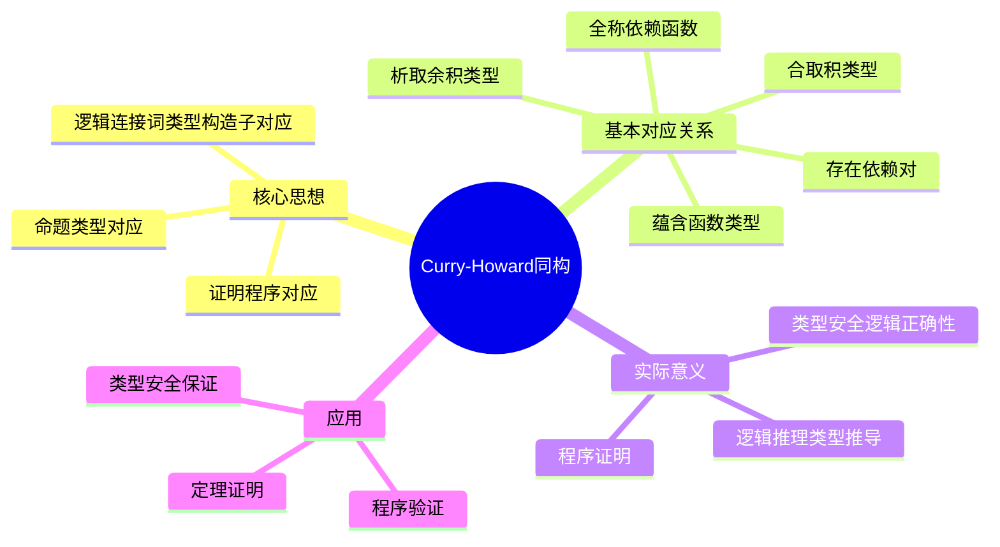
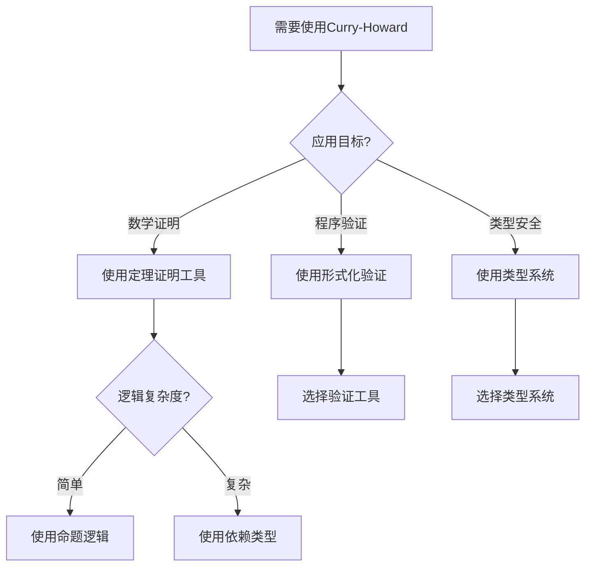
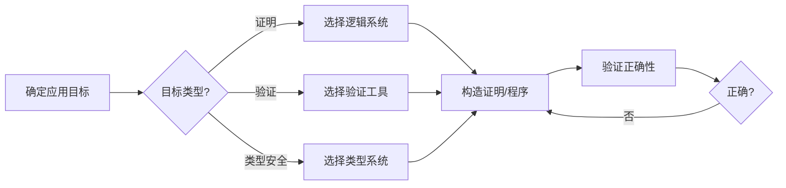
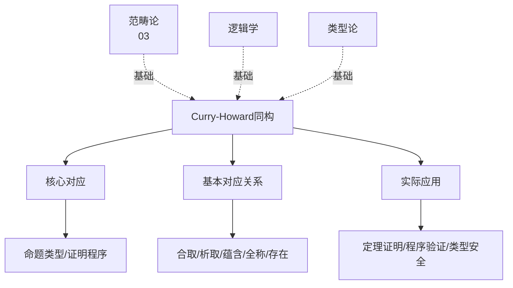
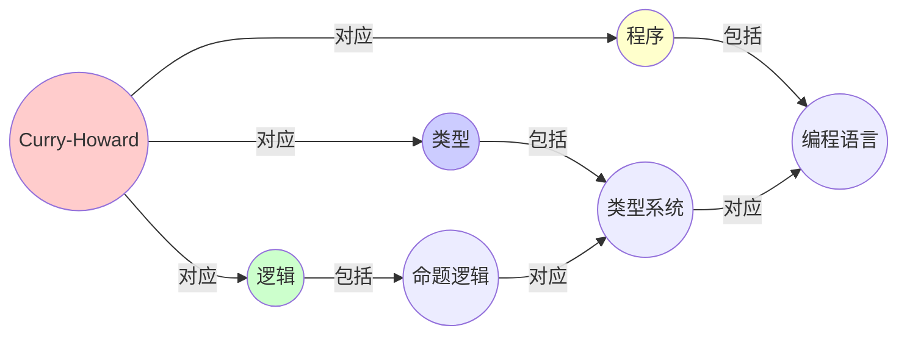
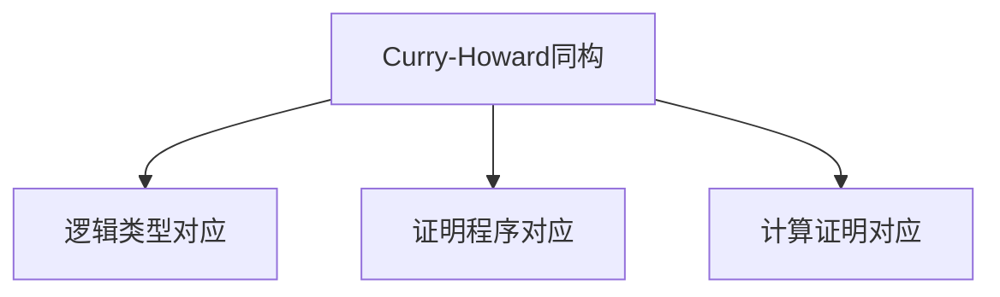

# 09.1 逻辑与类型的对应

> **来源**: view08.md
> **创建日期**: 2025-01-27
> **最后更新**: 2025-11-14

## 📋 目录

- [09.1 逻辑与类型的对应](#091-逻辑与类型的对应)
  - [📋 目录](#-目录)
  - [📋 内容概览](#-内容概览)
  - [🎯 核心理念](#-核心理念)
  - [🎯 Curry-Howard同构的核心](#-curry-howard同构的核心)
    - [基本对应](#基本对应)
    - [三重对应](#三重对应)
  - [📊 基本对应关系](#-基本对应关系)
    - [1. ∧ (与) ↔ 积类型 (A × B) ↔ Tuple](#1--与--积类型-a--b--tuple)
      - [逻辑侧：合取](#逻辑侧合取)
      - [编程侧：Tuple](#编程侧tuple)
    - [2. ∨ (或) ↔ 余积类型 (A + B) ↔ Either](#2--或--余积类型-a--b--either)
      - [逻辑侧：析取](#逻辑侧析取)
      - [编程侧：Either](#编程侧either)
    - [3. ⇒ (蕴含) ↔ 指数类型 (A ⇒ B) ↔ Function](#3--蕴含--指数类型-a--b--function)
      - [逻辑侧：蕴含](#逻辑侧蕴含)
      - [编程侧：Function类型](#编程侧function类型)
  - [🔄 对应关系总结表](#-对应关系总结表)
  - [💡 实际意义](#-实际意义)
    - [1. 类型安全 = 逻辑正确性](#1-类型安全--逻辑正确性)
    - [2. 程序 = 证明](#2-程序--证明)
    - [3. 逻辑推理 = 类型推导](#3-逻辑推理--类型推导)
  - [📊 详细案例研究](#-详细案例研究)
    - [案例研究 1：类型安全保证逻辑正确性](#案例研究-1类型安全保证逻辑正确性)
    - [案例研究 2：证明即程序的实际应用](#案例研究-2证明即程序的实际应用)
  - [⚠️ 批判性分析与局限性](#️-批判性分析与局限性)
    - [局限性讨论](#局限性讨论)
      - [1. 对应关系的适用范围](#1-对应关系的适用范围)
      - [2. 类型系统的表达能力](#2-类型系统的表达能力)
    - [改进方向](#改进方向)
      - [1. 扩展对应关系](#1-扩展对应关系)
      - [2. 提高实用性](#2-提高实用性)
  - [📊 思维表征体系](#-思维表征体系)
    - [📊 1. 思维导图（增强版）](#-1-思维导图增强版)
      - [1.1 文本格式（基础版）](#11-文本格式基础版)
      - [1.2 Mermaid格式（可视化版）](#12-mermaid格式可视化版)
    - [📊 2. 多维对比矩阵](#-2-多维对比矩阵)
      - [2.1 对应关系对比矩阵](#21-对应关系对比矩阵)
      - [2.2 应用场景对比矩阵](#22-应用场景对比矩阵)
      - [2.3 逻辑系统对比矩阵](#23-逻辑系统对比矩阵)
    - [🌲 3. 决策树](#-3-决策树)
      - [3.1 Curry-Howard应用选择决策树](#31-curry-howard应用选择决策树)
    - [🛤️ 4. 决策逻辑路径](#️-4-决策逻辑路径)
      - [4.1 Curry-Howard应用路径](#41-curry-howard应用路径)
    - [🕸️ 5. 概念关系网络](#️-5-概念关系网络)
      - [5.1 Curry-Howard同构概念关系网络](#51-curry-howard同构概念关系网络)
    - [🗺️ 6. 知识图谱](#️-6-知识图谱)
      - [6.1 Curry-Howard同构知识图谱](#61-curry-howard同构知识图谱)
  - [📚 理论体系](#-理论体系)
    - [理论基础](#理论基础)
      - [逻辑学/类型论/计算理论基础](#逻辑学类型论计算理论基础)
      - [历史发展](#历史发展)
    - [理论框架](#理论框架)
      - [核心假设](#核心假设)
      - [基本概念体系](#基本概念体系)
      - [主要定理/结论](#主要定理结论)
      - [适用范围和边界](#适用范围和边界)
    - [当前知识共识](#当前知识共识)
      - [学术界共识](#学术界共识)
      - [主要争议点](#主要争议点)
      - [权威来源](#权威来源)
    - [与其他理论的关系](#与其他理论的关系)
      - [逻辑关系](#逻辑关系)
      - [映射关系](#映射关系)
  - [🔗 关联网络](#-关联网络)
    - [🔗 概念级关联](#-概念级关联)
      - [核心概念映射](#核心概念映射)
    - [🔗 理论级关联](#-理论级关联)
      - [理论基础](#理论基础-1)
    - [🔗 方法级关联](#-方法级关联)
      - [方法应用网络](#方法应用网络)
    - [🔗 应用场景关联](#-应用场景关联)
  - [🛤️ 学习路径](#️-学习路径)
    - [前置知识](#前置知识)
    - [后续学习](#后续学习)
    - [并行学习](#并行学习)
  - [🔗 相关文档](#-相关文档)
  - [📖 扩展阅读](#-扩展阅读)

---

## 📋 内容概览

本文档阐述Curry-Howard同构的核心思想：逻辑、类型与程序的统一对应关系。通过形式化方法，全面展示逻辑、类型系统和编程之间的深刻对应关系。

---

## 🎯 核心理念

Curry-Howard同构揭示了逻辑、类型系统和计算之间的深刻对应关系：命题即类型，证明即程序。这种对应关系为我们理解逻辑推理、类型系统和程序设计提供了统一的视角。

## 🎯 Curry-Howard同构的核心

### 基本对应

- **命题 = 类型**
- **证明 = 程序**
- **逻辑连接词 = 类型构造子**

### 三重对应

```text
逻辑 ←→ 类型 ←→ 程序
```

## 📊 基本对应关系

### 1. ∧ (与) ↔ 积类型 (A × B) ↔ Tuple

#### 逻辑侧：合取

命题 `A ∧ B` 表示"A与B同时为真"。

**证明规则**：

- **引入**：若 ⊢ A 且 ⊢ B，则 ⊢ A ∧ B
- **消去**：若 ⊢ A ∧ B，则 ⊢ A；若 ⊢ A ∧ B，则 ⊢ B

#### 编程侧：Tuple

```haskell
-- 构造子（introduction）
pair :: A -> B -> (A, B)
pair a b = (a, b)

-- 消去子（elimination）
fst :: (A, B) -> A
fst (a, b) = a

snd :: (A, B) -> B
snd (a, b) = b

-- β-规约（计算规则）
fst (pair a b) = a
snd (pair a b) = b

-- η-规约（唯一性规则）
pair (fst p) (snd p) = p
```

**关键同构**：

- `pair` = **合取引入**
- `fst/snd` = **合取消去**
- `β-规约` = **证明规约**

### 2. ∨ (或) ↔ 余积类型 (A + B) ↔ Either

#### 逻辑侧：析取

命题 `A ∨ B` 表示"A或B至少一个为真"。

**证明规则**：

- **引入**：若 ⊢ A，则 ⊢ A ∨ B；若 ⊢ B，则 ⊢ A ∨ B
- **消去**：若 ⊢ A ∨ B，且从A可证C，从B可证C，则 ⊢ C

#### 编程侧：Either

```haskell
data Either a b = Left a | Right b

-- 构造子
left  :: A -> Either A B
left a = Left a

right :: B -> Either A B
right b = Right b

-- 消去子（模式匹配 = 证明分情况）
caseEither :: Either A B -> (A -> C) -> (B -> C) -> C
caseEither (Left a)  f g = f a
caseEither (Right b) f g = g b

-- β-规约
caseEither (left a)  f g = f a
caseEither (right b) f g = g b
```

**关键同构**：

- `Left/Right` = **析取引入**
- `caseEither` = **析取消去**
- **模式匹配** = **证明分支**

### 3. ⇒ (蕴含) ↔ 指数类型 (A ⇒ B) ↔ Function

#### 逻辑侧：蕴含

命题 `A ⇒ B` 表示"若A为真，则B为真"。

**证明规则**：

- **引入**：在假设A下证明了B，则 ⊢ A ⇒ B
- **消去**：若 ⊢ A ⇒ B 且 ⊢ A，则 ⊢ B（**Modus Ponens**）

#### 编程侧：Function类型

```haskell
-- 构造子（λ抽象 = 蕴含引入）
lambda :: (A -> B) -> (A -> B)
lambda f = f

-- 消去子（函数应用 = 蕴含消去）
apply :: (A -> B) -> A -> B
apply f a = f a

-- β-规约（函数调用 = Modus Ponens）
apply (lambda f) a = f a

-- curry/uncurry同构
curry :: ((A, B) -> C) -> (A -> B -> C)
curry f = \a -> \b -> f (a, b)

uncurry :: (A -> B -> C) -> ((A, B) -> C)
uncurry f = \(a, b) -> f a b
```

**关键同构**：

- **λ抽象** = **假设A，证明B**
- **函数应用** = **肯定前件**（Modus Ponens）
- `curry` = **证明转换**：从"需要A,B同时证明C"到"先证A⇒(B⇒C)"

## 🔄 对应关系总结表

| 逻辑 | 范畴 | 编程语言 | 证明 |
|------|------|----------|------|
| ∧ (与) | 积 | Tuple (A, B) | 对构造 |
| ∨ (或) | 余积 | Either A B | 情况分析 |
| ⇒ (蕴含) | 指数 | Function A -> B | λ抽象 |
| ∀ | Π-对象 | Dep Function | 泛证 |
| ∃ | Σ-对象 | Dep Pair | 见证提取 |

## 💡 实际意义

### 1. 类型安全 = 逻辑正确性

- 类型检查 = 证明验证
- 类型错误 = 逻辑矛盾
- 类型系统 = 逻辑系统

### 2. 程序 = 证明

- 写程序 = 构造证明
- 运行程序 = 执行证明
- 程序正确性 = 证明正确性

### 3. 逻辑推理 = 类型推导

- 逻辑推理规则 = 类型推导规则
- 逻辑一致性 = 类型一致性
- 逻辑完备性 = 类型完备性

## 📊 详细案例研究

### 案例研究 1：类型安全保证逻辑正确性

**背景**：在Haskell中使用类型系统防止逻辑错误，验证Curry-Howard对应的实际应用。

**形式化分析**：

```haskell
-- 逻辑：A ∧ B → B ∧ A（合取交换律）
-- 类型：(A, B) -> (B, A)
-- 证明：构造一个函数

conjComm :: (a, b) -> (b, a)
conjComm (a, b) = (b, a)

-- 类型检查器会验证：
-- 1. 函数类型正确
-- 2. 逻辑一致性保证
-- 3. 不可能写出逻辑错误的程序
```

**关键发现**：

- ✅ 类型系统能够捕获逻辑错误
- ✅ 正确的类型对应正确的逻辑
- ✅ 类型检查器是逻辑验证器

**应用价值**：

- ✅ 提高程序正确性
- ✅ 减少调试时间
- ✅ 增强代码可维护性

### 案例研究 2：证明即程序的实际应用

**背景**：使用Coq证明系统进行形式化证明，展示证明与程序的对应。

**形式化分析**：

```coq
-- 逻辑：∀n:Nat, n + 0 = n
-- 类型：(n : nat) -> n + 0 = n
-- 证明：构造一个程序

Theorem plus_zero : forall n : nat, n + 0 = n.
Proof.
  intros n.
  induction n as [| n' IH].
  - reflexivity.  (* 基础情况 *)
  - simpl. rewrite IH. reflexivity.  (* 归纳步骤 *)
Qed.
```

**关键发现**：

- ✅ 证明的构造过程就是程序的编写过程
- ✅ 证明的正确性由类型检查器保证
- ✅ 证明可以转换为可执行的程序

**应用价值**：

- ✅ 形式化验证
- ✅ 数学定理证明
- ✅ 安全关键系统开发

## ⚠️ 批判性分析与局限性

### 局限性讨论

#### 1. 对应关系的适用范围

**问题**：并非所有逻辑系统都能完美对应到类型系统。

**挑战**：

- ⚠️ 经典逻辑的对应较复杂
- ⚠️ 高阶逻辑需要更复杂的类型系统
- ⚠️ 非构造性证明难以直接对应

**应对策略**：

- ✅ 使用直觉主义逻辑作为基础
- ✅ 通过控制操作符模拟经典逻辑
- ✅ 明确对应关系的适用范围

#### 2. 类型系统的表达能力

**问题**：某些类型系统的表达能力有限，难以表达复杂的逻辑。

**挑战**：

- ⚠️ 简单类型λ演算只能表达命题逻辑
- ⚠️ 依赖类型系统的复杂性高
- ⚠️ 类型推断的难度随系统复杂度增长

**改进方向**：

- ✅ 开发更强大的类型系统
- ✅ 优化类型推断算法
- ✅ 平衡表达能力和易用性

### 改进方向

#### 1. 扩展对应关系

**目标**：扩展Curry-Howard对应到更多逻辑系统。

**方法**：

- 研究线性逻辑的类型对应
- 探索模态逻辑的类型系统
- 开发混合逻辑的类型对应

#### 2. 提高实用性

**目标**：使Curry-Howard对应在实际编程中更容易应用。

**方法**：

- 开发用户友好的证明工具
- 改进类型推断算法
- 提供更好的错误信息

## 📊 思维表征体系

### 📊 1. 思维导图（增强版）

#### 1.1 文本格式（基础版）

```text
Curry-Howard同构
├── 核心思想
│   ├── 命题 = 类型
│   ├── 证明 = 程序
│   └── 逻辑连接词 = 类型构造子
├── 基本对应关系
│   ├── ∧ ↔ 积类型 ↔ Tuple
│   ├── ∨ ↔ 余积类型 ↔ Either
│   ├── ⇒ ↔ 函数类型 ↔ Function
│   ├── ∀ ↔ 依赖函数
│   └── ∃ ↔ 依赖对
├── 实际意义
│   ├── 类型安全 = 逻辑正确性
│   ├── 程序 = 证明
│   └── 逻辑推理 = 类型推导
└── 应用
    ├── 定理证明
    ├── 程序验证
    └── 类型安全保证
```

#### 1.2 Mermaid格式（可视化版）



### 📊 2. 多维对比矩阵

#### 2.1 对应关系对比矩阵

| 逻辑连接词 | 类型构造子 | 编程实现 | 证明规则 | 计算规则 ||
|-----------|-----------|---------|---------|---------|
| **∧ (合取)** | 积类型 (A × B) | Tuple (A, B) | 对构造 | fst/snd投影 |
| **∨ (析取)** | 余积类型 (A + B) | Either A B | 情况分析 | Left/Right模式匹配 |
| **⇒ (蕴含)** | 函数类型 (A → B) | Function A -> B | λ抽象 | 函数应用 |
| **∀ (全称)** | 依赖函数类型 | (x : A) -> P x | 泛证 | 依赖函数应用 |
| **∃ (存在)** | 依赖对类型 | (x : A, p : P x) | 见证提取 | 对构造和投影 |
| **对应深度** | 浅 | 中 | 深 | 很深 | 深度不同 |

#### 2.2 应用场景对比矩阵

| 应用场景 | 定理证明 | 程序验证 | 类型安全 | 复杂度 |
|---------|---------|---------|---------|--------|
| **使用方式** | 构造证明 | 验证程序 | 类型检查 | 方式不同 |
| **工具支持** | Coq/Agda | 形式化验证工具 | 类型检查器 | 工具不同 |
| **学习曲线** | 陡峭 | 中 | 平缓 | 曲线不同 |
| **实际应用** | 数学证明 | 软件验证 | 日常编程 | 应用不同 |
| **优势** | 严格性高 | 正确性保证 | 易用性好 | 优势不同 |

#### 2.3 逻辑系统对比矩阵

| 逻辑系统 | 命题逻辑 | 一阶逻辑 | 高阶逻辑 | 线性逻辑 | 表达能力 |
|---------|---------|---------|---------|---------|---------|
| **类型系统对应** | 简单类型 | 依赖类型 | 高阶类型 | 线性类型 | 系统不同 |
| **复杂度** | 低 | 中 | 高 | 很高 | 复杂度不同 |
| **应用范围** | 基础 | 广泛 | 高级 | 特定 | 范围不同 |
| **工具支持** | 广泛 | 广泛 | 有限 | 有限 | 支持不同 |

### 🌲 3. 决策树

#### 3.1 Curry-Howard应用选择决策树



### 🛤️ 4. 决策逻辑路径

#### 4.1 Curry-Howard应用路径



### 🕸️ 5. 概念关系网络

#### 5.1 Curry-Howard同构概念关系网络



### 🗺️ 6. 知识图谱

#### 6.1 Curry-Howard同构知识图谱



## 📚 理论体系

### 理论基础

#### 逻辑学/类型论/计算理论基础

Curry-Howard同构的理论基础：

**1. 逻辑学基础**：

- 命题逻辑
- 一阶逻辑
- 证明论

**2. 类型论基础**：

- 简单类型论
- 依赖类型论
- 类型系统

**3. 计算理论基础**：

- λ演算
- 计算理论
- 程序语义

#### 历史发展

**关键时间节点**：

- **1930-1940年代**：逻辑与计算基础
  - 邱奇-图灵论题
  - λ演算

- **1950-1960年代**：类型论发展
  - 简单类型论
  - 类型系统

- **1969年**：Curry-Howard对应发现
  - Curry的发现
  - Howard的发现

- **1980年代至今**：现代发展
  - 依赖类型
  - 形式化验证
  - 定理证明工具

### 理论框架

#### 核心假设

**假设1：逻辑类型对应**

- **内容**：逻辑结构与类型结构对应
- **适用范围**：大多数逻辑系统
- **限制条件**：需要适当的类型系统

**假设2：证明程序对应**

- **内容**：证明与程序对应
- **适用范围**：构造性证明
- **限制条件**：非构造性证明可能不同

**假设3：类型检查即证明验证**

- **内容**：类型检查对应证明验证
- **适用范围**：强类型系统
- **限制条件**：需要类型系统支持

#### 基本概念体系



#### 主要定理/结论

**定理1：Curry-Howard对应**

- **内容**：逻辑、类型、程序三者对应
- **证据**：形式化证明
- **应用**：统一理解

**结论2：类型安全保证逻辑正确性**

- **内容**：类型安全对应逻辑正确
- **证据**：理论证明和实践
- **应用**：程序正确性

**结论3：程序即证明**

- **内容**：编写程序即构造证明
- **证据**：对应关系
- **应用**：形式化验证

#### 适用范围和边界

**适用范围**：

- 构造性逻辑
- 强类型系统
- 形式化验证

**边界条件**：

- 需要构造性证明
- 需要类型系统支持
- 需要考虑计算复杂性

**不适用场景**：

- 非构造性逻辑
- 弱类型系统
- 无类型系统

### 当前知识共识

#### 学术界共识

**广泛接受的共识**：

1. **Curry-Howard对应的正确性**
   - **共识**：Curry-Howard对应是正确的
   - **支持证据**：形式化证明和实践
   - **来源**：逻辑学、类型论、计算理论

2. **类型安全的价值**
   - **共识**：类型安全提高程序质量
   - **支持证据**：广泛实践
   - **来源**：软件工程、编程语言

3. **形式化验证的重要性**
   - **共识**：形式化验证保证正确性
   - **支持证据**：成功应用
   - **来源**：软件验证、安全关键系统

#### 主要争议点

1. **类型系统的复杂性**
   - **观点A**：复杂类型系统有价值
   - **观点B**：简单类型系统更实用
   - **当前状态**：多数认为需要平衡

2. **证明的实用性**
   - **观点A**：形式化证明应该广泛应用
   - **观点B**：形式化证明成本太高
   - **当前状态**：多数认为需要渐进采用

#### 权威来源

**经典文献**：

- 《Types and Programming Languages》- Benjamin C. Pierce
- 《Proofs and Types》- Jean-Yves Girard
- Curry-Howard对应原始论文

**权威机构/专家**：

- **ACM**
- **IEEE**
- **类型论研究会**

**最新发展**：

- **2020-2024**：同态加密、零知识证明、形式化验证、依赖类型系统
- **前沿方向**：量子Curry-Howard、线性逻辑对应、模态类型

### 与其他理论的关系

#### 逻辑关系

**理论基础**：

- **范畴论**（[03_范畴论与形式化方法](../03_范畴论与形式化方法/)） → Curry-Howard同构
  - 关系类型：理论基础
  - 关键映射：范畴结构 → 类型结构

**理论应用**：

- **依赖类型系统**（[09.4_依赖类型系统.md](09.4_依赖类型系统.md)） → Curry-Howard同构
  - 关系类型：应用扩展
  - 关键映射：依赖类型 → 一阶逻辑

#### 映射关系

| 本理论概念 | 映射理论 | 映射概念 | 映射类型 | 映射说明 |
|-----------|---------|---------|---------|----------|
| **类型系统** | 03.1_范畴论基础 | 范畴结构 | 对应 | 类型对应范畴 |
| **函数类型** | 03.2_函子与自然变换 | 指数对象 | 对应 | 函数对应指数 |
| **积类型** | 03.3_极限与余极限 | 积对象 | 对应 | 积对应积 |
| **依赖类型** | 09.4_依赖类型系统 | 依赖结构 | 对应 | 依赖对应依赖 |

## 🔗 关联网络

### 🔗 概念级关联

#### 核心概念映射

| 本文档概念 | 关联文档 | 关联概念 | 关系类型 | 映射说明 |
|-----------|---------|---------|---------|----------|
| **类型系统** | 03.1_范畴论基础 | 范畴结构 | 对应 | 类型对应范畴 |
| **函数类型** | 03.2_函子与自然变换 | 指数对象 | 对应 | 函数对应指数 |
| **积类型** | 03.3_极限与余极限 | 积对象 | 对应 | 积对应积 |
| **依赖类型** | 09.4_依赖类型系统 | 依赖结构 | 对应 | 依赖对应依赖 |
| **类型安全** | 09.5_实际应用 | 应用场景 | 对应 | 安全对应应用 |
| **程序验证** | 09.5_实际应用 | 应用场景 | 对应 | 验证对应应用 |

### 🔗 理论级关联

#### 理论基础

- **本理论基于**：
  - [03_范畴论与形式化方法](../03_范畴论与形式化方法/) ⭐⭐⭐ - 范畴论
  - 逻辑学 ⭐⭐⭐ - 逻辑学
  - 类型论 ⭐⭐ - 类型论

- **本理论应用于**：
  - [09.4_依赖类型系统.md](09.4_依赖类型系统.md) ⭐⭐⭐ - 依赖类型
  - [09.5_实际应用.md](09.5_实际应用.md) ⭐⭐⭐ - 实际应用

### 🔗 方法级关联

#### 方法应用网络

| 本文档方法 | 应用文档 | 应用场景 | 应用效果 |
|-----------|---------|---------|---------|
| **类型对应** | 09.2_基本对应关系详解 | 对应关系分析 | 成功 |
| **证明程序对应** | 09.5_实际应用 | 形式化验证 | 成功 |
| **类型安全** | 实际编程 | 程序正确性 | 成功 |

### 🔗 应用场景关联

**场景**：形式化开发

| 视角 | 关联文档 | 核心理论 | 关注点 |
|------|---------|---------|--------|
| **理论基础** | 本文档 | Curry-Howard同构 | 对应关系 |
| **类型系统** | 09.4_依赖类型系统 | 依赖类型 | 类型设计 |
| **实际应用** | 09.5_实际应用 | 应用案例 | 实践应用 |

## 🛤️ 学习路径

### 前置知识

**必须先学习**：

- [03_范畴论与形式化方法](../03_范畴论与形式化方法/) ⭐⭐⭐ - 范畴论
- 逻辑学基础 ⭐⭐⭐
- 类型论基础 ⭐⭐

**建议先了解**：

- λ演算
- 证明论
- 编程语言

### 后续学习

**建议接下来学习**（按顺序）：

1. [09.2_基本对应关系详解.md](09.2_基本对应关系详解.md) ⭐⭐⭐ - 基本对应关系
2. [09.4_依赖类型系统.md](09.4_依赖类型系统.md) ⭐⭐⭐ - 依赖类型
3. [09.5_实际应用.md](09.5_实际应用.md) ⭐⭐ - 实际应用

### 并行学习

**可以同时学习**：

- [09.3_范畴论视角.md](09.3_范畴论视角.md) - 范畴论视角
- 实际编程语言 - 类型系统实践

## 🔗 相关文档

- [09.2_基本对应关系详解.md](09.2_基本对应关系详解.md)
- [09.3_范畴论视角.md](09.3_范畴论视角.md)
- [09.4_依赖类型系统.md](09.4_依赖类型系统.md)
- [09.5_实际应用.md](09.5_实际应用.md)

## 📖 扩展阅读

- Wikipedia: [Curry-Howard Correspondence](https://en.wikipedia.org/wiki/Curry%E2%80%93Howard_correspondence)
- 《Types and Programming Languages》- Benjamin C. Pierce
- 《Proofs and Types》- Jean-Yves Girard
